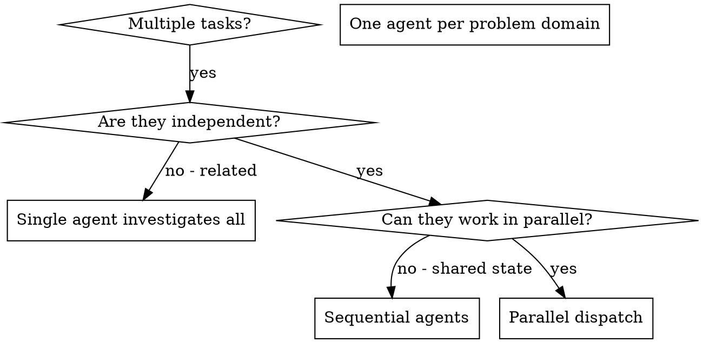

# Dispatching Parallel Agents

## Overview

When you have multiple independent tasks (research, analysis, debugging, exploration), executing them sequentially wastes time. Each task is independent and can happen in parallel while minimizing main context window usage.

**Core principle:** Dispatch one agent per independent problem domain. Let them work concurrently. Track progress with todos.

## When to Use



**Use when:**
- 2+ independent research tasks (market analysis, technical review, API exploration)
- 3+ test files failing with different root causes
- Multiple subsystems broken independently
- Each task can be completed without context from others
- No shared state between investigations
- Need to minimize main context window usage

**Don't use when:**
- Tasks are related (completing one affects others)
- Need to understand full system state first
- Agents would interfere with each other
- Single focused task is better suited for main context

## The Pattern

### 1. Create Todo List

Track tasks and agent assignments:

```markdown
TodoWrite: [
  { content: "Research competitor analysis", status: "in_progress", activeForm: "Researching competitors" },
  { content: "Analyze technical architecture patterns", status: "in_progress", activeForm: "Analyzing architecture" },
  { content: "Review API documentation", status: "in_progress", activeForm: "Reviewing API docs" },
  { content: "Consolidate findings", status: "pending", activeForm: "Consolidating findings" }
]
```

### 2. Identify Independent Domains

Group tasks by problem domain:
- **Research Task 1:** Market competitor analysis (web research)
- **Research Task 2:** Technical architecture review (codebase exploration)
- **Research Task 3:** API pattern analysis (web fetch + code search)

Each domain is independent - researching competitors doesn't affect architecture review.

### 3. Create Focused Agent Tasks

Each agent gets:
- **Specific scope:** One research area or subsystem
- **Clear goal:** What questions to answer
- **Tools needed:** WebSearch, WebFetch, Explore, etc.
- **Expected output:** Summary of findings with sources
- **Context isolation:** Agent runs in separate context to preserve main window

### 4. Dispatch in Parallel (Single Message)

**Critical:** Launch all agents in ONE message to run concurrently:

```typescript
// ✅ CORRECT - Parallel dispatch (single message, multiple tool calls)
Task(general-purpose): "Research competitors for feature X using WebSearch.
Identify top 3 competitors, key features, pricing models.
Return: Markdown summary with source links."

Task(Explore): "Analyze existing authentication patterns in codebase.
Search for Auth*, login*, session* implementations.
Return: List of patterns with file paths."

Task(general-purpose): "Fetch and analyze API documentation from https://api.example.com/docs.
Extract endpoint patterns, auth methods, rate limits.
Return: Structured summary of API design."
```

```typescript
// ❌ WRONG - Sequential dispatch (separate messages)
Task(general-purpose): "Research competitors..."
// Wait for result...
Task(Explore): "Analyze patterns..."
// Wait for result...
Task(general-purpose): "Fetch API docs..."
```

### 5. Review and Integrate

When agents return:
- Read each summary
- Update todos to "completed"
- Consolidate findings in main context
- Verify no conflicts or gaps
- Document results

## Agent Types & Capabilities

| Agent Type | Use Case | Web Research | Codebase Access | Context Impact |
|------------|----------|--------------|-----------------|----------------|
| `general-purpose` | Research, web fetch, full analysis | ✅ WebSearch, WebFetch | ✅ Read, Grep, Glob | Isolated subprocess |
| `Explore` | Fast codebase exploration | ❌ No web access | ✅ Read, Grep, Glob | Isolated subprocess |
| `Plan` | Architecture design | ❌ No web access | ✅ Read, Grep, Glob | Isolated subprocess |
| `Bash` | Git operations, commands | ❌ No web access | ✅ Command execution | Isolated subprocess |

**For web research:** Use `general-purpose` agent type
**For codebase analysis:** Use `Explore` agent type (faster, focused)
**For mixed tasks:** Use `general-purpose` with both web and file tools

## Context Window Optimization

### Problem: Main Context Bloat
- Large web fetch results consume main context
- Multiple research tasks accumulate context quickly
- Less room for implementation work

### Solution: Agent Subprocess Isolation
```markdown
✅ Agent runs in separate subprocess
✅ Only final summary returned to main context
✅ Intermediate research stays in agent context
✅ Main window stays clean for implementation
```

### Background Mode for Long Tasks
```typescript
Task(general-purpose, run_in_background: true):
"Deep research on 10 competitor products.
May take 5+ minutes. Write findings to research-report.md."

// Returns immediately with output_file path
// Use Read tool to check progress later
```

## Research Workflow Example

### Scenario: Technical Research for New Feature

**Goal:** Research authentication patterns before implementation

**Step 1: Create Todos**
```markdown
TodoWrite: [
  { content: "Research OAuth 2.0 best practices", status: "in_progress" },
  { content: "Analyze existing auth patterns in codebase", status: "in_progress" },
  { content: "Review Auth0 vs Firebase Auth", status: "in_progress" },
  { content: "Consolidate recommendations", status: "pending" }
]
```

**Step 2: Dispatch 3 Agents in Parallel (Single Message)**
```markdown
Task(general-purpose):
"Use WebSearch to research OAuth 2.0 best practices for 2026.
Focus on: PKCE flow, token storage, security recommendations.
Search queries: 'OAuth 2.0 PKCE best practices 2026', 'OAuth token security 2026'
Return: Markdown summary with authoritative sources (IETF, OWASP, major tech blogs)"

Task(Explore):
"Analyze authentication patterns in codebase.
Search for: auth*, login*, session*, token* patterns.
Grep for authentication libraries and implementations.
Return: List of existing patterns with file paths and usage examples"

Task(general-purpose):
"Compare Auth0 vs Firebase Auth using WebFetch and WebSearch.
Fetch: https://auth0.com/docs and https://firebase.google.com/docs/auth
Compare: pricing, features, integration complexity, scalability.
Return: Comparison table with pros/cons and recommendation"
```

**Step 3: Agents Work Concurrently**
- Agent 1: Searches web for OAuth best practices
- Agent 2: Explores codebase for existing patterns
- Agent 3: Fetches and compares Auth0 vs Firebase docs

**Step 4: Review Results**
- Read Agent 1 summary: OAuth 2.0 recommendations with IETF sources
- Read Agent 2 summary: Found 3 existing auth patterns in `src/auth/`
- Read Agent 3 summary: Auth0 recommended for flexibility, Firebase for speed

**Step 5: Update Todos & Consolidate**
```markdown
TodoWrite: [
  { content: "Research OAuth 2.0 best practices", status: "completed" },
  { content: "Analyze existing auth patterns in codebase", status: "completed" },
  { content: "Review Auth0 vs Firebase Auth", status: "completed" },
  { content: "Consolidate recommendations", status: "in_progress" }
]

// Consolidate findings in main context (minimal text)
## Authentication Research Summary
- **Standard:** OAuth 2.0 with PKCE flow (IETF RFC 8252)
- **Existing patterns:** src/auth/session.ts (session-based), src/auth/jwt.ts (JWT)
- **Recommendation:** Auth0 (better for our scale + existing JWT pattern)
- **Next steps:** Implement OAuth 2.0 PKCE flow with Auth0 integration
```

**Context Window Impact:**
- ❌ **Without agents:** 3 large web fetches + codebase searches = ~15,000 tokens in main context
- ✅ **With agents:** 3 concise summaries = ~1,500 tokens in main context
- **Savings:** 90% context reduction

## Agent Prompt Structure

Good agent prompts are:
1. **Focused** - One clear research domain or problem area
2. **Self-contained** - All context needed (URLs, search terms, file patterns)
3. **Specific about output** - What format? What details? What sources?
4. **Tool-aware** - Specify WebSearch, WebFetch, Grep, etc.

```markdown
✅ GOOD AGENT PROMPT:

Research Next.js 15 app router best practices using WebSearch.

Search queries:
- "Next.js 15 app router best practices 2026"
- "Next.js server components performance optimization"
- "Next.js 15 data fetching patterns"

Focus on:
1. Server vs Client Component patterns
2. Data fetching recommendations (fetch, cache, revalidate)
3. Performance optimization tips
4. Common pitfalls to avoid

Return format:
## Next.js 15 Best Practices
### Server vs Client Components
[findings with examples]
### Data Fetching
[findings with code samples]
### Performance
[optimization tips]

Sources:
- [Title 1](URL 1)
- [Title 2](URL 2)
```

```markdown
❌ BAD AGENT PROMPT:

Research Next.js stuff

// Too vague - agent doesn't know:
// - What version?
// - What aspect of Next.js?
// - What output format?
// - Web search or code analysis?
```

## Common Mistakes

**❌ Too broad:** "Research everything about authentication" - agent gets lost
**✅ Specific:** "Research OAuth 2.0 PKCE flow best practices with sources"

**❌ No context:** "Find the competitor info" - agent doesn't know where or what
**✅ Context:** "WebSearch for 'Notion competitor analysis 2026' and list top 5 with features"

**❌ No output format:** "Research and return info" - returns 10 pages of unstructured text
**✅ Specific format:** "Return markdown table with columns: Product, Features, Pricing, Pros, Cons"

**❌ Sequential dispatch:** Send tasks in separate messages - runs one at a time
**✅ Parallel dispatch:** Send all tasks in single message - runs concurrently

**❌ No tools specified:** "Research API patterns" - uses wrong tools
**✅ Tools specified:** "Use Grep to search for 'api/*' patterns, use WebFetch to analyze docs"

## When NOT to Use

**Related tasks:** Completing one affects others - do together first
**Need full context:** Understanding requires seeing entire system state
**Exploratory work:** You don't know what you're looking for yet
**Shared state:** Agents would interfere (editing same files, using same resources)
**Simple tasks:** Single focused search is better suited for main context

## Debugging Example (Original Use Case)

**Scenario:** 6 test failures across 3 files after major refactoring

**Failures:**
- agent-tool-abort.test.ts: 3 failures (timing issues)
- batch-completion-behavior.test.ts: 2 failures (tools not executing)
- tool-approval-race-conditions.test.ts: 1 failure (execution count = 0)

**Decision:** Independent domains - abort logic separate from batch completion separate from race conditions

**Dispatch:**
```markdown
Task(general-purpose): "Fix agent-tool-abort.test.ts failures.
3 tests failing: 'should abort tool with partial output', 'should handle mixed completed/aborted', 'should track pendingToolCount'.
Root cause: timing/race conditions.
Fix by replacing timeouts with event-based waiting.
Return: Summary of root cause and changes."

Task(general-purpose): "Fix batch-completion-behavior.test.ts failures.
2 tests failing: tools not executing as expected.
Check event structure and async execution flow.
Return: Summary of bug found and fix applied."

Task(general-purpose): "Fix tool-approval-race-conditions.test.ts failure.
1 test failing: execution count = 0.
Add proper wait for async tool execution to complete.
Return: Summary of issue and solution."
```

**Results:**
- Agent 1: Replaced timeouts with event-based waiting
- Agent 2: Fixed event structure bug (threadId in wrong place)
- Agent 3: Added wait for async tool execution to complete

**Integration:** All fixes independent, no conflicts, full suite green

**Time saved:** 3 problems solved in parallel vs sequentially

## Key Benefits

1. **Parallelization** - Multiple investigations/research happen simultaneously
2. **Context window optimization** - Agent subprocesses isolate bloat from main context
3. **Focus** - Each agent has narrow scope, less context to track
4. **Independence** - Agents don't interfere with each other
5. **Speed** - N problems solved in time of 1
6. **Web research** - Full WebSearch + WebFetch access for all agents
7. **Todo tracking** - Clear progress visibility for multi-task workflows

## Verification Checklist

After agents return:
- [ ] **Review each summary** - Understand what was found/changed
- [ ] **Check for conflicts** - Did agents produce conflicting recommendations?
- [ ] **Update todos** - Mark completed tasks
- [ ] **Consolidate findings** - Synthesize into actionable next steps
- [ ] **Verify sources** - Check that web research includes authoritative citations
- [ ] **Run validation** - Tests pass? Research findings verified?
- [ ] **Spot check** - Agents can make systematic errors (verify critical findings)

## Real-World Impact

**From debugging session (2025-10-03):**
- 6 failures across 3 files
- 3 agents dispatched in parallel
- All investigations completed concurrently
- All fixes integrated successfully
- Zero conflicts between agent changes

**From research session (2026-03-10):**
- 3 research domains (market, technical, API)
- 3 agents dispatched in parallel (2 general-purpose + 1 Explore)
- WebSearch + WebFetch + codebase analysis completed concurrently
- Context window usage: 90% reduction vs sequential approach
- Findings consolidated in <2000 tokens vs >15000 tokens
- Time saved: ~15 minutes (parallel vs sequential research)

## Advanced: Background Mode for Long Research

For research tasks that may take 5+ minutes:

```markdown
Task(general-purpose, run_in_background: true):
"Comprehensive competitive analysis of 10 products.

For each product:
1. WebSearch for official website
2. WebFetch homepage and /pricing page
3. Extract: features, pricing, target market, unique value prop

Products: Notion, Coda, ClickUp, Asana, Monday, Airtable, Smartsheet, Trello, Basecamp, Linear

Return format: Markdown table with columns: Product, Key Features, Pricing, Target Market, Unique Value

Write findings to: docs/research/competitive-analysis-2026.md"

// Returns immediately with output_file path
// Check progress: Read the output_file
// Or wait to be notified when complete
```

## Template Prompts

### Research Template
```markdown
Task(general-purpose):
"Research [TOPIC] using WebSearch and WebFetch.

Search queries:
- "[SEARCH QUERY 1]"
- "[SEARCH QUERY 2]"

URLs to fetch:
- [URL 1]: [what to extract]
- [URL 2]: [what to extract]

Focus on:
1. [ASPECT 1]
2. [ASPECT 2]
3. [ASPECT 3]

Return format:
[MARKDOWN STRUCTURE]

Sources:
- [Title](URL) - Required for all findings
"
```

### Codebase Analysis Template
```markdown
Task(Explore):
"Analyze [FEATURE/PATTERN] in codebase.

Search patterns:
- Glob: [FILE PATTERN]
- Grep: [CODE PATTERN]

Find:
1. [WHAT TO FIND 1]
2. [WHAT TO FIND 2]

Return:
- File paths with line numbers
- Code examples (max 10 lines each)
- Usage patterns summary
"
```

### Mixed Research + Code Template
```markdown
Task(general-purpose):
"Research [LIBRARY/FRAMEWORK] and analyze our current usage.

Part 1 - Web Research:
- WebSearch: '[LIBRARY] best practices 2026'
- WebFetch: [OFFICIAL DOCS URL]

Part 2 - Codebase Analysis:
- Grep for '[LIBRARY IMPORT PATTERN]'
- Identify current usage patterns

Part 3 - Comparison:
- Compare best practices vs our implementation
- Identify gaps and recommendations

Return:
## Current State
[findings from code]

## Best Practices
[findings from web]

## Recommendations
[gap analysis + action items]
"
```
