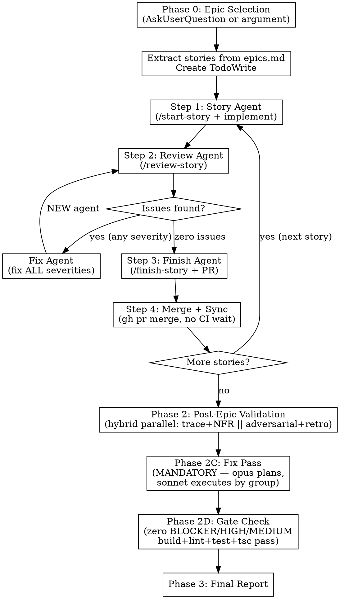

# Epic Orchestrator

Execute an entire epic autonomously — `/start-story` through implementation, `/review-story` (fix ALL issues at every severity), `/finish-story`, post-epic commands, and a comprehensive completion report. The coordinator dispatches fresh sub-agents for each task while staying lean.

## Usage

```
/epic-orchestrator          # Auto-detects what needs work from sprint status, recommends next epic
/epic-orchestrator 20       # Runs Epic 20 directly
```

## Orchestrator Discipline

**See:** [../_shared/orchestrator-principles.md](../_shared/orchestrator-principles.md)

**Additional principles for this skill:**

1. **Never read source code** — sub-agents read and implement
2. **Never read full review reports** — sub-agents summarize findings
3. **Track only**: story ID, status, PR URL, issue counts, round number
4. **TodoWrite is the state machine** — all progress tracked there
5. **Template prompts** — fill variables from [docs/agent-prompt-templates.md](docs/agent-prompt-templates.md)
6. **Fresh agent per task** — never reuse agents across rounds or stories
7. **Use `/auto-answer autopilot`** — include in EVERY sub-agent prompt to prevent blocking on Q&A
8. **Coordinator never invokes skills** — the coordinator must NEVER call `/auto-answer`, `/start-story`, `/review-story`, `/finish-story`, or any other skill directly. Only dispatched sub-agents activate skills

### Quality Standard

**ALL issues must be fixed** — BLOCKER, HIGH, MEDIUM, LOW, NITS. No exceptions. Items verified as false positives are classified as NON-ISSUE and excluded from the fix requirement. The review loop continues until `/review-story` returns zero real findings. Zero tolerance. Everything perfect.

## Output Discipline

Sub-agents generate heavy tool call output (bash, read, edit, glob...) that floods the conversation. The orchestrator must provide a **scannable, high-level experience** so the user always knows what's happening without drowning in noise.

### Rule 1: Background Agents

**Always dispatch sub-agents with `run_in_background: true`**. This keeps intermediate tool calls out of the coordinator's context window — critical for full epic runs where 5+ stories x 4 steps would otherwise exhaust context. The coordinator is notified when each agent completes and extracts only the structured return data.

### Rule 2: Status Banners

Output a clear banner **before** dispatching each agent and **after** receiving results:

**Before:**
```
━━━━━━━━━━━━━━━━━━━━━━━━━━━━━━━━━━━━━━━━━━━━━
STEP {N}/{TOTAL}: {Action} — {STORY_ID}
━━━━━━━━━━━━━━━━━━━━━━━━━━━━━━━━━━━━━━━━━━━━━
```

**After (with key data from agent return):**
```
━━━━━━━━━━━━━━━━━━━━━━━━━━━━━━━━━━━━━━━━━━━━━
STEP {N} COMPLETE: {Outcome summary}
━━━━━━━━━━━━━━━━━━━━━━━━━━━━━━━━━━━━━━━━━━━━━
{2-3 key data points from agent return}
Next: {what happens next}
```

### Rule 3: Progress Dashboard

After every step change (story status transitions), output the tracking table:

```
| Story   | Status         | PR  | Rounds | Fixed |
|---------|----------------|-----|--------|-------|
| E##-S01 | done           | #42 | 2      | 7     |
| E##-S02 | reviewing (R1) | —   | 1      | —     |
| E##-S03 | queued         | —   | —      | —     |
```

### Rule 4: No Inline Heavy Work

The orchestrator should **never** run commands that produce large output (git diff, npm run build, lint). These belong inside sub-agents. The orchestrator only runs lightweight commands: `git checkout`, `git pull`, `gh pr merge`, `lsof -ti:5173 | xargs kill`.

## Execution Flow



## Phase 0: Epic Selection

**See:** [docs/phase-0-epic-selection.md](docs/phase-0-epic-selection.md) for:
- Epic argument parsing or AskUserQuestion prompt
- Story list extraction from `docs/planning-artifacts/epics.md`
- Status check via `docs/implementation-artifacts/sprint-status.yaml`
- Master TodoWrite creation
- Dev server cleanup (port 5173)

## Phase 1: Story Pipeline (Sequential)

**See:** [docs/phase-1-story-pipeline.md](docs/phase-1-story-pipeline.md) for:
- Step 1: Start + Implement (Story Agent)
- Step 2: Review Loop — **See:** [docs/review-loop.md](docs/review-loop.md) for zero-tolerance review cycle
- Step 3: Finish + PR (Finish Agent)
- Step 4: Merge + Sync (coordinator directly)
- Step 5: Prepare next story (kill dev server, merge main)
- Conflict management strategy

**All agent prompt templates:** [docs/agent-prompt-templates.md](docs/agent-prompt-templates.md)

## Phase 2: Post-Epic Validation + Fix Pass

**See:** [docs/phase-2-post-epic.md](docs/phase-2-post-epic.md) for:
- **Default: hybrid parallel/sequential** dispatch (Groups B1 → B2||B3 → Known Issues → Fix Pass → Gate)
- Group B1 (sequential): Sprint Status → Mark Epic Done
- Group B2 (sequential, concurrent with B3): Testarch Trace (+fix cycle) → Testarch NFR (+fix cycle)
- Group B3 (parallel with B2): Adversarial Review + Retrospective
- Known Issues Register Update (after B2+B3 complete)
- **MANDATORY Fix Pass** — opus planner analyzes ALL findings, sonnet executors implement fixes
- **Gate Check** — zero BLOCKER/HIGH/MEDIUM unresolved before next epic or Phase 3

## Phase 3: Final Report

**See:** [docs/phase-3-final-report.md](docs/phase-3-final-report.md) for:
- Report agent gathers all artifacts
- Saves to `docs/implementation-artifacts/epic-{N}-completion-report-{DATE}.md`

## Error Handling

**See:** [docs/error-handling.md](docs/error-handling.md)

## Agent Types

| Agent | Purpose | Model | Fresh Per | Returns |
|-------|---------|-------|-----------|---------|
| **Story** | `/start-story` + implement | **opus** | Story | Summary, files changed |
| **Review** | `/review-story` | **opus** | Round | Verdict, issue list by severity |
| **Fix** | Fix all review findings | sonnet | Round | Fix count, unfixed items |
| **Finish** | `/finish-story` + PR | sonnet | Story | PR URL, branch |
| **Sprint Status** | `/sprint-status` | sonnet | Epic | Status summary |
| **Trace** | `/testarch-trace` | sonnet | Epic (+revalidation) | Coverage, gate decision |
| **Trace Fix** | Write missing tests | sonnet | When trace finds gaps | Tests added, remaining gaps |
| **NFR** | `/testarch-nfr` | sonnet | Epic (+revalidation) | NFR assessment |
| **NFR Fix** | Fix code-level NFR issues | sonnet | When NFR finds fixable issues | Issues fixed |
| **Fix Pass Planner** | Read all audit findings + code, produce fix plan | **opus** | After all audits complete | Structured fix plan with approach per finding |
| **Fix Pass Executor** | Implement fixes from planner's instructions | sonnet | Per severity group/area | Fix count, remaining issues |
| **Adversarial** | `/review-adversarial` | sonnet | Epic | Findings list |
| **Retro** | `/retrospective` (as Pedro) | sonnet | Epic | Retro doc, lessons |
| **Report** | Final completion report | sonnet | Epic | Report file path |

## Coordinator Data Tracking

Keep two small data structures in-context for the report handoff:

**Stories table:**
```
| Story | Status | PR URL | Review Rounds | Issues Fixed |
|-------|--------|--------|---------------|--------------|
```

**Known issues matched** (already in known-issues.yaml — reference only):
```
KNOWN ISSUES MATCHED:
- KI-NNN: description (re-encountered during E##-S##)
```

**New pre-existing issues** (genuinely new — will be added to known-issues.yaml in Phase 2):
```
NEW PRE-EXISTING ISSUES:
- [SEVERITY] description — file:line (found during E##-S##)
These are the ONLY state in-context. Everything else is in TodoWrite or sub-agent output.

### Persistent Tracking File

In addition to the in-context table, write a persistent markdown tracking file:
`docs/implementation-artifacts/epic-{N}-tracking-{DATE}.md`

Updated after every major step (story start, review round, fix, finish, merge, post-epic command). This file survives context overflow and feeds the Report Agent. See [docs/phase-0-epic-selection.md](docs/phase-0-epic-selection.md) for the template.

### Observed Patterns

Throughout execution, note patterns for the Suggestions section of the final report:
- Issue types that repeat across stories
- Stories that needed 2+ review rounds (and likely causes)
- Review agents that consistently found zero issues
- Pre-existing issues that cluster in specific directories
- Fix agents that introduced new issues

Pass these as `{PASTE_OBSERVED_PATTERNS}` to the Report Agent.

## Verification

After full execution:
1. All stories `done` in sprint-status.yaml
2. Epic status `done`
3. All PRs merged to main
4. `npm run build` passes on main
5. Post-epic reports generated
6. Completion report in `docs/implementation-artifacts/`
7. Zero unfixed issues across all stories
8. Fix pass completed — zero BLOCKER/HIGH/MEDIUM unresolved
9. Gate check passed — build, lint, test, tsc all pass, git clean
