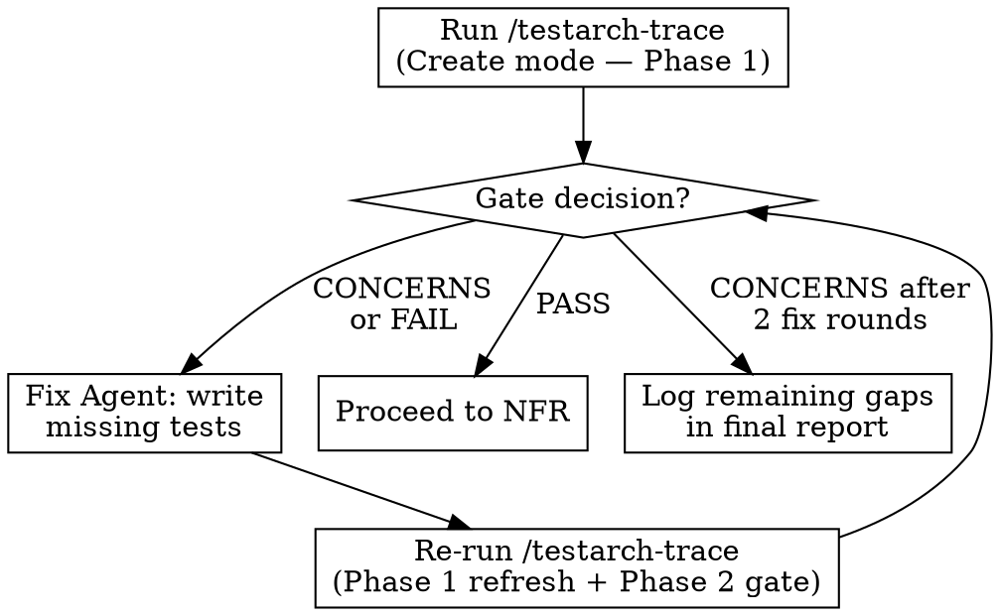

# Phase 2: Post-Epic Commands

## Overview

After all stories are shipped and merged, run post-epic validation commands, then a comprehensive fix pass, then a gate check. Each command runs in a **fresh sub-agent**. These validate the epic's quality, coverage, and capture lessons learned.

**MANDATORY:** Phase 2 includes a comprehensive fix pass (Section 8) after all audits complete. ALL BLOCKER, HIGH, and MEDIUM findings must be resolved before the next epic starts. This is not optional — it was previously skipped and caused 22 known issues to accumulate unfixed.

**4 post-epic commands are mandatory** (sprint-status, testarch-trace, testarch-nfr, retrospective). Adversarial review is optional — only dispatched when the user explicitly requests it or the epic orchestrator is invoked with adversarial review enabled.

Commands with gate decisions (`/testarch-trace`, `/testarch-nfr`) include a **fix-then-revalidate cycle** — aligned with [BMad TEA's official guidance](https://bmad-code-org.github.io/bmad-method-test-architecture-enterprise/how-to/workflows/run-trace/).

## Command Sequence

Run in this exact order (each depends on prior context):

### 1. Sprint Status Check (Sub-Agent)

**Prompt**: Use Sprint Status Agent template from [agent-prompt-templates.md](agent-prompt-templates.md). **Use `run_in_background: true`**. **Use `model: "sonnet"`**.

**Purpose**: Verify all stories are `done`, no orphaned work remains.

**Coordinator after**: Output completion banner with status summary. If issues found, resolve before proceeding.

### 2. Mark Epic Done (Coordinator Directly)

After sprint status confirms all stories done:

```bash
# Edit sprint-status.yaml: change epic status to done
# Example: epic-20: done

git add docs/implementation-artifacts/sprint-status.yaml
git commit -m "chore: mark Epic {N} as done"
git push
```

### 3. Testarch Trace — with Fix-Revalidate Cycle (Sub-Agent)

**Prompt**: Use Testarch Trace Agent template from [agent-prompt-templates.md](agent-prompt-templates.md). **Use `run_in_background: true`** for all agents in this cycle (trace, fix, revalidation). **Use `model: "sonnet"`** for all agents in this cycle.

**Purpose**: Generate requirements-to-tests traceability matrix. Identifies coverage gaps.

**Gate decisions**: `PASS` / `CONCERNS` / `FAIL`

**Fix-Revalidate cycle** (per [BMad TEA guidance](https://bmad-code-org.github.io/bmad-method-test-architecture-enterprise/how-to/workflows/run-trace/)):



**Coordinator actions:**
- If `PASS` → note coverage %, proceed to NFR
- If `CONCERNS` or `FAIL` → spawn **Fix Agent** to write missing tests for P0/P1 gaps
- After fix → spawn **new Trace Agent** to re-run Phase 1 (refresh coverage) + Phase 2 (gate decision)
- Max 2 fix rounds. If still `CONCERNS` after 2 rounds → accept and log remaining gaps in final report
- `FAIL` that persists after 2 rounds → log as critical gap in final report

### 4. Testarch NFR — with Fix-Revalidate Cycle (Sub-Agent)

**Prompt**: Use Testarch NFR Agent template from [agent-prompt-templates.md](agent-prompt-templates.md). **Use `run_in_background: true`** for all agents in this cycle. **Use `model: "sonnet"`** for all agents in this cycle.

**Purpose**: Assess non-functional requirements (performance, security, reliability, maintainability).

**Gate decisions**: `PASS` / `CONCERNS` / `FAIL`

**Fix-Revalidate cycle** (per [BMad TEA tri-modal design](https://github.com/bmad-code-org/bmad-method-test-architecture-enterprise/blob/main/README.md)):

**Coordinator actions:**
- If `PASS` → note assessment, proceed to adversarial review
- If `CONCERNS` or `FAIL` → classify findings:
  - **Fixable** (code-level: missing error handling, security patches, performance fixes) → spawn **Fix Agent**
  - **Architectural** (design changes, infrastructure) → log in final report as deferred
- After fix → spawn **new NFR Agent** in Validate mode to re-evaluate against checklist
- Max 2 fix rounds. If still `CONCERNS` after 2 rounds → accept and log remaining issues
- `FAIL` that persists → log as critical issue in final report

### 5. Adversarial Review (Sub-Agent) — Optional, Report Only

**Prompt**: Use Adversarial Review Agent template from [agent-prompt-templates.md](agent-prompt-templates.md). **Use `run_in_background: true`**. **Use `model: "sonnet"`**.

**Purpose**: Cynical critique of epic scope and implementation. Identifies at least 10 issues.

**Optional** — only dispatched when the user explicitly requests it or the epic is invoked with adversarial review enabled. Skip by default.

**No fix cycle** — findings are informational. They represent opinions and scope critiques, not pass/fail gates.

**Coordinator after**: Output completion banner with findings count. Include in final report.

### 6. Retrospective (Sub-Agent) — Report Only

**Prompt**: Use Retrospective Agent template from [agent-prompt-templates.md](agent-prompt-templates.md). **Use `run_in_background: true`**. **Use `model: "sonnet"`**.

**Purpose**: Post-epic review with lessons learned and action items for next epic.

**No fix cycle** — this is a reflective conversation, not a validation gate.

**Critical**: The retrospective agent acts as Pedro (the developer) in the party mode dialogue. It must:
- Think analytically before each answer
- Consider if the answer is the best possible
- Draw from actual implementation experience
- Be honest and constructive

**Coordinator after**: Output completion banner with retro document path and key action items. Mark `epic-{N}-retrospective: done` in `sprint-status.yaml`.

### 7. Known Issues Register Update (Coordinator Directly)

After all post-epic commands complete, the coordinator updates `docs/known-issues.yaml` with genuinely NEW pre-existing issues discovered during this epic.

**Input:** The `NEW PRE-EXISTING ISSUES` list accumulated during Phase 1 review loops.

**Steps:**

1. Re-read `docs/known-issues.yaml` to get the current last KI number (may have changed if another process updated it).
2. For each NEW pre-existing issue, append a YAML entry:
   ```yaml
   - id: KI-{NEXT_NUMBER}
     type: {type}           # test | lint | typecheck | build | design | code
     summary: "{summary}"
     file: "{file:line}"
     severity: {severity}
     discovered_by: {STORY_ID_THAT_FOUND_IT}
     discovered_on: {TODAY_DATE}
     status: open
     scheduled_for: null
     fixed_by: null
     notes: "Discovered during Epic {N} orchestrated run."
   ```
3. Commit the updated register:
   ```bash
   git add docs/known-issues.yaml
   git commit -m "chore(Epic {N}): add {COUNT} new known issues (KI-{FIRST} to KI-{LAST})"
   git push
   ```

**Skip conditions:**
- If the NEW pre-existing issues list is empty, skip this step entirely.
- If an issue was already added to `known-issues.yaml` by a `/review-story` sub-agent (check by file path and summary), do not duplicate it.

**Coordination with /review-story:** The standalone `/review-story` skill has its own known-issues logging workflow. When running inside the epic orchestrator, review agents classify issues as KNOWN, NEW PRE-EXISTING, or STORY-RELATED — the coordinator handles all register writes in this single Phase 2 step to prevent concurrent modification and ensure proper KI-NNN sequencing.

### 8. Comprehensive Fix Pass (MANDATORY — Two-Stage: Plan then Execute)

After all post-epic commands complete and all reports are available, the coordinator runs a two-stage fix pass: an opus planning agent analyzes everything, then sonnet execution agents implement the plan.

**This is NOT the same as the trace/NFR fix-revalidate cycles** — those fix specific coverage gaps and code-level NFR issues. The comprehensive fix pass addresses ALL remaining findings from ALL audits (trace, NFR, adversarial) that weren't resolved in the embedded cycles.

#### Stage 1: Fix Pass Planning Agent (opus)

Dispatch a **single opus agent** that:

1. Reads all audit reports (trace, NFR, adversarial) to collect unresolved findings
2. Reads relevant source code for each finding to understand context
3. Triages findings by severity: BLOCKER → HIGH → MEDIUM → LOW → NIT
4. Identifies dependencies between fixes (fixing A may also resolve B)
5. Groups findings by file/area for efficient execution (not just severity)
6. Determines the specific fix approach for each finding
7. Flags any false positives with reasoning

**Prompt**: Use Fix Pass Planning Agent template from [agent-prompt-templates.md](agent-prompt-templates.md). **Use `run_in_background: true`**. **Use `model: "opus"`**.

**Returns:** A structured fix plan with groups, fix approaches, LOW/NIT triage, and false positives. See agent template for exact format.

#### Stage 2: Fix Pass Execution Agents (sonnet)

The coordinator parses the planning agent's fix plan and dispatches sonnet execution agents:

**Prompt**: Use Fix Pass Execution Agent template from [agent-prompt-templates.md](agent-prompt-templates.md). **Use `run_in_background: true`**. **Use `model: "sonnet"`**.

Dispatch rules:

1. One agent per GROUP from the plan (grouped by area, not just severity)
2. Groups with BLOCKER findings dispatch first and must complete before others
3. Remaining groups can run concurrently (up to 3 parallel agents)
4. Each agent receives the specific fix instructions from the plan — they implement, not analyze

#### Stage 3: Handle LOW + NIT

From the planning agent's LOW/NIT TRIAGE section:

- Items marked QUICK FIX → include in an execution agent
- Items marked DEFER → add to `docs/known-issues.yaml` with proper KI-NNN IDs

#### Stage 4: Verify

After all execution agents complete:

```bash
npm run build && npm run lint && npm run test:unit && npx tsc --noEmit
```

If fixes introduce new issues → dispatch another execution agent with the specific failures (max 2 fix rounds total).

#### Stage 5: Commit Fix Pass Results

```bash
git add -A
git commit -m "fix(Epic {N}): comprehensive post-epic fix pass — {summary}"
git push
```

### 9. Epic Gate Check

Before starting the next epic (or proceeding to Phase 3 if this is the last epic):

**All must be true:**

- [ ] `sprint-status.yaml` shows current epic as `done`
- [ ] `git status` is clean (no uncommitted changes)
- [ ] Zero BLOCKER findings unresolved
- [ ] Zero HIGH findings unresolved
- [ ] Zero MEDIUM findings unresolved
- [ ] `npm run build` passes
- [ ] `npm run lint` passes
- [ ] `npm run test:unit` passes
- [ ] `npx tsc --noEmit` passes

**If gate fails:** Identify the blocking item and dispatch a targeted fix agent. Do NOT proceed to the next epic with unresolved BLOCKER/HIGH/MEDIUM findings.

**Output:**

```text
━━━━━━━━━━━━━━━━━━━━━━━━━━━━━━━━━━━━━━━━━━━━━
GATE CHECK: Epic {N} — {PASS or FAIL}
━━━━━━━━━━━━━━━━━━━━━━━━━━━━━━━━━━━━━━━━━━━━━
Stories shipped: {N}
Findings fixed: {N} (fix pass) + {N} (trace/NFR cycles)
Deferred to known-issues: {N} LOW/NIT items
Build/lint/test/tsc: all pass
Next: {Phase 3: Final Report | Epic {N+1}}
```

## Post-Epic TodoWrite Updates

```
[x] Sprint status check — all stories done
[x] Mark epic done — committed
[x] Testarch trace — coverage: {N}%, gate: {DECISION}
[x] Testarch trace fix round 1 — {N} tests added (if needed)
[x] Testarch trace revalidation — gate: {DECISION} (if needed)
[x] Testarch NFR — gate: {DECISION}
[x] Testarch NFR fix round 1 — {N} issues fixed (if needed)
[x] Testarch NFR revalidation — gate: {DECISION} (if needed)
[x] Adversarial review — {N} findings
[x] Retrospective — {path}
[x] Known issues register — {N} new issues added (KI-{FIRST} to KI-{LAST})
[x] Fix pass planning (opus) — {N} findings triaged, {N} groups, {N} false positives
[x] Fix pass execution round 1 — {N} fixed across {N} groups
[x] Fix pass execution round 2 — {N} fixed (if needed, max 2 rounds)
[x] Gate check — {PASS/FAIL}
```

## Commit Post-Epic Artifacts

After all post-epic commands complete (including any fix rounds):

```bash
git add docs/implementation-artifacts/ docs/reviews/ docs/known-issues.yaml tests/
git commit -m "docs(Epic {N}): add post-epic validation reports and test coverage fixes"
git push
```

After each post-epic command completes, **update the tracking file** Post-Epic Validation table with status, result, and notes.

## Command Dispatch Order

**Default: Hybrid parallel/sequential** — commands are grouped by dependencies. Groups with no dependencies run concurrently.

| Group | Commands | Constraint |
|-------|----------|-----------|
| B1 (sequential) | Sprint Status → Mark Epic Done | Must confirm done before audits |
| B2 (sequential) | Testarch Trace (+ fix cycle) → Testarch NFR (+ fix cycle) | Trace fixes may add tests NFR evaluates |
| B3 (parallel) | Adversarial Review, Retrospective | No dependencies on each other |

**Execution order:**

1. Run **Group B1** first (sequential — must complete before B2/B3)
2. Dispatch **Group B2** and **Group B3** concurrently (up to 3 agents simultaneously)
3. Within each group, commands remain sequential
4. After B2+B3 all complete → **Known Issues Register Update** (Section 7)
5. After Known Issues → **Comprehensive Fix Pass** (Section 8)
6. After Fix Pass → **Gate Check** (Section 9)

**Fallback: Fully sequential** — when user requests sequential or context is constrained, run all commands in the original numbered order (1 through 9).
