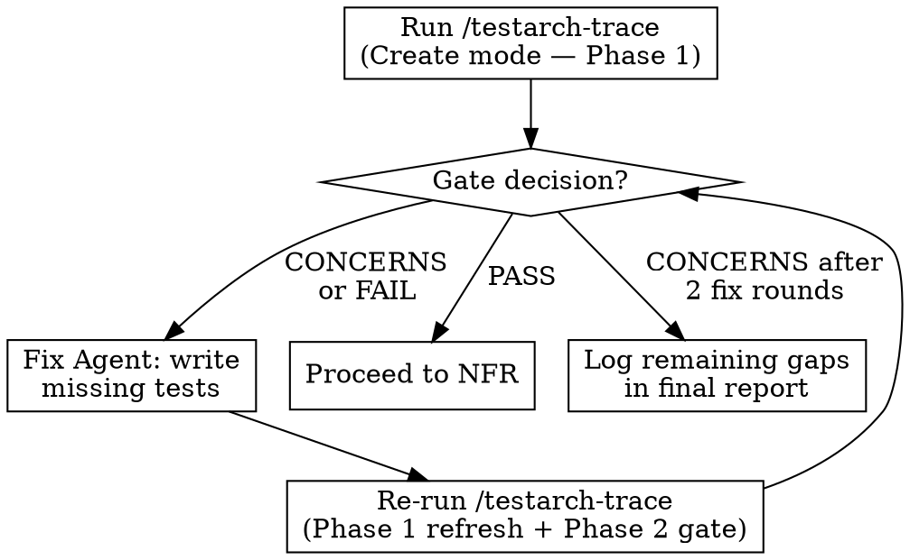

# Phase 2: Post-Epic Commands

## Overview

After all stories are shipped and merged, run post-epic validation commands in order. Each command runs in a **fresh sub-agent**. These validate the epic's quality, coverage, and capture lessons learned.

Commands with gate decisions (`/testarch-trace`, `/testarch-nfr`) include a **fix-then-revalidate cycle** — aligned with [BMad TEA's official guidance](https://bmad-code-org.github.io/bmad-method-test-architecture-enterprise/how-to/workflows/run-trace/).

## Command Sequence

Run in this exact order (each depends on prior context):

### 1. Sprint Status Check (Sub-Agent)

**Prompt**: Use Sprint Status Agent template from [agent-prompt-templates.md](agent-prompt-templates.md).

**Purpose**: Verify all stories are `done`, no orphaned work remains.

**Coordinator after**: If issues found, resolve before proceeding.

### 2. Mark Epic Done (Coordinator Directly)

After sprint status confirms all stories done:

```bash
# Edit sprint-status.yaml: change epic status to done
# Example: epic-20: done

git add docs/implementation-artifacts/sprint-status.yaml
git commit -m "chore: mark Epic {N} as done"
git push
```

### 3. Testarch Trace — with Fix-Revalidate Cycle (Sub-Agent)

**Prompt**: Use Testarch Trace Agent template from [agent-prompt-templates.md](agent-prompt-templates.md).

**Purpose**: Generate requirements-to-tests traceability matrix. Identifies coverage gaps.

**Gate decisions**: `PASS` / `CONCERNS` / `FAIL`

**Fix-Revalidate cycle** (per [BMad TEA guidance](https://bmad-code-org.github.io/bmad-method-test-architecture-enterprise/how-to/workflows/run-trace/)):



**Coordinator actions:**
- If `PASS` → note coverage %, proceed to NFR
- If `CONCERNS` or `FAIL` → spawn **Fix Agent** to write missing tests for P0/P1 gaps
- After fix → spawn **new Trace Agent** to re-run Phase 1 (refresh coverage) + Phase 2 (gate decision)
- Max 2 fix rounds. If still `CONCERNS` after 2 rounds → accept and log remaining gaps in final report
- `FAIL` that persists after 2 rounds → log as critical gap in final report

### 4. Testarch NFR — with Fix-Revalidate Cycle (Sub-Agent)

**Prompt**: Use Testarch NFR Agent template from [agent-prompt-templates.md](agent-prompt-templates.md).

**Purpose**: Assess non-functional requirements (performance, security, reliability, maintainability).

**Gate decisions**: `PASS` / `CONCERNS` / `FAIL`

**Fix-Revalidate cycle** (per [BMad TEA tri-modal design](https://github.com/bmad-code-org/bmad-method-test-architecture-enterprise/blob/main/README.md)):

**Coordinator actions:**
- If `PASS` → note assessment, proceed to adversarial review
- If `CONCERNS` or `FAIL` → classify findings:
  - **Fixable** (code-level: missing error handling, security patches, performance fixes) → spawn **Fix Agent**
  - **Architectural** (design changes, infrastructure) → log in final report as deferred
- After fix → spawn **new NFR Agent** in Validate mode to re-evaluate against checklist
- Max 2 fix rounds. If still `CONCERNS` after 2 rounds → accept and log remaining issues
- `FAIL` that persists → log as critical issue in final report

### 5. Adversarial Review (Sub-Agent) — Report Only

**Prompt**: Use Adversarial Review Agent template from [agent-prompt-templates.md](agent-prompt-templates.md).

**Purpose**: Cynical critique of epic scope and implementation. Identifies at least 10 issues.

**No fix cycle** — findings are informational. They represent opinions and scope critiques, not pass/fail gates.

**Coordinator after**: Note critical findings count. Include in final report.

### 6. Retrospective (Sub-Agent) — Report Only

**Prompt**: Use Retrospective Agent template from [agent-prompt-templates.md](agent-prompt-templates.md).

**Purpose**: Post-epic review with lessons learned and action items for next epic.

**No fix cycle** — this is a reflective conversation, not a validation gate.

**Critical**: The retrospective agent acts as Pedro (the developer) in the party mode dialogue. It must:
- Think analytically before each answer
- Consider if the answer is the best possible
- Draw from actual implementation experience
- Be honest and constructive

**Coordinator after**: Note retro document path and key action items.

## Post-Epic TodoWrite Updates

```
[x] Sprint status check — all stories done
[x] Mark epic done — committed
[x] Testarch trace — coverage: {N}%, gate: {DECISION}
[x] Testarch trace fix round 1 — {N} tests added (if needed)
[x] Testarch trace revalidation — gate: {DECISION} (if needed)
[x] Testarch NFR — gate: {DECISION}
[x] Testarch NFR fix round 1 — {N} issues fixed (if needed)
[x] Testarch NFR revalidation — gate: {DECISION} (if needed)
[x] Adversarial review — {N} findings
[x] Retrospective — {path}
```

## Commit Post-Epic Artifacts

After all post-epic commands complete (including any fix rounds):

```bash
git add docs/implementation-artifacts/ docs/reviews/ tests/
git commit -m "docs(Epic {N}): add post-epic validation reports and test coverage fixes"
git push
```
