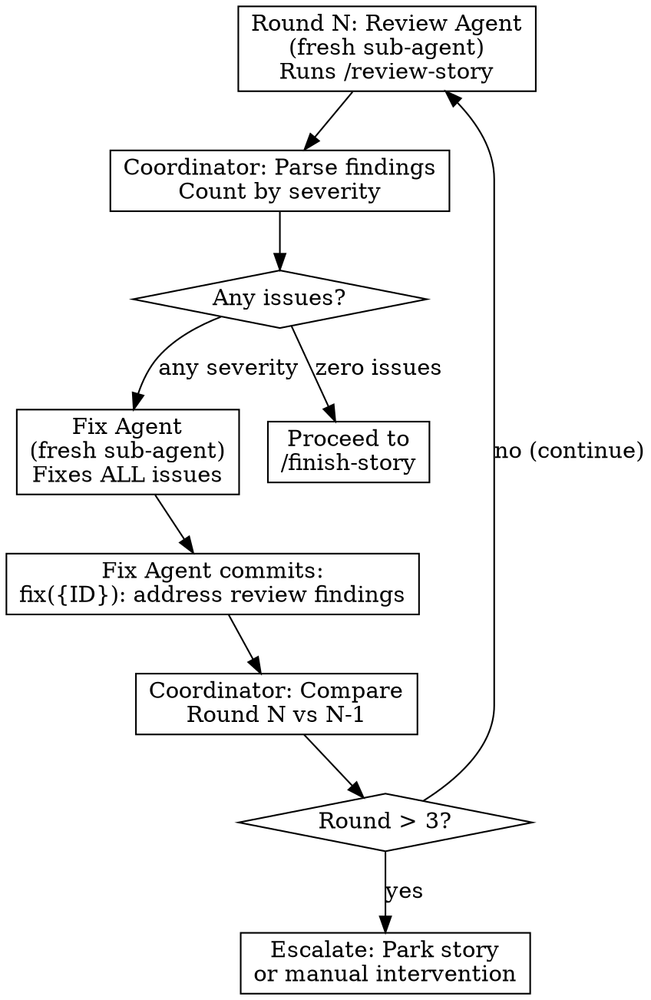

# Review Loop: Zero-Tolerance Quality Cycle

## Overview

The review loop ensures **every issue** found by `/review-story` is fixed — BLOCKER, HIGH, MEDIUM, LOW, and NITS. No exceptions. Each round uses a **fresh sub-agent** for clean context.

## Why Fresh Agents Per Round

- Fresh context window — no stale state from prior analysis
- Review agents see actual current code, not cached diffs
- Each `/review-story` invocation re-runs all gates against committed code
- Prevents accumulated context from biasing the review

## Loop Flow



## Round N: Review Agent

Spawn a **new general-purpose sub-agent** with the Review Agent prompt from [agent-prompt-templates.md](agent-prompt-templates.md). **Use `run_in_background: true`** to keep review output (build, lint, test, agent reports) out of the main conversation.

Before dispatch, output the status banner:
```
━━━━━━━━━━━━━━━━━━━━━━━━━━━━━━━━━━━━━━━━━━━━━
STEP 2/4: Reviewing {STORY_ID} — Round {N}
━━━━━━━━━━━━━━━━━━━━━━━━━━━━━━━━━━━━━━━━━━━━━
```

The review agent runs `/review-story {STORY_ID}` which executes:
1. Pre-checks (build, lint, type-check, format, unit tests, E2E tests)
2. Design review agent (Playwright MCP — needs dev server on 5173)
3. Code review agent (architecture, security, silent failures)
4. Code review testing agent (AC coverage, test quality)

The review agent returns a structured summary:
```
Verdict: PASS or ISSUES FOUND
BLOCKER: {count}
HIGH: {count}
MEDIUM: {count}
LOW: {count}
NITS: {count}

STORY-RELATED ISSUES (in files changed by this story):
- [SEVERITY] description — file:line
- [SEVERITY] description — file:line

PRE-EXISTING ISSUES (in files NOT changed by this story):
- [SEVERITY] description — file:line
- [SEVERITY] description — file:line

Report paths: {paths}
```

## Classifying Issues: Story vs Pre-Existing

Review agents analyze `git diff main...HEAD` to determine which files the story changed. Issues are classified as:

- **Story-related**: Found in files that the story branch modified. These **must be fixed** before shipping.
- **Pre-existing**: Found in files the story did NOT touch — these exist on `main` already. These are **reported to the coordinator** for inclusion in the final report but do NOT block the story.

**The fix agent only fixes story-related issues.** Pre-existing issues are collected by the coordinator and passed to the Report Agent in Phase 3.

### Coordinator pre-existing issue tracking

The coordinator maintains a running list of pre-existing issues across all stories:

```
PRE-EXISTING ISSUES (deferred):
- [MEDIUM] Missing error boundary in Layout.tsx — src/app/components/Layout.tsx:45 (found during E20-S01)
- [LOW] Unused import in Overview.tsx — src/app/pages/Overview.tsx:3 (found during E20-S02)
...
```

This list is passed to the Report Agent to include in the final completion report as "Deferred Issues for Future Fix."

## If Story-Related Issues Found: Fix Agent

Spawn a **new general-purpose sub-agent** with the Fix Agent prompt from [agent-prompt-templates.md](agent-prompt-templates.md). **Use `run_in_background: true`**.

Before dispatch, output the status banner:
```
━━━━━━━━━━━━━━━━━━━━━━━━━━━━━━━━━━━━━━━━━━━━━
FIX: Resolving {N} issues — {STORY_ID} Round {R}
━━━━━━━━━━━━━━━━━━━━━━━━━━━━━━━━━━━━━━━━━━━━━
```

The fix agent receives the **story-related findings only** and must:
1. Read each file at the specified location
2. Understand the problem
3. Implement the correct fix
4. Verify build and lint pass
5. Commit all fixes

**Critical**: Pass the FULL story-related findings list to the fix agent. Don't filter by severity — every story-related issue gets fixed. Pre-existing issues are excluded (they'll go in the final report).

## Coordinator Between Rounds

After each fix agent completes, the coordinator:

1. **Compares issue counts** between Round N and Round N-1:
   - Issues decreasing → progress, continue
   - Issues increasing → fixes may have introduced new problems (normal, next round catches them)
   - Same issues persisting → may need different approach

2. **Checks round count**:
   - Round 1-3: Normal loop, spawn new review agent
   - Round 4+: Escalation decision:
     - If only LOW/NITS remain and count is stable → accept and proceed
     - If BLOCKER/HIGH persist → park story, log reason, move to next
     - Optionally spawn a 4th round with explicit escalated instructions

3. **Adds dynamic TodoWrite items**:
   ```
   [ ] {STORY_ID}: Review Loop (Round 2)
   [ ] {STORY_ID}: Fix Round 2 findings
   ```

## When Clean (Zero Issues)

When the review agent returns `Verdict: PASS` with zero issues across all severities:

1. Coordinator notes: `Review Rounds: {N}, Issues Fixed: {total}`
2. Updates tracking table
3. Marks review TodoWrite items as complete
4. Proceeds to Step 3: Finish + PR

## Edge Cases

### Pre-check failures (build/lint/types)
The review agent handles these within its `/review-story` run — auto-fixes are applied for lint and format. If build fails, the review agent reports it and stops.

### Design review skipped (no UI changes)
If the story has no `.tsx` changes, design review is automatically skipped by `/review-story`. The `design-review-skipped` gate is added instead.

### Fix agent can't fix an issue
The fix agent returns a list of unfixed items with explanations. The coordinator includes these in the next review agent's context so it can verify if the issue is real or a false positive.
