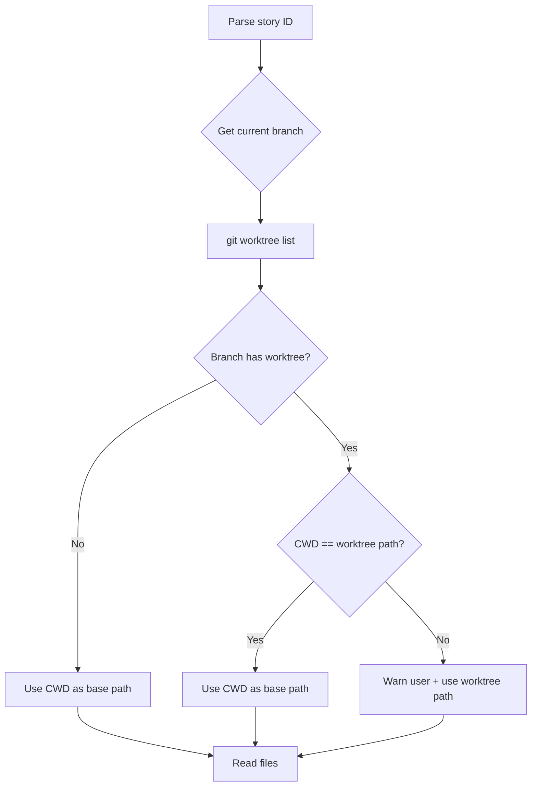

# Worktree Path Resolution Issue

## Problem Statement

When `/start-story` creates a git worktree, all story files (story file, test specs, plans) are created in the worktree directory. If you later run `/review-story` or `/finish-story` from a new terminal session that opens in the main workspace, these skills fail because they can't find the story files — they're looking in the wrong location.

## Root Cause

### `/start-story` Behavior (Step 0)
```bash
# Creates worktree at:
WORKTREE_BASE=$(dirname "$PROJECT_ROOT")/${PROJECT_NAME}-worktrees
# OR inside project at .worktrees/ (based on git worktree list output)

# Changes directory to worktree:
cd "${WORKTREE_BASE}/${STORY_KEY_LOWER}"

# Creates files in worktree:
- docs/implementation-artifacts/{key}.md
- tests/e2e/story-{id}.spec.ts
- docs/implementation-artifacts/plans/{plan}.md
```

### `/review-story` and `/finish-story` Behavior
```markdown
# Step 2 in both skills:
"Read story file from `docs/implementation-artifacts/`"  ← Relative to CWD!
```

**Problem**: When you open a new terminal, CWD defaults to the main workspace, not the worktree. Skills look for files relative to CWD and fail.

## Evidence

### Current State
```bash
# Main workspace
$ pwd
/Volumes/SSD/Dev/Apps/Elearningplatformwireframes

# Worktree for E09-S01
$ git worktree list
/Volumes/SSD/Dev/Apps/Elearningplatformwireframes/.worktrees/e09-s01-ai-provider-configuration-security

# Story file location
$ ls .worktrees/e09-s01-ai-provider-configuration-security/docs/implementation-artifacts/9-1-*
9-1-ai-provider-configuration-security.md  ✅ EXISTS IN WORKTREE

# What skills look for (from main workspace)
$ ls docs/implementation-artifacts/9-1-*
No such file or directory  ❌ DOESN'T EXIST IN MAIN WORKSPACE
```

### When Failure Occurs

**Scenario 1**: Start story in Session 1 (creates worktree)
```bash
Session 1: /start-story E09-S01
→ Creates .worktrees/e09-s01-*/
→ cd .worktrees/e09-s01-*/
→ Story file created in worktree ✅
→ Session ends
```

**Scenario 2**: Review story in Session 2 (new terminal = main workspace)
```bash
Session 2: Opens new terminal → CWD = main workspace
/review-story E09-S01
→ Looks for docs/implementation-artifacts/9-1-*.md in main workspace ❌
→ File not found → skill fails
```

## Solution: Worktree Detection in Review/Finish Skills

Both `/review-story` and `/finish-story` need to detect if they're running in the wrong directory and either:
1. **Warn the user** to run from the worktree
2. **Auto-detect worktree path** and read files from there

### Implementation Strategy

Add a "Worktree Detection" step after story ID parsing (before reading story file):

```bash
# Step 1: Parse story ID (existing)
STORY_ID="E09-S01"
STORY_KEY="9-1-ai-provider-configuration-security"

# Step 1.5: Detect worktree (NEW)
CURRENT_BRANCH=$(git branch --show-current)  # e.g., feature/e09-s01-...
CURRENT_ROOT=$(git rev-parse --show-toplevel)

# Get worktree info for current branch
WORKTREE_INFO=$(git worktree list --porcelain | grep -A 3 "branch refs/heads/$CURRENT_BRANCH")
WORKTREE_PATH=$(echo "$WORKTREE_INFO" | grep "^worktree" | cut -d' ' -f2)

# Check if we're in the worktree or main workspace
if [ -n "$WORKTREE_PATH" ] && [ "$WORKTREE_PATH" != "$CURRENT_ROOT" ]; then
  # Current branch has a worktree, but we're not in it
  echo "⚠️  This story was started in a worktree, but you're in the main workspace."
  echo "📍 Worktree location: $WORKTREE_PATH"
  echo ""
  echo "To run /review-story, either:"
  echo "1. cd $WORKTREE_PATH && /review-story (Recommended)"
  echo "2. Or switch to the worktree branch in your IDE"

  # Option: Auto-use worktree path
  USE_WORKTREE_PATH=true
  BASE_PATH="$WORKTREE_PATH"
else
  # We're in the correct location (either main workspace without worktree, or in the worktree)
  BASE_PATH="$CURRENT_ROOT"
fi

# Step 2: Read story file (using detected base path)
STORY_FILE="$BASE_PATH/docs/implementation-artifacts/$STORY_KEY.md"
if [ ! -f "$STORY_FILE" ]; then
  echo "❌ Story file not found at: $STORY_FILE"
  exit 1
fi
```

### Detection Logic



## Recommended Fix Locations

### `/review-story` (`.claude/skills/review-story/SKILL.md`)
- **Insert after Step 1** (before Step 2 "Read story file"):
  - New Step 1.5: "Detect worktree and resolve base path"
  - Use detected `$BASE_PATH` in all file reads

### `/finish-story` (`.claude/skills/finish-story/SKILL.md`)
- **Insert after Step 1** (before Step 2 "Verify story file"):
  - New Step 1.5: "Detect worktree and resolve base path"
  - Use detected `$BASE_PATH` in all file reads

## Edge Cases

1. **Story started without worktree**: Detection returns CWD → works normally ✅
2. **Story started with worktree, running from worktree**: Detection returns CWD → works ✅
3. **Story started with worktree, running from main workspace**: Detection finds worktree path → uses that ✅
4. **Worktree deleted but branch exists**: Detection fails gracefully → warn user ⚠️
5. **Multiple worktrees**: `git worktree list` with branch filter → correct worktree ✅

## Testing Strategy

```bash
# Test 1: Normal flow (no worktree)
cd /main/workspace
/start-story E10-S01  # Creates branch in main workspace
/review-story E10-S01  # Should work ✅

# Test 2: Worktree flow - same session
cd /main/workspace
/start-story E10-S02  # User selects YES to worktree → cd to worktree
/review-story E10-S02  # Should work (CWD = worktree) ✅

# Test 3: Worktree flow - new session (THIS IS THE BUG)
cd /main/workspace
/start-story E10-S03  # User selects YES to worktree → cd to worktree
# [Close terminal, open new one]
cd /main/workspace
git checkout feature/e10-s03-*
/review-story E10-S03  # Currently fails ❌ → Should detect worktree ✅
```

## Implementation Priority

1. **Phase 1**: Add detection + warning (non-blocking)
   - Skills detect worktree mismatch and warn user with instructions
   - User manually changes directory

2. **Phase 2**: Add auto-path-resolution (transparent)
   - Skills automatically read files from correct location
   - User doesn't need to change directory

Recommend **Phase 2** (auto-resolution) for better UX — users shouldn't need to think about where files are.
