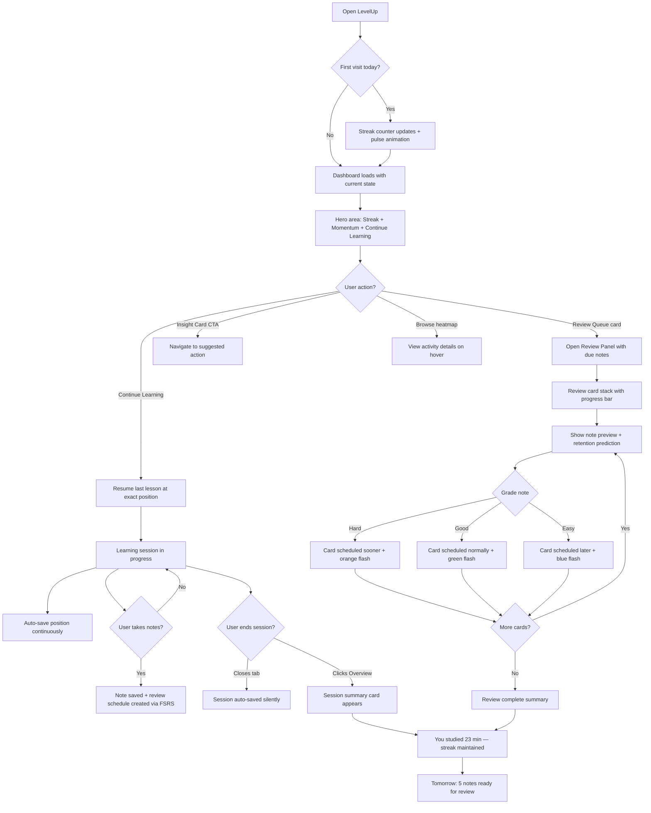
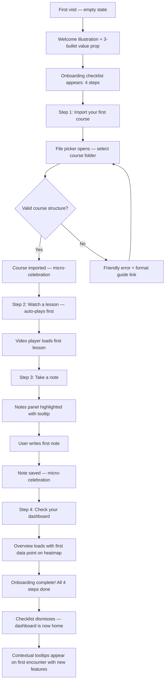
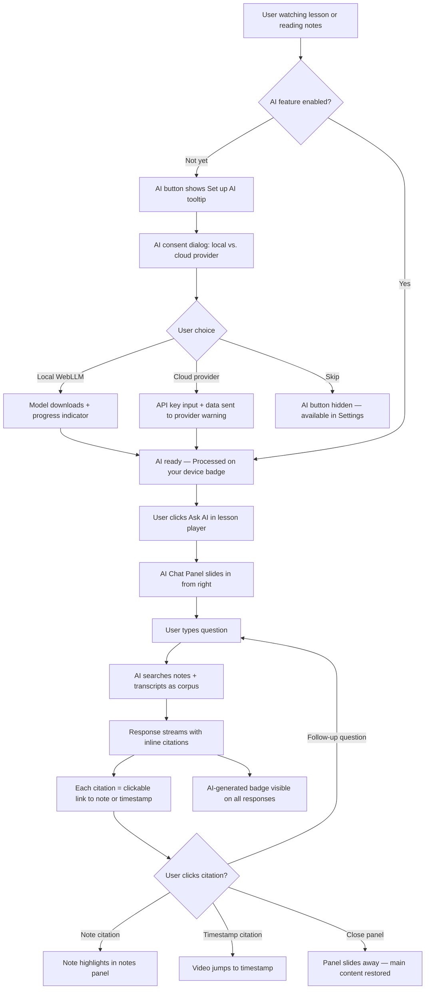
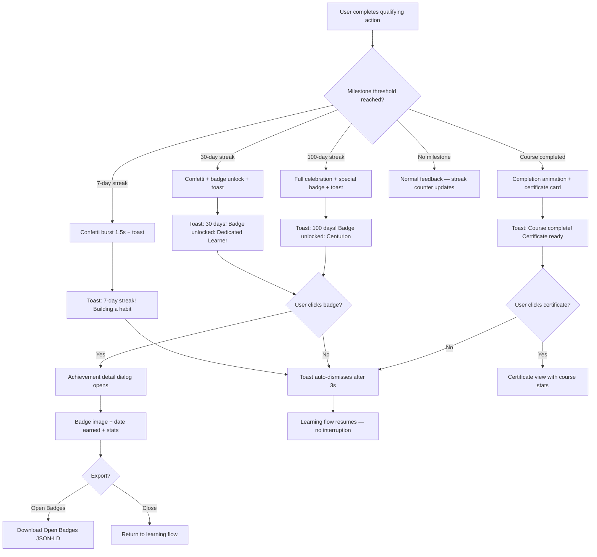
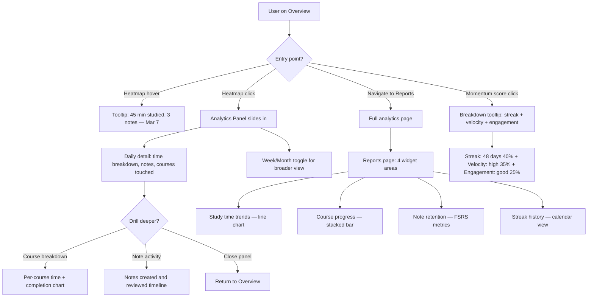
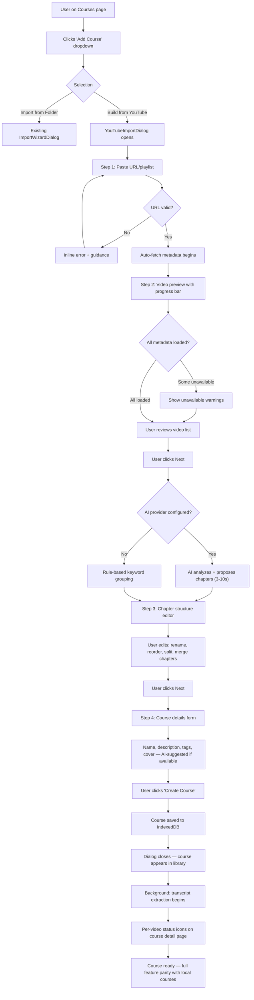

# UX Design Specification: LevelUp

**Author:** Pedro
**Date:** 2026-03-07

---

## Executive Summary

### Project Vision

LevelUp is a **local-first personal learning platform** for self-directed learners who collect courses from multiple sources (Udemy, YouTube, etc.) and struggle with completion. The core problem is "course collection paralysis" — people buy courses but never finish them. LevelUp's architecture is browser-only (IndexedDB + Zustand + File System Access API), with no backend or authentication.

Recent domain research (March 2026) identified a genuinely **unoccupied market niche**: no competitor combines video playback, note-taking, spaced repetition, analytics, and AI tutoring in a single local-first application. Key technological enablers — WebGPU/WebLLM for browser AI, whisper.cpp WASM for local transcription, and ts-fsrs for spaced repetition — are all production-ready in 2026.

### Target Users

A single user persona — the **self-directed adult learner** who:

- Accumulates courses across platforms but lacks a unified system
- Values privacy and data ownership (local-first philosophy)
- Wants mastery-focused learning, not just content consumption
- Ranges from intermediate to advanced tech comfort
- Uses desktop/laptop primarily (Chrome/Edge for File System Access API)

### Key Design Challenges

| # | Challenge | Context |
|---|-----------|---------|
| 1 | **Motivation without manipulation** | Streaks and gamification must support SDT (autonomy, competence, relatedness) rather than exploit loss aversion. 30% of users report streak anxiety (Duolingo CHI 2018). Streak freeze and "total days studied" reframe are critical. |
| 2 | **Analytics that drive action** | Users ignore data-heavy dashboards. "What to do next" insight cards must surface the single most impactful next action. Progressive drill-down keeps default view clean. |
| 3 | **AI trust and transparency** | Local-first AI (WebLLM/whisper.cpp WASM) must clearly communicate what leaves the device vs. stays local. Per-feature consent toggles, source citations linking to notes/timestamps, and visible AI content labeling are non-negotiable. |
| 4 | **Note review that doesn't feel like homework** | Spaced repetition adoption fails when it feels like Anki. Mochi's beautiful card design and 3-grade simplicity (Hard/Good/Easy) are the inspiration. "Review your notes" not "do flashcards." |
| 5 | **Empty state → habit formation** | Onboarding must convert a blank dashboard into a habit. Checklist-based onboarding (3-5 clear first actions) outperforms product tours. Contextual tooltips appear when the user reaches each feature organically. |

### Design Opportunities

| # | Opportunity | Differentiator |
|---|------------|----------------|
| 1 | **GitHub-style activity heatmap** | Visual proof of consistency that appeals to developer-adjacent learners |
| 2 | **Mochi-inspired review UI** | No competitor in the local-first space has beautiful spaced repetition |
| 3 | **NotebookLM-style AI Q&A** | Source-grounded answers with citation links to specific notes and video timestamps |
| 4 | **Momentum scoring** | Single composite score combining streak, completion velocity, engagement health |
| 5 | **Progressive disclosure everywhere** | Overview → insight cards; drill-down → analytics. Review queue → note; expand → full context |

## Core User Experience

### Defining Experience

**The Daily Return Loop** — LevelUp's core experience is a 3-step cycle:

1. **Arrive** → See your momentum (streak, progress, what's due) in <2 seconds
2. **Act** → One click to resume where you left off, review a due note, or tackle a challenge
3. **Close** → See today's impact (time studied, notes reviewed, streak maintained)

Every feature in Epics 5-11 feeds this loop. Gamification (E05-E06) makes **Arrive** rewarding. Analytics (E07-E08) makes **Arrive** informative. AI (E09) enriches **Act**. Onboarding (E10) bootstraps the first loop. Spaced repetition (E11) adds a new **Act** path.

### Platform Strategy

| Dimension | Decision | Rationale |
| --- | --- | --- |
| Platform | Web app (Chrome/Edge desktop) | File System Access API requirement; no mobile until PWA feasibility proven |
| Input | Mouse/keyboard primary | Desktop-first; touch secondary for tablet |
| Offline | Full offline capability | Local-first architecture — IndexedDB + OPFS, no server dependency |
| Device capabilities | FileSystemFileHandle for media, WebGPU for local AI | Chrome 86+ APIs for file re-access; WebGPU for WebLLM inference |
| Responsive | 3 breakpoints (375px, 768px, 1440px) | Sidebar persistent at desktop, collapsible at tablet/mobile |

### Effortless Interactions

| Interaction | Should Feel Like | Implementation Approach |
| --- | --- | --- |
| **Resume learning** | Opening a book to your bookmark | 1-click resume from Overview; auto-save position in video/PDF/notes |
| **Checking progress** | Glancing at a fitness tracker | Momentum score + streak visible immediately on arrival |
| **Reviewing notes** | Flipping through highlighted pages | Mochi-inspired cards surface naturally; 3-tap grading (Hard/Good/Easy) |
| **Getting AI help** | Asking a knowledgeable friend | Type a question → get an answer with citation links to your notes/timestamps |
| **First-time setup** | Unpacking a new tool with clear labels | Checklist onboarding: import a course → watch a lesson → take a note → done |

### Critical Success Moments

| Moment | What Success Feels Like | What Failure Feels Like |
| --- | --- | --- |
| **First course import** | "That was easy — my course is here" | "Where did my files go? What format do I need?" |
| **First streak milestone (7 days)** | "I'm actually sticking with this" + celebration | Silence — no acknowledgment of consistency |
| **First note review** | "Oh, I'd forgotten this — glad it surfaced" | "This feels like a test. I hate flashcards." |
| **First AI Q&A** | "It found the answer in MY notes — with the timestamp" | "Generic AI response with no source — I don't trust this" |
| **Dashboard after 30 days** | "I can see my growth. The heatmap proves it." | "Just numbers. What should I do next?" |

### Experience Principles

| # | Principle | Means | Doesn't Mean |
| --- | --- | --- | --- |
| 1 | **Momentum over metrics** | Show progress as forward motion (streak, velocity, heatmap) | Drowning users in analytics charts and numbers |
| 2 | **Autonomy over obligation** | User chooses what to learn, when to rest (streak freeze), how to review | Guilt-tripping for missed days or incomplete courses |
| 3 | **Surface, don't bury** | One insight card beats ten chart tabs; one resume button beats a course catalog | Hiding actionable information behind navigation layers |
| 4 | **Earn trust through transparency** | Show AI sources, label AI content, per-feature consent, local-first default | Black-box AI or silent data transmission |
| 5 | **Beauty invites habit** | Mochi-quality review cards, satisfying celebrations, warm visual design | Utilitarian UI that feels like enterprise software |

## Desired Emotional Response

### Primary Emotional Goals

| Goal | Description | Why It Matters |
| --- | --- | --- |
| **Capable** | "I'm actually making progress — I can see it" | Addresses the core problem: course paralysis makes learners feel incompetent. Competence is a core SDT need. |
| **In control** | "My data is mine, my pace is mine, my path is mine" | Autonomy is the strongest SDT predictor of persistence (+30% per Vansteenkiste 2004). Local-first architecture is an emotional promise, not just a technical choice. |
| **Proud** | "Look at what I've built — 47 days, 12 courses, real knowledge" | Streak milestones, heatmaps, and achievement badges externalize internal progress. Pride drives word-of-mouth. |

### Emotional Journey Mapping

| Stage | Desired Emotion | Design Driver |
| --- | --- | --- |
| **Discovery** (first visit) | Curiosity + clarity | Clean empty state with illustration + "Here's what LevelUp does" in 3 bullets. No feature overwhelm. |
| **Onboarding** (first 5 min) | Confidence + momentum | Checklist shows exactly what to do. Each step completion triggers micro-celebration. "3 of 5 done!" |
| **Daily return** (Arrive) | Anticipation + recognition | "Welcome back" is implicit — streak counter, today's review queue, and resume button say "we remember you." |
| **Core learning** (Act) | Flow + focus | Minimal chrome during video/reading. Notes appear alongside, not on top. AI help is a quiet button, not a popup. |
| **Session close** (Close) | Satisfaction + earned rest | "You studied 23 minutes today" with warm confirmation. Streak maintained. No guilt about stopping. |
| **Mistake/error** | Forgiveness + recovery | Streak freeze absorbs a missed day. "You've studied 47 of the last 50 days" reframes the miss. Data never lost (local-first). |
| **Long absence** (return after gap) | Welcome, not guilt | "Welcome back! Your notes are waiting." Show total progress, not the gap. Soft re-engagement, not "You broke your streak!" |

### Micro-Emotions

| Positive (Cultivate) | Negative (Prevent) | Prevention Strategy |
| --- | --- | --- |
| **Confidence** — "I know what to do next" | **Confusion** — "What am I supposed to click?" | Insight cards with clear CTAs; progressive disclosure |
| **Trust** — "My data is safe and private" | **Skepticism** — "Is this AI sending my notes somewhere?" | Visible "processed locally" badges; per-feature consent toggles |
| **Delight** — "That celebration was satisfying!" | **Anxiety** — "I'll lose my streak if I miss tomorrow" | Streak freeze available; "total days studied" alongside streak count |
| **Accomplishment** — "I finished something real" | **Overwhelm** — "I have 47 courses and no idea where to start" | Smart sorting by momentum; "continue where you left off" as default |
| **Belonging** — "This tool gets how I learn" | **Isolation** — "Am I the only person who uses this?" | Warm visual design; instructor presence in courses; community-ready architecture |

### Design Implications

| Emotion → Design Choice | Implementation |
| --- | --- |
| **Capable** → Progressive competence feedback | Momentum score rises visibly with each session. Course progress bars use color-coded stages (gray → blue → green). |
| **In control** → Visible user agency | Streak freeze toggle in settings. AI consent per-feature. Export data anytime. No "you must" language. |
| **Proud** → Celebration moments | Confetti burst at 7/30/100-day streaks (Duolingo-inspired). Achievement badges with Open Badges export. Heatmap fills in like a garden growing. |
| **Trust** → Transparency affordances | "Processed on your device" chip next to local AI features. Source citations with clickable links in AI responses. Clear "AI-generated" labels. |
| **Forgiveness** → Soft failure states | Streak freeze auto-activates before break. "Total days studied" always visible. Return screen shows cumulative progress, never the gap. |

### Emotional Design Principles

| # | Principle | Application |
| --- | --- | --- |
| 1 | **Celebrate consistency, not perfection** | 7 of 7 days and 5 of 7 days both get positive reinforcement. Rest days are healthy, not failures. |
| 2 | **Show growth, never decline** | Heatmap shows what was done, not what was missed. Analytics trend lines emphasize upward trajectory. |
| 3 | **Warmth over clinical** | `#FAF5EE` warm background, rounded cards, friendly copy ("Your notes are ready for review" not "3 items due"). |
| 4 | **Earn delight, don't spam it** | Celebrations only at meaningful milestones (7/30/100 days, course completion). No daily "Great job!" notifications. |
| 5 | **Silence is consent to continue** | No "Are you still there?" interruptions. No "You haven't studied today" push notifications. The app waits patiently. |

## UX Pattern Analysis & Inspiration

### Inspiring Products Analysis

#### 1. Mochi — Spaced Repetition with Soul

Cards are beautiful, typography is considered, and the review experience feels like reading a well-designed book rather than grinding flashcards.

| Pattern | Detail | LevelUp Application |
| --- | --- | --- |
| **Card aesthetics** | Soft shadows, generous whitespace, warm colors, Markdown rendering | Review queue cards should feel like beautiful note previews, not quiz items |
| **3-grade simplicity** | Hard / Good / Easy — no 6-point cognitive load | Direct adoption for FR80 note review rating |
| **Next review visibility** | Shows when card returns before you grade | Show "Next review: 3 days" after grading a note — builds predictability |
| **Retention prediction** | Shows estimated recall probability | Display per-note retention percentage in review queue (FR81) |
| **Deck organization** | Clean folder/tag structure with card counts | Notes organized by course + tag, with "due for review" counts |

#### 2. NotebookLM — AI That Cites Its Sources

Every AI answer links back to the source document. You never wonder "where did this come from?" — every claim has a clickable citation.

| Pattern | Detail | LevelUp Application |
| --- | --- | --- |
| **Source grounding** | Every AI answer cites specific passages with page/section references | AI Q&A (FR49) citations link to note title + video timestamp |
| **Upload-first model** | Users provide their own documents — AI works within YOUR corpus | LevelUp's notes and transcripts ARE the corpus — no external data needed |
| **Clear AI labeling** | Distinct visual treatment for AI-generated vs. source content | "AI-generated" badge on all summaries, Q&A answers, auto-tags (NFR69) |
| **Conversational Q&A** | Chat-style interface, follow-up questions maintain context | AI panel uses chat format with history within session |
| **Source panel** | Side-by-side view: AI answer on left, source documents on right | Split view: AI response with clickable citations → note/video jump |

#### 3. Duolingo — Streak Psychology Done Right

Gold standard for streak UX — but also a cautionary tale. They've iterated publicly on reducing streak anxiety while keeping engagement.

| Pattern | Detail | LevelUp Application |
| --- | --- | --- |
| **Streak freeze** | Pre-purchased "insurance" against missed days; reduced churn by 21% | FR91: configurable rest days (1-3/week) that don't break streak |
| **Milestone celebrations** | Confetti + badge + shareable card at 7/30/100/365 days | FR98: toast + badge at 7/30/60/100-day streaks |
| **Calendar heatmap** | Visual "don't break the chain" calendar with color intensity | FR93: GitHub-style heatmap showing 12-month study activity |
| **XP system** | Points for daily activity — LevelUp should AVOID shallow XP | No XP points — use momentum score (meaningful composite) instead |
| **League competition** | Weekly leaderboards — drives engagement but creates anxiety | AVOID: no competitive features. Self-improvement only. |

#### 4. Obsidian — Local-First Philosophy as Feature

Makes "your data is yours" a first-class UX feature, not just a technical detail. Users FEEL the local-first architecture.

| Pattern | Detail | LevelUp Application |
| --- | --- | --- |
| **Vault = folder** | Your data is a folder on your disk — no export needed | Course folders ARE the content; IndexedDB data is exportable |
| **Plugin ecosystem** | Core stays simple; power users extend via plugins | Future: extensibility for custom analytics/AI providers |
| **Settings transparency** | Every setting is visible and configurable | AI provider selection (FR106), streak freeze config (FR91), reminder config (FR100) |
| **Markdown-native** | Notes are Markdown files — universal, portable, future-proof | FR85: notes export as Markdown with YAML frontmatter |

#### 5. GitHub — Activity Visualization as Motivation

The contribution graph visualizes consistency without judgment. Empty squares are neutral gray, not red.

| Pattern | Detail | LevelUp Application |
| --- | --- | --- |
| **Contribution heatmap** | 52-week grid, color intensity = activity level | FR93: 12-month study activity heatmap |
| **No gaps highlighted** | Empty squares are neutral gray, not red | Empty days are simply light, not alarming |
| **Hover details** | Hover a cell → "5 contributions on March 7" | Hover → "45 min studied, 3 notes taken" |
| **Streak counter** | "Current streak: 12 days" displayed alongside | Streak counter + "Total: 147 days studied" dual display |

### Transferable UX Patterns

**Navigation Patterns:**

| Pattern | Source | Application |
| --- | --- | --- |
| **Single-action resume** | Duolingo "Continue" button | FR95: "Continue Learning" on dashboard — one click to resume |
| **Progressive sidebar** | Obsidian's collapsible left nav | Existing sidebar pattern; collapse on mobile, persist on desktop |
| **Contextual panels** | NotebookLM's side-by-side view | AI panel, notes panel, and review panel all slide in contextually |

**Interaction Patterns:**

| Pattern | Source | Application |
| --- | --- | --- |
| **Swipe-to-grade** | Mochi's card review gesture | Review notes: Hard/Good/Easy buttons below card (mobile: swipe) |
| **Celebrate-then-continue** | Duolingo's milestone animation | Brief confetti (1.5s) → auto-dismiss → back to learning flow |
| **Insight cards** | GitHub's contribution summary | Dashboard shows 2-3 actionable insight cards at top (FR47) |

**Visual Patterns:**

| Pattern | Source | Application |
| --- | --- | --- |
| **Warm color palette** | Mochi's soft tones | `#FAF5EE` background + warm accent colors; avoid cold grays |
| **Activity heatmap** | GitHub contribution graph | FR93: study activity visualization; warm gradient (light → green) |
| **Progress rings** | Coursera course cards | Course cards show completion as ring/arc, not just percentage text |

### Anti-Patterns to Avoid

| Anti-Pattern | Source | Why It Fails | LevelUp's Alternative |
| --- | --- | --- | --- |
| **Competitive leaderboards** | Duolingo Leagues | Creates anxiety and comparison; 30% report streak stress | Self-competition only: "Your best week was 6 sessions" |
| **Punitive streak breaks** | Early Duolingo | Users who lose a long streak often quit entirely | Streak freeze + "total days studied" always visible |
| **Novelty-dependent rewards** | Many gamification systems | Extrinsic rewards lose potency over time (psychological fatigue) | Rewards tied to genuine mastery milestones, not arbitrary daily actions |
| **Feature overload on first visit** | Enterprise LMS dashboards | New users see every feature at once → overwhelm → bounce | Checklist onboarding; features appear as user progresses (FR96) |
| **Data dashboards without action** | Many analytics tools | Users see charts but don't know what to DO next | Insight cards at top: pattern + specific recommended action (FR47) |
| **Generic AI responses** | ChatGPT (without context) | Answers feel impersonal; no connection to user's actual learning | Source-grounded AI with citations to user's own notes/timestamps |
| **Flashcard-first review** | Anki's default UX | Academic, utilitarian feel deters non-power-users | Note-first review: beautiful card showing the note, not a quiz prompt |

### Design Inspiration Strategy

**Adopt directly:**

| Pattern | Source | Rationale |
| --- | --- | --- |
| 3-grade review system | Mochi | Proven simplicity; matches FSRS model (Hard/Good/Easy maps to DSR) |
| Source-grounded AI citations | NotebookLM | Trust requires provenance; every AI answer links to user's own content |
| Streak freeze mechanic | Duolingo | 21% churn reduction for at-risk users; autonomy-supportive |
| Activity heatmap | GitHub | Universally understood; motivates consistency without judgment |
| Milestone celebrations | Duolingo | Earned delight at meaningful thresholds (7/30/60/100 days) |

**Adapt for LevelUp:**

| Pattern | Source | Adaptation |
| --- | --- | --- |
| Card review UI | Mochi | Adapt to full note preview (not flashcard); show course context + retention prediction |
| Contribution summary | GitHub | Adapt to "learning summary" with study time, notes, and momentum — not code commits |
| Chat Q&A | NotebookLM | Adapt to work with notes + video transcripts as corpus (not uploaded documents) |
| Onboarding checklist | Multiple (Notion, Linear) | 3-5 steps specific to learning: import → watch → note → challenge → done |

**Avoid completely:**

| Pattern | Source | Reason |
| --- | --- | --- |
| XP / points system | Duolingo | Shallow metric; doesn't represent actual learning mastery |
| Leaderboards / leagues | Duolingo | Personal tool — no social comparison or competition pressure |
| Hearts / limited attempts | Duolingo | Punishes mistakes; learning should be unlimited and safe |
| Notification spam | Most mobile apps | "Silence is consent to continue" principle — no guilt-tripping |
| Full product tours | Enterprise SaaS | Contextual tooltips > modal walkthrough. Learn by doing. |

## Design System Foundation

### Design System Choice

**shadcn/ui + Tailwind CSS v4** — extending the existing component library rather than replacing it.

LevelUp already ships 50+ shadcn/ui components built on Radix UI primitives with Tailwind CSS v4 styling. The design system decision is to **extend this proven foundation** with custom components for Epics 5-11, not replace it.

### Rationale for Selection

| Factor | Decision | Why |
| --- | --- | --- |
| **Existing investment** | Keep shadcn/ui + Tailwind v4 | 50+ components already built, tested, and styled to LevelUp's warm aesthetic |
| **Accessibility** | Radix UI primitives | WCAG 2.2 AA compliance built into every primitive (focus management, ARIA, keyboard nav) |
| **Customization** | CSS custom properties + CVA variants | Theme tokens in `theme.css` + class-variance-authority for component variants |
| **Performance** | Tree-shakeable, no runtime CSS-in-JS | Only ship components actually used; Tailwind purges unused styles |
| **Developer experience** | Copy-paste ownership model | Full control over every component — no fighting library abstractions |
| **Brand consistency** | Warm palette already tokenized | `#FAF5EE` background, `blue-600` primary, `rounded-[24px]` cards already established |

### Implementation Approach

**Existing foundation (no changes needed):**
- 50+ shadcn/ui components (Button, Card, Dialog, Tabs, Toast, etc.)
- Tailwind CSS v4 with `@tailwindcss/vite` plugin
- Theme tokens in `src/styles/theme.css` (OKLCH color space)
- CVA variants for component states
- Lucide React icons

**New components needed for E05-E11:**

| Epic | Component | Base | Customization |
| --- | --- | --- | --- |
| **E05-E06** | StreakCounter | Custom | Animated flame icon, day-dot indicators, freeze state |
| **E05-E06** | MilestoneToast | Toast (Sonner) | Confetti animation, badge display, auto-dismiss 3s |
| **E05-E06** | AchievementBadge | Badge + Dialog | Unlocked/locked states, detail modal, Open Badges export |
| **E05-E06** | WeeklyGoalRing | Custom (SVG) | Animated progress ring, target/actual display |
| **E07-E08** | ActivityHeatmap | Custom (SVG) | GitHub-style 52-week grid, warm color gradient, hover tooltips |
| **E07-E08** | InsightCard | Card | Icon + pattern + CTA layout, dismissible, priority-sorted |
| **E07-E08** | MomentumScore | Custom | Composite score display, trend arrow, breakdown tooltip |
| **E07-E08** | AnalyticsChart | Chart (Recharts) | Themed with warm palette, responsive, accessible labels |
| **E09** | AIChatPanel | Sheet + ScrollArea | Chat bubbles, citation links, source-grounded responses |
| **E09** | CitationLink | Custom | Clickable timestamp/note reference, highlight on hover |
| **E09** | AIConsentToggle | Switch + Card | Per-feature consent, "processed locally" badge, provider selector |
| **E10** | OnboardingChecklist | Card + Progress | 3-5 step checklist, completion celebration, dismissible |
| **E10** | ContextualTooltip | Tooltip + Popover | First-use detection, progressive reveal, "Got it" dismiss |
| **E10** | EmptyState | Custom | Illustration + heading + CTA, per-section variants |
| **E11** | ReviewCard | Card | Mochi-inspired note preview, retention prediction, course context |
| **E11** | GradeButtons | ButtonGroup | Hard/Good/Easy with color coding, next-review preview |
| **E11** | ReviewQueue | Custom | Card stack with progress indicator, session summary |

### Customization Strategy

**Design tokens to extend:**

| Token Category | Current | Extensions for E05-E11 |
| --- | --- | --- |
| **Colors** | `--color-primary`, `--color-background` | `--color-streak`, `--color-heatmap-*` (4 intensity levels), `--color-achievement-*`, `--color-ai-accent` |
| **Spacing** | 8px base grid | No changes — maintain consistency |
| **Border radius** | `24px` cards, `xl` buttons | `--radius-badge` for achievement badges, `--radius-review-card` for Mochi-style cards |
| **Shadows** | Subtle card shadows | `--shadow-celebration` for milestone moments, `--shadow-review-card` for depth |
| **Typography** | System fonts, 1.5-1.7 line-height | `--font-score` for momentum/streak numbers (tabular-nums), `--font-insight` for card headers |

**Animation philosophy:**

| Context | Duration | Easing | Example |
| --- | --- | --- | --- |
| **Micro-interactions** | 150-200ms | ease-out | Button hover, toggle switch, tooltip appear |
| **State transitions** | 200-350ms | ease-in-out | Card flip in review, panel slide, tab switch |
| **Celebrations** | 1-2s | spring | Confetti burst, badge unlock, streak milestone |
| **Data visualization** | 500-800ms | ease-out | Heatmap fill, progress ring animate, chart draw |
| **Reduced motion** | 0ms | — | All animations respect `prefers-reduced-motion: reduce` |

## 2. Core User Experience (Detailed)

### 2.1 Defining Experience

**"Open LevelUp and know exactly what to do next."**

Like how Spotify's defining experience is "discover and play any song instantly," LevelUp's is: **"See your momentum, act on what matters, feel the progress."** This is what users will describe to friends: *"I open it, it shows me where I am, I click one button and I'm learning again."*

### 2.2 User Mental Model

Users currently solve this with fragmented tools — a video player here, notes app there, manual tracking in spreadsheets. They bring the mental model of **a learning journal** — something that remembers where they were, shows what they've done, and suggests what's next. The frustration with existing LMS platforms is information overload: dashboards full of charts but no clear "do this next."

LevelUp's mental model is closer to a **fitness tracker for learning**: glance at it, see your streak, do your workout, track the result.

### 2.3 Success Criteria

| Criteria | Target | Measurement |
| --- | --- | --- |
| **Time to first action** | < 3 seconds from page load to resume click | Dashboard renders momentum + resume button instantly |
| **Decision fatigue** | Zero choices needed to continue learning | "Continue Learning" is the default, most prominent CTA |
| **Progress visibility** | Always visible without navigation | Streak, momentum score, and today's activity on every dashboard visit |
| **Session closure satisfaction** | User feels "done" not "abandoned" | Session summary shows time, notes, streak status before leaving |
| **Return motivation** | User thinks about coming back | Streak counter + "tomorrow's review queue" creates anticipation |

### 2.4 Novel vs. Established Patterns

| Aspect | Classification | Detail |
| --- | --- | --- |
| **Resume-where-you-left-off** | Established | Netflix/Kindle pattern — users expect it |
| **Streak mechanics** | Established (adapted) | Duolingo-proven, adapted with LevelUp's autonomy-first freeze mechanics |
| **Activity heatmap** | Established | GitHub contribution graph — universally understood |
| **Momentum scoring** | Novel | Composite score combining streak, velocity, engagement — needs clear explanation |
| **Source-grounded AI Q&A** | Novel (adapted) | NotebookLM pattern adapted to video timestamps + personal notes |
| **Note-first spaced repetition** | Novel | Mochi aesthetic but showing full notes, not flashcard prompts — needs gentle onboarding |

**For novel patterns:** Momentum score gets a tooltip explanation on first encounter. AI Q&A shows a "How this works" link. Review cards include a "What is spaced repetition?" contextual explainer on first review session.

### 2.5 Experience Mechanics

**1. Initiation (Arrive):**

| Trigger | System Response | User Feels |
| --- | --- | --- |
| Opens LevelUp (daily return) | Dashboard loads with streak counter, momentum score, today's review queue count, and "Continue Learning" button | Recognized — "it remembers me" |
| First visit of the day | Streak counter pulses briefly, "Day 48" updates | Motivated — "keeping the chain going" |
| Has overdue reviews | Review queue badge shows count: "3 notes ready for review" | Purposeful — "I know what to do" |
| Returning after absence | "Welcome back! You've studied 47 of the last 50 days" + total progress | Welcomed, not guilted |

**2. Interaction (Act):**

| Action | Controls | System Response |
| --- | --- | --- |
| Resume learning | Single "Continue Learning" button | Jumps to exact position in video/PDF/notes |
| Review a note | Hard / Good / Easy buttons below card | Card animates away, next card appears, progress bar advances |
| Ask AI a question | Text input in AI panel | Response streams with inline citation links to notes/timestamps |
| Complete a challenge | Challenge card with action prompt | Completion animation, XP-free acknowledgment, streak contribution |

**3. Feedback:**

| Signal | Implementation |
| --- | --- |
| Learning in progress | Video progress bar, note count incrementing, timer running |
| Review succeeding | Green flash on "Good/Easy," retention prediction updates live |
| Streak maintained | Flame icon stays lit, day-dot fills in on heatmap |
| Milestone reached | Confetti burst (1.5s), achievement badge unlock, toast notification |
| Mistake/wrong answer | Soft orange highlight, "Try again" with hint — never punitive |

**4. Completion (Close):**

| Signal | Implementation |
| --- | --- |
| Session summary | "You studied 23 min today — 3 notes reviewed, streak maintained" |
| Tomorrow's preview | "Tomorrow: 5 notes ready for review" — creates return anticipation |
| Clean exit | No "are you sure?" dialogs. Progress auto-saved. Close the tab freely. |
| Streak status | Green checkmark: "Day 48 complete" or amber: "Streak freeze available" |

## Visual Design Foundation

### Color System

**Core Palette (existing):**

| Token | Value | Usage |
| --- | --- | --- |
| `--color-background` | `#FAF5EE` | App background — warm off-white |
| `--color-primary` | `blue-600` | CTAs, active nav, links |
| `--color-card` | `#FFFFFF` | Card backgrounds |
| `--color-border` | `gray-200` | Subtle borders, dividers |
| `--color-text` | `gray-900` | Primary text |
| `--color-text-muted` | `gray-500` | Secondary text, labels |

**Extended Palette (new for E05-E11):**

| Token | Value | Usage |
| --- | --- | --- |
| `--color-streak` | `#F59E0B` (amber-500) | Streak flame, active streak indicators |
| `--color-streak-frozen` | `#93C5FD` (blue-300) | Streak freeze state — cool, calm |
| `--color-heatmap-0` | `#F3F0EB` | Heatmap empty day (neutral, warm gray) |
| `--color-heatmap-1` | `#BBF7D0` (green-200) | Heatmap light activity |
| `--color-heatmap-2` | `#4ADE80` (green-400) | Heatmap moderate activity |
| `--color-heatmap-3` | `#16A34A` (green-600) | Heatmap high activity |
| `--color-heatmap-4` | `#166534` (green-800) | Heatmap intense activity |
| `--color-achievement` | `#8B5CF6` (violet-500) | Achievement badges, milestones |
| `--color-ai-accent` | `#6366F1` (indigo-500) | AI panel, AI-generated content labels |
| `--color-review-hard` | `#EF4444` (red-500) | "Hard" grade button |
| `--color-review-good` | `#22C55E` (green-500) | "Good" grade button |
| `--color-review-easy` | `#3B82F6` (blue-500) | "Easy" grade button |
| `--color-momentum` | `#F97316` (orange-500) | Momentum score, velocity indicators |
| `--color-celebration` | `#FBBF24` (amber-400) | Confetti, milestone celebrations |

**Semantic Colors:**

| Semantic | Light Mode | Purpose |
| --- | --- | --- |
| `--color-success` | `green-500` | Completed states, positive feedback |
| `--color-warning` | `amber-500` | Streak at risk, attention needed |
| `--color-error` | `red-500` | Errors, destructive actions |
| `--color-info` | `blue-500` | Informational, neutral notices |

### Typography System

**Typefaces:** System font stack — no custom fonts. Fast loading, familiar, accessible.

| Role | Weight | Size | Line Height | Usage |
| --- | --- | --- | --- | --- |
| **Display** | 700 (bold) | 2rem (32px) | 1.2 | Page titles, empty state headings |
| **H1** | 600 (semi) | 1.5rem (24px) | 1.3 | Section headings (Dashboard, Courses) |
| **H2** | 600 (semi) | 1.25rem (20px) | 1.4 | Card titles, widget headings |
| **H3** | 500 (medium) | 1.125rem (18px) | 1.4 | Sub-section titles |
| **Body** | 400 (regular) | 1rem (16px) | 1.5 | Primary content, descriptions |
| **Small** | 400 (regular) | 0.875rem (14px) | 1.5 | Labels, metadata, secondary info |
| **Caption** | 400 (regular) | 0.75rem (12px) | 1.4 | Timestamps, helper text |
| **Score** | 700 (bold) | 2.5rem (40px) | 1.0 | Momentum score, streak counter (`font-variant-numeric: tabular-nums`) |

### Spacing & Layout Foundation

**Base unit:** 8px (0.5rem) — all spacing uses multiples.

| Token | Value | Usage |
| --- | --- | --- |
| `--space-1` | 4px (0.25rem) | Icon-to-text gap, tight inline spacing |
| `--space-2` | 8px (0.5rem) | Inner padding, small gaps |
| `--space-3` | 12px (0.75rem) | Button padding, compact card content |
| `--space-4` | 16px (1rem) | Standard card padding, form field spacing |
| `--space-6` | 24px (1.5rem) | Section gaps, card margins |
| `--space-8` | 32px (2rem) | Major section separation |
| `--space-12` | 48px (3rem) | Page-level section breaks |

**Layout Grid:**

| Breakpoint | Columns | Gutter | Sidebar | Behavior |
| --- | --- | --- | --- | --- |
| **Mobile** (375px) | 1 | 16px | Hidden (hamburger) | Stack all cards vertically |
| **Tablet** (768px) | 2 | 24px | Collapsible Sheet | 2-column card grid, sidebar overlay |
| **Desktop** (1440px) | 3-4 | 24px | Persistent 256px | Dashboard uses 3-col, detail pages use main+panel |

**Component Spacing Patterns:**

| Pattern | Structure | Example |
| --- | --- | --- |
| **Card internal** | 16px padding, 12px between elements | Insight cards, course cards |
| **Card grid** | 24px gap between cards | Dashboard widget grid |
| **Widget header** | 8px below title, 16px above content | "Study Activity" heatmap header |
| **Action group** | 8px between buttons, 16px from content | Hard/Good/Easy grade buttons |
| **List items** | 12px vertical between items, 8px internal | Review queue, notification list |

### Accessibility Considerations

| Requirement | Standard | Implementation |
| --- | --- | --- |
| **Text contrast** | WCAG 2.2 AA: 4.5:1 minimum | All text on `#FAF5EE` uses `gray-900` (12.5:1) or `gray-500` (5.1:1) |
| **Large text** | 3:1 minimum | Score/display text at ≥24px meets 3:1 with all theme colors |
| **UI components** | 3:1 against adjacent | Buttons, inputs, badges all have 3:1+ border/background contrast |
| **Focus indicators** | 2px solid, 3:1 contrast | `ring-2 ring-blue-600 ring-offset-2` on all focusable elements |
| **Touch targets** | 44x44px minimum | All buttons, links, and interactive elements ≥44px tap area |
| **Color independence** | Never color-only signaling | Heatmap uses intensity labels on hover; grade buttons include text labels |
| **Reduced motion** | `prefers-reduced-motion` | All animations disabled; instant state transitions |
| **Font scaling** | Up to 200% zoom | Layout uses rem/em, no fixed-width containers that break at zoom |

## Design Direction Decision

### Design Directions Explored

Six visual directions were evaluated for how E05-E11 features integrate into LevelUp's existing layout:

| # | Direction | Concept | Strength | Weakness |
| --- | --- | --- | --- | --- |
| 1 | **Widget Dashboard** | All features as widget cards on Overview | Information-rich, everything visible | Overwhelming, violates progressive disclosure |
| 2 | **Progressive Layers** | Minimal hero + features reveal on interaction | Focused, fast time-to-action | Features may feel hidden |
| 3 | **Activity Feed** | Timeline-based center column | Familiar social pattern | Prioritizes recency over importance |
| 4 | **Tab Zones** | Features in dedicated tab sections | Clean separation | More navigation, fragments the Daily Return Loop |
| 5 | **Contextual Panels** | Side panels slide in for deep features | Immersive, context-preserving | Panel management complexity |
| 6 | **Card Stack** | Priority cards with dismiss interaction | Mobile-first, focused | Too minimal for desktop power users |

### Chosen Direction

**Direction 2 (Progressive Layers) + Direction 5 (Contextual Panels)** — a hybrid approach.

- **Overview** = clean arrival screen with streak, momentum score, and "Continue Learning" (Direction 2's minimal hero)
- **Insight cards** = 2-3 actionable cards below the hero area (limited widget approach from Direction 1)
- **Deep features** = contextual panels that slide in when needed — AI panel, review queue, analytics drill-down (Direction 5)
- **Heatmap** = always visible on Overview as compact 12-month grid below insight cards (Direction 1's dashboard presence)

**Overview page layout:**

```
┌─────────────────────────────────────────────┐
│  [Streak: Day 48 🔥]  [Momentum: 82]       │  ← Hero metrics
│  [══════ Continue Learning ══════]          │  ← Primary CTA
├─────────────────────────────────────────────┤
│  ┌─────────┐ ┌─────────┐ ┌─────────┐       │
│  │ Insight  │ │ Review  │ │ Weekly  │       │  ← Insight cards (2-3)
│  │ Card 1   │ │ Queue:3 │ │ Goal    │       │
│  └─────────┘ └─────────┘ └─────────┘       │
├─────────────────────────────────────────────┤
│  ┌───────────────────────────────────┐      │
│  │  Activity Heatmap (12 months)     │      │  ← Persistent heatmap
│  │  ░░▓▓░▓▓▓░░▓▓░▓░░▓▓▓▓░░▓░░      │      │
│  └───────────────────────────────────┘      │
├─────────────────────────────────────────────┤
│  [Recent Courses]  [Achievements]           │  ← Existing content
└─────────────────────────────────────────────┘
```

### Design Rationale

| Decision | Rationale |
| --- | --- |
| **Minimal hero area** | Supports "time to first action < 3 seconds" — streak + momentum + resume visible without scanning |
| **Limited insight cards (2-3)** | Prevents information overload while maintaining "surface, don't bury" principle |
| **Contextual panels** | AI Q&A and review queue need immersive space but shouldn't always be visible — panels respect user's current context |
| **Persistent heatmap** | Motivational wallpaper — always visible, never demanding action. Like GitHub's contribution graph on profile |
| **No tab separation** | Tabs would hide features behind navigation; Daily Return Loop requires 1-2 click reach from Overview |
| **No activity feed** | Timeline prioritizes recency over importance; insight cards should show what's actionable, not what happened last |

### Implementation Approach

**Panel triggers:**

| Trigger | Panel | Entry Point |
| --- | --- | --- |
| "Ask AI" button in lesson player | AI Chat Panel (Sheet, right side) | Lesson player toolbar |
| "Review Queue: 3" insight card click | Review Panel with card stack | Overview insight card |
| Heatmap cell click / "View Details" | Analytics Panel with detailed charts | Overview heatmap |
| Achievement badge click | Achievement Detail Dialog (modal) | Overview achievements row |
| "Continue Learning" button | No panel — navigates to lesson player | Overview hero area |

**Responsive panel behavior:**

| Viewport | Panel Behavior |
| --- | --- |
| **Desktop** (1440px) | Panel slides in from right, main content shifts left (split view) |
| **Tablet** (768px) | Panel opens as full-width Sheet overlay |
| **Mobile** (375px) | Panel opens as full-screen Sheet with back button |

## User Journey Flows

### Journey 1: Daily Learning Session (The Daily Return Loop)

The most important journey — this IS the defining experience.



### Journey 2: First-Time Setup and Onboarding



### Journey 3: AI-Assisted Learning



### Journey 4: Achievement Milestone



### Journey 5: Progress Review and Analytics



### Journey Patterns

| Pattern | Usage | Implementation |
| --- | --- | --- |
| **One-click entry** | Every journey starts with a single action from Overview | "Continue Learning," insight card CTA, heatmap click |
| **Progressive reveal** | Details appear on demand, never upfront | Hover → tooltip; click → panel; navigate → full page |
| **Auto-save everywhere** | No explicit "save" actions needed | Video position, notes, review grades all persist automatically |
| **Graceful interruption** | User can leave any journey mid-flow without data loss | Session auto-saves; streak counts partial sessions |
| **Contextual panels** | Deep features slide in without full page navigation | AI panel, review panel, analytics panel all use Sheet component |
| **Celebrate-then-continue** | Milestones acknowledged briefly, then flow resumes | 1.5s confetti → auto-dismiss → no workflow interruption |
| **Error as guidance** | Errors explain what to do, not what went wrong | "This folder needs at least one video file — here's how to organize it" |

### Flow Optimization Principles

| # | Principle | Application |
| --- | --- | --- |
| 1 | **Minimize steps to value** | Daily return = 1 click to resume learning; onboarding = 4 steps total |
| 2 | **No dead ends** | Every error state offers a recovery path; every completion suggests next action |
| 3 | **Parallel paths, single goal** | Multiple entry points (resume, review, insight card) all lead to learning |
| 4 | **Context preservation** | Panels overlay without destroying context; closing a panel returns to exact previous state |
| 5 | **Progressive commitment** | AI setup is optional, deferred until first use; onboarding can be dismissed |
| 6 | **Feedback immediacy** | Every action gets visual feedback within 200ms; longer operations show progress |

## Component Strategy

### Design System Components (Available)

shadcn/ui provides the foundation — these components are already built and styled:

| Category | Components | E05-E11 Usage |
| --- | --- | --- |
| **Layout** | Card, Tabs, Accordion, Sheet, ScrollArea, Separator | Card wrappers for all widgets; Sheet for contextual panels; Tabs for analytics views |
| **Forms** | Button, Input, Switch, Select, Slider | Grade buttons, AI input, consent toggles, goal setting |
| **Feedback** | Toast (Sonner), Progress, Badge, Alert | Milestone celebrations, progress bars, achievement badges, error states |
| **Overlays** | Dialog, Popover, Tooltip, HoverCard | Achievement details, heatmap hover, contextual tooltips, momentum breakdown |
| **Data** | Chart (Recharts), Table, Calendar | Analytics charts, study history, streak calendar |
| **Navigation** | Breadcrumb, NavigationMenu | Existing sidebar + header navigation |

### Custom Components

#### StreakCounter

**Purpose:** Display current study streak with visual flame indicator and day-dot history
**Anatomy:** Flame icon + day count + 7-day dot row (filled/empty/frozen)
**States:**

| State | Visual | Trigger |
| --- | --- | --- |
| Active | Amber flame, filled dots | Streak ongoing, today counted |
| At risk | Pulsing flame, today's dot empty | Streak active but today not yet counted |
| Frozen | Blue snowflake replaces flame, frozen dot | Rest day used |
| Broken | Gray flame, counter resets | Streak ended (no freeze available) |
| Milestone | Gold flame + glow effect | 7/30/60/100-day threshold |

**Accessibility:** `role="status"`, `aria-label="Study streak: 48 days"`, live region updates on change
**Size variants:** Compact (sidebar/header), standard (overview hero)

#### MomentumScore

**Purpose:** Display composite learning momentum as a single interpretable number (0-100)
**Anatomy:** Score number (tabular-nums) + trend arrow (up/down/stable) + breakdown tooltip
**States:** Rising (green arrow), stable (gray dash), declining (orange arrow), new user (gray, "Building...")
**Tooltip breakdown:** Streak weight (40%) + velocity (35%) + engagement (25%) with individual scores
**Accessibility:** `aria-label="Momentum score: 82, rising"`, tooltip on focus

#### ActivityHeatmap

**Purpose:** 12-month study activity visualization (GitHub contribution graph pattern)
**Anatomy:** 52-column x 7-row SVG grid + month labels + color legend + streak counter
**States:** Empty (new user, all `heatmap-0`), populated (gradient fill), hover (cell highlight + tooltip)
**Hover tooltip:** Date, study duration, notes taken, courses touched
**Accessibility:** `role="img"`, `aria-label="Study activity over the past 12 months"`, keyboard navigable cells with arrow keys
**Responsive:** Full grid at desktop, 6-month at tablet, 3-month at mobile

#### InsightCard

**Purpose:** Actionable recommendation card surfacing patterns and suggesting next steps
**Anatomy:** Icon + title + description + CTA button + dismiss X
**States:** Default, hover (subtle lift), dismissed (fade out + shift), loading (skeleton)
**Variants:** Priority (amber left border), informational (blue left border), celebratory (violet left border)
**Content examples:** "You're most productive between 9-11 AM — schedule your hardest course then" + CTA: "View schedule"
**Accessibility:** `role="article"`, CTA is focusable button, dismiss button has `aria-label="Dismiss insight"`

#### ReviewCard

**Purpose:** Mochi-inspired note preview for spaced repetition review sessions
**Anatomy:** Course context label + note title + note content preview (Markdown rendered) + retention prediction badge + grade buttons
**States:** Default (in queue), active (front of stack), graded (animates away), empty queue (completion summary)
**Content:** Full note preview — NOT a flashcard question. Shows the actual note content with course context.
**Accessibility:** `role="article"`, `aria-label="Review note: [title], retention: 85%"`, grade buttons keyboard accessible

#### GradeButtons

**Purpose:** Hard/Good/Easy grading for spaced repetition with next-review preview
**Anatomy:** 3 buttons in a row, each showing grade label + next review interval
**States:** Default, hover (color intensifies), pressed (scale down), disabled (during animation)
**Labels:** "Hard — 1 day" / "Good — 3 days" / "Easy — 7 days" (intervals from FSRS)
**Accessibility:** `role="radiogroup"`, `aria-label="Rate your recall"`, keyboard navigable (arrow keys)

#### AIChatPanel

**Purpose:** Source-grounded Q&A interface with citation links to notes and video timestamps
**Anatomy:** Sheet container + message list (ScrollArea) + input field + "Processed locally" badge
**Message types:** User message (right-aligned), AI response (left-aligned with citations), system message (centered, gray)
**Citation format:** Inline `[Note Title]` and `[12:34]` links — clickable, underlined, indigo color
**States:** Empty (welcome prompt), loading (streaming dots), populated (message history), error (retry prompt)
**Accessibility:** `role="log"`, `aria-live="polite"` for new messages, citations are focusable links

#### OnboardingChecklist

**Purpose:** 4-step guided setup for new users
**Anatomy:** Card with title + progress bar + step list (checkbox + label + status)
**States:** In progress (current step highlighted), step complete (green check + micro-celebration), all complete (confetti + dismiss)
**Dismiss behavior:** After completion, fades after 5s or on click. "Show setup guide" link remains in Settings.
**Accessibility:** `role="list"`, `aria-label="Setup progress: 2 of 4 complete"`, each step is a list item

#### WeeklyGoalRing

**Purpose:** Animated SVG progress ring showing weekly study goal progress
**Anatomy:** Circular SVG ring + center text (days/target) + label below
**States:** Below target (partial ring, blue), on target (full ring, green), exceeded (full ring + glow, gold)
**Animation:** Ring draws on load (500ms ease-out), respects `prefers-reduced-motion`
**Accessibility:** `role="progressbar"`, `aria-valuenow`, `aria-valuemin`, `aria-valuemax`, `aria-label="Weekly goal: 5 of 7 days"`

### Component Build Strategy

**Build approach:** All custom components built using:
- shadcn/ui primitives as base (Card, Sheet, Tooltip, Badge, Button, Progress)
- Tailwind CSS v4 utility classes with theme tokens from `theme.css`
- CVA (class-variance-authority) for variant management
- TypeScript interfaces for all props
- Storybook-ready isolation (each component testable independently)

**Shared patterns:**
- All animated components check `prefers-reduced-motion` before animating
- All interactive components support keyboard navigation
- All data-displaying components handle empty/loading/error states
- All dismissible components save dismiss state to Zustand store (persisted in IndexedDB)

### Component Implementation Roadmap

| Phase | Epic | Components | Rationale |
| --- | --- | --- | --- |
| **Phase 1: Core Loop** | E05 | StreakCounter, WeeklyGoalRing | Streak is the foundation of the Daily Return Loop — must ship first |
| **Phase 1: Core Loop** | E07 | InsightCard, MomentumScore | Overview hero area needs these for the "Arrive" experience |
| **Phase 2: Engagement** | E05-E06 | MilestoneToast, AchievementBadge | Celebrations reinforce Phase 1 habits |
| **Phase 2: Engagement** | E07-E08 | ActivityHeatmap, AnalyticsChart | Visualization layer on top of Phase 1 data |
| **Phase 3: Deep Features** | E09 | AIChatPanel, CitationLink, AIConsentToggle | AI is a power feature — deferred until core loop is solid |
| **Phase 3: Deep Features** | E11 | ReviewCard, GradeButtons, ReviewQueue | Spaced repetition adds a new "Act" path to the loop |
| **Phase 4: Polish** | E10 | OnboardingChecklist, ContextualTooltip, EmptyState | Onboarding comes last — you need the features before you can onboard to them |
| **Phase 2: YouTube** | E23 | YouTubeImportDialog, URLInputStep, MetadataPreview, ChapterEditor, TranscriptPanel | YouTube Course Builder — 4-step wizard + post-import transcript panel |
| **Post-MVP: Auth** | E19 | AuthDialog, SubscriptionStatus, UpgradeCTA, TrialIndicator | Platform & Entitlement — sign-up/in, billing, premium gating |
| **Post-MVP: Pathways** | E20 | CareerPathCard, CareerPathDetail, ReviewCard, GradeButtons, FlashcardLibrary, SkillRadarChart, ActivityHeatmap | Learning Pathways — career paths, flashcards, analytics visualizations |

## UX Consistency Patterns

### Button Hierarchy

All interactive buttons follow a 5-level hierarchy ensuring visual priority is always clear:

| Level | Style | Usage | Example |
| --- | --- | --- | --- |
| **Primary** | Solid `blue-600`, white text, `rounded-xl` | One per visible area — the single most important action | "Start Learning", "Save Note", "Begin Review" |
| **Secondary** | Outlined `blue-600` border, blue text | Supporting actions alongside a primary | "View Details", "Edit Goal", "Export Data" |
| **Ghost** | Transparent, gray text, hover: light gray bg | Tertiary actions, toolbar items, navigation links | "Cancel", "Show More", "Filters" |
| **Destructive** | Solid `red-600`, white text | Irreversible actions — always behind a confirmation dialog | "Delete Course", "Remove Note", "Reset Progress" |
| **Icon-only** | 40x40px touch target, `rounded-lg`, tooltip required | Compact actions in toolbars, cards, headers | Close (X), Dismiss, Bookmark, Share |

**Rules:**
- Never place two primary buttons in the same visible area
- Destructive buttons are never primary — they require a confirmation Dialog first
- Icon-only buttons always have `aria-label` and Tooltip on hover/focus
- All buttons show `ring-2 ring-blue-600 ring-offset-2` on keyboard focus
- Disabled buttons use `opacity-50`, `cursor-not-allowed`, and `aria-disabled="true"`

### Feedback Patterns

Consistent feedback for every user action — no action goes unacknowledged:

| Type | Component | Duration | Position | Icon | Use Case |
| --- | --- | --- | --- | --- | --- |
| **Success** | Sonner toast | 3s auto-dismiss | Bottom-right | CheckCircle (green) | "Note saved", "Goal updated", "Course imported" |
| **Error** | Sonner toast | Persistent until dismissed | Bottom-right | AlertCircle (red) | "Failed to save — tap to retry", "Import failed" |
| **Warning** | Inline Alert | Persistent | Above the affected area | AlertTriangle (amber) | "Streak at risk — study today to keep it alive" |
| **Info** | Inline Alert or Tooltip | Context-dependent | Inline or on hover | Info (blue) | "AI processes data locally on your device" |
| **Celebration** | Custom overlay | 2s + fade out | Center of screen | Confetti/sparkle animation | Streak milestones (7/30/60/100 days), first review session complete |
| **Progress** | Progress bar or ring | Until complete | Inline, replacing the trigger button | Spinner → Progress → Check | File import, AI model loading, bulk operations |
| **Loading** | Skeleton or spinner | Until data loads | In place of content | Skeleton shimmer or 24px spinner | Initial page load, data fetch, lazy component load |

**Rules:**
- Every user action gets visual feedback within 200ms
- Errors always include a recovery action (retry, edit, dismiss)
- Celebrations respect `prefers-reduced-motion` (replace animation with static badge)
- Toast notifications stack vertically (max 3 visible, oldest auto-dismissed)
- Never use alerts for success — toasts only. Alerts are for warnings and errors that need attention.

### Form Patterns

All forms follow consistent validation, layout, and interaction patterns:

**Validation Timing:**
- Validate on blur (when user leaves a field) — never on every keystroke
- Show errors inline below the field with red text and `AlertCircle` icon
- Clear errors when user starts typing in the errored field
- Validate the full form on submit attempt — scroll to first error and focus it

**Error Display:**
- Error text: `text-sm text-red-600` below the input
- Error border: `border-red-600` on the input
- Error icon: `AlertCircle` (16px) inline with error text
- Error summary: For forms with 3+ errors, show a summary Alert at the top listing all errors

**Auto-Save Pattern:**
- Notes and text content auto-save after 1s of inactivity (debounced)
- Show "Saving..." → "Saved ✓" indicator near the save area
- If auto-save fails, show persistent error toast with retry

**Confirmation Pattern:**
- Settings changes: Apply immediately, show success toast, provide "Undo" in toast (5s window)
- Destructive actions: Always show AlertDialog with explicit confirmation
- Bulk operations: Show count + preview before confirming ("Delete 3 notes?")

**Defaults and Labels:**
- Every input has a visible `<label>` (no placeholder-only labels)
- Required fields marked with `*` after label text
- Optional fields say "(optional)" after label text
- Sensible defaults pre-filled where possible (e.g., weekly goal = 5 days)

### Navigation Patterns

Consistent navigation behavior across all contexts:

**Sidebar Navigation:**
- Desktop (≥1024px): Persistent left sidebar, always visible
- Tablet (640–1023px): Collapsible Sheet overlay, toggled by hamburger menu
- Mobile (<640px): Bottom tab bar for primary sections, hamburger for full menu
- Active state: `bg-blue-50 text-blue-600 font-semibold` with left border indicator

**Breadcrumb Navigation:**
- Show breadcrumbs for any page deeper than top-level sections
- Format: "Courses > JavaScript Fundamentals > Lesson 3"
- Each segment is a clickable link except the current page
- Mobile: Show only parent + current (collapse intermediate levels)

**Back Navigation:**
- Browser back button always works predictably (proper history management)
- Contextual "← Back" link at top of detail pages
- Sheet/Panel close returns to exact previous state (no context loss)

**Deep Linking:**
- Every meaningful view has a unique URL
- Sharing a URL lands the recipient at the exact same view
- Tab state, filter state, and panel state reflected in URL params where practical

**Contextual Panels (Sheet):**
- Open from the right side, 480px max width
- Overlay content without destroying context
- Close via X button, Escape key, or clicking the backdrop
- Nested panels: Maximum 1 level deep (panel within a panel)

**Tab Navigation:**
- Tabs for switching views within the same context (e.g., analytics: daily/weekly/monthly)
- Active tab: `border-b-2 border-blue-600 text-blue-600 font-semibold`
- Tab changes do NOT trigger page navigation — content swaps in place
- Keyboard: Arrow keys move between tabs, Enter/Space activates

### Empty States

Every data-driven view has a designed empty state — no blank screens:

| Context | Illustration | Message | CTA |
| --- | --- | --- | --- |
| **No courses** | Book stack illustration | "Your learning journey starts here" | "Browse Courses" or "Import Your First Course" |
| **No notes** | Notebook illustration | "Notes you take during lessons appear here" | "Start a Lesson" (links to first course) |
| **No reviews due** | Checkmark illustration | "You're all caught up! No reviews due today." | "Explore Courses" or dismiss |
| **No insights** | Lightbulb illustration | "Study for a few days and we'll surface patterns" | "Start Learning" |
| **No streaks** | Flame illustration | "Begin your first study session to start a streak" | "Start Learning" |
| **Search no results** | Magnifying glass illustration | "No results for '[query]'" | "Clear Filters" or "Try a different search" |

**Rules:**
- Empty states use a centered layout with illustration (64px), heading, description, and single CTA
- Illustrations use the warm color palette (amber/blue tones on `#FAF5EE` background)
- Empty states are never just "No data" — always explain WHY it's empty and WHAT to do next
- After onboarding, show contextual empty states that reference the user's progress

### Loading States

Consistent loading patterns for every asynchronous operation:

| Context | Pattern | Behavior |
| --- | --- | --- |
| **Page load** | Skeleton screens | Show card-shaped skeletons matching the final layout. Shimmer animation left-to-right. |
| **Data fetch** | Inline spinner | 24px spinner replaces content area. If >3s, add "Still loading..." text. |
| **Action in progress** | Button loading | Replace button label with spinner + "Saving..." — disable the button. |
| **Heavy computation** | Progress bar | Show determinate progress (0-100%) for AI model loading, bulk imports. |
| **Lazy component** | Skeleton | Component-shaped skeleton until JS chunk loads. |
| **Image loading** | Blur-up placeholder | Show low-res blurred placeholder, transition to full image on load. |

**Rules:**
- Never show a blank white screen — always show structure (skeletons) immediately
- Skeleton screens match the shape and layout of the final content
- Loading states respect `prefers-reduced-motion` (static skeleton instead of shimmer)
- If loading takes >5s, show a helpful message ("This might take a moment...")
- If loading fails, show error state with retry action

### Overlay and Panel Patterns

Rules for when to use each overlay type:

| Component | Use Case | Behavior | Close Method |
| --- | --- | --- | --- |
| **Sheet** | Contextual detail panels (AI chat, note detail, course info) | Slides from right, 480px max width, semi-transparent backdrop | X button, Escape, backdrop click |
| **Dialog** | Confirmations, small forms, alerts requiring action | Centered, max 480px width, blocks interaction behind | X button, Escape, action buttons |
| **Popover** | Quick info, mini-forms, action menus | Anchored to trigger element, auto-positioned | Click outside, Escape, action selection |
| **Tooltip** | Short explanatory text for icons and truncated content | Anchored to trigger, appears on hover/focus | Mouse leave, blur |
| **Toast** | Transient feedback (success, error, info) | Bottom-right stack, auto-dismiss (success) or persistent (error) | Auto-dismiss, X button, or "Undo" action |

**Rules:**
- Maximum 1 Sheet open at a time (closing one before opening another)
- Dialogs block all background interaction (true modal)
- Popovers close when another Popover opens (singleton pattern)
- Tooltips never contain interactive content (use Popover instead)
- All overlays trap focus within while open and return focus to trigger on close

### Copy and Tone Patterns

Consistent voice across all UI text:

| Context | Tone | Example |
| --- | --- | --- |
| **Headlines** | Warm, motivating | "Welcome back, Pedro" not "Dashboard" |
| **Empty states** | Encouraging, action-oriented | "Your learning journey starts here" not "No data available" |
| **Errors** | Helpful, blame-free | "Couldn't save your note — tap to try again" not "Error 500" |
| **Success** | Brief, celebratory | "Note saved!" not "Your note has been successfully saved to the database" |
| **Onboarding** | Friendly, concise | "Pick your weekly goal" not "Please configure your study frequency preferences" |
| **Tooltips** | Factual, short | "Study streak: consecutive days with at least one session" |
| **Celebrations** | Enthusiastic, personal | "48-day streak! You're unstoppable!" not "Milestone achieved" |

**Rules:**
- Use "you/your" — never "the user"
- Sentence case everywhere (not Title Case) except proper nouns
- No jargon — "review session" not "spaced repetition interval"
- Keep UI text under 2 lines — if longer, use a tooltip or expandable section
- Numbers: Use digits ("5 days") not words ("five days") in UI

## Responsive Design & Accessibility

### Responsive Strategy

**Desktop (≥1024px) — Full Experience:**

- Persistent left sidebar navigation (always visible)
- Multi-column layouts: overview hero + sidebar widgets, 2-3 column card grids
- Contextual Sheet panels open from right (480px) without losing main context
- ActivityHeatmap shows full 12-month view
- Hover states, tooltips, and keyboard shortcuts fully available

**Tablet (640–1023px) — Adapted Experience:**

- Sidebar collapses to Sheet overlay (toggled by hamburger icon, defaults closed)
- Card grids collapse to 2 columns, then 1 for narrow tablets
- Sheet panels use full-width overlay (no side-by-side with content)
- ActivityHeatmap shows 6-month view
- Touch targets enlarged to minimum 44x44px
- Hover-dependent interactions get tap alternatives

**Mobile (<640px) — Focused Experience:**

- Bottom tab bar for primary navigation (Overview, Courses, Review, Profile)
- Hamburger menu for full navigation access
- Single-column layout throughout
- Cards stack vertically with full-width
- ActivityHeatmap shows 3-month view
- Sheet panels open full-screen
- Simplified component variants (compact StreakCounter, condensed InsightCards)
- Pull-to-refresh for data updates

### Breakpoint Strategy

Using Tailwind CSS v4 breakpoints (mobile-first):

| Breakpoint | Tailwind Prefix | Width | Target Devices |
| --- | --- | --- | --- |
| Base | (none) | 0–639px | Phones (portrait) |
| `sm` | `sm:` | 640px+ | Large phones (landscape), small tablets |
| `lg` | `lg:` | 1024px+ | Tablets (landscape), laptops, desktops |
| `2xl` | `2xl:` | 1536px+ | Large desktops, ultrawide monitors |

**Layout Behavior per Breakpoint:**

| Element | Base (<640px) | sm (640–1023px) | lg (1024–1535px) | 2xl (1536px+) |
| --- | --- | --- | --- | --- |
| Sidebar | Bottom tab bar | Sheet overlay (closed default) | Persistent sidebar (240px) | Persistent sidebar (280px) |
| Content width | 100% | 100% | calc(100% - 240px) | max-width 1280px, centered |
| Card grid | 1 column | 2 columns | 2-3 columns | 3-4 columns |
| Sheet panels | Full-screen | Full-width overlay | Right panel (480px) | Right panel (560px) |
| ActivityHeatmap | 3 months | 6 months | 12 months | 12 months + expanded legend |
| Typography scale | 14/16px body | 14/16px body | 16px body | 16/18px body |

**Critical Rule:** Design mobile-first — base styles are mobile, then add complexity with `sm:`, `lg:`, `2xl:` prefixes. Never use `max-width` media queries.

### Accessibility Strategy

**Compliance Level:** WCAG 2.1 AA+ (AA mandatory, AAA where practical)

LevelUp is a personal learning tool — accessibility isn't just compliance, it's core to the mission of making learning available to everyone.

**Color & Contrast:**

| Element | Minimum Ratio | Our Target | How We Achieve It |
| --- | --- | --- | --- |
| Body text | 4.5:1 | 5:1+ | Dark text on `#FAF5EE` background (warm off-white) |
| Large text (≥18px bold / ≥24px) | 3:1 | 4:1+ | Heading colors tested against all backgrounds |
| UI components (borders, icons) | 3:1 | 3.5:1+ | All interactive borders and icons verified |
| Focus indicators | 3:1 | 3:1+ | `ring-2 ring-blue-600 ring-offset-2` on all focusable elements |
| ActivityHeatmap cells | N/A (decorative) | 3:1 between levels | 5-level green gradient tested for distinguishability |

- Never use color alone to convey information — always pair with icons, text, or patterns
- ActivityHeatmap cells have distinguishable shapes on hover (tooltip with text data)
- Error states use red + AlertCircle icon + text label (triple redundancy)

**Keyboard Navigation:**

| Pattern | Keys | Behavior |
| --- | --- | --- |
| Tab order | Tab / Shift+Tab | Follows visual layout, top-to-bottom, left-to-right |
| Skip link | Tab (first focus) | "Skip to main content" link appears, jumps past sidebar/header |
| Sidebar nav | Arrow keys | Up/Down through nav items, Enter to navigate |
| Tab components | Arrow keys | Left/Right between tabs, Enter/Space to activate |
| Dialogs/Sheets | Tab trapped + Escape | Focus trapped inside overlay, Escape closes and returns focus |
| GradeButtons | Arrow keys | Left/Right between Hard/Good/Easy, Enter to select |
| ActivityHeatmap | Arrow keys | Navigate cells, Enter to show tooltip |
| Cards in grid | Tab | Sequential focus through cards, Enter to open detail |

**Screen Reader Support:**

| Component | ARIA Pattern | Announcements |
| --- | --- | --- |
| StreakCounter | `role="status"`, `aria-live="polite"` | "Study streak: 48 days, active" |
| MomentumScore | `aria-label` with trend | "Momentum score: 82, rising" |
| ActivityHeatmap | `role="img"` + `aria-label` | "Study activity over the past 12 months" |
| InsightCard | `role="article"` | Reads title, description, CTA naturally |
| ReviewCard | `role="article"` + `aria-label` | "Review note: [title], retention: 85%" |
| GradeButtons | `role="radiogroup"` | "Rate your recall: Hard 1 day, Good 3 days, Easy 7 days" |
| WeeklyGoalRing | `role="progressbar"` + `aria-valuenow` | "Weekly goal: 5 of 7 days" |
| Toast notifications | `role="status"`, `aria-live="polite"` | Announces message content |
| AIChatPanel | `role="log"`, `aria-live="polite"` | Announces new messages as they appear |

**Motion & Animation:**

- All animations check `prefers-reduced-motion: reduce`
- When reduced motion: replace animations with instant transitions (opacity only)
- Celebration confetti → static badge with checkmark
- Heatmap shimmer → static skeleton
- WeeklyGoalRing draw animation → instant fill
- Progress bar animations → instant width change
- Sheet/Dialog transitions → instant show/hide

**Touch Accessibility:**

- Minimum touch targets: 44x44px for all interactive elements
- Adequate spacing between touch targets (minimum 8px gap)
- No hover-only interactions — all hover content accessible via tap or focus
- Swipe gestures always have button alternatives (no gesture-only actions)
- Long-press actions always have visible menu alternatives

### Testing Strategy

**Automated Testing (CI/CD):**

| Tool | What It Tests | Integration |
| --- | --- | --- |
| Playwright accessibility audit | ARIA roles, labels, contrast ratios | Per-PR via GitHub Actions |
| axe-core | WCAG 2.1 AA violations | Integrated into Playwright tests |
| Lighthouse | Accessibility score, performance | PR checks (target: ≥95 accessibility) |
| ESLint jsx-a11y plugin | Static ARIA and semantic HTML issues | Pre-commit hook |

**Manual Testing Cadence:**

| Test Type | Frequency | Tools |
| --- | --- | --- |
| VoiceOver (macOS/iOS) | Every epic completion | Built-in macOS VoiceOver |
| Keyboard-only navigation | Every story with UI changes | No tools needed |
| Color blindness simulation | Every design review | Sim Daltonism or Chrome DevTools |
| Responsive device testing | Every story with layout changes | Chrome DevTools device toolbar |
| Real device testing | Per epic | iPhone SE, iPad, Android phone |

**Accessibility Acceptance Criteria (per story):**

- All interactive elements keyboard accessible
- No axe-core violations (0 errors)
- Screen reader announces content meaningfully
- Touch targets ≥44x44px on mobile views
- Focus order matches visual layout

### Implementation Guidelines

**Responsive Development:**

- Use Tailwind responsive prefixes (`sm:`, `lg:`, `2xl:`) — never raw media queries
- Use `rem` units for spacing and typography (not `px`) — respects user font-size preferences
- Images: Use `srcset` and `sizes` for responsive images, `loading="lazy"` for below-fold
- Container queries (`@container`) for component-level responsiveness where layout context varies
- Test at 320px (iPhone SE), 375px (iPhone), 768px (iPad), 1024px (laptop), 1440px (desktop), 1920px (large desktop)

**Accessibility Development:**

- Semantic HTML first: `<nav>`, `<main>`, `<section>`, `<article>`, `<button>` — never div-soup
- Every `` has `alt` text (or `alt=""` + `aria-hidden="true"` for decorative images)
- Every icon-only button has `aria-label`
- Form inputs always associated with `<label>` via `htmlFor`/`id`
- Use `aria-live="polite"` for dynamic content updates (toasts, chat messages, score changes)
- Focus management: When opening modals, focus first interactive element; on close, return focus to trigger
- Skip link: First focusable element on every page, hidden until focused
- `tabIndex` only: `0` (natural order) or `-1` (programmatic focus) — never positive values
- Heading hierarchy: One `h1` per page, sequential `h2`→`h3`→`h4` — never skip levels

---

## YouTube Course Builder

**Feature 12 (Epic 23) — Added 2026-03-25**

The YouTube Course Builder transforms YouTube playlists and individual videos into structured courses with chapters, transcripts, and full feature parity with local courses. It serves as both the primary acquisition funnel (free core feature) and a key differentiator — no competitor combines YouTube content capture, AI-powered organization, transcript search, and spaced-repetition study in a single local-first application.

**PRD Requirements:** FR112–FR123, NFR69–NFR74
**Technical Architecture:** YouTube Data API v3 (metadata) + `youtube-transcript` npm (captions, ~90% coverage) + faster-whisper on Unraid (Whisper fallback for ~10% without captions) + Ollama/BYOK LLM (AI structuring)

### 1. Entry Point & Source Selection

**Current State:** The Courses page has a single "Import Course" button (`Courses.tsx:303-310`) that opens `ImportWizardDialog` for local folder import.

**Design Change:** Replace the single button with a `DropdownMenu` offering two import paths:

```
┌─────────────────────────────────┐
│  + Add Course              ▾    │
├─────────────────────────────────┤
│  📁  Import from Folder         │
│      Import a local course      │
│─────────────────────────────────│
│  ▶️  Build from YouTube         │
│      Paste a URL or playlist    │
└─────────────────────────────────┘
```

**Behavior:**
- "Import from Folder" opens the existing `ImportWizardDialog` (unchanged)
- "Build from YouTube" opens a new `YouTubeImportDialog` (separate component — see rationale below)
- The dropdown trigger uses `variant="brand"` (primary CTA) with a chevron-down icon
- Icons: `FolderOpen` for folder, `Youtube` from lucide-react for YouTube

**Empty State Update:**
The Courses page empty state CTA should also offer both paths. Update the empty state illustration and action buttons:
```
      [illustration: course import]
  "Start building your library"
  [📁 Import from Folder]  [▶️ Build from YouTube]
```

**Why a Separate Dialog (Not Extending ImportWizardDialog):**
The existing wizard is a 2-step flow tightly coupled to `FileSystemDirectoryHandle` and `scanCourseFolder()`. YouTube import is fundamentally different: URL-based input, async metadata fetching over network, AI-powered structuring with a review step, and chapter editing. Forcing both into one dialog would create confusing conditional branches. Shared patterns (step indicators, AI suggestions, course details form) are better extracted as reusable components.

### 2. URL Input & Validation (Wizard Step 1)

The YouTube import wizard is a **4-step dialog** using `sm:max-w-3xl` (768px), wider than the existing `sm:max-w-lg` to accommodate video thumbnails and the chapter editor.

**Step Indicator:** Reuse the numbered-circle-with-chevron pattern from `ImportWizardDialog:280-308`:

```
  ① Paste URLs  ›  ② Preview  ›  ③ Organize  ›  ④ Details
  ─────────────    ─────────     ──────────     ────────
     (active)      (upcoming)    (upcoming)    (upcoming)
```

**URL Input Interface:**

```
┌──────────────────────────────────────────────────────────────────┐
│  ① Paste URLs  ›  ② Preview  ›  ③ Organize  ›  ④ Details       │
│─────────────────────────────────────────────────────────────────│
│                                                                  │
│  Build a course from YouTube                                     │
│                                                                  │
│  Paste a YouTube video URL, playlist URL, or multiple            │
│  video URLs (one per line)                                       │
│                                                                  │
│  ┌────────────────────────────────────────────────────────────┐  │
│  │ https://youtube.com/playlist?list=PLxyz...                 │  │
│  │                                                            │  │
│  │                                                            │  │
│  └────────────────────────────────────────────────────────────┘  │
│  ✅ Playlist detected — 22 videos                                │
│                                                                  │
│                                          [Cancel]  [Next →]      │
└──────────────────────────────────────────────────────────────────┘
```

**Input Component:** `Textarea` (multi-line) with placeholder text: "Paste a YouTube video URL, playlist URL, or multiple video URLs (one per line)"

**Auto-Detection on Paste:** Parse input immediately on change to identify:

| Input Type | Detection Pattern | Feedback |
|---|---|---|
| Single video URL | `youtube.com/watch?v=` or `youtu.be/` | ✅ "1 video detected" (green text) |
| Playlist URL | `youtube.com/playlist?list=` or `&list=` in video URL | ✅ "Playlist detected" (green text) |
| Multiple video URLs | Multiple lines, each a valid video URL | ✅ "3 videos detected" (green text) |
| Invalid URL | No YouTube URL pattern matched | ❌ "Not a valid YouTube URL" (`text-destructive`, `border-destructive` on textarea) |
| Mixed valid/invalid | Some lines valid, some not | ⚠️ "2 videos detected, 1 invalid URL skipped" (`text-warning`) |
| Empty | No input | Neutral state, "Next" button disabled |

**Auto-Fetch Behavior:** Begin metadata fetch immediately when input is valid (debounced 500ms after last keystroke). No separate "Fetch" button — matches the existing pattern where `ImportWizardDialog` auto-scans immediately after folder selection. The "Next" button enables once at least 1 valid URL is detected.

**Playlist URL with Video:** When a user pastes a video URL that includes a `&list=` parameter, show a choice:
```
This video is part of a playlist (22 videos).
[Import full playlist]  [Import this video only]
```

### 3. Metadata Preview (Wizard Step 2)

**Loading State:**
Use skeleton screens matching the video list layout. Each skeleton row: 16:9 thumbnail placeholder (80px wide, `rounded-lg`) + two text line skeletons + duration skeleton badge.

Show a determinate `Progress` bar with count:
```
Fetching video info... 12 of 22
[████████████░░░░░░░░░░░░░░░░░░] 55%
```

Per NFR70: metadata should complete within 3s/video, 5s for a 200-video playlist. If over 5 seconds elapsed, show supplementary text: "This might take a moment for large playlists..."

**Preview Layout:**

```
┌──────────────────────────────────────────────────────────────────┐
│  ① Paste URLs  ›  ② Preview  ›  ③ Organize  ›  ④ Details       │
│─────────────────────────────────────────────────────────────────│
│                                                                  │
│  🎬 Microservices Architecture Series                            │
│  Tech Channel • 22 videos • 8h 42m total                        │
│                                                                  │
│  ┌──────────────────────────────────────────────────────────┐    │
│  │ [thumb] Introduction to Microservices          12:34     │    │
│  │ [thumb] Service Boundaries & Context Maps      18:45     │    │
│  │ [thumb] API Design Patterns                    22:10     │    │
│  │ [thumb] Domain-Driven Design Basics            15:30     │    │
│  │ [thumb] ⚠️ [Private video — will be skipped]            │    │
│  │ [thumb] Hands-on: Building Your First Service  14:24     │    │
│  │ ...                                                      │    │
│  └──────────────────────────────────────────────────────────┘    │
│                                                                  │
│  ⚠️ 2 of 22 videos are unavailable and will be skipped          │
│                                                                  │
│                                     [← Back]  [Next →]          │
└──────────────────────────────────────────────────────────────────┘
```

**Video Row Anatomy:**
- Thumbnail: 80px wide, 16:9 aspect, `rounded-lg`, loaded from YouTube API `thumbnails.default.url`
- Title: `text-sm font-medium`, truncated with ellipsis at 2 lines
- Duration: `text-xs text-muted-foreground tabular-nums`, right-aligned badge
- Channel name: shown per-video only when multiple channels; shown once at the top as summary for single-channel playlists

**Unavailable Videos:**
- Private/deleted videos: dimmed row (`opacity-50`), strikethrough title, `AlertTriangle` warning icon
- Summary banner below the list: "⚠️ 2 of 22 videos are unavailable and will be skipped" (`text-warning`)
- User can manually remove any video row via an X button (hover-revealed)

**Scrollable List:** `max-h-[50vh] overflow-y-auto` with scroll shadows (matches existing `ImportWizardDialog:341` pattern)

### 4. AI Organization & Chapter Structure (Wizard Step 3)

This is the core differentiator step. Two paths exist depending on whether an AI provider is configured.

**When AI Provider IS Configured (Premium Path):**

Loading state: "AI is analyzing video metadata and organizing your course..." with Sparkles icon animation on `bg-brand-soft` background (reuses `ImportWizardDialog:363-378` pattern). Duration: 3-10s depending on playlist size and LLM speed.

Result display:

```
┌──────────────────────────────────────────────────────────────────┐
│  ① Paste URLs  ›  ② Preview  ›  ③ Organize  ›  ④ Details       │
│─────────────────────────────────────────────────────────────────│
│                                                                  │
│  ✨ AI organized 20 videos into 5 chapters                       │
│  Drag to reorder, click to rename, or edit as needed             │
│                                                                  │
│  ┌──────────────────────────────────────────────────────────┐    │
│  │ ≡ ▶ Service Design Fundamentals    5 videos • 1h 23m    │    │
│  │   ├── ≡ 1. Introduction to Microservices       12:34    │    │
│  │   ├── ≡ 2. Service Boundaries                  18:45    │    │
│  │   ├── ≡ 3. API Design Patterns                 22:10    │    │
│  │   ├── ≡ 4. Domain-Driven Design Basics          15:30   │    │
│  │   └── ≡ 5. Building Your First Service         14:24    │    │
│  │                                          [✨ AI Suggested]│    │
│  │──────────────────────────────────────────────────────────│    │
│  │ ▶ Communication Patterns             4 videos • 58m     │    │
│  │   (collapsed)                                 [✨ AI Suggested]│
│  │──────────────────────────────────────────────────────────│    │
│  │ ▶ Data Management                    4 videos • 1h 05m  │    │
│  │   (collapsed)                                 [✨ AI Suggested]│
│  │──────────────────────────────────────────────────────────│    │
│  │ ...                                                      │    │
│  └──────────────────────────────────────────────────────────┘    │
│                                                                  │
│  [+ Add Chapter]                       [← Back]  [Next →]       │
└──────────────────────────────────────────────────────────────────┘
```

**When AI Provider is NOT Configured (Free Path):**

Same visual structure (Accordion with chapters) but with different badging and an informational banner:

```
  ┌───────────────────────────────────────────────────────────┐
  │ ℹ️ Videos grouped by keyword similarity from titles.       │
  │ Set up an AI provider in Settings for smarter             │
  │ chapter organization.                    [Go to Settings] │
  └───────────────────────────────────────────────────────────┘

  ≡ ▶ Microservices Basics           8 videos • 2h 10m  [Auto-grouped]
  ≡ ▶ Advanced Patterns              6 videos • 1h 45m  [Auto-grouped]
  ≡ ▶ Hands-on Projects              6 videos • 1h 47m  [Auto-grouped]
```

The info banner uses `text-xs text-muted-foreground` with `Info` icon and a `variant="link"` button to Settings. The "Auto-grouped" badge uses `variant="secondary"` (no sparkles).

**AI Optional Communication Pattern:** Follow the established `useAISuggestions` principle — AI auto-populates when available, the user always has manual control regardless. Never block the flow on AI availability.

### 5. Course Structure Editor

The chapter editor on Step 3 supports full structural manipulation. This is the same component used for both initial creation and post-import editing (FR119).

**Chapter-Level Operations:**

| Operation | Interaction | Visual Feedback |
|---|---|---|
| **Rename** | Click chapter title → inline `Input` appears | Title text replaces with Input, auto-focused, Enter to confirm, Escape to cancel |
| **Reorder** | Drag via `GripVertical` handle on chapter header | Ghost preview follows cursor, drop zone indicators between chapters |
| **Add** | "Add Chapter" ghost button at bottom of list | New empty chapter appended, title auto-focused for naming |
| **Remove** | X button on chapter header (hover-revealed) | Confirmation toast: "Chapter removed. 4 videos moved to Uncategorized." with Undo action |
| **Split** | Right-click or `...` menu → "Split after video N" | Chapter splits at selected position, second half gets name "{Original} (continued)" |
| **Merge** | `...` menu → "Merge with chapter below" | Videos from next chapter appended, next chapter removed |

**Video-Level Operations (within/between chapters):**

| Operation | Interaction | Visual Feedback |
|---|---|---|
| **Reorder within chapter** | Drag via `GripVertical` handle | Same as existing `VideoReorderList` — position numbers update live |
| **Move between chapters** | Drag video to a different chapter's drop zone | Drop zone highlights when hovering over target chapter |
| **Remove** | X button on video row (hover-revealed) | Sonner toast: "Video removed" with Undo (lightweight, no dialog) |

**Implementation:** Uses `@dnd-kit/core` + `@dnd-kit/sortable` with multiple `SortableContext` containers (one per chapter). Extends the existing single-list pattern from `VideoReorderList.tsx`.

**Visual Hierarchy:**
```
Chapter: {name} ({count} videos, {duration})  [badge] [grip] [⋯] [×]
  ├── [grip] [#] [thumb] {video title}           {duration}    [×]
  ├── [grip] [#] [thumb] {video title}           {duration}    [×]
  └── [grip] [#] [thumb] {video title}           {duration}    [×]
```

**Uncategorized Section:** If videos are removed from all chapters or if the rule-based grouping can't classify some videos, they appear in a special "Uncategorized" section at the bottom that the user can drag videos out of into named chapters.

**Post-Import Editing:** After course creation, the existing `EditCourseDialog` is extended with a "Chapters" tab (alongside "Details" and "Video Order") for YouTube-sourced courses. The `ChapterEditor` component is shared between the import wizard and the edit dialog.

### 6. Course Details (Wizard Step 4)

The final step collects course metadata. This mirrors the existing `ImportWizardDialog` details step (`ImportWizardDialog:340-620`) with YouTube-specific adaptations.

```
┌──────────────────────────────────────────────────────────────────┐
│  ① Paste URLs  ›  ② Preview  ›  ③ Organize  ›  ④ Details       │
│─────────────────────────────────────────────────────────────────│
│                                                                  │
│  Course Details                                                  │
│                                                                  │
│  Course Name                                                     │
│  ┌────────────────────────────────────────────────────────────┐  │
│  │ Microservices Architecture Series                          │  │
│  └────────────────────────────────────────────────────────────┘  │
│                                                                  │
│  Description                                    [✨ AI Suggested] │
│  ┌────────────────────────────────────────────────────────────┐  │
│  │ A comprehensive 20-video series covering microservices     │  │
│  │ architecture from fundamentals to advanced patterns...     │  │
│  └────────────────────────────────────────────────────────────┘  │
│                                                                  │
│  Tags                                           [✨ AI Suggested] │
│  [ microservices ] [ architecture ] [ backend ] [ + add tag ]    │
│                                                                  │
│  Cover Image                                                     │
│  ┌──────────┐ ┌──────────┐ ┌──────────┐                         │
│  │ playlist │ │ video 1  │ │ video 2  │                          │
│  │ thumb ✓  │ │ thumb    │ │ thumb    │                          │
│  └──────────┘ └──────────┘ └──────────┘                          │
│                                                                  │
│  Author                                                          │
│  ┌────────────────────────────────────────────────────────────┐  │
│  │ Tech Channel (auto-detected from YouTube)                  │  │
│  └────────────────────────────────────────────────────────────┘  │
│                                                                  │
│                               [← Back]  [Create Course]         │
└──────────────────────────────────────────────────────────────────┘
```

**Pre-Filled Values:**
- **Course Name:** Playlist title (if playlist) or channel name + " Course" (if individual videos)
- **Description:** AI-generated from video metadata if AI provider configured; empty otherwise
- **Tags:** AI-suggested if available (per existing `useAISuggestions` pattern); empty otherwise
- **Cover Image:** Gallery of playlist thumbnail + first 5 video thumbnails. Playlist thumbnail selected by default. Loaded from YouTube API URLs (not `FileSystemFileHandle`).
- **Author:** Auto-detected from YouTube channel name. Creates a new author entry or links to existing if channel name matches.

**AI Suggestion Pattern:** Identical to existing `ImportWizardDialog` — sparkles badge appears next to AI-populated fields, fields are editable regardless, AI suggestions auto-apply only when user hasn't manually edited.

**Create Course Action:** Button uses `variant="brand"` with text "Create Course". On click:
1. Course saved to IndexedDB (Dexie)
2. Dialog closes
3. Course appears immediately in the Courses page library
4. Background transcript extraction begins (see Progress section)
5. Sonner success toast: "Course created! Extracting transcripts in the background..."

### 7. Progress & Error Feedback

The YouTube import has three distinct async phases, each with tailored feedback.

**Phase 1: Metadata Fetch (Step 1 → Step 2 transition)**

| Aspect | Specification |
|---|---|
| Trigger | Valid URL detected (debounced 500ms) |
| Duration | 1-5s (NFR70) |
| Feedback | Determinate `Progress` bar: "Fetching video info... 12 of 22" |
| Slow threshold | >5s shows "This might take a moment for large playlists..." |
| Component | shadcn/ui `Progress` + count text |

**Phase 2: AI Structuring (Step 2 → Step 3 transition)**

| Aspect | Specification |
|---|---|
| Trigger | User clicks "Next" from preview step (AI path only) |
| Duration | 3-10s |
| Feedback | Indeterminate: `Sparkles` icon with `animate-pulse` on `bg-brand-soft` + "AI is organizing your course..." |
| Fallback | If AI times out (>15s) or errors, auto-fall back to rule-based grouping + info toast |
| Component | Custom loading state (reuses `ImportWizardDialog:363-378` pattern) |

**Phase 3: Transcript Extraction (Background, Post-Import)**

| Aspect | Specification |
|---|---|
| Trigger | Course creation confirmed |
| Duration | 1-60s per video (NFR71: <2s for `youtube-transcript`, up to 60s for Whisper) |
| Feedback | Persistent banner on course detail page + per-video status icons |
| Component | Inline progress indicator on course detail page |

**Per-Video Transcript Status Icons:**

| Status | Icon | Color | Meaning |
|---|---|---|---|
| Available | `Check` | `text-success` | Transcript extracted and searchable |
| Extracting | `Loader2` (spinning) | `text-muted-foreground` | Currently fetching captions |
| Queued for Whisper | `Clock` | `text-warning` | No captions available, queued for Whisper transcription |
| Whisper not configured | `AlertTriangle` | `text-muted-foreground` | No captions, no Whisper endpoint — shows "Set up Whisper in Settings" on hover |
| Failed | `XCircle` | `text-destructive` | Extraction failed — shows error detail on hover |

**Course Detail Page Banner:**
```
┌────────────────────────────────────────────────────────────────┐
│ 📝 Extracting transcripts... 18 of 20 complete                 │
│ [████████████████████████████████████░░░░] 90%                  │
└────────────────────────────────────────────────────────────────┘
```

Banner uses `bg-brand-soft text-brand-soft-foreground rounded-xl p-4` and dismisses automatically when all transcripts complete.

**Error States:**

| Error | Display Location | Message | Recovery |
|---|---|---|---|
| Invalid YouTube URL | Below textarea (Step 1) | "Not a valid YouTube URL. Paste a link like youtube.com/watch?v=..." | User corrects input |
| API quota exceeded | Sonner toast (persistent) + Step 2 banner | "YouTube API limit reached. Try again tomorrow or use a different API key." | Wait 24h or configure different key in Settings |
| Network error | Sonner toast (persistent) | "Couldn't reach YouTube. Check your connection." + [Retry] button | Click Retry |
| Private/deleted video | Dimmed row in Step 2 list | "⚠️ This video is unavailable and will be skipped" | Auto-excluded, user can manually remove |
| Transcript extraction failed | Warning icon on video row in course detail | Tooltip: "Captions unavailable for this video" | Queue for Whisper or accept no transcript |
| AI structuring failed | Info toast + auto-fallback | "AI unavailable, using keyword grouping instead" + [Go to Settings] | Set up AI provider or accept rule-based grouping |

### 8. Transcript Panel (Post-Import)

The transcript panel provides synchronized text alongside YouTube video playback, supporting search and click-to-seek (FR122).

**Responsive Hybrid Layout:**

**Desktop (>1024px):** Right-side panel alongside the YouTube player

```
┌─────────────────────────────────────┬──────────────────────────┐
│                                     │  [Transcript] [Summary]  │
│                                     │  [Notes]                 │
│       YouTube Player                │──────────────────────────│
│       (16:9 iframe)                 │  🔍 Search transcript    │
│                                     │──────────────────────────│
│                                     │  0:00  Hello and welcome │
│                                     │  0:15  Today we cover... │
├─────────────────────────────────────┤  ▶0:32  Let's start with │◄ active
│                                     │  0:48  The key concept   │
│  Course Info / Chapter Navigation   │  1:05  Moving on to...   │
│                                     │  ...                     │
└─────────────────────────────────────┴──────────────────────────┘
```

Layout: CSS Grid with `grid-cols-[1fr_480px]`. Panel width: 480px fixed. Player maintains 16:9 aspect ratio within remaining space.

**Tablet/Mobile (≤1024px):** Stacked below the video

```
┌────────────────────────────────────────────────────────────────┐
│                                                                │
│              YouTube Player (16:9 iframe)                       │
│                                                                │
├────────────────────────────────────────────────────────────────┤
│  [Transcript] [Summary] [Notes]                                │
│────────────────────────────────────────────────────────────────│
│  🔍 Search transcript                                          │
│────────────────────────────────────────────────────────────────│
│  0:00  Hello and welcome to this course...                     │
│  0:15  Today we're going to cover several key topics...        │
│  ▶0:32  Let's start with the fundamentals of...          ◄ active
│  0:48  The key concept here is that services should...         │
│  ...                                                           │
└────────────────────────────────────────────────────────────────┘
```

On mobile, the transcript section uses `max-h-[40vh] overflow-y-auto` to keep both video and transcript visible. A toggle button collapses/expands the transcript.

**Tab Structure:**

| Tab | Content | Availability |
|---|---|---|
| **Transcript** | Synchronized scrolling text with timestamps | Free (when transcript available) |
| **Summary** | AI-generated course/video summary | Premium (requires AI provider + transcript) |
| **Notes** | User's timestamped notes for this video | Free (existing functionality) |

**Transcript Display:**

Each transcript segment is a clickable block:

```
┌────────────────────────────────────────────────────┐
│  0:32   Let's start with the fundamentals of       │  ← clickable
│         service-oriented architecture. The key      │
│         principle is loose coupling between...      │
└────────────────────────────────────────────────────┘
```

- Timestamp: left-aligned, `text-xs text-muted-foreground tabular-nums`, fixed width (48px)
- Text: right of timestamp, `text-sm`, wrapping
- Active segment (matching current playback position): `bg-brand-soft rounded-lg` background
- Auto-scroll: transcript scrolls to keep active segment in view. User scroll interrupts auto-scroll; re-engages after 5 seconds of inactivity or on segment click.

**Click-to-Seek:**
- Clicking any segment seeks the YouTube iframe player to that timestamp via the YouTube IFrame Player API (`player.seekTo(seconds)`)
- Visual feedback: clicked segment briefly pulses with `bg-brand-soft` transition (200ms ease-in-out)

**Search Within Transcript:**

```
┌────────────────────────────────────────────────┐
│  🔍 circuit breaker          3 of 47 matches ▲▼│
└────────────────────────────────────────────────┘
```

- `Input` with `Search` icon (matches existing Courses page search pattern)
- Match highlight: `bg-yellow-100 dark:bg-yellow-900/30` on matching text spans
- Result count: "3 of 47 matches" with up/down navigation arrows (`ChevronUp`/`ChevronDown`)
- Navigating between matches scrolls the transcript and seeks the video to that timestamp
- Debounced search (300ms after last keystroke)

**AI Summary Display (Premium — Summary Tab):**

```
┌────────────────────────────────────────────────┐
│  ✨ AI-Generated Summary                        │
│────────────────────────────────────────────────│
│                                                │
│  Key Topics                                    │
│  • Service boundaries and bounded contexts     │
│  • API design patterns (REST, gRPC, GraphQL)   │
│  • Domain-driven design fundamentals           │
│                                                │
│  Main Takeaways                                │
│  • Loose coupling enables independent deploy   │  [@ 4:32] ← citation
│  • Start with a monolith, extract services     │  [@ 8:15]
│  • API versioning prevents breaking changes    │  [@ 12:01]
│                                                │
│  Key Terms                                     │
│  • Bounded Context — a DDD term for...         │
│  • Saga Pattern — distributed transaction...   │
└────────────────────────────────────────────────┘
```

- "AI-Generated" badge with `Sparkles` icon (per existing pattern)
- Collapsible sections: Key Topics, Main Takeaways, Key Terms
- Citation links (e.g., `[@ 4:32]`) click to seek the video to that timestamp
- Generated per-video on first view (lazy), cached in IndexedDB

**YouTube Player Component:**

Embedded using the YouTube IFrame Player API (`<iframe>` with `enablejsapi=1`). The component wraps the iframe and exposes:
- `seekTo(seconds)` — for transcript click-to-seek
- `getCurrentTime()` — for transcript synchronization (polled every 500ms)
- `onStateChange` — for play/pause/end events
- `origin` parameter set for security

**Accessibility:**
- Transcript segments: `role="button"`, `tabIndex={0}`, `aria-label="Seek to {timestamp}"`, keyboard Enter/Space to activate
- Active segment: `aria-current="true"`
- Search: `role="search"`, `aria-label="Search transcript"`
- Auto-scroll: respects `prefers-reduced-motion` — disables smooth scrolling if set
- Tab panel: proper `role="tabpanel"` with `aria-labelledby` linking to tab triggers

### 9. Component Inventory

**New Components:**

| Component | Location | Base | Purpose |
|---|---|---|---|
| `YouTubeImportDialog` | `components/figma/` | `Dialog` | 4-step wizard for YouTube course creation |
| `YouTubeVideoRow` | `components/figma/` | Custom | Video preview row: thumbnail + title + duration + status icon |
| `ChapterEditor` | `components/figma/` | `Accordion` + `@dnd-kit` | Nested drag-reorder for chapters and videos |
| `ChapterAccordionItem` | `components/figma/` | `AccordionItem` | Single chapter with drag handle, inline rename, remove |
| `TranscriptPanel` | `components/figma/` | `ScrollArea` + `Tabs` | Synchronized transcript with search, seek, tabs |
| `TranscriptSegment` | `components/figma/` | Custom | Single clickable transcript line with timestamp |
| `TranscriptSearch` | `components/figma/` | `Input` | Search within transcript with match count and navigation |
| `YouTubePlayer` | `components/figma/` | Custom (`iframe`) | Embedded YouTube player with IFrame API integration |

**Extended Components:**

| Component | Change |
|---|---|
| `EditCourseDialog` | Add "Chapters" tab for YouTube-sourced courses (uses shared `ChapterEditor`) |
| `Courses.tsx` | Replace "Import Course" button with `DropdownMenu` (two import paths) |
| `CourseEmptyState` | Add YouTube-specific empty state variant with both action buttons |

**Data Model Extensions:**

| Type | Fields | Storage |
|---|---|---|
| `Chapter` | `id, courseId, name, order` | New Dexie table |
| `Transcript` | `id, videoId, segments: { start, end, text }[], fullText` | New Dexie table (fullText indexed for search) |
| `YouTubeVideo` extends `ImportedVideo` | `youtubeId, thumbnailUrl, channelName, channelId, transcriptStatus, chapterId` | Extended in existing `importedVideos` table |
| `YouTubeCourse` extends `ImportedCourse` | `playlistId, playlistUrl, youtubeApiKeyId` | Extended in existing `importedCourses` table |

### 10. Journey Flow Diagram



### 11. Accessibility Checklist

| Requirement | Implementation |
|---|---|
| Wizard step navigation | Arrow keys between steps, Enter to select, `aria-current="step"` on active |
| Drag-and-drop chapters/videos | `GripVertical` handle with `aria-label="Drag to reorder"`, keyboard: Space to grab, Arrow keys to move, Space to drop |
| Video preview list | `role="list"`, each row `role="listitem"`, thumbnail `alt="{video title} thumbnail"` |
| Transcript segments | `role="button"`, `tabIndex={0}`, keyboard Enter/Space to seek |
| Search | `role="search"`, `aria-label="Search transcript"`, live region announces match count |
| Progress indicators | `role="progressbar"`, `aria-valuenow`, `aria-valuemin`, `aria-valuemax`, `aria-label` |
| Error messages | `aria-live="assertive"` for validation errors, `aria-live="polite"` for status updates |
| AI badges | Decorative only (`aria-hidden="true"` on sparkles icon), information conveyed through text |

---

_Bookmarks Page UX Specification merged from docs/planning-artifacts/ux-design-specification.md on 2026-03-25._

## Addendum: Bookmarks Page UX Specification

**Story Reference:** Story 3.7 — Lesson Bookmarks
**Date Added:** 2026-02-14

### Overview

The Bookmarks page provides a dedicated space for users to access lessons they have bookmarked for quick revisit. It surfaces key lesson metadata (title, course name, thumbnail, duration, progress, bookmark date) in a scannable list, with sort controls and responsive deletion patterns. The page reinforces the "intentional learner" ethos: bookmarks are conscious decisions to revisit material, not passive collecting.

**Key Design Goals:**
- Zero-friction access to saved lessons — one click from sidebar to bookmark, one click from bookmark to video player
- Consistent card language with the rest of the platform (rounded-[24px], warm off-white, 8px grid)
- Accessible deletion on all devices — hover trash on desktop, swipe-to-delete + three-dot menu on mobile
- Clear empty state that guides new users toward bookmarking their first lesson

### Sidebar Navigation Placement

**Position:** Between "Library" and "Messages" in the sidebar navigation order.

**Rationale:** Bookmarks are a personal content collection — logically grouped with content-centric nav items (Courses, Library) rather than communication (Messages) or analytics (Reports). Placing it after Library creates a natural progression: browse (Courses) → collect (Library) → save (Bookmarks).

**Nav Item Specification:**
- **Label:** "Bookmarks"
- **Icon:** Lucide `Bookmark` (outline in inactive state)
- **Path:** `/bookmarks`
- **Active State:** `bg-blue-600 text-white rounded-xl` (matches all other nav items)
- **Inactive State:** `text-muted-foreground hover:bg-accent`

**Mobile Bottom Nav:** Bookmarks is NOT included in the 4-item mobile bottom bar (Overview, My Classes, Courses, Library remain primary). Bookmarks is accessible via the "More" overflow drawer on mobile, consistent with Messages, Instructors, Reports, and Settings.

**Updated Navigation Order:**
1. Overview (`/`)
2. My Classes (`/my-class`)
3. Courses (`/courses`)
4. Library (`/library`)
5. **Bookmarks (`/bookmarks`)** — NEW
6. Messages (`/messages`)
7. Instructors (`/instructors`)
8. Reports (`/reports`)
9. Settings (`/settings`)

### Page Layout

**Page Header:**

```
┌─────────────────────────────────────────────────────────┐
│  Bookmarks                              [Sort: ▼]       │
│  {bookmark count} saved lessons                         │
└─────────────────────────────────────────────────────────┘
```

- **Title:** "Bookmarks" — `text-2xl font-bold` (matches page title pattern used on Overview, Courses, etc.)
- **Subtitle:** Dynamic count — "{N} saved lessons" in `text-muted-foreground text-sm`
- **Sort Control:** shadcn/ui `Select` dropdown, right-aligned in the header row on desktop, full-width below title on mobile

**Content Area — Desktop (≥1024px):**

Single-column vertical list of bookmark cards within the main content area (sidebar persistent on left). Cards are full-width within the content column, stacked vertically with `gap-4` (16px) spacing.

```
┌──────────────────────────────────────────────────────────────────┐
│ ┌──────┐                                                        │
│ │ thumb│  Lesson Title                        [Trash2] on hover │
│ │      │  Course Name  ·  12:34  ·  65%  ·  2 days ago         │
│ └──────┘                                                        │
├──────────────────────────────────────────────────────────────────┤
│ ┌──────┐                                                        │
│ │ thumb│  Another Lesson Title                                  │
│ │      │  Course Name  ·  8:21  ·  Completed  ·  1 week ago    │
│ └──────┘                                                        │
└──────────────────────────────────────────────────────────────────┘
```

**Content Area — Mobile (<1024px):**

Full-width stacked cards with touch-optimized spacing (`gap-3`). Each card includes a visible three-dot menu icon (right side). Swipe-left reveals red "Remove" action.

### Bookmark Card Component

**BookmarkCard** — Horizontal card displaying a single bookmarked lesson with metadata and contextual actions.

**Anatomy:**
- **Container:** `rounded-[24px] bg-card border border-border p-4` — matches platform card language
- **Layout:** Horizontal flex — thumbnail (left), content (center, flex-1), action area (right)
- **Thumbnail:** `w-20 h-14 rounded-xl object-cover` with `ImageWithFallback` gradient placeholder
- **Content Stack** (vertical):
  - Lesson title — `text-sm font-semibold line-clamp-1`
  - Metadata row — `text-xs text-muted-foreground` with dot separators:
    - Course name
    - Video duration (formatted HH:MM:SS or MM:SS)
    - Completion: progress percentage (`text-blue-600`) or "Completed" badge (`text-green-600` with `CheckCircle` icon)
    - Bookmark date (relative time via `date-fns formatDistanceToNow`: "2 days ago", "1 week ago")
- **Action Area:** Context-dependent (see Desktop vs. Mobile deletion patterns)

**States:**
- **Default:** Card at rest with subtle border
- **Hover (Desktop):** `shadow-lg border-blue-200` transition (300ms), Trash2 icon fades in (`opacity-0 → opacity-100`)
- **Focus:** `ring-2 ring-blue-600 ring-offset-2` visible focus ring on the card
- **Active/Pressed:** `scale-[0.98]` subtle press feedback (150ms)
- **Swipe-Active (Mobile):** Card slides right-to-left revealing red action panel behind

**Interaction:**
- **Click/Tap card body:** Navigate to lesson video player (`/courses/:courseId/lessons/:lessonId`)
- **Click Trash2 (Desktop):** Remove bookmark immediately with exit animation
- **Swipe left (Mobile):** Reveal "Remove" action button
- **Three-dot menu (Mobile):** Open dropdown with "Remove Bookmark" option
- **Keyboard Enter:** Navigate to lesson
- **Keyboard Delete:** Trigger remove bookmark

### Sort Controls

**Position:** Right side of page header (desktop), full-width below title (mobile)

**Component:** shadcn/ui `Select` dropdown

**Options:**
1. **"Most Recent"** (default) — `createdAt` descending (newest bookmarks first)
2. **"Course Name"** — Alphabetical by course name; within same course, `createdAt` descending
3. **"Alphabetical (A-Z)"** — Alphabetical by lesson title

**Visual:**
- Select trigger: `w-[180px]` desktop, `w-full` mobile
- Label prefix: "Sort by:" in `text-xs text-muted-foreground` above the select on mobile
- Default shows "Most Recent" as placeholder text

**Behavior:**
- Sort applies immediately on selection (no "Apply" button)
- When sorted by "Course Name," bookmarks with the same course are visually grouped with a subtle course name subheading (`text-xs font-semibold text-muted-foreground uppercase tracking-wide mb-2 mt-4`)
- Sort preference persists in localStorage (`levelup-bookmarks-sort`)

### Deletion Patterns

#### Desktop (≥1024px) — Hover Trash Icon

- **Trigger:** Mouse hover over bookmark card
- **Visual:** Lucide `Trash2` icon (w-4 h-4) appears on the right side of the card with `opacity-0 group-hover:opacity-100 transition-opacity duration-200`
- **States:** Default `text-muted-foreground`, hover `text-red-500`
- **ARIA:** `aria-label="Remove bookmark"` on the button
- **Click action:** Bookmark deleted immediately from storage, card exits the list with a smooth collapse animation (200ms ease-out, height collapses to 0 with opacity fade)
- **No confirmation dialog** — action is lightweight and easily reversible (user can re-bookmark from the lesson). Toast notification "Bookmark removed" with no undo (per story spec).

#### Mobile (<1024px) — Swipe-to-Delete + Three-Dot Menu

**Swipe Gesture (convenience shortcut):**
- **Trigger:** Touch swipe left on bookmark card (minimum 60px horizontal threshold)
- **Reveal:** Red action panel (`bg-red-500 text-white`) slides in from right, showing "Remove" text with `Trash2` icon
- **Panel width:** 80px
- **Tap "Remove":** Deletes bookmark, card collapses with exit animation (200ms)
- **Release without tapping:** Card springs back to original position (200ms ease-out)

**Three-Dot Menu (accessible alternative — WCAG 2.5.1 compliance):**
- **Trigger:** Visible three-dot icon (`MoreVertical` from Lucide) on every bookmark card (always visible on mobile, not hidden behind hover)
- **Position:** Top-right corner of card, `w-8 h-8` touch target (minimum 44x44px hit area via padding)
- **Tap action:** Opens shadcn/ui `DropdownMenu` with single option: "Remove Bookmark" with `Trash2` icon
- **Keyboard:** Menu opens with Enter/Space, navigable with arrow keys, Escape to close
- **Screen reader:** Button announces "Bookmark options for {lesson title}"

**Implementation Note:** The swipe gesture is a progressive enhancement. The three-dot menu is the primary accessible path. Both call the same `removeBookmark` function.

### Empty State

Displayed when no bookmarks exist (zero records in bookmarks storage).

**Layout:** Centered vertically and horizontally within the content area.

```
         ┌─────────────┐
         │  BookmarkX   │  64px, text-muted-foreground
         │   (icon)     │
         └─────────────┘
         No bookmarks yet
   Bookmark lessons while watching
   to find them quickly later.

        [ Browse Courses ]
```

**Specification:**
- **Icon:** Lucide `BookmarkX` — `w-16 h-16 text-muted-foreground mx-auto`
- **Heading:** "No bookmarks yet" — `text-lg font-semibold mt-4`
- **Body:** "Bookmark lessons while watching to find them quickly later." — `text-sm text-muted-foreground mt-2 max-w-[280px] mx-auto text-center`
- **CTA:** shadcn/ui `Button` variant="default" — "Browse Courses" — navigates to `/courses`
  - `mt-6`, `bg-blue-600 hover:bg-blue-700 text-white rounded-xl px-6 h-11`
- **Container:** `flex flex-col items-center justify-center py-20`

**Consistency:** Follows the Empty States pattern from the UX spec — centered icon + heading + description + CTA, matching the same visual weight as "No courses in progress" and other empty states across the platform.

### Loading State

**Skeleton Pattern:** 4-6 skeleton bookmark cards matching final card dimensions to prevent layout shift.

```
┌──────────────────────────────────────────────────┐
│ ┌──────┐  ████████████████████                   │
│ │ ░░░░ │  ████████  ·  ████  ·  ████            │
│ └──────┘                                         │
└──────────────────────────────────────────────────┘
```

- **Skeleton card:** `rounded-[24px] bg-muted/50 p-4 animate-pulse`
- **Thumbnail placeholder:** `w-20 h-14 rounded-xl bg-muted`
- **Text placeholders:** `h-4 w-48 bg-muted rounded` (title), `h-3 w-32 bg-muted rounded` (metadata)
- **Delay:** 500ms before showing skeletons (fast loads skip skeleton entirely)
- **ARIA:** Container has `aria-busy="true"` and `aria-label="Loading bookmarks"`

### Responsive Behavior

**Desktop (≥1024px):**
- Persistent sidebar + full-width bookmark list in content area
- Sort dropdown right-aligned in header row
- Hover reveals Trash2 delete icon on each card
- Three-dot menu hidden (hover trash is primary)

**Tablet (640–1023px):**
- Collapsible sidebar (sheet), full-width content
- Sort dropdown right-aligned in header row
- Three-dot menu visible on each card (no hover interaction on touch)
- Swipe-to-delete enabled

**Mobile (<640px):**
- Bottom nav (Bookmarks via "More" overflow), no sidebar
- Sort dropdown full-width below page title
- Three-dot menu always visible on each card
- Swipe-to-delete enabled
- Cards stack full-width with `p-3` reduced padding
- Thumbnail size reduces to `w-16 h-11`

### Keyboard & Accessibility

**Keyboard Navigation:**
- **Tab:** Moves focus between bookmark cards sequentially
- **Enter:** On focused card, navigates to lesson video player
- **Delete:** On focused card, removes bookmark (no confirmation)
- **Tab into sort control:** Standard Select keyboard interaction (Space to open, arrow keys to select)

**Focus Management:**
- Each card receives `ring-2 ring-blue-600 ring-offset-2` focus ring
- After deletion, focus moves to the next card in the list (or previous if last item deleted)
- If all bookmarks deleted, focus moves to the empty state CTA button

**Screen Reader Support:**
- Bookmark list wrapped in `<section aria-label="Bookmarked lessons">`
- Each card is a `role="article"` with `aria-label` combining lesson title and course name
- Delete button: `aria-label="Remove bookmark for {lesson title}"`
- Sort control: `aria-label="Sort bookmarks"`
- Count subtitle uses `aria-live="polite"` to announce updates after sort changes or deletions
- Three-dot menu button: `aria-label="Bookmark options for {lesson title}"`, `aria-haspopup="menu"`

**WCAG 2.5.1 Compliance:** Swipe-to-delete is a convenience gesture, not the only deletion path. The three-dot menu and keyboard Delete key provide equivalent functionality without gesture dependency.

### Animations & Transitions

| Interaction | Animation | Duration | Easing |
|---|---|---|---|
| Card hover (desktop) | Shadow elevation + border color | 300ms | ease |
| Card press | scale(0.98) | 150ms | ease-out |
| Trash2 icon appear | Opacity 0→1 | 200ms | ease |
| Card deletion exit | Height collapse + opacity fade | 200ms | ease-out |
| Swipe reveal | translateX with spring physics | 200ms | ease-out |
| Swipe snap-back | translateX return to 0 | 200ms | ease-out |
| Empty state entrance | Fade in + translateY(8px→0) | 300ms | ease-out |

All animations respect `prefers-reduced-motion: reduce` — replaced with instant state changes (0ms duration).

### Orphan Cleanup

When the Bookmarks page mounts (or on app startup), bookmarks are validated against existing course/lesson records:
- Bookmarks referencing deleted courses or lessons are purged automatically in batch
- If orphans are cleaned: toast notification "Removed {N} bookmarks for deleted lessons"
- If a user clicks an orphaned bookmark before cleanup: toast "This lesson is no longer available. Bookmark removed." + fade-out animation on the card

### Virtual Scrolling

For lists exceeding 50 bookmarks, implement virtual scrolling using `@tanstack/react-virtual`:
- **Window:** Render only visible cards + 5-item overscan buffer
- **Row height:** Estimated at 82px (card height + gap) — adjusted dynamically
- **Scroll restoration:** Preserve scroll position when returning from lesson video player
- **Trigger:** Conditional — only activate virtualization when bookmark count > 50; below that threshold, render all cards directly for simplicity

## Platform & Entitlement (Epic 19)

**Added 2026-03-26**

The Platform & Entitlement system adds authentication, subscription management, and premium feature gating to Knowlune — enabling the open-core business model while preserving the fully-functional free experience.

**PRD Requirements:** FR102–FR107
**Design Principle:** Auth is additive, never gates core workflows. Every premium touchpoint must feel like an invitation, not a barrier.

### 1. Authentication Flows

**Sign-Up / Sign-In Dialog:**

The auth dialog is a centered `Dialog` (`sm:max-w-md`) triggered by clicking any upgrade CTA or "Sign Up" in the header. Two tabs: "Sign Up" and "Sign In."

```
┌─────────────────────────────────────────┐
│  LevelUp                                │
│─────────────────────────────────────────│
│  [Sign Up]  [Sign In]                   │
│                                         │
│  Email                                  │
│  ┌─────────────────────────────────┐    │
│  │ pedro@example.com               │    │
│  └─────────────────────────────────┘    │
│                                         │
│  Password                               │
│  ┌─────────────────────────────────┐    │
│  │ ••••••••••                      │    │
│  └─────────────────────────────────┘    │
│  Min. 8 characters                      │
│                                         │
│  [Sign Up]  (brand variant, full-width) │
│                                         │
│  By signing up you agree to our         │
│  Privacy Policy and Terms of Service    │
└─────────────────────────────────────────┘
```

**Behavior:**
- Form validation: inline errors on blur (email format, password length)
- Submit button shows loading spinner, form inputs disabled during request
- On success: dialog closes, user redirected to previous location
- On error: inline error message below form (e.g., "Email already registered — sign in instead")
- Legal links open `/privacy` and `/terms` in new tabs

**Sign-In Tab:**
Same layout, no password confirmation field. "Forgot password?" link below password field triggers password reset email via Supabase.

**Session Restoration:**
On app launch with existing session, a brief loading indicator appears in the header (not blocking — core features load immediately). If session is expired, auth state silently resets to unauthenticated.

### 2. Subscription Management (Settings Page)

**Subscription Section in Settings:**

```
┌─────────────────────────────────────────────────┐
│  Subscription                                    │
│─────────────────────────────────────────────────│
│                                                  │
│  Plan: Premium                                   │
│  Billing: Monthly ($9.99/month)                  │
│  Next billing: April 15, 2026                    │
│  Status: Active ✓                                │
│                                                  │
│  [Manage Billing]  [Cancel Subscription]         │
│                                                  │
└─────────────────────────────────────────────────┘
```

**Free Tier View:**
```
┌─────────────────────────────────────────────────┐
│  Subscription                                    │
│─────────────────────────────────────────────────│
│                                                  │
│  Plan: Free                                      │
│                                                  │
│  Unlock AI features, spaced repetition,          │
│  and advanced export with Premium.               │
│                                                  │
│  [Upgrade to Premium]  (brand variant)           │
│                                                  │
│  ┌─────────────────────────────────────────┐     │
│  │ ✓ AI Summaries    ✓ Note Q&A           │     │
│  │ ✓ Spaced Review   ✓ Advanced Export    │     │
│  │ ✓ Learning Paths  ✓ Priority Support   │     │
│  └─────────────────────────────────────────┘     │
│                                                  │
└─────────────────────────────────────────────────┘
```

**Trial Indicator (Header):**
When on a free trial, a subtle indicator appears in the header: "Trial: 9 days left" with `text-warning` styling. Clicking opens Settings > Subscription.

### 3. Upgrade CTAs (Premium Feature Gating)

**Design Pattern:** When a free-tier user encounters a premium feature, the feature area is replaced by an upgrade CTA — never a broken UI or error.

**CTA Component (`UpgradeCTA`):**
```
┌─────────────────────────────────────────┐
│  🔒  AI Video Summaries                 │
│                                         │
│  Get AI-generated summaries of video    │
│  content to review key concepts faster. │
│                                         │
│  [Upgrade to Premium]                   │
└─────────────────────────────────────────┘
```

**Placement rules:**
- AI Summary button → replaced by CTA inline
- AI Q&A panel → locked state with feature preview
- Spaced Review entry → CTA card on Flashcards page
- Premium features in nav: subtle lock icon + "Premium" badge

**Click behavior:**
1. If authenticated → Stripe Checkout
2. If not authenticated → Auth dialog → then Stripe Checkout
3. After payment → return to exact feature location

### 4. Legal Pages

`/privacy` and `/terms` are public routes (no auth required). Rendered from MDX files. Consistent page layout with the rest of the app (sidebar + header).

Change notification: when legal documents are updated, an in-app banner appears at the top of the page with "Updated [date]" link and "Dismiss" button.

## Learning Pathways & Knowledge Retention (Epic 20)

**Added 2026-03-26**

Learning Pathways adds structured multi-course journeys, spaced repetition flashcards, and advanced analytics visualizations — transforming Knowlune from a course tracker into a learning system.

**PRD Requirements:** FR108–FR111
**Design Inspiration:** Duolingo learning paths (staged progression), Mochi (beautiful flashcard review), GitHub contribution graph (activity heatmap)

### 1. Career Paths (Multi-Course Journeys)

**Career Paths List Page (`/career-paths`):**

```
┌─────────────────────────────────────────────────────────────┐
│  Career Paths                                                │
│  Structured journeys to build skills systematically          │
│─────────────────────────────────────────────────────────────│
│                                                              │
│  ┌─────────────────────────┐  ┌─────────────────────────┐   │
│  │  Web Development         │  │  Data Science            │   │
│  │  5 courses · 48 hours    │  │  4 courses · 36 hours    │   │
│  │  ████████░░ 65%          │  │  ██░░░░░░░░ 20%          │   │
│  │  [Continue Path]         │  │  [Continue Path]         │   │
│  └─────────────────────────┘  └─────────────────────────┘   │
│                                                              │
│  ┌─────────────────────────┐  ┌─────────────────────────┐   │
│  │  DevOps                  │  │  Mobile Development      │   │
│  │  3 courses · 28 hours    │  │  4 courses · 32 hours    │   │
│  │  ░░░░░░░░░░ Not started  │  │  ░░░░░░░░░░ Not started  │   │
│  │  [Start Path]            │  │  [Start Path]            │   │
│  └─────────────────────────┘  └─────────────────────────┘   │
│                                                              │
└─────────────────────────────────────────────────────────────┘
```

**Path Detail Page (`/career-paths/:id`):**

```
┌─────────────────────────────────────────────────────────────┐
│  ← Back to Career Paths                                      │
│                                                              │
│  Web Development                                             │
│  5 courses · 48 hours · 65% complete                         │
│  ████████████████████████░░░░░░░░ 65%                        │
│─────────────────────────────────────────────────────────────│
│                                                              │
│  Stage 1: Foundations ✅                                      │
│  ┌──────────────────┐  ┌──────────────────┐                  │
│  │ HTML & CSS ✅     │  │ JavaScript ✅    │                  │
│  │ 12h · Complete    │  │ 16h · Complete   │                  │
│  └──────────────────┘  └──────────────────┘                  │
│                                                              │
│  Stage 2: Frameworks 🔓                                      │
│  ┌──────────────────┐  ┌──────────────────┐                  │
│  │ React 🔥         │  │ TypeScript       │                  │
│  │ 12h · 60%        │  │ 8h · Not started │                  │
│  └──────────────────┘  └──────────────────┘                  │
│                                                              │
│  Stage 3: Advanced 🔒                                        │
│  Complete Stage 2 to unlock                                  │
│  ┌──────────────────┐                                        │
│  │ System Design     │  (grayed out, lock icon)              │
│  │ 12h · Locked      │                                       │
│  └──────────────────┘                                        │
│                                                              │
└─────────────────────────────────────────────────────────────┘
```

**Stage indicators:** ✅ complete, 🔓 unlocked/in progress, 🔒 locked (requires previous stage)
**Course card states:** Green border (complete), brand border (in progress), gray border + lock icon (locked)

### 2. Flashcard Review (Mochi-Inspired)

**Review Interface (`/flashcards`):**

The review experience prioritizes beauty and simplicity over flashcard-app density. Cards are generous in size with soft shadows — this should feel like flipping through highlighted notes, not doing homework.

```
┌─────────────────────────────────────────────────────────────┐
│  Review Queue                          3 of 12 reviewed      │
│  ████████░░░░░░░░░░░░░░░░░░░░░░                             │
│─────────────────────────────────────────────────────────────│
│                                                              │
│  ┌─────────────────────────────────────────────────────┐     │
│  │                                                     │     │
│  │   What is the purpose of useEffect cleanup?         │     │
│  │                                                     │     │
│  │   📚 React Course · Video 12: Hooks Deep Dive       │     │
│  │   🎯 Retention: 72%                                 │     │
│  │                                                     │     │
│  │              [Show Answer]                          │     │
│  │                                                     │     │
│  └─────────────────────────────────────────────────────┘     │
│                                                              │
└─────────────────────────────────────────────────────────────┘
```

**After revealing answer:**

```
│  ┌─────────────────────────────────────────────────────┐     │
│  │                                                     │     │
│  │   What is the purpose of useEffect cleanup?         │     │
│  │   ─────────────────────────────────────────────     │     │
│  │   Cleanup functions run before the component        │     │
│  │   unmounts or before the effect re-runs. Used to    │     │
│  │   cancel subscriptions, timers, or event listeners. │     │
│  │                                                     │     │
│  │   📚 React Course · Video 12: Hooks Deep Dive       │     │
│  │                                                     │     │
│  └─────────────────────────────────────────────────────┘     │
│                                                              │
│  ┌──────────┐  ┌──────────┐  ┌──────────┐                   │
│  │  Hard     │  │  Good     │  │  Easy     │                   │
│  │  1 day    │  │  3 days   │  │  7 days   │                   │
│  └──────────┘  └──────────┘  └──────────┘                   │
│                                                              │
```

**Grade button styling:**
- Hard: `bg-warning/10 text-warning border-warning/30` → orange flash animation
- Good: `bg-success/10 text-success border-success/30` → green flash animation
- Easy: `bg-brand-soft text-brand-soft-foreground border-brand/30` → blue flash animation

**Completion summary:**
```
  Review Complete! 🎉
  12 cards reviewed
  Hard: 2 · Good: 8 · Easy: 2
  Next review: tomorrow
```

### 3. Activity Heatmap (GitHub-Style)

**Placement:** Reports page (full-width) and Overview page (compact widget)

```
┌─────────────────────────────────────────────────────────────┐
│  Study Activity                                Last 12 months│
│                                                              │
│  Mar  Apr  May  Jun  Jul  Aug  Sep  Oct  Nov  Dec  Jan  Feb │
│  ░░█░ ░██░ █░██ ░░░░ █░░░ ██░█ █░██ ████ ██░█ ████ █████ ██│
│  ░░░░ █░░░ ░░░░ █░██ ░░█░ ░░░░ ██░░ ░░██ █░░░ ████ █████ ██│
│  ░░░░ ░░░░ ██░░ ░░░░ █░░░ ░██░ ░░██ █░░░ ████ ████ █████ ██│
│  ░░░░ █░░░ ░░██ █░░░ ░░░░ ░░░░ █░░░ ░██░ ░░██ ████ █████ ██│
│  ░░░░ ░░░░ ░░░░ ░░░░ ░░░░ ░██░ ░░░░ ░░░░ ████ ████ █████ ██│
│  ░░░░ ░█░░ ░░░░ ░░██ ░░░░ ░░░░ ░░░░ █░░░ ████ ████ █████ ██│
│  ░░░░ ░░░░ ░░░░ ░░░░ ░░░░ ░░█░ ░░░░ ░░██ ████ ████ █████ ██│
│                                                              │
│  Less ░░██████ More          Total: 847 hours studied        │
│                                                              │
└─────────────────────────────────────────────────────────────┘
```

**Color scale (5 levels):**
- Level 0: `hsl(40, 20%, 94%)` — neutral warm gray (no activity)
- Level 1: `hsl(142, 40%, 80%)` — light green (1-15 min)
- Level 2: `hsl(142, 50%, 60%)` — medium green (16-30 min)
- Level 3: `hsl(142, 55%, 40%)` — dark green (31-60 min)
- Level 4: `hsl(142, 60%, 28%)` — intense green (60+ min)

**Hover tooltip:** Shows date, study time, and notes taken count. Positioned above cell.

**Responsive:** 12 months (≥1024px), 6 months (640-1023px), 3 months (<640px)

**Accessibility:** `role="img"` with `aria-label`, keyboard navigable, 3:1 contrast between levels, screen reader announces "March 7, 2026: 45 minutes studied, 3 notes"

### 4. Skill Proficiency Radar Chart

**Placement:** Overview dashboard (compact card) and Analytics page (full-size)

Uses Recharts `RadarChart` component. 5-7 axes representing skill domains derived from course tags. Warm color fill with 50% opacity, dotted outline for target proficiency (when set in Story 20.6).

**Tooltip on hover:** Skill name, proficiency %, completed course count

**Empty state:** All axes at 0% with message: "Complete courses to build your skill profile!"

**Responsive:** Chart scales proportionally; compact labels on mobile (<640px)

**Accessibility:** `role="img"`, data table alternative available via "View as table" link, 3:1 contrast

## YouTube Course Builder — Design Thinking Addendum (Epic 23)

**Added 2026-03-26**
**Input:** Design thinking session ([design-thinking-2026-03-26.md](../../_bmad-output/design-thinking-2026-03-26.md))
**Method:** Empathize → Define → Ideate → Prototype → Test (Stanford d.school)
**Scope:** Revisions to the YouTube Course Builder UX spec (Section 12) based on empathy-driven design with two user personas.

### User Personas

The original YouTube spec (Section 12) was designed for a single persona. Design thinking surfaced that the YouTube import journey serves **two fundamentally different users** with radically different expectations:

**Persona 1: Pedro (Power User)**
- Self-hosted Ollama on Unraid, deep technical comfort, existing Knowlune user
- Mental model: "Import this playlist into my existing system"
- Patience: Will invest 5 minutes for a powerful, customizable result
- AI expectation: Wants AI structuring, transcript search, RAG Q&A
- Drop-off risk: Low (already invested)

**Persona 2: Maya (Free-Tier Newcomer)**
- 28-year-old career switcher, non-technical, found Knowlune via Reddit "Turn YouTube into courses"
- Mental model: "I pasted a URL. Where's my course?"
- Patience: Will leave in 30 seconds if confused or underwhelmed
- AI expectation: Doesn't know AI is involved — just wants "organized"
- Drop-off risk: Very high (first visit, no investment)
- **Critical constraint:** Will NOT set up Ollama or provide an API key. Free tier must feel complete with zero config.

**Design implication:** Every screen must have a one-click happy path (for Maya) with progressive disclosure of power features (for Pedro). The free tier is not "degraded AI" — it's "creator intelligence" (YouTube chapters + playlist order + keyword extraction).

### Revision 1: Entry Point — Unified Dialog vs. Dropdown

**Original design (Section 12.1):** `DropdownMenu` on "Add Course" button with two items: "Import from Folder" and "Build from YouTube."

**Revised design:** Replace the dropdown with a **unified "Add Course" dialog** that opens to a dual-mode first screen:

```
┌──────────────────────────────────────────────┐
│  Add a Course                           [X]  │
│                                              │
│  Paste a YouTube link or playlist            │
│  ┌──────────────────────────────────────────┐│
│  │ https://youtube.com/playlist?list=...   ││
│  └──────────────────────────────────────────┘│
│                                              │
│  ──────────────── or ─────────────────       │
│                                              │
│  📁 Import from local files                  │
│     Select a folder with videos & PDFs       │
│                                              │
└──────────────────────────────────────────────┘
```

**Why this replaces the dropdown:**

1. **Eliminates a decision before action.** The dropdown forces "choose type → then act." The unified dialog lets users act (paste URL or click browse) and the system routes them. Action before decision = less friction.

2. **URL is the hero.** Maya arrived via "Turn YouTube into courses." She expects a URL field, not a dropdown. The URL field auto-focused on open is the zero-friction path.

3. **File import remains discoverable.** Pedro sees "Import from local files" immediately. No buried menus. But it doesn't compete with the headline use case.

4. **Reinforces product identity.** "We handle all your content" (one entry point) vs. "We have two separate import tools" (dropdown with branches).

5. **"or" separator eliminates decision paralysis.** Users see a primary path and an alternative, not two equally-weighted options.

**Behavior after branching:**
- Pasting a YouTube URL → transitions to the existing `YouTubeImportDialog` Step 1 (URL validation + auto-detection)
- Clicking "Import from local files" → opens existing `ImportWizardDialog` (unchanged)
- The unified dialog is a lightweight router, not a replacement for either wizard

**Component:** New `AddCourseDialog` component wrapping the routing logic. `sm:max-w-lg` (same as current import wizard).

**Empty state update:** The Courses page empty state retains both action buttons but now both open the same unified dialog (with auto-focus on URL field or file picker depending on which button was clicked):
```
      [illustration: course import]
  "Start building your library"
  [▶️ Build from YouTube]  [📁 Import from Files]
```

### Revision 2: oEmbed Instant Preview (< 1 Second Feedback)

**Original design (Section 12.2-12.3):** URL validation → auto-fetch metadata (YouTube API, 1-5 seconds) → skeleton loading → preview.

**Enhancement:** Add an **oEmbed micro-preview** that appears within 1 second of paste, before the full API metadata fetch completes.

**How it works:**
1. User pastes URL → instant regex validation (sync, <10ms)
2. oEmbed fetch fires immediately: `https://www.youtube.com/oembed?url={url}&format=json` → returns title, author, thumbnail URL (~200-500ms, free, no API quota)
3. Micro-preview appears while full API fetch continues in background:

```
┌──────────────────────────────────────────────┐
│  ┌──────┐  React Full Course 2024            │
│  │ 🎬   │  Fireship • Playlist               │
│  │ thumb │  Loading full details...           │
│  └──────┘                                    │
│                                              │
│  ░░░░░░░░░░░░░░░░░ fetching metadata         │
└──────────────────────────────────────────────┘
```

4. When full API metadata loads, the micro-preview transitions seamlessly to the full preview (Step 2).

**Why this matters:** The 30-second window. Maya's decision to stay happens in seconds 1-3 after paste. Seeing a thumbnail + title + channel name within 1 second says "it worked, your course is coming." A 3-5 second spinner says "is this broken?"

**Fallback:** If oEmbed fails (rare), fall back to the existing behavior (skeleton loading until API fetch completes). oEmbed is an enhancement, not a dependency.

**Cost:** Zero API quota. YouTube's oEmbed endpoint is public and rate-limit-generous.

### Revision 3: "Start Learning" Activation CTA

**Original design (Section 12.6):** Course saved → dialog closes → course appears in Courses page → toast: "Course created! Extracting transcripts in the background..."

**Enhancement:** Add a **celebration + activation screen** as the final dialog state before closing:

```
┌──────────────────────────────────────────────┐
│                                              │
│           ✓ Course Created!                  │
│                                              │
│  ┌──────┐  React Full Course 2024            │
│  │ 🎬   │  24 videos • 5 chapters • ~8h 30m │
│  │ cover │  Tags: React, JavaScript          │
│  └──────┘                                    │
│                                              │
│  ┌──────────────────────────────────────┐    │
│  │     Start Learning →                  │    │
│  │     Begin with "What is React"        │    │
│  └──────────────────────────────────────┘    │
│                                              │
│  or go to Courses page                       │
│                                              │
└──────────────────────────────────────────────┘
```

**Why this matters (HMW #8):** The gap between "I just imported this" and "I'm actually studying this" is where activation energy is highest. Without the CTA, users land on the Courses page and may not immediately open their new course. The "Start Learning" button collapses the import-to-study gap to one click.

**Behavior:**
- "Start Learning →" navigates to the first lesson of the course (YouTube player + chapter sidebar)
- "or go to Courses page" is a text link (secondary action)
- The celebration screen auto-shows for 0ms (no delay) — it's instant
- Background transcript extraction begins simultaneously (existing behavior)

**Component:** Final state of `YouTubeImportDialog` before close. Uses `variant="brand"` for the CTA button.

### Revision 4: Free Tier Dignity — Reframing

**Original design (Section 12.4):** No-AI path shows info banner: "Videos grouped by keyword similarity from titles. Set up an AI provider in Settings for smarter chapter organization."

**Revised framing:** Change the banner copy to remove the "degraded" implication:

```
Before (original):
  ℹ️ Videos grouped by keyword similarity from titles.
  Set up an AI provider in Settings for smarter chapter organization.

After (revised):
  📋 Organized using the creator's playlist structure and video chapters.
  Want AI-powered topic clustering? Set up an AI provider in Settings.
```

**Why this matters:**
- "Creator's playlist structure" is a positive signal — the creator intentionally ordered these videos
- "keyword similarity" sounds mechanical; "playlist structure and video chapters" sounds intentional
- "smarter chapter organization" implies the current organization is dumb; "AI-powered topic clustering" describes a specific capability upgrade
- This reframing makes the free tier feel like "the creator organized it" rather than "the AI is missing"

**Chapter badges:**
- YouTube chapters present: `[YouTube Chapters]` badge (green, positive)
- Playlist order used: `[Creator's Order]` badge (neutral)
- Keyword clustering used: `[Auto-grouped]` badge (neutral)
- AI structured: `[✨ AI Suggested]` badge (brand, sparkles)

### Success Metrics (New Section for YouTube Course Builder)

| Metric | Target | Measurement |
|--------|--------|-------------|
| Time from paste to visual feedback (oEmbed) | < 1 second | FCP measurement on oEmbed preview |
| Time from paste to "Create Course" available | < 10 seconds | YouTube API metadata fetch + processing |
| Free tier course creation completion rate | > 80% | `course_created_youtube` / `youtube_url_pasted` events |
| "Start Learning" CTA click-through rate | > 60% | Post-creation activation analytics |
| YouTube course completion parity | Within 10% of local course completion rates | Compare streaks/progress by course source |
| Maya persona bounce rate | < 30% abandon after URL paste | Paste events without course creation |
| Pedro AI enhancement usage | > 50% of AI-configured users try AI structuring | `ai_structure_requested` events |

### Testing Plan

**Participants:** 5-7 users (2-3 Pedro-type, 3-4 Maya-type)

**Critical assumptions to validate:**
1. One-click "Create Course" is sufficient for Maya (she won't feel uncomfortable skipping structure review)
2. Unified entry point is better than dropdown for discoverability
3. oEmbed instant preview reduces paste anxiety
4. "Start Learning" CTA bridges the import-to-study activation gap
5. YouTube badge on course cards doesn't create second-class citizen perception
6. "Enhance with AI" is discoverable by Pedro but ignorable by Maya

### Design Thinking Source

Full session artifact with empathy maps, HMW questions, 30 ideas, and 8-screen prototype storyboard: [design-thinking-2026-03-26.md](../../_bmad-output/design-thinking-2026-03-26.md)

## AI Deep Strategy (Epics 36-43)

**Added 2026-03-28**

The AI Deep Strategy transforms Knowlune from a content organization tool into an adaptive learning system with four flagship features — Socratic Tutor, Smart Flashcard Generator (FSRS), Adaptive Quiz Engine, and AI Study Buddy — connected by a cross-feature intelligence loop. Users configure model selection per feature, track usage against budgets, and experience a compounding learning advantage where each feature's output improves the others.

**PRD Requirements:** ADS-FR1–FR71 (AI Deep Strategy PRD)
**Architecture Decisions:** Decisions 1-7 in architecture.md (AI Deep Strategy section)
**Design Principle:** Intelligence is invisible — features feel like a thoughtful tutor, not an AI chatbot. Every AI interaction is grounded in the user's actual course content.

### 1. Model Picker & Per-Feature Overrides (E36)

**Model Picker Component (AI Settings Page):**

Replaces the current `OllamaModelPicker` with a universal `ModelPicker` for all providers. Appears below the provider selector in AI Settings.

```
┌───────────────────────────────────────────────────┐
│  AI Configuration                                  │
│───────────────────────────────────────────────────│
│                                                    │
│  Provider: [Anthropic ▼]                           │
│                                                    │
│  Model                                             │
│  ┌───────────────────────────────────────────┐     │
│  │  🔍 Search models...                      │     │
│  ├───────────────────────────────────────────┤     │
│  │  Premium                                   │     │
│  │  ○ Opus 4.6       $15/1M  ⚡ slow  best for: tutoring, analysis │
│  │  Balanced                                  │     │
│  │  ● Sonnet 4.6     $3/1M   ⚡ medium  best for: chat, summaries │
│  │  Economy                                   │     │
│  │  ○ Haiku 4.5      $0.25/1M ⚡ fast  best for: simple tasks     │
│  └───────────────────────────────────────────┘     │
│                                                    │
│  ▸ Advanced: Per-Feature Models                    │
│                                                    │
└───────────────────────────────────────────────────┘
```

**Model Picker Behavior:**
- Searchable combobox using shadcn `Popover` + `Command` pattern (existing codebase pattern)
- Models grouped by tier: Economy, Balanced, Premium — with tier badge coloring (`text-success`, `text-warning`, `text-destructive`)
- Each model row shows: name, cost per 1M tokens, speed indicator, "best for" tags
- Selected model has radio indicator; default model has "(default)" label
- Free-tier users see only `freeTierAllowed: true` models; restricted models are hidden (not greyed out — avoid frustration)
- Ollama: dynamic model list fetched from server; tier badges omitted (user self-manages)

**Per-Feature Overrides (Collapsible Section):**

```
┌───────────────────────────────────────────────────┐
│  ▾ Advanced: Per-Feature Models                    │
│───────────────────────────────────────────────────│
│                                                    │
│  Socratic Tutor     Opus 4.6 (override)    [Reset] │
│  Flashcard Gen      Sonnet 4.6 (inherited)  [Set]  │
│  Quiz Generation    Sonnet 4.6 (inherited)  [Set]  │
│  Video Summaries    Haiku 4.5 (override)   [Reset] │
│  Note Q&A           Sonnet 4.6 (inherited)  [Set]  │
│  Study Buddy        Haiku 4.5 (override)   [Reset] │
│                                                    │
│  Overridden features use the specified model.       │
│  Others inherit the provider default above.         │
│                                                    │
└───────────────────────────────────────────────────┘
```

**Per-Feature Override Behavior:**
- Each row: feature name + current model (with "(override)" or "(inherited)" label) + action button
- "Set" opens `ModelPicker` scoped to current provider, allows selecting different model
- "Reset" removes override, reverts to inherited default
- Changes apply immediately (NFR26: <1s propagation, no page reload)
- Collapsed by default — only power users expand (following architecture Decision 2 recommendation)

**Responsive:**
- Desktop (1024px+): full-width within Settings card
- Tablet (768px+): same layout, model list scrollable
- Model Picker popover: max-height 400px with scroll, positioned below trigger

**Accessibility:**
- Combobox pattern: `role="combobox"`, `aria-expanded`, `aria-activedescendant`
- Tier group headers: `role="group"` with `aria-label`
- Cost/speed badges: text alternatives via `aria-label` (not icon-only)
- Keyboard: Arrow keys navigate models, Enter selects, Escape closes

### 2. Socratic Tutor Panel (E37)

**Layout: Collapsible Panel in Lesson Player**

The tutor panel is a right sidebar within the existing Lesson Player, replacing/alongside the existing note panel.

```
┌──────────────────────────────────────────────────────────────┐
│  ← Back to Course    Lesson 5: React Hooks                   │
│──────────────────────────────────────────────────────────────│
│                                │                              │
│                                │  Socratic Tutor              │
│                                │  Difficulty: [Guided ▼]      │
│   ┌─────────────────────┐     │──────────────────────────────│
│   │                     │     │                              │
│   │   Video Player      │     │  🤖 Let's explore useEffect. │
│   │                     │     │  When does the cleanup        │
│   │                     │     │  function run?                │
│   └─────────────────────┘     │                              │
│                                │  👤 When the component       │
│   [Notes] [Tutor] [Transcript] │  unmounts.                   │
│                                │                              │
│                                │  🤖 Only when it unmounts?   │
│                                │  What about when the         │
│                                │  dependency array changes?   │
│                                │                              │
│                                │  ⚠️ Misconception detected:  │
│                                │  cleanup-on-rerender         │
│                                │  [2 flashcards created]      │
│                                │                              │
│                                │──────────────────────────────│
│                                │  Type your answer...    [→]  │
│                                │                              │
└──────────────────────────────────────────────────────────────┘
```

**Panel Behavior:**
- Tab-based switching between Notes, Tutor, and Transcript in the right panel area
- "Start Tutoring" button appears when switching to Tutor tab (or as a CTA after lesson completion)
- Chat-style message list with alternating user/assistant messages (reuse message patterns from existing `ChatQA.tsx`)
- SSE streaming: assistant messages appear token-by-token with typing indicator
- Misconception notifications appear inline as system messages with a highlighted border (`border-warning`)
- Flashcard generation notification: clickable "N flashcards created" links to flashcard deck

**Difficulty Selector:**
- Dropdown at top of tutor panel: Guided / Challenging / Expert
- Each option has a one-line description tooltip: "Heavy scaffolding" / "Probing questions" / "Devil's advocate"
- Selection persists per lesson via Dexie `tutorSessions`

**Session Management:**
- Resume banner: "You have an active session from [date]. [Resume] or [Start New]"
- Session auto-saves on page navigation (no data loss)
- Session history accessible via panel header menu (recent sessions list)

**Responsive:**
- Desktop (1024px+): right sidebar, ~40% width (resizable via drag handle, matching existing panel pattern)
- Tablet (768px+): bottom drawer, swipe up to expand, 50% height
- Below 768px: full-screen overlay with back button

**Accessibility:**
- Chat messages: `role="log"` with `aria-live="polite"` for new messages (NFR19)
- Input: `aria-label="Type your answer"`, Enter to send, Shift+Enter for newline
- Difficulty selector: standard `<select>` with `aria-label`
- Misconception alerts: `role="alert"` for screen reader announcement
- Panel open/close: focus management — focus moves to input on open, returns to trigger on close
- Keyboard: Tab cycles through messages, input, and controls

### 3. Flashcard Review Session (E39)

**Review Session Page (`/flashcards/:deckId/review`):**

Mochi-inspired card review with FSRS scheduling. Full-page focused experience.

```
┌───────────────────────────────────────────────────────────────┐
│  ← Back to Deck    React Hooks Deck    Progress: 5/12         │
│───────────────────────────────────────────────────────────────│
│                                                                │
│                                                                │
│           ┌─────────────────────────────────────┐              │
│           │                                     │              │
│           │                                     │              │
│           │   When does a useEffect cleanup     │              │
│           │   function execute?                  │              │
│           │                                     │              │
│           │                                     │              │
│           │              [Tap to flip]           │              │
│           │                                     │              │
│           └─────────────────────────────────────┘              │
│                                                                │
│                                                                │
│   ┌──────────┐ ┌──────────┐ ┌──────────┐ ┌──────────┐        │
│   │  Again   │ │   Hard   │ │   Good   │ │   Easy   │        │
│   │  <1min   │ │   6min   │ │   1day   │ │   4days  │        │
│   └──────────┘ └──────────┘ └──────────┘ └──────────┘        │
│                                                                │
│  Streak: 🔥 7 days    Today: 5 reviewed    Remaining: 7       │
│───────────────────────────────────────────────────────────────│
└───────────────────────────────────────────────────────────────┘
```

**Card Behavior:**
- Card shows front (question) initially
- Click/tap or Enter/Space flips to back (answer) with CSS 3D flip animation
- After flip, rating buttons appear below
- Each rating button shows the FSRS-computed next interval (e.g., "<1min", "6min", "1day")
- After rating, next due card slides in from right (or "Session Complete" if no more cards)

**Rating Buttons:**
- 4 ratings: Again (1) / Hard (2) / Good (3) / Easy (4)
- Color coding: Again = `bg-destructive-soft`, Hard = `bg-warning-soft`, Good = `bg-brand-soft`, Easy = `bg-success-soft`
- Keyboard shortcuts: 1/2/3/4 for ratings (displayed as small hints on buttons)
- Next review interval shown below each button label

**Session Progress:**
- Top bar: deck name + "Progress: X/Y" (cards reviewed / total due)
- Bottom bar: review streak, today's count, remaining cards
- Progress bar under header showing completion percentage

**Session Complete Screen:**
```
┌───────────────────────────────────────────────────┐
│                                                    │
│  Session Complete! 🎉                              │
│                                                    │
│  12 cards reviewed                                 │
│  Accuracy: 75% (9 correct, 3 again)               │
│  Time: 8 minutes                                   │
│                                                    │
│  Next review: 3 cards due tomorrow                 │
│                                                    │
│  [Back to Deck]    [Review Again]                  │
│                                                    │
└───────────────────────────────────────────────────┘
```

**Flashcard Decks Page (`/flashcards`):**

```
┌───────────────────────────────────────────────────────────────┐
│  Flashcard Decks                        [+ Create Deck]       │
│───────────────────────────────────────────────────────────────│
│                                                                │
│  📋 Due Today: 15 cards across 3 decks   [Review All Due]     │
│                                                                │
│  ┌───────────────────────┐  ┌───────────────────────┐         │
│  │ React Hooks            │  │ TypeScript Generics    │         │
│  │ 24 cards · 8 due       │  │ 12 cards · 3 due      │         │
│  │ Created from tutor     │  │ Manual deck            │         │
│  │ Last reviewed: Today   │  │ Last reviewed: 2d ago  │         │
│  │ [Review] [Edit]        │  │ [Review] [Edit]        │         │
│  └───────────────────────┘  └───────────────────────┘         │
│                                                                │
│  ┌───────────────────────┐                                     │
│  │ System Design          │                                     │
│  │ 36 cards · 4 due       │                                     │
│  │ AI-generated           │                                     │
│  │ Last reviewed: 5d ago  │                                     │
│  │ [Review] [Edit]        │                                     │
│  └───────────────────────┘                                     │
│                                                                │
└───────────────────────────────────────────────────────────────┘
```

**Responsive:**
- Desktop (1024px+): centered card (max-width 640px), rating buttons in row
- Tablet (768px+): full-width card with padding, rating buttons in row
- Below 768px: full-width card, rating buttons stack 2x2 grid
- Card flip animation: respects `prefers-reduced-motion` (instant swap instead of 3D flip)

**Accessibility (NFR16):**
- Card flip: Enter or Space to flip (announced: "Card flipped. Answer: [content]")
- Rating buttons: `aria-label="Rate as [rating], next review in [interval]"`
- Keyboard shortcuts: 1-4 for ratings, displayed as hints
- Progress: `role="progressbar"` with `aria-valuenow`
- Review streak: announced as part of session summary
- Focus order: Card → (flip) → Rating buttons (left to right) → Next card

### 4. Adaptive Quiz Engine (E40)

**Quiz Player Page (`/quiz/:quizId`):**

```
┌───────────────────────────────────────────────────────────────┐
│  ← Back    React Hooks Quiz    Question 3 of 10    ⏱ 4:32    │
│  ████████░░░░░░░░░░░░░░░░░░░░░ 30%                           │
│───────────────────────────────────────────────────────────────│
│                                                                │
│  Which of the following correctly describes when              │
│  a useEffect cleanup function executes?                       │
│                                                                │
│  Difficulty: ██░░░ Level 2 (Scaffolded)                       │
│                                                                │
│  ┌─────────────────────────────────────────────────┐          │
│  │ ○  Only when the component unmounts              │          │
│  ├─────────────────────────────────────────────────┤          │
│  │ ● Before every re-render AND on unmount          │ ← selected
│  ├─────────────────────────────────────────────────┤          │
│  │ ○  Only on the first render                      │          │
│  ├─────────────────────────────────────────────────┤          │
│  │ ○  Whenever setState is called                   │          │
│  └─────────────────────────────────────────────────┘          │
│                                                                │
│  [◄ Previous]     [Flag for Review ⚑]     [Next ►]           │
│                                                                │
└───────────────────────────────────────────────────────────────┘
```

**Question Types (5):**

| Type | UI Pattern | Keyboard |
|------|-----------|----------|
| Multiple Choice | Radio group (single select) | Arrow keys to navigate, Space to select |
| Fill-in-Blank | Text input with inline blank markers | Tab to blank, type answer |
| Short Answer | Textarea (3 rows) | Standard text input |
| True/False | Two large toggle buttons | Left/Right arrows |
| Concept Matching | Two columns with line-drawing or dropdown selectors (no drag-drop for accessibility) | Tab between columns, dropdown select |

**Immediate Feedback (after answer submission):**
```
┌───────────────────────────────────────────────────┐
│  ✅ Correct!                                       │
│                                                    │
│  The cleanup function runs before each re-render   │
│  with changed dependencies, AND when the component │
│  unmounts. This prevents stale closures and        │
│  memory leaks.                                     │
│                                                    │
│  📚 Source: React Hooks lesson, 12:34              │
│                                                    │
│  [Next Question ►]                                 │
│                                                    │
└───────────────────────────────────────────────────┘
```

**Difficulty Indicator:**
- Visible per-question difficulty bar (1-5 scale)
- Tooltip explains: "Difficulty adapts to your performance on this concept"
- Scaling is transparent — user understands why difficulty changed (NFR: quiz difficulty visible)

**Quiz Results:**
```
┌───────────────────────────────────────────────────────────────┐
│  Quiz Complete!                                                │
│                                                                │
│  Score: 8/10 (80%)                     Time: 6:42             │
│  ██████████████████████████████████████░░░░░░░░░░             │
│                                                                │
│  Strongest: State Management (3/3)                             │
│  Needs Work: Lifecycle Methods (1/3)                           │
│                                                                │
│  ┌─────────────────────────────────────────────┐              │
│  │  ❌ Q3: useEffect cleanup        [Review]   │              │
│  │  ❌ Q7: Component lifecycle       [Review]   │              │
│  └─────────────────────────────────────────────┘              │
│                                                                │
│  📊 Added to Knowledge Gaps: "Lifecycle Methods"               │
│                                                                │
│  [Retake Quiz]    [Review Mistakes]    [Back to Lesson]        │
│                                                                │
└───────────────────────────────────────────────────────────────┘
```

**Responsive:**
- Desktop (1024px+): centered content (max-width 800px), answer options full-width
- Tablet (768px+): same layout with adjusted padding
- Timer: optional, with pause accommodation (150%, 200%, untimed modes)

**Accessibility (NFR17):**
- All 5 question types keyboard-operable without mouse
- Concept matching: dropdown alternative to drag-drop (single-pointer, NFR57 SC 2.5.7)
- Timer: `aria-live="assertive"` for 1-minute warning; pause via button + keyboard shortcut (P)
- Question navigation: visible question number, `aria-current="step"` on active question
- Flag for review: toggle button with `aria-pressed` state
- Results table: proper `<table>` with `<th>` headers

### 5. Token Usage & Budget Dashboard (E38)

**Usage Section in AI Settings:**

```
┌───────────────────────────────────────────────────────────────┐
│  Token Usage                                   March 2026      │
│───────────────────────────────────────────────────────────────│
│                                                                │
│  ████████████████████████████████░░░░░░░░░  342K / 500K       │
│  68% of monthly budget used                                    │
│                                                                │
│  Per-Feature Breakdown                                         │
│  ┌─────────────────────────────────────────────────┐          │
│  │  Socratic Tutor    ████████████████░░░  205K (60%)│         │
│  │  Flashcard Gen     ████████░░░░░░░░░░   86K (25%)│         │
│  │  Quiz Generation   ████░░░░░░░░░░░░░░   51K (15%)│         │
│  │  Video Summaries   ░░░░░░░░░░░░░░░░░░    0K (0%) │         │
│  └─────────────────────────────────────────────────┘          │
│                                                                │
│  💡 Switch flashcard generation to an economy model            │
│     to save ~40% of tokens                                     │
│                                                                │
│  Est. cost: $1.02 this month                                   │
│  Resets: April 1, 2026                                         │
│                                                                │
└───────────────────────────────────────────────────────────────┘
```

**Budget Warning States:**
- **80% used**: Yellow banner appears in AI Settings + toast notification on next AI action: "You've used 80% of your monthly token budget"
- **95% used**: Red banner with live counter: "X tokens remaining this month"
- **100% exhausted**: Current response completes (no mid-response cutoff), then upgrade modal:

```
┌───────────────────────────────────────────┐
│  Monthly Token Budget Reached              │
│                                            │
│  You've used all 500K tokens this month.   │
│  Tokens reset on April 1.                  │
│                                            │
│  Options:                                  │
│  • Switch to economy models (save ~60%)    │
│  • Upgrade to Premium (unlimited)          │
│  • Add your own API key (unlimited)        │
│                                            │
│  [Switch Models]  [Upgrade]  [Add API Key] │
│                                            │
└───────────────────────────────────────────┘
```

**BYOK Users:**
- Budget bar replaced with: "BYOK Mode — Unlimited usage. Estimated cost this month: $X.XX"
- Per-feature breakdown still shown (cost visibility)
- No upgrade CTAs shown

**Responsive:**
- Desktop/Tablet: full-width within Settings card
- Budget bar: `role="progressbar"` with `aria-valuenow`, `aria-valuemin="0"`, `aria-valuemax="500000"`
- Per-feature bars: same pattern, nested within a `<dl>` (definition list)

**Accessibility (NFR20):**
- All progress bars: `role="progressbar"` with numeric values + visible text equivalents
- Budget warnings: `role="alert"` for screen reader announcement
- Feature breakdown: `<table>` or `<dl>` with proper semantics (not div-based bars)
- Cost estimate: text, not icon-only

### 6. AI Study Buddy Overlay (E42)

**Floating Action Button + Chat Panel:**

```
┌──────────────────────────────────────────────────────────────┐
│  [Any Knowlune page content]                                  │
│                                                                │
│                                                                │
│                                                                │
│                                                                │
│                              ┌──────────────────────────┐     │
│                              │  Study Buddy        [_][×]│     │
│                              │──────────────────────────│     │
│                              │                          │     │
│                              │  🤖 Hi! You're on the    │     │
│                              │  React Hooks lesson.     │     │
│                              │  Want me to quiz you?    │     │
│                              │                          │     │
│                              │  👤 Make flashcards for  │     │
│                              │  this lesson             │     │
│                              │                          │     │
│                              │  🤖 Creating 8 flashcards│     │
│                              │  from React Hooks...     │     │
│                              │  ████████░░ 80%          │     │
│                              │                          │     │
│                              │  ┌────────────────────┐  │     │
│                              │  │ Quiz me on this     │  │     │
│                              │  │ Review flashcards   │  │     │
│                              │  └────────────────────┘  │     │
│                              │──────────────────────────│     │
│                              │  Ask anything...    [→]  │     │
│                              └──────────────────────────┘     │
│                                                          [💬]  │
│                                                                │
└──────────────────────────────────────────────────────────────┘
```

**FAB (Floating Action Button):**
- Position: bottom-right corner, 56x56px (touch target compliant)
- Icon: chat bubble (lucide-react `MessageCircle`)
- Badge: notification dot when proactive suggestions available
- Click expands chat panel; click again or Escape collapses
- `aria-label="Open Study Buddy"`

**Chat Panel:**
- Position: anchored to bottom-right, 380px wide × 500px tall (desktop)
- Header: "Study Buddy" title + minimize button + close button
- Message list: same patterns as ChatQA / Tutor (reuse components)
- Proactive suggestion chips: 1-2 contextual prompts above the input field (dismissible)
- Input: text field with send button, Enter to send, Shift+Enter for newline

**Context-Aware Behavior:**
- Panel header shows current context: "📍 React Hooks lesson" or "📍 Flashcard Decks"
- Proactive suggestions change by page:
  - Lesson Player: "Quiz me on this" / "Make flashcards"
  - Flashcard Decks: "Review due cards" / "What should I study?"
  - Analytics: "Explain my progress" / "Where am I weakest?"
  - Overview: "What should I study today?"

**Intent Routing (transparent to user):**
- User says "quiz me" → Study Buddy generates quiz inline, shows first question
- User says "make flashcards" → Shows generation progress, then deck link
- User says "explain recursion" → Enters Socratic tutoring mode within chat
- User asks a question → RAG-grounded answer with source citations

**Personality Tone (configurable in Settings):**
- Encouraging: Supportive language, emoji, celebration of progress
- Neutral: Direct, informational, minimal editorial
- Challenging: Pushes harder, asks follow-ups, higher expectations

**Session Persistence:**
- Conversation persists across page navigation (Zustand, ephemeral)
- New browser session = fresh conversation
- "Save to Notes" action in panel header menu

**Responsive:**
- Desktop (1024px+): floating panel, 380px × 500px, bottom-right
- Tablet (768px+): floating panel, 340px × 450px, bottom-right
- Below 768px: full-screen overlay with back button (no floating panel)

**Accessibility (NFR18):**
- Panel does NOT trap focus — Tab exits the panel to page content
- Escape dismisses the panel
- FAB: `aria-label`, `aria-expanded` reflecting panel state
- Messages: `aria-live="polite"` for new messages
- Suggestion chips: `role="group"` with `aria-label="Suggestions"`, each chip is a button
- Minimize vs close distinction: minimize keeps conversation, close discards

### 7. Upgrade CTAs & Tier Enforcement (E41)

**Design Pattern:** Extends the existing E19 upgrade CTA pattern to AI features.

**When Free-Tier User Hits Usage Limit:**

```
┌───────────────────────────────────────────────────┐
│                                                    │
│  You've used 3 of 3 Socratic Tutor sessions       │
│  this month.                                       │
│                                                    │
│  Upgrade to Premium for unlimited AI features      │
│  — $9.99/month                                     │
│                                                    │
│  Or bring your own API key for unlimited access.   │
│                                                    │
│  [Upgrade to Premium]    [Set Up API Key]          │
│                                                    │
│  Sessions reset on April 1, 2026                   │
│                                                    │
└───────────────────────────────────────────────────┘
```

**Behavior:**
- CTAs appear contextually (not as a hard wall) — the current action completes first
- Usage counter visible: "X of Y [feature] this month" shown in subtle text before hitting limit
- BYOK escape hatch always shown alongside upgrade CTA
- After dismissal, the CTA doesn't reappear until next AI action attempt

**Provider Restrictions (Free Tier):**
- Free-tier users see only: Ollama, Groq, Gemini, GLM in provider dropdown
- Restricted providers (OpenAI, Anthropic) hidden from dropdown — not shown as locked/greyed
- Economy models only: `freeTierAllowed: true` filter on model picker

### 8. Cross-Content Unified Search (Cross-Content Search PRD)

**Extended Cmd+K Command Palette:**

```
┌─────────────────────────────────────────────────┐
│  🔍 Search Knowlune...                     ⌘K  │
├─────────────────────────────────────────────────┤
│                                                  │
│  📝 Notes                                        │
│    "React hooks allow you to use state..."       │
│    Introduction to React · 2:34                  │
│                                                  │
│  ▶️ Transcripts                                   │
│    "...hooks are functions that let you..."      │
│    React Fundamentals · 12:45                    │
│                                                  │
│  📑 PDFs                                         │
│    "Chapter 3: Advanced Hook Patterns"           │
│    React Design Patterns.pdf · Page 42           │
│                                                  │
│  🧠 Flashcards                                   │
│    Q: "What is the Rules of Hooks?"              │
│    React Hooks Deck                              │
│                                                  │
│  📋 Quizzes                                      │
│    "Which hook replaces componentDidMount?"      │
│    React Lifecycle Quiz                          │
│                                                  │
│  📚 Courses                                      │
│    "React Hooks Masterclass"                     │
│    12 lessons · 4h 30m                           │
│                                                  │
└─────────────────────────────────────────────────┘
```

**Behavior:**
- Extends existing `SearchCommandPalette.tsx` (not a replacement)
- Results grouped by content type with type-specific icons (lucide-react)
- Flat-ranked by MiniSearch relevance score within each group
- Max 30 results total, 5 per content type; empty groups hidden
- 150ms input debounce (matching existing behavior)
- AbortController cancels in-flight searches on query change

**Deep Linking:**
- Transcript result → navigates to lesson, video seeks to timestamp, cue highlighted
- PDF result → navigates to lesson, PDF viewer opens at page number
- Note result → navigates to notes page, note scrolled into view with pulse highlight
- Flashcard result → navigates to deck page, card focused
- Quiz result → navigates to quiz review, question scrolled into view
- Course result → navigates to course detail page

**Indexing Status Indicator:**
- During first-ever index build or rebuild: subtle "Indexing..." text below search input
- Progressive: course metadata indexed first (instant), then notes + flashcards, then transcripts + PDFs (background)

**Responsive:**
- Same responsive behavior as existing SearchCommandPalette
- Result groups collapse on narrow viewports (title + first result visible)

**Accessibility:**
- Inherits existing Cmd+K accessibility (keyboard navigation, ARIA)
- New result types: each has `aria-label` with type prefix ("Transcript result: ...")
- Deep link navigation: focus moves to target element after navigation

### Responsive Breakpoints (Canonical)

**Reconciled from UX doc (375/768/1440) and PRD (640/1024/1536):**

| Breakpoint | CSS | Use |
|-----------|-----|-----|
| Mobile | <768px | Full-screen overlays, stacked layouts, 2x2 rating grids |
| Tablet | 768px-1023px | Bottom drawers for panels, floating panels for Study Buddy |
| Desktop | 1024px+ | Side-by-side panels, floating overlays, full component layouts |

AI Deep Strategy features follow the existing UX doc breakpoints (768px for tablet, 1024px for desktop) matching the patterns established in the base platform.
