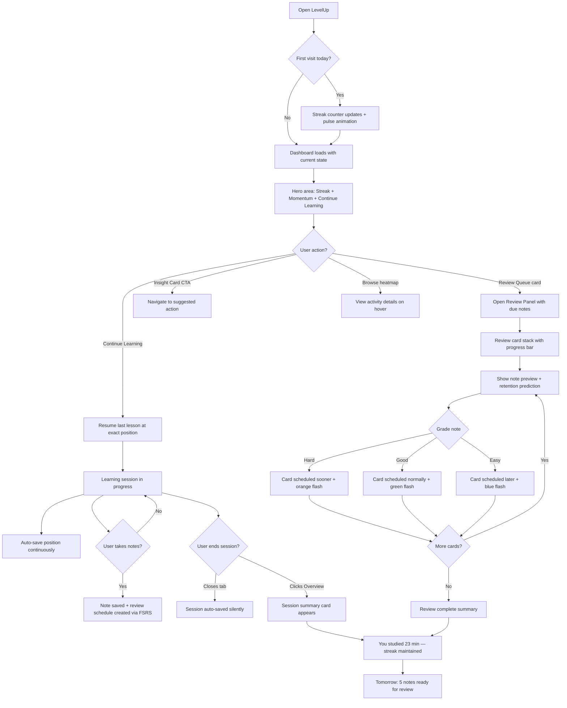
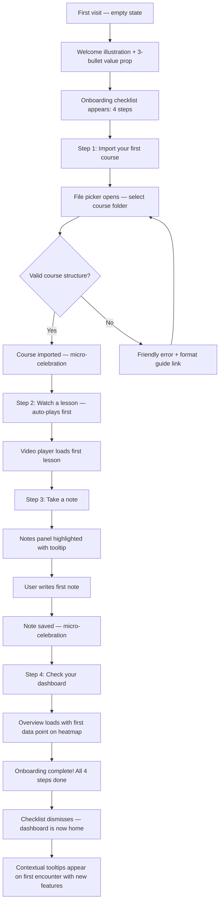
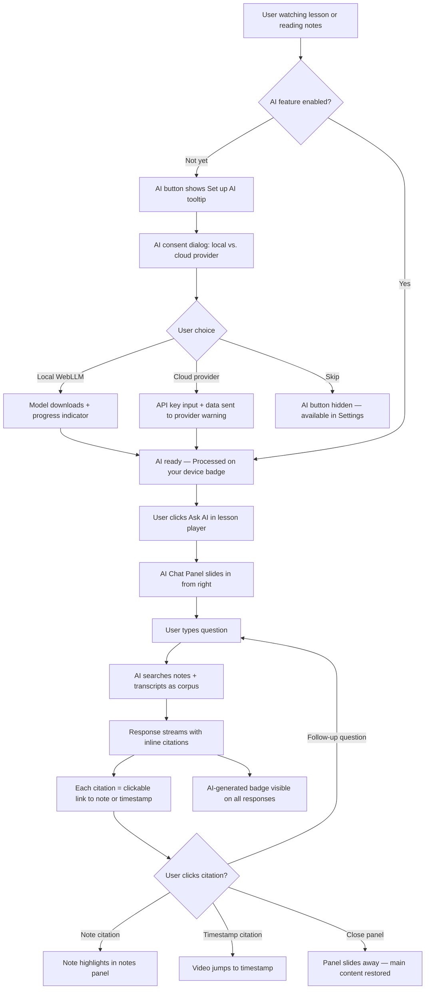
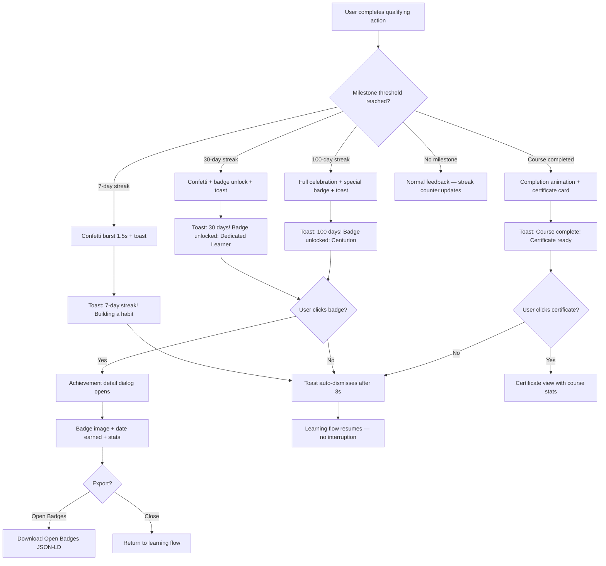
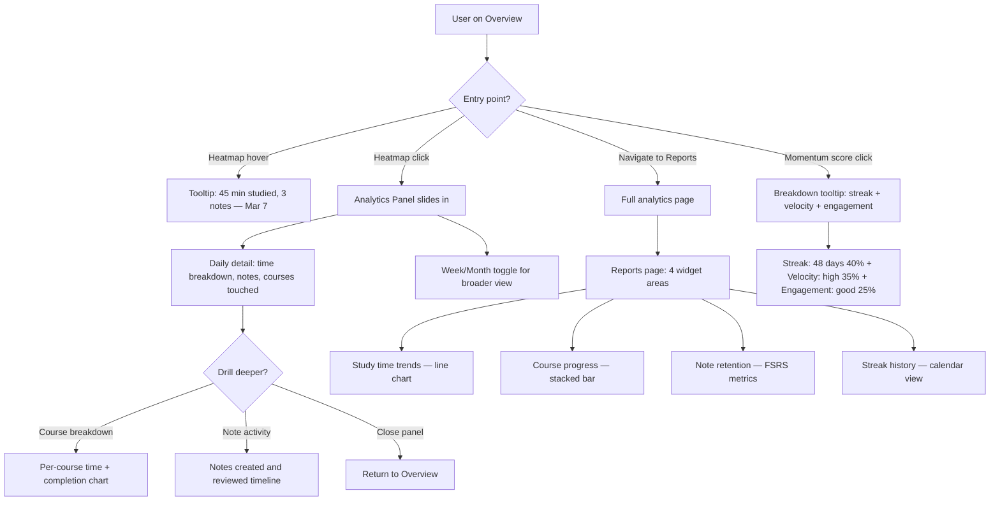

# UX Design Specification: LevelUp

**Author:** Pedro
**Date:** 2026-03-07

---

## Executive Summary

### Project Vision

LevelUp is a **local-first personal learning platform** for self-directed learners who collect courses from multiple sources (Udemy, YouTube, etc.) and struggle with completion. The core problem is "course collection paralysis" — people buy courses but never finish them. LevelUp's architecture is browser-only (IndexedDB + Zustand + File System Access API), with no backend or authentication.

Recent domain research (March 2026) identified a genuinely **unoccupied market niche**: no competitor combines video playback, note-taking, spaced repetition, analytics, and AI tutoring in a single local-first application. Key technological enablers — WebGPU/WebLLM for browser AI, whisper.cpp WASM for local transcription, and ts-fsrs for spaced repetition — are all production-ready in 2026.

### Target Users

A single user persona — the **self-directed adult learner** who:

- Accumulates courses across platforms but lacks a unified system
- Values privacy and data ownership (local-first philosophy)
- Wants mastery-focused learning, not just content consumption
- Ranges from intermediate to advanced tech comfort
- Uses desktop/laptop primarily (Chrome/Edge for File System Access API)

### Key Design Challenges

| # | Challenge | Context |
|---|-----------|---------|
| 1 | **Motivation without manipulation** | Streaks and gamification must support SDT (autonomy, competence, relatedness) rather than exploit loss aversion. 30% of users report streak anxiety (Duolingo CHI 2018). Streak freeze and "total days studied" reframe are critical. |
| 2 | **Analytics that drive action** | Users ignore data-heavy dashboards. "What to do next" insight cards must surface the single most impactful next action. Progressive drill-down keeps default view clean. |
| 3 | **AI trust and transparency** | Local-first AI (WebLLM/whisper.cpp WASM) must clearly communicate what leaves the device vs. stays local. Per-feature consent toggles, source citations linking to notes/timestamps, and visible AI content labeling are non-negotiable. |
| 4 | **Note review that doesn't feel like homework** | Spaced repetition adoption fails when it feels like Anki. Mochi's beautiful card design and 3-grade simplicity (Hard/Good/Easy) are the inspiration. "Review your notes" not "do flashcards." |
| 5 | **Empty state → habit formation** | Onboarding must convert a blank dashboard into a habit. Checklist-based onboarding (3-5 clear first actions) outperforms product tours. Contextual tooltips appear when the user reaches each feature organically. |

### Design Opportunities

| # | Opportunity | Differentiator |
|---|------------|----------------|
| 1 | **GitHub-style activity heatmap** | Visual proof of consistency that appeals to developer-adjacent learners |
| 2 | **Mochi-inspired review UI** | No competitor in the local-first space has beautiful spaced repetition |
| 3 | **NotebookLM-style AI Q&A** | Source-grounded answers with citation links to specific notes and video timestamps |
| 4 | **Momentum scoring** | Single composite score combining streak, completion velocity, engagement health |
| 5 | **Progressive disclosure everywhere** | Overview → insight cards; drill-down → analytics. Review queue → note; expand → full context |

## Core User Experience

### Defining Experience

**The Daily Return Loop** — LevelUp's core experience is a 3-step cycle:

1. **Arrive** → See your momentum (streak, progress, what's due) in <2 seconds
2. **Act** → One click to resume where you left off, review a due note, or tackle a challenge
3. **Close** → See today's impact (time studied, notes reviewed, streak maintained)

Every feature in Epics 5-11 feeds this loop. Gamification (E05-E06) makes **Arrive** rewarding. Analytics (E07-E08) makes **Arrive** informative. AI (E09) enriches **Act**. Onboarding (E10) bootstraps the first loop. Spaced repetition (E11) adds a new **Act** path.

### Platform Strategy

| Dimension | Decision | Rationale |
| --- | --- | --- |
| Platform | Web app (Chrome/Edge desktop) | File System Access API requirement; no mobile until PWA feasibility proven |
| Input | Mouse/keyboard primary | Desktop-first; touch secondary for tablet |
| Offline | Full offline capability | Local-first architecture — IndexedDB + OPFS, no server dependency |
| Device capabilities | FileSystemFileHandle for media, WebGPU for local AI | Chrome 86+ APIs for file re-access; WebGPU for WebLLM inference |
| Responsive | 3 breakpoints (375px, 768px, 1440px) | Sidebar persistent at desktop, collapsible at tablet/mobile |

### Effortless Interactions

| Interaction | Should Feel Like | Implementation Approach |
| --- | --- | --- |
| **Resume learning** | Opening a book to your bookmark | 1-click resume from Overview; auto-save position in video/PDF/notes |
| **Checking progress** | Glancing at a fitness tracker | Momentum score + streak visible immediately on arrival |
| **Reviewing notes** | Flipping through highlighted pages | Mochi-inspired cards surface naturally; 3-tap grading (Hard/Good/Easy) |
| **Getting AI help** | Asking a knowledgeable friend | Type a question → get an answer with citation links to your notes/timestamps |
| **First-time setup** | Unpacking a new tool with clear labels | Checklist onboarding: import a course → watch a lesson → take a note → done |

### Critical Success Moments

| Moment | What Success Feels Like | What Failure Feels Like |
| --- | --- | --- |
| **First course import** | "That was easy — my course is here" | "Where did my files go? What format do I need?" |
| **First streak milestone (7 days)** | "I'm actually sticking with this" + celebration | Silence — no acknowledgment of consistency |
| **First note review** | "Oh, I'd forgotten this — glad it surfaced" | "This feels like a test. I hate flashcards." |
| **First AI Q&A** | "It found the answer in MY notes — with the timestamp" | "Generic AI response with no source — I don't trust this" |
| **Dashboard after 30 days** | "I can see my growth. The heatmap proves it." | "Just numbers. What should I do next?" |

### Experience Principles

| # | Principle | Means | Doesn't Mean |
| --- | --- | --- | --- |
| 1 | **Momentum over metrics** | Show progress as forward motion (streak, velocity, heatmap) | Drowning users in analytics charts and numbers |
| 2 | **Autonomy over obligation** | User chooses what to learn, when to rest (streak freeze), how to review | Guilt-tripping for missed days or incomplete courses |
| 3 | **Surface, don't bury** | One insight card beats ten chart tabs; one resume button beats a course catalog | Hiding actionable information behind navigation layers |
| 4 | **Earn trust through transparency** | Show AI sources, label AI content, per-feature consent, local-first default | Black-box AI or silent data transmission |
| 5 | **Beauty invites habit** | Mochi-quality review cards, satisfying celebrations, warm visual design | Utilitarian UI that feels like enterprise software |

## Desired Emotional Response

### Primary Emotional Goals

| Goal | Description | Why It Matters |
| --- | --- | --- |
| **Capable** | "I'm actually making progress — I can see it" | Addresses the core problem: course paralysis makes learners feel incompetent. Competence is a core SDT need. |
| **In control** | "My data is mine, my pace is mine, my path is mine" | Autonomy is the strongest SDT predictor of persistence (+30% per Vansteenkiste 2004). Local-first architecture is an emotional promise, not just a technical choice. |
| **Proud** | "Look at what I've built — 47 days, 12 courses, real knowledge" | Streak milestones, heatmaps, and achievement badges externalize internal progress. Pride drives word-of-mouth. |

### Emotional Journey Mapping

| Stage | Desired Emotion | Design Driver |
| --- | --- | --- |
| **Discovery** (first visit) | Curiosity + clarity | Clean empty state with illustration + "Here's what LevelUp does" in 3 bullets. No feature overwhelm. |
| **Onboarding** (first 5 min) | Confidence + momentum | Checklist shows exactly what to do. Each step completion triggers micro-celebration. "3 of 5 done!" |
| **Daily return** (Arrive) | Anticipation + recognition | "Welcome back" is implicit — streak counter, today's review queue, and resume button say "we remember you." |
| **Core learning** (Act) | Flow + focus | Minimal chrome during video/reading. Notes appear alongside, not on top. AI help is a quiet button, not a popup. |
| **Session close** (Close) | Satisfaction + earned rest | "You studied 23 minutes today" with warm confirmation. Streak maintained. No guilt about stopping. |
| **Mistake/error** | Forgiveness + recovery | Streak freeze absorbs a missed day. "You've studied 47 of the last 50 days" reframes the miss. Data never lost (local-first). |
| **Long absence** (return after gap) | Welcome, not guilt | "Welcome back! Your notes are waiting." Show total progress, not the gap. Soft re-engagement, not "You broke your streak!" |

### Micro-Emotions

| Positive (Cultivate) | Negative (Prevent) | Prevention Strategy |
| --- | --- | --- |
| **Confidence** — "I know what to do next" | **Confusion** — "What am I supposed to click?" | Insight cards with clear CTAs; progressive disclosure |
| **Trust** — "My data is safe and private" | **Skepticism** — "Is this AI sending my notes somewhere?" | Visible "processed locally" badges; per-feature consent toggles |
| **Delight** — "That celebration was satisfying!" | **Anxiety** — "I'll lose my streak if I miss tomorrow" | Streak freeze available; "total days studied" alongside streak count |
| **Accomplishment** — "I finished something real" | **Overwhelm** — "I have 47 courses and no idea where to start" | Smart sorting by momentum; "continue where you left off" as default |
| **Belonging** — "This tool gets how I learn" | **Isolation** — "Am I the only person who uses this?" | Warm visual design; instructor presence in courses; community-ready architecture |

### Design Implications

| Emotion → Design Choice | Implementation |
| --- | --- |
| **Capable** → Progressive competence feedback | Momentum score rises visibly with each session. Course progress bars use color-coded stages (gray → blue → green). |
| **In control** → Visible user agency | Streak freeze toggle in settings. AI consent per-feature. Export data anytime. No "you must" language. |
| **Proud** → Celebration moments | Confetti burst at 7/30/100-day streaks (Duolingo-inspired). Achievement badges with Open Badges export. Heatmap fills in like a garden growing. |
| **Trust** → Transparency affordances | "Processed on your device" chip next to local AI features. Source citations with clickable links in AI responses. Clear "AI-generated" labels. |
| **Forgiveness** → Soft failure states | Streak freeze auto-activates before break. "Total days studied" always visible. Return screen shows cumulative progress, never the gap. |

### Emotional Design Principles

| # | Principle | Application |
| --- | --- | --- |
| 1 | **Celebrate consistency, not perfection** | 7 of 7 days and 5 of 7 days both get positive reinforcement. Rest days are healthy, not failures. |
| 2 | **Show growth, never decline** | Heatmap shows what was done, not what was missed. Analytics trend lines emphasize upward trajectory. |
| 3 | **Warmth over clinical** | `#FAF5EE` warm background, rounded cards, friendly copy ("Your notes are ready for review" not "3 items due"). |
| 4 | **Earn delight, don't spam it** | Celebrations only at meaningful milestones (7/30/100 days, course completion). No daily "Great job!" notifications. |
| 5 | **Silence is consent to continue** | No "Are you still there?" interruptions. No "You haven't studied today" push notifications. The app waits patiently. |

## UX Pattern Analysis & Inspiration

### Inspiring Products Analysis

#### 1. Mochi — Spaced Repetition with Soul

Cards are beautiful, typography is considered, and the review experience feels like reading a well-designed book rather than grinding flashcards.

| Pattern | Detail | LevelUp Application |
| --- | --- | --- |
| **Card aesthetics** | Soft shadows, generous whitespace, warm colors, Markdown rendering | Review queue cards should feel like beautiful note previews, not quiz items |
| **3-grade simplicity** | Hard / Good / Easy — no 6-point cognitive load | Direct adoption for FR80 note review rating |
| **Next review visibility** | Shows when card returns before you grade | Show "Next review: 3 days" after grading a note — builds predictability |
| **Retention prediction** | Shows estimated recall probability | Display per-note retention percentage in review queue (FR81) |
| **Deck organization** | Clean folder/tag structure with card counts | Notes organized by course + tag, with "due for review" counts |

#### 2. NotebookLM — AI That Cites Its Sources

Every AI answer links back to the source document. You never wonder "where did this come from?" — every claim has a clickable citation.

| Pattern | Detail | LevelUp Application |
| --- | --- | --- |
| **Source grounding** | Every AI answer cites specific passages with page/section references | AI Q&A (FR49) citations link to note title + video timestamp |
| **Upload-first model** | Users provide their own documents — AI works within YOUR corpus | LevelUp's notes and transcripts ARE the corpus — no external data needed |
| **Clear AI labeling** | Distinct visual treatment for AI-generated vs. source content | "AI-generated" badge on all summaries, Q&A answers, auto-tags (NFR69) |
| **Conversational Q&A** | Chat-style interface, follow-up questions maintain context | AI panel uses chat format with history within session |
| **Source panel** | Side-by-side view: AI answer on left, source documents on right | Split view: AI response with clickable citations → note/video jump |

#### 3. Duolingo — Streak Psychology Done Right

Gold standard for streak UX — but also a cautionary tale. They've iterated publicly on reducing streak anxiety while keeping engagement.

| Pattern | Detail | LevelUp Application |
| --- | --- | --- |
| **Streak freeze** | Pre-purchased "insurance" against missed days; reduced churn by 21% | FR91: configurable rest days (1-3/week) that don't break streak |
| **Milestone celebrations** | Confetti + badge + shareable card at 7/30/100/365 days | FR98: toast + badge at 7/30/60/100-day streaks |
| **Calendar heatmap** | Visual "don't break the chain" calendar with color intensity | FR93: GitHub-style heatmap showing 12-month study activity |
| **XP system** | Points for daily activity — LevelUp should AVOID shallow XP | No XP points — use momentum score (meaningful composite) instead |
| **League competition** | Weekly leaderboards — drives engagement but creates anxiety | AVOID: no competitive features. Self-improvement only. |

#### 4. Obsidian — Local-First Philosophy as Feature

Makes "your data is yours" a first-class UX feature, not just a technical detail. Users FEEL the local-first architecture.

| Pattern | Detail | LevelUp Application |
| --- | --- | --- |
| **Vault = folder** | Your data is a folder on your disk — no export needed | Course folders ARE the content; IndexedDB data is exportable |
| **Plugin ecosystem** | Core stays simple; power users extend via plugins | Future: extensibility for custom analytics/AI providers |
| **Settings transparency** | Every setting is visible and configurable | AI provider selection (FR106), streak freeze config (FR91), reminder config (FR100) |
| **Markdown-native** | Notes are Markdown files — universal, portable, future-proof | FR85: notes export as Markdown with YAML frontmatter |

#### 5. GitHub — Activity Visualization as Motivation

The contribution graph visualizes consistency without judgment. Empty squares are neutral gray, not red.

| Pattern | Detail | LevelUp Application |
| --- | --- | --- |
| **Contribution heatmap** | 52-week grid, color intensity = activity level | FR93: 12-month study activity heatmap |
| **No gaps highlighted** | Empty squares are neutral gray, not red | Empty days are simply light, not alarming |
| **Hover details** | Hover a cell → "5 contributions on March 7" | Hover → "45 min studied, 3 notes taken" |
| **Streak counter** | "Current streak: 12 days" displayed alongside | Streak counter + "Total: 147 days studied" dual display |

### Transferable UX Patterns

**Navigation Patterns:**

| Pattern | Source | Application |
| --- | --- | --- |
| **Single-action resume** | Duolingo "Continue" button | FR95: "Continue Learning" on dashboard — one click to resume |
| **Progressive sidebar** | Obsidian's collapsible left nav | Existing sidebar pattern; collapse on mobile, persist on desktop |
| **Contextual panels** | NotebookLM's side-by-side view | AI panel, notes panel, and review panel all slide in contextually |

**Interaction Patterns:**

| Pattern | Source | Application |
| --- | --- | --- |
| **Swipe-to-grade** | Mochi's card review gesture | Review notes: Hard/Good/Easy buttons below card (mobile: swipe) |
| **Celebrate-then-continue** | Duolingo's milestone animation | Brief confetti (1.5s) → auto-dismiss → back to learning flow |
| **Insight cards** | GitHub's contribution summary | Dashboard shows 2-3 actionable insight cards at top (FR47) |

**Visual Patterns:**

| Pattern | Source | Application |
| --- | --- | --- |
| **Warm color palette** | Mochi's soft tones | `#FAF5EE` background + warm accent colors; avoid cold grays |
| **Activity heatmap** | GitHub contribution graph | FR93: study activity visualization; warm gradient (light → green) |
| **Progress rings** | Coursera course cards | Course cards show completion as ring/arc, not just percentage text |

### Anti-Patterns to Avoid

| Anti-Pattern | Source | Why It Fails | LevelUp's Alternative |
| --- | --- | --- | --- |
| **Competitive leaderboards** | Duolingo Leagues | Creates anxiety and comparison; 30% report streak stress | Self-competition only: "Your best week was 6 sessions" |
| **Punitive streak breaks** | Early Duolingo | Users who lose a long streak often quit entirely | Streak freeze + "total days studied" always visible |
| **Novelty-dependent rewards** | Many gamification systems | Extrinsic rewards lose potency over time (psychological fatigue) | Rewards tied to genuine mastery milestones, not arbitrary daily actions |
| **Feature overload on first visit** | Enterprise LMS dashboards | New users see every feature at once → overwhelm → bounce | Checklist onboarding; features appear as user progresses (FR96) |
| **Data dashboards without action** | Many analytics tools | Users see charts but don't know what to DO next | Insight cards at top: pattern + specific recommended action (FR47) |
| **Generic AI responses** | ChatGPT (without context) | Answers feel impersonal; no connection to user's actual learning | Source-grounded AI with citations to user's own notes/timestamps |
| **Flashcard-first review** | Anki's default UX | Academic, utilitarian feel deters non-power-users | Note-first review: beautiful card showing the note, not a quiz prompt |

### Design Inspiration Strategy

**Adopt directly:**

| Pattern | Source | Rationale |
| --- | --- | --- |
| 3-grade review system | Mochi | Proven simplicity; matches FSRS model (Hard/Good/Easy maps to DSR) |
| Source-grounded AI citations | NotebookLM | Trust requires provenance; every AI answer links to user's own content |
| Streak freeze mechanic | Duolingo | 21% churn reduction for at-risk users; autonomy-supportive |
| Activity heatmap | GitHub | Universally understood; motivates consistency without judgment |
| Milestone celebrations | Duolingo | Earned delight at meaningful thresholds (7/30/60/100 days) |

**Adapt for LevelUp:**

| Pattern | Source | Adaptation |
| --- | --- | --- |
| Card review UI | Mochi | Adapt to full note preview (not flashcard); show course context + retention prediction |
| Contribution summary | GitHub | Adapt to "learning summary" with study time, notes, and momentum — not code commits |
| Chat Q&A | NotebookLM | Adapt to work with notes + video transcripts as corpus (not uploaded documents) |
| Onboarding checklist | Multiple (Notion, Linear) | 3-5 steps specific to learning: import → watch → note → challenge → done |

**Avoid completely:**

| Pattern | Source | Reason |
| --- | --- | --- |
| XP / points system | Duolingo | Shallow metric; doesn't represent actual learning mastery |
| Leaderboards / leagues | Duolingo | Personal tool — no social comparison or competition pressure |
| Hearts / limited attempts | Duolingo | Punishes mistakes; learning should be unlimited and safe |
| Notification spam | Most mobile apps | "Silence is consent to continue" principle — no guilt-tripping |
| Full product tours | Enterprise SaaS | Contextual tooltips > modal walkthrough. Learn by doing. |

## Design System Foundation

### Design System Choice

**shadcn/ui + Tailwind CSS v4** — extending the existing component library rather than replacing it.

LevelUp already ships 50+ shadcn/ui components built on Radix UI primitives with Tailwind CSS v4 styling. The design system decision is to **extend this proven foundation** with custom components for Epics 5-11, not replace it.

### Rationale for Selection

| Factor | Decision | Why |
| --- | --- | --- |
| **Existing investment** | Keep shadcn/ui + Tailwind v4 | 50+ components already built, tested, and styled to LevelUp's warm aesthetic |
| **Accessibility** | Radix UI primitives | WCAG 2.2 AA compliance built into every primitive (focus management, ARIA, keyboard nav) |
| **Customization** | CSS custom properties + CVA variants | Theme tokens in `theme.css` + class-variance-authority for component variants |
| **Performance** | Tree-shakeable, no runtime CSS-in-JS | Only ship components actually used; Tailwind purges unused styles |
| **Developer experience** | Copy-paste ownership model | Full control over every component — no fighting library abstractions |
| **Brand consistency** | Warm palette already tokenized | `#FAF5EE` background, `blue-600` primary, `rounded-[24px]` cards already established |

### Implementation Approach

**Existing foundation (no changes needed):**
- 50+ shadcn/ui components (Button, Card, Dialog, Tabs, Toast, etc.)
- Tailwind CSS v4 with `@tailwindcss/vite` plugin
- Theme tokens in `src/styles/theme.css` (OKLCH color space)
- CVA variants for component states
- Lucide React icons

**New components needed for E05-E11:**

| Epic | Component | Base | Customization |
| --- | --- | --- | --- |
| **E05-E06** | StreakCounter | Custom | Animated flame icon, day-dot indicators, freeze state |
| **E05-E06** | MilestoneToast | Toast (Sonner) | Confetti animation, badge display, auto-dismiss 3s |
| **E05-E06** | AchievementBadge | Badge + Dialog | Unlocked/locked states, detail modal, Open Badges export |
| **E05-E06** | WeeklyGoalRing | Custom (SVG) | Animated progress ring, target/actual display |
| **E07-E08** | ActivityHeatmap | Custom (SVG) | GitHub-style 52-week grid, warm color gradient, hover tooltips |
| **E07-E08** | InsightCard | Card | Icon + pattern + CTA layout, dismissible, priority-sorted |
| **E07-E08** | MomentumScore | Custom | Composite score display, trend arrow, breakdown tooltip |
| **E07-E08** | AnalyticsChart | Chart (Recharts) | Themed with warm palette, responsive, accessible labels |
| **E09** | AIChatPanel | Sheet + ScrollArea | Chat bubbles, citation links, source-grounded responses |
| **E09** | CitationLink | Custom | Clickable timestamp/note reference, highlight on hover |
| **E09** | AIConsentToggle | Switch + Card | Per-feature consent, "processed locally" badge, provider selector |
| **E10** | OnboardingChecklist | Card + Progress | 3-5 step checklist, completion celebration, dismissible |
| **E10** | ContextualTooltip | Tooltip + Popover | First-use detection, progressive reveal, "Got it" dismiss |
| **E10** | EmptyState | Custom | Illustration + heading + CTA, per-section variants |
| **E11** | ReviewCard | Card | Mochi-inspired note preview, retention prediction, course context |
| **E11** | GradeButtons | ButtonGroup | Hard/Good/Easy with color coding, next-review preview |
| **E11** | ReviewQueue | Custom | Card stack with progress indicator, session summary |

### Customization Strategy

**Design tokens to extend:**

| Token Category | Current | Extensions for E05-E11 |
| --- | --- | --- |
| **Colors** | `--color-primary`, `--color-background` | `--color-streak`, `--color-heatmap-*` (4 intensity levels), `--color-achievement-*`, `--color-ai-accent` |
| **Spacing** | 8px base grid | No changes — maintain consistency |
| **Border radius** | `24px` cards, `xl` buttons | `--radius-badge` for achievement badges, `--radius-review-card` for Mochi-style cards |
| **Shadows** | Subtle card shadows | `--shadow-celebration` for milestone moments, `--shadow-review-card` for depth |
| **Typography** | System fonts, 1.5-1.7 line-height | `--font-score` for momentum/streak numbers (tabular-nums), `--font-insight` for card headers |

**Animation philosophy:**

| Context | Duration | Easing | Example |
| --- | --- | --- | --- |
| **Micro-interactions** | 150-200ms | ease-out | Button hover, toggle switch, tooltip appear |
| **State transitions** | 200-350ms | ease-in-out | Card flip in review, panel slide, tab switch |
| **Celebrations** | 1-2s | spring | Confetti burst, badge unlock, streak milestone |
| **Data visualization** | 500-800ms | ease-out | Heatmap fill, progress ring animate, chart draw |
| **Reduced motion** | 0ms | — | All animations respect `prefers-reduced-motion: reduce` |

## 2. Core User Experience (Detailed)

### 2.1 Defining Experience

**"Open LevelUp and know exactly what to do next."**

Like how Spotify's defining experience is "discover and play any song instantly," LevelUp's is: **"See your momentum, act on what matters, feel the progress."** This is what users will describe to friends: *"I open it, it shows me where I am, I click one button and I'm learning again."*

### 2.2 User Mental Model

Users currently solve this with fragmented tools — a video player here, notes app there, manual tracking in spreadsheets. They bring the mental model of **a learning journal** — something that remembers where they were, shows what they've done, and suggests what's next. The frustration with existing LMS platforms is information overload: dashboards full of charts but no clear "do this next."

LevelUp's mental model is closer to a **fitness tracker for learning**: glance at it, see your streak, do your workout, track the result.

### 2.3 Success Criteria

| Criteria | Target | Measurement |
| --- | --- | --- |
| **Time to first action** | < 3 seconds from page load to resume click | Dashboard renders momentum + resume button instantly |
| **Decision fatigue** | Zero choices needed to continue learning | "Continue Learning" is the default, most prominent CTA |
| **Progress visibility** | Always visible without navigation | Streak, momentum score, and today's activity on every dashboard visit |
| **Session closure satisfaction** | User feels "done" not "abandoned" | Session summary shows time, notes, streak status before leaving |
| **Return motivation** | User thinks about coming back | Streak counter + "tomorrow's review queue" creates anticipation |

### 2.4 Novel vs. Established Patterns

| Aspect | Classification | Detail |
| --- | --- | --- |
| **Resume-where-you-left-off** | Established | Netflix/Kindle pattern — users expect it |
| **Streak mechanics** | Established (adapted) | Duolingo-proven, adapted with LevelUp's autonomy-first freeze mechanics |
| **Activity heatmap** | Established | GitHub contribution graph — universally understood |
| **Momentum scoring** | Novel | Composite score combining streak, velocity, engagement — needs clear explanation |
| **Source-grounded AI Q&A** | Novel (adapted) | NotebookLM pattern adapted to video timestamps + personal notes |
| **Note-first spaced repetition** | Novel | Mochi aesthetic but showing full notes, not flashcard prompts — needs gentle onboarding |

**For novel patterns:** Momentum score gets a tooltip explanation on first encounter. AI Q&A shows a "How this works" link. Review cards include a "What is spaced repetition?" contextual explainer on first review session.

### 2.5 Experience Mechanics

**1. Initiation (Arrive):**

| Trigger | System Response | User Feels |
| --- | --- | --- |
| Opens LevelUp (daily return) | Dashboard loads with streak counter, momentum score, today's review queue count, and "Continue Learning" button | Recognized — "it remembers me" |
| First visit of the day | Streak counter pulses briefly, "Day 48" updates | Motivated — "keeping the chain going" |
| Has overdue reviews | Review queue badge shows count: "3 notes ready for review" | Purposeful — "I know what to do" |
| Returning after absence | "Welcome back! You've studied 47 of the last 50 days" + total progress | Welcomed, not guilted |

**2. Interaction (Act):**

| Action | Controls | System Response |
| --- | --- | --- |
| Resume learning | Single "Continue Learning" button | Jumps to exact position in video/PDF/notes |
| Review a note | Hard / Good / Easy buttons below card | Card animates away, next card appears, progress bar advances |
| Ask AI a question | Text input in AI panel | Response streams with inline citation links to notes/timestamps |
| Complete a challenge | Challenge card with action prompt | Completion animation, XP-free acknowledgment, streak contribution |

**3. Feedback:**

| Signal | Implementation |
| --- | --- |
| Learning in progress | Video progress bar, note count incrementing, timer running |
| Review succeeding | Green flash on "Good/Easy," retention prediction updates live |
| Streak maintained | Flame icon stays lit, day-dot fills in on heatmap |
| Milestone reached | Confetti burst (1.5s), achievement badge unlock, toast notification |
| Mistake/wrong answer | Soft orange highlight, "Try again" with hint — never punitive |

**4. Completion (Close):**

| Signal | Implementation |
| --- | --- |
| Session summary | "You studied 23 min today — 3 notes reviewed, streak maintained" |
| Tomorrow's preview | "Tomorrow: 5 notes ready for review" — creates return anticipation |
| Clean exit | No "are you sure?" dialogs. Progress auto-saved. Close the tab freely. |
| Streak status | Green checkmark: "Day 48 complete" or amber: "Streak freeze available" |

## Visual Design Foundation

### Color System

**Core Palette (existing):**

| Token | Value | Usage |
| --- | --- | --- |
| `--color-background` | `#FAF5EE` | App background — warm off-white |
| `--color-primary` | `blue-600` | CTAs, active nav, links |
| `--color-card` | `#FFFFFF` | Card backgrounds |
| `--color-border` | `gray-200` | Subtle borders, dividers |
| `--color-text` | `gray-900` | Primary text |
| `--color-text-muted` | `gray-500` | Secondary text, labels |

**Extended Palette (new for E05-E11):**

| Token | Value | Usage |
| --- | --- | --- |
| `--color-streak` | `#F59E0B` (amber-500) | Streak flame, active streak indicators |
| `--color-streak-frozen` | `#93C5FD` (blue-300) | Streak freeze state — cool, calm |
| `--color-heatmap-0` | `#F3F0EB` | Heatmap empty day (neutral, warm gray) |
| `--color-heatmap-1` | `#BBF7D0` (green-200) | Heatmap light activity |
| `--color-heatmap-2` | `#4ADE80` (green-400) | Heatmap moderate activity |
| `--color-heatmap-3` | `#16A34A` (green-600) | Heatmap high activity |
| `--color-heatmap-4` | `#166534` (green-800) | Heatmap intense activity |
| `--color-achievement` | `#8B5CF6` (violet-500) | Achievement badges, milestones |
| `--color-ai-accent` | `#6366F1` (indigo-500) | AI panel, AI-generated content labels |
| `--color-review-hard` | `#EF4444` (red-500) | "Hard" grade button |
| `--color-review-good` | `#22C55E` (green-500) | "Good" grade button |
| `--color-review-easy` | `#3B82F6` (blue-500) | "Easy" grade button |
| `--color-momentum` | `#F97316` (orange-500) | Momentum score, velocity indicators |
| `--color-celebration` | `#FBBF24` (amber-400) | Confetti, milestone celebrations |

**Semantic Colors:**

| Semantic | Light Mode | Purpose |
| --- | --- | --- |
| `--color-success` | `green-500` | Completed states, positive feedback |
| `--color-warning` | `amber-500` | Streak at risk, attention needed |
| `--color-error` | `red-500` | Errors, destructive actions |
| `--color-info` | `blue-500` | Informational, neutral notices |

### Typography System

**Typefaces:** System font stack — no custom fonts. Fast loading, familiar, accessible.

| Role | Weight | Size | Line Height | Usage |
| --- | --- | --- | --- | --- |
| **Display** | 700 (bold) | 2rem (32px) | 1.2 | Page titles, empty state headings |
| **H1** | 600 (semi) | 1.5rem (24px) | 1.3 | Section headings (Dashboard, Courses) |
| **H2** | 600 (semi) | 1.25rem (20px) | 1.4 | Card titles, widget headings |
| **H3** | 500 (medium) | 1.125rem (18px) | 1.4 | Sub-section titles |
| **Body** | 400 (regular) | 1rem (16px) | 1.5 | Primary content, descriptions |
| **Small** | 400 (regular) | 0.875rem (14px) | 1.5 | Labels, metadata, secondary info |
| **Caption** | 400 (regular) | 0.75rem (12px) | 1.4 | Timestamps, helper text |
| **Score** | 700 (bold) | 2.5rem (40px) | 1.0 | Momentum score, streak counter (`font-variant-numeric: tabular-nums`) |

### Spacing & Layout Foundation

**Base unit:** 8px (0.5rem) — all spacing uses multiples.

| Token | Value | Usage |
| --- | --- | --- |
| `--space-1` | 4px (0.25rem) | Icon-to-text gap, tight inline spacing |
| `--space-2` | 8px (0.5rem) | Inner padding, small gaps |
| `--space-3` | 12px (0.75rem) | Button padding, compact card content |
| `--space-4` | 16px (1rem) | Standard card padding, form field spacing |
| `--space-6` | 24px (1.5rem) | Section gaps, card margins |
| `--space-8` | 32px (2rem) | Major section separation |
| `--space-12` | 48px (3rem) | Page-level section breaks |

**Layout Grid:**

| Breakpoint | Columns | Gutter | Sidebar | Behavior |
| --- | --- | --- | --- | --- |
| **Mobile** (375px) | 1 | 16px | Hidden (hamburger) | Stack all cards vertically |
| **Tablet** (768px) | 2 | 24px | Collapsible Sheet | 2-column card grid, sidebar overlay |
| **Desktop** (1440px) | 3-4 | 24px | Persistent 256px | Dashboard uses 3-col, detail pages use main+panel |

**Component Spacing Patterns:**

| Pattern | Structure | Example |
| --- | --- | --- |
| **Card internal** | 16px padding, 12px between elements | Insight cards, course cards |
| **Card grid** | 24px gap between cards | Dashboard widget grid |
| **Widget header** | 8px below title, 16px above content | "Study Activity" heatmap header |
| **Action group** | 8px between buttons, 16px from content | Hard/Good/Easy grade buttons |
| **List items** | 12px vertical between items, 8px internal | Review queue, notification list |

### Accessibility Considerations

| Requirement | Standard | Implementation |
| --- | --- | --- |
| **Text contrast** | WCAG 2.2 AA: 4.5:1 minimum | All text on `#FAF5EE` uses `gray-900` (12.5:1) or `gray-500` (5.1:1) |
| **Large text** | 3:1 minimum | Score/display text at ≥24px meets 3:1 with all theme colors |
| **UI components** | 3:1 against adjacent | Buttons, inputs, badges all have 3:1+ border/background contrast |
| **Focus indicators** | 2px solid, 3:1 contrast | `ring-2 ring-blue-600 ring-offset-2` on all focusable elements |
| **Touch targets** | 44x44px minimum | All buttons, links, and interactive elements ≥44px tap area |
| **Color independence** | Never color-only signaling | Heatmap uses intensity labels on hover; grade buttons include text labels |
| **Reduced motion** | `prefers-reduced-motion` | All animations disabled; instant state transitions |
| **Font scaling** | Up to 200% zoom | Layout uses rem/em, no fixed-width containers that break at zoom |

## Design Direction Decision

### Design Directions Explored

Six visual directions were evaluated for how E05-E11 features integrate into LevelUp's existing layout:

| # | Direction | Concept | Strength | Weakness |
| --- | --- | --- | --- | --- |
| 1 | **Widget Dashboard** | All features as widget cards on Overview | Information-rich, everything visible | Overwhelming, violates progressive disclosure |
| 2 | **Progressive Layers** | Minimal hero + features reveal on interaction | Focused, fast time-to-action | Features may feel hidden |
| 3 | **Activity Feed** | Timeline-based center column | Familiar social pattern | Prioritizes recency over importance |
| 4 | **Tab Zones** | Features in dedicated tab sections | Clean separation | More navigation, fragments the Daily Return Loop |
| 5 | **Contextual Panels** | Side panels slide in for deep features | Immersive, context-preserving | Panel management complexity |
| 6 | **Card Stack** | Priority cards with dismiss interaction | Mobile-first, focused | Too minimal for desktop power users |

### Chosen Direction

**Direction 2 (Progressive Layers) + Direction 5 (Contextual Panels)** — a hybrid approach.

- **Overview** = clean arrival screen with streak, momentum score, and "Continue Learning" (Direction 2's minimal hero)
- **Insight cards** = 2-3 actionable cards below the hero area (limited widget approach from Direction 1)
- **Deep features** = contextual panels that slide in when needed — AI panel, review queue, analytics drill-down (Direction 5)
- **Heatmap** = always visible on Overview as compact 12-month grid below insight cards (Direction 1's dashboard presence)

**Overview page layout:**

```
┌─────────────────────────────────────────────┐
│  [Streak: Day 48 🔥]  [Momentum: 82]       │  ← Hero metrics
│  [══════ Continue Learning ══════]          │  ← Primary CTA
├─────────────────────────────────────────────┤
│  ┌─────────┐ ┌─────────┐ ┌─────────┐       │
│  │ Insight  │ │ Review  │ │ Weekly  │       │  ← Insight cards (2-3)
│  │ Card 1   │ │ Queue:3 │ │ Goal    │       │
│  └─────────┘ └─────────┘ └─────────┘       │
├─────────────────────────────────────────────┤
│  ┌───────────────────────────────────┐      │
│  │  Activity Heatmap (12 months)     │      │  ← Persistent heatmap
│  │  ░░▓▓░▓▓▓░░▓▓░▓░░▓▓▓▓░░▓░░      │      │
│  └───────────────────────────────────┘      │
├─────────────────────────────────────────────┤
│  [Recent Courses]  [Achievements]           │  ← Existing content
└─────────────────────────────────────────────┘
```

### Design Rationale

| Decision | Rationale |
| --- | --- |
| **Minimal hero area** | Supports "time to first action < 3 seconds" — streak + momentum + resume visible without scanning |
| **Limited insight cards (2-3)** | Prevents information overload while maintaining "surface, don't bury" principle |
| **Contextual panels** | AI Q&A and review queue need immersive space but shouldn't always be visible — panels respect user's current context |
| **Persistent heatmap** | Motivational wallpaper — always visible, never demanding action. Like GitHub's contribution graph on profile |
| **No tab separation** | Tabs would hide features behind navigation; Daily Return Loop requires 1-2 click reach from Overview |
| **No activity feed** | Timeline prioritizes recency over importance; insight cards should show what's actionable, not what happened last |

### Implementation Approach

**Panel triggers:**

| Trigger | Panel | Entry Point |
| --- | --- | --- |
| "Ask AI" button in lesson player | AI Chat Panel (Sheet, right side) | Lesson player toolbar |
| "Review Queue: 3" insight card click | Review Panel with card stack | Overview insight card |
| Heatmap cell click / "View Details" | Analytics Panel with detailed charts | Overview heatmap |
| Achievement badge click | Achievement Detail Dialog (modal) | Overview achievements row |
| "Continue Learning" button | No panel — navigates to lesson player | Overview hero area |

**Responsive panel behavior:**

| Viewport | Panel Behavior |
| --- | --- |
| **Desktop** (1440px) | Panel slides in from right, main content shifts left (split view) |
| **Tablet** (768px) | Panel opens as full-width Sheet overlay |
| **Mobile** (375px) | Panel opens as full-screen Sheet with back button |

## User Journey Flows

### Journey 1: Daily Learning Session (The Daily Return Loop)

The most important journey — this IS the defining experience.



### Journey 2: First-Time Setup and Onboarding



### Journey 3: AI-Assisted Learning



### Journey 4: Achievement Milestone



### Journey 5: Progress Review and Analytics



### Journey Patterns

| Pattern | Usage | Implementation |
| --- | --- | --- |
| **One-click entry** | Every journey starts with a single action from Overview | "Continue Learning," insight card CTA, heatmap click |
| **Progressive reveal** | Details appear on demand, never upfront | Hover → tooltip; click → panel; navigate → full page |
| **Auto-save everywhere** | No explicit "save" actions needed | Video position, notes, review grades all persist automatically |
| **Graceful interruption** | User can leave any journey mid-flow without data loss | Session auto-saves; streak counts partial sessions |
| **Contextual panels** | Deep features slide in without full page navigation | AI panel, review panel, analytics panel all use Sheet component |
| **Celebrate-then-continue** | Milestones acknowledged briefly, then flow resumes | 1.5s confetti → auto-dismiss → no workflow interruption |
| **Error as guidance** | Errors explain what to do, not what went wrong | "This folder needs at least one video file — here's how to organize it" |

### Flow Optimization Principles

| # | Principle | Application |
| --- | --- | --- |
| 1 | **Minimize steps to value** | Daily return = 1 click to resume learning; onboarding = 4 steps total |
| 2 | **No dead ends** | Every error state offers a recovery path; every completion suggests next action |
| 3 | **Parallel paths, single goal** | Multiple entry points (resume, review, insight card) all lead to learning |
| 4 | **Context preservation** | Panels overlay without destroying context; closing a panel returns to exact previous state |
| 5 | **Progressive commitment** | AI setup is optional, deferred until first use; onboarding can be dismissed |
| 6 | **Feedback immediacy** | Every action gets visual feedback within 200ms; longer operations show progress |

## Component Strategy

### Design System Components (Available)

shadcn/ui provides the foundation — these components are already built and styled:

| Category | Components | E05-E11 Usage |
| --- | --- | --- |
| **Layout** | Card, Tabs, Accordion, Sheet, ScrollArea, Separator | Card wrappers for all widgets; Sheet for contextual panels; Tabs for analytics views |
| **Forms** | Button, Input, Switch, Select, Slider | Grade buttons, AI input, consent toggles, goal setting |
| **Feedback** | Toast (Sonner), Progress, Badge, Alert | Milestone celebrations, progress bars, achievement badges, error states |
| **Overlays** | Dialog, Popover, Tooltip, HoverCard | Achievement details, heatmap hover, contextual tooltips, momentum breakdown |
| **Data** | Chart (Recharts), Table, Calendar | Analytics charts, study history, streak calendar |
| **Navigation** | Breadcrumb, NavigationMenu | Existing sidebar + header navigation |

### Custom Components

#### StreakCounter

**Purpose:** Display current study streak with visual flame indicator and day-dot history
**Anatomy:** Flame icon + day count + 7-day dot row (filled/empty/frozen)
**States:**

| State | Visual | Trigger |
| --- | --- | --- |
| Active | Amber flame, filled dots | Streak ongoing, today counted |
| At risk | Pulsing flame, today's dot empty | Streak active but today not yet counted |
| Frozen | Blue snowflake replaces flame, frozen dot | Rest day used |
| Broken | Gray flame, counter resets | Streak ended (no freeze available) |
| Milestone | Gold flame + glow effect | 7/30/60/100-day threshold |

**Accessibility:** `role="status"`, `aria-label="Study streak: 48 days"`, live region updates on change
**Size variants:** Compact (sidebar/header), standard (overview hero)

#### MomentumScore

**Purpose:** Display composite learning momentum as a single interpretable number (0-100)
**Anatomy:** Score number (tabular-nums) + trend arrow (up/down/stable) + breakdown tooltip
**States:** Rising (green arrow), stable (gray dash), declining (orange arrow), new user (gray, "Building...")
**Tooltip breakdown:** Streak weight (40%) + velocity (35%) + engagement (25%) with individual scores
**Accessibility:** `aria-label="Momentum score: 82, rising"`, tooltip on focus

#### ActivityHeatmap

**Purpose:** 12-month study activity visualization (GitHub contribution graph pattern)
**Anatomy:** 52-column x 7-row SVG grid + month labels + color legend + streak counter
**States:** Empty (new user, all `heatmap-0`), populated (gradient fill), hover (cell highlight + tooltip)
**Hover tooltip:** Date, study duration, notes taken, courses touched
**Accessibility:** `role="img"`, `aria-label="Study activity over the past 12 months"`, keyboard navigable cells with arrow keys
**Responsive:** Full grid at desktop, 6-month at tablet, 3-month at mobile

#### InsightCard

**Purpose:** Actionable recommendation card surfacing patterns and suggesting next steps
**Anatomy:** Icon + title + description + CTA button + dismiss X
**States:** Default, hover (subtle lift), dismissed (fade out + shift), loading (skeleton)
**Variants:** Priority (amber left border), informational (blue left border), celebratory (violet left border)
**Content examples:** "You're most productive between 9-11 AM — schedule your hardest course then" + CTA: "View schedule"
**Accessibility:** `role="article"`, CTA is focusable button, dismiss button has `aria-label="Dismiss insight"`

#### ReviewCard

**Purpose:** Mochi-inspired note preview for spaced repetition review sessions
**Anatomy:** Course context label + note title + note content preview (Markdown rendered) + retention prediction badge + grade buttons
**States:** Default (in queue), active (front of stack), graded (animates away), empty queue (completion summary)
**Content:** Full note preview — NOT a flashcard question. Shows the actual note content with course context.
**Accessibility:** `role="article"`, `aria-label="Review note: [title], retention: 85%"`, grade buttons keyboard accessible

#### GradeButtons

**Purpose:** Hard/Good/Easy grading for spaced repetition with next-review preview
**Anatomy:** 3 buttons in a row, each showing grade label + next review interval
**States:** Default, hover (color intensifies), pressed (scale down), disabled (during animation)
**Labels:** "Hard — 1 day" / "Good — 3 days" / "Easy — 7 days" (intervals from FSRS)
**Accessibility:** `role="radiogroup"`, `aria-label="Rate your recall"`, keyboard navigable (arrow keys)

#### AIChatPanel

**Purpose:** Source-grounded Q&A interface with citation links to notes and video timestamps
**Anatomy:** Sheet container + message list (ScrollArea) + input field + "Processed locally" badge
**Message types:** User message (right-aligned), AI response (left-aligned with citations), system message (centered, gray)
**Citation format:** Inline `[Note Title]` and `[12:34]` links — clickable, underlined, indigo color
**States:** Empty (welcome prompt), loading (streaming dots), populated (message history), error (retry prompt)
**Accessibility:** `role="log"`, `aria-live="polite"` for new messages, citations are focusable links

#### OnboardingChecklist

**Purpose:** 4-step guided setup for new users
**Anatomy:** Card with title + progress bar + step list (checkbox + label + status)
**States:** In progress (current step highlighted), step complete (green check + micro-celebration), all complete (confetti + dismiss)
**Dismiss behavior:** After completion, fades after 5s or on click. "Show setup guide" link remains in Settings.
**Accessibility:** `role="list"`, `aria-label="Setup progress: 2 of 4 complete"`, each step is a list item

#### WeeklyGoalRing

**Purpose:** Animated SVG progress ring showing weekly study goal progress
**Anatomy:** Circular SVG ring + center text (days/target) + label below
**States:** Below target (partial ring, blue), on target (full ring, green), exceeded (full ring + glow, gold)
**Animation:** Ring draws on load (500ms ease-out), respects `prefers-reduced-motion`
**Accessibility:** `role="progressbar"`, `aria-valuenow`, `aria-valuemin`, `aria-valuemax`, `aria-label="Weekly goal: 5 of 7 days"`

### Component Build Strategy

**Build approach:** All custom components built using:
- shadcn/ui primitives as base (Card, Sheet, Tooltip, Badge, Button, Progress)
- Tailwind CSS v4 utility classes with theme tokens from `theme.css`
- CVA (class-variance-authority) for variant management
- TypeScript interfaces for all props
- Storybook-ready isolation (each component testable independently)

**Shared patterns:**
- All animated components check `prefers-reduced-motion` before animating
- All interactive components support keyboard navigation
- All data-displaying components handle empty/loading/error states
- All dismissible components save dismiss state to Zustand store (persisted in IndexedDB)

### Component Implementation Roadmap

| Phase | Epic | Components | Rationale |
| --- | --- | --- | --- |
| **Phase 1: Core Loop** | E05 | StreakCounter, WeeklyGoalRing | Streak is the foundation of the Daily Return Loop — must ship first |
| **Phase 1: Core Loop** | E07 | InsightCard, MomentumScore | Overview hero area needs these for the "Arrive" experience |
| **Phase 2: Engagement** | E05-E06 | MilestoneToast, AchievementBadge | Celebrations reinforce Phase 1 habits |
| **Phase 2: Engagement** | E07-E08 | ActivityHeatmap, AnalyticsChart | Visualization layer on top of Phase 1 data |
| **Phase 3: Deep Features** | E09 | AIChatPanel, CitationLink, AIConsentToggle | AI is a power feature — deferred until core loop is solid |
| **Phase 3: Deep Features** | E11 | ReviewCard, GradeButtons, ReviewQueue | Spaced repetition adds a new "Act" path to the loop |
| **Phase 4: Polish** | E10 | OnboardingChecklist, ContextualTooltip, EmptyState | Onboarding comes last — you need the features before you can onboard to them |

## UX Consistency Patterns

### Button Hierarchy

All interactive buttons follow a 5-level hierarchy ensuring visual priority is always clear:

| Level | Style | Usage | Example |
| --- | --- | --- | --- |
| **Primary** | Solid `blue-600`, white text, `rounded-xl` | One per visible area — the single most important action | "Start Learning", "Save Note", "Begin Review" |
| **Secondary** | Outlined `blue-600` border, blue text | Supporting actions alongside a primary | "View Details", "Edit Goal", "Export Data" |
| **Ghost** | Transparent, gray text, hover: light gray bg | Tertiary actions, toolbar items, navigation links | "Cancel", "Show More", "Filters" |
| **Destructive** | Solid `red-600`, white text | Irreversible actions — always behind a confirmation dialog | "Delete Course", "Remove Note", "Reset Progress" |
| **Icon-only** | 40x40px touch target, `rounded-lg`, tooltip required | Compact actions in toolbars, cards, headers | Close (X), Dismiss, Bookmark, Share |

**Rules:**
- Never place two primary buttons in the same visible area
- Destructive buttons are never primary — they require a confirmation Dialog first
- Icon-only buttons always have `aria-label` and Tooltip on hover/focus
- All buttons show `ring-2 ring-blue-600 ring-offset-2` on keyboard focus
- Disabled buttons use `opacity-50`, `cursor-not-allowed`, and `aria-disabled="true"`

### Feedback Patterns

Consistent feedback for every user action — no action goes unacknowledged:

| Type | Component | Duration | Position | Icon | Use Case |
| --- | --- | --- | --- | --- | --- |
| **Success** | Sonner toast | 3s auto-dismiss | Bottom-right | CheckCircle (green) | "Note saved", "Goal updated", "Course imported" |
| **Error** | Sonner toast | Persistent until dismissed | Bottom-right | AlertCircle (red) | "Failed to save — tap to retry", "Import failed" |
| **Warning** | Inline Alert | Persistent | Above the affected area | AlertTriangle (amber) | "Streak at risk — study today to keep it alive" |
| **Info** | Inline Alert or Tooltip | Context-dependent | Inline or on hover | Info (blue) | "AI processes data locally on your device" |
| **Celebration** | Custom overlay | 2s + fade out | Center of screen | Confetti/sparkle animation | Streak milestones (7/30/60/100 days), first review session complete |
| **Progress** | Progress bar or ring | Until complete | Inline, replacing the trigger button | Spinner → Progress → Check | File import, AI model loading, bulk operations |
| **Loading** | Skeleton or spinner | Until data loads | In place of content | Skeleton shimmer or 24px spinner | Initial page load, data fetch, lazy component load |

**Rules:**
- Every user action gets visual feedback within 200ms
- Errors always include a recovery action (retry, edit, dismiss)
- Celebrations respect `prefers-reduced-motion` (replace animation with static badge)
- Toast notifications stack vertically (max 3 visible, oldest auto-dismissed)
- Never use alerts for success — toasts only. Alerts are for warnings and errors that need attention.

### Form Patterns

All forms follow consistent validation, layout, and interaction patterns:

**Validation Timing:**
- Validate on blur (when user leaves a field) — never on every keystroke
- Show errors inline below the field with red text and `AlertCircle` icon
- Clear errors when user starts typing in the errored field
- Validate the full form on submit attempt — scroll to first error and focus it

**Error Display:**
- Error text: `text-sm text-red-600` below the input
- Error border: `border-red-600` on the input
- Error icon: `AlertCircle` (16px) inline with error text
- Error summary: For forms with 3+ errors, show a summary Alert at the top listing all errors

**Auto-Save Pattern:**
- Notes and text content auto-save after 1s of inactivity (debounced)
- Show "Saving..." → "Saved ✓" indicator near the save area
- If auto-save fails, show persistent error toast with retry

**Confirmation Pattern:**
- Settings changes: Apply immediately, show success toast, provide "Undo" in toast (5s window)
- Destructive actions: Always show AlertDialog with explicit confirmation
- Bulk operations: Show count + preview before confirming ("Delete 3 notes?")

**Defaults and Labels:**
- Every input has a visible `<label>` (no placeholder-only labels)
- Required fields marked with `*` after label text
- Optional fields say "(optional)" after label text
- Sensible defaults pre-filled where possible (e.g., weekly goal = 5 days)

### Navigation Patterns

Consistent navigation behavior across all contexts:

**Sidebar Navigation:**
- Desktop (≥1024px): Persistent left sidebar, always visible
- Tablet (640–1023px): Collapsible Sheet overlay, toggled by hamburger menu
- Mobile (<640px): Bottom tab bar for primary sections, hamburger for full menu
- Active state: `bg-blue-50 text-blue-600 font-semibold` with left border indicator

**Breadcrumb Navigation:**
- Show breadcrumbs for any page deeper than top-level sections
- Format: "Courses > JavaScript Fundamentals > Lesson 3"
- Each segment is a clickable link except the current page
- Mobile: Show only parent + current (collapse intermediate levels)

**Back Navigation:**
- Browser back button always works predictably (proper history management)
- Contextual "← Back" link at top of detail pages
- Sheet/Panel close returns to exact previous state (no context loss)

**Deep Linking:**
- Every meaningful view has a unique URL
- Sharing a URL lands the recipient at the exact same view
- Tab state, filter state, and panel state reflected in URL params where practical

**Contextual Panels (Sheet):**
- Open from the right side, 480px max width
- Overlay content without destroying context
- Close via X button, Escape key, or clicking the backdrop
- Nested panels: Maximum 1 level deep (panel within a panel)

**Tab Navigation:**
- Tabs for switching views within the same context (e.g., analytics: daily/weekly/monthly)
- Active tab: `border-b-2 border-blue-600 text-blue-600 font-semibold`
- Tab changes do NOT trigger page navigation — content swaps in place
- Keyboard: Arrow keys move between tabs, Enter/Space activates

### Empty States

Every data-driven view has a designed empty state — no blank screens:

| Context | Illustration | Message | CTA |
| --- | --- | --- | --- |
| **No courses** | Book stack illustration | "Your learning journey starts here" | "Browse Courses" or "Import Your First Course" |
| **No notes** | Notebook illustration | "Notes you take during lessons appear here" | "Start a Lesson" (links to first course) |
| **No reviews due** | Checkmark illustration | "You're all caught up! No reviews due today." | "Explore Courses" or dismiss |
| **No insights** | Lightbulb illustration | "Study for a few days and we'll surface patterns" | "Start Learning" |
| **No streaks** | Flame illustration | "Begin your first study session to start a streak" | "Start Learning" |
| **Search no results** | Magnifying glass illustration | "No results for '[query]'" | "Clear Filters" or "Try a different search" |

**Rules:**
- Empty states use a centered layout with illustration (64px), heading, description, and single CTA
- Illustrations use the warm color palette (amber/blue tones on `#FAF5EE` background)
- Empty states are never just "No data" — always explain WHY it's empty and WHAT to do next
- After onboarding, show contextual empty states that reference the user's progress

### Loading States

Consistent loading patterns for every asynchronous operation:

| Context | Pattern | Behavior |
| --- | --- | --- |
| **Page load** | Skeleton screens | Show card-shaped skeletons matching the final layout. Shimmer animation left-to-right. |
| **Data fetch** | Inline spinner | 24px spinner replaces content area. If >3s, add "Still loading..." text. |
| **Action in progress** | Button loading | Replace button label with spinner + "Saving..." — disable the button. |
| **Heavy computation** | Progress bar | Show determinate progress (0-100%) for AI model loading, bulk imports. |
| **Lazy component** | Skeleton | Component-shaped skeleton until JS chunk loads. |
| **Image loading** | Blur-up placeholder | Show low-res blurred placeholder, transition to full image on load. |

**Rules:**
- Never show a blank white screen — always show structure (skeletons) immediately
- Skeleton screens match the shape and layout of the final content
- Loading states respect `prefers-reduced-motion` (static skeleton instead of shimmer)
- If loading takes >5s, show a helpful message ("This might take a moment...")
- If loading fails, show error state with retry action

### Overlay and Panel Patterns

Rules for when to use each overlay type:

| Component | Use Case | Behavior | Close Method |
| --- | --- | --- | --- |
| **Sheet** | Contextual detail panels (AI chat, note detail, course info) | Slides from right, 480px max width, semi-transparent backdrop | X button, Escape, backdrop click |
| **Dialog** | Confirmations, small forms, alerts requiring action | Centered, max 480px width, blocks interaction behind | X button, Escape, action buttons |
| **Popover** | Quick info, mini-forms, action menus | Anchored to trigger element, auto-positioned | Click outside, Escape, action selection |
| **Tooltip** | Short explanatory text for icons and truncated content | Anchored to trigger, appears on hover/focus | Mouse leave, blur |
| **Toast** | Transient feedback (success, error, info) | Bottom-right stack, auto-dismiss (success) or persistent (error) | Auto-dismiss, X button, or "Undo" action |

**Rules:**
- Maximum 1 Sheet open at a time (closing one before opening another)
- Dialogs block all background interaction (true modal)
- Popovers close when another Popover opens (singleton pattern)
- Tooltips never contain interactive content (use Popover instead)
- All overlays trap focus within while open and return focus to trigger on close

### Copy and Tone Patterns

Consistent voice across all UI text:

| Context | Tone | Example |
| --- | --- | --- |
| **Headlines** | Warm, motivating | "Welcome back, Pedro" not "Dashboard" |
| **Empty states** | Encouraging, action-oriented | "Your learning journey starts here" not "No data available" |
| **Errors** | Helpful, blame-free | "Couldn't save your note — tap to try again" not "Error 500" |
| **Success** | Brief, celebratory | "Note saved!" not "Your note has been successfully saved to the database" |
| **Onboarding** | Friendly, concise | "Pick your weekly goal" not "Please configure your study frequency preferences" |
| **Tooltips** | Factual, short | "Study streak: consecutive days with at least one session" |
| **Celebrations** | Enthusiastic, personal | "48-day streak! You're unstoppable!" not "Milestone achieved" |

**Rules:**
- Use "you/your" — never "the user"
- Sentence case everywhere (not Title Case) except proper nouns
- No jargon — "review session" not "spaced repetition interval"
- Keep UI text under 2 lines — if longer, use a tooltip or expandable section
- Numbers: Use digits ("5 days") not words ("five days") in UI

## Responsive Design & Accessibility

### Responsive Strategy

**Desktop (≥1024px) — Full Experience:**

- Persistent left sidebar navigation (always visible)
- Multi-column layouts: overview hero + sidebar widgets, 2-3 column card grids
- Contextual Sheet panels open from right (480px) without losing main context
- ActivityHeatmap shows full 12-month view
- Hover states, tooltips, and keyboard shortcuts fully available

**Tablet (640–1023px) — Adapted Experience:**

- Sidebar collapses to Sheet overlay (toggled by hamburger icon, defaults closed)
- Card grids collapse to 2 columns, then 1 for narrow tablets
- Sheet panels use full-width overlay (no side-by-side with content)
- ActivityHeatmap shows 6-month view
- Touch targets enlarged to minimum 44x44px
- Hover-dependent interactions get tap alternatives

**Mobile (<640px) — Focused Experience:**

- Bottom tab bar for primary navigation (Overview, Courses, Review, Profile)
- Hamburger menu for full navigation access
- Single-column layout throughout
- Cards stack vertically with full-width
- ActivityHeatmap shows 3-month view
- Sheet panels open full-screen
- Simplified component variants (compact StreakCounter, condensed InsightCards)
- Pull-to-refresh for data updates

### Breakpoint Strategy

Using Tailwind CSS v4 breakpoints (mobile-first):

| Breakpoint | Tailwind Prefix | Width | Target Devices |
| --- | --- | --- | --- |
| Base | (none) | 0–639px | Phones (portrait) |
| `sm` | `sm:` | 640px+ | Large phones (landscape), small tablets |
| `lg` | `lg:` | 1024px+ | Tablets (landscape), laptops, desktops |
| `2xl` | `2xl:` | 1536px+ | Large desktops, ultrawide monitors |

**Layout Behavior per Breakpoint:**

| Element | Base (<640px) | sm (640–1023px) | lg (1024–1535px) | 2xl (1536px+) |
| --- | --- | --- | --- | --- |
| Sidebar | Bottom tab bar | Sheet overlay (closed default) | Persistent sidebar (240px) | Persistent sidebar (280px) |
| Content width | 100% | 100% | calc(100% - 240px) | max-width 1280px, centered |
| Card grid | 1 column | 2 columns | 2-3 columns | 3-4 columns |
| Sheet panels | Full-screen | Full-width overlay | Right panel (480px) | Right panel (560px) |
| ActivityHeatmap | 3 months | 6 months | 12 months | 12 months + expanded legend |
| Typography scale | 14/16px body | 14/16px body | 16px body | 16/18px body |

**Critical Rule:** Design mobile-first — base styles are mobile, then add complexity with `sm:`, `lg:`, `2xl:` prefixes. Never use `max-width` media queries.

### Accessibility Strategy

**Compliance Level:** WCAG 2.1 AA+ (AA mandatory, AAA where practical)

LevelUp is a personal learning tool — accessibility isn't just compliance, it's core to the mission of making learning available to everyone.

**Color & Contrast:**

| Element | Minimum Ratio | Our Target | How We Achieve It |
| --- | --- | --- | --- |
| Body text | 4.5:1 | 5:1+ | Dark text on `#FAF5EE` background (warm off-white) |
| Large text (≥18px bold / ≥24px) | 3:1 | 4:1+ | Heading colors tested against all backgrounds |
| UI components (borders, icons) | 3:1 | 3.5:1+ | All interactive borders and icons verified |
| Focus indicators | 3:1 | 3:1+ | `ring-2 ring-blue-600 ring-offset-2` on all focusable elements |
| ActivityHeatmap cells | N/A (decorative) | 3:1 between levels | 5-level green gradient tested for distinguishability |

- Never use color alone to convey information — always pair with icons, text, or patterns
- ActivityHeatmap cells have distinguishable shapes on hover (tooltip with text data)
- Error states use red + AlertCircle icon + text label (triple redundancy)

**Keyboard Navigation:**

| Pattern | Keys | Behavior |
| --- | --- | --- |
| Tab order | Tab / Shift+Tab | Follows visual layout, top-to-bottom, left-to-right |
| Skip link | Tab (first focus) | "Skip to main content" link appears, jumps past sidebar/header |
| Sidebar nav | Arrow keys | Up/Down through nav items, Enter to navigate |
| Tab components | Arrow keys | Left/Right between tabs, Enter/Space to activate |
| Dialogs/Sheets | Tab trapped + Escape | Focus trapped inside overlay, Escape closes and returns focus |
| GradeButtons | Arrow keys | Left/Right between Hard/Good/Easy, Enter to select |
| ActivityHeatmap | Arrow keys | Navigate cells, Enter to show tooltip |
| Cards in grid | Tab | Sequential focus through cards, Enter to open detail |

**Screen Reader Support:**

| Component | ARIA Pattern | Announcements |
| --- | --- | --- |
| StreakCounter | `role="status"`, `aria-live="polite"` | "Study streak: 48 days, active" |
| MomentumScore | `aria-label` with trend | "Momentum score: 82, rising" |
| ActivityHeatmap | `role="img"` + `aria-label` | "Study activity over the past 12 months" |
| InsightCard | `role="article"` | Reads title, description, CTA naturally |
| ReviewCard | `role="article"` + `aria-label` | "Review note: [title], retention: 85%" |
| GradeButtons | `role="radiogroup"` | "Rate your recall: Hard 1 day, Good 3 days, Easy 7 days" |
| WeeklyGoalRing | `role="progressbar"` + `aria-valuenow` | "Weekly goal: 5 of 7 days" |
| Toast notifications | `role="status"`, `aria-live="polite"` | Announces message content |
| AIChatPanel | `role="log"`, `aria-live="polite"` | Announces new messages as they appear |

**Motion & Animation:**

- All animations check `prefers-reduced-motion: reduce`
- When reduced motion: replace animations with instant transitions (opacity only)
- Celebration confetti → static badge with checkmark
- Heatmap shimmer → static skeleton
- WeeklyGoalRing draw animation → instant fill
- Progress bar animations → instant width change
- Sheet/Dialog transitions → instant show/hide

**Touch Accessibility:**

- Minimum touch targets: 44x44px for all interactive elements
- Adequate spacing between touch targets (minimum 8px gap)
- No hover-only interactions — all hover content accessible via tap or focus
- Swipe gestures always have button alternatives (no gesture-only actions)
- Long-press actions always have visible menu alternatives

### Testing Strategy

**Automated Testing (CI/CD):**

| Tool | What It Tests | Integration |
| --- | --- | --- |
| Playwright accessibility audit | ARIA roles, labels, contrast ratios | Per-PR via GitHub Actions |
| axe-core | WCAG 2.1 AA violations | Integrated into Playwright tests |
| Lighthouse | Accessibility score, performance | PR checks (target: ≥95 accessibility) |
| ESLint jsx-a11y plugin | Static ARIA and semantic HTML issues | Pre-commit hook |

**Manual Testing Cadence:**

| Test Type | Frequency | Tools |
| --- | --- | --- |
| VoiceOver (macOS/iOS) | Every epic completion | Built-in macOS VoiceOver |
| Keyboard-only navigation | Every story with UI changes | No tools needed |
| Color blindness simulation | Every design review | Sim Daltonism or Chrome DevTools |
| Responsive device testing | Every story with layout changes | Chrome DevTools device toolbar |
| Real device testing | Per epic | iPhone SE, iPad, Android phone |

**Accessibility Acceptance Criteria (per story):**

- All interactive elements keyboard accessible
- No axe-core violations (0 errors)
- Screen reader announces content meaningfully
- Touch targets ≥44x44px on mobile views
- Focus order matches visual layout

### Implementation Guidelines

**Responsive Development:**

- Use Tailwind responsive prefixes (`sm:`, `lg:`, `2xl:`) — never raw media queries
- Use `rem` units for spacing and typography (not `px`) — respects user font-size preferences
- Images: Use `srcset` and `sizes` for responsive images, `loading="lazy"` for below-fold
- Container queries (`@container`) for component-level responsiveness where layout context varies
- Test at 320px (iPhone SE), 375px (iPhone), 768px (iPad), 1024px (laptop), 1440px (desktop), 1920px (large desktop)

**Accessibility Development:**

- Semantic HTML first: `<nav>`, `<main>`, `<section>`, `<article>`, `<button>` — never div-soup
- Every `` has `alt` text (or `alt=""` + `aria-hidden="true"` for decorative images)
- Every icon-only button has `aria-label`
- Form inputs always associated with `<label>` via `htmlFor`/`id`
- Use `aria-live="polite"` for dynamic content updates (toasts, chat messages, score changes)
- Focus management: When opening modals, focus first interactive element; on close, return focus to trigger
- Skip link: First focusable element on every page, hidden until focused
- `tabIndex` only: `0` (natural order) or `-1` (programmatic focus) — never positive values
- Heading hierarchy: One `h1` per page, sequential `h2`→`h3`→`h4` — never skip levels
