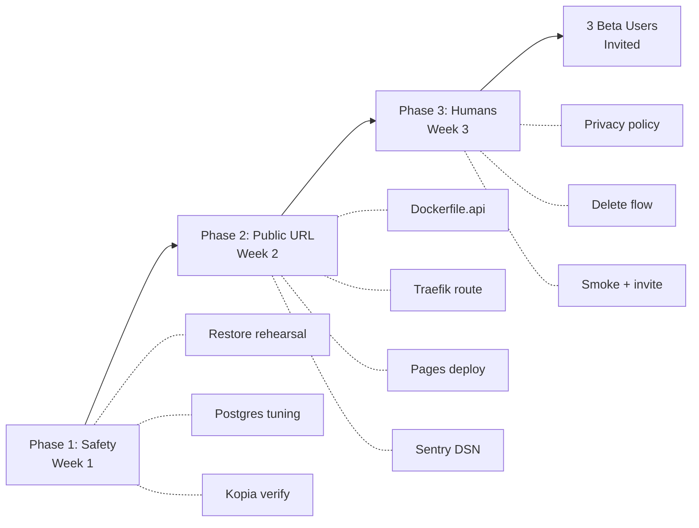

# Take Knowlune Online — Beta Launch (≤10 Users)

## Overview

Ship Knowlune to a public URL for a closed beta (≤10 invited users) in three phases over three weeks. Split frontend hosting (Cloudflare Pages at `app.pedrolages.net`) from the Express API (titan behind Traefik at `api.pedrolages.net`) while keeping Supabase on the existing self-hosted `titan` deployment. Close five production-readiness gaps identified in the audit before inviting any users. Defer managed-Supabase migration, WAL-G PITR, and Express→Workers port until triggered by growth.

**Target architecture:**

```
                    ┌─────────────────────────────┐
  users (browser)   │   app.pedrolages.net        │   ← Cloudflare Pages (SPA)
      ──────▶       │   Vite SPA + PWA            │
                    └────────────┬────────────────┘
                                 │ fetch /api/*
                                 │ fetch supabase
                                 ▼
                    ┌─────────────────────────────┐
                    │  api.pedrolages.net         │   ← titan: Express (Docker)
                    │  Express :3001              │      behind Traefik
                    └────────────┬────────────────┘
                                 │ service-role queries
                                 ▼
                    ┌─────────────────────────────┐
                    │  supabase.pedrolages.net    │   ← titan: Supabase stack
                    │  kong → postgrest/auth/…    │      (unchanged)
                    └─────────────────────────────┘
```

## Problem Frame

Knowlune is currently localhost-only. The research audit (see origin) confirmed:
- **Infrastructure is 80% ready.** Titan has a production-grade Supabase stack (Postgres 15.8, daily `pg_dumpall` + Kopia offsite, Traefik + Cloudflare Tunnel + CrowdSec, RLS enabled).
- **Frontend build is production-ready.** Vite SPA + PWA, Sentry wiring already present (`src/lib/errorTracking.ts`), hardened Express middleware (JWT + origin + entitlement + rate limit).
- **Five gaps block inviting humans**: no restore rehearsal, un-tuned Postgres, unverified Kopia coverage for the dumps path, no error-tracking DSN, no privacy policy / delete-account flow.

The beta is invite-only at ≤10 users. Goal is cheapest reversible path — do not over-invest in scaling, SLAs, or PITR that are only warranted at 50+ paying users.

## Requirements Trace

- **R1.** Public URL serves the PWA at `https://app.pedrolages.net` with HTTPS, SPA routing, and offline support preserved.
- **R2.** Express API reachable at `https://api.pedrolages.net` with existing middleware chain (origin + JWT + entitlement + rate limit) intact.
- **R3.** Supabase at `https://supabase.pedrolages.net` remains the single source of truth; no data migration.
- **R4.** Daily Supabase `pg_dumpall` is proven restorable via at least one rehearsed restore to a throwaway container.
- **R5.** Kopia offsite backup verifiably includes the Supabase dump directory.
- **R6.** Postgres runs with tuned settings suited to a 31 GB host (not container defaults).
- **R7.** Frontend and API report errors to Sentry in production.
- **R8.** Public-facing legal surface: privacy policy, terms, and account deletion flow in-app.
- **R9.** First 3 beta users can sign up, use the app for one week, delete their account, and the developer sees errors in Sentry within minutes.
- **R10.** Rollback path: deploying Pages is reversible in <5 minutes (DNS swap); containerized API is reversible via Traefik label toggle.

## Scope Boundaries

- **Not in scope.** Migration to Supabase Cloud. WAL-G / point-in-time recovery. Porting Express → Cloudflare Workers. Stripe / billing (BYOK mode only for beta). Marketing site / landing page. OAuth providers beyond email (defer Google/Apple).
- **Not in scope.** Public waitlist or invite code system — invites are manual (Pedro adds emails to Supabase Auth).

### Deferred to Separate Tasks

- **Supabase Cloud Pro migration.** Trigger = ~50 paying users, first compliance ask, OR first sustained uptime complaint. Migration path documented in origin §5.
- **WAL-G PITR.** Trigger = 24h data-loss window becomes unacceptable.
- **Express → Cloudflare Workers port.** 2027 goal. Removes titan as a dependency.
- **Uptime Kuma public status page.** Nice-to-have; not blocking beta.
- **Docker memory limits on Supabase containers.** Add when memory pressure causes an OOM (current swap usage is a smell, not a fire).

## Context & Research

### Relevant Code and Patterns

- [Dockerfile](Dockerfile) — existing bundled image (Nginx + Node). Plan splits this into an API-only image.
- [nginx.conf](nginx.conf) — current SPA + `/api/` proxy config. SPA-serving blocks move to Pages; `/api/` proxy logic moves to Traefik.
- [server/index.ts:31-58](server/index.ts) — Express entry + middleware chain. No code changes needed — only env wiring.
- [server/middleware/origin-check.ts](server/middleware/origin-check.ts) — reads `ALLOWED_ORIGINS` comma-list. Add `https://app.pedrolages.net`.
- [src/lib/errorTracking.ts](src/lib/errorTracking.ts) — Sentry already wired; graceful no-op without DSN. Only the DSN env var is needed.
- [.env.example](.env.example) — documents all required env vars including `VITE_SUPABASE_URL`, `SUPABASE_JWT_SECRET`, `ALLOWED_ORIGINS`, `VITE_SENTRY_DSN`.
- [vite.config.ts](vite.config.ts) — `VitePWA` plugin + `ollamaDevProxy` / `youtubeTranscriptProxy` dev-only plugins. Production build is unaffected.
- [src/main.tsx](src/main.tsx) — Sentry init site (already calls `VITE_SENTRY_DSN`).

### Existing titan infrastructure to reuse

- Traefik v3.6 at `/mnt/user/appdata/traefik/dynamic/` — drop `api.yml` (new) alongside existing `knowlune.yml` (which becomes obsolete or gets rewritten).
- Cloudflare Tunnel (dashboard-managed) — add `api.pedrolages.net` ingress to the tunnel config via CF Zero Trust UI.
- Cloudflare DNS wildcard `*.pedrolages.net` — `app`, `api` both resolve via wildcard.
- Daily backup script at `/mnt/user/docker/scripts/pre-backup.sh` — already dumps supabase-db; no changes needed for R4/R5, only verification.
- Kopia offsite via `/snapshot/appdata` — verify path coverage includes `/mnt/cache/appdata/supabase/db/dumps`.

### Institutional Learnings

- Memory directive [reference_supabase_unraid.md](~/.claude/projects/-Volumes-SSD-Dev-Apps-Knowlune/memory/reference_supabase_unraid.md): self-hosted Supabase on Unraid is the established path (E19).
- Memory directive [project_abs_cors_proxy.md](~/.claude/projects/-Volumes-SSD-Dev-Apps-Knowlune/memory/project_abs_cors_proxy.md): Express backend proxy is required for CORS-blocked APIs — reaffirms keeping Express alive.
- Memory directive [project_tauri_rejected.md](~/.claude/projects/-Volumes-SSD-Dev-Apps-Knowlune/memory/project_tauri_rejected.md): PWA-first, no desktop wrapper — reaffirms Cloudflare Pages choice.

### External References

- [Supabase Production Checklist](https://supabase.com/docs/guides/deployment/going-into-prod) — RLS, rate limits, CORS, JWT secret hygiene.
- [React + Vite on Cloudflare Pages](https://developers.cloudflare.com/pages/framework-guides/deploy-a-react-site/) — `not_found_handling = "single-page-application"` in `wrangler.toml`.
- [Supabase self-hosted backup/restore](https://www.supascale.app/blog/supabase-self-hosted-backup-restore-guide) — restore rehearsal pattern.
- Origin research doc §§1, 4, 7 — audit findings, multi-user checklist, 5-gap list.

## Key Technical Decisions

- **Split architecture** (Pages for SPA, titan for API + Supabase) chosen over bundled titan-only deploy. Rationale: edge caching, unlimited bandwidth on CF Pages free tier, and preview deploys on PR outweigh the small cost of two deployables.
- **Keep Supabase on titan** for the beta. Rationale: Kopia offsite pipeline is already better than Supabase Pro's daily-only backups; $300/yr buys no meaningful risk reduction at ≤10 users (see origin §3).
- **New `Dockerfile.api`** sibling to existing `Dockerfile` instead of mutating it. Rationale: preserves the bundled image as a rollback fallback; `Dockerfile` can be deleted later once split is proven.
- **Beta auth = email magic links only** (Supabase default). Rationale: fewer OAuth surfaces to configure; magic link is the simplest invite flow.
- **Privacy policy stored in-repo as Markdown + rendered React page.** Rationale: version-controlled, auditable, accessible without external dependencies.
- **Delete-account flow runs via Supabase Auth admin API from the Express server** — never from the browser. Rationale: deletion is irreversible; service-role key must never ship client-side.
- **Rollback strategy:** each phase ends with a verifiable rollback step documented in the unit's `Verification` section.

## Open Questions

### Resolved During Planning

- **Which frontend host?** Cloudflare Pages (origin §2).
- **Keep or split Dockerfile?** Split into `Dockerfile.api` for titan; Pages handles SPA from `dist/`.
- **Supabase Cloud now or later?** Later. Stay on titan through beta (origin §3).
- **What Postgres settings?** `shared_buffers=2GB, effective_cache_size=8GB, work_mem=16MB, maintenance_work_mem=512MB, max_connections=50` (origin §7.3).

### Deferred to Implementation

- **Exact Traefik middleware chain for `api.pedrolages.net`** — likely reuse `chain-public@file` from existing `knowlune.yml`, but confirm CrowdSec + rate-limit middlewares compose correctly during Phase 2.
- **CORS headers for Supabase PostgREST** — may need kong config update to include `https://app.pedrolages.net` as an allowed origin. Determine when first real request fails in Phase 2 verification.
- **Privacy policy copy wording** — draft when writing Phase 3. Base on a standard indie-SaaS template + Supabase/Sentry data-flow disclosure.
- **Which 3 beta testers to invite first** — choose at end of Phase 3.

## High-Level Technical Design

> *This illustrates the intended approach and is directional guidance for review, not implementation specification.*

**Phase sequencing:**



**Ingress flow for a Pages-hosted browser call:**

```
Browser
  ├─ GET https://app.pedrolages.net/*          → Cloudflare Pages (static)
  ├─ POST https://api.pedrolages.net/api/ai/*  → CF Tunnel → Traefik → api-container:3001
  └─ POST https://supabase.pedrolages.net/*    → CF Tunnel → Traefik → kong:8000
```

## Implementation Units

### Phase 1 — Make titan production-safe (Week 1)

Goal: close safety gaps before any external traffic. End of phase = you can sleep knowing a full DB loss is recoverable.

- [ ] **Unit 1: Rehearse a Supabase restore**

**Goal:** Prove the daily `pg_dumpall` is restorable. Produces a written runbook committed to the repo.

**Requirements:** R4.

**Dependencies:** None.

**Files:**
- Create: `docs/runbooks/supabase-restore-rehearsal.md`

**Approach:**
- Pick yesterday's `supabase_dumpall_*.sql` from `/mnt/cache/appdata/supabase/db/dumps/` on titan.
- Spin up a throwaway `postgres:15-alpine` container on titan with a separate volume.
- `psql < supabase_dumpall_*.sql`.
- Verify at least: row counts on `video_progress`, `study_sessions`, `content_progress`, and Supabase internal schemas exist (`auth.users`, `storage.buckets`).
- Record wall-clock restore time.
- Document the exact command sequence, gotchas, and time taken in the runbook.

**Patterns to follow:**
- [Supabase self-hosted backup/restore guide](https://www.supascale.app/blog/supabase-self-hosted-backup-restore-guide).
- Existing docs tone in [docs/runbooks/](docs/runbooks/) if any exist, otherwise match [docs/solutions/](docs/solutions/) structure.

**Test scenarios:**
- Integration: restore a real dump to a throwaway container → row counts match origin (±0, same day).
- Edge case: attempt restore with a corrupted/truncated dump file → error is clear and documented.
- Integration: measure restore wall-clock time → record in runbook for SLO planning.

**Verification:**
- Runbook exists in `docs/runbooks/supabase-restore-rehearsal.md` with reproducible commands.
- The runbook's "verified on" date is within 24 h.
- Restore completed without errors; at least one row from each of the three user-data tables exists in the restored DB.

---

- [ ] **Unit 2: Verify Kopia offsite covers Supabase dumps**

**Goal:** Confirm `/mnt/cache/appdata/supabase/db/dumps/` is inside Kopia's `/snapshot/appdata` source and is actually being backed up offsite.

**Requirements:** R5.

**Dependencies:** None (parallel to Unit 1).

**Files:**
- Modify (if needed): `/mnt/user/docker/scripts/pre-backup.sh` on titan — only if coverage is missing.
- Modify (if needed): Kopia policy via `kopia policy set` — only if exclusion rule found.
- Append to: `docs/runbooks/supabase-restore-rehearsal.md` (Unit 1 output) with a "Kopia coverage verified" section.

**Approach:**
- SSH titan. Run `docker exec kopia kopia snapshot list /snapshot/appdata` and confirm recent snapshot includes the supabase dumps path.
- `docker exec kopia kopia snapshot contents <snapshot-id> | grep supabase_dumpall` to verify filenames are present.
- If missing: update `pre-backup.sh` to add `/mnt/cache/appdata/supabase/db/dumps` as an explicit `KOPIA_SOURCES` entry.
- Document the verification command in the runbook so it can be re-run quarterly.

**Test scenarios:**
- Integration: `kopia snapshot contents` lists at least one `supabase_dumpall_*.sql` from the last 7 days.
- Edge case: if the dumps path is missing from any recent snapshot, script is updated and a fresh snapshot is triggered to confirm inclusion.

**Verification:**
- Command output (copied into runbook) shows a supabase dump in a Kopia snapshot from within the last 24 h.

---

- [ ] **Unit 3: Tune Postgres for the titan host**

**Goal:** Replace container-default Postgres settings with values suited to a 31 GB / 16-core host, reducing the risk of OOM under beta load.

**Requirements:** R6.

**Dependencies:** Unit 1 complete (rollback path exists if tuning breaks something).

**Files:**
- Modify: `/mnt/user/appdata/supabase/db/postgresql.conf` on titan (or append via the Supabase-recommended `postgresql-custom.conf` include mechanism).
- Append to: `docs/runbooks/supabase-restore-rehearsal.md` with a "Postgres tuning" section noting the pre-change values, the new values, and the date applied.

**Approach:**
- Change settings: `shared_buffers=2GB`, `effective_cache_size=8GB`, `work_mem=16MB`, `maintenance_work_mem=512MB`, `max_connections=50`. Keep `wal_level=logical` and existing defaults for everything else.
- Restart `supabase-db` container.
- Confirm new values via `SELECT name, setting, unit FROM pg_settings WHERE name IN (…)`.
- Observe `free -h` and `docker stats supabase-db` for 30 min — confirm memory usage climbs but doesn't push the host past 90% or trigger OOM.
- Rollback path: revert the conf file, restart container. Documented in the runbook.

**Patterns to follow:**
- [PGTune](https://pgtune.leopard.in.ua/) baseline for "Mixed" workload, 31 GB RAM, 16 cores, 100 connections (then cap at 50 since Supavisor pools).

**Test scenarios:**
- Happy path: `pg_settings` query shows new values after restart.
- Error path: if container fails to restart after conf change, revert conf and restart — container comes back healthy.
- Integration: run a synthetic workload (`pgbench -c 10 -j 2 -T 30`) against a non-production DB on titan → no errors; confirm memory grows but doesn't exceed host capacity.
- Edge case: verify supavisor still connects with `max_connections=50` (supavisor's pool size must be ≤50 minus superuser reserve).

**Verification:**
- Postgres reports new values for all five tuned settings.
- `supabase-db` container status is `healthy` 30 min after restart.
- No OOM events in `dmesg | grep -i oom` on titan.
- Host RAM usage is at or below pre-change baseline (swap usage should drop, not grow).

---

### Phase 2 — Ship the public URL (Week 2)

Goal: `https://app.pedrolages.net` serves the SPA; `https://api.pedrolages.net` serves the Express API; both are reachable from any browser.

- [ ] **Unit 4: Create `Dockerfile.api` (Express-only image)**

**Goal:** Produce a minimal image containing only the Express server — no nginx, no SPA — suitable for running behind Traefik at `api.pedrolages.net`.

**Requirements:** R2.

**Dependencies:** None.

**Files:**
- Create: `Dockerfile.api`
- Create: `.dockerignore.api` (optional — or reuse existing `.dockerignore`)
- Modify: `docs/runbooks/` with a deploy runbook fragment for the API image.

**Approach:**
- Two-stage build: (1) `node:24-alpine` builder runs `npm ci && npx tsc -p server/tsconfig.json`; (2) runtime stage `node:24-alpine` copies `server/dist`, `package.json`, `package-lock.json`, runs `npm ci --omit=dev`.
- `EXPOSE 3001`.
- `HEALTHCHECK` curls `http://localhost:3001/health` (confirm the Express `/health` route exists in [server/index.ts](server/index.ts), add one if not).
- `CMD ["node", "server/index.js"]`.
- Do not include the SPA `dist/` or nginx.

**Patterns to follow:**
- Existing [Dockerfile](Dockerfile) staging pattern — simplify by dropping Nginx and SPA copy.
- Existing [docker-entrypoint.sh](docker-entrypoint.sh) is not needed for API-only (no nginx to start in background).

**Test scenarios:**
- Happy path: `docker build -f Dockerfile.api -t knowlune-api:test .` succeeds; `docker run -p 3001:3001 knowlune-api:test` starts and returns 200 on `/health`.
- Edge case: missing env vars (`SUPABASE_JWT_SECRET` etc.) — server starts but logs the "middleware not configured" warning from [server/index.ts:54-58](server/index.ts) and does not crash.
- Integration: container health-check transitions to `healthy` within `HEALTHCHECK --start-period`.
- Error path: bad JWT on a protected route returns 401 (proves middleware is live).

**Verification:**
- `docker inspect knowlune-api:test --format '{{.State.Health.Status}}'` reports `healthy`.
- Image size is smaller than the bundled `Dockerfile` image (no nginx, no SPA assets).

---

- [ ] **Unit 5: Add `/health` route to Express (if missing)**

**Goal:** Ensure the API container has a trivial, unauthenticated health endpoint for Traefik + Docker healthcheck.

**Requirements:** R2.

**Dependencies:** None (may run before Unit 4 since Unit 4's healthcheck depends on it).

**Files:**
- Modify: `server/index.ts`
- Test: `server/__tests__/health.test.ts`

**Approach:**
- Add `app.get('/health', (_req, res) => res.json({ ok: true, ts: Date.now() }))` registered *before* the middleware chain so it is not auth-gated.
- Keep response small, no DB query — this is a liveness probe, not a readiness check.

**Execution note:** Test-first — write the test, then the route.

**Patterns to follow:**
- Existing unauthenticated endpoint pattern: `/api/ai/ollama/health` is registered before the middleware chain in [server/index.ts](server/index.ts).

**Test scenarios:**
- Happy path: GET `/health` → 200 with `{ ok: true, ts: <number> }`.
- Edge case: `/health` is reachable without `Authorization` header (not JWT-gated).
- Edge case: `/health` is reachable without `Origin` header (not origin-check-gated).

**Verification:**
- Test passes. `curl http://localhost:3001/health` returns 200 locally.

---

- [ ] **Unit 6: Deploy API container on titan behind Traefik**

**Goal:** `https://api.pedrolages.net` serves the Express API, reachable via Cloudflare Tunnel, with HTTPS, CrowdSec, and correct CORS.

**Requirements:** R2, R10.

**Dependencies:** Units 4, 5.

**Files:**
- Create: `/mnt/user/appdata/traefik/dynamic/knowlune-api.yml` (new Traefik dynamic config) — on titan.
- Create: `/mnt/user/appdata/knowlune-api/docker-compose.yml` — on titan; runs the image with env vars, on `traefik_proxy` network.
- Create: `/mnt/user/appdata/knowlune-api/.env` — on titan; contains `SUPABASE_JWT_SECRET`, `SUPABASE_SERVICE_ROLE_KEY`, `VITE_SUPABASE_URL=https://supabase.pedrolages.net`, `ALLOWED_ORIGINS=https://app.pedrolages.net,http://localhost:5173`.
- Modify: Cloudflare Zero Trust tunnel ingress (dashboard) — add `api.pedrolages.net` → `http://<titan-traefik>:443`.
- Modify (rename-in-place): the obsolete [`/mnt/user/appdata/traefik/dynamic/knowlune.yml`](/mnt/user/appdata/traefik/dynamic/knowlune.yml) on titan — either delete or repurpose for the API route. Recommendation: delete; `knowlune-api.yml` replaces it.

**Approach:**
- Build the API image on a dev machine (or pull from a registry if one is set up); load onto titan via `docker load` or a private registry.
- `docker compose up -d` launches `knowlune-api` on the `traefik_proxy` network.
- Traefik dynamic config routes `Host(\`api.pedrolages.net\`)` → `knowlune-api:3001`, applying `chain-public@file` middleware (same as existing apps).
- Add DNS: `api.pedrolages.net` — CNAME to the Cloudflare Tunnel (wildcard should already cover this).
- Add the Zero Trust tunnel hostname.

**Patterns to follow:**
- Existing [`/mnt/user/appdata/traefik/dynamic/audiobookshelf.yml`](/mnt/user/appdata/traefik/dynamic/audiobookshelf.yml) on titan — shows the minimal dynamic config shape.
- Existing cloudflared ingress for `supabase.pedrolages.net` — mirror the pattern.

**Test scenarios:**
- Happy path: `curl https://api.pedrolages.net/health` from a machine outside titan → 200 JSON.
- Error path: `curl https://api.pedrolages.net/api/ai/generate` without JWT → 401 (proves middleware is live).
- Error path: `curl -H "Origin: https://evil.com" https://api.pedrolages.net/api/ai/generate` → 403 (proves origin check).
- Integration: `curl https://api.pedrolages.net/health` from inside titan (via Docker network alias) and from public internet both succeed — proves Traefik + Tunnel both work.
- Edge case: pause the container; Traefik returns 502/503 promptly without timeouts (bounded failure).
- Rollback: `docker compose down` — Traefik returns 404 for the hostname; prior routes unaffected. DNS unchanged.

**Verification:**
- External HTTPS 200 on `/health`.
- External 401 on a protected route with no auth.
- CrowdSec bouncer logs show the route is being evaluated.
- `docker compose down` succeeds and the domain goes dark cleanly (rollback proven).

---

- [ ] **Unit 7: Deploy SPA to Cloudflare Pages**

**Goal:** `https://app.pedrolages.net` serves the Vite SPA, with PWA offline, SPA routing (`not_found_handling = "single-page-application"`), GitHub-triggered deploys.

**Requirements:** R1, R10.

**Dependencies:** Unit 6 (so the SPA can reach the API on first smoke test).

**Files:**
- Create: `wrangler.toml` at repo root.
- Create: `.github/workflows/deploy-pages.yml` (optional — Cloudflare dashboard integration can auto-deploy from GitHub without a workflow file; use a workflow only if you want PR previews controlled in-repo).
- Modify: `.env.example` — add comment pointing to production env vars set in Pages dashboard.
- Modify: [src/lib/config.ts](src/lib/config.ts) or equivalent, if one exists, to ensure `VITE_API_BASE_URL=https://api.pedrolages.net` is honored. If no such file exists, document the env var in README.

**Approach:**
- Create Cloudflare Pages project via dashboard; point at the GitHub repo; branch = `main` for production, `develop` / PRs for previews.
- Build command: `npm run build`. Output dir: `dist/`.
- Env vars set in Pages dashboard (production scope): `VITE_SUPABASE_URL=https://supabase.pedrolages.net`, `VITE_SUPABASE_ANON_KEY=<from Supabase Studio>`, `VITE_API_BASE_URL=https://api.pedrolages.net`, `VITE_SENTRY_DSN=<from Sentry>` (deferred to Unit 8).
- Add `app.pedrolages.net` as custom domain. Cloudflare Pages auto-provisions TLS.
- `wrangler.toml`: `not_found_handling = "single-page-application"`, `pages_build_output_dir = "dist"`.

**Patterns to follow:**
- [React on Cloudflare Pages docs](https://developers.cloudflare.com/pages/framework-guides/deploy-a-react-site/).
- Existing `.github/workflows/` pattern for consistency if adding a workflow file.

**Test scenarios:**
- Happy path: push to `main` → Pages deploys; `https://app.pedrolages.net/` returns 200 and loads the PWA shell.
- Happy path: `https://app.pedrolages.net/overview` (deep link) → 200 with the overview route (SPA fallback works).
- Happy path: open DevTools → Application → Service Worker → PWA is registered.
- Integration: SPA makes a request to `https://api.pedrolages.net/api/ai/ollama/health` → 200 (CORS allows `app.pedrolages.net`).
- Integration: sign-in flow reaches `https://supabase.pedrolages.net` without CORS errors.
- Rollback: revert the custom-domain binding in Pages dashboard OR change DNS CNAME — site returns to "not configured" within 5 min.
- Edge case: PWA installed as app on mobile → works offline for pages already visited.

**Verification:**
- Public HTTPS 200 on `/` and on a deep route (SPA routing).
- Service worker registered (Application tab).
- One real end-to-end user flow completes (sign up → add a course → log progress → see it in overview).
- Rollback rehearsed in staging branch or preview deploy.

---

- [ ] **Unit 8: Wire Sentry DSN to both SPA and API**

**Goal:** Errors in production flow to Sentry within seconds, from both the browser and the Express server.

**Requirements:** R7, R9.

**Dependencies:** Units 6, 7 (need live deploys to test).

**Files:**
- Modify: Cloudflare Pages dashboard env vars — add `VITE_SENTRY_DSN`.
- Modify: `/mnt/user/appdata/knowlune-api/.env` on titan — add `SENTRY_DSN` (server-side).
- Modify: `server/index.ts` — add Sentry init for the server side (mirroring existing `src/lib/errorTracking.ts` pattern). If a server-side Sentry wrapper does not yet exist, create `server/lib/errorTracking.ts`.
- Test: `server/__tests__/error-tracking.test.ts`

**Approach:**
- Create a Sentry project (free tier: 5k errors/month).
- Grab the DSN. Set it in both Pages (browser scope) and titan `.env` (server scope).
- Browser side already works via [src/lib/errorTracking.ts](src/lib/errorTracking.ts) — no code change.
- Server side: install `@sentry/node` (check if already present in `package.json`), initialize in `server/index.ts` before route registration, and add an Express error handler that calls `Sentry.captureException`.

**Execution note:** Test-first for the server-side wrapper — it should no-op cleanly when `SENTRY_DSN` is absent (parity with browser behavior).

**Patterns to follow:**
- Mirror the no-op-when-unset pattern from [src/lib/errorTracking.ts](src/lib/errorTracking.ts).

**Test scenarios:**
- Happy path (browser): manually throw an error from DevTools → Sentry Issues dashboard shows it within 60 s.
- Happy path (server): trigger a 500 on the API (e.g., malformed request that bypasses middleware) → Sentry shows it within 60 s.
- Edge case: unset `SENTRY_DSN` → server starts without error, `reportError` no-ops (like browser).
- Integration: source maps upload correctly so Sentry stack traces are de-minified (Pages + Vite auto-upload via `@sentry/vite-plugin`).

**Verification:**
- Two test errors (one browser, one server) visible in Sentry with stack traces.
- API logs show `[sentry] initialized` at startup.
- No error-tracking regression tests fail.

---

### Phase 3 — Legal + humans (Week 3)

Goal: compliant enough to invite real humans; first 3 beta users are actively using the app.

- [ ] **Unit 9: Privacy policy + Terms of Service pages**

**Goal:** Public `/privacy` and `/terms` routes backed by Markdown in the repo, disclosing Supabase + Sentry + Cloudflare data flows. Linked from the signup flow and the app footer.

**Requirements:** R8.

**Dependencies:** Unit 7 (Pages live).

**Files:**
- Create: `docs/legal/privacy-policy.md`
- Create: `docs/legal/terms-of-service.md`
- Create: `src/app/pages/Privacy.tsx`
- Create: `src/app/pages/Terms.tsx`
- Modify: `src/app/routes.tsx` — add `/privacy` and `/terms` routes.
- Modify: `src/app/components/Layout.tsx` (or wherever the footer lives) — add links.
- Modify: `src/app/pages/auth/SignUp.tsx` (or equivalent) — add "By signing up you agree to…" checkbox/text.
- Test: `src/app/pages/__tests__/Privacy.test.tsx`

**Approach:**
- Write the policies as Markdown first (easier to iterate). Use a standard indie-SaaS template (e.g., Plain English privacy policy) and customize with the specific data flows: Supabase (EU/US region), Sentry (error data), Cloudflare (IP addresses, request logs).
- Build `Privacy.tsx` / `Terms.tsx` that import the Markdown via `?raw` suffix and render with a Markdown component (check if one exists; many shadcn-based projects have one).
- Add signup consent checkbox that must be ticked before submit.

**Patterns to follow:**
- Existing page components in [src/app/pages/](src/app/pages/) for layout/style consistency.
- Existing routing pattern in [src/app/routes.tsx](src/app/routes.tsx).

**Test scenarios:**
- Happy path: `/privacy` and `/terms` render without console errors.
- Integration: links from footer + signup reach the pages.
- Edge case: signup without consent checkbox → submit is disabled.
- Accessibility: pages have a single `<h1>`, proper heading hierarchy, readable on mobile.

**Verification:**
- Both routes 200 and render full content on `app.pedrolages.net`.
- Signup form cannot submit without consent.
- Links in footer work from every page.

---

- [ ] **Unit 10: Account deletion flow (GDPR right to erasure)**

**Goal:** A signed-in user can delete their account from Settings. Deletion removes their row from `auth.users`, all user-owned rows via RLS cascade, and their Storage files. Action is audit-logged.

**Requirements:** R8, R9.

**Dependencies:** Unit 6 (API is live; deletion runs server-side).

**Files:**
- Create: `server/routes/account.ts` — `DELETE /api/account` endpoint.
- Modify: `server/index.ts` — register the router.
- Create: `src/app/pages/settings/DeleteAccount.tsx` — UI component with double-confirmation.
- Modify: `src/app/pages/Settings.tsx` — add a "Delete Account" section.
- Create: `supabase/migrations/NNNN_audit_account_deletions.sql` — audit table + RLS.
- Test: `server/__tests__/routes/account.test.ts`
- Test: `src/app/pages/settings/__tests__/DeleteAccount.test.tsx`

**Approach:**
- Server endpoint accepts a signed-in JWT, calls `supabase.auth.admin.deleteUser(userId, shouldSoftDelete=false)` via service-role client.
- Before deletion, log `{ user_id, deleted_at, ip, user_agent }` to a new `account_deletions` audit table (retention: 1 year).
- Cascade logic: all user-owned tables already have RLS + `ON DELETE CASCADE` foreign keys to `auth.users.id` (verify during implementation — fix any missing cascade).
- Storage cleanup: iterate buckets, delete objects owned by `user_id`. (Storage is currently empty per audit §Appendix A, but wire the logic for forward-compatibility.)
- Client UI: two-step confirmation — type email to confirm, then click Delete.
- On success: client clears local state, redirects to `/`.

**Execution note:** Test-first for the server route — deletion is irreversible, coverage is non-negotiable.

**Patterns to follow:**
- Existing service-role usage in [server/middleware/entitlement.ts](server/middleware/entitlement.ts).
- Existing test pattern in [server/__tests__/middleware/entitlement.test.ts](server/__tests__/middleware/entitlement.test.ts).

**Test scenarios:**
- Happy path: valid JWT + correct email confirm → user deleted, audit row written, client redirects.
- Error path: valid JWT but email confirmation mismatch → 400.
- Error path: expired/invalid JWT → 401.
- Error path: `supabase.auth.admin.deleteUser` fails → 500 with no partial delete (audit row not written if deletion fails).
- Edge case: user with existing courses, progress, sessions → all user-owned rows gone after deletion (cascade verified).
- Edge case: user with Storage files → all objects in their bucket prefix removed.
- Integration: post-deletion, the deleted user cannot sign in (magic link returns "user not found").
- Integration: audit row survives deletion (retained for 1 year).

**Verification:**
- Test user deleted end-to-end on staging; no orphan rows in user-data tables.
- Audit row present and queryable.
- Storage objects for the user removed (manual check since Storage is empty today).

---

- [ ] **Unit 11: Production smoke test + invite 3 beta users**

**Goal:** Run a full E2E smoke on production (not just unit tests), then send invites.

**Requirements:** R9.

**Dependencies:** Units 1–10.

**Files:**
- Create: `docs/runbooks/beta-launch-checklist.md`
- Modify: append to `docs/runbooks/supabase-restore-rehearsal.md` — "Beta launch smoke run completed YYYY-MM-DD".

**Approach:**
- Manual E2E on `https://app.pedrolages.net` as a fresh incognito session:
  - Sign up → receive magic link → click → land signed in.
  - Add a course, log some progress, navigate all six main sections.
  - Open Settings → Delete Account → confirm → verify redirected and signed out.
  - Sign up *again* with same email → succeeds (proves hard delete worked).
- Trigger one intentional error to confirm it lands in Sentry.
- Confirm `supabase.pedrolages.net` logs show expected activity.
- Pick 3 beta users. Send invites (manual: add emails to Supabase Auth as invited users, or send magic-link invites).
- Create the beta launch runbook documenting all above for future cohorts.

**Test scenarios:**
- Integration: complete signup → use → delete → re-signup flow on production with no errors.
- Integration: intentional browser error lands in Sentry with readable stack trace.
- Integration: intentional server error lands in Sentry with readable stack trace.
- Edge case: sign in on mobile (PWA installed) → offline mode works for already-visited routes.

**Verification:**
- Smoke run completes with zero unexpected errors.
- Three beta invites sent.
- Runbook committed.

## System-Wide Impact

- **Interaction graph:** SPA (Pages) ↔ Express API (titan) ↔ Supabase (titan). New cross-origin surfaces require explicit CORS allowlist in both Express (`ALLOWED_ORIGINS`) and Supabase kong. Sentry adds an outbound data flow from both SPA and API.
- **Error propagation:** Browser errors → `src/lib/errorTracking.ts` → Sentry. Server errors → new `server/lib/errorTracking.ts` → Sentry. Middleware rejections (401/403/429) are logged but not escalated to Sentry (they're expected).
- **State lifecycle risks:** Account deletion must be atomic — cascade failures could leave orphan rows. Mitigation: DB-level `ON DELETE CASCADE` + explicit Storage cleanup + audit row only written on success.
- **API surface parity:** The API currently serves `localhost:5173` and `localhost:4173`. After Phase 2 it also serves `app.pedrolages.net`. `ALLOWED_ORIGINS` is the single source of truth — no other origin-check code should be added.
- **Integration coverage:** End-to-end smoke (Unit 11) proves the three-surface routing, CORS, and Sentry paths work together — unit tests alone cannot prove this.
- **Unchanged invariants:** Supabase schema, RLS policies, sync engine (E92), IndexedDB/Dexie local-first behavior, all existing routes — none of these are touched. The only code additions are `/health`, `/api/account`, privacy/terms pages, server-side Sentry init.

## Risks & Dependencies

| Risk | Mitigation |
|------|------------|
| Postgres tuning (Unit 3) causes startup failure or OOM on titan. | Rollback path in runbook; synthetic `pgbench` test on a non-production DB before applying to main DB; Unit 1 restore rehearsal gives a recovery path if data corruption occurs. |
| CORS misconfiguration blocks the SPA after Pages deploy. | Explicit cross-origin smoke test in Unit 7 test scenarios; `ALLOWED_ORIGINS` env checked in `server/index.ts:54-58`. |
| Sentry DSN leaks into git. | DSN is a *public* browser-side token (by design); server-side DSN goes in titan `.env` which is already gitignored. Verify `.env` patterns in `.gitignore`. |
| Account deletion cascade misses a user-owned table → GDPR non-compliance. | Pre-Unit-10 audit: grep for all tables referencing `auth.users(id)`, confirm each has `ON DELETE CASCADE`. Add migration if missing. Test scenarios enumerate cascade proof. |
| Cloudflare Pages env vars not available at build time → runtime errors. | Pages resolves `VITE_*` vars at build time; test via preview deploy before cutting `main`. |
| Titan reboot or ISP outage during invite week. | Acceptable at beta scale. If it becomes chronic, trigger Supabase Cloud migration (deferred). Set expectations in the invite email ("hobby infra, expect ≤99% uptime"). |
| Beta user reports a bug that requires a hotfix during rollout. | Pages auto-deploys from `main` on git push — hotfix cycle is <5 min. API hotfix cycle requires `docker compose up -d --build` on titan (~2 min). |
| Service-role key exposure via a buggy API route. | All route handlers should use the service-role client only inside middleware-gated paths. `DELETE /api/account` is the only new consumer; review it specifically in Unit 10. |

## Documentation / Operational Notes

- **Runbooks to create:** `docs/runbooks/supabase-restore-rehearsal.md` (Unit 1), `docs/runbooks/beta-launch-checklist.md` (Unit 11). If the directory does not yet exist, create it.
- **README updates:** production URL, Sentry reporting, "how to invite a beta user" short section.
- **CLAUDE.md updates:** add `Production URLs` section noting `app.pedrolages.net`, `api.pedrolages.net`, `supabase.pedrolages.net` so future sessions have correct context.
- **Monitoring:** at beta scale, Sentry alone is sufficient. Watch Sentry daily for the first week.
- **Rollback playbook:** each Unit's `Verification` section lists a rollback step; Unit 11 runbook consolidates them into a "red button" checklist.

## Sources & References

- **Origin document:** [_bmad-output/planning-artifacts/research/domain-knowlune-online-hosting-research-2026-04-18.md](_bmad-output/planning-artifacts/research/domain-knowlune-online-hosting-research-2026-04-18.md)
- **Related plans:** [docs/plans/2026-03-31-supabase-data-sync-design.md](docs/plans/2026-03-31-supabase-data-sync-design.md)
- **Related code:**
  - [Dockerfile](Dockerfile), [nginx.conf](nginx.conf), [docker-entrypoint.sh](docker-entrypoint.sh)
  - [server/index.ts](server/index.ts) and [server/middleware/](server/middleware/)
  - [src/lib/errorTracking.ts](src/lib/errorTracking.ts)
  - [.env.example](.env.example)
- **External docs:**
  - [Supabase Production Checklist](https://supabase.com/docs/guides/deployment/going-into-prod)
  - [React + Vite on Cloudflare Pages](https://developers.cloudflare.com/pages/framework-guides/deploy-a-react-site/)
  - [Supabase self-hosted backup & restore](https://www.supascale.app/blog/supabase-self-hosted-backup-restore-guide)
  - [PGTune](https://pgtune.leopard.in.ua/)
- **Memory references:** `reference_supabase_unraid.md`, `project_abs_cors_proxy.md`, `project_tauri_rejected.md`.
