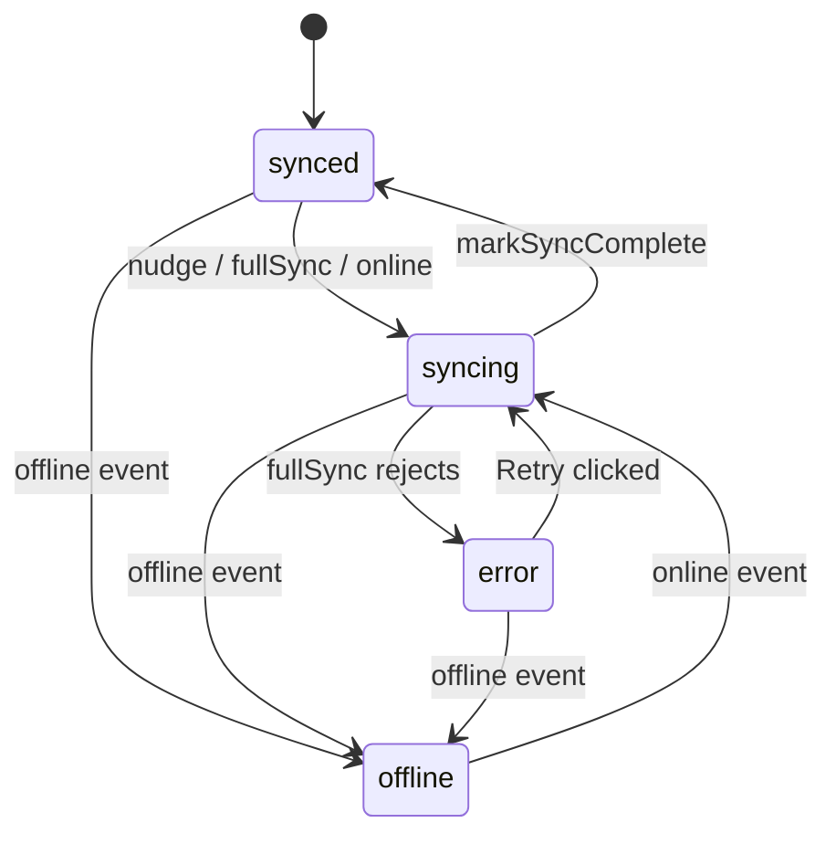

# E97-S01 — Sync Status Indicator in Header

## Overview

Add a persistent sync status indicator to the Knowlune app header. The indicator is a single icon (with optional badge) reflecting one of four states — `synced`, `syncing`, `error`, `offline` — and opens a Popover showing last-sync timestamp, pending queue depth, and, when applicable, an error message and a **Retry now** button that invokes `syncEngine.fullSync()`.

All infrastructure already exists: `useSyncStatusStore` (E92-S07), `useSyncLifecycle` transitions, `syncEngine.fullSync()`, shadcn `Popover`/`Button`/`Badge` primitives, `lucide-react` icons, `date-fns`, and `navigator.onLine` event handlers. This plan is a presentational consumer plus a small lifecycle wiring enhancement (add `lastError`, refresh `pendingCount` at the right moments).

## Problem Frame

Knowlune's sync engine (E92–E96) replicates 26 tables and Storage buckets to Supabase, but users have no way to see whether sync is healthy. The only signal today is a generic "You are offline" banner and a session-expired dot. Without visibility, users cannot trust the system: when a note written on device A doesn't appear on device B, there is no way to diagnose whether device A finished uploading. E97-S01 makes sync state legible.

(see origin: `docs/brainstorms/2026-04-19-e97-s01-sync-status-indicator-requirements.md`)

## Requirements Trace

- **R1 (AC1)** — Header renders a single status icon that reflects `useSyncStatusStore.status` with design-token colors (success / brand / destructive / muted-foreground) and uses accessible semantics (`role="status"`, `aria-live="polite"`, 44×44 trigger).
- **R2 (AC2)** — Clicking (or keyboard-activating) the trigger opens a Popover showing status label, last-sync relative timestamp (with tooltip for absolute), and pending queue depth copy.
- **R3 (AC3)** — When `status === 'error'`, Popover shows `lastError` (user-safe classification) and a **Retry now** button that calls `syncEngine.fullSync()`; button is disabled while syncing and surfaces a toast on failure.
- **R4 (AC4)** — Offline detection uses `navigator.onLine` + `online`/`offline` window events (existing `useSyncLifecycle` handlers). New listeners are not added.
- **R5 (AC5)** — Indicator updates reactively via Zustand subscription, no reload. `pendingCount` refreshes on lifecycle transitions and on Popover open.

## Scope Boundaries

- Component is a leaf consumer of `useSyncStatusStore` — no sync-engine changes.
- `navigator.onLine` listeners are reused from `useSyncLifecycle`, not re-added.
- Dead-letter queue visibility, per-table status, and queue inspection are out of scope.
- Push notifications / cross-tab sync-failure notifications are out of scope.

### Deferred to Separate Tasks

- **Full sync settings panel** (detailed per-table view, manual "pause sync", resumable dead-letter ops): E97-S02.
- **Cross-tab BroadcastChannel for status**: future story if multi-tab fan-out becomes a concern.
- **Telemetry for retry click-through**: future instrumentation story.

## Context & Research

### Relevant Code and Patterns

- `src/app/stores/useSyncStatusStore.ts` — existing store; E92-S07 comment explicitly names E97-S01/S02 as consumers. Shape: `{ status, pendingCount, lastSyncAt, setStatus, markSyncComplete, refreshPendingCount }`.
- `src/app/hooks/useSyncLifecycle.ts` — already drives status transitions. Initial fullSync and reconnection fullSync have `.catch` handlers that call `setStatus('error')` — currently without a message. This plan extends those handlers to pass a classified message.
- `src/lib/sync/syncEngine.ts` — `syncEngine.fullSync()` is the correct entry point for Retry (not `nudge()` which is upload-only and debounced).
- `src/app/components/Layout.tsx` — header action cluster around lines 558–657. Placement slot is between `<TrialIndicator />` and the theme-toggle `Button`.
- `src/app/components/ui/popover.tsx`, `button.tsx`, `badge.tsx` — existing shadcn primitives.
- `src/app/components/Layout.tsx` `useOnlineStatus` — already mounted; no duplicate listener work needed.
- Pattern precedent for icon+popover header widget: `src/app/components/figma/NotificationCenter.tsx` (referenced in `Layout.tsx`). Follow its structure for focus management and icon button accessibility.
- Pattern precedent for warning dot overlay: session-expired dot at `Layout.tsx:593–599` (shows token-based dot with `role="status"`).

### Institutional Learnings

- `.claude/rules/styling.md` — never hardcode Tailwind colors; use `text-success`, `text-brand`, `text-destructive`, `text-muted-foreground`. ESLint rule `design-tokens/no-hardcoded-colors` blocks violations at save-time.
- `.claude/rules/workflows/design-review.md` — spinners must respect `prefers-reduced-motion`; touch targets ≥44×44px; contrast verified in both themes.
- `docs/engineering-patterns.md` (implied from CLAUDE.md) — every `useEffect`/async callback that reads Zustand state must read from `get()` inside the callback, not outer render scope.
- CE memory `reference_sync_engine_api.md` — public API surface + `syncableWrite` rule; `fullSync()` is the canonical "retry" entry point.

### External References

- Not needed. The technology stack (React 19, Zustand, shadcn, lucide, Tailwind v4, Dexie) is well-established locally with multiple direct precedents. `prefers-reduced-motion` is a standard CSS media feature; Tailwind v4 supports it via `motion-reduce:` variant out of the box.

## Key Technical Decisions

- **Leaf component, not a new hook.** `useSyncStatusStore` is already the single source of truth. The new component subscribes directly — no `useSyncStatus` wrapper hook needed.
- **Retry invokes `fullSync`, not `nudge`.** `nudge` is upload-only and debounced 200ms; `fullSync` flushes queue AND pulls server changes, matching the user's mental model of "retry". Error path during retry is caught in the component and surfaces via `toast.error`.
- **Extend store signature** of `setStatus` to accept an optional error string: `setStatus(status, error?)`. Add `lastError: string | null` field. Clearing happens in `markSyncComplete`. Rationale: keeps the store self-consistent and avoids a parallel `setError` call that could race with the status transition.
- **Error classification is string-level** ("Network error", "Auth expired", "Server error", "Sync failed"). Raw Supabase error messages are not shown to users. A small `classifyError(err)` helper inside the component (or a sibling utility) maps thrown errors to those four buckets.
- **Refresh `pendingCount`** in three places: (1) inside `markSyncComplete` via store (single-line change), (2) on Popover open via component `useEffect`, (3) opportunistically after each 30s nudge interval inside `useSyncLifecycle` (cheap Dexie count). This avoids introducing a Dexie hook/observer.
- **Reduced motion** — use Tailwind's `motion-reduce:animate-none` variant on the spinner. When reduced, fall back to a static `Cloud` icon with no animation (skip the pulsing dot option to stay maximally conservative with WCAG 2.3.3).
- **Announcement strategy** — the outer trigger carries `role="status"` + `aria-live="polite"`. To prevent chatty announcements (status flips every 30s during normal sync), the `aria-label` is derived from status + pendingCount but the live region content only announces when transitioning *into* `error` or `offline`. Implement via a `useEffect` that writes a visually-hidden live message only on those transitions.
- **Placement** — between `<TrialIndicator />` and the theme-toggle `Button`. Keeps account-health affordances clustered.
- **No new listeners** — the component does not register `online`/`offline` listeners itself. Status is driven by `useSyncLifecycle`, which is already mounted at `App` root level.

## Open Questions

### Resolved During Planning

- **Q: Does Knowlune have `date-fns`?** — Yes (`package.json` declares `date-fns ^4.1.0`). Use `formatDistanceToNow` for relative time.
- **Q: Are `Popover`, `Button`, `Badge` primitives available?** — Yes, in `src/app/components/ui/`.
- **Q: Should the indicator hide when unauthenticated?** — No. Render it always; it shows `synced` with zero queue trivially when the engine is not running. Consistency outweighs the marginal clutter.
- **Q: Should we track retry telemetry?** — Deferred. Out of scope for S01.
- **Q: Should this appear in mobile `BottomNav`?** — No. The header is shown on all breakpoints (see `Layout.tsx` header at line 500+).
- **Q: Relative-time unit (seconds vs minutes vs hours)?** — Use `formatDistanceToNow(lastSyncAt, { addSuffix: true })` from `date-fns`. Provides "less than a minute ago" / "5 minutes ago" / "about 2 hours ago" out of the box.

### Deferred to Implementation

- **Exact `classifyError` heuristics** — will be refined once we observe actual error shapes from `syncEngine.fullSync()`. Draft: check `err.message` includes "fetch" → Network; "401"/"jwt" → Auth; "5xx" → Server; otherwise → Sync failed.
- **Icon selection between `CloudCheck` vs `Check`, `CloudAlert` vs `XCircle`, etc.** — visual review during implementation; the registry lives in one place so changing is trivial.
- **Whether to show exact timestamp inline or in a tooltip** — default is tooltip wrapping the relative text. Adjust if design review prefers inline.

## High-Level Technical Design

> *This illustrates the intended approach and is directional guidance for review, not implementation specification. The implementing agent should treat it as context, not code to reproduce.*

### Component structure (shape only)

```
<Popover open={open} onOpenChange={setOpen}>
  <PopoverTrigger asChild>
    <button
      role="status"
      aria-live="polite"
      aria-label={ariaLabel}                 // derived from status + pendingCount
      className="relative size-11 min-h-[44px] min-w-[44px] …"
    >
      <StatusIcon status={status} />          // maps state → lucide icon + token color
      {pendingCount > 0 && (
        <Badge className="absolute -top-1 -right-1 …">{pendingCount}</Badge>
      )}
    </button>
  </PopoverTrigger>
  <PopoverContent className="w-72" …>
    <StatusHeader label={label} />            // bolded status label
    <LastSyncLine lastSyncAt={lastSyncAt} />  // formatDistanceToNow + title={ISO}
    <QueueLine pendingCount={pendingCount} status={status} />
    {status === 'error' && (
      <ErrorPanel
        message={lastError}
        onRetry={handleRetry}
        disabled={status === 'syncing'}
      />
    )}
  </PopoverContent>
</Popover>
```

### State transition diagram



### Retry flow

1. User clicks **Retry now** (disabled if already syncing).
2. Component calls `setStatus('syncing')` (clears `lastError`? No — keep until next success).
3. Component calls `syncEngine.fullSync()`.
4. On resolve: `markSyncComplete()` fires inside `useSyncLifecycle`? No — `fullSync` does not itself update the store. Component awaits and calls `markSyncComplete()` directly, then `refreshPendingCount()`.
5. On reject: component calls `setStatus('error', classifyError(err))` and shows `toast.error`.

Note: This means the Retry path duplicates a small amount of the `useSyncLifecycle` wiring. Acceptable — the alternative (exposing a single "runFullSyncWithStatus" helper) is a minor refactor deferred unless review asks for it.

## Implementation Units

- [ ] **Unit 1: Extend `useSyncStatusStore` with `lastError` and clearing semantics**

**Goal:** Add a `lastError: string | null` field and extend `setStatus` to accept an optional error message, cleared on `markSyncComplete`.

**Requirements:** R3 (AC3)

**Dependencies:** None

**Files:**
- Modify: `src/app/stores/useSyncStatusStore.ts`
- Test: `src/app/stores/__tests__/useSyncStatusStore.test.ts` (create if absent; otherwise extend)

**Approach:**
- Add `lastError` to the state interface and default to `null`.
- Change `setStatus` signature to `(status: SyncStatus, error?: string) => void`. When `status === 'error'`, persist `error ?? 'Sync failed'`. For other statuses, leave `lastError` untouched (do not overwrite on `syncing` transitions — so Retry's interim `syncing` state keeps the prior error until success).
- In `markSyncComplete`, set `lastError: null` alongside the existing `status: 'synced'` and `lastSyncAt: new Date()`.
- Update JSDoc to reflect the new field and contract.

**Patterns to follow:**
- Existing Zustand store shape in the same file.

**Test scenarios:**
- Happy path: `setStatus('error', 'Network error')` sets `lastError` to `'Network error'`.
- Happy path: `setStatus('syncing')` does NOT clear `lastError` (retry flow invariant).
- Happy path: `markSyncComplete()` sets `lastError` to `null`, `status` to `'synced'`, and advances `lastSyncAt`.
- Edge case: `setStatus('error')` with no message sets `lastError` to a non-null default string.
- Edge case: `refreshPendingCount` Dexie error — count stays at previous value (existing behavior, regression-locked).

**Verification:**
- Store tests pass. No call sites other than the new component + `useSyncLifecycle` need updating yet (Unit 2 handles `useSyncLifecycle`).

---

- [ ] **Unit 2: Wire `useSyncLifecycle` error paths to pass classified error message**

**Goal:** The two `.catch(err)` paths in `useSyncLifecycle` (initial fullSync, reconnection fullSync) should call `setStatus('error', classifyError(err))` and opportunistically refresh `pendingCount` on the 30s nudge interval.

**Requirements:** R3 (AC3), R5 (AC5)

**Dependencies:** Unit 1

**Files:**
- Create: `src/lib/sync/classifyError.ts`
- Modify: `src/app/hooks/useSyncLifecycle.ts`
- Test: `src/lib/sync/__tests__/classifyError.test.ts`
- Test: `src/app/hooks/__tests__/useSyncLifecycle.test.ts` (extend)

**Approach:**
- `classifyError(err: unknown): string` returns one of the user-safe buckets: "Network error", "Sign-in expired", "Server error", "Sync failed". Implement as a pure string-matching helper on `err.message` and `err.status` if present.
- Replace both `setStatus('error')` calls in `useSyncLifecycle.ts` with `setStatus('error', classifyError(err))`.
- Inside the 30s interval, after (or adjacent to) the `syncEngine.nudge()` call, schedule a `useSyncStatusStore.getState().refreshPendingCount()` — fire-and-forget, error-swallowed inside the store.
- No new event listeners added.

**Patterns to follow:**
- Existing `.catch((err: unknown) => { ... })` blocks in `useSyncLifecycle.ts`.
- Existing `refreshPendingCount` implementation (catches its own Dexie error).

**Test scenarios:**
- Happy path (classifyError): Error with message "fetch failed" → "Network error".
- Happy path (classifyError): Error with status 401 or message containing "JWT" → "Sign-in expired".
- Happy path (classifyError): Error with status ≥500 → "Server error".
- Edge case (classifyError): `undefined` or non-Error values → "Sync failed".
- Integration (useSyncLifecycle): When `syncEngine.fullSync()` rejects with a network-like error, the store is set to `'error'` with `lastError === 'Network error'`.
- Integration (useSyncLifecycle): 30s interval tick invokes `refreshPendingCount` exactly once.

**Verification:**
- `npm run test:unit` covering both test files passes. No behavioral regression in existing `useSyncLifecycle` tests.

---

- [ ] **Unit 3: Build `SyncStatusIndicator` component**

**Goal:** Implement the new header widget as a zero-prop Zustand-subscribing component that renders the trigger icon, badge, and Popover with last-sync / queue-depth / error-panel content. Respect `prefers-reduced-motion`.

**Requirements:** R1, R2, R3, R4, R5 (AC1–AC5)

**Dependencies:** Unit 1

**Execution note:** Implement component tests alongside the component (RTL, not test-first) — the component is a leaf consumer of a well-specified store, so behavior is unambiguous upfront.

**Files:**
- Create: `src/app/components/sync/SyncStatusIndicator.tsx`
- Create: `src/app/components/sync/__tests__/SyncStatusIndicator.test.tsx`

**Approach:**
- Subscribe to the store with a single selector returning `{ status, pendingCount, lastSyncAt, lastError }`.
- Static `STATUS_CONFIG` map keyed by `SyncStatus` → `{ icon, colorClass, label, copy }`. Type-guard on dynamic lookups (`STATUS_CONFIG[status] ?? STATUS_CONFIG.synced`).
- Trigger is a `<button>` inside `PopoverTrigger asChild`. `role="status"`, `aria-live="polite"`, dynamic `aria-label`. Size classes `size-11 min-h-[44px] min-w-[44px]`. Token colors: `text-success`, `text-brand`, `text-destructive`, `text-muted-foreground`.
- Spinner uses `Loader2` + `animate-spin motion-reduce:animate-none`; when motion-reduced, swap to `Cloud` (static). Inline via conditional render.
- Badge renders only when `pendingCount > 0`. Position absolute, top-right of trigger.
- Popover content uses `formatDistanceToNow(lastSyncAt, { addSuffix: true })` with a `title={lastSyncAt?.toISOString()}` tooltip. If `lastSyncAt === null`, render "Not synced yet".
- Queue copy: `pendingCount === 0 ? 'All changes saved' : pendingCount === 1 ? '1 change waiting to upload' : `${n} changes waiting to upload``.
- Error panel: shown only when `status === 'error'`. Wraps message in `role="alert"`. Retry button: `variant="brand"`, `aria-label="Retry sync now"`, disabled when `status === 'syncing'`.
- Retry handler:
  1. `setStatus('syncing')` (keeps previous `lastError`).
  2. `try { await syncEngine.fullSync(); markSyncComplete(); await refreshPendingCount(); } catch (err) { setStatus('error', classifyError(err)); toast.error(classifyError(err)); }`.
  3. Cleanup: don't swallow unexpected exceptions silently — log via `console.error` and surface `toast.error`.
- On Popover `open` transition, call `refreshPendingCount()` inside a `useEffect` gated on `open`.

**Patterns to follow:**
- `src/app/components/figma/NotificationCenter.tsx` for icon+popover header widget structure.
- `Layout.tsx` session-expired dot (lines 593–599) for `role="status"` pattern on a small visual indicator.
- Settings dropdown trigger button (Layout.tsx 576-608) for 44×44 button + keyboard accessibility.
- `src/app/components/ui/popover.tsx` (shadcn primitive) — do not re-implement focus management.

**Test scenarios:**
- Happy path: Each of `synced`, `syncing`, `error`, `offline` renders its expected icon + aria-label + color class.
- Happy path: When `pendingCount > 0`, badge is visible with the correct count.
- Happy path: Opening the Popover invokes `refreshPendingCount` exactly once.
- Happy path: Retry click when status is `error` calls `syncEngine.fullSync` and on success calls `markSyncComplete` then `refreshPendingCount`.
- Error path: Retry click that rejects sets `status='error'` with a classified `lastError` and calls `toast.error`.
- Edge case: `lastSyncAt === null` renders "Not synced yet".
- Edge case: `pendingCount === 0` renders "All changes saved".
- Edge case: `pendingCount === 1` renders singular copy.
- Edge case: Retry button is disabled when `status === 'syncing'`.
- Integration (a11y): `aria-label` matches "Sync status: {label}. {n} changes pending." template.
- Integration (motion): When `matchMedia('(prefers-reduced-motion: reduce)')` returns true, the spinner element has no `animate-spin` class (substituted with `Cloud`).

**Verification:**
- Vitest + RTL tests pass. Manual a11y check via axe on mounted component.

---

- [ ] **Unit 4: Mount `SyncStatusIndicator` in Layout header**

**Goal:** Place the new component in `Layout.tsx` between `<TrialIndicator />` and the theme-toggle `Button`, verifying responsive fit at 375px / 768px / 1440px.

**Requirements:** R1 (AC1)

**Dependencies:** Unit 3

**Files:**
- Modify: `src/app/components/Layout.tsx`
- Test: `tests/e2e/story-97-01-sync-status-indicator.spec.ts`

**Approach:**
- Add `import { SyncStatusIndicator } from './sync/SyncStatusIndicator'` at the top of the imports block.
- Insert `<SyncStatusIndicator />` in the header action cluster div (line ~559, between `<TrialIndicator />` and theme toggle).
- Verify no layout shift — the existing `gap-4` on the flex container handles spacing.
- E2E spec follows `.claude/rules/testing/test-patterns.md`: deterministic time via `FIXED_DATE`, shared IndexedDB seeding helpers, no `Date.now()`.

**Patterns to follow:**
- Existing sibling mounts (`<TrialIndicator />`, `<NotificationCenter />`).
- E2E spec patterns — see existing `tests/e2e/story-92-*.spec.ts` for sync-adjacent tests.

**Test scenarios:**
- Happy path (E2E): Indicator renders in header on `/` route, has `role="status"`.
- Happy path (E2E): Clicking indicator opens Popover containing "synced" copy.
- Edge case (E2E): Seed `syncQueue` with 3 pending rows → badge reads "3".
- Edge case (E2E): `await page.evaluate(() => window.dispatchEvent(new Event('offline')))` → indicator swaps to offline icon within 500ms.
- Edge case (E2E): After offline, Popover copy includes "You're offline".
- Integration (E2E): At 375px viewport, indicator is visible and tappable (44×44 touch target); header does not overflow.

**Verification:**
- `npm run build` passes.
- `npx playwright test tests/e2e/story-97-01-sync-status-indicator.spec.ts --project=chromium` passes.
- Existing Layout tests still pass (`npm run test:unit -- Layout`).

---

- [ ] **Unit 5: Design + accessibility polish and reduced-motion verification**

**Goal:** Final design-token audit, contrast verification (light + dark), axe scan of indicator + open popover, reduced-motion verification.

**Requirements:** R1, R4 (AC1, AC4)

**Dependencies:** Unit 4

**Execution note:** No production code changes expected unless polish uncovers an issue — this is a verification unit. If fixes are needed, keep them scoped to the files already touched in Units 3–4.

**Files:**
- Modify (if issues found): `src/app/components/sync/SyncStatusIndicator.tsx`
- Test: `tests/e2e/story-97-01-sync-status-indicator.spec.ts` (extend)

**Approach:**
- Run `/design-review` slash command and address any BLOCKER/HIGH findings.
- Run axe scan via Playwright MCP on both closed and open popover states.
- Toggle dark mode and re-verify contrast for all four state colors.
- Add Playwright E2E assertion that with `await page.emulateMedia({ reducedMotion: 'reduce' })`, the spinner element does not carry `animate-spin`.
- Verify in DevTools (mobile emulation) that the touch target measures ≥44×44.

**Patterns to follow:**
- `.claude/rules/workflows/design-review.md`
- `.claude/rules/styling.md` contrast rules

**Test scenarios:**
- Integration (E2E): `page.emulateMedia({ reducedMotion: 'reduce' })` — spinner element lacks `animate-spin` class.
- Integration (axe): No violations on closed trigger.
- Integration (axe): No violations on open popover.

**Verification:**
- `/design-review` reports no open BLOCKER/HIGH findings.
- Axe scan clean.
- Contrast check passes in both themes for `synced`, `syncing`, `error`, `offline`.

## System-Wide Impact

- **Interaction graph:** `useSyncStatusStore` — two new callers (the component + the existing `useSyncLifecycle`). `syncEngine.fullSync()` — one new caller (Retry button). No new event listeners. Layout header — one new child component.
- **Error propagation:** Retry failures surface as `toast.error` AND store `lastError`. `useSyncLifecycle` catch paths now carry a classified message. No silent catches.
- **State lifecycle risks:** `refreshPendingCount` is idempotent — calling it multiple times is safe. `setStatus('syncing')` during Retry preserves `lastError` so a transient retry-click doesn't wipe the diagnostic; `markSyncComplete` on success clears it. Store is session-only (not persisted) so no migration risk.
- **API surface parity:** The store already exposed its public contract in E92-S07 JSDoc. The new `lastError` field and `setStatus` optional second argument are additive — existing callers unaffected.
- **Integration coverage:** E2E verifies offline-event → indicator-state transition (the only seam unit tests can't fully prove given `matchMedia` + Dexie + event listener interplay).
- **Unchanged invariants:** `syncEngine` public API is untouched. `useSyncLifecycle`'s existing event listeners, registrations, and beacon behavior are preserved. The existing offline banner inside `<main>` (Layout.tsx:666–674) continues to render — this indicator complements it.

## Risks & Dependencies

| Risk | Mitigation |
|------|------------|
| Chatty screen-reader announcements on every 30s `syncing` ↔ `synced` flip | `aria-live` only announces transitions into `error`/`offline`; normal cycles update `aria-label` silently. |
| `formatDistanceToNow` produces non-deterministic output in unit tests | RTL tests mock `Date.now()` and freeze `lastSyncAt`; E2E uses `FIXED_DATE` pattern per `.claude/rules/testing/test-patterns.md`. |
| Error messages leak raw Supabase details | `classifyError` maps to four user-safe buckets; raw message is logged via `console.error` only. |
| Retry path races with the 30s periodic nudge | Retry calls `fullSync` (full cycle), not `nudge`. Concurrent nudges are already serialized by `syncEngine._runUploadCycle` via `navigator.locks`. |
| `pendingCount` drifts between lifecycle transitions | Refresh on Popover open covers the UI-facing case; 30s interval piggy-back covers passive drift. |
| Adding a button to the header squeezes search width on small tablets | `gap-4 flex` container handles spacing; E2E includes 768px viewport check. |
| `prefers-reduced-motion` not respected in Safari edge cases | Tailwind `motion-reduce:animate-none` uses the CSS media feature natively; fallback to static `Cloud` icon is the defensive path. |

## Documentation / Operational Notes

- Update `docs/implementation-artifacts/sprint-status.yaml` to mark E97-S01 as in-progress during `/start-story`, and to `ready-for-review` after review.
- No `docs/solutions/` entry needed — this is straightforward UI work with well-established patterns.
- No feature flag — indicator is safe to ship unconditionally; in the degenerate case (no sync engine running, no pending queue), it simply shows `synced` with "Not synced yet".
- No rollout monitoring needed beyond existing console error channels.

## Sources & References

- **Origin document:** [docs/brainstorms/2026-04-19-e97-s01-sync-status-indicator-requirements.md](../brainstorms/2026-04-19-e97-s01-sync-status-indicator-requirements.md)
- **Story file:** [docs/implementation-artifacts/stories/E97-S01-sync-status-indicator-header.md](../implementation-artifacts/stories/E97-S01-sync-status-indicator-header.md)
- Related code:
  - `src/app/stores/useSyncStatusStore.ts`
  - `src/app/hooks/useSyncLifecycle.ts`
  - `src/app/components/Layout.tsx`
  - `src/lib/sync/syncEngine.ts`
- Related prior stories: E92-S07 (lifecycle + store scaffold), E92–E96 (sync engine build-out).
- Design token cheatsheet: `docs/implementation-artifacts/design-token-cheat-sheet.md`
- Test patterns: `.claude/rules/testing/test-patterns.md`
