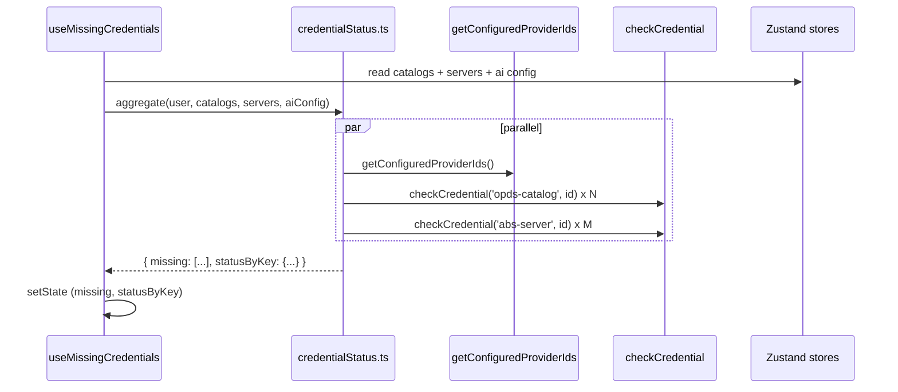
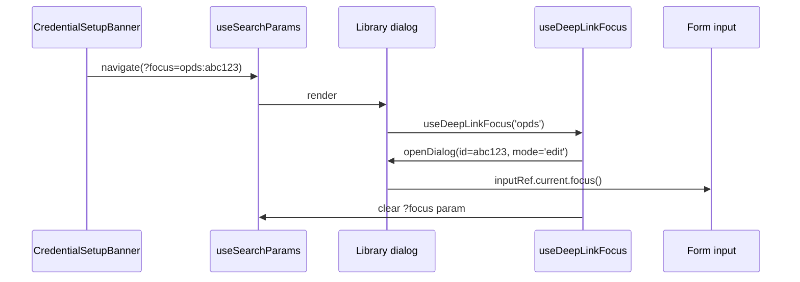

# feat: E97-S05 Credential Sync UX for External Services

## Overview

This is the final story of Epic 97 (Sync UX Polish). E92–E96 delivered
Supabase sync; E97-S01 through E97-S04 delivered the user-facing signals
for **data** sync. What remains invisible is the **credentials layer** —
the API keys, OPDS passwords, and Audiobookshelf API tokens that Knowlune
stores in **Supabase Vault** (via the `vault-credentials` Edge Function
introduced in E95-S02, fronted by the resolver/cache pattern in E95-S05).

After E97-S04's download overlay finishes on a new device, the user's
OPDS catalogs, ABS servers, and AI provider configs are all present as
metadata — but credential reads may return `null` on this device. Today
the UI silently renders "Not connected" with no explanation and no guided
recovery. E97-S05 closes that gap with:

1. A **"Credentials need setup" banner** that lists every service whose
   credential is missing on this device, with deep-link click-through to
   the correct settings form (AC1, AC2, AC6).
2. A reusable **three-state status badge** (Synced via Vault / Local only
   / Not configured / No credential needed) wired into AI Config, OPDS
   catalogs, and ABS server lists (AC3, AC4).
3. A **"Why don't credentials sync?"** tooltip/popover explaining the
   Vault broker model (AC5).

No engine changes. No credential API changes. This is pure UX composition
on top of existing primitives: `checkCredential`, `getConfiguredProviderIds`,
`useOpdsCatalogStore`, `useAudiobookshelfStore`, and the two existing
resolvers.

## Problem Frame

Credentials do not travel through the standard sync pipeline for security
reasons — they live in Supabase Vault and are brokered per-request per-
device. The user cannot see this model from the UI. The consequence:

- On a new device, external integrations appear broken even when the
  server-side state is intact.
- In AI Configuration, users cannot tell whether their key lives in
  Vault (cross-device) or only in this browser's localStorage.
- There is no single surface that says "these N credentials need your
  attention."

See origin: `docs/brainstorms/2026-04-19-e97-s05-credential-sync-ux-requirements.md`.

## Requirements Trace

- **R1 (AC1)** Banner appears when any configured external service has
  no credential on this device.
  - **AI-provider trigger is USER-LEVEL (not per-provider):** AI
    contributes *at most one* banner entry when
    `getConfiguredProviderIds()` returns empty (no Vault-stored keys)
    **AND** legacy `providerKeys` (localStorage) is non-empty. The
    banner entry reads "AI provider keys need setup" and deep-links to
    the AI Configuration settings section (no per-provider focus id).
  - **Per-service trigger (per-id):** OPDS catalogs and ABS servers
    contribute one entry per missing row based on
    `checkCredential(kind, id) === false`.
- **R2 (AC2)** Banner entries deep-link to the right settings surface
  with the correct form in edit mode and the credential input focused
  (per-id for OPDS/ABS; section-level for AI).
- **R3 (AC3)** Per-AI-provider status badge with three states plus
  tooltip copy — these badges are **independent** of the banner trigger
  (see R1); badges still render on each provider row regardless of
  whether AI contributes a banner entry.
- **R4 (AC4)** Per-OPDS-catalog and per-ABS-server status badge with the
  same three states (plus "No credential needed" for anonymous OPDS).
- **R5 (AC5)** "Why?" tooltip/popover content explaining the Vault
  broker model in plain language.
- **R6 (AC6)** Banner auto-dismisses when the missing list empties;
  explicit X-click persists dismissal in `sessionStorage` keyed per user.

## Scope Boundaries

- Does NOT change credential storage or the broker Edge Function.
- Does NOT introduce a new resolver hook for AI providers (continue
  using `getConfiguredProviderIds` as the async source of truth).
- Does NOT add a one-click "promote local to Vault" action for AI keys
  (users can re-save to promote — future chore).
- Does NOT surface Ollama in the banner (server URL is not a Vault
  credential; out of scope).
- Does NOT introduce Help docs content — the "Learn more" link is a
  placeholder.

### Deferred to Separate Tasks

- **Help article** ("Why don't my credentials sync?") — deferred to a
  future docs effort; S05 ships a TODO placeholder link.
- **Batch `checkCredential` endpoint** — if N > 8 rows becomes common,
  convert to a batch broker call; not needed at current scale.
- **Telemetry** for `ux.credential.explanation_viewed` — emit event
  points are noted but dashboards are not part of S05.
- **Auto-promote "Local only" AI keys to Vault** — deferred chore.

## Context & Research

### Relevant Code and Patterns

- `src/lib/vaultCredentials.ts` — `checkCredential`, `readCredential`,
  `storeCredential`, `deleteCredential`. Auth-gated, non-throwing.
- `src/lib/aiConfiguration.ts` — `getConfiguredProviderIds()` returns
  async list of configured AI providers (Vault preferred, localStorage
  fallback); existing pattern at line 632. Dispatches
  `ai-configuration-updated` custom event on every write.
- `src/lib/credentials/resolverFactory.ts` — documents `authFailed`
  flag specifically as the driver for a "Re-enter credentials" banner;
  S05 is the deferred AC-4 polish referenced in that file.
- `src/lib/credentials/opdsPasswordResolver.ts` — `useOpdsPassword(id)`
  returns `{ value, loading, authFailed }`.
- `src/lib/credentials/absApiKeyResolver.ts` — `useAbsApiKey(id)` same
  shape.
- `src/stores/useOpdsCatalogStore.ts` — source of truth for OPDS
  catalogs with `auth?.username` presence.
- `src/stores/useAudiobookshelfStore.ts` — source of truth for ABS
  server list.
- `src/app/components/library/OpdsCatalogSettings.tsx` — already uses
  `checkCredential('opds-catalog', id)` and `getOpdsPassword`.
- `src/app/components/library/AudiobookshelfSettings.tsx` — same
  pattern with `checkCredential('abs-server', id)` at line 80.
- `src/app/components/figma/AIConfigurationSettings.tsx` — already
  calls `getConfiguredProviderIds()` via useEffect at line 158; listens
  to the `ai-configuration-updated` cross-tab event.
- `src/app/components/figma/ProviderKeyAccordion.tsx` — the per-provider
  accordion rows where AC3 badges live.
- `src/app/components/settings/sections/SyncSection.tsx` — S02 pattern
  for `settingsUpdated`/`visibilitychange` listener hygiene.
- `src/app/stores/useSyncStatusStore.ts` — `lastSyncAt` as the
  "first-sync-complete" gate for the banner's first evaluation.
- `src/app/components/ui/alert.tsx` — shadcn Alert primitive.
- `src/app/components/ui/tooltip.tsx`, `popover.tsx`, `badge.tsx` —
  available in the component library.
- `src/app/pages/Library.tsx` — where `OpdsCatalogSettings` and
  `AudiobookshelfSettings` are mounted as dialogs.
- `src/app/pages/Settings.tsx` — target for the AI deep-link focus.
- `src/app/hooks/useDeepLinkEffects.ts` — **existing** deep-link hook,
  scoped to the lesson player (`?t=<seconds>`, `?panel=notes`) and
  parameterised by player-specific setters. S05 deliberately does NOT
  extend this hook; see Unit 4 for the split rationale and justification.

### Institutional Learnings

- `reference_es2020_constraints` — target is ES2020. Use
  `Promise.allSettled` (not `Promise.any`), `?.`, `??`. All applicable
  to the parallel `checkCredential` fan-out.
- `reference_sync_engine_api` — the syncableWrite rule. S05 does not
  touch syncable writes — no changes here, just a reminder that the
  credential path intentionally bypasses that pipeline.
- `reference_dexie_4_quirks` — store subscriptions via Zustand are
  fine; we are not touching Dexie indices or upgrades.
- `feedback_review_loop_max_rounds` — review loop max 3 rounds; keeps
  S05 tight.
- E95-S05 retrospective pattern: "auth-failed surfaces via hook's
  `authFailed` flag" — S05 uses this explicitly for OPDS/ABS entries
  where the user has a Vault credential that is currently un-readable
  (rare post-S04, but possible if the session refresh failed).
- E97-S02 SyncSection pattern: cross-tab event listener on
  `settingsUpdated`, plus `visibilitychange` refresh — S05 mirrors this
  for the aggregator hook.

### External References

- None required. All primitives are in-repo; no new frameworks or
  third-party libraries.

## Key Technical Decisions

- **No new AI resolver hook.** `getConfiguredProviderIds()` already
  returns the union of (Vault-configured) ∪ (localStorage-configured).
  To distinguish Vault-only vs Local-only for AC3 per-provider **badges**,
  we perform a parallel `checkCredential('ai-provider', providerId)`
  per known provider and subtract — no new hook needed. The **banner
  entry** for AI (R1) uses a simpler rule and does not need per-provider
  resolution — see "AI banner is USER-LEVEL" below.
- **AI banner is USER-LEVEL, not per-provider.** The aggregator emits
  at most ONE synthetic AI banner entry (kind: `ai-provider`, id:
  `__ai-section__`, displayName: "AI provider keys"). Trigger:
  `getConfiguredProviderIds()` returns empty **AND** legacy
  `providerKeys` (localStorage) is non-empty — i.e., the user has local
  keys but nothing in Vault. Per-provider badges (AC3) continue to
  render on each provider row with their own vault/local/missing
  classification; the banner entry is a separate, aggregate signal.
- **URL-based deep-linking via a new `useDeepLinkFocus` hook (separate
  from existing `useDeepLinkEffects`).** AC2's navigation targets
  (Settings page + Library dialogs) get a small shared `useDeepLinkFocus`
  hook that reads `?focus=<kind>:<id>` from the URL, invokes a caller
  callback, and clears the query param after consumption. We deliberately
  do NOT extend `src/app/hooks/useDeepLinkEffects.ts` — that hook is
  scoped to the lesson player's runtime parameters (`?t=<seconds>`,
  `?panel=notes`) and takes player-specific setter props
  (`setSeekToTime`, `setNotesOpen`, `setFocusTab`). The S05 need is a
  generic string-id focus dispatcher across three unrelated settings
  surfaces, with different lifecycle (fires once per URL token, used
  outside the player). Overloading `useDeepLinkEffects` would mix
  domain-specific player concerns with cross-feature navigation
  plumbing. Keeping them separate preserves single-responsibility.
- **Aggregator freshness strategy.** Event-driven primary
  (`ai-configuration-updated`, Zustand store subscriptions on
  `useOpdsCatalogStore` + `useAudiobookshelfStore`) + visibility-gated
  120s fallback polling timer + `visibilitychange` refresh — same
  pattern as S02, tuned for a lower call-volume budget (see below).
- **Polling call-volume budget.** Steady-state: one aggregator pass
  runs `getConfiguredProviderIds()` (no Edge Function call) plus N +
  M `checkCredential` Edge Function calls in parallel, where N = OPDS
  catalogs and M = ABS servers; typical N + M ≤ 8. Pacing:
  - Interval is 120s (not 30s).
  - Interval is **paused entirely** when `document.visibilityState ===
    'hidden'` — zero calls while the tab is backgrounded.
  - On `visibilitychange` → `'visible'`, we fire ONE immediate
    aggregator pass and then resume the 120s cadence (we do not stack
    a restarted interval on top).
  - Event-driven refreshes (`ai-configuration-updated`, store deltas)
    are always on; they are free relative to Edge-Function cost.
  - **Budget:** ≤ 8 calls per 120s when the tab is visible, 0 calls
    when hidden, 1 immediate on visibility resume, plus event-driven
    refreshes on user action. Typical steady-state averages ~4
    calls/min when the tab is continuously visible.
- **Banner placement.** Renders inside `App.tsx`, above the routed
  content, in the same floating-UI region as `InitialUploadWizard` and
  `NewDeviceDownloadOverlay`. Non-modal. Stacked below the S04 overlay
  via z-index ordering (overlay=50, banner=40).
- **First-render gating.** The banner subscribes to
  `useSyncStatusStore.lastSyncAt !== null` as its first-evaluation
  gate. Before first sync completes, render nothing — prevents flash
  on new-device sign-in.
- **Status aggregator as a pure module, not a hook.** Pure async
  function `getCredentialStatus(user, stores)` → `MissingCredential[]`
  + per-id status map. The React `useMissingCredentials` hook wraps
  it with listeners + state. Makes unit testing trivial.
- **No caching of missing-credential aggregation.**
  `credentialCache` in `src/lib/credentials/cache.ts` is scoped to
  positive credential reads. The UI aggregator must be fresh — accept
  the Edge Function cost (≤8 calls per 120s visible, see budget above).
- **Ollama excluded.** Ollama's `serverUrl` is a plain config string
  stored in `localStorage['ai-configuration']`; it syncs through the
  normal settings path (when applicable) and is not a Vault credential.
  Including it in the banner would muddy the Vault-vs-Local narrative.
- **"Local only" semantics.** AC3 "Local only" **badge** (per-provider)
  for AI means: not in Vault but present in `providerKeys[provider]`
  OR `apiKeyEncrypted` (legacy). This is orthogonal to whether AI
  contributes a banner entry — a single provider flagged "Local only"
  does **not** by itself push a banner row; the banner fires only when
  the user-level condition in R1 is met (all providers are local-only,
  i.e., `getConfiguredProviderIds()` empty AND `providerKeys`
  non-empty). For OPDS/ABS there is no "Local only" state by design
  (E95-S05 removed legacy plaintext fields) — the only states for
  those kinds are Vault / Missing / Anonymous (OPDS only).

## Open Questions

### Resolved During Planning

- **Banner placement** → `App.tsx` floating region, above routes,
  below the S04 overlay. Rationale: high discovery, non-blocking, same
  pattern other Epic 97 UIs already use.
- **AI deep-link mechanism** → new `useDeepLinkFocus` hook + URL
  search params. Rationale: survives reload, testable, DRY across the
  three settings surfaces. Deliberately *not* extending
  `useDeepLinkEffects` — see Key Technical Decisions for the split
  rationale.
- **AI banner trigger level** → user-level (one aggregate entry), not
  per-provider. Rationale: R1 in the requirements doc defines the
  trigger as "all AI providers are local-only" (Vault empty +
  `providerKeys` non-empty); per-provider badges still handle the
  per-row signal (AC3).
- **Help link target** → placeholder button with a `// TODO: Help
  article (future)` comment. Rationale: do not block S05 on docs.
- **Ollama handling** → exclude from banner, document the exclusion.
- **Aggregator caching** → none. Rely on parallel `Promise.allSettled`
  + visibility-gated 120s fallback polling.
- **Polling cadence** → 120s (from an initial 30s proposal).
  Rationale: bounds Edge-Function call volume to ≤ 8 / 120s visible;
  event-driven refreshes cover user-initiated changes in real time.
- **Race with S04 overlay** → z-index stacking + `lastSyncAt` gate.
  Mutually-consistent with the S04 overlay lifecycle.

### Deferred to Implementation

- **Exact focus timing for dialog inputs** — whether `useEffect` +
  `requestAnimationFrame` is enough or the Radix `Dialog`'s
  `onOpenAutoFocus` override is needed. Depends on whether the
  focus effect runs before or after the dialog's own focus trap
  installs.
- **AC6 semantics when new credential becomes missing mid-session** —
  today's plan: when the missing-list transitions from 0 → N, clear
  the sessionStorage dismissal flag so the banner reappears. Verify
  this matches user expectations in review.
- **Telemetry event names** — event *emission* points in code are noted
  but the exact string constants are finalizable at implementation.

## High-Level Technical Design

> *This illustrates the intended approach and is directional guidance
> for review, not implementation specification. The implementing agent
> should treat it as context, not code to reproduce.*

### Status aggregation flow



### Banner → deep-link → focus flow (OPDS / ABS — per-id)



### Banner → section flow (AI — user-level, no per-id focus)

```mermaid
sequenceDiagram
    participant Banner as CredentialSetupBanner
    participant URL as router
    participant Settings as Settings page
    participant Section as AI Configuration section

    Banner->>URL: navigate(/settings?section=integrations)
    URL->>Settings: render with section=integrations
    Settings->>Section: scroll/activate AI Configuration
    Note over Section: No provider accordion auto-expand;<br/>user chooses which provider to re-save
```

### Status states (decision matrix)

Per-provider badge statuses in `statusByKey` (AC3 / AC4):

| Kind | Vault `checkCredential` | Local fallback exists | OPDS anonymous | Status |
|---|---|---|---|---|
| ai-provider | true | (either) | n/a | `vault` |
| ai-provider | false | yes (providerKeys or legacy apiKeyEncrypted) | n/a | `local` |
| ai-provider | false | no | n/a | `missing` |
| opds-catalog | n/a | n/a | yes (no `auth.username`) | `anonymous` |
| opds-catalog | true | n/a | no | `vault` |
| opds-catalog | false | n/a | no | `missing` |
| abs-server | true | n/a | n/a | `vault` |
| abs-server | false | n/a | n/a | `missing` |

Banner entries in `missing` (AC1) — **separate from per-provider badges**:

| Source | Condition | Entries added to `missing` |
|---|---|---|
| AI (user-level, aggregate) | `getConfiguredProviderIds()` is empty AND `providerKeys`/legacy has at least one key | **exactly one** synthetic entry: `{ kind: 'ai-provider', id: '__ai-section__', displayName: 'AI provider keys' }` |
| AI (user-level, aggregate) | any other combination | zero AI entries |
| OPDS (per-id) | `auth.username` set AND `checkCredential` returns false | one entry per catalog |
| ABS (per-id) | `checkCredential` returns false | one entry per server |

Key property: AI contributes **at most one** banner row regardless of
how many providers have `local` or `missing` per-provider status.

## Implementation Units

- [ ] **Unit 1: Status aggregator module**

**Goal:** Pure async module that classifies every credential the user
has configured and returns the banner-eligible "missing" list plus a
per-id status map for badge rendering.

**Requirements:** R1, R3, R4

**Dependencies:** None

**Files:**
- Create: `src/lib/credentials/credentialStatus.ts`
- Create: `src/lib/credentials/__tests__/credentialStatus.test.ts`

**Approach:**
- Export `CredentialStatus = 'vault' | 'local' | 'missing' | 'anonymous'`.
- Export `MissingCredential` type: `{ kind: CredentialType | 'ai-provider', id, displayName, status }`.
- Export `aggregateCredentialStatus(input)` where input is
  `{ catalogs: OpdsCatalog[], servers: AudiobookshelfServer[],
  aiConfig: AIConfigurationSettings }`. Runs `checkCredential` +
  `getConfiguredProviderIds()` in parallel via `Promise.allSettled`.
- Returns `{ missing: MissingCredential[], statusByKey: Record<string,
  CredentialStatus> }` where key is `"<kind>:<id>"`.
- **AI banner entry is user-level, not per-provider.** The aggregator
  emits at most one synthetic AI entry into `missing`:
  `{ kind: 'ai-provider', id: '__ai-section__', displayName: 'AI
  provider keys', status: 'missing' }` when
  `getConfiguredProviderIds()` returns an empty array AND
  `aiConfig.providerKeys` has at least one non-empty entry (or legacy
  `aiConfig.apiKeyEncrypted` is set alongside a `selectedProvider`).
  If either side of that condition is false, no AI entry is added to
  `missing`.
- Per-provider `statusByKey` entries (key =
  `"ai-provider:<providerId>"`) are still populated with
  `vault` / `local` / `missing` for **badge** rendering (AC3); these
  are independent of the banner entry above.
- Ollama is excluded (matches decision above) — never contributes to
  `missing` and never receives a `statusByKey` entry.
- `displayName` resolution: for the synthetic AI entry → "AI provider
  keys"; for OPDS → `catalog.name`; for ABS → `server.name`. Per-provider
  badge display names (for AC3) come from `AI_PROVIDERS[id].name` at
  the consumer site, not from the aggregator output.

**Patterns to follow:**
- `src/lib/aiConfiguration.ts` — `getConfiguredProviderIds()` parallel
  `Promise.allSettled` pattern.
- `src/lib/vaultCredentials.ts` — non-throwing posture.

**Test scenarios:**
- Happy path: all three kinds return Vault-only statuses; missing is empty; no synthetic AI entry.
- Happy path: per-provider badge — AI provider with Vault credential → `statusByKey["ai-provider:<id>"] === 'vault'`.
- **AI banner trigger — Vault-configured, no local:**
  `getConfiguredProviderIds()` returns `['openai']` and
  `providerKeys` is empty → NO synthetic AI entry added to `missing`;
  per-provider `statusByKey` still reflects `vault`.
- **AI banner trigger — local-only (THIS fires the banner):**
  `getConfiguredProviderIds()` returns `[]` AND `providerKeys` has
  `{ openai: 'sk-...' }` → EXACTLY ONE synthetic entry added:
  `{ kind: 'ai-provider', id: '__ai-section__', displayName: 'AI
  provider keys', status: 'missing' }`; per-provider
  `statusByKey["ai-provider:openai"] === 'local'`.
- **AI banner trigger — both Vault and local (already sync'd):**
  `getConfiguredProviderIds()` returns `['openai']` AND `providerKeys`
  has `{ openai: 'sk-...' }` → NO synthetic AI entry (Vault side
  satisfied); per-provider badge still `vault` (Vault wins).
- **AI banner trigger — nothing configured:**
  `getConfiguredProviderIds()` returns `[]` AND `providerKeys` empty
  AND legacy `apiKeyEncrypted` unset → NO synthetic AI entry (user
  never configured AI at all; nothing to re-setup).
- **Legacy apiKeyEncrypted variant:** `getConfiguredProviderIds()`
  returns `[]`, `providerKeys` empty, but `aiConfig.apiKeyEncrypted`
  is set with `aiConfig.selectedProvider === 'openai'` → counts as
  local; synthetic AI entry IS added; per-provider badge for
  `openai` → `local`.
- Per-provider badge: AI provider with legacy `apiKeyEncrypted` field
  matching current provider → `statusByKey["ai-provider:openai"] === 'local'`.
- Edge case: OPDS catalog with `auth.username` unset → status `anonymous`.
- Error path: OPDS catalog with `auth.username` set, `checkCredential` returns false → status `missing`, added to list.
- Error path: ABS server with `checkCredential` returning false → status `missing`, added to list.
- Error path: `checkCredential` throws (network) → status `missing` defensively, entry added with a `transient: true` flag (consumers may ignore; plan phase left exact contract as implementation detail — scenario enforces that aggregator does not throw).
- Integration: mixed state — AI all-local-only (banner eligible), 1 OPDS missing (with anon OPDS also present), 2 ABS ok → `missing.length === 2` (one synthetic AI, one OPDS); `statusByKey` has correct keys for every provider + every OPDS/ABS row.
- Unauthenticated: `supabase.auth.getUser()` returns null (simulated via `checkCredential` returning false) → function still resolves, missing is empty (aggregator treats "no user" as "no work to do").

**Verification:**
- Function returns within one `Promise.allSettled` round-trip;
  never throws; types compile under `tsc --noEmit`.

- [ ] **Unit 2: `useMissingCredentials` hook**

**Goal:** React hook that subscribes to the three data sources, runs
the aggregator, returns `{ missing, statusByKey, loading }`, and handles
lifecycle cleanup.

**Requirements:** R1, R3, R4, R6

**Dependencies:** Unit 1

**Files:**
- Create: `src/app/hooks/useMissingCredentials.ts`
- Create: `src/app/hooks/__tests__/useMissingCredentials.test.tsx`

**Approach:**
- Read `useAuthStore.user`, `useOpdsCatalogStore.catalogs`,
  `useAudiobookshelfStore.servers`.
- `useEffect` reads `getAIConfiguration()` snapshot; listens for
  `ai-configuration-updated` to refresh.
- Runs aggregator when dependencies change. Initial render returns
  `loading: true` with empty `missing`.
- **Visibility-gated 120s fallback refresh.** Install a `setInterval`
  at 120 000 ms that calls the aggregator, but only while
  `document.visibilityState === 'visible'`. Implementation options
  (either acceptable): (a) start the interval only after the first
  `visible` state and clear it on `hidden` / reinstall on `visible`;
  or (b) keep one interval installed but early-return when
  `document.visibilityState !== 'visible'`. Option (a) preferred —
  avoids timer drift while hidden.
- **`visibilitychange` listener behaviour:** on transition to
  `'visible'`, fire ONE immediate aggregator pass and (re)install the
  120s interval fresh; on transition to `'hidden'`, clear the interval
  so zero Edge-Function calls occur while backgrounded. Do not stack
  restarted intervals.
- Event-driven refreshes (`ai-configuration-updated` window event,
  Zustand store deltas) are always on regardless of visibility — they
  are free relative to polling.
- Gates first evaluation on `useSyncStatusStore.lastSyncAt !== null`
  (AC1 new-device race).
- Cleans up all listeners + interval on unmount.
- **Call-volume budget guard:** document inline in the hook that the
  intended budget is "≤ 8 Edge Function calls per 120s while visible,
  0 while hidden, 1 immediate on visibility resume, plus event-driven
  refreshes." Any future change that violates this budget requires a
  code comment + plan note.

**Patterns to follow:**
- `src/app/components/settings/sections/SyncSection.tsx` —
  `settingsUpdated` / `visibilitychange` listener hygiene.
- `src/app/components/figma/AIConfigurationSettings.tsx` lines 123–155
  — cross-tab listener pattern.

**Test scenarios:**
- Happy path: hook returns loading:true immediately, then missing + statusByKey after aggregator resolves.
- Edge case: unauthenticated user → returns `{ missing: [], statusByKey: {}, loading: false }`; no aggregator call.
- Edge case: `lastSyncAt === null` → loading:true persists until `lastSyncAt` advances (no flash on new device).
- Happy path: dispatching `ai-configuration-updated` triggers re-aggregate (verified by spying on aggregator module).
- Happy path: adding a catalog to the OPDS store triggers re-aggregate (store subscription).
- Integration: **120s** interval fires while visible → re-aggregate called; fake timers.
- **Visibility-hidden gating:** with `document.visibilityState ===
  'hidden'` mocked, advance fake timers by 10 minutes → aggregator is
  NOT called (zero Edge-Function calls while hidden).
- **Visibility resume:** transition visibilityState from `'hidden'`
  → `'visible'` and dispatch `visibilitychange` → aggregator called
  exactly ONCE immediately; a fresh 120s interval is in place (verified
  by advancing 120s → one additional call, not two).
- **No interval stacking:** rapid toggle hidden → visible → hidden →
  visible twice → after final `'visible'`, advancing 120s yields
  exactly one additional aggregator call (interval did not accumulate).
- Integration: cleanup — on unmount, no further interval ticks or event callbacks execute (verified by `expect(aggregator).not.toHaveBeenCalled()` post-unmount).

**Verification:**
- Hook returns stable array references between re-renders when no
  change; updates identity when content changes.

- [ ] **Unit 3: `CredentialSyncStatusBadge` component**

**Goal:** Reusable inline indicator for AI / OPDS / ABS rows showing
one of four status states with icon, label, and tooltip.

**Requirements:** R3, R4, R5

**Dependencies:** Unit 1 (for `CredentialStatus` type)

**Files:**
- Create: `src/app/components/sync/CredentialSyncStatusBadge.tsx`
- Create: `src/app/components/sync/__tests__/CredentialSyncStatusBadge.test.tsx`

**Approach:**
- Props: `{ status: CredentialStatus, size?: 'sm' | 'md', showLabel?: boolean }`.
- Icon map: `vault → Cloud`, `local → Smartphone`,
  `missing → CircleDashed`, `anonymous → CheckCircle2`.
- Label map: "Synced via Vault" / "Local only" / "Not configured" /
  "No credential needed".
- Tooltip content per state — explains the Vault broker model in 1–2
  sentences + encourages re-save for `local`.
- Design tokens: use `text-success`, `text-warning`,
  `text-muted-foreground`, `text-brand` mapped to states.
- Accessible name via `aria-label` on the badge root so screen readers
  always announce status even when tooltip collapsed.

**Patterns to follow:**
- `src/app/components/ui/badge.tsx` + shadcn `Tooltip` pattern from
  existing components (AIConfigurationSettings uses same primitives).

**Test scenarios:**
- Happy path: each of the 4 statuses renders the right icon + label.
- Edge case: `showLabel: false` renders icon only but preserves
  accessible name.
- Happy path: hover over badge → tooltip content matches status.
- Edge case: keyboard focus opens the tooltip (axe a11y scan).
- Edge case: component respects `prefers-reduced-motion` (no transition
  shimmer on state change).

**Verification:**
- Axe scan clean; tooltip accessible via keyboard; visual snapshot
  stable across 4 states.

- [ ] **Unit 4: `useDeepLinkFocus` shared hook (new, distinct from `useDeepLinkEffects`)**

**Goal:** Small hook consumed by AI / OPDS / ABS settings surfaces that
reads `?focus=<kind>:<id>` from the URL, invokes a callback to open
the correct form, and clears the param.

**Requirements:** R2

**Dependencies:** None

**Files:**
- Create: `src/app/hooks/useDeepLinkFocus.ts`
- Create: `src/app/hooks/__tests__/useDeepLinkFocus.test.tsx`

**Justification for creating a new hook (not extending `useDeepLinkEffects`):**

`src/app/hooks/useDeepLinkEffects.ts` already exists but is purpose-built
for the **lesson player**:

- Accepts lesson-player-specific setters as props
  (`setSeekToTime`, `setNotesOpen`, `setFocusTab`).
- Reads lesson-player parameters (`?t=<seconds>`, `?panel=notes`).
- Fires every time the param value changes (seek-to-time semantics),
  with no once-per-token guard — re-seekable behaviour is correct
  there.
- Lives inside the lesson player's mount lifecycle; consumers are all
  within the player component tree.

S05 needs a **different** shape:

- Accepts a single generic `(id: string) => void` callback, no
  player-specific setters.
- Reads one cross-feature param (`?focus=<kind>:<id>`) with a
  colon-separated `kind` filter so three unrelated surfaces can
  coexist on the same URL without false triggers.
- Must fire **exactly once** per URL token and then clear the param
  so unrelated re-renders don't re-trigger focus — navigation
  semantics, not seek semantics.
- Consumers live in three unrelated trees (Settings page,
  `OpdsCatalogSettings` dialog, `AudiobookshelfSettings` dialog).

Bolting both responsibilities onto `useDeepLinkEffects` would mix
domain-specific lesson-player state with cross-feature navigation
plumbing and would require the hook to know about both setter-prop
shapes. Keeping them separate preserves single-responsibility and
keeps each hook's test matrix small. The split mirrors how the
codebase already separates per-feature routing concerns (e.g.,
`Library.tsx` emits its own dialog-open `CustomEvent` rather than
reaching into lesson-player routing).

If a future story introduces a third URL-driven focus pattern we
should reconsider consolidating behind a generic param-router; for
now two focused hooks remain simpler than one over-generalised one.

**Approach:**
- Signature: `useDeepLinkFocus(kind: 'ai-provider' | 'opds' | 'abs',
  onFocus: (id: string) => void)`.
- Reads `searchParams.get('focus')`; if it starts with `<kind>:`,
  extracts id and calls `onFocus(id)` once.
- Clears the param via `setSearchParams` after consumption to prevent
  re-firing on unrelated re-renders.
- Uses a `useRef<string | null>` guard to ensure the callback fires
  exactly once per URL token.
- File-header JSDoc explicitly references
  `src/app/hooks/useDeepLinkEffects.ts` and states "intentionally
  separate — see E97-S05 plan Unit 4 for rationale."

**Patterns to follow:**
- React Router v7 `useSearchParams` pattern; standard ref-guard for
  once-only effects.
- Naming parallel to `useDeepLinkEffects` signals the shared
  "deep-link" concept while the distinct name flags the different
  responsibility.

**Test scenarios:**
- Happy path: `?focus=opds:abc123` with `kind='opds'` → `onFocus('abc123')` called once.
- Edge case: `?focus=abs:xyz` with `kind='opds'` → `onFocus` NOT called (wrong kind).
- Edge case: no `?focus` param → `onFocus` NOT called.
- Edge case: re-render without URL change → `onFocus` not re-called (ref guard).
- Integration: param is cleared from URL after consumption.
- **Coexistence:** mounting `useDeepLinkFocus('opds', fn)` alongside a
  lesson player that happens to render `useDeepLinkEffects` on the
  same route does not cause either hook to fire the other's params
  (separate param names — `focus` vs `t`/`panel`).

**Verification:**
- URL-param cleared after one firing; no re-firing on re-render.
- `useDeepLinkEffects.ts` is untouched by this story (verified by
  diff review).

- [ ] **Unit 5: `CredentialSetupBanner` component + App.tsx mount**

**Goal:** The dismissible banner listing missing credentials with
per-entry "Re-enter" deep-link buttons and a "Why?" popover.

**Requirements:** R1, R2, R5, R6

**Dependencies:** Units 1, 2, 4

**Files:**
- Create: `src/app/components/sync/CredentialSetupBanner.tsx`
- Create: `src/app/components/sync/__tests__/CredentialSetupBanner.test.tsx`
- Modify: `src/app/App.tsx`

**Approach:**
- Uses `useMissingCredentials` (Unit 2).
- If `loading` OR `missing.length === 0` → render `null`.
- Renders shadcn `Alert` with icon + title ("Set up your connections on
  this device") + list of entries.
- **AI is exactly one row, not N.** If the synthetic AI entry
  (`kind: 'ai-provider'`, `id: '__ai-section__'`) is present in
  `missing`, it renders exactly once as "AI provider keys need setup"
  with a single "Set up" button. The button calls
  `navigate('/settings?section=integrations')` — **no** `focus=...`
  query param (the deep-link is section-level, not provider-level).
  Per-provider focus is out of scope for R1; users land on the AI
  Configuration section and choose which provider to re-save.
- **OPDS / ABS are per-id rows.** Each OPDS/ABS entry renders one row
  with a "Re-enter" button that opens the respective dialog via a
  small pub/sub event
  (`dispatchEvent(new CustomEvent('open-opds-settings', { detail:
  { focusId } }))`); `Library.tsx` listens and opens the dialog with
  `?focus=opds:<id>` / `?focus=abs:<id>` set so `useDeepLinkFocus`
  inside the dialog drives field focus.
- **Row rendering helper:** internal `renderMissingRow(entry)` switches
  on `entry.kind`:
  - `'ai-provider'` → section-level row, label "AI provider keys",
    button "Set up", navigate to settings section (no focus param).
  - `'opds-catalog'` → per-id row, label `entry.displayName`, button
    "Re-enter", dispatch `open-opds-settings` CustomEvent.
  - `'abs-server'` → per-id row, label `entry.displayName`, button
    "Re-enter", dispatch `open-abs-settings` CustomEvent.
- "Why?" link opens a shadcn `Popover` with AC5 copy + placeholder
  "Learn more" link.
- X (dismiss) button writes
  `sessionStorage['knowlune:credential-banner-dismissed:<userId>'] =
  'true'` and hides the banner locally.
- AC6 auto-clear: when `missing.length` transitions 0 → N, clear the
  sessionStorage flag (useEffect diff on missing.length).
- Respects `prefers-reduced-motion`: no slide-in animation when
  reduced.
- Role / aria: `role="status"`, `aria-live="polite"`; X button has
  `aria-label="Dismiss credential setup banner"`.
- Mounted in `App.tsx` above the `<Outlet/>` within the
  `RouterProvider` layout, in the same floating region as
  `InitialUploadWizard` and `NewDeviceDownloadOverlay` so it renders on
  every routed page.

**Patterns to follow:**
- `src/app/components/settings/sections/SyncSection.tsx` — shadcn
  `Alert` + `TooltipProvider` composition.
- `src/app/App.tsx` existing floating-UI mounts (wizard, overlay).

**Test scenarios:**
- Happy path: missing = [synthetic AI, OPDS:abc, ABS:xyz] → banner
  renders with 3 entries total: ONE AI row ("AI provider keys need
  setup"), one OPDS row, one ABS row. Distinct icons per kind.
- **AI single-row guarantee:** even if the user has 5 AI providers
  flagged `local` in per-provider `statusByKey`, the banner still
  renders exactly ONE AI row (the aggregator emits one synthetic
  entry; the banner never fans it out).
- **AI absent when Vault already has keys:** with
  `getConfiguredProviderIds()` returning a non-empty array, the
  banner contains zero AI rows regardless of how many per-provider
  `local` badges exist.
- Happy path: missing = [] → banner unmounts.
- Edge case: loading === true → banner does not render (avoids flash).
- Edge case: sessionStorage dismissed → banner hidden even with
  non-empty missing.
- Integration: click "Re-enter" on an OPDS entry → navigates with
  `?focus=opds:<id>`; `CustomEvent('open-opds-settings')` fires.
- Integration: click "Set up" on the AI entry → navigates to
  `/settings?section=integrations` (section-level; **no** `focus=...`
  param asserted).
- Integration: click "Why?" → popover renders with AC5 copy.
- Integration: click X → sessionStorage key written; banner unmounts;
  reload (simulate with unmount+remount) preserves dismissal during
  same session.
- Integration: missing transitions 0 → N mid-session → sessionStorage
  dismissal flag cleared; banner reappears on next aggregate.
- A11y: `role="status"` + `aria-live="polite"`; keyboard navigable;
  axe clean.

**Verification:**
- Banner never appears before first sync completes; re-appears on
  new missing credential mid-session; dismissal persists only within
  session.

- [ ] **Unit 6: AI Configuration badge wiring + section-level deep-link**

**Goal:** Render `CredentialSyncStatusBadge` on each provider row in
`ProviderKeyAccordion`; ensure the banner's section-level deep-link
(`/settings?section=integrations`) lands the user on the AI
Configuration section.

**Requirements:** R3, R2

**Dependencies:** Units 2, 3

**Files:**
- Modify: `src/app/components/figma/ProviderKeyAccordion.tsx`
- Modify: `src/app/components/figma/AIConfigurationSettings.tsx`
- Modify: `src/app/pages/Settings.tsx` (if needed — route
  parameter handling for `?section=integrations`)
- Create: `src/app/components/figma/__tests__/ProviderKeyAccordion.e97-s05.test.tsx`

**Approach:**
- Reuse `useMissingCredentials` to get `statusByKey` (or call a
  lightweight helper `useCredentialStatus(kind, id)` derived from it).
- Render badge in `ProviderKeyAccordion`'s header next to the provider
  name. Status derived from `statusByKey["ai-provider:<providerId>"]`.
- **No per-provider deep-link focus.** The R1 AI banner trigger is
  user-level; the banner navigates to the section only. Settings page
  reads `?section=integrations` and scrolls/activates the AI
  Configuration section using whatever section-routing mechanism
  already exists in `Settings.tsx` (verify during implementation —
  fall back to `element.scrollIntoView()` on a `#ai-configuration`
  anchor if no mechanism exists). No `useDeepLinkFocus` consumer is
  added to AI Config in this unit.
- **Future-compat note:** if a later story wants per-provider focus in
  AI Config, it can add `useDeepLinkFocus('ai-provider', ...)` at that
  time; the hook (Unit 4) is designed to support it. Not wired now
  because R1 explicitly scopes the banner to section-level.

**Patterns to follow:**
- Existing `ProviderKeyAccordion` ref management.
- Existing Settings-page section navigation (if any) or shadcn
  Accordion/Card scroll anchor pattern.

**Test scenarios:**
- Happy path: provider with Vault status → "Synced via Vault" badge
  shown.
- Happy path: provider with only local key → "Local only" badge.
- Happy path: provider with no key → "Not configured" badge.
- Integration: navigating to `/settings?section=integrations` lands
  on (and scrolls to) the AI Configuration section — no specific
  provider accordion is auto-expanded by S05 wiring.
- **Negative:** navigating to `/settings?section=integrations` does
  NOT cause any provider accordion to auto-expand (asserts the absence
  of the old per-provider focus behaviour).

**Verification:**
- All three badge states render correctly; section-level navigation
  lands on AI Configuration section in a Playwright smoke test.

- [ ] **Unit 7: OPDS catalog badge wiring + deep-link focus**

**Goal:** Render the badge per catalog row in the OPDS catalog list
view; open the edit form for the focused catalog from the deep-link.

**Requirements:** R4, R2

**Dependencies:** Units 2, 3, 4

**Files:**
- Modify: `src/app/components/library/CatalogListView.tsx`
- Modify: `src/app/components/library/OpdsCatalogSettings.tsx`
- Modify: `src/app/components/library/CatalogForm.tsx` (expose an
  input ref for the password field)
- Modify: `src/app/pages/Library.tsx` (listen for `open-opds-settings`
  CustomEvent emitted by the banner)
- Create: `src/app/components/library/__tests__/OpdsCatalogSettings.e97-s05.test.tsx`

**Approach:**
- `CatalogListView` receives `statusByKey` prop or calls a status hook;
  renders badge in each row.
- `Library.tsx` adds a `window.addEventListener('open-opds-settings',
  ...)` that opens the `OpdsCatalogSettings` dialog + sets
  `?focus=opds:<id>` for the downstream deep-link hook.
- `OpdsCatalogSettings` calls `useDeepLinkFocus('opds', id => {
  handleOpenEdit(catalog); passwordInputRef.current?.focus() })`.
- `CatalogForm` forwards a `passwordInputRef` prop so focus can be
  driven externally.

**Patterns to follow:**
- Existing `handleOpenEdit` in `OpdsCatalogSettings`.

**Test scenarios:**
- Happy path: catalog with anon auth → "No credential needed" badge.
- Happy path: catalog with auth.username + Vault credential → "Synced
  via Vault" badge.
- Happy path: catalog with auth.username + no Vault → "Not configured"
  badge; appears in banner.
- Integration: emit `open-opds-settings` → dialog opens, correct
  catalog in edit mode, password input focused.

**Verification:**
- Badge reflects state live when a password is saved; deep-link flow
  verified by E2E smoke test.

- [ ] **Unit 8: ABS server badge wiring + deep-link focus**

**Goal:** Symmetric to Unit 7 but for Audiobookshelf servers.

**Requirements:** R4, R2

**Dependencies:** Units 2, 3, 4

**Files:**
- Modify: `src/app/components/library/AudiobookshelfServerCard.tsx`
  (render badge)
- Modify: `src/app/components/library/AudiobookshelfSettings.tsx`
  (handle deep-link focus)
- Modify: `src/app/components/library/AudiobookshelfServerForm.tsx`
  (expose API key input ref)
- Modify: `src/app/pages/Library.tsx` (listen for `open-abs-settings`
  CustomEvent)
- Create: `src/app/components/library/__tests__/AudiobookshelfSettings.e97-s05.test.tsx`

**Approach:**
- Same shape as Unit 7. ABS has no "anonymous" state (API key
  always required); badge surfaces `vault` or `missing`.

**Patterns to follow:**
- Existing `hasExistingApiKey` flow at
  `AudiobookshelfSettings.tsx:80`.

**Test scenarios:**
- Happy path: server with Vault credential → "Synced via Vault"
  badge.
- Happy path: server without Vault credential → "Not configured"
  badge; appears in banner.
- Integration: emit `open-abs-settings` → dialog opens with correct
  server in edit mode, API key input focused.

**Verification:**
- End-to-end deep-link path behaves identically to OPDS.

- [ ] **Unit 9: End-to-end Playwright test for new-device banner flow**

**Goal:** Full-stack E2E that simulates a new-device sign-in with
Vault-configured credentials, verifies the banner appears, clicking
each kind opens the focused form, re-entering credentials clears
entries, and dismissing persists for the session.

**Requirements:** R1, R2, R6

**Dependencies:** Units 5, 6, 7, 8

**Files:**
- Create: `tests/e2e/story-e97-s05-credential-sync-ux.spec.ts`

**Approach:**
- Seed Supabase test user with:
  - AI config in "local-only" state — populate
    `localStorage['ai-configuration']` with a non-empty `providerKeys`
    entry but NO Vault-side AI key (so the user-level AI banner
    triggers).
  - One OPDS catalog with `auth.username` set but no Vault password.
  - One ABS server with no Vault API key.
- Reuse E95-S05 test helpers if present for Vault seeding of the
  already-configured rows (or skip Vault seeding for these three —
  they should all arrive at the client as "missing on this device").
- Wipe Dexie on the Playwright page; sign in.
- Wait for S04 overlay to complete (or short-circuit via
  `lastSyncAt` fixture).
- Assert banner with **3 entries total**: one AI row ("AI provider
  keys need setup"), one OPDS row, one ABS row. Assert the AI row is
  rendered exactly once regardless of how many provider rows exist in
  `providerKeys`.
- Click the AI "Set up" button → URL becomes
  `/settings?section=integrations` (no `focus=ai-provider:...` param);
  Settings page shows AI Configuration section.
- Click "Re-enter" on the OPDS entry → `OpdsCatalogSettings` dialog
  opens in edit mode for the seeded catalog; password input is
  focused; URL shows `?focus=opds:<id>` briefly then clears.
- Click "Re-enter" on the ABS entry → same verification for ABS.
- Save new credentials via the settings UI (use E2E test bypass
  keys); for the AI case, saving a Vault-side key via AI Configuration
  settings must flip `getConfiguredProviderIds()` to non-empty.
- Assert banner entry count decreases correctly:
  - Saving OPDS password → OPDS row disappears; AI + ABS rows remain.
  - Saving ABS API key → ABS row disappears; AI row remains.
  - Saving AI Vault key → single AI row disappears; banner unmounts.
- Reload in a fresh session → assert banner re-evaluates against
  current state (should be zero entries if all three were saved).
- Separate sub-scenario — dismissal: reset seed to 3 entries, click
  X dismiss → navigate → assert banner stays dismissed within the
  session; new session resets dismissal.

**Patterns to follow:**
- Existing E97-S04 / S03 Playwright fixtures for Dexie wipe +
  Supabase seed.
- `reference_sync_engine_api` guidance on avoiding auth helper
  timing races.

**Test scenarios:**
- Happy path: 3 missing → banner visible, then 2 → 1 → 0 as user
  re-enters each.
- Integration: deep-link focus verified per kind.
- Integration: dismiss persistence within session; fresh session
  resets.

**Verification:**
- Spec passes Chromium-only on first run; burn-in validated (10
  iterations clean).

- [ ] **Unit 10: Epic 97 closeout checklist**

**Goal:** Surface the epic-completion tasks that follow a final-story
merge — sprint status update, retrospective hook, known-issues triage.

**Requirements:** (epic hygiene — not AC-driven)

**Dependencies:** Units 1–9 merged

**Files:**
- Modify: `docs/implementation-artifacts/sprint-status.yaml`
  (mark E97-S05 + Epic 97 complete)

**Approach:**
- After PR merges: update sprint-status.yaml; follow the
  "After Epic Completion" sequence from
  `.claude/rules/workflows/story-workflow.md`
  (`/sprint-status` → `/testarch-trace` → `/testarch-nfr` →
  `/review-adversarial` → `/retrospective` → known-issues triage).

**Test expectation:** none — this is an administrative closeout unit
with no behavioral code change.

**Verification:**
- sprint-status.yaml reflects E97 complete; retrospective doc exists
  in `.context/compound-engineering/ce-runs/`.

## System-Wide Impact

- **Interaction graph:** Banner listens to
  `useOpdsCatalogStore`, `useAudiobookshelfStore`,
  `useAuthStore`, `useSyncStatusStore`, and the
  `ai-configuration-updated` window event. `Library.tsx` gains two
  new `CustomEvent` listeners (`open-opds-settings`,
  `open-abs-settings`). Settings / Library form components gain deep-
  link focus handling.
- **Error propagation:** Aggregator never throws — on
  `checkCredential` failure, a row is marked `missing` defensively,
  ensuring the banner errs on the side of "show me." No new error
  surfaces for the user.
- **State lifecycle risks:** The `sessionStorage` dismissal flag is
  per-user keyed; sign-out + sign-in of a different user surfaces a
  fresh banner for the new user (no cross-user leakage). On sign-out,
  `sessionStorage` is user-scoped so keys from the previous user
  remain but do not match the new user's key — acceptable.
- **API surface parity:** No new public APIs. No sync engine changes.
  No Dexie schema changes. No new Edge Functions. Existing
  `useDeepLinkEffects` hook is untouched — S05 introduces
  `useDeepLinkFocus` as a separate, non-overlapping hook (see Unit 4
  for the split rationale).
- **Edge Function call-volume budget:** steady-state ≤ 8 `checkCredential`
  calls per 120s while the tab is visible; 0 calls while hidden; 1
  immediate call on visibility resume; plus event-driven refreshes on
  user action. Enforced by the visibility-gated polling design in
  Unit 2.
- **Integration coverage:** Three new cross-component integration
  surfaces (banner → Library dialog, banner → Settings page, banner →
  Library dialog) covered by Units 7, 8, 9 integration tests plus
  the E2E spec in Unit 9.
- **Unchanged invariants:** `syncableWrite` rule preserved —
  credentials never pass through the sync queue. Credential resolver
  cache (`src/lib/credentials/cache.ts`) semantics unchanged.
  `getConfiguredProviderIds()` behavior unchanged (only consumed by
  new UI).

## Risks & Dependencies

| Risk | Mitigation |
|------|------------|
| Banner flashes before Dexie hydration finishes on new device | First-eval gate on `useSyncStatusStore.lastSyncAt !== null` (Unit 2). |
| Per-row `checkCredential` cost grows with many servers | Parallel `Promise.allSettled`; typical user has <= 8 rows total. Visibility-gated 120s interval + `visible`-only polling bounds traffic (Unit 2). Batch endpoint deferred to separate task. |
| Edge Function call-volume spike from always-on polling | 30s → **120s** interval; polling **paused while hidden**; one immediate refresh on visibility resume; no interval stacking across rapid visibility toggles. Budget documented in hook comment. |
| Stale banner after cross-tab save | Cross-tab `storage` event via `ai-configuration-updated`; 120s fallback poll (while visible) covers OPDS/ABS. |
| Session-dismissed banner misses newly-added missing credentials | AC6 auto-clear on 0 → N transition (Unit 5). |
| Deep-link focus races dialog mount animation | `requestAnimationFrame` hop inside focus callback; documented with `// Intentional:` comment. Fallback: Radix `onOpenAutoFocus` override if RAF timing proves flaky in E2E. |
| "Local only" tooltip copy misleading if user isn't signed in | Banner is already auth-gated (Unit 2 returns empty for no user); badges rendered from an unauthenticated-but-configured state should show "Not configured" — aggregator defaults enforce this. |
| AI banner fans out per-provider instead of user-level | Aggregator emits at most one synthetic AI entry (`id: '__ai-section__'`); banner's row renderer has no per-provider AI path — fan-out is structurally impossible. Unit 1 and Unit 5 test scenarios assert this. |
| Reviewers assume `useDeepLinkFocus` is a duplicate of `useDeepLinkEffects` | Unit 4 embeds a "Justification" subsection in the plan and file-level JSDoc cross-references both hooks with the split rationale. |
| Ollama users feel excluded from the "credentials" narrative | Help tooltip copy explicitly calls out that Ollama uses a server URL rather than a Vault credential, to preempt confusion. |

## Documentation / Operational Notes

- No docs changes required for S05 itself. The "Learn more" placeholder
  link is a TODO pointing to a future Help article.
- No monitoring/observability additions beyond optional telemetry
  emission points called out in the implementation notes.
- No rollout/feature flag — ships with the Epic 97 merge.

## Sources & References

- **Origin document:** `docs/brainstorms/2026-04-19-e97-s05-credential-sync-ux-requirements.md`
- **Story file:** `docs/implementation-artifacts/stories/E97-S05-credential-sync-ux.md`
- **Preceding epic stories:** E97-S01, E97-S02, E97-S03, E97-S04 (plans
  in `docs/plans/2026-04-19-0{21,23,24,25}-*.md`).
- **Credential layer context:** E95-S02 (Vault broker), E95-S05
  (resolver factory + OPDS/ABS sync).
- **Relevant code:**
  - `src/lib/vaultCredentials.ts`
  - `src/lib/credentials/resolverFactory.ts`
  - `src/lib/credentials/{opds,abs}*Resolver.ts`
  - `src/lib/aiConfiguration.ts`
  - `src/app/components/figma/AIConfigurationSettings.tsx`
  - `src/app/components/library/OpdsCatalogSettings.tsx`
  - `src/app/components/library/AudiobookshelfSettings.tsx`
  - `src/app/components/settings/sections/SyncSection.tsx`
- **Engineering patterns:** `docs/engineering-patterns.md`
- **Epic closeout sequence:** `.claude/rules/workflows/story-workflow.md` §After Epic Completion
