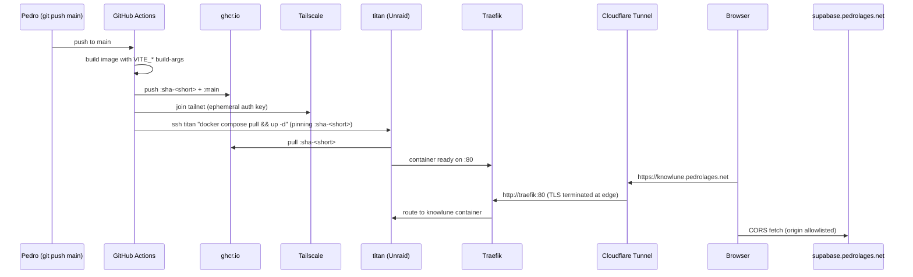

# Host Knowlune on titan as a personal daily-driver

## Overview

Stand up Knowlune as a single-container deploy on Pedro's Unraid server (titan) at `https://knowlune.pedrolages.net`, auto-updating on every `git push` to `main`. Scope is deliberately narrower than the existing [beta launch plan](2026-04-18-011-feat-knowlune-online-beta-launch-plan.md): this is a personal daily-driver, not a beta. No restore rehearsal, no Postgres tuning, no privacy policy — those remain gated to the beta plan.

Research changed two things versus the origin brainstorm: (1) the proposed Watchtower auto-pull pattern is replaced with **GitHub Actions + Tailscale SSH + SHA-pinned tags** (Watchtower was archived Dec 2025; the push-based flow also gives one-click rollback via workflow re-run), and (2) an existing Forgejo deploy workflow at [.forgejo/workflows/deploy.yml](.forgejo/workflows/deploy.yml) ships SSH-push deploys today — it will be retired once the new flow is verified.

## Problem Frame

Knowlune currently runs only from `npm run dev` on Pedro's laptop. He wants to reach it from any device as a daily-driver without spinning up the dev server, while keeping access private to his Supabase-auth'd account. The work is entirely infrastructure — no code changes in `src/` are required, but one Dockerfile change is needed so `VITE_*` env vars reach the browser bundle. (see origin: [docs/brainstorms/2026-04-20-host-knowlune-titan-daily-driver-requirements.md](../brainstorms/2026-04-20-host-knowlune-titan-daily-driver-requirements.md))

## Requirements Trace

- **R1.** Knowlune reachable at `https://knowlune.pedrolages.net` over HTTPS from any device.
- **R2.** Only accounts in titan Supabase can sign in; magic-link email delivery works end-to-end.
- **R3.** Same-origin `/api/*` requests hit the bundled Express server without CORS.
- **R4.** Browser fetches to `https://supabase.pedrolages.net` succeed from the new origin (Supabase Kong CORS updated).
- **R5.** A `git push` to `main` results in the running titan container being updated within 15 minutes, without manual SSH steps, unless the build fails.
- **R6.** Runtime errors visible in Sentry when `VITE_SENTRY_DSN` is configured (deferrable on first deploy).
- **R7.** A single documented action rolls back to the previous image tag in under 2 minutes.
- **R8.** The same image + different env can be redeployed as `staging.pedrolages.net` later, with no rebuild, to rehearse the beta plan.

## Scope Boundaries

- No restore rehearsal, Postgres tuning, or Kopia verification (beta-plan Phase 1).
- No privacy policy, delete-account flow, or legal surface (beta-plan Phase 3).
- No Stripe/billing, no invite UI, no OAuth beyond magic link.
- No Cloudflare Pages split, no edge caching, no preview deploys.
- No public waitlist / beta gating.
- No `src/` or `server/` logic changes. Only the [Dockerfile](../../Dockerfile) receives a behavioral change (ARG/ENV for `VITE_*` build-time injection).

### Deferred to Separate Tasks

- Retiring the existing Forgejo workflow ([.forgejo/workflows/deploy.yml](../../.forgejo/workflows/deploy.yml)): done in-plan (Unit 7) but only *after* the new flow is verified green, so it lands as its own atomic commit.
- Dashboard/monitoring for deploy health beyond GitHub Actions logs and Sentry: beta plan.
- Documented runbook in `docs/docker/`: the directory doesn't exist yet; Unit 6 creates a single `README.md` there covering rollback + ops basics. A full runbook is beta-plan scope.

## Context & Research

### Relevant Code and Patterns

- [Dockerfile](../../Dockerfile) — two-stage `node:24-alpine` build. Currently runs `npm run build` with no `ARG`/`ENV` for Vite vars, so Supabase URL/anon key are never baked into the SPA. **Must be changed** (Unit 1).
- [docker-entrypoint.sh](../../docker-entrypoint.sh) — starts nginx daemonized, then `exec node server/index.js`. No changes needed.
- [nginx.conf](../../nginx.conf) — serves SPA at `/`, proxies `/api/` to Express on `127.0.0.1:3001`. Confirms same-origin SPA↔API; no CORS needed for R3.
- [.env.example](../../.env.example) — env contract. Build-time: `VITE_SUPABASE_URL`, `VITE_SUPABASE_ANON_KEY`, `VITE_SENTRY_DSN` (optional), `VITE_API_BASE_URL` (optional). Runtime (server-only): `SUPABASE_JWT_SECRET`, `SUPABASE_SERVICE_ROLE_KEY`, `ALLOWED_ORIGINS`.
- [server/middleware/origin-check.ts](../../server/middleware/origin-check.ts) — enforces `Origin`/`Referer` allowlist on `/api/*`. Must include `https://knowlune.pedrolages.net` or every API call returns 403.
- [server/index.ts:563-567](../../server/index.ts) — if `ALLOWED_ORIGINS`/JWT secret unset, entire auth+rate-limit chain is skipped ("AI endpoints are unprotected"). All runtime env must be set on titan.
- [src/main.tsx](../../src/main.tsx) — Sentry init, env-gated; no-op when `VITE_SENTRY_DSN` unset.
- [.forgejo/workflows/deploy.yml](../../.forgejo/workflows/deploy.yml) — existing SSH-push deploy (target: `192.168.2.200`, stack path: `/mnt/cache/docker/stacks/knowlune`, secret: `DEPLOY_SSH_KEY`). **Overlap — retired in Unit 7 after verification.**
- [.github/workflows/ci.yml](../../.github/workflows/ci.yml) — existing CI: typecheck/lint/format/build/unit/lighthouse. No image-build step; new deploy workflow is additive.

### Institutional Learnings

- `docs/solutions/` has zero prior entries on Docker builds, Traefik, Cloudflare Tunnel, or auto-deploy. This plan is greenfield for the project — capture first-deploy surprises in a solution doc after landing (post-plan hygiene, not in-scope).
- One adjacent precedent: [server/index.ts](../../server/index.ts) `isAllowedOllamaUrl()` explicitly blocks loopback/link-local for SSRF safety. Not in scope here (no new proxy routes), but keep the posture in mind for any future titan-local service proxy.

### External References

- Auto-deploy pattern recommendation (2026): GitHub Actions + Tailscale SSH + SHA-pinned tags beats Watchtower/Diun/Komodo for a single-container homelab daily-driver — smallest persistent blast radius, one-click rollback via workflow re-run, no host-side agent with Docker socket access.
- [docker/build-push-action@v6](https://github.com/docker/build-push-action) — current recommended GHCR push action.
- [tailscale/github-action@v3](https://github.com/tailscale/github-action) — ephemeral tailnet join with OAuth client + tagged auth key.
- [Traefik v3 file provider docs](https://doc.traefik.io/traefik/routing/providers/file/) — HTTP-only entrypoint pattern when Cloudflare Tunnel terminates TLS upstream.
- [Cloudflare Tunnel config.yml](https://developers.cloudflare.com/cloudflare-one/connections/connect-networks/configure-tunnels/local-management/configuration-file/) — `ingress:` + separate `cloudflared tunnel route dns` for CNAME creation.
- [Vite env docs](https://vite.dev/guide/env-and-mode) — `VITE_*` statically replaced at build time; must use Docker `ARG`/`ENV` before `npm run build`.

## Key Technical Decisions

- **Auto-deploy = GitHub Actions push model, not Watchtower pull model.** (see origin for the original pull-model framing — superseded by research.) Reasons: Watchtower archived Dec 2025; push model gives one-click rollback via "re-run old workflow"; no host-side agent with Docker socket; ephemeral tailnet auth shrinks persistent secret surface.
- **Tags: `:sha-<short>` (immutable, deployed) + `:main` (floating, diagnostic).** Deploy pins to `:sha-<short>` in compose. Rollback = re-run older workflow, which redeploys its exact SHA. The `:main` tag exists for humans asking "what's latest?".
- **Tailscale for Actions→titan SSH.** Already installed on titan. Uses `tailscale/github-action@v3` with ephemeral, tagged OAuth auth key — no public SSH port, no IP allowlist.
- **Bundled container reused as-is.** Single Nginx + Node image means same-origin SPA↔API (satisfies R3 for free; no CORS middleware tuning). Confirmed with [nginx.conf](../../nginx.conf).
- **`VITE_*` passed as Docker build args, not runtime env.** Single-environment deploy — runtime placeholder injection is premature. Promote to placeholder pattern only when staging is added (beta-plan scope).
- **Traefik: HTTP-only entrypoint behind Cloudflare Tunnel.** TLS terminates at Cloudflare edge; no internal HTTPS, no cert resolver. Reuse existing `chain-public@file` middleware (rate limit + CrowdSec).
- **Supabase anon key safe to ship in bundle.** Public by design; RLS is the security boundary. Service-role key never touches the bundle.
- **Supabase Kong CORS allowlist must include `https://knowlune.pedrolages.net`.** Browser-direct Supabase calls are cross-origin.
- **Express `ALLOWED_ORIGINS` must include `https://knowlune.pedrolages.net`.** Otherwise every `/api/*` returns 403 via [origin-check.ts](../../server/middleware/origin-check.ts).
- **Forgejo workflow retired after verification.** Replaced, not kept as fallback — two deploy paths invite double-deploy races.

## Open Questions

### Resolved During Planning

- **Auto-deploy mechanism?** GitHub Actions + Tailscale SSH + SHA-pinned tags (research pass, 2026-04-20).
- **Image registry?** GHCR. Free for private repos, auth via `GITHUB_TOKEN` at build time and a fine-grained PAT (`read:packages`) on titan for pull.
- **Image tagging?** `:sha-<short>` + `:main`.
- **Dockerfile scope?** Modify now (Unit 1). Minimal ARG/ENV additions before `npm run build`.
- **Forgejo workflow?** Retire in Unit 7 post-verification.
- **Traefik middleware chain?** Reuse `chain-public@file`.
- **Internal HTTPS?** No. HTTP entrypoint only; Cloudflare terminates TLS.

### Deferred to Implementation

- Exact shape of titan's `docker-compose.yml` stanza (stack path reuse from existing Forgejo flow at `/mnt/cache/docker/stacks/knowlune`, or fresh location) — decide during Unit 3 after reviewing current stack contents on titan.
- Whether `cloudflared` on titan uses `config.yml` ingress (locally-managed) or dashboard-managed ingress — verify during Unit 5; both paths are documented below.
- Short SHA length (7 vs 8 chars) — use `docker/metadata-action@v5` default (7).

## High-Level Technical Design

> *This illustrates the intended approach and is directional guidance for review, not implementation specification. The implementing agent should treat it as context, not code to reproduce.*

**Rollback path:** Pedro opens the GitHub Actions UI → selects a prior successful workflow run → clicks "Re-run all jobs". That workflow's `:sha-<short>` is re-pinned in compose, pulled, and brought up. End-to-end under 2 minutes. No SSH.

## Implementation Units

- [ ] **Unit 1: Thread `VITE_*` build args through the Dockerfile**

**Goal:** Make the existing [Dockerfile](../../Dockerfile) accept Supabase URL, anon key, optional Sentry DSN, and optional `VITE_API_BASE_URL` as build args and expose them as `ENV` before `npm run build`, so the Vite build bakes them into the SPA bundle.

**Requirements:** R1, R2, R4, R6

**Dependencies:** None.

**Files:**
- Modify: `Dockerfile`

**Approach:**
- In stage 1 (builder), before `RUN npm run build`, add `ARG VITE_SUPABASE_URL`, `ARG VITE_SUPABASE_ANON_KEY`, `ARG VITE_SENTRY_DSN`, `ARG VITE_API_BASE_URL` followed by matching `ENV` lines.
- Leave all other stage-1 and stage-2 steps unchanged.
- Keep the existing `HEALTHCHECK` and `EXPOSE 80`.

**Patterns to follow:**
- Vite build-arg pattern from external research (§External References): `ARG VAR` + `ENV VAR=$VAR` before `npm run build`.

**Test scenarios:**
- Happy path: `docker build --build-arg VITE_SUPABASE_URL=https://supabase.pedrolages.net --build-arg VITE_SUPABASE_ANON_KEY=<key> -t knowlune-test .` succeeds; built image served via `docker run -p 8080:80 knowlune-test`; `curl http://localhost:8080/assets/*.js | grep supabase.pedrolages.net` returns a match (proving the URL was baked into the bundle).
- Edge case: omitting `VITE_SENTRY_DSN` and `VITE_API_BASE_URL` build args still produces a working image (Sentry init is env-gated, no-op on missing DSN — confirmed in [src/main.tsx](../../src/main.tsx)).
- Integration: image built with args and run standalone responds `200 OK` on `/` and `/api/health` (via the bundled Express server).

**Verification:**
- Bundle inspection confirms `VITE_SUPABASE_URL` literal appears in the JS output.
- No regression to the existing `HEALTHCHECK` — `docker inspect --format='{{.State.Health.Status}}'` reports `healthy` within 90s.

- [ ] **Unit 2: GitHub Actions build+push workflow to GHCR**

**Goal:** New workflow `.github/workflows/deploy-titan.yml` triggered on `push` to `main`, builds the image with `VITE_*` build args from GitHub secrets/vars, and pushes two tags to GHCR: `:sha-<short>` (immutable) and `:main` (floating). Does not yet deploy — that's Unit 4.

**Requirements:** R5, R8

**Dependencies:** Unit 1 (Dockerfile must accept build args).

**Files:**
- Create: `.github/workflows/deploy-titan.yml`

**Approach:**
- Two jobs: `build-and-push` (this unit) and `deploy` (Unit 4). Deploy `needs: build-and-push` and passes the short SHA as a job output.
- `build-and-push`:
  - `actions/checkout@v4`
  - `docker/setup-qemu-action@v3` (optional — skip if amd64-only)
  - `docker/setup-buildx-action@v3`
  - `docker/metadata-action@v5` emits `type=sha` (short) and `type=ref,event=branch` (→ `main`)
  - `docker/login-action@v3` with `registry: ghcr.io`, `GITHUB_TOKEN`
  - `docker/build-push-action@v6` with `platforms: linux/amd64`, `build-args` populated from `vars.VITE_SUPABASE_URL`, `vars.VITE_API_BASE_URL`, `secrets.VITE_SUPABASE_ANON_KEY`, `secrets.VITE_SENTRY_DSN`, `tags: steps.meta.outputs.tags`, `provenance: false`, `sbom: false`.
- `permissions: { contents: read, packages: write }`.
- No arm64, no SBOM, no provenance — single-user, single-arch, no compliance need.

**Patterns to follow:**
- Existing [.github/workflows/ci.yml](../../.github/workflows/ci.yml) for checkout + cache conventions.
- Official [docker/build-push-action@v6](https://github.com/docker/build-push-action) minimal recipe.

**Test scenarios:**
- Happy path: push a trivial change to a branch PR against `main`, confirm the workflow skips (trigger is `main` only, not PR). Merge the PR; workflow runs; both `ghcr.io/pedrolages/knowlune:main` and `ghcr.io/pedrolages/knowlune:sha-<short>` appear in GHCR.
- Error path: workflow fails cleanly if `VITE_SUPABASE_ANON_KEY` secret is missing (build-args propagate `undefined`, Vite produces a bundle with `undefined` Supabase URL, unit tests stay green — we don't block on this, but surface it in logs).
- Integration: image pulled locally (`docker pull ghcr.io/pedrolages/knowlune:sha-<short>` with a `read:packages` PAT) runs the same as Unit 1's local build.

**Verification:**
- Both tags visible in `ghcr.io/pedrolages/knowlune` package UI.
- Workflow completes in under 8 minutes on `ubuntu-latest`.

- [ ] **Unit 3: titan compose stack + env file**

**Goal:** On titan, a `docker-compose.yml` at `/mnt/cache/docker/stacks/knowlune/` (reusing the existing Forgejo stack path) references `ghcr.io/pedrolages/knowlune:sha-<short>` via a substituted env var, reads runtime env from `.env`, and attaches to Traefik's Docker network with the right labels.

**Requirements:** R1, R2, R3, R7, R8

**Dependencies:** Unit 2 (images must exist in GHCR so titan can pull).

**Files:**
- Create (on titan, out of repo): `/mnt/cache/docker/stacks/knowlune/docker-compose.yml`
- Create (on titan, out of repo): `/mnt/cache/docker/stacks/knowlune/.env` — populated from [.env.example](../../.env.example) plus `IMAGE_TAG=sha-<short>`.
- Create (in repo, as reference): `docs/docker/compose.example.yml` — sanitized compose for future reference.

**Approach:**
- `docker-compose.yml` service: image `ghcr.io/pedrolages/knowlune:${IMAGE_TAG:-main}`, `env_file: .env`, attached to existing Traefik Docker network (check titan's current Traefik compose for the network name — likely `traefik` or `proxy`).
- Labels: `traefik.enable=true`, `traefik.http.routers.knowlune.rule=Host(\`knowlune.pedrolages.net\`)`, `traefik.http.routers.knowlune.entrypoints=web`, `traefik.http.routers.knowlune.middlewares=chain-public@file`, `traefik.http.services.knowlune.loadbalancer.server.port=80`.
- `.env` on titan must set: `VITE_SUPABASE_URL`, `VITE_SUPABASE_ANON_KEY` (these are read by compose to pass back as build-args — *but wait, image is pre-built*, so actually these aren't needed at runtime on titan; they're only needed for the GHCR build), `SUPABASE_JWT_SECRET`, `SUPABASE_SERVICE_ROLE_KEY`, `ALLOWED_ORIGINS=https://knowlune.pedrolages.net`, optional `VITE_SENTRY_DSN`.
- Clarification: runtime `.env` on titan contains only *server-runtime* vars (JWT secret, service role key, ALLOWED_ORIGINS, optional Sentry DSN for server-side, `IMAGE_TAG`). `VITE_*` are baked at build time in GHCR — they do not need to be in titan's `.env`.

**Patterns to follow:**
- Existing Traefik dynamic config on titan at `/mnt/user/appdata/traefik/dynamic/` — mirror the label/middleware conventions already used by other stacks.
- Existing Forgejo flow's stack path reuse: `/mnt/cache/docker/stacks/knowlune/`.

**Test scenarios:**
- Happy path: on titan, `IMAGE_TAG=sha-<short> docker compose up -d` pulls the image from GHCR (after `docker login ghcr.io` with PAT), container starts, Traefik discovers it.
- Edge case: `.env` missing `ALLOWED_ORIGINS` — server logs the "middleware chain DISABLED" warning ([server/index.ts:563-567](../../server/index.ts)). Deploy should surface this in logs; not a blocker for first boot, but document it as must-set in the runbook (Unit 6).
- Error path: image pull fails (expired PAT) — compose up returns non-zero; Actions step fails fast.
- Integration: `curl -H "Host: knowlune.pedrolages.net" http://<titan-lan-ip>/` returns the SPA `index.html` via Traefik (internal reach, before tunnel).

**Verification:**
- `docker ps | grep knowlune` shows container `Up (healthy)`.
- `docker logs knowlune` shows Express listening on 3001 and no `ALLOWED_ORIGINS unset` warning.
- Traefik dashboard (if exposed) shows the router as `enabled`.

- [ ] **Unit 4: Actions deploy job — Tailscale + SSH to titan**

**Goal:** A `deploy` job in [.github/workflows/deploy-titan.yml](../../.github/workflows/deploy-titan.yml) that, after `build-and-push` succeeds, joins the tailnet ephemerally and SSHes to `titan` to run `IMAGE_TAG=sha-<short> docker compose pull && docker compose up -d`.

**Requirements:** R5, R7, R8

**Dependencies:** Units 2 (images exist) + 3 (compose stack exists on titan).

**Files:**
- Modify: `.github/workflows/deploy-titan.yml` (append `deploy` job)

**Approach:**
- `needs: build-and-push`; receive short SHA via job output.
- `tailscale/github-action@v3` with `oauth-client-id: ${{ secrets.TS_OAUTH_CLIENT_ID }}`, `oauth-secret: ${{ secrets.TS_OAUTH_SECRET }}`, `tags: tag:ci`, ephemeral.
- SSH via action (`appleboy/ssh-action` or raw `ssh`), hostname `titan` (tailnet MagicDNS), user `deploy` (restricted account, see below), key `${{ secrets.TITAN_DEPLOY_SSH_KEY }}`.
- Command: `cd /mnt/cache/docker/stacks/knowlune && sed -i "s/^IMAGE_TAG=.*/IMAGE_TAG=sha-${SHORT_SHA}/" .env && docker compose pull && docker compose up -d && docker image prune -f`.
- On titan, a `deploy` user has:
  - `authorized_keys` entry with `command="cd /mnt/cache/docker/stacks/knowlune && docker compose pull && docker compose up -d",restrict` — forces one command, but we need parameterized SHA. Alternative: write SHA to `/mnt/cache/docker/stacks/knowlune/IMAGE_TAG` file via `SSH_ORIGINAL_COMMAND` parsing. **Implementer decision: simplest path is restricted user in `docker` group, `authorized_keys` without force-command, deploy a helper script on titan that reads the SHA and performs the swap.** Document in Unit 6 runbook.
- Tailscale ACL: `tag:ci` can reach `tag:homelab` on port 22 only.

**Patterns to follow:**
- Existing Forgejo SSH flow: [.forgejo/workflows/deploy.yml](../../.forgejo/workflows/deploy.yml) shows the compose-pull-up shape (what to replicate without its SSH-over-public-internet approach).
- [tailscale/github-action@v3](https://github.com/tailscale/github-action) README minimal recipe.

**Test scenarios:**
- Happy path: merge a trivial `main` change; within 8 min, workflow completes green, `docker ps` on titan shows a restarted container with the new SHA.
- Edge case: Tailscale auth fails (bad OAuth secret) — workflow fails fast in the Tailscale step, no partial deploy state.
- Error path: `docker compose pull` fails on titan (GHCR PAT expired) — SSH step non-zero exit, workflow fails, prior container keeps running (no downtime).
- Integration: rollback drill — click "Re-run all jobs" on a prior successful workflow; titan ends up on the older SHA within 2 minutes.

**Verification:**
- GitHub Actions log shows the SSH command output including the new container ID.
- `docker inspect knowlune --format='{{.Config.Image}}'` on titan returns the expected `:sha-<short>` tag.
- Rollback drill completes in under 2 minutes (R7).

- [ ] **Unit 5: Traefik + Cloudflare Tunnel for `knowlune.pedrolages.net`**

**Goal:** Add Traefik dynamic routing (if not already covered by Docker labels in Unit 3) and Cloudflare Tunnel ingress so `https://knowlune.pedrolages.net` resolves and reaches the container.

**Requirements:** R1, R3

**Dependencies:** Unit 3 (container exists with Traefik labels).

**Files:**
- Modify or create (on titan, out of repo): `/mnt/user/appdata/traefik/dynamic/knowlune.yml` *(only needed if Docker-label routing from Unit 3 is not sufficient — typical homelab Traefik with Docker provider picks up labels automatically; file-provider config is a fallback)*.
- Modify (on titan, out of repo): `cloudflared` ingress config — add `- hostname: knowlune.pedrolages.net, service: http://<traefik-host>:80` above the catch-all. Location is either `/mnt/user/appdata/cloudflared/config.yml` (locally-managed) or the Cloudflare One dashboard (remote-managed).
- Run (on titan, one-time): `cloudflared tunnel route dns <tunnel-name> knowlune.pedrolages.net` to create the CNAME.

**Approach:**
- If Docker-label Traefik discovery works (Unit 3 labels), no file-provider needed.
- Cloudflare Tunnel: insert the new hostname entry before the `service: http_status:404` catch-all. Restart `cloudflared` (`systemctl restart cloudflared` or restart the container).
- DNS route command creates the CNAME to `<tunnel-id>.cfargotunnel.com`. Verify via `dig knowlune.pedrolages.net CNAME`.
- HTTP entrypoint only (TLS terminates at Cloudflare edge); no cert resolver needed.

**Patterns to follow:**
- Existing other-service entries in titan's `cloudflared` config (e.g., the entry for `supabase.pedrolages.net`).

**Test scenarios:**
- Happy path: `curl -I https://knowlune.pedrolages.net/` returns `200 OK` with `server: nginx` header.
- Happy path: `curl https://knowlune.pedrolages.net/some-deep-route` returns SPA `index.html` (SPA fallback in nginx).
- Happy path: `curl https://knowlune.pedrolages.net/api/health` returns healthy JSON.
- Edge case: DNS record not created — browser gets `NXDOMAIN`; operator runs `cloudflared tunnel route dns` to fix.
- Error path: Cloudflare Tunnel restart drops in-flight requests for ~2s — acceptable for a one-time config push.

**Verification:**
- Browser reaches `https://knowlune.pedrolages.net` from Pedro's phone over cellular (not just LAN).
- Cloudflare dashboard → Tunnels → shows the new public hostname routing.

- [ ] **Unit 6: Docs + runbook**

**Goal:** Create `docs/docker/README.md` with the operator-facing essentials: first-time titan setup (deploy user, SSH key, GHCR PAT, Tailscale ACL), `.env` contract reminder, rollback recipe, and "add a new environment" hints for R8.

**Requirements:** R7 (runbook has the rollback recipe), R8 (notes how to redeploy the same image elsewhere).

**Dependencies:** Units 1–5 (have something to document).

**Files:**
- Create: `docs/docker/README.md`
- Create: `docs/docker/compose.example.yml` (already scheduled in Unit 3, cross-linked here)

**Approach:**
- Keep the doc short — 1–2 pages. Sections: Overview, First-time titan setup (prerequisites: Tailscale installed ✓, Traefik running, Cloudflare Tunnel), Secrets that must exist in GitHub (`VITE_SUPABASE_ANON_KEY`, `VITE_SENTRY_DSN`, `TS_OAUTH_CLIENT_ID`, `TS_OAUTH_SECRET`, `TITAN_DEPLOY_SSH_KEY`) and vars (`VITE_SUPABASE_URL`, `VITE_API_BASE_URL`), `.env` on titan (ALLOWED_ORIGINS, JWT secret, service role key), Rollback recipe (1-click workflow re-run), Add a staging env (clone compose dir, new subdomain, new `.env`, reuse the image).
- Explicitly note: "Do not deploy to production users from this setup — see the beta launch plan."

**Patterns to follow:**
- Existing [docs/plans/](../plans/) frontmatter conventions.

**Test scenarios:**
- Test expectation: none — documentation. Reviewed by reading through with fresh eyes; operator should be able to rollback without asking.

**Verification:**
- A peer (or future-Pedro) can execute the rollback steps from the README without context from this plan.

- [ ] **Unit 7: Retire the Forgejo deploy workflow**

**Goal:** Delete [.forgejo/workflows/deploy.yml](../../.forgejo/workflows/deploy.yml) after Units 1–5 are verified working end-to-end.

**Requirements:** Operational hygiene; prevents double-deploy race between Forgejo and GitHub Actions.

**Dependencies:** Units 1–5 verified (new flow proven). **Must not land before green deploys from the new flow.**

**Files:**
- Delete: `.forgejo/workflows/deploy.yml`
- Check: is `.forgejo/` directory now empty? If yes, delete it too.

**Approach:**
- Land as a separate commit (explicitly: "chore: retire Forgejo deploy after titan GHCR flow verified"). Keeps the retirement auditable and revertible.
- Before deletion, confirm the Forgejo runner won't fire on merge (or that the workflow will be a no-op). Worst case if both fired: the GHCR image is always up-to-date, and Forgejo's `docker save | ssh` path would deploy the locally-built image — but titan's compose pulls `ghcr.io/...`, so the Forgejo path would no-op anyway after Unit 3 takes effect. Still: better to delete once confidence is established.

**Test scenarios:**
- Test expectation: none — deletion only.

**Verification:**
- `git grep forgejo` returns no workflow references.
- Next `main` push fires only the GitHub Actions workflow; titan container updates as expected.

## System-Wide Impact

- **Interaction graph:** GitHub Actions runner ↔ GHCR ↔ Tailscale ↔ titan SSH ↔ Docker Engine ↔ Traefik ↔ Cloudflare Tunnel ↔ browser. Each hop has its own failure mode; the workflow fails fast at the first failure and the prior container keeps serving.
- **Error propagation:** Build failures stop before publish; publish failures stop before deploy; deploy failures leave the prior `:sha-<short>` in place. Compose `up -d` is stop-then-start on the single service — ~2–5s gap where Traefik 502s. Acceptable for daily-driver.
- **State lifecycle risks:**
  - Concurrent deploys: if two `main` pushes happen within a few minutes, the second SSH may fight the first. Mitigation: GitHub Actions `concurrency: { group: deploy-titan, cancel-in-progress: false }`.
  - Stale images: `docker image prune -f` after each deploy keeps titan tidy.
  - GHCR PAT expiry: surface in runbook; titan keeps running the old image indefinitely if pull fails (benign).
- **API surface parity:** None — this is net-new infrastructure, no other interfaces require matching changes.
- **Integration coverage:** Post-deploy smoke (manual): magic-link login → SPA loads → existing video progress pulls from Supabase. Automated end-to-end gated to beta plan.
- **Unchanged invariants:**
  - [Dockerfile](../../Dockerfile) runtime shape (Nginx + Node bundled) is preserved.
  - [nginx.conf](../../nginx.conf) routing (`/` → SPA, `/api/` → `127.0.0.1:3001`) unchanged.
  - No `src/` or `server/` code changes.
  - [.env.example](../../.env.example) contract unchanged.
  - Existing [.github/workflows/ci.yml](../../.github/workflows/ci.yml) continues to run on PRs; the new deploy workflow is additive and triggers only on `main` push.

## Risks & Dependencies

| Risk                                                                             | Mitigation                                                                                   |
| -------------------------------------------------------------------------------- | -------------------------------------------------------------------------------------------- |
| Tailscale OAuth secret leak in Actions log                                       | Use ephemeral auth keys only; scope to `tag:ci` in tailnet ACL; GitHub Actions log masking.  |
| GHCR PAT on titan expires silently                                               | Document rotation cadence in Unit 6 runbook; next deploy fails loudly, prior container runs. |
| Double-deploy race (Forgejo + GitHub Actions) before Unit 7 lands                | titan pulls `ghcr.io/...`; Forgejo's `docker save` path no-ops once compose is GHCR-pinned. Unit 7 is cleanup, not a correctness fix. |
| Supabase Kong CORS missed in cutover → login UI shows error toasts from Supabase | Checklist item in Unit 6 runbook: add `https://knowlune.pedrolages.net` to Supabase Kong CORS allow-list on first failed fetch. |
| Cloudflare Tunnel misroute takes daily-driver offline                            | `cloudflared` config change is revertible in seconds; restart restores prior state.          |
| Watchtower-fork nomenclature confusion in research → wrong tool installed        | Resolved by switching to push-based Pattern C; no auto-pull agent installed.                 |
| Single-container image can't independently scale API ↔ SPA                       | Not a daily-driver concern. Revisit only if beta plan triggers the split.                    |

## Documentation / Operational Notes

- After first green deploy, capture any surprises into `docs/solutions/best-practices/titan-knowlune-deploy-2026-04-XX.md` per project convention.
- Sentry DSN is optional first deploy; wire in when ready, no redeploy of infra needed — just a secret + trigger a rebuild.
- Rollback = GitHub Actions UI → old workflow → "Re-run all jobs". Takes <2 min.
- Staging readiness (R8): same image, new subdomain, new `.env`, new compose stack on the same titan host (or a different host). No rebuild required.

## Sources & References

- **Origin document:** [docs/brainstorms/2026-04-20-host-knowlune-titan-daily-driver-requirements.md](../brainstorms/2026-04-20-host-knowlune-titan-daily-driver-requirements.md)
- **Related plan (explicitly not overlapped):** [docs/plans/2026-04-18-011-feat-knowlune-online-beta-launch-plan.md](2026-04-18-011-feat-knowlune-online-beta-launch-plan.md)
- **Current deploy automation being replaced:** [.forgejo/workflows/deploy.yml](../../.forgejo/workflows/deploy.yml)
- **Existing CI workflow:** [.github/workflows/ci.yml](../../.github/workflows/ci.yml)
- **Container assets:** [Dockerfile](../../Dockerfile), [docker-entrypoint.sh](../../docker-entrypoint.sh), [nginx.conf](../../nginx.conf), [.env.example](../../.env.example)
- **Server middleware (ALLOWED_ORIGINS consumer):** [server/middleware/origin-check.ts](../../server/middleware/origin-check.ts), [server/index.ts:563-567](../../server/index.ts)
- **Frontend env (Sentry, Supabase):** [src/main.tsx](../../src/main.tsx), [src/lib/auth/supabase.ts](../../src/lib/auth/supabase.ts)
- External: [docker/build-push-action@v6](https://github.com/docker/build-push-action), [tailscale/github-action@v3](https://github.com/tailscale/github-action), [Traefik v3 file provider](https://doc.traefik.io/traefik/routing/providers/file/), [Cloudflare Tunnel config.yml](https://developers.cloudflare.com/cloudflare-one/connections/connect-networks/configure-tunnels/local-management/configuration-file/), [Vite env docs](https://vite.dev/guide/env-and-mode).
