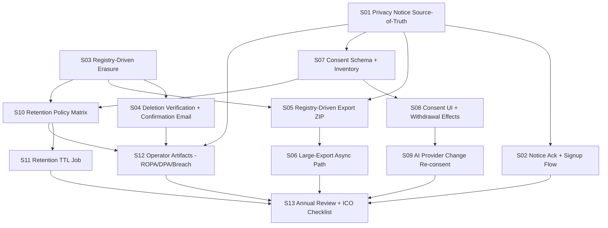

# E119 — GDPR Full Compliance (Umbrella)

## Overview

Bring Knowlune to defensible, end-to-end GDPR compliance by completing, hardening, and documenting the user-facing capabilities, operational artifacts, and technical enforcement a beta with EU users requires. This plan is an **umbrella**: it decomposes into 13 dependency-ordered stories (E119-S01 … S13) spanning Articles 5, 6, 7, 12, 13/14, 15, 17, 20, 28, 30, 32, 33/34.

**Posture: "verify + extend", not "build from scratch".** The codebase already has substantial scaffolding: `src/app/pages/legal/PrivacyPolicy.tsx`, `TermsOfService.tsx`, `LegalUpdateBanner.tsx`, `src/app/components/settings/{AccountDeletion,MyDataSummary,DataRetentionSettings}.tsx`, `src/lib/account/deleteAccount.ts`, `src/lib/exportService.ts`, `supabase/functions/delete-account/index.ts`, and a 26-table sync registry at `src/lib/sync/tableRegistry.ts`. The epic's job is to (a) make those pieces **registry-driven** so they never drift, (b) fill the gaps (consent records, retention TTL job, sub-processor DPA/ROPA/breach runbook), and (c) produce the markdown artifacts a DPA expects to see.

## Problem Frame

Knowlune is live at `knowlune.pedrolages.net` serving EU users with personal data stored in EU-resident self-hosted Supabase + Dexie IndexedDB. It processes email, auth identifiers, learning history, notes, highlights, voice clips, AI chat transcripts, and learner-model derivatives. A partial right-to-erasure landed 2026-04-22 (see origin §1), but transparency, access/portability, consent management, retention enforcement, and operator artifacts (ROPA, DPA, breach runbook) are incomplete or absent. Without them, a DSAR, regulator inquiry, or breach leaves Pedro without defensible answers.

The umbrella framing exists because these articles interact: the privacy notice (Art 13) must accurately describe what export (Art 15/20) returns, what retention (Art 5(1)(e)) enforces, and which consents (Art 7) are captured. Planning them jointly prevents divergence (see origin §1).

## Requirements Trace

- **R1** (origin G1, SC2, NFR1) — Legal defensibility: DSAR/erasure/breach responses within statutory deadlines, backed by runbooks.
- **R2** (origin G2, S1-S6, SC1) — User-facing lifecycle: notice → ack → use → export → withdraw consent → delete → receipt, fully self-service.
- **R3** (origin G3, S7-S10, SC3) — Operator artifacts present in `docs/compliance/`: privacy notice source-of-truth, ROPA, DPA, retention matrix, breach runbook + register, consent inventory, annual review.
- **R4** (origin G4, SC4, SC5) — Technical enforcement: retention TTL job, consent-gated features, cascade deletes, audit logs, deletion verifiability tests.
- **R5** (origin G5, NFR3) — Sustainable for a solo operator: markdown + scripts + minimal UI, no SaaS GRC tooling.
- **R6** (origin A1-A6) — Transparency: versioned privacy notice at stable URL, signup acknowledgement, material-change re-ack flow.
- **R7** (origin B1-B8) — Access & portability: registry-driven export with data.json + media/ + README, authenticated, user-scoped, inline for typical size, async+signed-URL for large.
- **R8** (origin C1-C7) — Erasure: registry-driven wipe across all 26 tables + 4 buckets, verifiable, lawful-basis exceptions documented, confirmation email, 7-day grace period (already shipped).
- **R9** (origin D1-D6) — Consent: per-purpose toggles, records with evidence + notice version, easy withdrawal, no dark patterns, re-prompt on provider change.
- **R10** (origin E1-E5) — Retention: matrix for all stores, enforcement via scheduled job, soft-delete hard-delete TTLs, linked from notice.
- **R11** (origin F1-F6) — Operator artifacts: ROPA, DPA (self-contract), sub-processor addenda, breach runbook + register, annual review checklist.
- **R12** (origin SC6) — External review: run notice + ROPA past ICO SME checklist before epic close.
- **R13** (origin SC7) — Beta notification: in-app banner + re-acknowledgement, ≥95% within 30 days.

## Scope Boundaries

- **N1** — No DPO appointment (origin 2.2 N1).
- **N2** — No cookie banner theatre; storage disclosure in notice only (origin N2).
- **N3** — No DPIA (origin N3).
- **N4** — No SCCs / international transfer mechanics; EU-only (origin N4).
- **N5** — No multi-tenant admin console for DSAR queue (origin N5).
- **N6** — No formal age verification; 16+ self-attestation in notice (origin N6).
- **N7** — No Art 22 ADM opt-out UI; disclose AI in notice (origin N7).
- **Non-goal** — Re-architecting RLS policies. Verify coverage on export/delete paths, don't redesign.
- **Non-goal** — Re-implementing the sync engine. Use the existing `tableRegistry.ts` as the backbone.

### Deferred to Separate Tasks

- **Annual review execution** (the first review itself) — this plan delivers the checklist (S13); the first run is scheduled work for 2027-Q2.
- **Jurisdictional invoice-retention number confirmation** — Pedro to confirm with his accountant before the retention matrix finalises in S10; plan uses "10 years" as placeholder per origin §7 Q7.
- **Multi-locale notice translation** — origin NFR4: English-only at launch, revisit when user base demands it.

## Context & Research

### Relevant Code and Patterns

- `src/lib/sync/tableRegistry.ts` (678 lines) — authoritative list of 26 synced tables with priority tiers, conflict strategies, and Supabase mappings. **The backbone for registry-driven export/delete.** See origin §8 Risk-1/Risk-2.
- `src/lib/account/deleteAccount.ts` — orchestrates deletion with 7-day soft-delete grace (`SOFT_DELETE_GRACE_DAYS = 7`). Calls `delete-account` Edge Function, then `cancel-account-deletion` for grace reversal. Extend, don't re-do.
- `supabase/functions/delete-account/index.ts` — soft-deletes auth user, sets `deleted_at`, CORS-aware, JWT-authenticated. No Stripe calls yet. Extend to cascade to all 26 tables + 4 buckets using the registry.
- `supabase/functions/` already contains `main`, `create-checkout`, `stripe-webhook`, `vault-credentials`. Pattern to follow for new `export-data`, `retention-tick`, `cancel-account-deletion`, `consent-record` functions.
- `src/app/pages/legal/PrivacyPolicy.tsx` — exists with 10-section structure (sections array already matches Art 13 requirements). Needs content review, sub-processor list, retention summary, versioning scheme.
- `src/app/pages/legal/TermsOfService.tsx`, `LegalLayout.tsx`, `LegalUpdateBanner.tsx` — shell in place. LegalUpdateBanner already wires `documentId` + `effectiveDate`. Extend for re-acknowledgement tracking.
- `src/app/components/settings/{AccountDeletion,MyDataSummary,DataRetentionSettings}.tsx` — UI shells in place. MyDataSummary already calls `exportAllAsJson` from `src/lib/exportService.ts`; extend to full registry-driven ZIP.
- `src/app/components/settings/sections/` — AccountSection, IntegrationsDataSection, etc. Privacy section slots in alongside these.
- `src/lib/exportService.ts` — exports IndexedDB + localStorage as JSON/CSV/Markdown. Schema v14. Extend to include Supabase server-side data (not just local Dexie) and media from all 4 Storage buckets.
- `supabase/migrations/` — P0-P4 sync migrations landed (20260413 through 20260427). New migrations for consent records, notice acknowledgements, retention audit log, cron extension (if pg_cron path chosen).

### Institutional Learnings

- `reference_sync_engine_api.md` (memory) — `syncableWrite` rule; P0 stores wired in E92-S09. All data mutations must flow through the registry; export/delete must too.
- `reference_dexie_4_quirks.md` (memory) — `sortBy` returns Promise; async upgrades can't read auth; `syncQueue` terminal = 'dead-letter'. Retention job must handle dead-letter purge per origin E2.
- `reference_supabase_unraid.md` (memory) — Self-hosted Supabase on Unraid. pg_cron availability to verify in S11; fallback path is Edge Function + external cron trigger.
- `project_actual_deployment_topology.md` (memory) — Bundled deployment at `knowlune.pedrolages.net`. Legal pages live under `/legal/*` in the same bundle; no separate legal subdomain (resolves origin §7 Q10).
- `feedback_review_agent_model.md` (memory) — use opus for multi-story review runs; relevant to S01-S13 orchestration later.
- Beta launch plan (`docs/plans/2026-04-18-011-feat-knowlune-online-beta-launch-plan.md`) — Cloudflare Pages split was skipped; reinforces bundled topology.

### External References

- Regulation (EU) 2016/679 (GDPR full text).
- ICO SME checklist — https://ico.org.uk/for-organisations/sme-web-hub/checklists/ (chosen for SC6 per origin §7 Q6; pragmatic for solo operator).
- EDPB DPA template (Art 28) — basis for `docs/compliance/dpa-supabase.md`.
- Supabase published DPA — basis for sub-processor addenda; verify current version during S12.
- Cloudflare, Stripe, OpenAI, Anthropic published DPAs — accept by reference where terms match processor role.

## Key Technical Decisions

- **Decision:** All export + delete code is **registry-driven** via `src/lib/sync/tableRegistry.ts` rather than per-table hardcoded lists. Hardcoded lists drift silently when new tables land (origin §8 Risk-1/2).
- **Decision:** The privacy notice is the **source of truth** in `docs/compliance/privacy-notice.md`; `src/app/pages/legal/PrivacyPolicy.tsx` renders from or mirrors that markdown. An automated test asserts the in-app rendered notice matches the markdown source (or a content hash).
- **Decision:** Notice versioning uses **ISO date + integer revision** (e.g., `2026-05-01.1`) rather than semver; simpler for non-code artifacts and matches `LegalUpdateBanner`'s existing `effectiveDate` field. Resolves origin §7 Q5.
- **Decision:** Consent records live in a new `user_consents` Supabase table (synced to Dexie) with `(user_id, purpose, granted_at, withdrawn_at, notice_version, evidence)`. Notice acknowledgements in a parallel `notice_acknowledgements` table `(user_id, document_id, version, acknowledged_at)`.
- **Decision:** Export backend = **Edge Function streaming ZIP** for inline delivery; async + signed URL path only if export exceeds 500 MB (measured at runtime). Resolves origin §7 Q3. Signed URL lives in a new Storage bucket `exports/` with 7-day TTL set by `retention-tick`.
- **Decision:** Retention enforcement = **Edge Function `retention-tick`** triggered by a Cloudflare cron trigger daily at 03:00 UTC. Chosen over pg_cron because (a) pg_cron availability on self-hosted Supabase varies and (b) Edge Function path keeps logic in TypeScript and observable in the same log stream as other functions. Resolves origin §7 Q4.
- **Decision:** Stripe handling on delete = **anonymise customer (email/name/address scrubbed), retain customer+invoices for tax law**, 10-year retention (confirm jurisdictional number in S10). Resolves origin §7 Q8.
- **Decision:** Consent withdrawal for AI-derived embeddings/learner model = **delete embeddings immediately; freeze learner model snapshot with a `frozen_reason = 'consent_withdrawn'` marker**, no regeneration until consent re-granted. Resolves origin §7 Q9.
- **Decision:** Grace-period UX — non-blocking banner for 30 days post notice-update, then **soft-block** (read-only mode) until acknowledged. Clear CTA in banner. Resolves origin §8 Risk-6.
- **Decision:** DPA (Art 28) is produced as a **real contract** (markdown, signed date) even though controller and processor are the same person. Makes separation real the day infra ops delegates.
- **Decision:** ROPA lives in `docs/compliance/ropa.md` with a **table-driven structure** (one row per processing activity) so diffs surface changes clearly in code review.
- **Decision:** Sub-processor list is **generated/validated from code** where feasible — e.g., a small script that scans for third-party SDK usage and compares against the notice's sub-processor table, failing CI on drift (origin §8 Risk-4).

## Open Questions

### Resolved During Planning

- **Notice versioning scheme** (origin §7 Q5) — ISO date + integer revision (`2026-05-01.1`).
- **Export backend** (origin §7 Q3) — Edge Function streaming ZIP, async fallback > 500 MB.
- **Cron mechanism** (origin §7 Q4) — Cloudflare cron → Edge Function `retention-tick`.
- **Stripe on delete** (origin §7 Q8) — anonymise + retain for tax law.
- **Consent withdrawal for embeddings** (origin §7 Q9) — delete embeddings, freeze learner model snapshot.
- **Legal route host** (origin §7 Q10) — in-app `/legal/*` routes (bundled deployment).
- **GDPR checklist for SC6** (origin §7 Q6) — ICO SME checklist.
- **Story split** (origin §7 Q1) — 13 stories (see Implementation Units).
- **Implementation order** (origin §7 Q2) — A + C-completion first, then B + D, then E + F. Validated in dependency graph below.

### Deferred to Implementation

- **Jurisdictional invoice-retention number** (origin §7 Q7) — Pedro confirms with accountant during S10; plan uses 10-year placeholder.
- **pg_cron availability on self-hosted Supabase** — confirmed-no assumption drove Cloudflare cron decision; if pg_cron is in fact available, S11 may swap mechanism without changing the runbook.
- **Exact Supabase auth `deleted_at` schema** — S03 verifies existing column vs. adding one; don't assume.
- **Whether `exports/` bucket needs a dedicated RLS policy** — likely yes (owner-only read); confirm during S05 implementation.
- **AI provider identity change detection hook** — where in the code route selection happens; S08 discovers and wires a re-consent trigger.
- **Tabletop breach rehearsal participants** (origin F4) — Pedro solo for now; scripted walk-through in S12 verification.

## High-Level Technical Design

> *This illustrates the intended approach and is directional guidance for review, not implementation specification. The implementing agent should treat it as context, not code to reproduce.*

### Story dependency graph



### Registry-driven export/delete shape (pseudo-code)

```
// Conceptual only — not implementation
for entry in tableRegistry:
    rows = supabase.from(entry.supabaseTable)
           .select('*').eq('user_id', userId)
    bundle.data[entry.supabaseTable] = rows
for bucket in STORAGE_BUCKETS:            // 4 buckets
    objects = storage.listUserObjects(bucket, userId)
    bundle.media[bucket] = objects
bundle.README = renderManifest(bundle, schemaVersion, now())
return zip(bundle)
```

The same iteration protects deletion: every table/bucket reached by export is reached by delete, so drift in one surfaces as a test failure in the other.

### Consent + notice schema (sketch)

```
notice_acknowledgements(user_id, document_id, version, acknowledged_at, ip_hash)
user_consents(user_id, purpose, granted_at, withdrawn_at, notice_version, evidence)
  purposes in: 'ai_tutor', 'ai_embeddings', 'analytics_telemetry', 'marketing_email'
```

## Output Structure

```
docs/compliance/
├── privacy-notice.md          # Source of truth (S01)
├── consent-inventory.md       # Purposes + lawful bases (S07)
├── ropa.md                    # Record of Processing Activities (S12)
├── dpa-supabase.md            # Controller-processor DPA (S12)
├── subprocessors.md           # Cloudflare/Stripe/OpenAI/Anthropic addenda (S12)
├── retention.md               # Retention policy matrix (S10)
├── breach-runbook.md          # Detection/triage/72h template (S12)
├── breach-register.md         # Empty register template (S12)
└── annual-review.md           # Checklist (S13)

supabase/functions/
├── cancel-account-deletion/   # NEW (S03) — grace-period reversal
├── delete-account/            # EXTEND (S03) — cascade via registry
├── export-data/               # NEW (S05, S06) — streaming ZIP
└── retention-tick/            # NEW (S11) — daily TTL sweep

supabase/migrations/
├── 2026NNNN_user_consents.sql         # NEW (S07)
├── 2026NNNN_notice_acknowledgements.sql # NEW (S02)
├── 2026NNNN_retention_audit_log.sql    # NEW (S11)
└── 2026NNNN_auth_deleted_at_backfill.sql # NEW if needed (S03)

src/lib/compliance/            # NEW directory
├── consentService.ts          # S08
├── noticeVersion.ts           # S02
├── retentionPolicy.ts         # S10 (mirrors retention.md for code reads)
└── subprocessorRegistry.ts    # S12 (with CI drift check)
```

## Implementation Units

Each unit is a story (E119-S01 … S13). Story IDs are stable; implementers create branches `feature/e119-s0N-<slug>`.

- [ ] **S01 — Privacy Notice Source-of-Truth + Versioning**

**Goal:** Establish `docs/compliance/privacy-notice.md` as the canonical notice, wire the in-app `PrivacyPolicy.tsx` to render from (or mirror with drift test) that source, and implement ISO-date-plus-revision versioning.

**Requirements:** R3, R6

**Dependencies:** None (foundation for S02, S05, S07, S12).

**Files:**
- Create: `docs/compliance/privacy-notice.md`
- Create: `src/lib/compliance/noticeVersion.ts`
- Modify: `src/app/pages/legal/PrivacyPolicy.tsx`
- Modify: `src/app/pages/legal/LegalUpdateBanner.tsx` (consume `noticeVersion`)
- Test: `src/app/pages/legal/__tests__/PrivacyPolicy.notice-sync.test.tsx`
- Test: `src/lib/compliance/__tests__/noticeVersion.test.ts`

**Approach:**
- Write the plain-language notice covering all origin A2 contents: controller identity/contact, purposes + lawful basis per purpose, data categories, recipients (sub-processors named), retention summary (link to matrix), rights + how to exercise, complaint path to supervisory authority, AI processing disclosure.
- Version format: `YYYY-MM-DD.N` where N starts at 1 and increments on material changes.
- Code reads version from `noticeVersion.ts` which exports a single constant; bumping the constant signals a material change.
- Drift test: normalize both rendered React content and markdown source to plain text; assert equality or hash match.

**Patterns to follow:**
- `src/app/pages/legal/PrivacyPolicy.tsx` section structure (already has 10 Art-13-aligned sections).
- `LegalUpdateBanner.tsx` `documentId` + `effectiveDate` props.

**Test scenarios:**
- Happy path: `CURRENT_NOTICE_VERSION` constant matches the version frontmatter of `privacy-notice.md` → assertion passes.
- Edge case: markdown source has a section the rendered component omits → drift test fails with specific section name.
- Edge case: version bumped without content change → test surfaces "version bump with no diff" warning (advisory).
- Integration: banner displays correct version string to the user.

**Verification:**
- `docs/compliance/privacy-notice.md` reviewed against origin A2 checklist — every item present.
- Drift test green in CI.
- Banner displays `Effective YYYY-MM-DD (rev N)` to the user.

---

- [ ] **S02 — Notice Acknowledgement at Signup + Material-Change Re-ack**

**Goal:** Block account creation without notice acknowledgement; record acknowledgement; detect unacknowledged material changes and present re-ack banner → soft-block after 30 days.

**Requirements:** R6 (origin A4, A5, R13 origin SC7)

**Dependencies:** S01.

**Files:**
- Create: `supabase/migrations/2026NNNN_notice_acknowledgements.sql`
- Create: `src/hooks/useNoticeAcknowledgement.ts`
- Modify: `src/app/pages/legal/LegalUpdateBanner.tsx` (soft-block mode)
- Modify: signup flow (locate via `src/app/pages/Login.tsx` or Supabase auth UI wrapper; add checkbox + acknowledgement write)
- Test: `src/hooks/__tests__/useNoticeAcknowledgement.test.ts`
- Test: E2E `tests/e2e/compliance/notice-acknowledgement.spec.ts`

**Approach:**
- Schema: `notice_acknowledgements(user_id, document_id, version, acknowledged_at, ip_hash)`; RLS owner-only.
- Signup: checkbox "I have read the Privacy Notice (v{version})" — link opens `/legal/privacy`; submission writes acknowledgement row.
- Re-ack: hook compares user's latest ack version for each `document_id` against `CURRENT_NOTICE_VERSION`; if stale, show banner. After 30 days, `useSoftBlock()` flag flips UI into read-only mode with "Acknowledge to continue" CTA.
- Clock for 30-day window uses server-side notice release date, not client time.

**Patterns to follow:**
- `LegalUpdateBanner` existing structure.
- Deterministic time helper from `.claude/rules/testing/test-patterns.md` for E2E clock.

**Test scenarios:**
- Happy path: new user signs up with checkbox → ack row written with correct version.
- Edge case: signup attempted without checkbox → submit button disabled; no account created.
- Edge case: existing user on stale version → banner shown; ack resolves it.
- Error path: ack write fails → user sees retry CTA, is not silently blocked.
- Integration: 30-day-old stale ack → UI enters read-only mode; read actions work, write actions surface gate.

**Verification:**
- E2E covers signup ack + stale-version re-ack + soft-block transition.
- RLS policy prevents cross-user ack reads.

---

- [ ] **S03 — Registry-Driven Erasure Cascade**

**Goal:** Extend `delete-account` Edge Function + `deleteAccount.ts` to cascade across all 26 sync tables and 4 Storage buckets using `tableRegistry.ts`. Split into soft-delete (immediate) + hard-delete (after 7-day grace) phases.

**Requirements:** R8 (origin C1, C7), R4

**Dependencies:** None (but S04 depends on this).

**Files:**
- Modify: `supabase/functions/delete-account/index.ts`
- Create: `supabase/functions/cancel-account-deletion/index.ts`
- Create: `supabase/functions/retention-tick/index.ts` (skeleton — S11 fleshes out; here only the hard-delete-after-grace branch)
- Modify: `src/lib/account/deleteAccount.ts` (keep client contract; server does the new work)
- Modify: `supabase/functions/main/index.ts` (route new functions)
- Create migration if `auth.users.deleted_at` tracking column not present: `supabase/migrations/2026NNNN_auth_deletion_tracking.sql`
- Test: `supabase/functions/delete-account/__tests__/cascade.test.ts`
- Test: `src/lib/__tests__/deleteAccount.test.ts` (extend existing)

**Approach:**
- Soft-delete phase: mark `deleted_at` on auth + set `pending_deletion_at` on user-scoped table shared marker; user can still log in during grace to cancel.
- Hard-delete phase (invoked by `retention-tick` or on-demand if grace expired): iterate `tableRegistry` → `DELETE FROM {supabaseTable} WHERE user_id = $1`; iterate `STORAGE_BUCKETS = ['avatars', 'course-media', 'audio', 'exports']` (confirm names during implementation) → remove user-prefixed objects.
- Lawful-basis exceptions documented in `docs/compliance/retention.md` (see S10) and enforced in code: invoices (`billing_*` tables) retained + anonymised, breach-register references pseudonymised.
- Stripe anonymisation: scrub email/name/address via Stripe API, keep customer + invoices for tax retention.

**Execution note:** Characterization-first — write post-delete probe tests (read-every-table-by-user-id returns zero rows) before touching the cascade code. These tests both verify and provide regression safety for future schema additions.

**Patterns to follow:**
- Existing `delete-account/index.ts` CORS + JWT auth pattern.
- `tableRegistry.ts` iteration — mirror the pattern used in `syncEngine.ts`.

**Test scenarios:**
- Happy path: authenticated user requests deletion → auth soft-delete row present; all 26 tables still have rows pending grace.
- Happy path: cancel within grace → auth reactivated; no data lost.
- Happy path: grace expired → hard-delete cascades; post-delete probe returns zero rows across all 26 tables + 4 buckets.
- Edge case: registry updated with 27th table → probe test fails loudly, forcing delete update.
- Edge case: Stripe API unreachable during anonymisation → operation aborts, no partial state, user sees actionable error.
- Error path: user has open invoice → existing `invoiceError` path preserved (already covered in `deleteAccount.test.ts`).
- Integration: Dexie wipe completes after server confirms; auth store cleared; user signed out.

**Verification:**
- Post-delete probe test green for all 26 tables.
- Registry-drift test: adding a table entry without updating cascade code fails CI.
- Manual walkthrough: create test user with data in every table, delete, wait for grace, verify zero rows.

---

- [ ] **S04 — Deletion Verification + Confirmation Email**

**Goal:** Send an email receipt on deletion request (and on final hard-delete) to the user's address on file; add an automated deletion-verifiability probe that runs in CI after any `tableRegistry.ts` change.

**Requirements:** R8 (origin C6, C3), R4

**Dependencies:** S03.

**Files:**
- Create: `supabase/functions/delete-account-email/index.ts` (or extend existing delete path)
- Create: `scripts/ci/deletion-probe.ts` (CI-invoked)
- Modify: `.github/workflows/` (or equivalent) to run deletion probe on `tableRegistry.ts` diffs
- Test: `supabase/functions/delete-account-email/__tests__/email.test.ts`

**Approach:**
- Email via existing transactional-email setup (inspect `supabase/functions/` for existing mailer; if absent, add a minimal SMTP or provider client). Two emails: (1) "Deletion scheduled — cancel within 7 days" at soft-delete, (2) "Deletion complete" at hard-delete.
- Deletion probe is a pure script: given a test user id, queries every registry-listed table and each storage bucket; returns zero-rows-expected or names the offending table. Runs on PRs that touch `tableRegistry.ts`, `delete-account/`, or `retention-tick/`.
- Templates in `src/lib/compliance/emailTemplates.ts` with plain-text + HTML.

**Patterns to follow:**
- Existing Edge Function auth flow.
- CI patterns in `.github/workflows/` (locate and mirror).

**Test scenarios:**
- Happy path: deletion requested → email queued within 30s → delivered to user inbox.
- Happy path: deletion completed at T+7d → completion email queued.
- Edge case: user email already scrubbed before completion email sends → use the email recorded at deletion-request time, stored in a short-lived `pending_deletions` row.
- Error path: email provider down → operation does NOT block deletion; failure logged to ops alert channel.
- Integration: probe run against staging user finds zero rows across all tables/buckets.

**Verification:**
- CI probe green on HEAD.
- Test user receives both emails in staging.

---

- [ ] **S05 — Registry-Driven Export ZIP**

**Goal:** Replace `MyDataSummary` → `exportAllAsJson` flow with a full ZIP containing `data.json` (all 26 sync tables, server-truth-merged with local Dexie per LWW), `media/<bucket>/...` (all user-owned objects across 4 buckets), `README.md` (manifest).

**Requirements:** R7 (origin B1-B6, B8), R2 (origin S2, S4)

**Dependencies:** S01 (README manifest links to notice version), S03 (registry iteration pattern shared).

**Files:**
- Create: `supabase/functions/export-data/index.ts`
- Create: `src/lib/compliance/exportBundle.ts`
- Modify: `src/lib/exportService.ts` (delegate to new bundle for GDPR export; keep legacy JSON/CSV/MD for in-app backup use case)
- Modify: `src/app/components/settings/MyDataSummary.tsx`
- Test: `supabase/functions/export-data/__tests__/bundle.test.ts`
- Test: `src/lib/compliance/__tests__/exportBundle.test.ts`
- Test: E2E `tests/e2e/compliance/data-export.spec.ts`

**Approach:**
- Edge Function streams ZIP (use Deno's `std/archive` or esm.sh zip lib). Iterates `tableRegistry` for rows, iterates buckets for media.
- Dedupe: server is truth for records marked `conflictStrategy: 'lww'`; append local-only rows with `_origin: 'local'` tag for transparency.
- README manifest includes: export timestamp, notice version acknowledged, schema version, per-table row counts, per-bucket object counts, contact for support.
- Authentication: JWT; RLS + explicit `user_id` filter (origin NFR7).
- Size guard: if streaming hits 500 MB, abort and route to S06 async path (flagged in response).

**Patterns to follow:**
- `exportService.ts` schema-version pattern (`CURRENT_SCHEMA_VERSION = 14`).
- `tableRegistry` iteration.

**Test scenarios:**
- Happy path: user with data in 5 tables + avatar bucket → ZIP contains `data.json` with 5 keyed tables + `media/avatars/<file>` + README.
- Happy path: user with no data → ZIP contains empty `data.json`, README noting zero rows.
- Edge case: registry contains 27th table after schema change → bundle includes it automatically (registry-driven).
- Edge case: user has media in bucket with odd filenames (unicode, spaces) → filenames preserved safely in ZIP.
- Error path: JWT invalid → 401, no partial ZIP.
- Error path: RLS misconfigured on one table → export fails closed with explicit error (not silent gap).
- Integration: exporting while sync in-flight → server-truth snapshot used, local-only rows tagged.

**Verification:**
- ZIP passes manifest checksum verification.
- Every table in `tableRegistry` appears in `data.json`.
- E2E: real user can download, unzip, see own data.

---

- [ ] **S06 — Large-Export Async Path + Signed URL**

**Goal:** When export would exceed 500 MB or streaming times out, generate the bundle asynchronously, upload to an `exports/` Storage bucket with 7-day TTL, email the user a signed URL.

**Requirements:** R7 (origin B5, B8)

**Dependencies:** S05.

**Files:**
- Modify: `supabase/functions/export-data/index.ts` (async branch)
- Create: `supabase/functions/export-worker/index.ts` (background job invoked via Supabase queues or Cloudflare queue)
- Modify: `supabase/migrations/` — add `exports` bucket with RLS + TTL metadata
- Create: email template "Your data export is ready"
- Test: `supabase/functions/export-worker/__tests__/async.test.ts`

**Approach:**
- On size-cap hit, `export-data` enqueues a job `(user_id, request_id, created_at)` and returns `202 { status: 'queued', eta }`.
- `export-worker` picks up the job, builds the bundle, uploads to `exports/<user_id>/<request_id>.zip`, creates a signed URL with 7-day expiry, emails the user.
- `retention-tick` (S11) purges the `exports/` bucket objects older than 7 days.

**Patterns to follow:**
- Existing Edge Function async patterns; if none, document that this is the first async job and establish convention.

**Test scenarios:**
- Happy path: simulated > 500 MB bundle → queued → worker completes → email sent → URL resolves → user downloads.
- Edge case: user requests two exports in quick succession → second is de-duplicated or superseded; only one URL emailed.
- Error path: worker fails mid-bundle → job retried once with idempotency key; on second failure, user gets "we couldn't build your export — please contact support".
- Edge case: signed URL expires → follow-up fetch returns 403 with clear message; user can request a fresh export.

**Verification:**
- Staging: manually inflate a test user to 600 MB and verify async path triggers.
- 7-day TTL verified by retention-tick test.

---

- [ ] **S07 — Consent Schema + Inventory**

**Goal:** Create `user_consents` table, document which processing purposes require consent (vs. contract/legitimate-interest), produce `docs/compliance/consent-inventory.md`.

**Requirements:** R9 (origin D1, D3), R11 (SC3)

**Dependencies:** S01 (notice lists purposes).

**Files:**
- Create: `docs/compliance/consent-inventory.md`
- Create: `supabase/migrations/2026NNNN_user_consents.sql`
- Create: `src/lib/compliance/consentService.ts` (read + inventory source-of-truth)
- Modify: `src/lib/sync/tableRegistry.ts` (add `user_consents` as synced P0 or P1)
- Test: `src/lib/compliance/__tests__/consentService.test.ts`
- Test: `supabase/migrations/__tests__/user_consents.test.sql` (if SQL test pattern exists; else integration test)

**Approach:**
- Inventory columns: purpose, description, lawful basis (`contract`/`legitimate_interest`/`consent`), data categories, processor(s), default state, withdrawable (y/n).
- Initial purposes: `ai_tutor` (consent), `ai_embeddings` (consent), `voice_transcription` (consent — sends audio to Whisper), `analytics_telemetry` (consent, off by default), `marketing_email` (consent, off by default). Core learning, sync, auth, billing → `contract`, no consent toggle.
- Schema: `user_consents(user_id, purpose, granted_at, withdrawn_at, notice_version, evidence JSONB)`; RLS owner-only; unique `(user_id, purpose)` with updates on re-grant.
- `consentService` exposes `isGranted(userId, purpose)` and `listForUser(userId)`.

**Patterns to follow:**
- Migration pattern in `supabase/migrations/20260427000001_p3_sync.sql`.
- Registry entry pattern in `tableRegistry.ts`.

**Test scenarios:**
- Happy path: inventory markdown lists every purpose the code uses; a test parses both and asserts equality.
- Edge case: code checks `isGranted('unknown_purpose')` → returns false + logs warning (not error; fail-closed).
- Integration: `user_consents` table syncs to Dexie and back; LWW resolves conflicting grant/withdraw timestamps correctly.

**Verification:**
- `consent-inventory.md` ↔ `consentService` purpose enum parity test green.
- Migration applies cleanly against a clean DB and an existing beta DB.

---

- [ ] **S08 — Consent UI + Withdrawal Effects**

**Goal:** Per-purpose toggles in Settings → Privacy with plain-language copy; withdrawing consent cancels pending AI requests, deletes embeddings, freezes learner model snapshot.

**Requirements:** R9 (origin D2, D4, D5), R2 (origin S5)

**Dependencies:** S07.

**Files:**
- Create: `src/app/components/settings/sections/PrivacySection.tsx`
- Create: `src/app/components/settings/ConsentToggles.tsx`
- Modify: `src/app/components/settings/sections/AccountSection.tsx` (surface Privacy link/tab)
- Modify: `src/lib/ai/*` (wrap AI calls with consent guard — locate entry points during implementation)
- Create: `src/lib/compliance/consentEffects.ts` (freeze/delete on withdraw)
- Test: `src/app/components/settings/__tests__/ConsentToggles.test.tsx`
- Test: `src/lib/compliance/__tests__/consentEffects.test.ts`
- Test: E2E `tests/e2e/compliance/consent-withdrawal.spec.ts`

**Approach:**
- Toggles render per-purpose from the inventory; each shows purpose, data categories, "what happens if you withdraw".
- Withdrawal UX: confirmation dialog stating exactly what will be deleted/frozen (origin §8 Risk-7).
- Effects on withdraw:
  - `ai_tutor`: cancel in-flight AI requests; no data deletion.
  - `ai_embeddings`: delete embedding rows; mark learner model snapshot `frozen_reason: 'consent_withdrawn'`.
  - `voice_transcription`: delete pending audio jobs; retain past transcripts (already user data).
  - `analytics_telemetry`: delete telemetry records.
  - `marketing_email`: unsubscribe.
- No dark patterns: toggles default to safest (off) for non-core; no pre-ticked; no bundled consents.

**Patterns to follow:**
- `src/app/components/settings/sections/` section pattern.
- Existing Switch/Toggle components from `src/app/components/ui/`.

**Test scenarios:**
- Happy path: user toggles `ai_embeddings` off → confirmation dialog lists affected data → confirm → embeddings deleted, snapshot frozen, toggle persisted.
- Edge case: user toggles back on → embeddings NOT auto-regenerated; learner model un-frozen on next write.
- Edge case: user toggles off while AI request in flight → request cancelled; response (if arrived) discarded.
- Error path: withdrawal effect fails mid-way (e.g., embedding delete fails) → operation rolled back OR retried; never leaves consent=off + effects=incomplete.
- Integration: consent row synced to Dexie + Supabase; other devices pick up the change on next sync.
- Accessibility: toggles reachable by keyboard; ARIA labels describe purpose + current state.

**Verification:**
- E2E covers grant → use AI → withdraw → effects applied.
- WCAG 2.1 AA check via design-review agent.

---

- [ ] **S09 — AI Provider Change Re-consent**

**Goal:** When the AI route changes provider (e.g., OpenAI → Anthropic, or adds Ollama), require fresh consent before routing traffic there.

**Requirements:** R9 (origin D6), R6

**Dependencies:** S08.

**Files:**
- Modify: AI route selection code (locate during implementation — likely `src/lib/ai/router.ts` or similar)
- Modify: `src/lib/compliance/consentService.ts` (extend schema: `evidence.provider_id`)
- Create: `src/app/components/compliance/ProviderReconsentModal.tsx`
- Test: `src/lib/compliance/__tests__/consentService.provider.test.ts`
- Test: E2E `tests/e2e/compliance/provider-change.spec.ts`

**Approach:**
- Each consent grant captures `provider_id` in `evidence`; before routing to a provider, check `isGrantedForProvider(userId, purpose, providerId)`. If not, block request and surface reconsent modal.
- Modal lists: new provider, what data flows there, link to updated notice. Accept → new consent row; decline → feature disabled gracefully.

**Patterns to follow:**
- Existing AI route selection in `src/lib/ai/`.
- Modal patterns from `src/app/components/ui/dialog.tsx`.

**Test scenarios:**
- Happy path: user consented to OpenAI → admin changes default to Anthropic → next AI call surfaces modal → user accepts → request proceeds to Anthropic.
- Edge case: user declines → feature shows "AI features require consent" inline; other features unaffected.
- Edge case: provider identical but version bumped (e.g., GPT-4 → GPT-5) → no reconsent needed (version ≠ provider change); documented explicitly.
- Integration: notice update + provider change together → single combined reconsent flow, not two modals.

**Verification:**
- E2E: simulate provider change via feature flag; verify reconsent flow.

---

- [ ] **S10 — Retention Policy Matrix**

**Goal:** Produce `docs/compliance/retention.md` covering all 26 sync tables + 4 Storage buckets + auth tables + Stripe records + logs. Mirror to `src/lib/compliance/retentionPolicy.ts` with a parity test.

**Requirements:** R10 (origin E1, E2, E5), R11 (SC3)

**Dependencies:** S03 (knows delete scope), S07 (knows consent-bound data).

**Files:**
- Create: `docs/compliance/retention.md`
- Create: `src/lib/compliance/retentionPolicy.ts`
- Test: `src/lib/compliance/__tests__/retentionPolicy.test.ts`

**Approach:**
- Matrix columns: artefact (table/bucket/log), data categories, lawful basis, retention period, deletion mechanism (cascade / TTL job / user-initiated), owner, notes.
- Defaults per origin §4.5 E2, finalised:
  - UGC (notes/highlights/etc.): account lifetime + 30d.
  - AI chat transcripts: 365d rolling unless pinned.
  - Embeddings/learner model: regen on demand; purge with source or consent withdrawal.
  - Auth/session logs: 90d.
  - `syncQueue` dead-letter: 30d.
  - Breach register: 5y pseudonymised.
  - Invoices: 10y (placeholder — Pedro confirms EU member-state number with accountant).
  - Exports bucket: 7d signed-URL TTL.
- `retentionPolicy.ts` exports typed entries mirroring the matrix; parity test asserts registry + policy + matrix all agree on table coverage.

**Patterns to follow:**
- Markdown table style of `ropa.md` (produced in S12) for consistency.

**Test scenarios:**
- Happy path: every table in `tableRegistry` has a retention entry in `retentionPolicy.ts` and in `retention.md`.
- Edge case: new table added to registry without policy entry → test fails with table name.
- Edge case: policy specifies period `null` (indefinite) → test surfaces it as a flag requiring reviewer sign-off in a comment.

**Verification:**
- Parity test green.
- Privacy notice (S01) retention section links to `retention.md` and stays in sync.

---

- [ ] **S11 — Retention TTL Enforcement Job**

**Goal:** Daily Edge Function `retention-tick` applies the retention matrix: deletes expired rows/objects, logs results, alerts on failure.

**Requirements:** R10 (origin E3, E4), R4

**Dependencies:** S10.

**Files:**
- Modify: `supabase/functions/retention-tick/index.ts` (skeleton created in S03)
- Create: `supabase/migrations/2026NNNN_retention_audit_log.sql`
- Create: Cloudflare cron trigger config (or project-native cron config — e.g., `wrangler.toml` / Cloudflare dashboard entry in deployment docs)
- Create: `docs/deployment/retention-cron-setup.md` (how to configure the cron)
- Test: `supabase/functions/retention-tick/__tests__/tick.test.ts`

**Approach:**
- Function runs daily 03:00 UTC. Iterates `retentionPolicy` entries. For each:
  - Compute cutoff date.
  - Delete matching rows/objects.
  - Insert `retention_audit_log(run_id, entry, rows_affected, started_at, completed_at, error)` row.
- Idempotent: re-running same day finds nothing new to delete.
- Alerting: on exception, log to structured ops channel (existing error/telemetry pipeline); if missed-run detector (heartbeat) sees no row for 48h, alert.
- Dead-letter purge: `syncQueue` where `status = 'dead-letter'` and `updated_at < now() - 30d`.
- Soft-delete hard-delete: tombstones older than 30d are hard-deleted.
- Grace-period finaliser: calls S03's cascade for users whose soft-delete is > 7d old.

**Patterns to follow:**
- Existing Edge Function structure.
- Structured logging per origin NFR6.

**Test scenarios:**
- Happy path: table with 100 rows, 10 expired → tick deletes 10, audit log records 10, 90 remain.
- Happy path: no expired rows → tick runs, audit log records 0, no errors.
- Edge case: retention policy changes mid-day → next tick honours new policy.
- Error path: one table errors mid-iteration → other tables still processed; failed table logged with error; function returns non-2xx for alerting.
- Integration: expired export bundles purged from `exports/` bucket.
- Integration: grace-period-expired soft-deletes progress to hard-delete via S03's cascade.

**Verification:**
- Manual dry-run in staging with seeded expired data.
- Heartbeat alert fires when cron disabled for > 48h.

---

- [ ] **S12 — Operator Artifacts: ROPA, DPA, Breach Runbook, Sub-processors**

**Goal:** Produce the controller-side documents a DPA expects to see: ROPA, DPA (self-contract), sub-processor addenda, breach runbook, breach register template.

**Requirements:** R3, R11 (origin F1-F5), R1

**Dependencies:** S01, S10, S04 (breach runbook references deletion confirmation path).

**Files:**
- Create: `docs/compliance/ropa.md`
- Create: `docs/compliance/dpa-supabase.md`
- Create: `docs/compliance/subprocessors.md`
- Create: `docs/compliance/breach-runbook.md`
- Create: `docs/compliance/breach-register.md`
- Create: `src/lib/compliance/subprocessorRegistry.ts`
- Create: `scripts/compliance/verify-subprocessors.ts` (CI drift check)
- Modify: CI config to run the verify script
- Test: `src/lib/compliance/__tests__/subprocessorRegistry.test.ts`

**Approach:**
- **ROPA:** one row per processing activity (authentication, learning content storage, AI tutoring, billing, telemetry, sync); columns per origin F1.
- **DPA:** based on EDPB template; parties = Pedro-controller + Pedro-infra-operator; covers instructions, confidentiality, Art 32 security measures (reference existing posture), sub-processor list, breach notification SLA (24h processor→controller), return/deletion on termination, audit rights. Signed + dated.
- **Sub-processor addenda:** for Cloudflare/Stripe/OpenAI/Anthropic, accept-by-reference their published DPAs; link versions captured. Ollama + Whisper noted as first-party infra (Unraid), not sub-processors.
- **Breach runbook:** detection signals (Supabase logs, Cloudflare WAF, user reports), triage steps, severity classification, 72h DPA notification template (per Art 33), user notification template (per Art 34 for high-risk), decision tree for "notify-or-not".
- **Breach register:** empty table template with schema; pseudonymised user references.
- **Subprocessor drift check:** script lists third-party SDKs detected in `package.json` + env var references; compares against `subprocessorRegistry.ts` + `subprocessors.md`; fails CI on unlisted.
- **Tabletop rehearsal:** walk through a hypothetical breach end-to-end and note the elapsed times; record outcome in `breach-runbook.md` appendix.

**Patterns to follow:**
- Markdown table style mirroring `retention.md` (S10).

**Test scenarios:**
- Happy path: subprocessor registry matches code + markdown → drift check passes.
- Edge case: new dependency added (e.g., new AI provider SDK) → drift check fails with the unregistered name.
- Integration: breach runbook referenced from privacy notice (S01) contact section.

**Verification:**
- ICO SME checklist review (shared with S13).
- Tabletop rehearsal notes appended to runbook.

---

- [ ] **S13 — Annual Review Checklist + ICO External Review + Beta User Re-ack**

**Goal:** Produce `docs/compliance/annual-review.md`; run the ICO SME checklist against the full epic output; announce the new notice/settings to beta users via in-app banner; measure ack rate.

**Requirements:** R12 (SC6), R13 (SC7), R3, R11

**Dependencies:** S01-S12.

**Files:**
- Create: `docs/compliance/annual-review.md`
- Create: `docs/compliance/ico-sme-checklist-2026.md` (findings)
- Modify: `src/app/pages/legal/LegalUpdateBanner.tsx` (beta-wide announcement)
- Create: `scripts/compliance/ack-rate-report.ts` (reads ack table, outputs % within 30d)
- Test: `scripts/compliance/__tests__/ack-rate-report.test.ts`
- Test: E2E `tests/e2e/compliance/beta-reack.spec.ts`

**Approach:**
- Annual review: one-page list — re-read notice, re-verify retention job ran every day, re-verify subprocessor list, refresh DPA addenda, count consent records, review breach register.
- ICO checklist: walk the published SME checklist; record each item pass/fail/NA with evidence link; remediate blockers before closing epic.
- Beta re-ack: push a new notice version (e.g., `2026-05-01.1`); banner fires for all existing users via `useNoticeAcknowledgement` (S02); monitor ack rate; if < 95% after 30d, follow up via email.
- Ack-rate report runs as a scheduled script (weekly during the 30-day window).

**Patterns to follow:**
- Banner pattern from S02.

**Test scenarios:**
- Happy path: beta users open app → banner → read notice → acknowledge → counted in ack rate.
- Edge case: user dismisses banner without ack → still counted as unacked; re-prompted next session.
- Edge case: 30d elapses with user un-acked → soft-block mode engages (already in S02).
- Integration: ack-rate report reads from `notice_acknowledgements` + auth user list and produces correct percentage.

**Verification:**
- ICO checklist walk complete, blockers resolved.
- Ack rate ≥ 95% at 30-day mark (or documented exceptions).
- `docs/compliance/` contains all nine files listed in SC3.

## System-Wide Impact

- **Interaction graph:** Signup flow (S02) · Settings → Privacy section (S08, S13) · AI routing code (S08, S09) · Sync engine registry (S03, S05, S10) · Stripe integration (S03) · Edge Functions router `supabase/functions/main/index.ts` (S03, S05, S06, S11) · CI pipeline (S04 probe, S12 drift check).
- **Error propagation:** Export/delete failures must fail closed — never partial success that looks like full success. Retention-tick failures must alert, not silently skip. Consent-effect failures must roll back or retry, never leave inconsistent state.
- **State lifecycle risks:** Soft-delete → grace → hard-delete is a multi-step state machine; reconnecting to cancel mid-grace must be race-safe. Export snapshot-vs-sync timing must not include in-flight writes. Consent withdrawal must cancel in-flight AI requests without orphaning partial work.
- **API surface parity:** Export and delete both iterate `tableRegistry`; if one adds a table the other must too. Registry-drift tests enforce this invariant.
- **Integration coverage:** End-to-end lifecycle test (signup → ack → use → export → withdraw consent → delete → verify) ties every story together; lives in `tests/e2e/compliance/lifecycle.spec.ts` (created in S13).
- **Unchanged invariants:** `tableRegistry.ts` sync semantics (E92-S09), existing RLS policies, existing Edge Function auth pattern, existing toast/error UX from `src/lib/toastHelpers.ts` — this plan reads from these, does not modify them.

## Risks & Dependencies

| Risk | Likelihood | Impact | Mitigation |
|---|---|---|---|
| Export/delete misses a sync table added later | Med | High (legal) | Registry-driven code + drift tests in S03/S05; CI probe in S04. |
| Retention job fails silently | Med | Med | Structured logs + heartbeat alert in S11. |
| Privacy notice drifts from code reality | High over time | Med | Parity tests in S01/S07/S10; annual review in S13. |
| DPA self-contract feels silly, gets skipped | High | Low-Med | Do it anyway (S12). Real contract, dated, signed. |
| Beta users ignore re-acknowledgement prompt | Med | Low | 30d banner then soft-block (S02); ack-rate report in S13. |
| Consent toggle causes data-loss surprise | Low | High UX | Confirmation dialog lists exact effects (S08 Risk-7). |
| AI provider switch skipped re-consent | Med | Med | Provider identity in consent evidence + automatic check on route change (S09). |
| Self-hosted Supabase lacks pg_cron | High | Low | Cloudflare cron → Edge Function path chosen from the start (S11). |
| Invoice retention number wrong for jurisdiction | Med | Med | 10-year placeholder; Pedro confirms during S10 before merge. |
| Export bundle too large for Edge Function timeout | Med | Med | 500MB size guard + async path (S06). |
| Tabletop breach rehearsal reveals runbook gaps | Med | Low | Rehearse before closing S12; iterate runbook on findings. |

## Documentation / Operational Notes

- All nine `docs/compliance/` files cross-link via a new `docs/compliance/README.md` (produced as part of S13 wrap-up).
- Privacy notice links from: signup (S02), Settings → Privacy (S08), site footer (existing via `LegalLayout`), delete-account confirmation dialog.
- New Edge Functions (`export-data`, `retention-tick`, `cancel-account-deletion`, `export-worker`) added to `supabase/functions/main/index.ts` router; deployment docs updated.
- Cloudflare cron trigger configured per `docs/deployment/retention-cron-setup.md` (S11); deployment runbook updated.
- CI gains two new checks: deletion-probe (S04) and subprocessor-drift (S12). Both are diff-scoped where possible to keep runtimes reasonable.
- Observability: structured log events `compliance.export.request`, `compliance.export.complete`, `compliance.delete.requested`, `compliance.delete.cascade_complete`, `compliance.retention.tick`, `compliance.consent.changed`. Log retention matches NFR6 + matrix.

## Sources & References

- **Origin document:** [docs/brainstorms/2026-04-22-e119-gdpr-full-compliance-requirements.md](../brainstorms/2026-04-22-e119-gdpr-full-compliance-requirements.md)
- Existing erasure: `src/lib/account/deleteAccount.ts`, `supabase/functions/delete-account/index.ts`
- Sync registry: `src/lib/sync/tableRegistry.ts`
- Existing legal shell: `src/app/pages/legal/{PrivacyPolicy,TermsOfService,LegalLayout,LegalUpdateBanner}.tsx`
- Existing settings UI: `src/app/components/settings/{AccountDeletion,MyDataSummary,DataRetentionSettings}.tsx`
- Existing export: `src/lib/exportService.ts`
- Beta launch plan: `docs/plans/2026-04-18-011-feat-knowlune-online-beta-launch-plan.md`
- GDPR: Regulation (EU) 2016/679
- ICO SME checklist: https://ico.org.uk/for-organisations/sme-web-hub/checklists/
- EDPB DPA template
