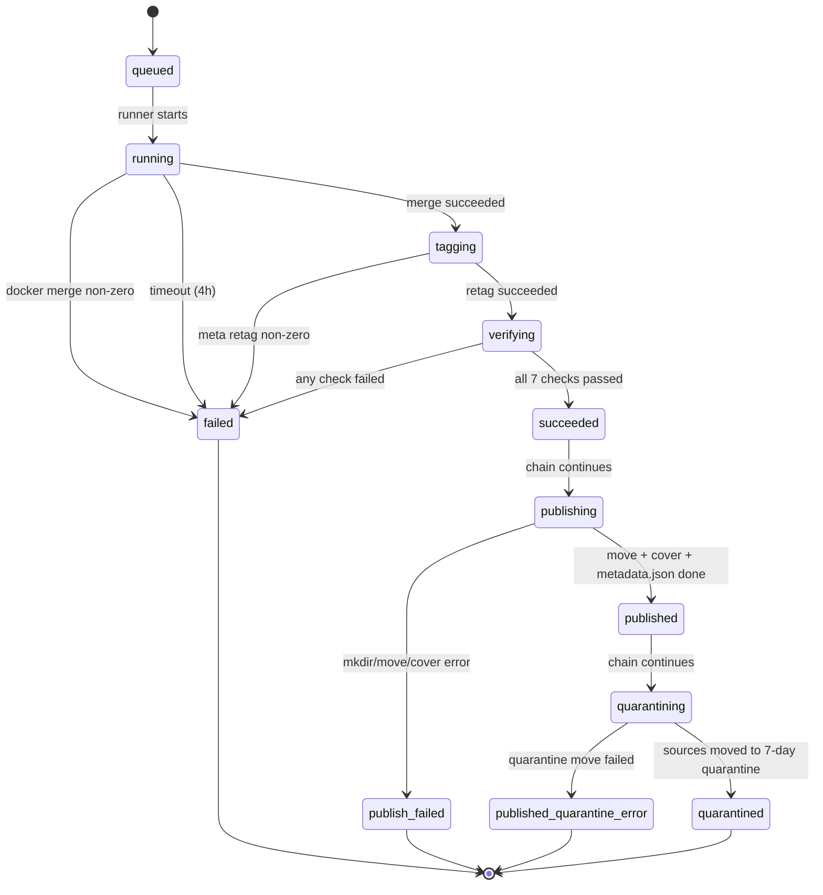
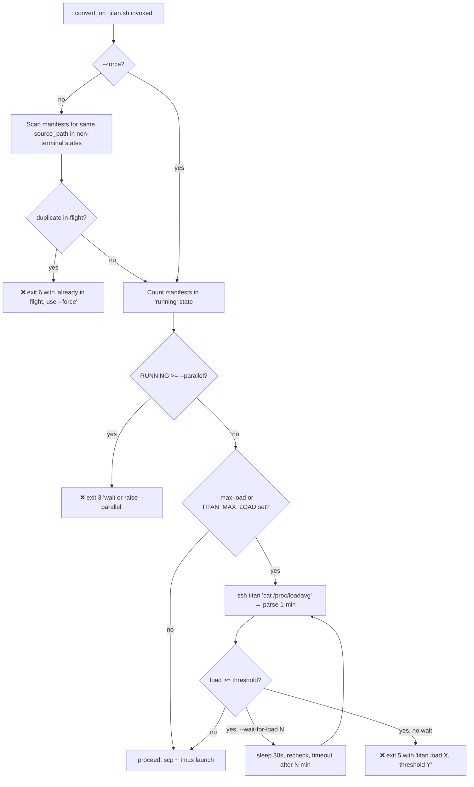

# fix(audiobook-m4b): Reliability, auto-publish chaining, and dispatch guards

**Target repo:** `~/.claude/skills/audiobook-m4b/` (this skill lives outside the Knowlune repo, at `~/.claude/skills/audiobook-m4b/`). All repo-relative paths in this plan are relative to that skill root.

## Overview

A 53-book stress test of the `audiobook-m4b` skill surfaced five concrete failure modes. 16 of 53 books published; the remainder either failed verify on a cosmetic genre-tag issue, stalled after verify because the user has to manually invoke publish, hit dispatch races from re-running the dispatcher on the same source, or overwhelmed titan's load average by launching all candidates at once. This plan fixes all five in a single pass, adjusts the remote state machine to chain convert → verify → publish → quarantine atomically, and ships the missing scripts to titan.

## Problem Frame

The skill is the user's production path for converting audiobooks into the Audiobookshelf library on `titan` (Unraid via SSH). Today's stress test exposed:

1. **Genre-tag verify failures (highest volume).** `m4b-tool merge` inherits whatever genre the first source MP3 had (`Science`, `None`, empty). `verify_output.sh` strictly requires `genre` to contain `audiobook` / `audio book` (`scripts/verify_output.sh:152-160`), so 5 of 9 real-world runs failed verify on an artifact that is otherwise correct.
2. **No auto-publish after verify.** The remote runner (`scripts/remote/run_m4b_tool.sh`) stops at the verify call and exits. The user has to manually invoke `publish_to_library.sh` + `quarantine_sources.sh` per job. Forgetting or mis-invoking these was the root cause of most "why isn't this in ABS yet?" bugs in today's batch.
3. **Missing scripts on titan.** `scripts/convert_on_titan.sh:353-358` ships only `run_m4b_tool.sh` and `verify_output.sh` to titan. `publish_to_library.sh`, `relocate_m4b.sh`, and `quarantine_sources.sh` require manual `scp` — blocks any fresh-machine use of the RELOCATE path, and blocks auto-publish entirely once that lands (bug #2).
4. **Dispatch race: no same-source guard.** `convert_on_titan.sh:86-114` counts *all* `"state": "running"` manifests against the `--parallel` ceiling but never checks whether the *same* `source_path` is already queued, running, verifying, or otherwise in-flight. Re-running `/audiobook-m4b <path>` (or running it concurrently from two terminals) blindly launches a second tmux session against the same source files. The two docker containers race on `/tmp/audiobook-m4b/<jobid>/workspace/` output paths (different jobids, so no collision there) but both read `/input` concurrently and both attempt to quarantine the same source path after chaining lands — which is unrecoverable once sources are moved.
5. **No load-aware throttle.** `--parallel N` is a ceiling on concurrent jobs, not a queue keyed to titan's actual health. Running `--parallel 9` on the 53-book batch spiked titan's 1-minute load average to ~139 (9 concurrent `docker run m4b-tool` each using `--jobs=4`).

## Requirements Trace

- **R1.** `genre=Audiobook` is written on every newly converted `.m4b` before verify runs, so the existing strict verify passes for well-formed conversions.
- **R2.** The remote runner chains `convert → verify → publish → quarantine` in a single tmux session. Failure at any step leaves prior artifacts intact (preserves the existing "sources are only deleted when every step succeeded" invariant).
- **R3.** `convert_on_titan.sh` ships all four runtime scripts to titan alongside the runner (`run_m4b_tool.sh`, `verify_output.sh`, `publish_to_library.sh`, `relocate_m4b.sh`, `quarantine_sources.sh`).
- **R4.** Re-dispatching against an already-in-flight `source_path` is refused with a clear error and a non-zero exit, unless `--force` is passed.
- **R5.** The dispatcher can be told a `--max-load N` threshold (CLI flag or `TITAN_MAX_LOAD` config). When titan's 1-minute load average exceeds the threshold, the dispatcher exits with advice by default, or waits via `--wait-for-load MINUTES`.
- **R6.** Existing tests under `tests/` continue to pass, and each new behavior has at least one offline test using the skill's established fixture patterns (`ABM4B_SKIP_REMOTE`, `ABM4B_LOCAL_MANIFEST_DIR`, `ABM4B_FFPROBE`, `ABM4B_DOCKER`).
- **R7.** SKILL.md's Stage 5–9 documentation is updated to describe the chained pipeline, the new manifest states, and the new flags.

## Scope Boundaries

- **Not changing the verify invariants.** 7 checks stay strict (file exists, streams, tags, duration ≤2s, chapter count, bitrate ≤5%, exact sample rate). Fix is upstream (write the genre tag) not downstream (relax the check).
- **Not redesigning the manifest schema.** Adding fields (`publishing_started_at`, `quarantine_error`, `force_flag_used`) and states, but the existing top-level schema stays stable so `status.sh` and `poll_job.sh` keep working.
- **Not changing the pre-probe SSH path.** Today's base64-encoded src-path fix for pre-probe is already landed and out of scope.
- **Not adding a persistent queue.** `--max-load` exits or waits — it does not enqueue jobs for later. A true queue is a separate, larger design.
- **Not shipping a remote-side `load_config.sh`.** Config values needed on titan are passed via tmux env (existing pattern at `scripts/convert_on_titan.sh:364`), not re-parsed on titan.

### Deferred to Separate Tasks

- **Persistent titan-side job queue with auto-throttle.** Will be a follow-up if `--max-load` + batch usage reveals the need.
- **Retry-from-failed-state command.** Today the user re-runs dispatch; with R4 in place they get a clean error and can decide. A proper `/audiobook-m4b retry <jobid>` is a separate feature.
- **Parallel-safe quarantine sweep.** The daily sweep already tolerates concurrent manifests. Re-visit only if R2 exposes a race.

## Context & Research

### Relevant Code and Patterns

- `scripts/convert_on_titan.sh` — local dispatcher. Lines 86-114 are the existing serial guard (counts running manifests). Lines 310-367 are the remote ship + tmux launch block. Line 364 shows the env-passing pattern (`JOB_MANIFEST_DIR=... CONVERT_JOBS=... FFPROBE_IMAGE=...`). Use this same pattern for `LIBRARY_ROOT`, `QUARANTINE_ROOT`.
- `scripts/remote/run_m4b_tool.sh` — remote runner. Lines 41-64 are the atomic `update_manifest` helper (use this unchanged for new states). Lines 182-198 are the verify block; chaining hooks in after `VRC == 0`.
- `scripts/verify_output.sh:152-160` — the genre check that's currently failing; *stays as-is* per R1.
- `scripts/publish_to_library.sh` — already guards `if [[ -z "${LIBRARY_ROOT:-}" ]]` before sourcing `load_config.sh` (lines 37-45). No remote-side config-file requirement if env is pre-set.
- `scripts/quarantine_sources.sh` — same pattern for `QUARANTINE_ROOT` (lines 31-39).
- `scripts/relocate_m4b.sh:270-294` — the existing `m4b-tool meta ... --genre=Audiobook` invocation. Mirror this exact docker args shape for Unit 1's post-merge retag.
- `tests/test_convert_dispatch.sh` — test conventions: `ABM4B_SKIP_REMOTE=1`, `ABM4B_LOCAL_MANIFEST_DIR`, fake-bin shimmed `ssh`/`scp`/`tmux` via `PATH`. Reuse.
- `tests/test_verify_checks.sh` — uses `ABM4B_FFPROBE` mock binary pattern. Reuse for genre-retag regression test.
- `tests/test_publish_and_quarantine.sh` — covers the post-convert scripts standalone. Will need new cases for chained invocation but the standalone contracts are already pinned.

### Institutional Learnings

- **Atomic manifest writes are non-negotiable.** Every state transition in the existing code uses the `tmp = path + ".tmp"; json.dump(...); os.replace(tmp, path)` pattern (see `run_m4b_tool.sh:59-62`, `verify_output.sh:257-260`, `publish_to_library.sh:161-164`). New states must follow suit — partial writes corrupt the state machine and break `status.sh`.
- **Python stdin + heredoc + pipes are a known trap** (per your memory: `feedback_python_stdin_heredoc_trap.md`). The existing code uses `python3 - "$ARG1" "$ARG2" <<'PYEOF'` consistently (argv + heredoc, no pipe). All new Python invocations in this plan follow that form.
- **Base64-encode src paths through SSH.** Just landed today for pre-probe; the same technique applies any time we shell-out with user-controlled paths across SSH. The load-check via SSH has no user input so it doesn't need this, but the quarantine-time error path might if we ever need to include a path in a remote command.
- **Fake-bin PATH shimming > mocking libraries** for these shell tests. Tests pass by prepending `TMP/bin` to `PATH` with stub `ssh`/`scp`/`tmux`/`docker` scripts that log to `$AB_FAKE_LOG`. Keep this pattern.

### External References

- `m4b-tool meta` CLI flags: `--name`, `--artist`, `--album`, `--genre`, `--year`, `--description`. Already used at `scripts/relocate_m4b.sh:280-286`. No external docs lookup needed.
- `uptime` on Linux prints `... load average: X.XX, Y.YY, Z.ZZ`. `cat /proc/loadavg` gives `X.XX Y.YY Z.ZZ N/M PID` (whitespace-separated). Either works via SSH; `/proc/loadavg` is simpler to parse with `awk '{print $1}'`.

## Key Technical Decisions

- **Genre fix: auto-retag, not relaxed verify.** Matches RE-TAG path (`relocate_m4b.sh`) which already writes `--genre=Audiobook`, and keeps verify strict. Only new cost is one docker invocation per successful merge (seconds, not minutes).
- **Chaining lives in the remote runner, not the dispatcher.** The runner already has the workspace mounted, the manifest loaded, and tmux detachment. Running publish/quarantine on the laptop after polling for `succeeded` re-introduces the "forgot to publish" failure. It also keeps the laptop-disconnect story intact.
- **New manifest states for chaining, not a flag on `succeeded`.** `succeeded` (verify passed) → `publishing` → `published` → `quarantining` → `quarantined` (terminal). This makes `status.sh` show exactly where a job is without needing new columns, and lets the duplicate-source guard (R4) block correctly on mid-chain states.
- **Publish-failure state is distinct from verify-failure.** New state `publish_failed` (output still in workspace, sources untouched). Existing `failed` remains "verify or earlier failed"; distinguishing lets `status.sh` suggest the right remediation.
- **Duplicate-source guard scans all manifests in `$JOB_MANIFEST_DIR`.** Not just running — also `queued`, `verifying`, `tagging`, `publishing`, `quarantining`. Terminal states (`succeeded` is terminal for the pre-chaining world but becomes transient now; `published`, `quarantined`, `failed`, `publish_failed`) do NOT block — they represent completed or abandoned runs.
- **`--max-load` is opt-in via CLI or config, no default.** No sensible universal default across machines. Checked once at dispatch time against `/proc/loadavg`'s 1-minute field. Wait mode polls every 30s; exit mode returns code 5 with advice.
- **Config env to pass via tmux:** in addition to today's `JOB_MANIFEST_DIR`, `CONVERT_JOBS`, `FFPROBE_IMAGE`, add `LIBRARY_ROOT`, `QUARANTINE_ROOT`. No new config file changes needed — all already exist in `config.example.yaml`.
- **`--force` flag honors `--max-load`.** `--force` bypasses the duplicate-source guard only. Load throttle is independent (user can combine `--force --max-load 20`).

## Open Questions

### Resolved During Planning

- **Q: Auto-retag or relax verify for genre?** Auto-retag. See Key Technical Decisions.
- **Q: Chaining in runner or dispatcher?** Runner. See Key Technical Decisions.
- **Q: Same-tmux chain or spawn new session per stage?** Same tmux. Log file and env already there; spawning nested sessions invites orphan processes.
- **Q: How to ship `publish`/`relocate`/`quarantine` to titan?** Extend the existing scp block in `convert_on_titan.sh`. Pass `LIBRARY_ROOT` + `QUARANTINE_ROOT` via tmux env (existing pattern). No remote `load_config.sh` shipping.
- **Q: Duplicate-source compare — exact string match or normalize?** Exact string match. `source_path` is already canonicalized by `probe_sources.sh` before it lands in the candidate JSON. Future normalizer can slot in without API break.
- **Q: Load-throttle default threshold?** None. Opt-in via CLI flag or `TITAN_MAX_LOAD` config.
- **Q: Wait-mode polling interval?** 30s, hard cap at `--wait-for-load MINUTES`. Prints one status line per poll.

### Deferred to Implementation

- Exact `uptime` vs `cat /proc/loadavg` choice (trivial; pick whichever shells cleaner).
- Exact error-message wording (write these during implementation; reference SKILL.md's existing `❌` prefix style).
- Whether the fake-bin `docker` stub for the new auto-retag test needs to distinguish `merge` vs `meta` subcommands (probably yes, trivial in practice).
- Whether `status.sh` needs any changes for the new states (likely cosmetic — verify in Unit 7).

## High-Level Technical Design

> *This illustrates the intended approach and is directional guidance for review, not implementation specification. The implementing agent should treat it as context, not code to reproduce.*

### Updated remote state machine

### Updated dispatcher decision flow

## Implementation Units

- [ ] **Unit 1: Auto-retag post-merge in the remote runner**

**Goal:** Between a successful `m4b-tool merge` and the verify call, invoke `m4b-tool meta --genre=Audiobook` on the merged output so verify's existing strict genre check passes.

**Requirements:** R1, R7

**Dependencies:** None (can land independently of others).

**Files:**
- Modify: `scripts/remote/run_m4b_tool.sh`
- Modify: `SKILL.md` (add `tagging` state to state-machine description, note the auto-retag step in Stage 5)
- Test: `tests/test_convert_dispatch.sh` (add a new case) or add a new `tests/test_auto_retag.sh`

**Approach:**
- After the existing `DOCKER_RC != 0` guard succeeds, before `update_manifest state verifying`, insert a new block that transitions to state `tagging`, runs a second `docker run sandreas/m4b-tool:latest meta` against the workspace output, and transitions to `verifying` on success or `failed` on non-zero with `reason="retag failed"` and the stderr tail captured.
- Use an array-built `DOCKER_META_ARGS` mirroring `relocate_m4b.sh:275-286`. Only `--genre=Audiobook` is required; don't rewrite title/artist/album — those were set correctly by merge from the source ID3/audnex.
- Honor `ABM4B_DOCKER` env override so tests can stub `docker`.
- No timeout wrapping needed (meta is a tag-write, sub-second). Defensive: still cap at 60s via `timeout` if available.

**Execution note:** Test-first. Add a failing test that simulates a merge producing an m4b with `genre=Science`, run the runner, expect state transitions `running → tagging → verifying → succeeded` and the fake-docker call log to show the `meta --genre=Audiobook` invocation.

**Patterns to follow:**
- `scripts/relocate_m4b.sh:270-294` — docker meta invocation shape and error-capture.
- `scripts/remote/run_m4b_tool.sh:41-64` — `update_manifest` helper.
- `tests/test_verify_checks.sh` — `ABM4B_FFPROBE` fixture pattern.

**Test scenarios:**
- Happy path: merge returns 0, meta returns 0 → manifest transitions `running → tagging → verifying`, docker log shows `meta` with `--genre=Audiobook`.
- Error path: meta returns non-zero → manifest `state=failed`, `reason=retag failed`, `stderr_tail` non-empty, verify is NOT invoked.
- Edge case: `ABM4B_DOCKER` override honored (stub receives `meta` subcommand, not `merge`).
- Integration: real verify passes against an input that had `genre=Science` before tagging (using `ABM4B_FFPROBE` fixture that reports post-retag tags).

**Verification:**
- All new test cases pass.
- Manually running a job against a source that previously failed verify on genre now succeeds.
- `status.sh` shows the new `tagging` state during the brief window.

---

- [ ] **Unit 2: Ship `publish_to_library.sh`, `relocate_m4b.sh`, `quarantine_sources.sh` to titan**

**Goal:** Extend `convert_on_titan.sh`'s remote-ship block so all runtime scripts are present on titan without manual `scp`. Unblocks the RELOCATE path for fresh machines and is a prerequisite for Unit 3's chaining.

**Requirements:** R3, R6

**Dependencies:** None (independent, can land first).

**Files:**
- Modify: `scripts/convert_on_titan.sh` (extend remote-ship block at lines 352-359)
- Test: `tests/test_convert_dispatch.sh` (assert all 5 scripts appear in the `FAKE_SCP` log)

**Approach:**
- In the `ABM4B_SKIP_REMOTE != 1` branch, add three `scp -q` calls for `publish_to_library.sh`, `relocate_m4b.sh`, `quarantine_sources.sh` into `$REMOTE_ROOT/`.
- Extend the `ssh_run "chmod +x ..."` line to include the new targets.
- Pass `LIBRARY_ROOT` and `QUARANTINE_ROOT` via the tmux env at `scripts/convert_on_titan.sh:364` so the remote scripts see them without needing a remote config file.
- Verify that `publish_to_library.sh:37-45` and `quarantine_sources.sh:31-39` already short-circuit `source load_config.sh` when env vars are pre-set (they do).

**Patterns to follow:**
- `scripts/convert_on_titan.sh:353-359` — the existing scp + chmod pattern.
- `scripts/convert_on_titan.sh:364` — the tmux env-injection pattern.

**Test scenarios:**
- Happy path: run dispatcher with fake-bin ssh/scp/tmux; `FAKE_SCP` log contains all 5 script names.
- Happy path: `FAKE_TMUX` log's launch command includes `LIBRARY_ROOT=...` and `QUARANTINE_ROOT=...`.
- Edge case: `ABM4B_SKIP_REMOTE=1` still skips scp entirely (existing test should keep passing).

**Verification:**
- Fresh titan can execute the RELOCATE path without any manual scp. (Manual verification on titan.)
- Existing `test_convert_dispatch.sh` still passes; new assertions pass.

---

- [ ] **Unit 3: Chain publish + quarantine inside the remote runner**

**Goal:** After verify passes, the remote runner invokes publish and quarantine in sequence within the same tmux session. Failure at any step preserves prior artifacts per the existing "sources only deleted on full success" invariant.

**Requirements:** R2, R7

**Dependencies:** Unit 2 (scripts must exist on titan).

**Files:**
- Modify: `scripts/remote/run_m4b_tool.sh` (after the verify block)
- Modify: `SKILL.md` (Stage 5 + Stage 8 + Stage 9: document chained flow, new states, new failure rows in the failure table)
- Test: Extend `tests/test_convert_dispatch.sh` or add `tests/test_chain.sh` covering runner-level orchestration with stubs

**Approach:**
- After `verify_output.sh` returns 0 (state became `succeeded`), the runner transitions to `publishing`, invokes `bash $REMOTE_ROOT/publish_to_library.sh $MANIFEST`, captures exit code.
  - On success: manifest transitions to `published` (the publish script already writes `state=published`).
  - On non-zero: transition to `publish_failed`, capture stderr_tail, exit 1.
- After `published`, transition to `quarantining`, invoke `bash $REMOTE_ROOT/quarantine_sources.sh $MANIFEST`.
  - On success: the quarantine script writes `quarantined_path`; runner transitions manifest to `quarantined` (new terminal state).
  - On non-zero: transition to `published_quarantine_error`, capture stderr_tail, exit 0 (library is intact — this is a partial failure, not a hard fail; operator intervention needed but data isn't at risk).
- Feed the runner the expected env at invocation time (Unit 2 adds `LIBRARY_ROOT`, `QUARANTINE_ROOT` to the tmux launch).
- Keep the pre-existing "exit 1 on verify fail" contract unchanged so `test_verify_checks.sh` still passes.

**Execution note:** Test-first. Write a test that drives the runner end-to-end with fake `docker`, fake `ffprobe`, and fixture manifest/source, and asserts the full state sequence `queued → running → tagging → verifying → succeeded → publishing → published → quarantining → quarantined`.

**Patterns to follow:**
- `scripts/remote/run_m4b_tool.sh:41-64` — `update_manifest` for every state transition.
- `scripts/publish_to_library.sh:156-164` — the script already sets `state=published` atomically; don't double-write.
- `scripts/quarantine_sources.sh:100-105` — same for `quarantined_path`.

**Test scenarios:**
- Happy path: merge OK, retag OK, verify OK, publish OK, quarantine OK → final state `quarantined`, target file present in fake library root, source moved to fake quarantine.
- Error path (publish fails): merge/retag/verify OK, publish non-zero → state `publish_failed`, workspace m4b still present, source still at original path, no quarantine invoked.
- Error path (quarantine fails): through publish OK, quarantine non-zero → state `published_quarantine_error`, target file still in library, source still at original path, runner exits 0 (not 1 — library is intact).
- Integration: across the full chain, manifest's `stderr_tail` preserves any intermediate error messages and the atomic-write invariant holds (no `.tmp` leftovers in the test manifest dir).

**Verification:**
- End-to-end integration test passes.
- `status.sh` surfaces the new states without modification (or any needed changes are cosmetic and tracked in Unit 7).
- Running the full chain on a real titan with one test audiobook lands a published m4b + quarantined source in one dispatch.

---

- [ ] **Unit 4: Duplicate-source dispatch guard**

**Goal:** Before dispatch, refuse to start a new job against a `source_path` that is already queued, running, verifying, tagging, publishing, or quarantining (terminal states don't block). `--force` bypasses.

**Requirements:** R4, R6

**Dependencies:** None (but conceptually compatible with Unit 3's new states).

**Files:**
- Modify: `scripts/convert_on_titan.sh` (new guard above the existing `count_running` block)
- Test: `tests/test_convert_dispatch.sh` (new cases for duplicate block and `--force` bypass)

**Approach:**
- New helper `has_inflight_for_source <path>` that lists manifests in `$JOB_MANIFEST_DIR` (via SSH or `ABM4B_LOCAL_MANIFEST_DIR` per the existing pattern at lines 86-101) and returns 0 if any manifest has both `"source_path": "<exact path>"` and `"state"` in the non-terminal set.
- Non-terminal states for this guard: `queued`, `running`, `tagging`, `verifying`, `publishing`, `quarantining`.
- If a match is found and `--force` was NOT passed, exit code 6 (new) with a message naming the existing jobid and its state. Example: `❌ source already in flight: jobid=20260423-140052-abcd1234 state=verifying — wait, or pass --force if you know what you're doing.`
- `--force` adds `force_flag_used: true` to the new manifest for audit.
- Use Python to parse the manifests (already the pattern elsewhere) — grepping for state+source pairs in JSON is fragile.
- Run before the existing `count_running` parallel check (different concern, both guards apply).

**Execution note:** Test-first. Seed `ABM4B_LOCAL_MANIFEST_DIR` with a fixture manifest `state=verifying source_path=/x`, dispatch a new candidate with the same source_path, assert exit 6 and clear stderr.

**Patterns to follow:**
- `scripts/convert_on_titan.sh:86-101` — manifest-scanning helper shape (SSH vs local-dir branch).
- Python argv+heredoc for parsing (avoid stdin/pipe per the institutional learning).

**Test scenarios:**
- Happy path: no matching manifest → dispatch proceeds normally.
- Error path: matching manifest in `running` state → exit 6, stderr names the jobid and state, no new manifest written.
- Error path: same check for `verifying`, `tagging`, `publishing`, `quarantining` states.
- Edge case: matching manifest in `quarantined` (terminal) → dispatch proceeds.
- Edge case: matching manifest in `failed` (terminal) → dispatch proceeds.
- Edge case: `--force` with duplicate in-flight → dispatch proceeds, new manifest has `force_flag_used: true`.
- Edge case: different source_path but everything else identical → dispatch proceeds.

**Verification:**
- Cannot re-dispatch against an in-flight source; error message is actionable.
- Can still retry a previously-failed source (no blocking on terminal states).
- `--force` workflow is explicit but available.

---

- [ ] **Unit 5: Load-aware throttle (`--max-load`, `--wait-for-load`)**

**Goal:** Before dispatch, optionally check titan's 1-minute load average via SSH. If it exceeds the threshold, exit with advice (default) or wait-and-retry up to `--wait-for-load MINUTES`.

**Requirements:** R5, R6

**Dependencies:** None.

**Files:**
- Modify: `scripts/convert_on_titan.sh` (arg parsing + new check block)
- Modify: `scripts/load_config.sh` (optional — export `TITAN_MAX_LOAD` if present in config)
- Modify: `config.example.yaml` (add commented `titan_max_load: 20` example)
- Test: `tests/test_convert_dispatch.sh` (fake-bin `ssh` that returns canned load values)

**Approach:**
- Parse two new flags in `convert_on_titan.sh`: `--max-load N` (int), `--wait-for-load MINUTES` (int, default 0 meaning "exit immediately if threshold exceeded"). Env/config `TITAN_MAX_LOAD` sets the default; CLI flag overrides.
- Check runs after the duplicate-source guard (Unit 4) and after the `count_running` parallel check — all three guards apply in sequence.
- SSH to titan, read `/proc/loadavg`, parse the first whitespace-separated field as a float (`awk '{print $1}'`). Local-test mode (`ABM4B_LOCAL_MANIFEST_DIR` set or new `ABM4B_FAKE_LOAD` env var) reads the value from the env var instead.
- If load ≥ threshold and `--wait-for-load` is 0 → exit code 5 with advice.
- If load ≥ threshold and `--wait-for-load N` given → print one status line, sleep 30s, re-check, up to N minutes total. On timeout → same exit 5. On success mid-wait → continue to dispatch.
- Every 30s the wait loop prints `[load] titan 1-min=X.XX, threshold=Y, waited=Zs` to stderr so batch runs log progress.

**Execution note:** Test-first. Fake `ssh` returns `1.50 0.80 0.40 2/500 1234` for the "low load" case and `25.0 20.0 15.0 2/500 1234` for "high load". Assert exit 5 and correct stderr content. Then repeat with `--wait-for-load 1` and a fake ssh that returns high-then-low.

**Patterns to follow:**
- `scripts/convert_on_titan.sh:80-81` — `ssh_run` helper.
- `scripts/load_config.sh` — config export pattern; add `TITAN_MAX_LOAD` export.
- `tests/test_convert_dispatch.sh` fake-bin pattern — stub `ssh` to accept arbitrary commands.

**Test scenarios:**
- Happy path: no `--max-load` and no `TITAN_MAX_LOAD` → no check, dispatch proceeds (regression guard for existing behavior).
- Happy path: `--max-load 20`, titan load 1.5 → dispatch proceeds.
- Error path: `--max-load 20`, titan load 25 → exit 5, stderr shows load and threshold.
- Error path: `--max-load 20 --wait-for-load 1`, load always 25 → exit 5 after ~1 minute of polling (test shortens sleep via env if needed).
- Edge case: `TITAN_MAX_LOAD=20` env, no CLI flag → same behavior.
- Edge case: CLI `--max-load 50` overrides env `TITAN_MAX_LOAD=20`.
- Edge case: `--wait-for-load 1`, load=25 then load=5 → dispatch proceeds after first successful re-check.
- Edge case: malformed `/proc/loadavg` response → exit with a different code (not 0), clear error naming the parse failure.

**Verification:**
- Running with `--max-load 10` against real titan under load correctly refuses to dispatch.
- `--wait-for-load 5` polls and proceeds when load drops.
- No regression for existing dispatch flow with the flags unset.

---

- [ ] **Unit 6: Update SKILL.md, README, and config.example.yaml**

**Goal:** Reflect the five behavior changes in skill-facing documentation so users and future maintainers know the new states, flags, and defaults.

**Requirements:** R7

**Dependencies:** Units 1-5 (all behavior changes documented together is cheaper than per-unit doc edits).

**Files:**
- Modify: `SKILL.md` — Stage 5 (add auto-retag), Stage 6/7/8/9 (chained flow, new states), Failure-behavior table (add `publish_failed`, `published_quarantine_error`), Flags table (add `--force`, `--max-load`, `--wait-for-load`).
- Modify: `README.md` — update usage examples if they mention manual publish.
- Modify: `config.example.yaml` — add commented `titan_max_load` example.

**Approach:**
- State machine diagram / bullets updated to include `tagging`, `publishing`, `publish_failed`, `published`, `quarantining`, `quarantined`, `published_quarantine_error`.
- New failure rows describe what's preserved on each failure mode.
- Flags table gets the three new entries with defaults.
- No test needed (pure docs).

**Test scenarios:** Test expectation: none — documentation-only unit with no behavioral change.

**Verification:**
- `grep -n "tagging\|publishing\|quarantining" SKILL.md` shows the new states documented.
- New flags appear in the flags table.

---

- [ ] **Unit 7: Verify `status.sh` and `poll_job.sh` handle the new states gracefully**

**Goal:** Ensure the existing job-status surfaces don't break when manifests show new states. Cosmetic-only if possible; actual logic changes only if current code throws or misreports.

**Requirements:** R6

**Dependencies:** Units 1-3 (new states exist).

**Files:**
- Read: `scripts/status.sh`, `scripts/poll_job.sh` (verify current behavior).
- Modify (only if needed): `scripts/status.sh`, `scripts/poll_job.sh`.
- Test: `tests/test_status_and_sweep.sh` (extend with fixture manifests in each new state).

**Approach:**
- Start by reading the two scripts. Most likely each state just prints through as a string column; no logic tied to specific state names except "terminal" detection.
- If `poll_job.sh` has a hardcoded list of terminal states (`succeeded|failed`), extend to `succeeded|published|quarantined|failed|publish_failed|published_quarantine_error`. Otherwise: no change.
- If there are no changes needed, the unit lands as "verified, no code change required" with a fixture-based test confirming the new states render.

**Test scenarios:**
- Happy path: fixture manifest in `tagging` state → `status.sh` prints it as "tagging" in the state column.
- Happy path: fixture manifest in `published` state → `poll_job.sh` treats it as terminal and exits cleanly.
- Edge case: fixture manifest in `published_quarantine_error` → `status.sh` prints the state, doesn't crash.

**Verification:**
- `test_status_and_sweep.sh` passes with the new fixtures.

## System-Wide Impact

- **Interaction graph:** Dispatcher (`convert_on_titan.sh`) now gates on 3 concerns (duplicate source, parallel count, titan load) before SCP+tmux. Runner (`run_m4b_tool.sh`) now drives a longer state machine that ends with sources moved. `poll_job.sh` and `status.sh` consume the same manifest and must tolerate new state strings.
- **Error propagation:** Runner failures must update manifest state atomically *before* exiting the tmux session, so `poll_job.sh` sees the terminal state without racing. Dispatcher failures (new guards) exit before writing any manifest — no cleanup needed.
- **State lifecycle risks:** The auto-publish chain deletes sources via quarantine. If the runner crashes between `published` and `quarantining`, sources remain untouched (good — matches the "sources only deleted when every step succeeded" invariant). If the runner crashes *between* quarantine move and manifest-state-write, sources are in quarantine but manifest shows `quarantining` — `status.sh` will still flag it and user can manually transition. Acceptable.
- **API surface parity:** `--force`, `--max-load`, `--wait-for-load` are new dispatcher flags. Users invoking the skill via batch mode or scripts must opt in; no existing workflow breaks.
- **Integration coverage:** Unit 3's end-to-end test (full chain with stubs) is the primary integration safety net. It exercises the interaction between runner, verify, publish, and quarantine scripts via shell — not just unit-mocked Python.
- **Unchanged invariants:**
  - *Sources are only deleted (via quarantine) when every step succeeded.* Preserved: quarantine runs only after publish succeeds.
  - *Conversions never downgrade audio.* Preserved: Unit 1 only writes metadata tags, not audio streams. Verify's 7 invariants unchanged.
  - *Verify runs against a workspace copy, never the source.* Preserved.
  - *Manifest writes are atomic.* Preserved: all new state transitions use the existing `tmp + os.replace` pattern.
  - *Chapter count, bitrate tolerance, sample rate exactness.* All verify checks unchanged.

## Risks & Dependencies

| Risk | Mitigation |
|------|------------|
| `m4b-tool meta` subtly re-writes chapter data, breaking the chapter-count verify check. | Mirror the existing `relocate_m4b.sh` invocation shape verbatim — `relocate_m4b.sh` has been in production for retag cases and preserves chapters. Unit 1's integration test asserts chapter count post-retag is unchanged. |
| Chained runner gets stuck mid-chain (e.g., tmux dies after publish but before quarantine); manifest is half-way. | Manifest atomic writes + intermediate states make this recoverable: `status.sh` shows `publishing` or `quarantining` mid-flight; operator can manually transition or re-run a resume script (future work). No data at risk — sources still at original path until quarantine step commits. |
| Duplicate-source guard false-positive: user sanely retries after a `failed` state but a stale manifest somehow has `state=verifying`. | Terminal states (`failed`, `publish_failed`, `published_quarantine_error`, `quarantined`, `published`) do NOT block. Stale non-terminal manifests are a pre-existing concern (runner crash before state update) and remain out of scope — `--force` is the escape hatch. |
| `--max-load` SSH call slows down dispatch. | One SSH round-trip, sub-second. Only runs when the flag is set. Wait mode polls every 30s with logged progress. |
| `/proc/loadavg` parse fails on a non-Linux titan or permissions issue. | Test scenario covers malformed response → clear error, non-zero exit, no dispatch. Falls back to documenting the requirement (titan is Unraid = Linux, always has `/proc/loadavg`). |
| Unit 2 ships scripts that expect `load_config.sh` to be a sibling; on titan, only the scripts are shipped. | `publish_to_library.sh:37-45` and `quarantine_sources.sh:31-39` already short-circuit the `source load_config.sh` call when env vars are pre-set. Unit 2 explicitly passes `LIBRARY_ROOT` + `QUARANTINE_ROOT` via tmux env. No remote `load_config.sh` shipping needed. Test assertion in Unit 2 covers this. |
| Tests and production diverge because tests rely on `ABM4B_*` fixtures. | Existing test suite already depends on these; this plan extends the pattern, doesn't introduce a new fixture system. Each new unit has at least one fixture-driven test. |

## Documentation / Operational Notes

- **Rollback:** Each unit lands in a separate commit. Reverting Unit 3 (chaining) leaves Units 1, 2, 4, 5 in place — all backward-compatible. Unit 1 is the minimal production win (fixes today's 5-of-9 failure rate).
- **Operational note — mid-chain crash recovery:** If the tmux session dies between `published` and `quarantining`, the operator runs `bash scripts/quarantine_sources.sh <manifest.json>` on titan manually. Document this in SKILL.md's Failure-behavior table.
- **Monitoring:** `status.sh` is the primary surface. No external monitoring changes needed. Consider logging the full state sequence to `$JOB_MANIFEST_DIR/jobs-history.jsonl` at terminal state — optional follow-up.
- **Rollout order:** Land Units 2, 4, 5 first (pure dispatcher concerns, no manifest schema change). Then Unit 1 (additive new state `tagging` but doesn't break existing `status.sh`). Then Unit 3 (the big chaining change). Then Unit 6 (docs). Then Unit 7 (status verification).

## Sources & References

- Related code: `~/.claude/skills/audiobook-m4b/scripts/convert_on_titan.sh`, `scripts/remote/run_m4b_tool.sh`, `scripts/verify_output.sh`, `scripts/publish_to_library.sh`, `scripts/quarantine_sources.sh`, `scripts/relocate_m4b.sh`
- Related tests: `tests/test_convert_dispatch.sh`, `tests/test_verify_checks.sh`, `tests/test_publish_and_quarantine.sh`, `tests/test_status_and_sweep.sh`
- SKILL.md (in the skill repo): pipeline diagram, stage-by-stage narrative
- Institutional learning (user memory): `feedback_python_stdin_heredoc_trap.md` — use argv+heredoc, never pipe into Python.
- Stress-test context: 53 audiobooks processed 2026-04-23, 16 published, remainder surfaced the five bugs above.
