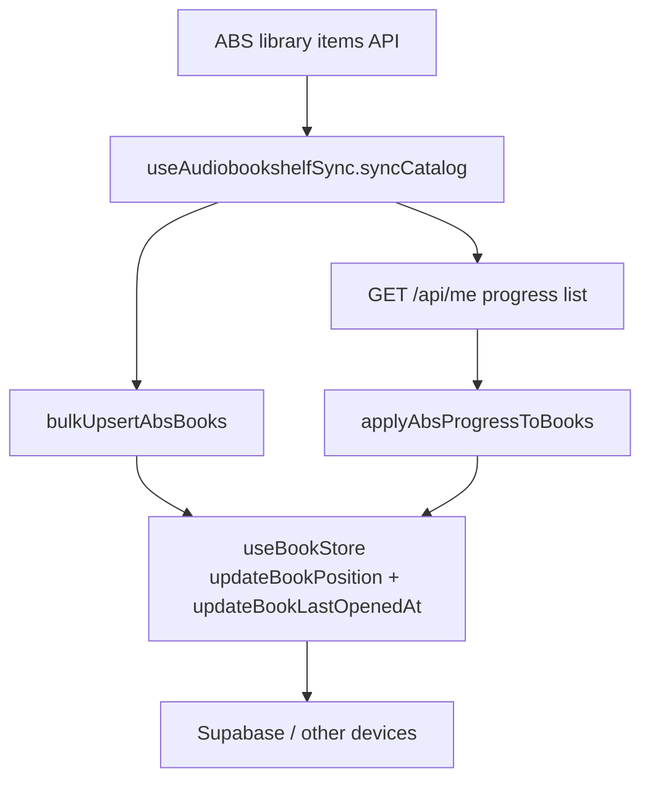

# fix: ABS inbound progress sync (library + Supabase)

## Overview

Knowlune shows **0%** for Audiobookshelf (ABS) titles that already have progress in the ABS app because inbound progress is only applied when the in-app player mounts (`useAudiobookshelfProgressSync`, `useAudiobookshelfSocket`). Catalog sync never loads user progress from ABS. Additionally, when ABS progress is applied in those hooks, writes go **directly to Dexie**, bypassing `syncableWrite`, so other Knowlune devices never see ABS-originated position until the user plays locally again.

This plan adds a **bulk progress fetch** after catalog sync (and on a throttled visibility refresh), merges with existing **latest-timestamp-wins** semantics, and routes all ABS-derived local updates through **`useBookStore`** so positions flow through the same sync pipeline as EPUB/audiobook saves.

---

## Problem Frame

- **User-visible:** Library cards and the audiobook player open at **0:00** while ABS shows real progress (e.g. cover bar ~35–40% on ABS, Knowlune player at 0:00).
- **Technical:** `useAudiobookshelfSync` maps catalog items with `progress: 0` and never calls a user-progress endpoint. Player-only hooks fetch per-item progress but do not use `syncableWrite` for the inbound path.

---

## Requirements Trace

- **R1.** After ABS catalog sync (or visibility refresh), local `Book` records for remote ABS items reflect **ABS user progress** when ABS is newer or local has no meaningful progress, without blocking sync on failure.
- **R2.** Inbound ABS progress updates must **persist via `syncableWrite`** (through existing `useBookStore` APIs) so Supabase and other devices converge.
- **R3.** Re-running catalog sync must **not wipe** progress already merged from ABS (`bulkUpsertAbsBooks` merge behavior preserved).
- **R4.** **LWW** between `AbsProgress.lastUpdate` and local `lastOpenedAt` / position must match existing `resolveConflict` intent from `useAudiobookshelfProgressSync`.
- **R5.** Failures (network, 404, malformed body) are **best-effort**: log, no user toast, catalog sync still succeeds.

---

## Scope Boundaries

- **In scope:** ABS → Knowlune progress hydration at sync + focus; aligning player/socket inbound writes with `useBookStore` + `syncableWrite`.
- **Out of scope:** Prior review items (`SyncableRecord` casts, `contentProgress` monotonic merge semantics) — separate work.
- **Out of scope:** New E2E suites (existing MSW patterns in `tests/e2e/audiobookshelf/` may be extended later; this plan is unit-test focused).

### Deferred to Follow-Up Work

- Optional **single** `syncableWrite` for position + `lastOpenedAt` from ABS timestamp (today requires `updateBookPosition` then `updateBookLastOpenedAt` because `updateBookPosition` stamps `lastOpenedAt` to client `now` — see Key Technical Decisions).

---

## Context & Research

### Relevant Code and Patterns

- Catalog mapping hard-codes zero progress: `src/app/hooks/useAudiobookshelfSync.ts` (`mapAbsItemToBook`, `progress: 0`).
- Per-item progress: `src/services/AudiobookshelfService.ts` — `fetchProgress` (`GET /api/me/progress/{itemId}`).
- Player inbound: `src/app/hooks/useAudiobookshelfProgressSync.ts` (fetch-on-open, `db.books.update` on ABS win).
- Socket inbound: `src/app/hooks/useAudiobookshelfSocket.ts` (`db.books.update`).
- Merge on re-sync: `src/stores/useBookStore.ts` — `bulkUpsertAbsBooks` preserves `progress`, `currentPosition`, `lastOpenedAt` for matching `absServerId` + `absItemId`.
- Position + sync pipeline: `src/stores/useBookStore.ts` — `updateBookPosition`, `updateBookLastOpenedAt` (both use `syncableWrite('books', 'put', …)` when Dexie row exists).

### Institutional Learnings

- Epic 102 trace docs reference `GET`/`PATCH /api/me/progress/{id}` as the wired contract; bulk user progress should be confirmed against the ABS version you run in dev (`GET /api/me` shape may vary slightly by server version — treat field path as **implementation-time verification**).

### External References

- Audiobookshelf server: user object and `mediaProgress` (or equivalent) from `GET /api/me` — confirm field names in [Audiobookshelf API docs](https://github.com/advplyr/audiobookshelf) or live response during implementation.

---

## Key Technical Decisions

- **Bulk endpoint:** Prefer **`GET /api/me`** and parse the progress list (e.g. `mediaProgress`) into `AbsProgress[]`-compatible objects keyed by `libraryItemId`, rather than N per-item `fetchProgress` calls (rate limits, latency).
- **Conflict resolution:** Reuse **`resolveConflict`** from `src/app/hooks/useAudiobookshelfProgressSync.ts` (export it for the sync hook / tests). Same semantics as fetch-on-open.
- **Store write order:** Call **`updateBookPosition(bookId, position, progressPct)`** then **`updateBookLastOpenedAt(bookId, new Date(absProg.lastUpdate).toISOString())`**. Rationale: `updateBookPosition` always sets `lastOpenedAt` to client `now` for its own `syncableWrite` payload; the follow-up call corrects `lastOpenedAt` to ABS’s clock for LWW and triggers a second `syncableWrite`. Acceptable for v1; defer single-write optimization.
- **Visibility refresh:** Throttled **`document.visibilitychange`** (e.g. >30s since last per-server progress pull) calling **only** progress apply — not full catalog pagination.

---

## Open Questions

### Resolved During Planning

- **Why not only `updateBookPosition`?** It does not accept an ABS-derived `lastOpenedAt`; second call required (see above).

### Deferred to Implementation

- **Exact JSON path** under `GET /api/me` for the progress array on your ABS version — implementer verifies once with a real or mocked response and normalizes to `AbsProgress`.

---

## High-Level Technical Design

> *This illustrates the intended approach and is directional guidance for review, not implementation specification. The implementing agent should treat it as context, not code to reproduce.*

---

## Implementation Units

- [ ] **U1. Service: bulk progress fetch**

**Goal:** One call returns all user media progress for mapping.

**Requirements:** R1, R5

**Dependencies:** None

**Files:**

- Modify: `src/services/AudiobookshelfService.ts`
- Test: `src/services/__tests__/AudiobookshelfService.test.ts`

**Approach:**

- Add `fetchAllProgress(url, apiKey)` returning `AbsResult<AbsProgress[]>` using `GET /api/me`, extract progress entries, normalize `libraryItemId` / `lastUpdate` / `currentTime` into the existing `AbsProgress` shape where possible.
- On non-fatal empty/missing arrays or 404, return `{ ok: true, data: [] }`.

**Patterns to follow:** `fetchProgress` / `absApiFetch` error handling in the same module.

**Test scenarios:**

- Happy path: mocked `GET /api/me` body with progress entries → parsed non-empty array with expected `libraryItemId` and `currentTime`.
- Edge case: missing `mediaProgress` (or equivalent) field → `ok: true`, `data: []`.
- Error path: HTTP 401/500 from `absApiFetch` → propagated as `ok: false` per existing `AbsResult` conventions.

**Verification:** New tests green; no regression in existing Audiobookshelf service tests.

---

- [ ] **U2. Hook: apply progress after catalog sync**

**Goal:** After books exist locally, overlay ABS progress using LWW.

**Requirements:** R1, R3, R4, R5

**Dependencies:** U1

**Files:**

- Modify: `src/app/hooks/useAudiobookshelfSync.ts`
- Modify: `src/app/hooks/useAudiobookshelfProgressSync.ts` (export `resolveConflict` if not already usable from sync hook)
- Test: new `src/app/hooks/__tests__/useAudiobookshelfSync.progress.test.ts` (or colocated test file following repo conventions)

**Approach:**

- Implement `applyAbsProgressToBooks(server, apiKey)` (module-private or exported for tests): `fetchAllProgress` → map by item id → for each matching `Book` in `useBookStore.getState().books`, run `resolveConflict`; on `use-abs`, compute `progressPct` from `totalDuration` or `absProgress.progress`, then `updateBookPosition` + `updateBookLastOpenedAt` as in Key Technical Decisions.
- Invoke from `syncCatalog` immediately after `bulkUpsertAbsBooks` succeeds.
- Swallow errors with `console.error`; never toast.

**Patterns to follow:** Existing `syncCatalog` structure and credential resolution via `getAbsApiKey`.

**Test scenarios:**

- Happy path: store seeded with ABS book; mocked `fetchAllProgress` returns newer progress → `updateBookPosition` and `updateBookLastOpenedAt` spied with expected args.
- Edge case: local `lastOpenedAt` newer than ABS `lastUpdate` → no store update.
- Edge case: empty progress list → no store calls.
- Integration-style (mocked store): book absent from map → skipped.

**Verification:** Unit tests pass; manual smoke: sync ABS library, open Knowlune library without playing — progress bar non-zero when ABS had progress.

---

- [ ] **U3. Player + socket: route inbound ABS wins through store**

**Goal:** Remove parallel Dexie-only writes for ABS-originated position.

**Requirements:** R2, R4

**Dependencies:** U2 (can parallelize with U2 after U1 if careful; sequencing U2 after U1 is enough)

**Files:**

- Modify: `src/app/hooks/useAudiobookshelfProgressSync.ts`
- Modify: `src/app/hooks/useAudiobookshelfSocket.ts`
- Test: `src/app/hooks/__tests__/useAudiobookshelfProgressSync.test.tsx` (or `.ts`)

**Approach:**

- Replace optimistic `setState` + `db.books.update` blocks on ABS win with `updateBookPosition` + `updateBookLastOpenedAt` (same order as U2).
- Keep `seekTo` and push-to-ABS branches unchanged except where they share the same write path.

**Test scenarios:**

- Happy path: mocked `fetchProgress` returns ABS-ahead → assert `useBookStore` methods called, **not** `db.books.update`.
- Edge case: preserve existing push-on-pause behavior (no new toasts).

**Verification:** Tests updated; inbound progress still seeks audio in player.

---

- [ ] **U4. Visibility throttled refresh**

**Goal:** Long-lived sessions pick up ABS-app progress without full re-sync.

**Requirements:** R1, R5

**Dependencies:** U2

**Files:**

- Modify: `src/app/hooks/useAudiobookshelfSync.ts` (preferred) **or** `src/app/pages/Library.tsx` if lifecycle must live in page
- Test: same test file as U2 or page test if registered on `Library`

**Approach:**

- On `document.visibilitychange` → `visibilityState === 'visible'`, for each connected ABS server with resolved API key, call `applyAbsProgressToBooks` if last run older than threshold (per-server timestamp in ref or module state).
- Debounce / guard against overlapping calls.

**Test scenarios:**

- Happy path: fire visibility event twice within threshold → single apply (spy count).
- Edge path: no API key → skip without error.

**Verification:** Unit test with `vi.spyOn(document, …)` or jsdom event; no full catalog refetch asserted.

---

- [ ] **U5. Test consolidation and regressions**

**Goal:** Lock behavior and prevent drift.

**Requirements:** R1–R5

**Dependencies:** U1–U4

**Files:**

- Tests listed under U1–U4; run focused `npm test` on touched suites.

**Test scenarios:** As per units; add regression case: `bulkUpsertAbsBooks` merge still preserves progress when server returns items with `progress: 0` in mapper (existing behavior — optional characterization test if not already covered).

**Verification:** All listed unit tests pass.

---

## System-Wide Impact

- **Interaction graph:** `useBookStore` subscribers (library, continue listening, `BookReader`) receive updates from progress apply without opening the player.
- **Error propagation:** Progress apply failures must not flip server status to offline/auth-failed.
- **State lifecycle risks:** Double `syncableWrite` per ABS adoption (position then `lastOpenedAt`); acceptable per Key Technical Decisions.
- **Unchanged invariants:** `bulkUpsertAbsBooks` remains direct Dexie bulk (per E94 comment); only **progress overlay** and **player/socket** paths gain `syncableWrite` parity.

---

## Risks & Dependencies

| Risk | Mitigation |
|------|------------|
| `GET /api/me` shape differs by ABS version | Verify in implementation; defensive parsing; empty array fallback |
| Extra sync traffic after catalog sync | Single bulk HTTP call per sync; throttle visibility refresh |
| Rate limits (429) on `/api/me` | Same silent failure + log as other ABS best-effort paths |

---

## Documentation / Operational Notes

- None required for merge; optional one-line in `CLAUDE.md` only if support asks where ABS library progress is sourced.

---

## Sources & References

- **Origin note:** Content derived from the user-supplied Cursor plan *fix abs inbound progress sync* (portable summary in this doc).
- Related code: `src/app/hooks/useAudiobookshelfSync.ts`, `src/app/hooks/useAudiobookshelfProgressSync.ts`, `src/app/hooks/useAudiobookshelfSocket.ts`, `src/services/AudiobookshelfService.ts`, `src/stores/useBookStore.ts`
- Related plan: `docs/plans/2026-04-27-003-fix-progress-position-sync-plan.md` (Supabase routing for local saves; this plan completes ABS → local → remote for inbound ABS)
