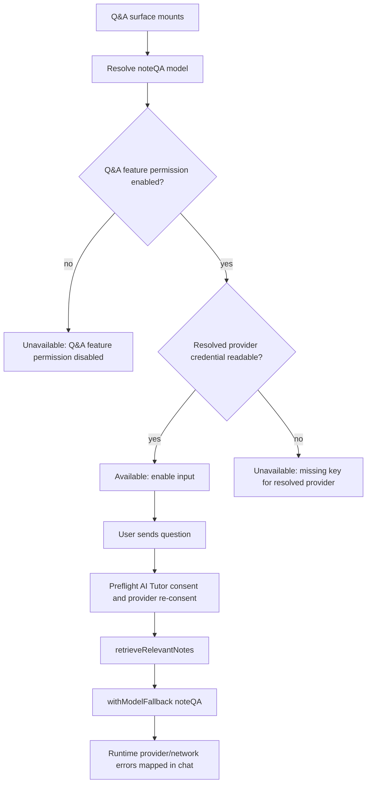

# fix: Restore Courses Ask AI availability

## Overview

The Courses reader Ask AI panel currently reports "AI features unavailable" even when Settings shows Google Gemini connected and Q&A from Notes enabled. Static research points to a stale availability contract: the Q&A UI gates on the legacy global `connectionStatus`, while the current Settings flow stores per-provider Gemini credentials in `providerKeys` and per-feature model choices in `featureModels.noteQA`.

This fix should make Q&A availability feature-aware. The reader and global Q&A surfaces should check the resolved `noteQA` provider, the feature permission, and the credential for that resolved provider before deciding whether to enable chat.

---

## Problem Frame

The user has already configured Settings, selected Google Gemini, enabled Q&A from Notes, and sees Gemini as connected. The Courses page still blocks Ask AI before the feature-aware Q&A generation path can run.

The current implementation has two different truths:

- Settings uses `ProviderKeyAccordion` and `FeatureModelOverridePanel` to manage provider-specific keys and per-feature model overrides.
- `QAChatPanel` and `ChatQA` still call `isAIAvailable()`, which only returns true when `ai-configuration.connectionStatus === 'connected'`.

The likely result is that a valid Gemini key in `providerKeys.gemini` does not satisfy the legacy global connection gate.

---

## Requirements Trace

- R1. If `noteQA` resolves to Gemini and Gemini has a readable key, Ask AI must be available even when legacy `connectionStatus` remains `unconfigured`.
- R2. If Q&A from Notes is disabled, Ask AI must stay unavailable and explain that the feature permission is off.
- R3. If `noteQA` resolves to a provider without a usable credential, Ask AI must stay unavailable and name the missing provider instead of giving a generic settings error.
- R4. Existing legacy single-provider configurations must continue to work when the resolved feature provider matches the global provider.
- R5. The change must not broaden `isAIAvailable()` for unrelated AI consumers without auditing them.
- R6. The reader Ask AI panel and the global Chat Q&A page must use the same availability semantics.
- R7. Regression coverage must include the exact Gemini-connected Settings state shown in the screenshots.

---

## Scope Boundaries

- Do not redesign the Q&A chat experience or change the RAG retrieval/generation behavior.
- Do not migrate all AI features away from `isAIAvailable()` in this plan.
- Do not change provider validation, model discovery, Vault storage, or Supabase Edge Function behavior unless implementation proves the availability helper needs a narrow adapter.
- Do not store or expose plaintext API keys in tests, logs, or UI.
- Do not require a live Gemini network call for the UI availability gate; the gate should verify that the resolved Q&A provider has a credential path the send flow can actually use.
- Do not claim Vault-only credentials are available unless the same implementation also ensures the send path can read those Vault credentials. A local encrypted key, legacy single key, or Ollama server URL is sufficient for this bug fix; Vault-only parity can be split into follow-up work if it is not already supported by the runtime path.

---

## Context & Research

### Relevant Code and Patterns

- `src/app/components/figma/QAChatPanel.tsx` renders the reader Ask AI popover/sheet and disables input using `isAIAvailable()`.
- `src/app/pages/ChatQA.tsx` uses the same global availability check for the standalone Q&A page.
- `src/lib/aiConfiguration.ts` owns `connectionStatus`, `providerKeys`, `featureModels`, `resolveFeatureModel()`, `getDecryptedApiKeyForProvider()`, and `isFeatureEnabled()`.
- `src/app/components/figma/ProviderKeyAccordion.tsx` saves per-provider keys with `saveProviderApiKey()` and displays a provider as connected when its key can be decrypted.
- `src/app/components/figma/FeatureModelOverridePanel.tsx` lets `noteQA` resolve to a provider/model pair such as Google Gemini.
- `src/lib/noteQA.ts` already calls `withModelFallback('noteQA', messages)`, so the generation path is feature-aware after the UI gate lets a request through.
- `src/ai/llm/factory.ts` resolves feature providers with `resolveFeatureModel()` and retrieves credentials with `getDecryptedApiKeyForProvider()`.
- `src/app/components/course/PlayerHeader.tsx` lazy-loads `QAChatPanel` in the course reader toolbar.
- `tests/e2e/regression/ai-model-selection.spec.ts` already seeds `localStorage.ai-configuration` for AI model selection regression coverage.

### Institutional Learnings

- `docs/solutions/best-practices/2026-04-25-engagement-prefs-bridge-checklist.md`: when Settings appears correct but consumers disagree, verify the full persistence and hydration chain rather than fixing the visible component only.
- `docs/solutions/2026-04-23-zombie-supabase-session.md`: provider keys can appear configured while remote credential operations fail; consumers should check whether the key is actually readable or provide a precise failure state.
- `docs/solutions/best-practices/2026-04-25-e2e-tests-need-guest-mode-init-script-post-e92-auth-gate.md`: E2E coverage for guarded reader routes must seed guest/auth state before navigation.
- `docs/solutions/design-patterns/reader-contextual-linked-action-panels-2026-04-27.md`: reader panels should distinguish available, missing, loading, and error states in place.

### External References

- External research is not needed for this plan. The bug is inside local state semantics, and the repo already has direct patterns for feature model resolution, provider key lookup, and Q&A generation.

---

## Key Technical Decisions

- Add a `noteQA`-specific availability path instead of widening `isAIAvailable()`: `isAIAvailable()` is used by summaries, reports, Tutor, YouTube import, learning-path code, and other features. Treating "any provider key exists" as global availability could enable features whose resolved provider still lacks credentials.
- Keep provider/key resolution in `src/lib/aiConfiguration.ts`: UI components should not parse `localStorage` or duplicate provider fallback rules.
- Use an async UI hook for Q&A surfaces: credential checks are async, so `QAChatPanel` and `ChatQA` need loading, available, and unavailable states rather than a synchronous boolean.
- Keep plaintext API key access inside `src/lib/aiConfiguration.ts`: the availability helper may probe whether a key can be read, but it must discard the value immediately and return only status, provider, and reason data.
- Align the standalone Q&A send path with `noteQA` resolution: `/chat` availability and runtime generation must use the same resolved provider, not a global provider fallback.
- Preserve send-time provider guards before note context is prepared: base AI consent and provider re-consent must be enforced before `retrieveRelevantNotes()` or RAG context construction. Rate limits, model entitlement failures, and network errors can still surface from the provider call.
- Share Q&A copy and reason mapping: the same missing-provider, disabled-feature, and key-decryption messages should appear on both the reader panel and standalone Q&A page.

---

## Open Questions

### Resolved During Planning

- Should this plan update all `isAIAvailable()` consumers? No. The observed bug is specific to Q&A from Notes, and broadening the global helper without auditing every feature would increase blast radius.
- Should the availability gate require a live provider connection test? No. Settings already performs connection testing when saving keys. The UI gate should check readable configuration and let the existing send path handle runtime provider failures.
- Should the Courses reader and global Q&A page diverge? No. Both are Q&A from Notes surfaces and should share feature-aware semantics.

### Deferred to Implementation

- Exact helper and hook names: implementation should choose names that match local naming conventions after editing `aiConfiguration.ts` and component tests.
- Whether component tests need new test harness utilities: there is no existing `QAChatPanel` test file, so the implementer may create minimal render helpers rather than introducing broader test infrastructure.
- Whether Vault-only provider credentials are already usable by the send path: if not, do not mark Vault-only credentials available in this fix.

---

## High-Level Technical Design

> *This illustrates the intended approach and is directional guidance for review, not implementation specification. The implementing agent should treat it as context, not code to reproduce.*

---

## Implementation Units

- [x] U1. **Add noteQA availability resolution**

**Goal:** Create a single availability path for Q&A from Notes that checks `consentSettings.noteQA` and the resolved provider credential instead of relying on global `connectionStatus`.

**Requirements:** R1, R2, R3, R4, R5

**Dependencies:** None

**Files:**
- Modify: `src/lib/aiConfiguration.ts`
- Test: `src/lib/__tests__/aiConfiguration.test.ts`
- Test: `src/lib/__tests__/providerKeyStorage.test.ts`
- Test: `src/lib/__tests__/resolveFeatureModel.test.ts`

**Approach:**
- Add a `noteQA`-scoped availability helper that returns an availability result with an explicit reason.
- Base the helper on `isFeatureEnabled('noteQA')`, `resolveFeatureModel('noteQA')`, and a credential probe for the resolved provider.
- Treat Ollama as available only when the resolved feature provider is Ollama and its server URL is configured.
- Preserve legacy single-key behavior through `getDecryptedApiKeyForProvider()`, which already falls back to `apiKeyEncrypted` when appropriate.
- Do not return plaintext key material from the helper, hook, UI state, logs, or test snapshots.
- Do not mark Vault-only credentials available unless implementation also adds the matching send-path credential read. If Vault says a credential is absent while an authenticated user has stale local encrypted data, prefer an explicit unavailable/stale-key state over silently enabling chat from revoked data.
- Do not alter `isAIAvailable()` in this unit except for comments or documentation that clarify its legacy/global meaning.

**Execution note:** Add failing unit coverage for the Gemini `providerKeys` + `noteQA` override state before changing the helper behavior.

**Patterns to follow:**
- `resolveFeatureModel()` and `getDecryptedApiKeyForProvider()` in `src/lib/aiConfiguration.ts`.
- Existing provider-key tests in `src/lib/__tests__/providerKeyStorage.test.ts`.

**Test scenarios:**
- Happy path: `connectionStatus: 'unconfigured'`, `providerKeys.gemini` readable, `featureModels.noteQA.provider = 'gemini'`, and `consentSettings.noteQA = true` returns available.
- Happy path: legacy `apiKeyEncrypted` with global provider matching resolved `noteQA` provider returns available.
- Edge case: no `featureModels.noteQA` override and only Gemini is configured returns unavailable if default `noteQA` resolves to a different provider.
- Edge case: resolved provider is Ollama and `ollamaSettings.serverUrl` is configured returns available without an API key.
- Error path: `consentSettings.noteQA = false` returns unavailable with a Q&A feature-permission-disabled reason.
- Error path: provider key exists but decryption fails returns unavailable with a key-reconfiguration reason.
- Error path: authenticated Vault status says the credential is missing while stale local encrypted data exists returns unavailable or stale-key, not available.
- Security: helper, hook, UI state, logs, and thrown errors never include API key material.

**Verification:**
- Q&A availability can be determined from the resolved feature provider without changing unrelated global AI gates.
- Unit tests prove the exact screenshot configuration is available for `noteQA`.

---

- [x] U2. **Wire Q&A surfaces to noteQA availability**

**Goal:** Update the course reader Ask AI panel and standalone Chat Q&A page to use the shared `noteQA` availability result.

**Requirements:** R1, R2, R3, R6

**Dependencies:** U1

**Files:**
- Modify: `src/app/components/figma/QAChatPanel.tsx`
- Modify: `src/app/pages/ChatQA.tsx`
- Create: `src/app/hooks/useNoteQAAvailability.ts` or keep the hook beside an existing AI hook if that better matches repo patterns
- Test: `src/app/components/figma/__tests__/QAChatPanel.test.tsx`
- Test: `src/app/pages/__tests__/ChatQA.test.tsx` or nearest existing page-test location

**Approach:**
- Introduce an async hook that calls the U1 helper, tracks loading state, and refreshes on `ai-configuration-updated` and `storage`.
- Replace synchronous `isAIAvailable()` usage in `QAChatPanel` and `ChatQA` with the hook result.
- Avoid showing the unavailable banner while the availability check is still loading; use neutral copy such as "Checking AI settings...", disable input/send, expose `aria-busy`, and ignore stale async results after unmount or config changes.
- Use reason-specific copy for disabled Q&A, missing provider key, unreadable key, and generic unavailable states.
- Keep the no-notes behavior separate from AI availability: after availability resolves, show "No notes yet" / "Start taking notes while watching videos to use Q&A", keep input/send disabled, and provide a Settings-free recovery path such as opening Notes or the course notes panel.

**Patterns to follow:**
- Same-tab/cross-tab update listeners in `AIConfigurationSettings.tsx` and `ProviderKeyAccordion.tsx`.
- Reader contextual panel state guidance from `docs/solutions/design-patterns/reader-contextual-linked-action-panels-2026-04-27.md`.

**Test scenarios:**
- Happy path: Gemini key + `noteQA` Gemini override enables the reader input and hides "AI features unavailable."
- Happy path: the global Chat Q&A page enables its input under the same configuration.
- Edge case: availability is loading, so neither surface flashes the old unavailable warning before credential checks finish; input/send are disabled with loading copy and `aria-busy`.
- Edge case: a delayed credential check resolves after a config change, and the hook keeps the newer config's final state.
- Error path: Q&A disabled in `consentSettings.noteQA` disables input and shows a Q&A feature-permission message.
- Error path: resolved provider has no key disables input, names the missing provider, and links to Settings.
- Error path: unreadable key disables input, asks the user to re-enter that provider key, and links to Settings.
- Integration: dispatching `ai-configuration-updated` after deleting a provider key causes an open panel to disable input.

**Verification:**
- The Courses reader Ask AI panel no longer blocks a valid Gemini `noteQA` configuration.
- The same availability semantics apply to `/chat` or the standalone Q&A route without duplicated logic.

---

- [x] U3. **Align Q&A send paths and focused errors**

**Goal:** Ensure both Q&A entry points send through the resolved `noteQA` provider and show focused errors for configuration states exposed by this fix.

**Requirements:** R3, R6

**Dependencies:** U1, U2

**Files:**
- Modify: `src/app/components/figma/QAChatPanel.tsx`
- Modify: `src/app/pages/ChatQA.tsx`
- Modify: `src/ai/hooks/useChatQA.ts`
- Test: `src/app/components/figma/__tests__/QAChatPanel.test.tsx`
- Test: existing or new tests for `src/ai/hooks/useChatQA.ts`

**Approach:**
- Update `useChatQA` so the standalone page uses `getLLMClient('noteQA')`, `withModelFallback('noteQA', ...)`, or the same `generateQAAnswer()` path as `QAChatPanel`. It must not pass the new availability gate and then send through `getLLMClient()` with the legacy global provider.
- Keep `getLLMClient()` as the source of truth for provider and consent enforcement.
- Enforce base AI consent and provider re-consent before note retrieval or RAG context construction. This may be a small preflight helper that reuses the same consent/provider checks as `getLLMClient('noteQA')`.
- Map known runtime errors directly related to this fix into copy that tells the user what to fix in Settings or Privacy & Consent.
- Preserve existing "no notes" and "no relevant notes" behavior from `noteQA.ts`.
- Do not expand this unit into a broad provider-error redesign; keep rate-limit and network behavior at least as good as it is today.

**Patterns to follow:**
- Error handling in `QAChatPanel.tsx`.
- `ConsentError` and `ProviderReconsentError` usage in `src/ai/llm/factory.ts`.

**Test scenarios:**
- Error path: missing resolved provider key after send shows "configure/check key for [provider]" rather than the generic unavailable message.
- Error path: provider re-consent denial does not retrieve notes, does not build prompt context, and shows an action-oriented consent message.
- Error path: base AI tutor consent denial does not retrieve notes, does not build prompt context, and shows a Privacy & Consent message.
- Integration: `featureModels.noteQA.provider = 'gemini'` and global provider set to another provider still sends through the resolved `noteQA` provider.
- Edge case: no relevant notes still produces the existing "No relevant notes" answer and does not render as an AI configuration problem.

**Verification:**
- Standalone Q&A and reader Q&A both use the resolved `noteQA` provider at send time.
- Runtime failures after an initially available state do not regress into the stale "configure an API key" banner.
- Users can distinguish configuration problems, consent problems, and note-search misses.

---

- [x] U4. **Add regression coverage for the Courses reader flow**

**Goal:** Protect the screenshot-reported state with E2E coverage that mounts the real course reader Ask AI UI under a seeded Gemini `noteQA` configuration.

**Requirements:** R1, R6, R7

**Dependencies:** U1, U2

**Files:**
- Modify: `tests/e2e/regression/ai-model-selection.spec.ts` or create a focused Q&A regression spec
- Potentially modify: `tests/e2e/regression/lesson-player-course-detail.spec.ts`
- Use existing fixtures under `tests/support/fixtures/local-storage-fixture.ts`

**Approach:**
- Seed the positive E2E through app code such as `saveProviderApiKey('gemini', ...)` after origin load, or through a dedicated provider-scoped test helper that creates a decryptable local key. Do not seed display metadata that `getDecryptedApiKeyForProvider('gemini')` cannot read.
- Configure `featureModels.noteQA` for Gemini, `consentSettings.noteQA = true`, and legacy `connectionStatus = 'unconfigured'`.
- Avoid `_testApiKey` for negative provider-mismatch coverage because it can mask whether the resolved provider-specific credential is being checked.
- Seed route guard guest/auth state using the existing fixture pattern for guarded routes.
- Navigate to a real course reader route that renders `PlayerHeader` and `QAChatPanel`.
- Open Ask AI and assert that the unavailable banner is absent and the input is not disabled when notes exist.
- Include a companion negative case for Q&A disabled or missing resolved provider key.

**Patterns to follow:**
- LocalStorage seeding in `tests/e2e/regression/ai-model-selection.spec.ts`.
- Guarded route setup guidance from `docs/solutions/best-practices/2026-04-25-e2e-tests-need-guest-mode-init-script-post-e92-auth-gate.md`.
- Existing lesson player tests in `tests/e2e/regression/lesson-player-course-detail.spec.ts`.

**Test scenarios:**
- Integration: Gemini configured for `noteQA` with a decryptable local provider key and legacy global status unconfigured opens Ask AI without the unavailable banner.
- Integration: same state on the standalone Q&A page enables the input.
- Error path: `noteQA` feature permission disabled shows the disabled-feature message.
- Error path: `noteQA` resolves to Anthropic but only Gemini has a key shows a missing Anthropic key message.
- Edge case: no notes produces the no-notes state while still proving AI availability passed.

**Verification:**
- E2E coverage reproduces the user-reported mismatch and fails without the feature-aware availability fix.
- The fix remains protected across both reader and global Q&A entry points.

---

## System-Wide Impact

- **Interaction graph:** Settings writes `ai-configuration`; provider key and feature override changes dispatch `ai-configuration-updated`; Q&A surfaces read the feature-aware availability result; Q&A generation continues through `noteQA.ts` and `withModelFallback('noteQA')`.
- **Error propagation:** Local availability failures should render preflight messages. Runtime provider, consent, re-consent, rate-limit, and network failures should propagate from `getLLMClient()` / `withModelFallback()` into Q&A error UI.
- **State lifecycle risks:** Availability is async, so surfaces need a loading state and cancellation/ignore guards to avoid stale updates after unmount.
- **API surface parity:** Only Q&A from Notes moves to feature-aware availability in this plan. Other AI consumers that call `isAIAvailable()` are explicitly unchanged.
- **Integration coverage:** Unit tests prove helper semantics; component/page tests prove UI states; E2E proves the real Courses reader path.
- **Unchanged invariants:** Provider keys remain encrypted, feature model resolution remains three-tiered, and Q&A answer generation remains feature-aware through `withModelFallback('noteQA')`.

---

## Risks & Dependencies

| Risk | Mitigation |
|------|------------|
| Broadening availability accidentally enables unrelated AI features | Add a feature-specific helper/hook and leave `isAIAvailable()` unchanged for non-Q&A consumers |
| Async availability creates a false "unavailable" flash | Model explicit loading state in the hook and suppress unavailable banners until checks settle |
| Tests use invalid mock encryption shapes | Follow existing crypto mocks in `providerKeyStorage.test.ts` and `resolveFeatureModel.test.ts` |
| Provider re-consent remains a send-time failure | Map `ProviderReconsentError` into actionable runtime copy if cheap preflight is not available |
| E2E passes against stale dev server in a worktree | Follow the repo's worktree E2E warning before running Playwright from a worktree |

---

## Documentation / Operational Notes

- No user-facing docs are required for the bug fix.
- If implementation adds a `noteQA` availability helper, update comments in `src/lib/aiConfiguration.ts` so future AI features do not reuse the legacy global helper by mistake.
- If the fix reveals a broader pattern affecting other AI features, document the follow-up separately rather than expanding this plan midstream.

---

## Sources & References

- Reported screenshots: Settings shows Google Gemini connected, Q&A from Notes enabled, but Courses Ask AI says "AI features unavailable."
- Related code: `src/app/components/figma/QAChatPanel.tsx`
- Related code: `src/app/pages/ChatQA.tsx`
- Related code: `src/lib/aiConfiguration.ts`
- Related code: `src/app/components/figma/ProviderKeyAccordion.tsx`
- Related code: `src/app/components/figma/FeatureModelOverridePanel.tsx`
- Related code: `src/lib/noteQA.ts`
- Related code: `src/ai/llm/factory.ts`
- Related tests: `src/lib/__tests__/aiConfiguration.test.ts`
- Related tests: `src/lib/__tests__/providerKeyStorage.test.ts`
- Related tests: `src/lib/__tests__/resolveFeatureModel.test.ts`
- Related tests: `tests/e2e/regression/ai-model-selection.spec.ts`
- Related story: `docs/implementation-artifacts/9b-2-qa-from-notes-with-vercel-ai-sdk.md`
