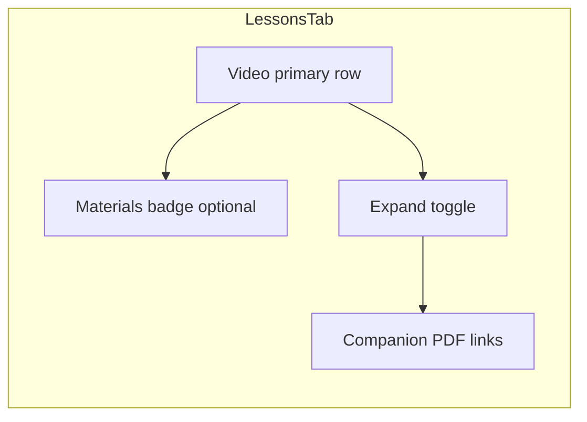

# feat: Course Content sidebar — PDF access and discoverability

## Overview

Imported courses often ship **paired video + PDF** files per lesson (same folder, matching stems such as `01-Introduction.mp4` / `01-Introduction.pdf`). The lesson player sidebar (`LessonsTab`) already models companion PDFs as `materials` on a video `MaterialGroup` and renders them as nested links — but **they stay hidden inside a collapsed section** while the user is on the video lesson, and the primary row **never shows a materials count**. This plan restores predictable access with minimal UX change: visible affordances, sensible default expansion, and verification of grouping/import behavior for nested folders.

---

## Problem Frame

Learners expect PDF handouts beside videos to appear in **Course Content** without hunting through collapsed chrome or alternate tabs. Today, companion PDFs are matched at import time (`lessonMaterialMatcher.ts`) and surfaced under `MaterialGroupRow`, yet:

1. **`Collapsible` defaults to closed** unless the active route is the PDF lesson itself (`expandedMaterialGroups` only seeds parents when `lessonId` matches a material).
2. **`LessonLink` receives `materialCount={0}`** inside `MaterialGroupRow` whenever materials exist — so the PDF badge branch (`materialCount > 0`) never runs for companion PDFs (lines ~373 and ~390 in `LessonsTab.tsx`).
3. Users perceive “no PDFs” even when data is present — matching the provided Finder vs sidebar screenshots.

This aligns with polish requirement **R3** (companion PDFs navigable from sidebar) from the origin doc; this plan narrows scope to **discoverability and parity**, not the broader polish epic.

---

## Requirements Trace

- **R1.** For every video lesson that has one or more companion PDFs matched by `matchMaterialsToLessons`, the sidebar shows a **clear affordance** that PDFs exist (count and/or visible rows — see decisions below).
- **R2.** The learner can **navigate to each companion PDF** from Course Content **without opening the Materials tab**, including when the current lesson is the parent video.
- **R3.** Behavior remains consistent for **nested folders** (e.g. `…/01-HUMAN BEHAVIOR/01-Introduction.mp4`) — PDFs stay grouped under the correct video row inside the folder tree.
- **R4.** Standalone PDF lessons (unmatched or intentionally separate) continue to render as primary rows per existing sidebar rules; **no regression** to search, completion styling, or navigation URLs.

**Origin flows:** Lesson playback with sidebar navigation (see origin doc).

**Origin acceptance alignment:** Satisfies the navigable companion PDF intent behind **R3** in `docs/brainstorms/2026-05-02-course-lesson-player-polish-requirements.md` (see origin).

---

## Scope Boundaries

- **In scope:** `LessonsTab` UX defaults and affordances; optional tests; light verification of matcher vs real naming patterns when discrepancies appear during QA.
- **Out of scope:** Redesign of folder tree IA, Materials tab behavior, PDF viewer internals, transcript/AI summary, header layout — unchanged unless a regression appears.
- **Related doc:** `docs/plans/2026-05-03-001-fix-show-root-level-pdfs-in-sidebar-plan.md` targeted root-level standalone PDF filtering — current codebase no longer references `displayGroups`; treat **001 as historical context**. If any environment still hides root PDFs, reconcile during implementation — not duplicated here unless QA confirms a gap.

### Deferred to Follow-Up Work

- **Matcher hardening using raw filenames:** Today grouping uses `LessonItem.title` produced by `humanizeFilename()`, which strips numeric prefixes. Rare collisions (two videos sharing the same humanized stem with different numeric prefixes) could mis-associate PDFs. If surfaced by tests or user reports, follow up by threading original filename into matcher inputs — broader change than sidebar UX alone.

---

## Context & Research

### Relevant Code and Patterns

- `src/app/components/course/tabs/LessonsTab.tsx` — `MaterialGroupRow`, `MaterialRow`, `LessonLink`, `expandedMaterialGroups`, folder tree rendering.
- `src/lib/courseAdapter.ts` — `LocalCourseAdapter.buildPdfLessons()`, `buildVideoLessons()`, `getGroupedLessons()`, `getLessons()` (companion PDF IDs excluded from flat prev/next — invariant to preserve).
- `src/lib/lessonMaterialMatcher.ts` — `matchMaterialsToLessons`, tiered PDF-to-video association.
- `src/lib/courseImport.ts` — PDFs scanned and persisted as `ImportedPdf` alongside videos (nested paths supported).

### Institutional Learnings

- Lesson player polish plan (`docs/plans/2026-05-02-002-feat-course-lesson-player-polish-plan.md`) already scoped sidebar companion PDF rows — **implementation gap is primarily discoverability** (collapse + zero badge), not missing routes (`PdfContent` / lesson URLs already exist).

### External References

- None required — patterns are established locally.

---

## Key Technical Decisions

- **Default-expand material groups that have companions:** On first successful load of `materialGroups`, initialize `expandedMaterialGroups` to include every `primary.id` where `materials.length > 0`. Preserve user toggles afterward without wiping state on unrelated re-renders (use a ref or merge strategy — see U1). Rationale: paired PDFs are first-class lesson assets; collapsing everything hides them from the screenshot-shaped expectation (“files visible like Finder”).
- **Restore materials count on the primary row:** Pass `group.materials.length` into `LessonLink` as `materialCount` inside `MaterialGroupRow` instead of hard-coded `0`. Rationale: reuses existing badge UX (`FileText` + count) and complements the chevron.
- **Do not flatten prev/next navigation:** Companion PDFs remain excluded from `getLessons()` flat ordering — sidebar visibility does not change keyboard/auto-advance semantics unless product explicitly requests it later.

---

## Open Questions

### Resolved During Planning

- **Are PDFs missing from Dexie import for nested folders?** Import pipeline pushes PDFs with paths into `importedPdfs`; grouping runs on adapter load. Primary gap observed in code review is **UI collapse + badge**, not missing persistence — verification scenarios still guard regressions.

### Deferred to Implementation

- **Exact merge behavior for `expandedMaterialGroups` when `adapter` identity changes** (same course reload): Prefer merging new group IDs into expanded set rather than nuking user preferences — finalize after inspecting mount/update patterns.

---

## High-Level Technical Design

> *This illustrates the intended approach and is directional guidance for review, not implementation specification. The implementing agent should treat it as context, not code to reproduce.*

---

## Implementation Units

- [ ] U1. **Default-expand companion PDF groups on first load**

**Goal:** Ensure paired PDF rows are visible when the learner opens Course Content, without requiring a prior click into each PDF lesson.

**Requirements:** R1, R2

**Dependencies:** None

**Files:**
- Modify: `src/app/components/course/tabs/LessonsTab.tsx`
- Test: `src/app/components/course/__tests__/LessonsTab.test.tsx`

**Approach:**
- After `materialGroups` resolves from `adapter.getGroupedLessons()`, merge into `expandedMaterialGroups` every group `g` where `g.materials.length > 0`, **once per logical load** (e.g. `useRef` keyed by `courseId` + adapter stable identity, or initialize only when transitioning from loading → loaded).
- Keep existing effect that expands parents when `lessonId` matches a material ID — still required when navigating directly to a PDF URL.

**Patterns to follow:**
- Existing `expandedMaterialGroups` / `toggleMaterialGroup` controlled pattern.

**Test scenarios:**
- **Happy path:** Course with one video + one matched PDF — on mount, PDF sub-row link is present in the document (collapsible open).
- **Happy path:** User collapses a group manually — toggle still works.
- **Edge case:** Course with zero PDFs — no empty collapsible chrome beyond current behavior.
- **Integration:** Nested folder tree (`hasMultipleFolders`) — expanding folder shows video rows with PDF children visible without extra clicks after load.

**Verification:**
- Manual spot-check against a folder shaped like `01-Behavior Skills Breakthrough/01-HUMAN BEHAVIOR/` with paired mp4/pdf files matches Finder-visible parity in sidebar.

---

- [ ] U2. **Show companion PDF count on video rows**

**Goal:** Reinforce discoverability via the existing badge pattern on `LessonLink`.

**Requirements:** R1, R4

**Dependencies:** U1 optional sequencing flexibility — may ship independently.

**Files:**
- Modify: `src/app/components/course/tabs/LessonsTab.tsx`
- Test: `src/app/components/course/__tests__/LessonsTab.test.tsx`

**Approach:**
- In `MaterialGroupRow`, pass `materialCount={group.materials.length}` to `LessonLink` for both branches (`hasMaterials` true/false remains `0` when empty).
- Confirm badge click (`onFocusMaterials`) still behaves when wired from `UnifiedLessonPlayer` — no duplicate navigation.

**Test scenarios:**
- **Happy path:** Video with two PDFs shows badge “2” (or equivalent) next to duration row.
- **Regression:** Video without PDFs shows no materials badge.

**Verification:**
- Visual parity with design intent: learner sees PDF presence before interacting with chevron.

---

- [ ] U3. **Verify PDF lesson ordering alignment (conditional)**

**Goal:** Prevent rare sidebar ordering glitches between videos and standalone PDF groups when filename-derived PDF order diverges from imported video `order`.

**Requirements:** R3

**Dependencies:** None — run during implementation only if QA surfaces mismatch.

**Files:**
- Possibly modify: `src/lib/courseAdapter.ts` (`buildPdfLessons` order field)
- Test: add or extend unit tests under `src/lib/__tests__/` if matcher/order helpers exist

**Approach:**
- Compare `ImportedVideo.order` and `ImportedPdf` sequencing from import — if PDF `order` uses only leading-digit parse while videos use global sequence, consider assigning PDF lesson `order` from scan/import pipeline consistently with sibling videos **when paths share a directory**. Directional only until verified against Dexie records.

**Test scenarios:**
- **Edge case:** Folder with interleaved numeric prefixes — sidebar order matches intended curriculum order.

**Verification:**
- No inversion between video row and its companion PDF sub-rows within the same group.

---

## System-Wide Impact

- **Interaction graph:** `PlayerSidePanel` → `LessonsTab` only; `UnifiedLessonPlayer` may pass `onFocusMaterials` — confirm badge button still prevents link navigation (`stopPropagation` already on badge).
- **State lifecycle risks:** Avoid resetting expanded sets on every `filteredGroups` memo update — search/filter should not collapse PDFs unexpectedly (merge expansion with filtered visibility).
- **API surface parity:** `CourseAdapter.getGroupedLessons()` unchanged.
- **Unchanged invariants:** `getLessons()` excludes companion PDF IDs; lesson routes and `PdfContent` unchanged.

---

## Risks & Dependencies

| Risk | Mitigation |
|------|------------|
| Auto-expanding all groups feels noisy on courses with many PDF attachments | Scope expansion to groups **inside expanded folders only**, or cap visible depth — revisit only if users report clutter; default proposal favors parity with Finder-like visibility |
| Search/filter hides collapsed children | Already forces folder `forceOpen` when `searchQuery` set — retain; add scenario if expanding materials needed during search |

---

## Documentation / Operational Notes

- None mandatory; optional one-line note in `CLAUDE.md` only if reviewers repeatedly confuse Materials tab vs sidebar roles.

---

## Sources & References

- **Origin document:** [docs/brainstorms/2026-05-02-course-lesson-player-polish-requirements.md](docs/brainstorms/2026-05-02-course-lesson-player-polish-requirements.md)
- Related plan: [docs/plans/2026-05-02-002-feat-course-lesson-player-polish-plan.md](docs/plans/2026-05-02-002-feat-course-lesson-player-polish-plan.md)
- Related historical plan: [docs/plans/2026-05-03-001-fix-show-root-level-pdfs-in-sidebar-plan.md](docs/plans/2026-05-03-001-fix-show-root-level-pdfs-in-sidebar-plan.md)
