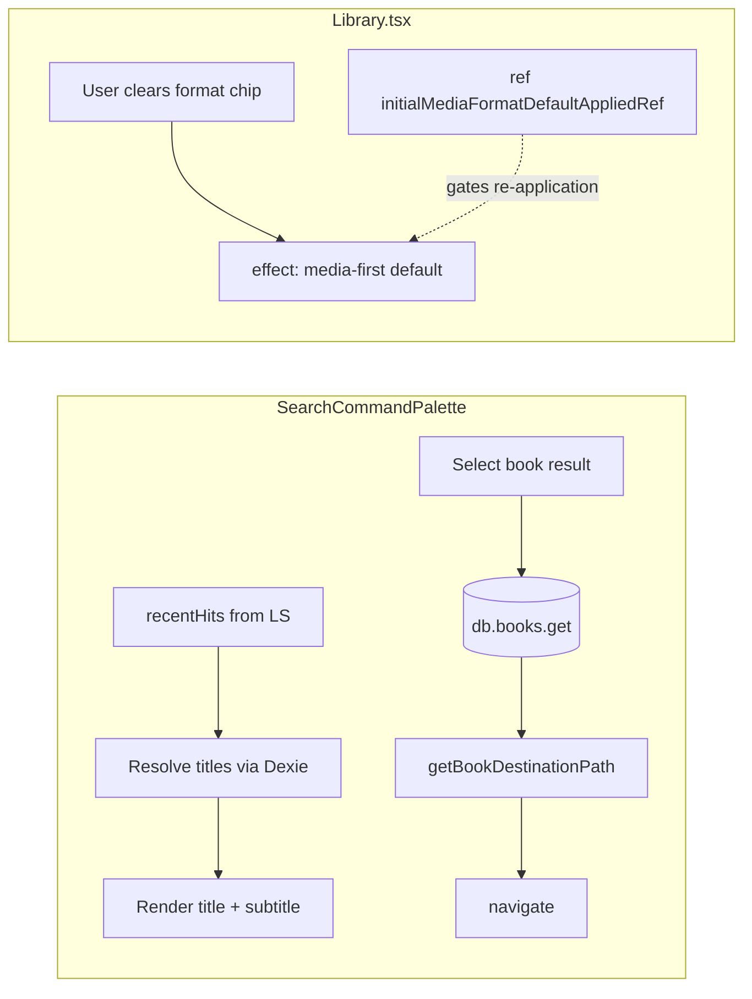

# fix: Search palette recent labels, book navigation, library format chip

## Overview

Three regressions/UX gaps in Knowlune around global search (⌘K / Ctrl+K), library routing, and Library filters. This plan aligns palette navigation with existing book card behavior, replaces UUID-only labels in “Recently opened,” and stops the Library page from immediately re-applying the audiobook format after the user clears it.

---

## Problem Frame

1. **Unreadable “Recently opened” rows:** The command palette’s empty-state list renders `hit.id` as the primary title (`SearchCommandPalette.tsx`). For lessons (and other entities), stable IDs are UUIDs — fine for persistence, hostile for humans. `RecentHit` in `searchFrecency.ts` intentionally stores only `{ type, id, openedAt }`, so the UI has no display strings unless it resolves them.

2. **Book search opens the wrong surface:** Selecting a book result navigates to `/library/:bookId`, matching `handleResultSelect` / `handleRecentSelect`. Elsewhere, **BookCard** sends users to `/library/:bookId/read` for **audiobook and EPUB** formats; PDF stays on `/library/:bookId`. Palette paths omit `/read`, so users land on the Library shell route without entering the reader — visually indistinguishable from “just opened Books.” Additionally, **`Library.tsx` never consumes `libraryBookId` from `useParams` for UI** (only `recordVisit`), so `/library/:id` does not open or highlight a specific title even when that route is active.

3. **“Format: audiobook” chip × does nothing:** `LibraryFilters.removeChip` correctly calls `setFilter('format', undefined)`. A **`useEffect` in `Library.tsx` (“Media-first default”)** watches `filters.format` and, whenever format is empty, immediately calls `setFilter('format', ['audiobook'])` if any audiobooks exist — undoing the user’s explicit clear.

---

## Requirements Trace

- **R1.** “Recently opened” must show human-readable primary text (lesson title, book title, course name, etc.) and sensible subtitles where available; UUIDs must not be the default visible title.
- **R2.** Selecting a **book** from unified search or recent list must land the user on the **same destination as clicking the corresponding BookCard** (audiobook/EPUB → reader; PDF → library detail path).
- **R3.** Clearing the **Format** active chip removes the format constraint until the user chooses again (or a deliberate product rule replaces it); the dismiss control must have visible effect.
- **R4.** Secondary surfaces that echo raw IDs (accessibility labels, chat citations, etc.) should be audited and fixed where user-visible.

---

## Scope Boundaries

- Out of scope: Changing MiniSearch ranking, adding server-side search, or redesigning Library IA.
- Out of scope: Audiobookshelf sync behavior beyond filter UX.
- Deferred to follow-up: Persisting denormalized titles inside `RecentHit` in localStorage (optional optimization once R1 resolution strategy is proven stable).

---

## Context & Research

### Relevant Code and Patterns

- `src/app/components/figma/SearchCommandPalette.tsx` — lines ~932–949 render `{hit.id}`; `aria-label` repeats `hit.id`. Book branch in `handleResultSelect` uses `/library/${result.id}` only.
- `src/lib/searchFrecency.ts` — `RecentHit` shape; `recordVisit(type, id)` has no title payload.
- `src/app/components/library/BookCard.tsx` — canonical navigation: audiobook|epub → `/read`; pdf → `/library/:id`.
- `src/app/pages/Library.tsx` — `libraryBookId` from params used only for `recordVisit`; media-first `useEffect` (~387–398) refills `format: ['audiobook']` whenever format is cleared.
- `src/app/components/library/LibraryFilters.tsx` — active chips and `removeChip` implementation.

### Institutional Learnings

No existing `docs/solutions/` entry specifically covers these three bugs; prior unified-search plan (`2026-04-18-010-feat-unified-search-ranking-empty-state-story-2-plan.md`) documents `RecentHit` persistence but assumed palette would resolve display elsewhere.

### External References

None required — behavior is fully determined by local routing and Dexie schemas.

---

## Key Technical Decisions

- **Recent titles:** Prefer **resolving labels from Dexie (and merged authors where applicable) when the palette renders “Recently opened,”** mirroring the stale-entry validation already performed on select. Keeps LS schema backward-compatible and avoids stale cached titles after renames. Optionally debounce/batch reads to avoid N sequential awaits.
- **Book navigation:** Introduce **`getBookDestinationPath(book: Book): string`** in `src/lib/bookNavigation.ts`, imported by **BookCard** and palette handlers. Name reflects both outcomes: audiobook/EPUB → `/library/:id/read`, PDF → `/library/:id` (library detail, not reader). Palette handlers already `await db.books.get(id)` — pass the row into this helper after the existence check.
- **Format chip (normative):** Use a **`useRef` gate** — e.g. `initialMediaFormatDefaultAppliedRef` — so the media-first auto-default runs **at most once** while the Library page is mounted: when `books.length > 0` and `filters.format` is unset/empty, apply the audiobook-vs-ebook default once, then set the ref to `true`. When the user clears the format chip, `filters.format` becomes empty again but the ref stays `true`, so the effect **does not** re-apply. **Reset the ref to `false` only when `books.length` drops to 0** (library wiped / last book removed) so a truly fresh library still gets the one-shot default. Because the ref resets on React remounts (e.g. navigating away and returning), supplement it with a **`sessionStorage` flag** (`libraryFormatCleared`) set when the user clears the format chip. On Library mount, if the flag exists in sessionStorage, skip the media-first default even before the ref fires. Clear the flag when `books.length === 0`. This survives React remounts while remaining session-scoped (fresh browser session = fresh default). **Do not** add a parallel `format: 'all'` sentinel or store-level `userClearedFormat` unless this combined approach proves insufficient — that would require coordinated changes to `useBookStore.getFilteredBooks()` and is out of scope for this plan.

---

## Open Questions

### Resolved During Planning

- **Why does `/library/:bookId` feel like the generic library?** Because `Library.tsx` does not mount reader UI or focused detail from `libraryBookId`; combined with palette routing that skips `/read`, users never enter the book surface.

### Deferred to Implementation

- Whether to add **scroll-into-view / highlight** when landing on `/library/:id` for PDF-only flows (nice-to-have beyond R2).

---

## High-Level Technical Design

> *Directional guidance for review — not implementation specification.*

---

## Implementation Units

- [ ] U1. **Resolve and display human-readable “Recently opened” labels**

**Goal:** Replace UUID-only rows with titles/subtitles; fix `aria-label`.

**Requirements:** R1, R4

**Dependencies:** None

**Files:**
- Modify: `src/app/components/figma/SearchCommandPalette.tsx`
- Test: add or extend palette tests under `tests/e2e/` or `src/app/components/figma/__tests__/` (mirror existing search palette coverage)

**Approach:**
- **Triggers:** Run resolution when `recentHits` changes **or** when the palette opens (`open` transitions to `true`). Debounce or compare a stable serialized key of `${type}:${id}` tuples so identical hit lists do not re-fetch (avoid duplicate `Promise.all` work on unrelated re-renders).
- Batch-resolve display strings per `hit.type` using the same tables as `handleRecentSelect` (`importedCourses`, `importedVideos`, `books`, `notes`, `bookHighlights`, `getMergedAuthors` for authors). Guard async resolution with an **AbortController** or **mounted-ref pattern** so that resolution completing after the palette closes (component unmount) is silently ignored — no console errors, no React setState-on-unmounted warnings.
- Store resolved labels in component state (`Map` or parallel array); show a lightweight placeholder (muted “Loading…” or skeleton) only while resolving; never flash raw UUID as primary text.
- Update `aria-label` to use resolved title + badge label.

**Patterns to follow:**
- Existing existence-check switches in `handleRecentSelect` / `handleResultSelect` for entity-specific lookups.

**Test scenarios:**
- **Happy path:** Seed localStorage with `RECENT_LIST_KEY` from `src/lib/searchFrecency.ts` (currently `knowlune.recentSearchHits.v1`) — prefer importing the constant in the test harness so the key tracks code — with a lesson id whose `importedVideos` row has `title`; open palette; row shows lesson title, not UUID.
- **Edge case:** Recent entry references deleted lesson; existing purge behavior remains; no crash during resolution.
- **Integration:** Author recent hit resolves via merged authors projection (pre-seeded author case).
- **Race condition:** Palette opens, recentHits trigger Dexie resolution, palette closes before resolution completes, resolution completes — no error/crash (abort controller or mounted-ref guard).

**Verification:**
- Manual: empty-query palette shows readable strings matching Dexie titles.

---

- [ ] U2. **Single-source book destination paths for palette + cards**

**Goal:** Book selections from search/recent navigate identically to BookCard.

**Requirements:** R2

**Dependencies:** U1 optional (can ship in parallel)

**Files:**
- Create: `src/lib/bookNavigation.ts` — export **`getBookDestinationPath(book: Book): string`**
- Modify: `src/app/components/library/BookCard.tsx` — replace inline path logic with `getBookDestinationPath`
- Modify: `src/app/components/figma/SearchCommandPalette.tsx` — `handleResultSelect` / `handleRecentSelect` / `handleContinueLearningSelect` book branches — call `getBookDestinationPath(row)` after `db.books.get`

**Approach:**
- `getBookDestinationPath` encapsulates: `(audiobook | epub) → /library/:id/read`; `pdf → /library/:id` (and any future format rules aligned with BookCard).
- Palette already loads `Book` for existence; pass row into helper.

**Test scenarios:**
- **Happy path:** Mock book formats — palette navigates to `/read` for audiobook, plain `/library/:id` for pdf.
- **Regression:** BookCard behavior unchanged (existing tests or add unit test for helper).

**Verification:**
- Clicking a searched audiobook opens reader route, not bare library shell.

---

- [ ] U3. **Fix Library format chip removal fighting media-first effect**

**Goal:** Clearing “Format: audiobook” removes filter until user sets format again.

**Requirements:** R3

**Dependencies:** None

**Files:**
- Modify: `src/app/pages/Library.tsx`
- Test: `src/app/components/library/__tests__/LibraryFilters.test.tsx` or new `Library.format-chip.test.tsx`

**Approach:**
- Implement the **combined ref + sessionStorage gate** described in **Key Technical Decisions**:
  1. On Library mount, check `sessionStorage.getItem('libraryFormatCleared')`. If present, skip the media-first default entirely (user previously cleared the chip in this session).
  2. Otherwise, use `initialMediaFormatDefaultAppliedRef` to run the media-first auto-default at most once while the page stays mounted (when `books.length > 0` and `filters.format` is unset/empty, apply the audiobook-vs-ebook default once, then set the ref to `true`).
  3. When the user clears the format chip (via `removeChip`), set `sessionStorage.setItem('libraryFormatCleared', '1')` so the flag persists across remounts.
  4. Reset both the ref and the sessionStorage flag when `books.length` drops to 0 (library wiped / last book removed), allowing a fresh default the next time books appear.
- Replace the current effect dependency pattern that re-fires on every empty `filters.format` with this contract.
- **`getFilteredBooks`:** No store schema change — cleared format remains `undefined`/empty in filters; existing logic already skips format filtering when unset (`filters.format` falsy or length 0), which yields **all formats visible** — this satisfies R3.

**Test scenarios:**
- **Happy path:** Library with audiobooks → chip shows Format audiobook → click × → `filters.format` stays cleared (no immediate reset); grid shows both formats per `getFilteredBooks` rules.
- **Edge case:** Fresh session with only audiobooks still gets sensible initial tab (one-shot default preserved).
- **Remount persistence:** User clears chip, navigates away, returns — chip is still cleared (sessionStorage flag persists across mounts).

**Verification:**
- Manual: × on chip changes counts/list visibly.

---

- [ ] U4. **Audit secondary UUID surfaces (chat, citations & generic aria-labels)**

**Goal:** Ensure no other user-visible chrome defaults to raw ids where a title exists.

**Requirements:** R4 *(closing R4: if the audit finds no user-visible raw ids in the listed surfaces, record “no findings” in the PR description or a one-line comment in code — that outcome fully satisfies R4 for this iteration.)*

**Dependencies:** U1–U3 (palette/library primary fixes)

**Files:**
- Audit: `src/app/components/tutor/`, `src/app/components/figma/QAChatPanel.tsx`, `src/app/components/chat/`, citation components
- Modify only where issues confirmed

**Approach:**
- Grep for `videoId`/`lessonId` rendered to UI; replace with lesson title lookups where missing.

**Test expectation:** none — document **“audit: no findings”** in the PR if nothing needs changing; **R4 is satisfied** for that outcome.

**Verification:**
- Spot-check course player Tutor tab and citation chips after audit.

---

## System-Wide Impact

- **Interaction graph:** `recordVisit` callers unchanged; navigation paths change for books from palette only.
- **State lifecycle:** With the ref gate, “unset format after user clear” means **no format dimension in `getFilteredBooks`** — existing `useBookStore` logic applies no format predicate when `filters.format` is unset or empty → **all formats** in the current source/status/search slice. No change to `BookFilters` type required for this plan.
- **API surface parity:** Any other code duplicating BookCard path logic should import **`getBookDestinationPath`** from `src/lib/bookNavigation.ts` (follow-up if discovered during U2).

---

## Risks & Dependencies

| Risk | Mitigation |
|------|------------|
| Showing all formats after chip clear surprises users who relied on implicit audiobook-only view | Confirm copy/tooltip; optional toast first ship — product call |
| Batch Dexie reads on palette open adds latency | Single `Promise.all` bounded to ≤5 recent rows |

---

## Sources & References

- Related code: `SearchCommandPalette.tsx`, `searchFrecency.ts` (`RECENT_LIST_KEY`), `BookCard.tsx`, `Library.tsx`, `LibraryFilters.tsx`, planned `src/lib/bookNavigation.ts` (`getBookDestinationPath`)
- Prior plan context: `docs/plans/2026-04-18-010-feat-unified-search-ranking-empty-state-story-2-plan.md`
