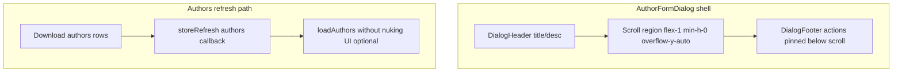

# fix: Author edit modal viewport clipping and intermittent page churn on author routes

## Overview

Two related UX failures on author surfaces (especially **`AuthorProfile`** when editing an imported author):

1. **Modal clipping:** The **Edit Author** dialog (`AuthorFormDialog`) is taller than the viewport; footer actions (**Cancel** / **Save**) fall below the visible area and the user cannot reliably scroll or reach them (matches screenshot: content cuts off at LinkedIn, no scrollbar evident).

2. **Periodic “refresh”:** The page appears to **reload or flash** on a short cadence (~10s per report). Repository analysis finds **no `setInterval(..., 10_000)`** on author routes; the closest periodic drivers are **30s** sync/session timers and **author-store reload** side effects after sync downloads. Implementation should **measure**, **eliminate false positives**, and **reduce disruptive reload UX** when sync touches authors.

## Problem Frame

- **Edit flow:** `AuthorProfile` and `Authors` mount **`AuthorFormDialog`** with a long single-column form (bio textarea, social fields, quote). The shell uses **`DialogContent`** defaults (**CSS grid**, **`fixed` + `top-[50%]` + `translate-y-[-50%]`** centering per `src/app/components/ui/dialog.tsx`) plus **`max-h-[85vh] overflow-y-auto`** on the dialog instance (`src/app/components/authors/AuthorFormDialog.tsx`).
- **Why scrolling fails in practice:** Combined **`translate-y-[-50%]`** positioning with a panel whose **laid-out height hits `max-h`** (or whose **grid children resist shrinking** due to default **`min-height: auto`**) commonly yields **top/bottom clipping** and **broken or misleading scroll affordances** — users perceive the modal as “stuck” with no way to reach the footer.
- **Refresh perception:** **`useSyncLifecycle`** runs a **30s** `nudge` + **`refreshPendingCount`** globally (`src/app/hooks/useSyncLifecycle.ts`). Separately, when sync **downloads** the **`authors`** table, the registered store refresh sets **`isLoaded: false`** and calls **`loadAuthors()`**, which drives **`AuthorProfile` / `Authors`** into **`isLoading && !isLoaded`** — a **full skeleton swap** that reads like a refresh and can interrupt editing (`src/app/pages/AuthorProfile.tsx`). **`App.tsx`** subscribes to **`useSessionStore()`** without a narrow selector; **`heartbeat`** updates (30s during active sessions) re-render the app root and can amplify “something keeps ticking” on every route.

## Requirements Trace

- **R1.** With the edit modal open on a **short laptop viewport**, **all fields including footer actions** are reachable via **clear vertical scrolling** (keyboard + pointer), without requiring zoom or DevTools.
- **R2.** Modal layout respects the **absolute close control** in `dialog.tsx` (header/title not obscured; optional **`pr-*`** parity with other dialogs if needed).
- **R3.** Identify what triggers the user-observed **periodic churn** (Profiler/timeline + logging); document actual interval(s) and component boundaries.
- **R4.** If sync-driven **`authors`** refresh causes skeleton flashes during normal browsing (especially **while a modal is open**), **mitigate** so authors data still updates without swapping the entire page to loading skeleton — **without** breaking correctness of merged/pre-seeded author lists.
- **R5.** While **Edit Author** is open, a background **`authors`** reload must **not reset or overwrite in-progress field edits** (avoid naive `useEffect([author])` clobber — explicit dirty-state or suppress prop sync until close unless implementer chooses safer pattern).

## Scope Boundaries

- **In scope:** `AuthorFormDialog`, shared **`DialogContent`** behavior assessment, **`AuthorProfile` / `Authors`** loading UX when **`useAuthorStore`** transitions **`isLoaded`**, sync **`authors`** refresh registration, **`App.tsx`** store subscription blast radius if confirmed noisy.
- **Out of scope:** Changing author schema, sync conflict algorithms, or design-system-wide redesign of every modal unless a **one-line safe global tweak** falls out of modal verification (mirror bulk-import plan discipline — prefer local fix first).
- **Deferred:** Adding automated visual regression for every dialog in the app.

### Deferred to Separate Tasks

- **Global `DialogContent` refactor** for all dialogs: only after **`AuthorFormDialog`** (and optionally one more long form) validates the chosen scroll shell pattern.

## Context & Research

### Relevant Code and Patterns

- **`src/app/components/authors/AuthorFormDialog.tsx`** — Long form inside **`Dialog`**; **`DialogContent className="max-h-[85vh] overflow-y-auto sm:max-w-lg"`**; footer **`DialogFooter`** inside the same scroll surface as fields.
- **`src/app/components/ui/dialog.tsx`** — **`DialogContent`** is **`grid`** with **`gap-4`**, **`fixed top-[50%] left-[50%] translate-*`**, **`sm:max-w-lg`**; close button **`absolute top-3 right-3`**.
- **`src/app/pages/AuthorProfile.tsx`** — Skeleton gate **`isLoading && !isLoaded`**; **`useLazyStore(loadAuthors)`**, **`useLazyStore(loadImportedCourses)`**; edit **`AuthorFormDialog`** when **`author.importedAuthor`**.
- **`src/app/pages/Authors.tsx`** — Same author loading gate + **`AuthorFormDialog`** for edit/create.
- **`src/app/hooks/useSyncLifecycle.ts`** — **`NUDGE_INTERVAL_MS = 30_000`**; **`registerStoreRefresh('authors', ...)`** sets **`isLoaded: false`** before **`loadAuthors()`**.
- **`src/app/App.tsx`** — **`useSessionStore()`** destructuring (**whole-store subscription** by default in Zustand) for **`recoverOrphanedSessions`** — any session field churn re-renders **`App`**.
- **`docs/plans/2026-05-04-006-fix-bulk-import-dialog-layout-plan.md`** — Recent modal containment work; **`min-w-0`**, **`DialogHeader` `pr-*`** for close affordance, optional **`overflow-x-hidden`** — reusable framing.
- **`docs/implementation-artifacts/9b-5-ai-note-organization-and-cross-course-links.md`** (referenced pattern) — **`max-h-[80vh] flex flex-col overflow-hidden`** + **`ScrollArea`** + **`min-h-0`** for long dialog bodies.

### Institutional Learnings

- **`docs/solutions/ui-bugs/qa-chat-panel-uuid-leakage-overflow-auto-scroll-2026-04-29.md`** — **`min-w-0`** / **`overflow-wrap`** discipline for flex/grid overflow (apply if long URLs in inputs affect horizontal sizing).

### External References

- None required beyond Radix/shadcn dialog ergonomics already mirrored in-repo.

## Key Technical Decisions

- **Modal shell:** Prefer **`flex flex-col max-h-[min(85vh,100dvh-2rem)] overflow-hidden`** on **`DialogContent`** (this dialog instance first), with an inner **`flex-1 min-h-0 overflow-y-auto`** region wrapping **form fields**, and **`DialogFooter` pinned outside** the scroll region (sticky actions pattern). *Directional guidance:* if **`ScrollArea`** is already used nearby for dialogs, reuse it for scrollbar consistency; otherwise native **`overflow-y-auto`** with **`min-h-0`** is acceptable.
- **Vertical positioning:** If centering **`translate-y-[-50%]`** remains the primary clipping contributor after the flex split, evaluate **`DialogContent`** positional overrides documented by Radix for **viewport-safe** dialogs (`top`/`bottom` insets or **`translate-y` adjustments** when **`max-h`** binds). Treat positioning change as **shared component risk** — prototype on **`AuthorFormDialog`** via **`className` merger** before editing **`dialog.tsx`** defaults.
- **Refresh hypothesis ordering:** (1) Confirm interval with **React Profiler** + **why-did-you-render** or lightweight logging on **`AuthorProfile`**; (2) **`authors`** sync refresh → **`isLoaded` false** skeleton; (3) **`App`/`Layout`** subscriptions causing broad rerenders; (4) dev-only **HMR** / **React Strict Mode** doubling effects (note only if observed).
- **Mitigating skeleton flashes:** Prefer **`loadAuthors({ force?: boolean })`** or **internal “silent reload”** path that **does not toggle `isLoaded` false** when data already present — **or** narrow **`AuthorProfile`** loading UI so background stays mounted (inline spinner/banner) while modals stay open. Exact API shape is deferred to implementation; requirement is **no full-page skeleton swap** during routine sync refresh while editing.

## Open Questions

### Resolved During Planning

- **Is there a strict 10s timer in `src/` for this route?** **No** — **`grep`** shows **no `setInterval(..., 10_000)`** in application **`src/`** (tests and unrelated timeouts excluded). User cadence is likely **~30s** perception drift, **composite rerenders**, or **environment-specific** behavior — verify in implementation.

### Deferred to Implementation

- **Exact clipping mechanism** (centering vs grid **`min-height:auto`** vs platform scrollbar overlay): resolve by inspecting computed styles / fixture viewport height matching screenshot.

## High-Level Technical Design

> *This illustrates the intended approach and is directional guidance for review, not implementation specification. The implementing agent should treat it as context, not code to reproduce.*

## Implementation Units

- [ ] **Unit 1: Dialog viewport-safe scroll shell for `AuthorFormDialog`**

**Goal:** Guarantee footer actions are always reachable; eliminate clipped modal bottom edge from screenshot.

**Requirements:** R1, R2

**Dependencies:** None

**Files:**
- Modify: `src/app/components/authors/AuthorFormDialog.tsx`
- Test: `src/app/components/authors/__tests__/AuthorFormDialog.test.tsx` *(extend — viewport / footer presence assertions as feasible in RTL)*

**Approach:**
- Restructure **`DialogContent`** classes to **`flex flex-col`** + bounded **`max-h`** using **`min(85vh, …)`** or **`calc(100dvh - …)`** as appropriate for mobile/desktop safe-area behavior.
- Wrap **form body** (everything between **`DialogHeader`** and **`DialogFooter`**) in **`flex-1 min-h-0 overflow-y-auto`** (or **`ScrollArea`** + **`min-h-0`**).
- Keep **`DialogFooter`** as sibling **below** scroll viewport so **Cancel/Save** never scroll away incorrectly **and** remain visible.
- Add **`DialogHeader`** trailing padding if title crowds **`absolute`** close (`pr-10`/`pr-12` pattern — mirror **`2026-05-04-006`** guidance).

**Patterns to follow:**
- `docs/plans/2026-05-04-006-fix-bulk-import-dialog-layout-plan.md`
- Long-dialog **`flex` + `min-h-0`** pattern cited in story **`docs/implementation-artifacts/9b-5-ai-note-organization-and-cross-course-links.md`**

**Test scenarios:**
- **Happy path (RTL):** Open dialog with **`ResizeObserver` mocked small viewport** — submit row exists **above fold** or scroll container scrollHeight **>** clientHeight with **footer still mounted** (choose assertion that matches implementation).
- **Edge case:** **`featuredQuote` + long bio** — scroll region consumes overflow; **header/footer** not clipped by **`translate`** (visual verification note).
- **Edge case:** Very short viewport / mobile safe-area — scroll region remains usable; footer row does not consume entire height (**manual** check).
- **Accessibility:** **Tab** through controls reaches **Save** without trapping focus outside modal (**Radix Dialog** defaults should hold — regression sniff only).

**Verification:** Manual pass reproducing screenshot viewport; DevTools show scrollable inner viewport; **Save** clickable.

- [ ] **Unit 2: Measure and document periodic churn root cause**

**Goal:** Replace hypothesis with evidence for “every ~10s refresh.”

**Requirements:** R3

**Dependencies:** None (can parallelize with Unit 1)

**Files:**
- Modify (temporary instrumentation optional): `src/app/pages/AuthorProfile.tsx`, optionally `src/app/hooks/useSyncLifecycle.ts` *(guard logs behind `import.meta.env.DEV`)*

**Approach:**
- Record timestamps for: **`useAuthorStore` `isLoaded` / `isLoading` transitions**, **`syncEngine`-triggered `authors` refresh**, **`useSyncStatusStore` pending badge updates**, and **`useSessionStore` heartbeat-related updates** if a session is active.
- Confirm whether **`authors`** download fires unexpectedly often (network tab / sync logs).
- Document findings inline in PR description or a short comment near mitigation code (**remove dev logs** before merge).

**Patterns to follow:**
- Prefer **React Profiler + short-lived `DEV` logs** first; optional **`why-did-you-render`** only if Profiler is inconclusive (avoid tooling rabbit holes).

**Test scenarios:**
- **Integration expectation:** none automated unless implementing logging assertions — **manual timeline** outcome is sufficient.

**Verification:** Written note of **actual dominant interval** and **trigger stack** (sync vs session vs dev HMR).

- [ ] **Unit 3: Reduce disruptive author reload UX (especially during modal edit)**

**Goal:** Stop **full-route skeleton flashes** on routine **`authors`** sync refresh; avoid breaking modal edit mid-flight.

**Requirements:** R4, R5

**Dependencies:** Unit 2 confirms **`authors` refresh** participates (if not, narrow scope to whichever store caused churn)

**Files:**
- Modify: `src/stores/useAuthorStore.ts` *(loading API semantics)*
- Modify: `src/app/hooks/useSyncLifecycle.ts` *(authors refresh callback)*
- Modify: `src/app/pages/AuthorProfile.tsx`, `src/app/pages/Authors.tsx` *(loading presentation)*
- Test: `src/stores/__tests__/useAuthorStore.test.ts` *(extend for warm reload / `isLoaded` semantics)*

**Approach:**
- Introduce a **`loadAuthors` variant** or option that **reloads Dexie data without flipping `isLoaded` to false** when authors were previously loaded — keeping **`AuthorProfile`** mounted.
- Alternative / additive: **debounce** skeleton UI unless loading exceeds **N ms** to swallow sub-second reloads.
- **Safety:** Ensure **first-load** behavior unchanged (still show skeleton when genuinely cold).
- **Modal safety / R5:** If **`AuthorFormDialog`** is open, define behavior when **`author` prop** identity or fields change mid-edit (**dirty tracking**, suppress prop-driven **`useEffect`** reset until close, or snapshot initial edit id — pick one explicit strategy). Avoid **`resetForm`** surprises on incidental reloads.

**Patterns to follow:**
- Other stores using **`isLoaded` guards** (`useBookStore` refresh pattern in **`useSyncLifecycle`**).

**Test scenarios:**
- **Happy path:** Initial navigation to **`AuthorProfile`** — skeleton appears once, then content.
- **Integration:** Simulated **`registerStoreRefresh('authors')` callback** — content stays visible (**no full skeleton**) while **`authors` array** updates.
- **Edge case:** **`loadAuthors` failure** — existing toast/error path preserved.

**Verification:** Manual: keep edit modal open through **two sync nudge windows** — page remains usable.

## System-Wide Impact

- **Interaction graph:** Sync refresh **`authors`** → **`useAuthorStore`** → **`AuthorProfile` / `Authors`**; **`Dialog`** focus trap unaffected unless **`DialogContent`** DOM structure changes shrink wrappers incorrectly.
- **API surface parity:** Any **`loadAuthors` signature change** must remain backward compatible for call sites (`useLazyStore`, tests).
- **Unchanged invariants:** Dexie schema, sync table registry entries, **`syncableWrite`** semantics.

## Risks & Dependencies

| Risk | Mitigation |
|------|------------|
| Editing **`dialog.tsx` defaults** breaks unrelated modals | Confine first iteration to **`AuthorFormDialog` className** composition; only promote after spot-checking **`AlertDialog`**/`**Dialog**` siblings |
| Silent reload hides genuine corruption states | Keep explicit **`forceRefresh`** path for user-triggered **“repair”** flows if they exist; tests cover cold vs warm loads |
| Mis-diagnosed “10s” wastes mitigation effort | Unit 2 evidence gate before large **`App.tsx`** refactors |

## Documentation / Operational Notes

- If **`App.tsx`** coarse **`useSessionStore`** subscription is confirmed noisy, file a **follow-up** to **`select`** only **`recoverOrphanedSessions`** or migrate recovery to **`useEffect` getState** once — reference Profiler proof.

## Sources & References

- **Visual report:** User-provided screenshot (Edit Author modal clipped below LinkedIn; footer actions not visible).
- Related code: `src/app/components/authors/AuthorFormDialog.tsx`, `src/app/components/ui/dialog.tsx`, `src/app/pages/AuthorProfile.tsx`, `src/app/hooks/useSyncLifecycle.ts`, `src/stores/useAuthorStore.ts`, `src/app/App.tsx`
- Related plan: `docs/plans/2026-05-04-006-fix-bulk-import-dialog-layout-plan.md`
