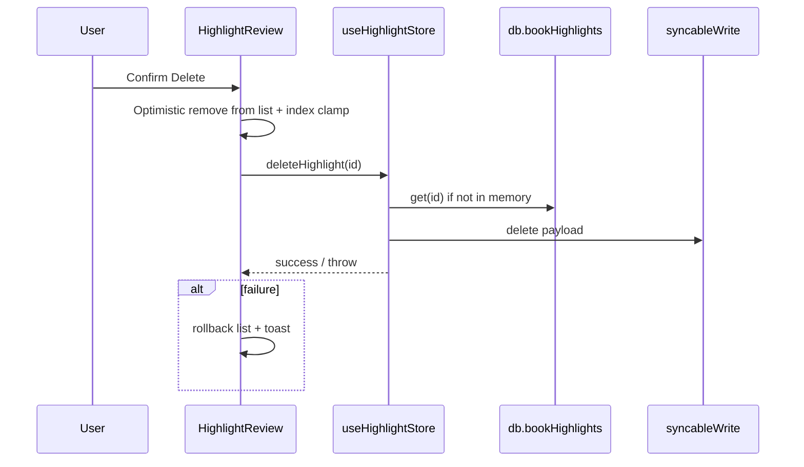

# feat: Delete highlights from Daily Highlight Review

## Summary

Add a **permanent delete** path on `/highlight-review` so users can remove a highlight from the library (Dexie + sync) while on the review page. **Dismiss** remains a soft “hide from this queue” action; **Delete** matches reader behavior and removes the record. The implementer should first fix `useHighlightStore.deleteHighlight` to load the target row from Dexie when it is not already in the store’s in-memory list (today the function no-ops in that case, which would block review-page deletion).

---

## Problem Frame

Daily Highlight Review only offers **Keep** and **Dismiss**. Users who want to remove a highlight entirely must open the book in the reader and delete from the popover. That is undiscoverable and slow for a review-only session.

---

## Requirements

- R1. The review page exposes a clear **Delete** (or equivalent) control for the current card.
- R2. Deleting **permanently removes** the `bookHighlights` row (same persistence and sync behavior as deleting from the reader).
- R3. **Dismiss** and **Keep** behavior stays unchanged (still `reviewRating` + `lastReviewedAt` updates only).
- R4. Destructive action uses a **confirmation** step so accidental deletes are unlikely.
- R5. On success, the card leaves the current session list and pagination/index stay consistent; on failure, show feedback and **do not** leave the UI in a lying state.

---

## Scope Boundaries

- Not in scope: deleting or orphan-handling **linked flashcards** when `highlight.flashcardId` is set (same as reader delete today — flashcard may remain).
- Not in scope: batch delete, undo toast, or trash/archive semantics.

### Deferred to Follow-Up Work

- Optional: copy or tooltip explaining **Dismiss vs Delete** if user testing shows confusion.

---

## Context & Research

### Relevant Code and Patterns

- Page: `src/app/pages/HighlightReview.tsx` — loads candidates from `db.bookHighlights`, `handleRate` optimistic updates + `db.bookHighlights.update` for ratings.
- Card: `src/app/components/highlights/HighlightReviewCard.tsx` — Keep / Dismiss, footer actions.
- Store: `src/stores/useHighlightStore.ts` — `deleteHighlight` uses `syncableWrite('bookHighlights', 'delete', …)` and `highlight:deleted` event; **currently returns early** if `get().highlights.find` misses the id (store is scoped to the reader’s loaded book).
- Reader delete UX: `HighlightPopover` / `HighlightMiniPopover` — two-step confirm pattern for delete (`aria-label` “Confirm delete highlight”).
- Sync contract: `src/lib/sync/__tests__/p1-highlights-vocabulary-sync.test.ts` — delete queues `{ id }` payload.

### Institutional Learnings

- None specific; follow existing highlight sync tests when touching `deleteHighlight`.

### External References

- None required — local sync and Dexie patterns are established.

---

## Key Technical Decisions

- **Use `useHighlightStore.deleteHighlight` from the review page** after extending it to resolve the highlight from `db.bookHighlights.get(id)` when not in memory. Rationale: one deletion pipeline (sync queue + event bus), avoids duplicating `syncableWrite` in the page.
- **Confirmation:** Use `AlertDialog` (shadcn) or the same two-step pattern as the reader; `AlertDialog` is acceptable if it keeps mobile layouts simple (single modal vs double-tap).
- **Optimistic UI:** Mirror `handleRate`’s snapshot/ref rollback pattern: remove the card from local `highlights` state and adjust `currentIndex`; on failure, restore snapshot and toast.

---

## Open Questions

### Resolved During Planning

- *Should delete reuse the store?* — Yes, after Dexie fallback fix.

### Deferred to Implementation

- Exact control placement (header icon vs footer button vs overflow menu) — choose what fits existing `HighlightReviewCard` layout without crowding small viewports.

---

## High-Level Technical Design

> *This illustrates the intended approach and is directional guidance for review, not implementation specification. The implementing agent should treat it as context, not code to reproduce.*

---

## Implementation Units

- U1. **Extend `deleteHighlight` for off–reader deletion**

**Goal:** Deleting a highlight works even when that book was never loaded into the Zustand highlight list (e.g. from `/highlight-review`).

**Requirements:** R2, R5

**Dependencies:** None

**Files:**
- Modify: `src/stores/useHighlightStore.ts`
- Test: `src/lib/sync/__tests__/p1-highlights-vocabulary-sync.test.ts`

**Approach:**
- If `get().highlights.find(id)` is missing, load `await db.bookHighlights.get(highlightId)` and proceed; if still missing, return (preserve today’s no-op for unknown ids).
- Apply optimistic Zustand removal **only** when the highlight was present in `state.highlights`; otherwise skip in-memory highlight-array mutation but still delete via sync path.
- Rollback optimistic state only when an optimistic removal was performed.

**Patterns to follow:** Existing `deleteHighlight` try/catch and `persistWithRetry` usage.

**Test scenarios:**
- **Integration:** After seeding Dexie with a highlight **without** loading that book via `loadHighlightsForBook`, call `deleteHighlight(id)` — expect row gone from Dexie and queue entry shape unchanged from today’s delete test.
- **Happy path:** Existing test — delete when highlight **is** in store — still passes.

**Verification:** Extended sync test passes; reader flows unchanged.

---

- U2. **Review page: delete handler + rollback**

**Goal:** Wire delete from UI to the store; keep list/index/ratings consistent.

**Requirements:** R1, R4, R5

**Dependencies:** U1

**Files:**
- Modify: `src/app/pages/HighlightReview.tsx`
- Test: `tests/e2e/story-e109-s02.spec.ts`

**Approach:**
- Add `handleDelete` analogous to `handleRate`: snapshot `highlightsRef` / `ratingsRef`, remove highlight from `highlights`, clamp `currentIndex`, drop `ratings[id]`, call `useHighlightStore.getState().deleteHighlight(id)` (or hook if preferred).
- On error: rollback + `toast.error`.
- Optionally close `ClozeFlashcardCreator` if the deleted id matches `clozeHighlight`.

**Patterns to follow:** `handleRate` optimistic + ref snapshot in the same file.

**Test scenarios:**
- **E2E Happy path:** Seed ≥1 highlight, open `/highlight-review`, trigger delete confirm — quote disappears and empty state or remaining cards show correct count.
- **E2E Edge case:** Delete the only highlight — empty state visible.
- **Error path:** If implementer can simulate failure without heavy mocking, optional; otherwise rely on unit/integration coverage of store.

**Verification:** E2E passes; manual spot-check delete vs dismiss still distinct.

---

- U3. **Review card: Delete entry point + confirmation**

**Goal:** Visible delete affordance and confirm dialog before calling `onDelete`.

**Requirements:** R1, R4

**Dependencies:** U2 (can be developed in parallel if props are agreed)

**Files:**
- Modify: `src/app/components/highlights/HighlightReviewCard.tsx`
- Test: component tests only if an existing test file covers this card; otherwise E2E in U2 is sufficient **or** add `HighlightReviewCard.test.tsx` if adding non-trivial dialog logic in the card.

**Approach:**
- Add optional `onDelete?: (highlightId: string) => void` (or `onRequestDelete` after confirm).
- Render a destructive secondary control (e.g. `Trash2` + “Delete” or icon button with `aria-label`) and **AlertDialog**: title/body explaining permanent removal, Cancel / Delete.
- Ensure focus management and `aria` labels for accessibility.

**Patterns to follow:** `Button` variants used elsewhere; destructive actions use clear labeling.

**Test scenarios:**
- **Happy path:** Dialog opens, confirm calls handler once.
- **Edge case:** Cancel closes dialog without calling delete.

**Verification:** E2E from U2 exercises integrated flow; dialog behaves correctly in responsive layout.

---

## System-Wide Impact

- **Interaction graph:** `bookHighlights` row removal; sync queue; `highlight:deleted` emission (unchanged from store).
- **Error propagation:** Toast on failure; rollback local review session state.
- **State lifecycle risks:** Clamp index when removing current item; avoid negative index when list becomes empty.
- **API surface parity:** Same deletion semantics as reader — no new public APIs.
- **Unchanged invariants:** Rating fields for non-deleted highlights; export dialog; navigation routes.

---

## Risks & Dependencies

| Risk | Mitigation |
|------|------------|
| Store change affects reader | Keep reader path behavior identical when highlight is in memory; add test for off-memory delete only. |
| User confuses Dismiss vs Delete | Short dialog copy; optional follow-up tooltip (deferred). |

---

## Documentation / Operational Notes

- None unless product docs mention highlight review; skip unless team maintains a user guide.

---

## Sources & References

- Related code: `src/app/pages/HighlightReview.tsx`, `src/stores/useHighlightStore.ts`, `src/app/components/highlights/HighlightReviewCard.tsx`
- Tests: `tests/e2e/story-e109-s02.spec.ts`, `src/lib/sync/__tests__/p1-highlights-vocabulary-sync.test.ts`
