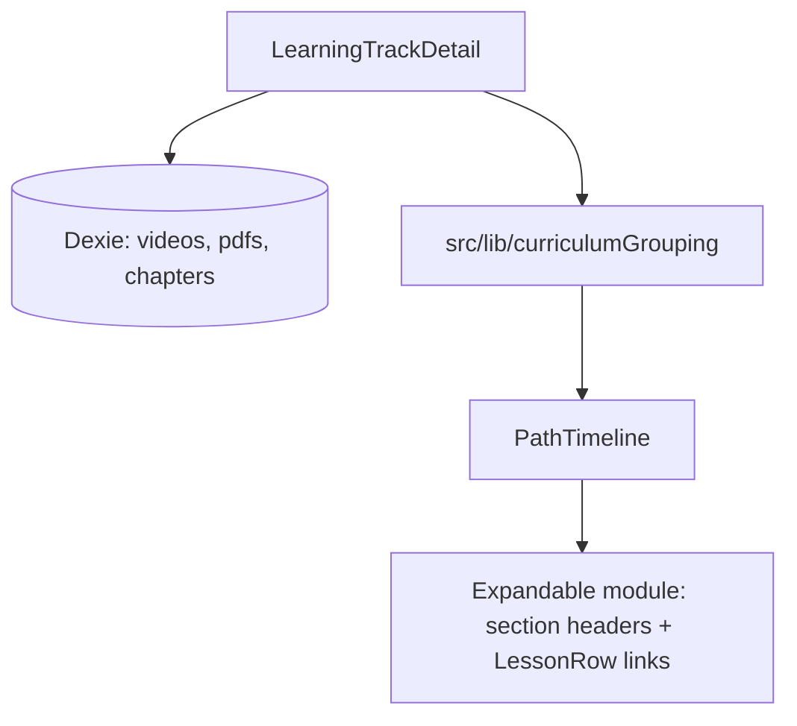

# feat: Group syllabus lessons on learning track detail like course overview

## Overview

On `/learning-tracks/:trackId`, the Syllabus section uses `PathTimeline` with an expanded lesson list built from a **flat** `videosByCourse` map. Lesson titles appear as a single run (e.g. generic numbered stems), with **no chapter or folder grouping**. The course landing page (`CourseOverview` at `/courses/:courseId`) already groups curriculum by **YouTube playlist chapters** (when `youtubeChapters` exist) or by **local folder paths**, then sorts lessons with `sortImportedVideosForCurriculum`. This plan aligns track syllabus expansion with that behavior by sharing grouping logic and feeding grouped structure into `PathTimeline`.

## Problem Frame

Learners expect the same mental model on a track as on a course: modules (path courses) contain **subsections** (chapters or folders) with lessons underneath. Today the track view only mirrors the course-level “module” accordion (each path course) but not the **inner** grouping users see on `courses/:id`, which makes long YouTube imports look like an undifferentiated list.

**Related context:** The learning tracks shell is described in [docs/plans/2026-05-09-001-feat-learning-tracks-pages-plan.md](docs/plans/2026-05-09-001-feat-learning-tracks-pages-plan.md). That plan did not specify inner-lesson grouping; this plan is an incremental UX parity fix.

## Requirements Trace

- **R1.** Expanded syllabus lessons for an imported course on the track detail page use the **same grouping rule** as `CourseOverview`: chapter-based groups when the course is YouTube-sourced and chapter rows exist; otherwise folder-based groups (path segments from `ImportedVideo.path`, consistent with `groupByFolder` + PDF-aware folder merge on the course page).
- **R2.** Within each group, lesson order matches the course overview: apply `sortImportedVideosForCurriculum` per group after grouping.
- **R3.** When only a **single** untitled group exists (typical for YouTube with no chapters), the UI stays visually compact—no redundant stacked headers (equivalent to today’s flat list).
- **R4.** `PathTimeline` consumers that only pass `videosByCourse` (no grouped map) continue to behave as today (backward compatible).
- **R5.** No new Dexie tables; reuse existing `importedVideos`, `importedPdfs`, `youtubeChapters`, and course metadata from `importedCourses`.

## Scope Boundaries

- **Non-goals:** Redesign of the outer path timeline (course cards), drag-and-drop on `/learning-tracks`, or matching every pixel of `CourseOverview`’s “Course Journey” rail (different layout; only **grouping parity** for nested lessons).
- **Non-goals:** Listing PDFs inside the expanded accordion unless product explicitly asks—`CourseOverview`’s expanded module list currently renders **videos only**; this plan matches that to avoid scope creep.
- **Non-goals:** Changing `/learning-paths/:id` unless the same `PathTimeline` props are later passed there (currently that page does not supply `videosByCourse`; no change required for parity until product asks).

### Deferred to Separate Tasks

- **E2E snapshot** asserting a specific chapter title string in the track syllabus: optional follow-up if flakiness from fixture data is a concern; prefer unit/integration coverage first.

## Context & Research

### Relevant Code and Patterns

- **Flat expansion (root cause):** `src/app/components/learning-path/PathTimeline.tsx` — `CourseTimelineEntry` renders `videos.map(...)` as a single list (lines ~441–455).
- **Track detail data load:** `src/app/pages/LearningTrackDetail.tsx` — loads `importedVideos` and progress only; does **not** load `youtubeChapters` or `importedPdfs`, so chapter/folder grouping cannot be derived (lines ~95–137).
- **Reference grouping implementation:** `src/app/pages/CourseOverview.tsx` — `groupByChapter`, `groupByFolder`, `groupedContent` useMemo (~274–283), `capabilities?.requiresNetwork && chapters.length > 0` to choose chapter mode. For track context without an adapter, use **`(importedCourses` row `source ?? 'local') === 'youtube'`** and non-empty `youtubeChapters` for the same branch (aligned with `CourseSource` in `src/data/types.ts`).
- **Lesson sort:** `src/lib/sortImportedVideosForCurriculum.ts`.
- **Existing tests:** `src/app/components/learning-path/__tests__/PathTimeline.test.tsx` (`videosByCourse`, expand/collapse).

### Institutional Learnings

- **PathTimeline consolidation:** Prefer optional props on `PathTimeline` over a forked component ([docs/solutions/best-practices/learning-paths-card-navigation-cover-rls-timeline-lessons-2026-05-06.md](docs/solutions/best-practices/learning-paths-card-navigation-cover-rls-timeline-lessons-2026-05-06.md)).
- **Learning tracks patterns:** [docs/solutions/best-practices/learning-tracks-pages-implementation-patterns-2026-05-09.md](docs/solutions/best-practices/learning-tracks-pages-implementation-patterns-2026-05-09.md) — reuse store + Dexie patterns; avoid duplicating navigation assumptions.

### External References

None required; behavior is defined by existing course overview logic.

## Key Technical Decisions

1. **Extract shared grouping helpers** from `CourseOverview` into a small library module (e.g. `src/lib/curriculumGrouping.ts`) exporting the `ChapterGroup` shape, `groupByFolder`, `groupByChapter`, and a named helper such as `buildGroupedCurriculum({ videos, pdfs, chapters, preferChapterGrouping })` that returns groups with videos sorted per group. **Rationale:** One source of truth; `CourseOverview` and `LearningTrackDetail` cannot drift.
2. **New optional prop on `PathTimeline`:** e.g. `lessonGroupsByCourse?: Map<string, ChapterGroup[]>` (or equivalent serializable structure). When present for a `courseId`, expanded content renders **section headers + lesson rows**; when absent, fall back to `videosByCourse` flat list (**R4**).
3. **Data loading in `LearningTrackDetail`:** Extend the existing `Promise.all` to fetch, per course id in the path: `youtubeChapters` (`.where('courseId').equals(id).sortBy('order')` with catch → `[]`), and `importedPdfs` (for folder grouping parity with `groupByFolder`). Batch all course ids in parallel to avoid N sequential round-trips.
4. **Single-group UX:** If `buildGroupedCurriculum` yields exactly one group with an empty `title`, render lessons **without** an inner section header (**R3**).

## Open Questions

### Resolved During Planning

- **How to detect “YouTube mode” without `useCourseAdapter`?** Use `ImportedCourse.source === 'youtube'` (treat `undefined` as local) plus `chapters.length > 0`, matching `CourseOverview`’s intent with `requiresNetwork`.

### Deferred to Implementation

- **Exact export surface** (`buildGroupedCurriculum` vs inline calls): choose minimal API that keeps `CourseOverview` diff small.
- **Catalog-only path entries:** If `courseId` has no local videos, grouped map entry may be empty; timeline already handles no lessons.

## High-Level Technical Design

> *This illustrates the intended approach and is directional guidance for review, not implementation specification. The implementing agent should treat it as context, not code to reproduce.*

## Implementation Units

- [x] **Unit 1: Extract curriculum grouping library**

**Goal:** Single implementation of folder/chapter grouping and per-group sort used by both course overview and track detail.

**Requirements:** R1, R2, R5

**Dependencies:** None

**Files:**
- Create: `src/lib/curriculumGrouping.ts` (or equivalent name)
- Modify: `src/app/pages/CourseOverview.tsx` (replace inline helpers with imports)
- Test: `src/lib/__tests__/curriculumGrouping.test.ts`

**Approach:** Move `ChapterGroup`, `getFolderName`, `groupByFolder`, `groupByChapter` from `CourseOverview` into the library. Add `buildGroupedCurriculum` that applies `sortImportedVideosForCurriculum` to each group’s `videos` array. Keep `CourseOverview` behavior identical (verify `groupedContent` structure and labels unchanged).

**Patterns to follow:** Existing naming and chapter iteration order in `CourseOverview` (`groupByChapter`).

**Test scenarios:**
- **Happy path:** YouTube course with two chapter titles yields two groups with correct video assignment.
- **Happy path:** Local videos with paths `a/x.mp4` and `b/y.mp4` yield two folder groups.
- **Edge case:** Empty `chapters` array + YouTube source falls back to folder grouping (same as overview when no chapters).
- **Edge case:** All videos in root path (`folder === ''`) yield one group; title handling matches prior `CourseOverview` module labeling where applicable.

**Verification:** `CourseOverview` curriculum section still renders; unit tests pass.

---

- [x] **Unit 2: Load chapters and PDFs on `LearningTrackDetail` and build grouped map**

**Goal:** Provide `lessonGroupsByCourse` for every non-gap course on the track.

**Requirements:** R1, R2, R3, R5

**Dependencies:** Unit 1

**Files:**
- Modify: `src/app/pages/LearningTrackDetail.tsx`
- Test: extend `tests/e2e/learning-tracks.spec.ts` **or** rely on Unit 3 component tests only — prefer component tests unless a stable fixture chapter title exists

**Approach:** After videos load, load chapters + PDFs for the same `courseIds` in parallel. For each course, read `ImportedCourse` from `importedCourses` to set `preferChapterGrouping`. Compute `Map<courseId, ChapterGroup[]>` via `buildGroupedCurriculum`. Pass to `PathTimeline` alongside existing `videosByCourse` (keep videos map for stats/back-compat if still useful, or derive counts from groups—implementation choice).

**Test scenarios:**
- **Happy path:** Track with one YouTube course that has chapters produces multiple visible subsection headings in DOM when expanded.
- **Integration:** Opening `/learning-tracks/:trackId` does not regress when a course has zero videos (empty expansion).

**Verification:** Manual spot-check against a course that shows grouped “Course Journey” on `/courses/:id` shows the same subsection boundaries under the track syllabus.

---

- [x] **Unit 3: `PathTimeline` grouped rendering**

**Goal:** Render subsection headers and lesson lists when `lessonGroupsByCourse` is provided.

**Requirements:** R3, R4

**Dependencies:** Unit 2 (for integration); Unit 1 for type imports

**Files:**
- Modify: `src/app/components/learning-path/PathTimeline.tsx`
- Test: `src/app/components/learning-path/__tests__/PathTimeline.test.tsx`

**Approach:** In `CourseTimelineEntry`, if `lessonGroups` prop is non-empty: iterate groups; for each group, if a heading should be shown (multiple groups **or** single group with non-empty `title`), render a compact heading (`text-xs font-semibold text-muted-foreground uppercase tracking-wider` or match `LessonList` / `CourseOverview` inner list density). Reuse `LessonRow` for each video. If `lessonGroups` is absent, keep current `videos` flat map. Avoid breaking `skipCourseId`, gap entries, `simplified`, and keyboard/ARIA behavior on cards.

**Test scenarios:**
- **Happy path:** `lessonGroupsByCourse` with two titled groups shows two headings and correct lesson links.
- **Happy path:** Single untitled group shows **no** inner heading but shows lesson rows (regression guard for R3).
- **Regression:** When only `videosByCourse` is passed (no lesson groups), existing tests for flat lists still pass.

**Verification:** All `PathTimeline` tests green; no visual regression on locked / gap entries.

## System-Wide Impact

- **Interaction graph:** `PathTimeline` props surface grows; only `LearningTrackDetail` expected to pass grouped data initially.
- **Error propagation:** Dexie chapter/pdf reads should fail-soft (empty array) like `CourseOverview` does for chapters.
- **State lifecycle risks:** Maps rebuilt when `courseEntries` or loaded assets change; ensure effect dependencies include new loads.
- **Unchanged invariants:** `/learning-paths` editor flow, gap resolution, and course player routes stay the same.

## Risks & Dependencies

| Risk | Mitigation |
|------|------------|
| Duplicated grouping logic if extraction incomplete | Code review checks `CourseOverview` has no stray duplicate helpers |
| Large courses increase syllabus query volume | Single batched `Promise.all` over course ids; no per-render queries |
| `ChapterGroup` type drift | Export type from `curriculumGrouping.ts` and import in both consumers |

## Documentation / Operational Notes

None required beyond optional short comment at `lessonGroupsByCourse` call site explaining parity with `CourseOverview`.

## Sources & References

- Related plan: [docs/plans/2026-05-09-001-feat-learning-tracks-pages-plan.md](docs/plans/2026-05-09-001-feat-learning-tracks-pages-plan.md)
- Related code: `src/app/pages/LearningTrackDetail.tsx`, `src/app/components/learning-path/PathTimeline.tsx`, `src/app/pages/CourseOverview.tsx`
