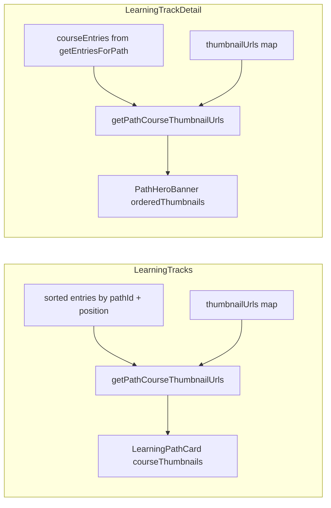

# fix: Align learning track detail hero thumbnails with track cards

## Overview

The learning track listing (`/learning-tracks`) builds each card’s avatar stack by walking **that track’s entries** and collecting course thumbnail URLs **in path order** (first up to four URLs found). The track detail hero (`PathHeroBanner` on `/learning-tracks/:trackId`) incorrectly builds its stack from **`Object.values(thumbnailUrls)`** — an unordered grab from the **global** course-id→URL map. That yields the wrong circular thumbnails on the detail page. This plan aligns the hero with the listing (and syllabus order).

## Problem Frame

Users expect the DevOps track (and every track) to show the **same course covers** on the overview card as on the track detail header. Today the detail hero can show arbitrary covers from elsewhere in the library because it never scopes or orders URLs by the current track’s entries.

## Requirements Trace

- R1. Thumbnails on `/learning-tracks/:trackId` reflect the **same course covers and order** as the track card on `/learning-tracks` for the same track.
- R2. Ordering matches **syllabus order** (`LearningPathEntry.position`), consistent with `getEntriesForPath` on the detail page.
- R3. The algorithm for “which thumbnails appear” matches the listing: iterate entries in path order and collect URLs until reaching the hero’s display cap (currently four URLs in `PathHeroBanner`), **skipping entries that have no thumbnail URL** (same as `pathThumbnails` in `LearningTracks.tsx`).
- R4. `PathHeroBanner` remains usable as a presentation component: callers supply an **already ordered list** (or equivalent) so it does not depend on incidental `Record` enumeration order.

## Scope Boundaries

- In scope: `PathHeroBanner` avatar-stack data source; wiring from `LearningTrackDetail`; aligning listing-side thumbnail iteration with **sorted-by-position** entries (see decisions).
- Non-goals: Changing how thumbnail URLs are fetched (`useLoadCourseThumbnails` / `useCourseImportStore`); redesigning the hero layout; unifying the **+N** overflow chip between card (uses `courseCount > 3` / `+{courseCount - 3}`) and hero (uses `courseCount - 4`) unless implementation naturally falls out — treat as follow-up if product wants pixel-identical chrome.

### Deferred to Separate Tasks

- Optional UX pass: make overflow chip and visible avatar count on the hero match `LearningPathCard` (3 visible + `+{courseCount - 3}`) for pixel parity with cards.

## Context & Research

### Relevant Code and Patterns

- **Listing thumbnail construction** — `src/app/pages/LearningTracks.tsx` (`pathThumbnails` `useMemo`, ~lines 207–221): filters entries by `pathId`, walks in **filter order** (not explicitly sorted), collects up to four URLs.
- **Detail entries** — `src/app/pages/LearningTrackDetail.tsx`: `courseEntries` from `getEntriesForPath(trackId)`, which **sorts by `position`** (`src/stores/useLearningPathStore.ts`).
- **Bug location** — `src/app/components/learning-path/PathHeroBanner.tsx` (~lines 51–53): `Object.values(thumbnailUrls).filter(Boolean).slice(0, 4)` ignores path membership and order.
- **Card display** — `src/app/components/learning-path/LearningPathCard.tsx`: receives `courseThumbnails: string[]` from the parent; footer uses `slice(0, 3)` plus overflow by **course count**.
- **Tests** — `src/app/components/learning-path/__tests__/PathHeroBanner.test.tsx` (avatar stack and overflow cases assume the old `thumbnailUrls` record behavior).
- **Consumer** — `PathHeroBanner` is only referenced from `LearningTrackDetail.tsx` in this repo (grep-confirmed), so the prop contract can change without updating a second page.

### Institutional Learnings

- `docs/solutions/best-practices/learning-tracks-pages-implementation-patterns-2026-05-09.md` — documents shared `PathHeroBanner` and `backUrl` patterns for `/learning-tracks` vs legacy paths; supports keeping one hero component with explicit props rather than forking.

### External References

- None required — local data shaping only.

## Key Technical Decisions

- **Decision: Replace record-based avatar inference with an ordered `string[]` prop for the stack** — Rationale: guarantees order and path scoping; avoids `Object.values` on a global map.
- **Decision: Introduce a small shared pure helper** (e.g. `getPathCourseThumbnailUrls(sortedEntries, thumbnailUrls, limit)`) used by both `LearningTracks` and `LearningTrackDetail` — Rationale: single definition of “walk path order, collect up to N URLs” (R1–R3) and prevents future drift.
- **Decision: When building listing thumbnails, sort filtered entries by `position` (same comparator as `getEntriesForPath`)** — Rationale: Dexie `toArray()` order for `entries` is not guaranteed to match syllabus order; without sorting, the card can disagree with the detail timeline and after this fix would disagree with the hero.

## Open Questions

### Resolved During Planning

- **Q: Should the hero show three avatars like the card?** — **Resolution:** No for this fix; only correct **which** URLs appear and their **order**. Overflow/count chrome can be a follow-up (see Scope).
- **Q: Does `/learning-paths` need the same change?** — **Resolution:** `PathHeroBanner` has no other live consumer in `src/`; no change required for unused routes.

### Deferred to Implementation

- Whether the shared helper lives in `src/lib/` or next to components — choose the least surprising import for both call sites.

## High-Level Technical Design

> *This illustrates the intended approach and is directional guidance for review, not implementation specification. The implementing agent should treat it as context, not code to reproduce.*

## Implementation Units

- [ ] **Unit 1: Shared helper `getPathCourseThumbnailUrls`**

**Goal:** One canonical algorithm for ordered, path-scoped thumbnail URL lists.

**Requirements:** R2, R3

**Dependencies:** None

**Files:**

- Create: `src/lib/learningPathThumbnails.ts` (or alternate path per implementation judgment)
- Test: `src/lib/__tests__/learningPathThumbnails.test.ts`

**Approach:**

- Pure function: inputs are **already sorted** `LearningPathEntry[]`, `Record<string, string>` (or similar) of thumbnail URLs, and integer `limit`.
- Loop entries in order; if `thumbnailUrls[courseId]` is truthy, push; stop when length reaches `limit`.
- Do not allocate per path global maps inside the hero.

**Patterns to follow:**

- Existing listing loop in `LearningTracks.tsx` pathThumbnails `useMemo`.

**Test scenarios:**

- **Happy path:** Three entries with URLs A,B,C → returns `[A,B,C]` when limit is 4.
- **Happy path:** Four entries all with URLs, limit 4 → returns four URLs in entry order.
- **Edge case:** Some entries missing URLs — skip gaps; fewer than limit returned.
- **Edge case:** Empty entries array → empty array.
- **Edge case:** limit 0 → empty array.
- **Edge case:** More than limit entries with URLs → exactly `limit` results, earliest in path order.

**Verification:** Vitest passes; helper has no React or store imports.

---

- [ ] **Unit 2: Use helper on listing + sort entries by position**

**Goal:** Track cards use syllabus-ordered thumbnails via the shared helper.

**Requirements:** R1, R2, R3

**Dependencies:** Unit 1

**Files:**

- Modify: `src/app/pages/LearningTracks.tsx`
- Test expectation: none — behavior covered by Unit 1 and existing E2E where applicable; optional regression test only if a lightweight unit test around the memo is easy without mounting the full page.

**Approach:**

- Replace inline `pathThumbnails` loop with: filter by `pathId`, **sort by `position`**, then `getPathCourseThumbnailUrls(..., 4)` (or the card’s effective cap if different — today the memo collects up to four; card displays three; keep memo at four unless product changes).

**Patterns to follow:**

- `getEntriesForPath` sort semantics in `useLearningPathStore.ts`.

**Test scenarios:**

- **Test expectation: none —** logic is exercised by Unit 1; E2E `tests/e2e/learning-tracks.spec.ts` remains green.

**Verification:** Manual or E2E: open `/learning-tracks`, note first three thumbnails for a multi-course track; open detail; hero stack uses the **same URLs in the same relative order** for the visible slots.

---

- [ ] **Unit 3: Detail page + PathHeroBanner contract + tests**

**Goal:** Hero receives ordered thumbnails derived from `courseEntries` and `thumbnailUrls`.

**Requirements:** R1, R3, R4

**Dependencies:** Unit 1

**Files:**

- Modify: `src/app/pages/LearningTrackDetail.tsx`
- Modify: `src/app/components/learning-path/PathHeroBanner.tsx`
- Modify: `src/app/components/learning-path/__tests__/PathHeroBanner.test.tsx`

**Approach:**

- In `LearningTrackDetail`, `useMemo` ordered thumbnails via `getPathCourseThumbnailUrls(courseEntries, thumbnailUrls, 4)`.
- Pass a new prop (e.g. `orderedCourseThumbnails` / `avatarThumbnailUrls`) to `PathHeroBanner`; remove use of `thumbnailUrls` **for the avatar stack only** if no longer needed, or keep `thumbnailUrls` only if another part of the banner needs it (today it does not — **detail page** can stop passing the full record to the hero if unused).
- In `PathHeroBanner`, map over the ordered array for `` keys (prefer stable keys from URL or index with documented rationale).
- Recompute `overflowCount` for the `+N` chip: keep **course-count-based** `Math.max(0, courseCount - 4)` unless product requests alignment with cards; document in code comment if ambiguous.

**Patterns to follow:**

- Same URL collection semantics as listing.

**Test scenarios:**

- **Happy path:** Pass `orderedCourseThumbnails: [urlA, urlB]` — two images render in DOM order matching array order.
- **Edge path:** Ordering — Pass URLs that **would differ** from `Object.values` lexicographic shuffling (use distinct URLs and assert `img` src order matches prop order — proves hero does not reorder arbitrarily).
- **Edge case:** Empty ordered list with `courseCount > 0` — placeholder (`BookOpen`) still shows where applicable (current behavior).
- **Edge case:** `courseCount` > displayed URL count — overflow chip still reflects course-based rule currently in component.
- **Integration:** Rendering test with `LearningTrackDetail` is optional if too heavy; component-level hero tests are sufficient if ordering is explicit.

**Verification:** `PathHeroBanner` tests green; manual check DevOps track matches listing screenshots.

## System-Wide Impact

- **Interaction graph:** `LearningTrackDetail` → `PathHeroBanner` props; `LearningTracks` memo for `pathThumbnails`.
- **Error propagation:** None — pure URL resolution; missing URLs already skipped.
- **State lifecycle risks:** None — derived from existing store state.
- **API surface parity:** `PathHeroBanner` prop change is internal to this repo’s only consumer.
- **Unchanged invariants:** Thumbnail **fetching** and `ContinueLearningBento` / timeline still use `thumbnailUrls[courseId]` as today.

## Risks & Dependencies

| Risk | Mitigation |
|------|------------|
| Listing entries were implicitly unsorted; sorting changes card thumbnails for edge cases where DB order ≠ position | Product-intent aligned with syllabus; call out in PR for QA |

## Documentation / Operational Notes

- None required; optionally add one line to `docs/solutions/best-practices/learning-tracks-pages-implementation-patterns-2026-05-09.md` **after merge** if the team wants the thumbnail rule recorded (defer unless asked).

## Sources & References

- Related code: `src/app/pages/LearningTracks.tsx`, `src/app/pages/LearningTrackDetail.tsx`, `src/app/components/learning-path/PathHeroBanner.tsx`
- Institutional: [learning-tracks-pages-implementation-patterns-2026-05-09.md](docs/solutions/best-practices/learning-tracks-pages-implementation-patterns-2026-05-09.md)
