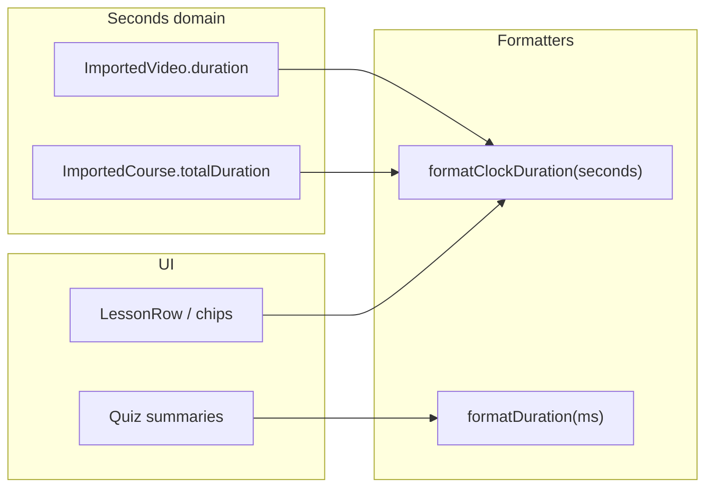

# fix: Correct syllabus and timeline duration display (seconds vs ms)

## Overview

Lesson rows on the unified syllabus (`LessonRow` in `TimelinePrimitives.tsx`) and duration chips on learning-track timeline cards (`PathTimeline.tsx`, `SortableCourseTimelineEntry.tsx`) call `formatDuration` from `src/lib/formatDuration.ts`, whose parameter is **milliseconds**. `ImportedVideo.duration` and `ImportedCourse.totalDuration` / `PathCourseInfo.totalDuration` are stored and documented as **seconds** (`src/data/types.ts`). Dividing seconds by 1000 collapses typical lesson lengths to **0–1s** in the UI, while aggregate clocks on `CourseOverview` look correct because that page imports **`formatClockDuration` aliased as `formatDuration`**.

This plan aligns timeline/syllabus surfaces with the seconds domain and preserves quiz/time-tracking callers that legitimately pass milliseconds.

## Problem Frame

Learners see **0s**, **1s**, or otherwise meaningless per-lesson durations (and wrong module chips on track timelines) despite valid metadata in IndexedDB. Screenshots match a **unit mismatch**, not an empty data bug—module-level clock strings can still appear plausible where `formatClockDuration` is used.

## Requirements Trace

- **R1.** Per-lesson duration badges on `/courses/:courseId` expanded syllabus rows reflect each video’s stored length in seconds (readable clock-style string consistent with other course headers).
- **R2a.** Expanded lesson rows on `/learning-tracks/:trackId` (same `LessonRow` as course syllabus) show correct per-video durations in seconds.
- **R2b.** The **learning-track timeline entry duration chip** (clock icon + aggregate time beside lesson counts on each course card) uses seconds-backed `PathCourseInfo.totalDuration` with clock formatting—matching course-detail semantics.
- **R2** *(rollup)* — Satisfied only when **R2a** and **R2b** both ship (typically Units 1 and 2 together).
- **R3.** Quiz attempt history and score summary (`AttemptHistory`, `ScoreSummary`) continue to format `timeSpent` correctly (**milliseconds** unchanged).
- **R4.** Lessons with `duration === 0` keep current behavior (no misleading badge where `LessonRow` already guards on `> 0`).

## Scope Boundaries

- **Non-goals:** Changing import pipelines to backfill missing durations; redesigning whether to show badges for unknown length; altering legacy redirect-only behavior at `/learning-paths/*` (see `src/app/routes.tsx`).
- **Deferred:** Broader rename of `formatDuration` → `formatDurationMs` repo-wide (optional follow-up to reduce recurrence).
- **Deferred / separate scrub:** Other files may still pass **seconds** into `formatDuration(ms)` (e.g. reorder dialogs, library audiobook helpers). Unit 3 documents them for follow-up; fixing them is **not** required to close this plan unless explicitly expanded.

## Context & Research

### Relevant Code and Patterns

- **`src/lib/formatDuration.ts`** — `formatDuration(ms)` for compact `Xm Ys` strings from **ms**; **`formatClockDuration(seconds)`** for **seconds** (`H:MM:SS` / `M:SS`).
- **`src/app/pages/CourseOverview.tsx`** — imports `formatClockDuration as formatDuration` for totals/module lines (**correct** seconds domain).
- **`src/app/components/course/CourseHeader.tsx`** — same alias pattern.
- **`src/app/components/learning-path/TimelinePrimitives.tsx`** — `LessonRow` uses raw `formatDuration` + `video.duration` (**bug**).
- **`src/app/components/learning-path/PathTimeline.tsx`** — `formatDuration(info!.totalDuration!)` (**bug** if `totalDuration` is seconds).
- **`src/app/components/learning-path/SortableCourseTimelineEntry.tsx`** — same chip bug as PathTimeline.
- **`src/app/components/course/tabs/LessonsTab.tsx`** — `formatLessonDuration(seconds)` duplicates clock logic (acceptable reference; prefer shared `formatClockDuration` for syllabus rows to avoid coupling syllabus to player tab).
- **`src/types/quiz.ts`** — `QuizAttempt.timeSpent` is **ms**; paired correctly with `formatDuration` today.

### Institutional Learnings

- Syllabus surfaces for course detail and learning-track timeline were unified around **`TimelinePrimitives` / `LessonRow`** — fixing duration plumbing once fixes both routes ([`docs/solutions/best-practices/course-detail-syllabus-unification-implementation-lessons-2026-05-12.md`](docs/solutions/best-practices/course-detail-syllabus-unification-implementation-lessons-2026-05-12.md)).
- Sortable vs read-only timeline entries intentionally duplicate card JSX — **both** paths must be updated ([`docs/solutions/best-practices/learning-track-detail-reorder-implementation-lessons-2026-05-14.md`](docs/solutions/best-practices/learning-track-detail-reorder-implementation-lessons-2026-05-14.md)).

### External References

None required — behavior is local formatter contract clarity.

## Key Technical Decisions

- **Use `formatClockDuration` for syllabus rows and timeline chips** — Matches `CourseOverview` / `CourseHeader` and avoids passing `seconds * 1000` into `formatDuration`, which would preserve confusing naming (`formatDuration` stays ms-only).
- **Do not change `@/lib/formatDuration`’s `formatDuration` signature** — Quiz and other ms-domain callers stay stable; reduces blast radius.
- **Optional micro-follow-up:** Correct the stale/misleading header comment block atop `formatDuration.ts` (today it mixes ms + clock docs awkwardly) when touching the file.

## Open Questions

### Resolved During Planning

- **Are durations missing from Dexie?** Unlikely for “0s everywhere” when aggregates look sane; `LessonRow` only renders a badge when `duration > 0`, so visible **“0s”** implies positive seconds mis-formatted.
- **Does `/learning-paths/:id` differ from tracks?** Legacy route redirects to **`/learning-tracks/:trackId`** — one implementation surface.
- **Clock vs compact strings for lesson rows:** **Resolved — ship `formatClockDuration` (clock parity)** with course/module headers and existing E2E expectations (`12:30`-style substrings). Any future compact “12m 30s” lesson-row style is **UX polish only**, out of scope here.

### Deferred to Implementation

- None blocking.

## High-Level Technical Design

> *This illustrates the intended approach and is directional guidance for review, not implementation specification. The implementing agent should treat it as context, not code to reproduce.*

## Implementation Units

- [ ] **Unit 1: Fix `LessonRow` duration formatting**

**Goal:** Per-lesson syllabus links show correct lengths on course detail and any consumer of `LessonRow`.

**Requirements:** R1, **R2a**, R4

**Dependencies:** None

**Files:**
- Modify: `src/app/components/learning-path/TimelinePrimitives.tsx`
- Test: `src/app/components/learning-path/__tests__/TimelinePrimitives.test.tsx` *(create if Vitest + RTL patterns exist nearby; otherwise extend nearest component test harness)*

**Approach:**
- Import `formatClockDuration` from `@/lib/formatDuration`.
- Replace `formatDuration(video.duration)` with `formatClockDuration(video.duration)` inside `LessonRow`.
- Remove unused `formatDuration` import from this module.

**Patterns to follow:** `CourseOverview.tsx` / `CourseHeader.tsx` clock formatting for seconds.

**Test scenarios:**
- **Happy path:** `ImportedVideo` with `duration: 125` renders badge containing **`2:05`** (not **`0s`**).
- **Edge case:** `duration: 0` — no duration badge rendered (existing guard).
- **Edge case:** `duration >= 3600` — renders hour-padded clock fragment consistent with `formatClockDuration`.

**Verification:** Expanded syllabus on a seeded course shows sensible per-row clocks matching metadata seconds.

---

- [ ] **Unit 2: Fix learning-track timeline entry duration chip**

**Goal:** The aggregate duration beside lesson counts on each **learning-track timeline entry card** (clock icon line) matches seconds-backed `PathCourseInfo.totalDuration`.

**Requirements:** **R2b** *(R2 rollup completes with Unit 1)*

**Dependencies:** Unit 1 *(conceptual parity; may land same commit)*

**Files:**
- Modify: `src/app/components/learning-path/PathTimeline.tsx`
- Modify: `src/app/components/learning-path/SortableCourseTimelineEntry.tsx`
- Test: extend existing learning-path component tests if present; otherwise add focused tests under `src/app/components/learning-path/__tests__/` for chip text given `totalDuration` seconds

**Approach:**
- Swap chip formatting from `formatDuration(totalDuration)` to `formatClockDuration(totalDuration)` (import explicitly; drop misleading alias).
- Ensure **editable** and **read-only** card branches both updated (`SortableCourseTimelineEntry` duplicates markup).

**Test scenarios:**
- **Happy path:** `totalDuration: 5268` renders **`1:27:48`** (matches user expectation from screenshots).
- **Edge case:** `totalDuration` undefined / zero — confirm existing conditional rendering still avoids junk strings.

**Verification:** `/learning-tracks/:trackId` timeline entry chips align with summed lesson metadata for the same course.

---

- [ ] **Unit 3: Scoped grep guard + quiz non-regression**

**Goal:** Confirm timeline/syllabus paths no longer pass seconds into `formatDuration(ms)`; quiz ms callers untouched.

**Requirements:** R3

**Dependencies:** Units 1–2

**Files:**
- Modify (optional doc-only): `src/lib/formatDuration.ts` — tighten top-of-file comment so `formatDuration` is clearly **milliseconds** and `formatClockDuration` is **seconds**.
- Verify unchanged: `src/app/components/quiz/AttemptHistory.tsx`, `src/app/components/quiz/ScoreSummary.tsx`

**Approach:**
- Run a **scoped** `grep` on `@/lib/formatDuration` imports in **`src/app/components/learning-path/`** and **`src/app/pages/CourseOverview.tsx`** (plus any file touched in Units 1–2); confirm only ms-domain callers use `formatDuration`.
- Log any **other** repo hits (reorder dialogs, library, etc.) as **follow-up candidates** — do not expand this PR unless requested.
- **Quiz regression:** Run existing quiz tests; optionally rely on **`src/lib/__tests__/formatDuration.test.ts`** which already pins ms behavior (e.g. **`45000` → `45s`**). No new test file required solely for Unit 3 if that suite stays green.

**Test scenarios:**
- **Regression:** `npm test` / Vitest includes `formatDuration.test.ts` expectations unchanged for ms inputs **or** quiz component tests still pass — pick whichever is already CI-fast for this repo.

**Verification:** CI green; scoped grep checklist satisfied; unrelated seconds/ms mismatches filed as optional follow-up or ignored per scope above.

## System-Wide Impact

- **Interaction graph:** `LessonRow` consumers — `PathTimeline`, `SortableCourseTimelineEntry`, `CourseOverview` syllabus sections — all inherit corrected display.
- **API surface parity:** None; IndexedDB schema unchanged.
- **Unchanged invariants:** `formatDuration(ms)` for quiz timers; YouTube import flows writing seconds into `importedVideos.duration`.

## Risks & Dependencies

| Risk | Mitigation |
|------|------------|
| Hidden third caller passes seconds into `formatDuration` | Unit 3 grep pass; spot-check `PathTimeline`/`TimelinePrimitives` only imports |
| Visual inconsistency clock vs compact legacy strings | Accept clock parity with module headers; note deferred UX polish |

## Documentation / Operational Notes

- Consider a one-line **compound learning** under `docs/solutions/` after merge — only if the team wants institutional memory for **seconds vs ms** formatters (optional; user did not request docs proactively).

## Sources & References

- Related learnings: [`docs/solutions/best-practices/course-detail-syllabus-unification-implementation-lessons-2026-05-12.md`](docs/solutions/best-practices/course-detail-syllabus-unification-implementation-lessons-2026-05-12.md), [`docs/solutions/best-practices/learning-track-detail-reorder-implementation-lessons-2026-05-14.md`](docs/solutions/best-practices/learning-track-detail-reorder-implementation-lessons-2026-05-14.md)
- Types: `src/data/types.ts` (`ImportedVideo.duration`, course `totalDuration`)
