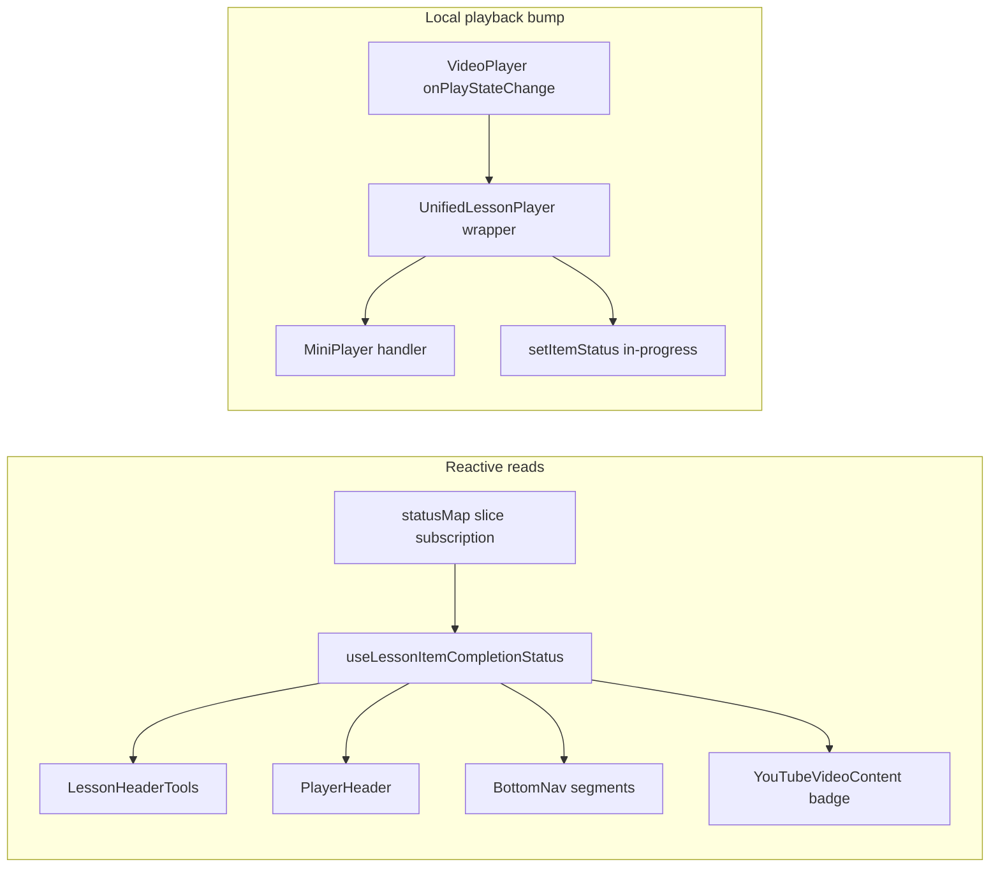

# Fix course lesson completion status navbar sync and playback-driven in-progress

## Overview

The lesson player navbar completion dropdown writes to Dexie/sync via `setItemStatus`, but the button label stays on **Not Started** until something else forces a re-render (for example completion driven by playback end flows). Playback should optionally transition **Not Started → In Progress** automatically for local HTML5 video, and manual selections (**In Progress**, **Completed**) must reflect immediately across the navbar and related UI.

## Problem Frame

Users expect the navbar pill to mirror persisted lesson status and to advance to **In Progress** once they actively watch (local player). Today the dropdown appears broken because UI components subscribe to Zustand in a way that does not re-render when `statusMap` changes (selector returns a stable function reference). Separate gap: **`onPlayStateChange` from `LessonContentRenderer`** is wired for local video but only feeds mini-player behavior today, so no automatic transition to **In Progress** exists for that source type.

Adjacent product context from polish requirements: manual completion should remain compatible with celebrations and sidebar affordances (see origin V1/R2 family in related doc).

## Requirements Trace

- **R1.** Choosing **In Progress** or **Completed** (or reverting to **Not Started**) from the navbar completion control updates the visible pill and `aria-label` immediately without relying on unrelated re-renders.
- **R2.** Persisted `contentProgress` row for the lesson remains correct (already largely working); UI must converge with store after mutations.
- **R3.** For **local** HTML5 playback, the first transition to playing while status is **Not Started** sets status to **In Progress** automatically (debounced/idempotent write acceptable).
- **R4.** Do not downgrade **Completed** or **In Progress** to **Not Started** from passive playback events alone.
- **R5.** **YouTube iframe** playback: document current limitation (`YouTubePlayer` does not expose play/pause/end through the React tree without an IFrame API bridge); scoped follow-up acceptable if bridging is explicitly out of this fix.

## Scope Boundaries

- No redesign of navbar or dropdown visuals.
- No change to Dexie/sync schema.
- Changing `setItemStatus` cascade behavior (`modules` argument) beyond what is necessary to optionally pass modules for sidebar/module rows may be deferred; empty `modules` stays valid for lesson-only rows today.

### Deferred to Separate Tasks

- Wire YouTube IFrame API `postMessage` bridge so **play**, **pause**, **timeupdate**, **ended** parity matches `VideoPlayer` (enables reliable auto **In Progress** / completion for embedded YouTube without user workarounds).

## Context & Research

### Relevant Code and Patterns

- **Broken subscription pattern:** `useContentProgressStore(s => s.getItemStatus)` then calling `getItemStatus(courseId, lessonId)` in render — selector output is stable, so **`statusMap` updates do not re-subscribe-trigger**. Affected surfaces include:
  - `src/app/components/course/LessonHeaderTools.tsx` (navbar tools on lesson routes)
  - `src/app/components/course/PlayerHeader.tsx`
  - `src/app/pages/UnifiedLessonPlayer.tsx` (imports `getItemStatus` similarly for completion flow helpers)
  - `src/app/components/course/YouTubeVideoContent.tsx` (completion badge reads status)
  - `src/app/components/navigation/BottomNav.tsx` (two call sites using `getItemStatus`)
- **Store behavior:** `useContentProgressStore` holds `statusMap` and optimistic-updates before `syncableWrite` (`src/stores/useContentProgressStore.ts`). `setItemStatus(..., [])` is an established call pattern (`handleVideoEnded` in `useCompletionFlow`).
- **Local play callback:** `LessonContentRenderer` passes `onPlayStateChange` to `LocalVideoContent` only (`src/app/components/course/LessonContentRenderer.tsx`); `UnifiedLessonPlayer.tsx` currently passes it only to mini-player plumbing (`miniPlayer.handlePlayStateChange`).
- **YouTube:** `src/app/components/youtube/YouTubePlayer.tsx` documents that play/time/ended callbacks are not wired without IFrame API.

### Institutional Learnings

- Single-write/sync path patterns for Dexie-backed stores apply to persistence but do not substitute for reactive UI subscriptions (`docs/solutions/best-practices/single-write-path-for-synced-mutations-2026-04-18.md` remains valid).

### External References

- Zustand `useSyncExternalStore`-based hooks: selectors must derive from changing state slices (often `useCallback`/`useMemo`-scoped selectors) — see project patterns after local hook extraction.

## Key Technical Decisions

1. **Centralize reactive status read:** Add a tiny hook `useLessonItemCompletionStatus(courseId, lessonId)` (or equivalent) implemented with **`useCallback` selector over `statusMap[\`${courseId}:${lessonId}\`]`**, returning `CompletionStatus`, and migrate all affected components to avoid stable-function selectors.

2. **Playback-driven in-progress (local):** In `UnifiedLessonPlayer`, compose `onPlayStateChange` so that when `playing === true`, read **`useContentProgressStore.getState().getItemStatus`** and call `setItemStatus` → `in-progress` only when current status is `not-started`, preserving mini-player wiring.

3. **YouTube scope:** Prefer documenting the gap explicitly in-plan and in-engineer notes over half-implemented polling; optionally add `src/app/components/course/__tests__/...` guarding local behavior only unless bridge lands in this PR.

## Open Questions

### Resolved During Planning

- **Why does completion sometimes appear after playback?** Persist succeeds; intermittent re-render (navigation, sibling state, or flows that subscribe to mutable slices indirectly) exposes the new value — not evidence that persistence fails.

### Deferred to Implementation

- Whether to thread `ImportedCourse.modules` into `LessonHeaderTools` / `UnifiedLessonPlayer` for module-row cascade parity on every mutation (helps sidebar module pills; increases wiring surface).

## High-Level Technical Design

> *This illustrates the intended approach and is directional guidance for review, not implementation specification.*

## Implementation Units

- [ ] **Unit 1: Reactive completion status hook**

**Goal:** One canonical hook/select pattern so UI re-renders whenever the lesson row in `statusMap` changes.

**Requirements:** R1, R2

**Dependencies:** None

**Files:**
- Create: `src/app/hooks/useLessonItemCompletionStatus.ts`
- Modify: imports at each consumer discovered in Phase 1
- Test: extend `src/app/components/course/__tests__/LessonHeaderTools.test.tsx`, add focused store integration test adjacent to `src/stores/__tests__/useContentProgressStore.test.ts` or new hook test file

**Approach:**

- Selector shape: `(state) => courseId && lessonId ? state.statusMap[\`${courseId}:${lessonId}\`] ?? 'not-started' : 'not-started'` with `useCallback` deps `[courseId, lessonId]`.
- Optionally export a key helper reused by tests mirroring internal `toKey(courseId, itemId)` if duplication is noisy.

**Patterns to follow:** Existing callbacks in unified player hooks (`useCompletionFlow.ts` callers already import store actions).

**Test scenarios:**

- Integration — Happy path: mount consumer with real `create` mock store wrapper; update `statusMap` via store action or `useContentProgressStore.setState`; component label updates within same render tick path.
- Unit — Hook: transitioning `undefined` mapped key behaves as **`not-started`**.

**Verification:** Manual smoke: open dropdown, choose **In Progress** — navbar updates without navigation.

---

- [ ] **Unit 2: Migrate Navbar + auxiliary consumers**

**Goal:** Eliminate unstable selectors everywhere users see stale completion state.

**Requirements:** R1, R2

**Dependencies:** Unit 1

**Files:**
- Modify: `src/app/components/course/LessonHeaderTools.tsx`
- Modify: `src/app/components/course/PlayerHeader.tsx`
- Modify: `src/app/components/navigation/BottomNav.tsx` *(both occurrences)*
- Modify: `src/app/components/course/YouTubeVideoContent.tsx`
- Modify: `src/app/pages/UnifiedLessonPlayer.tsx` *(if any render path derives visible status from selector — keep `getState()` reads only where imperative logic needs fresh snapshot)*

**Approach:**

- Replace `useContentProgressStore(s => s.getItemStatus)` + call pattern with hook or inline `useCallback` selector on `statusMap`.
- Preserve guest gating (`LessonHeaderTools` hides dropdown for guests).
- Preserve `showCompletionToggle` semantics in `PlayerHeader`.

**Test scenarios:**

- Happy path — `LessonHeaderTools.test.tsx`: simulate store mutation reflecting new status string and assert rendered `aria-label` updates (currently mock returns static getter — tighten mock to emulate store subscription or pivot to shallow store wrapper).

**Verification:** Storybook/manual not required beyond tests; regressions guarded by RTL.

---

- [ ] **Unit 3: Local playback auto «In Progress» wiring**

**Goal:** Satisfy playback-driven progression for local/video lessons routed through `LocalVideoContent`.

**Requirements:** R3, R4

**Dependencies:** Unit 1 *(for readability of status lookups if using hook in unified page; alternatively use `getState()` inside callback to avoid renders)*

**Files:**
- Modify: `src/app/pages/UnifiedLessonPlayer.tsx`
- Optional Modify: `src/app/hooks/useMiniPlayerState.ts` only if consolidating callbacks is cleaner (prefer minimal intrusion)

**Approach:**

- Wrap `miniPlayer.handlePlayStateChange`:
  - Call existing handler unchanged order-wise.
  - When `playing` true AND `courseId`/`lessonId` defined AND resolved lesson source is video and **not PDF**, perform idempotent **`not-started → in-progress`** via `setItemStatus`.
  - Skip autop bump when the resolved source type is **`youtube`** (until an IFrame API bridge exposes play state).
  - Prefer `useContentProgressStore.getState()` to read current completion state inside callback to sidestep stale render snapshots.

**Test scenarios:**

- Integration — Happy path (`UnifiedLessonPlayer.test.tsx` extension): simulate `onPlayStateChange(true)` from mocked renderer; assert `setItemStatus` invoked with `'in-progress'` when initial map `not-started`.
- Edge — No bump when existing status **`completed`**.
- Edge — No bump for PDF lesson type (use existing `lessonTypeResolved` / `isPdf` flags from mocked state hook).

**Verification:** Manual local course: press play → navbar transitions to **In Progress** without dropdown interaction.

---

- [ ] **Unit 4: Regression & E2E alignment**

**Goal:** Automated coverage matches user-visible flows referenced in playwright regression suites.

**Requirements:** R1–R4

**Dependencies:** Units 2–3

**Files:**
- Update: `tests/e2e/regression/story-e04-s01.spec.ts` *(if flaky assumptions about synchronous label refresh exist — align waits)*
- Update: optional `youtube-lesson-player.spec.ts` only if mocks change

**Approach:**

- Ensure status selector assertions wait for DOM post-mutation toast or network idle-equivalent idle (Playwright deterministic patterns per `.claude/rules/testing/test-patterns.md`).

**Test scenarios:**

- E2E — Happy path already present: dropdown change persists visible label (strengthen waits if historically passing due to incidental reload).

**Verification:** Targeted playwright file green in CI posture used by repo.

---

## System-Wide Impact

- **Interaction graph:** Navbar (`Layout` → `LessonHeaderTools`), mobile `BottomNav`, optional `CompletionModal`/auto-advance remain unchanged behaviorally besides fresher reads.
- **Error propagation:** `setItemStatus` failures already toast + rollback map — unchanged expectations.
- **State lifecycle risks:** Avoid feedback loops firing `setItemStatus` on every periodic `playing` heartbeat (HTML5 emits repeat `play`/`playing`?) — gate write on **`not-started` only** once per lifecycle or debounce minimally if player duplicates events unexpectedly (implementation verifies `VideoPlayer` contract).
- **API surface parity:** Any other component using `select(s => s.getItemStatus)` should be GREP-cleaned within this bug scope (extend Unit 2 if new hits appear).

## Risks & Dependencies

| Risk | Mitigation |
|------|-------------|
| YouTube parity gap confusing QA | Explicit release note comment + optional UI doc string / dev comment near `LessonContentRenderer`. |
| Play event duplication causes redundant writes | Guard on previous status **and** dedupe refs keyed by `(courseId, lessonId)`. |
| Broader refactor of Zustand patterns | Restrict to scoped hook + enumerated files; GREP afterward. |

## Documentation / Operational Notes

- Add short changelog note for users: localized video courses auto-mark **In Progress** on play; YouTube awaits IFrame instrumentation.

## Sources & References

- **Related requirements:** `docs/brainstorms/2026-05-02-course-lesson-player-polish-requirements.md` (Verification V1, completion UX family)
- **Core store:** `src/stores/useContentProgressStore.ts`
- **Navbar tools:** `src/app/components/course/LessonHeaderTools.tsx`
