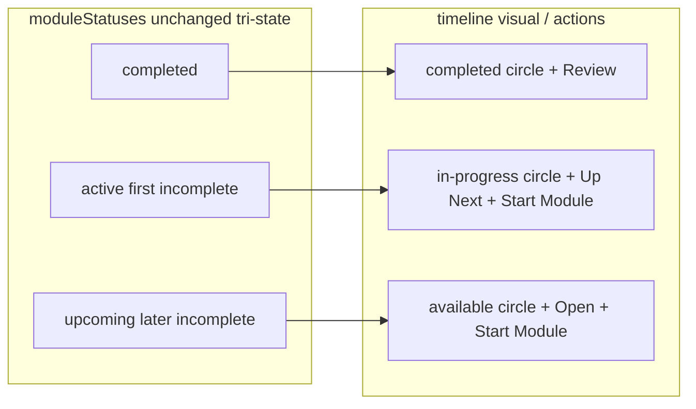

# Non-linear module access on course overview syllabus

## Overview

Today the syllabus on `courses/:courseId` (`CourseOverview`) treats **every module after the first incomplete one as locked**: cards use `pointer-events-none`, hide **Start Module**, and label **Locked**. That is **pure UI gating** derived from `moduleStatuses` (`src/app/pages/CourseOverview.tsx`); `UnifiedLessonPlayer` does **not** enforce module order on navigation.

This plan removes that sequential lock so learners can **expand any module**, use **Start Module** on any incomplete module, and open lesson rows for any module—while keeping a single **Up Next** cue on the first incomplete module whenever any lesson remains incomplete (see **R3**).

## Problem Frame

Learners with multi-module imports (folder-based groups) cannot start later modules until earlier ones reach the watch completion threshold (~90%), even though the player already allows arbitrary `lessonId` URLs. The screenshot behavior (modules 02, 03 … dimmed with **LOCKED**) matches `moduleStatuses` marking later groups as `upcoming` → rendered as `timelineStatus === 'locked'`.

No matching brainstorm requirements doc was found in `docs/brainstorms/` within the last 30 days for this specific behavior change; planning proceeds from this request.

## Requirements Trace

- **R1.** Every syllabus module that has at least one lesson must be **interactively reachable** from the overview: card expand/collapse, **Start Module** (or **Review** when fully complete), and expanded **LessonRow** links—**no** full-card `pointer-events-none` solely because an earlier module is incomplete.
- **R2.** Progress semantics stay honest: a module whose lessons are all ≥ completion threshold remains **Completed**; partial completion stays visible via counts and micro-bar.
- **R3.** Users retain clear **wayfinding**: when at least one lesson is incomplete anywhere in the course, **exactly one** module shows **Up Next**—the **first** incomplete module in syllabus order (same rule as today’s `active` in `moduleStatuses`). When **every** lesson is complete, **no** module shows **Up Next** (all modules **Completed** / **Review**).
- **R4.** Modules that are incomplete but **not** Up Next must **not** use the **Locked** label or padlock affordance; they should read as **available** (copy and timeline styling TBD in implementation, see decisions).
- **R5.** Learning-path timelines (`PathTimeline`, `SortableCourseTimelineEntry`) keep their existing **locked** semantics unless explicitly changed later—this plan scopes to **single-course** `CourseOverview` only.

## Scope Boundaries

- **In scope:** `CourseOverview` syllabus timeline mapping and labels; shared primitives in `TimelinePrimitives` **only** as needed for new visual/action states consumed by `CourseOverview`.
- **Out of scope:** `ImportedCourse.isSequential` in `src/data/types.ts` (field exists but is **not** read by `CourseOverview` today — optional future per-course policy); smart resume / `useNextBestCourse` ordering (`docs/solutions/best-practices/smart-resume-implementation-lessons-2026-05-04.md`) — note compatibility only; fixing **LessonList** “blocked” rows from file-handle verification (`docs/plans/2026-05-14-002-fix-lesson-list-blocked-items-plan.md`) — **different** mechanism.

### Deferred to Separate Tasks

- **Per-course sequential mode:** wire `isSequential` (or a settings flag) to restore linear gating for courses that explicitly require it — product decision needed before implementation.

## Context & Research

### Relevant Code and Patterns

- `src/app/pages/CourseOverview.tsx` — `moduleStatuses` `useMemo` (~218–235): first incomplete group → `active`; later incomplete → `upcoming`; mapped to `timelineStatus` **locked** (~528–532), driving `isLocked`, `StatusCircle`, badge copy (~599–600), and expanded lesson list (~663).
- `src/app/components/learning-path/TimelinePrimitives.tsx` — `StatusCircle` statuses include `'locked'` (hollow dot); `EntryActionButton` returns **`null`** when status is `'locked'` (~213–214).
- `src/app/pages/UnifiedLessonPlayer.tsx` — no module-order guard (deep links already work).
- `tests/e2e/regression/course-overview.spec.ts` — `CourseOverview — sequential course locking` (~347–377): expectations must flip from “locked narrative” to **non-linear access**.
- `src/app/pages/__tests__/CourseOverview.test.tsx` — `does not show action buttons on a locked module card` (~249–269): today asserts a single **Start Module**; must assert **two** when two incomplete modules exist.

### Institutional Learnings

- `docs/solutions/best-practices/course-detail-syllabus-unification-implementation-lessons-2026-05-12.md` — module-level actions are **start / review / progress-style**, separate from whole-course Complete — supports opening any module without implying whole-course completion.
- `docs/solutions/best-practices/smart-resume-implementation-lessons-2026-05-04.md` — centralized “where to resume” remains valid; non-linear browsing does not replace smart resume but **should not assume** syllabus lock matches player enforcement.

### External References

None required — behavior is local UI policy on existing React Router + Dexie progress reads.

## Key Technical Decisions

- **Eliminate `timelineStatus === 'locked'` on `CourseOverview`:** Former `upcoming` modules become **actionable**. Interaction uses the same patterns as today’s “active” module (keyboard-expandable card, `EntryActionButton`, `LessonRow` list).
- **Introduce an explicit “available” lane for styling:** Extend `StatusCircle` (and `EntryActionButton` props if needed) with `'available'` so Path timelines can keep `'locked'` while course overview uses **available vs in-progress vs completed**. *Rejected alternative:* map all incomplete modules to `'in-progress'` for circles — would show multiple identical “Up Next” pulses and confuse **R3**.
- **Badge copy:** **Up Next** stays on the first incomplete module (`moduleStatuses === 'active'`). Later incomplete modules use a neutral label (e.g. **Open** or **Not started**) — implementation picks concise copy consistent with existing uppercase badge style.
- **Accessibility:** Card `aria-label` today branches on Locked (~569); replace with wording that reflects **available** (e.g. “Open module”) for former locked modules.

## Open Questions

### Resolved During Planning

- **Does the player block cross-module lessons?** No — research confirms no prerequisite checks on `UnifiedLessonPlayer`; scope stays overview-side.

### Deferred to Implementation

- **Exact badge string** for non-Up Next incomplete modules (“Open” vs “Not started”) — finalize against UI tone and translation length if i18n appears later.

## High-Level Technical Design

> *This illustrates the intended approach and is directional guidance for review, not implementation specification. The implementing agent should treat it as context, not code to reproduce.*

## Implementation Units

- [ ] **Unit 1: Add “available” timeline primitives for course syllabus**

**Goal:** Allow course overview to show **actionable** incomplete modules that are not Up Next without overloading `'in-progress'` or reusing path **`locked`**.

**Requirements:** R4, R5

**Dependencies:** None

**Files:**
- Modify: `src/app/components/learning-path/TimelinePrimitives.tsx`
- Test: `src/app/components/learning-path/__tests__/TimelinePrimitives.test.tsx`

**Approach:**
- Extend `StatusCircle` union with `'available'` and render a distinct dot (directional: softer than brand pulse, clearly **not** hollow locked — e.g. muted ring or partial brand accent).
- Extend `EntryActionButton` `status` union with `'available'`; render the **same primary action block** as `'in-progress'` (Start Module + optional Complete stack when `onMarkComplete` exists). Keep **`locked`** → `null` for learning-path callers unchanged.

**Patterns to follow:**
- Existing `StatusCircle` / `EntryActionButton` structure and `stopPropagation` on buttons.

**Test scenarios:**
- **Happy path:** `EntryActionButton` with `status="available"` renders **Start Module** and invokes `onClick` when pressed (same as `in-progress` smoke behavior).
- **Happy path:** `StatusCircle` with `status="available"` renders without throwing and remains visually distinct from `'locked'` (snapshot or role/class assertion — pick one stable hook).
- **Edge case:** `EntryActionButton` with `status="locked"` still renders nothing (path parity).

**Verification:**
- Primitives compile; learning-path stories unchanged by default props; new tests green.

---

- [ ] **Unit 2: Rewire `CourseOverview` syllabus statuses**

**Goal:** Stop treating `upcoming` as locked; preserve **Up Next** only on the first incomplete module.

**Requirements:** R1, R2, R3, R4

**Dependencies:** Unit 1

**Files:**
- Modify: `src/app/pages/CourseOverview.tsx`
- Test: `src/app/pages/__tests__/CourseOverview.test.tsx`

**Approach:**
- Keep `moduleStatuses` computation as-is for ordering (`completed` / `active` / `upcoming`).
- Change mapping to `timelineStatus` / `EntryActionButton` props:
  - `completed` → `completed`
  - `active` → `in-progress` (Up Next)
  - `upcoming` → `available` (not locked)
- Remove `isLocked` driving **`pointer-events-none`** and withholding expand/`LessonRow`; gate expansion only on user interaction as today for unlocked cards.
- Update badge row: former `upcoming` modules **must not** use **Locked** or a padlock icon (**R4**); use the chosen **Open** / **Not started** label only—no carve-out for “still locked” on this page.
- Update card `aria-label` branches to remove **Locked** wording for `upcoming`.

**Patterns to follow:**
- Existing `COMPLETION_THRESHOLD`, `progressMap`, `navigate` first incomplete lesson in group (~625–629).

**Test scenarios:**
- **Happy path:** Two-folder seed with two incomplete modules → **two** visible **Start Module** buttons (update prior test that expected exactly one).
- **Happy path:** First incomplete module still shows **Up Next** badge (or equivalent); second shows non-lock badge per copy decision (**R4** — never **Locked**).
- **Happy path (R2):** Mixed completion — module A partially watched, module B untouched — assert **groupCompletedCount / groupLessonCount** and micro-bar percentages match `progressMap` thresholds (same formulas as before change).
- **Integration:** Expand second module — `LessonRow` links present (query by lesson title or href pattern `/courses/:id/lessons/`).
- **Edge case:** Single-module course — behavior matches today (only one incomplete lane).
- **Edge case:** Module fully complete — still **Review**, circle completed.
- **Edge case (R3):** All lessons complete across modules — **no** **Up Next** badge; each module shows completed treatment / **Review** only.

**Verification:**
- Manual smoke: `/courses/:courseId/overview` — module 2+ expandable and navigates to lesson.

---

- [ ] **Unit 3: Align Playwright regression**

**Goal:** Tests describe **non-linear** syllabus behavior; remove obsolete “locked module” expectations.

**Requirements:** R1

**Dependencies:** Unit 2

**Files:**
- Modify: `tests/e2e/regression/course-overview.spec.ts`

**Approach:**
- Rename `CourseOverview — sequential course locking` describe block to reflect **non-linear access** (or remove locking language).
- Replace assertions that implied lock — second module should be **clickable / expandable**, optionally assert **Start Module** visible or lesson link navigable after expand.
- Preserve unrelated hero/curriculum tests unchanged.

**Test scenarios:**
- **Happy path:** Second module card accepts click and reveals lesson list consistent with Unit 2.
- **Happy path (R1):** Second module exposes **Start Module** (or navigable lesson row after expand — pick one stable selector used elsewhere in this spec).
- **Integration:** Click through to a lesson URL from the second module and assert the lesson player route renders expected chrome (reuse existing Playwright patterns from course/player specs if present).

**Verification:**
- E2E suite slice for `course-overview.spec.ts` passes locally / CI.

## System-Wide Impact

- **Interaction graph:** Only `CourseOverview` + `TimelinePrimitives` consumers — **PathTimeline** continues passing `'locked'` for path entries; verify TypeScript unions remain compatible.
- **Error propagation:** None — display-only change.
- **State lifecycle risks:** None — still reads `db.progress` the same way.
- **API surface parity:** Course detail **UnifiedCourseDetail** / **LessonList** file-blocking fix is separate — no requirement to change here.
- **Unchanged invariants:** Dexie schema, `UnifiedLessonPlayer` routing, completion thresholds.

## Risks & Dependencies

| Risk | Mitigation |
|------|------------|
| UX noise — many modules show Start Module | Accept per **R1**; Up Next still singles primary suggestion (**R3**) |
| Divergence vs instructor intent for sequential courses | Deferred **per-course flag**; document product follow-up |

## Documentation / Operational Notes

After shipping, consider a short `docs/solutions/` note capturing **course syllabus = free navigation, smart resume = suggested entry** so future work does not reintroduce accidental lock without an explicit flag.

## Sources & References

- Code: `src/app/pages/CourseOverview.tsx`, `src/app/components/learning-path/TimelinePrimitives.tsx`, `src/app/pages/UnifiedLessonPlayer.tsx`
- Tests: `src/app/pages/__tests__/CourseOverview.test.tsx`, `tests/e2e/regression/course-overview.spec.ts`
- Related plan (orthogonal): `docs/plans/2026-05-14-002-fix-lesson-list-blocked-items-plan.md`
- Learnings: `docs/solutions/best-practices/course-detail-syllabus-unification-implementation-lessons-2026-05-12.md`, `docs/solutions/best-practices/smart-resume-implementation-lessons-2026-05-04.md`
