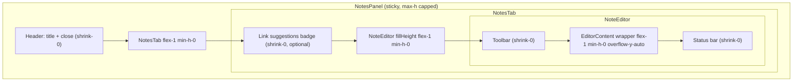

# feat: Fill desktop Notes side panel editor height

## Overview

When a learner opens Notes on desktop, the resizable side panel allocates ~40% of horizontal space but the `NoteEditor` card stays content-sized (~250px minimum). Dead space below the card makes the panel feel unfinished and wastes the dedicated note-taking context.

This plan restructures the desktop `NotesPanel` layout so the editor fills available vertical space, pins toolbar and status chrome, and scrolls only the ProseMirror body. It also adds a single `useLessonChromeStore` open+focus API and wires all desktop entry paths (header, BottomNav, `N`, `?panel=notes`) through it.

## Problem Frame

Opening the Notes side panel is an explicit focus signal: the course sidebar hides, below-video Notes tab hides, and the resizable column expands to 40%. The current layout caps the panel at `max-h-[60svh]` and wraps header + editor in an outer `ScrollArea`, while `NoteEditor` only enforces `min-h-[250px]`. The result is a short editor card floating in unused panel space (see user screenshot, May 2026).

This work was explicitly out of scope in `docs/plans/2026-05-04-005-feat-course-lesson-notes-top3-plan.md` (mobile PiP notes). Desktop side panel behavior is net-new scope.

## Requirements Trace

- R1. Desktop side panel editor fills available vertical space in the resizable notes column (not just 250px minimum)
- R2. Toolbar (formatting, timestamp, download, capture) and status bar (word count, saved indicator) remain visible while long note content scrolls
- R3. Panel header ("Notes" + close button) remains visible; does not scroll away with note content
- R4. Note link suggestions badge (when present) stays above the editor and does not break fill layout
- R5. Theater mode behavior unchanged: entering theater still closes notes panel
- R5b. Lesson navigation within player closes notes panel: when `lessonId` changes (prev/next lesson, sidebar jump), `notesOpen` must become `false` and `pendingNoteFocus` cleared — panel must not stay open showing stale lesson context (matches existing theater-close and `useLessonPlayerState` reset UX)
- R6. Mobile (`FloatingNotesPanel`), tablet Video/Notes toggle, and below-video `NotesTab` layouts unchanged
- R7. Opening notes via header toggle, `N` keyboard shortcut (desktop), or `?panel=notes` deep link focuses the TipTap editor when the panel opens
- R8. Pressing `N` on desktop with panel already open re-focuses the editor without closing the panel
- R9. Resizable panel horizontal drag and double-click reset continue to work; editor reflows without clipping
- R10. Autosave, compact toolbar mode, frame capture, and timestamp insertion behavior preserved

## Scope Boundaries

- Out of scope: Removing `compact` mode or expanding toolbar features in the side panel (layout only)
- Out of scope: Mobile PiP notes panel height changes (`FloatingNotesPanel`)
- Out of scope: Tablet header `toggleNotes` wiring to `tabletNotesOpen` (pre-existing gap; document only)
- Out of scope: Multiple notes per lesson, note export, or TipTap feature additions
- Out of scope: Stale E2E specs targeting legacy `player-side-panel` (note as follow-up, do not block this work)

### Deferred to Separate Tasks

- Tablet header Notes button behavior (640–1023px): wire to `tabletNotesOpen` or hide below `lg` — separate UX decision
- Migrate stale `player-side-panel` E2E specs to current `NotesPanel` / `note-editor` selectors

## Context & Research

### Relevant Code and Patterns

**Current desktop flow:**
- `src/app/pages/UnifiedLessonPlayer.tsx` — `ResizablePanelGroup` with notes at 40%; `hideNotesTab={isDesktop && notesOpen}`; theater closes notes on enter
- `src/app/components/course/NotesPanel.tsx` — outer `ScrollArea` with `max-h-[60svh]` (non-theater) or `max-h-[calc(100svh-1rem)]` (theater, currently unused while theater closes notes)
- `src/app/components/course/tabs/NotesTab.tsx` — always passes `compact` to `NoteEditor`; wrapper `h-full overflow-auto`
- `src/app/components/notes/NoteEditor.tsx` — ProseMirror `min-h-[250px]`; root card is content-sized (`bg-card rounded-2xl`)

**Working fill-height patterns in the same codebase:**
- `UnifiedLessonPlayer` desktop sidebar: `flex flex-col max-h-[calc(100svh-3rem)]` + `flex-1 min-h-0 overflow-y-auto` on scroll body
- `src/app/components/figma/QAChatPanel.tsx`: `flex h-0 min-h-0 flex-1 flex-col overflow-hidden` + pinned header/footer + `ScrollArea h-full min-h-0` on message list
- `docs/plans/2026-05-08-001-fix-reading-goals-modal-layout-plan.md` — viewport-safe flex shell pattern

**Focus wiring gap:**
- `useLessonPlayerState` still owns orphan `notesOpen` / `setNotesOpen` / `pendingNoteFocus` / `handleNotesToggle` — **all removed in Unit 3**; chrome store is the sole panel visibility + deferred-focus source of truth (UnifiedLessonPlayer already reads `notesOpen` from store; local player-state copies are dead)
- `UnifiedLessonPlayer`, `LessonHeaderTools`, and `BottomNav` call `useLessonChromeStore.toggleNotes` directly (no focus)
- `handleFocusNotes` (via `VideoPlayer` `N` key) only sets below-video `focusTab('notes')`, not `openNotesWithFocus()` on desktop
- `useDeepLinkEffects` (`src/app/hooks/useDeepLinkEffects.ts`) opens panel via `setNotesOpen(true)` + `setFocusTab('notes')` but does not set deferred focus; deep-link panel logic lives here — **not** in `useDeepLinkFocus.ts` (library OPDS focus only)

### Institutional Learnings

- `docs/solutions/ui-bugs/qa-chat-panel-keyboard-hint-overflow-flex-layout-2026-05-22.md` — never use bare `h-full` on flex child below fixed header; use `flex-1 min-h-0` (optionally `h-0` as shrink anchor); mark chrome `shrink-0`; Playwright `boundingBox()` for layout gates
- `docs/solutions/ui-bugs/reading-goals-modal-layout-2026-05-08.md` — shell `flex flex-col min-h-0 overflow-hidden`; only middle region scrolls
- `docs/solutions/ui-bugs/qa-chat-panel-uuid-leakage-overflow-auto-scroll-2026-04-29.md` — Radix `ScrollArea` scrolls viewport child, not root; avoid double-scroll (panel + editor)
- `docs/solutions/best-practices/course-lesson-notes-top3-implementation-lessons-2026-05-04.md` — preserve mobile portal/coordination; desktop side panel was preserved as-is in that epic
- `docs/solutions/integration-issues/lesson-chrome-store-consumer-integration-gaps-2026-05-02.md` — preserve `notesOpen` / `hideNotesTab` wiring; consider `id="lesson-notes-panel"` + `aria-controls` on toggle buttons

### External References

- Not required — sufficient local patterns in `QAChatPanel`, desktop sidebar, and Reading Goals modal fix

## Key Technical Decisions

- **`fillHeight` prop on `NoteEditor` (desktop side panel only):** Avoid changing global ProseMirror `min-h-[250px]` for below-video, tablet, and mobile consumers. When `fillHeight` is true: root card becomes `flex flex-col flex-1 min-h-0`; editor body wrapper gets `flex-1 min-h-0 overflow-y-auto`; toolbar/status bar get `shrink-0`. Keep `min-h-[250px]` as floor inside scroll body.
- **Replace outer panel scroll with internal editor scroll:** `NotesPanel` becomes a flex column shell; remove whole-panel `ScrollArea` scroll. Only ProseMirror content scrolls. Prevents toolbar/status bar from scrolling away.
- **Viewport height cap aligned with desktop sidebar:** Replace `max-h-[60svh]` with `max-h-[calc(100svh-3rem)]` (sticky panel, accounts for app header/padding). The resizable column height follows main content; the panel shell fills that column up to the viewport cap.
- **Scope `fillHeight` to `NotesPanel` only:** `NotesTab` passes `fillHeight` only when rendered inside `NotesPanel`, not from `BelowVideoTabs` or `FloatingNotesPanel`.
- **Single chrome-store API for open + focus:** Add `pendingNoteFocus`, `openNotesWithFocus()`, and `focusNotesEditor()` to `useLessonChromeStore`. All desktop open paths (header toggle, BottomNav, `N` key, `?panel=notes`) call store actions — not `useLessonPlayerState`. **Remove** all orphan notes-panel state from `useLessonPlayerState` (`notesOpen`, `setNotesOpen`, `pendingNoteFocus`, `handleNotesToggle`) once store wiring lands; migrate lesson-change panel reset to chrome store (see Unit 3 migration).
- **Desktop-gated deep link in `useDeepLinkEffects`:** Caller passes `isDesktop` from existing `useIsDesktop()` in `UnifiedLessonPlayer` (`min-width: 1024px` via `src/app/hooks/useMediaQuery.ts`). Hook branches on `panelParam === 'notes'`: desktop → `openNotesWithFocus()` only; mobile/tablet → `setFocusTab('notes')` only (no `setNotesOpen`). Do **not** import `useIsDesktop` inside the hook — keeps hook testable with a boolean param and matches how `UnifiedLessonPlayer` already gates layout (`isDesktop ? ResizablePanel : …`).
- **Theater unchanged:** Keep existing effect that closes notes on theater enter. `isTheater` prop on `NotesPanel` remains for future use but is not primary driver for this work.
- **Lesson change closes panel (R5b):** On `lessonId` change within `UnifiedLessonPlayer`, notes panel **must close** — same UX contract as theater-close. Do not leave panel open across lesson navigation; stale lesson notes in a resizable column is confusing and risks wrong-lesson autosave context. Implement via `resetNotesPanelOnLessonChange()` on chrome store (alias of `resetNotesPanel()` if preferred single name) called from existing `[lessonId]` effect in `UnifiedLessonPlayer` — **not** left in `useLessonPlayerState` after migration.
- **Toolbar pinning:** Pin toolbar + panel header + status bar; scroll editor body only (matches R2 and QAChatPanel learning).

## Open Questions

### Resolved During Planning

- **Extend editor or leave as-is?** Resolved — extend on desktop side panel only (user confirmed).
- **Should N open side panel on desktop?** Resolved — yes, match classic `LessonPlayer` behavior and R7.
- **Toolbar scroll behavior?** Resolved — pin toolbar and status bar; scroll ProseMirror only.
- **Theater + notes coexistence?** Resolved — keep current mutual exclusion (theater closes notes).
- **Height model?** Resolved — fill resizable column up to `calc(100svh - 3rem)`, not fixed `60svh`.

### Deferred to Implementation

- Exact header offset constant (`3rem` vs `4rem`) after visual check against `Layout` padding at 1440px
- ~~Whether loading skeleton in `NotesTab` should match fill height~~ Resolved — see Unit 2 loading skeleton behavior
- Whether deferred focus should use imperative `NoteEditor` ref instead of global `.ProseMirror` query (design review recommendation from E21-S02)

## High-Level Technical Design

> *This illustrates the intended approach and is directional guidance for review, not implementation specification. The implementing agent should treat it as context, not code to reproduce.*



## Implementation Units

- [ ] **Unit 1: Add `fillHeight` layout mode to `NoteEditor`**

**Goal:** Allow `NoteEditor` to stretch vertically inside a flex parent without affecting other consumers.

**Requirements:** R1, R2, R6, R10

**Dependencies:** None

**Files:**
- Modify: `src/app/components/notes/NoteEditor.tsx`
- Test: `src/app/components/notes/__tests__/NoteEditor.fillHeight.test.tsx` (new)

**Approach:**
- Add optional `fillHeight?: boolean` to `NoteEditorProps` (default `false`)
- When `fillHeight`: root container `flex flex-col flex-1 min-h-0 h-full`; toolbar, find/replace panel, and status bar `shrink-0`; wrap `EditorContent` in a div with `flex-1 min-h-0 overflow-y-auto`
- Keep ProseMirror `min-h-[250px]` as minimum inside scroll body; do not remove floor for empty notes
- Preserve `data-testid="note-editor"`, toolbar ARIA, and 44px touch targets on toolbar buttons

**Patterns to follow:**
- `QAChatPanel` pinned header/footer + scroll middle
- `NoteEditor` existing `compact` prop pattern (conditional classNames via `cn()`)

**Test scenarios:**
- Happy path: render with `fillHeight` — root has flex column classes; editor body wrapper has `flex-1 min-h-0 overflow-y-auto`
- Edge case: render without `fillHeight` — layout classes unchanged from current behavior (no flex-1 on root)
- Happy path: toolbar and status bar remain in DOM when `fillHeight` is true
- Test expectation: none for TipTap content rendering depth — covered by existing manual/E2E paths

**Verification:**
- Unit tests pass; below-video and mobile consumers unaffected (prop defaults false)

---

- [ ] **Unit 2: Restructure `NotesPanel` and `NotesTab` flex chain**

**Goal:** Establish full-height layout from panel shell through to `NoteEditor`.

**Requirements:** R1, R2, R3, R4, R5, R9

**Dependencies:** Unit 1

**Files:**
- Modify: `src/app/components/course/NotesPanel.tsx`
- Modify: `src/app/components/course/tabs/NotesTab.tsx`
- Modify: `src/app/pages/UnifiedLessonPlayer.tsx` (**required** — ResizablePanel height host; see sub-step 2b)
- Test: `src/app/components/course/__tests__/NotesPanel.test.tsx` (new)

**Approach:**
- Replace outer `ScrollArea` whole-panel scroll with `flex flex-col h-full min-h-0 overflow-hidden` shell
- Apply `sticky top-0 self-start w-full max-h-[calc(100svh-3rem)]` (drop `max-h-[60svh]`)
- Header row: add `shrink-0`
- **Stable E2E selector:** set `id="lesson-notes-panel"` on the outer panel shell (not header row alone). E2E bounding-box assertions target `#lesson-notes-panel`; toggle buttons get `aria-controls="lesson-notes-panel"` in Unit 3 or same unit if trivial
- `NotesTab`: accept optional `fillHeight?: boolean` prop; when true, root `flex flex-col flex-1 min-h-0`; link-suggestions badge `shrink-0`; pass `fillHeight` to `NoteEditor`
- `NotesPanel` passes `fillHeight` to `NotesTab`
- **Sub-step 2b — ResizablePanel height propagation (required, not conditional):** `react-resizable-panels` does not guarantee flex height inheritance to panel children. Wrap `NotesPanel` in a host div inside the notes `ResizablePanel`:

```tsx
<ResizablePanel …>
  {notesOpen && (
    <div className="h-full min-h-0 flex flex-col">
      <NotesPanel … />
    </div>
  )}
</ResizablePanel>
```

  - Host div: `h-full min-h-0 flex flex-col` (propagates column height from panel slot)
  - `NotesPanel` root already uses `flex flex-col h-full min-h-0 overflow-hidden` (Unit 2 approach)
  - **Pre-E2E verification gate:** Before Unit 4 bounding-box tests, manually or via Vitest DOM check at 1280×800: open notes → `#lesson-notes-panel` computed height > 400px and `[data-testid="note-editor"]` bottom within 8px of panel bottom. If gate fails, inspect ResizablePanel host chain before writing E2E assertions.
- **Loading skeleton (fillHeight chain):** when `fillHeight` is true, replace fixed `h-32` skeleton with a flex column that mirrors the editor shell: root `flex flex-col flex-1 min-h-0 p-4`; badge placeholder `shrink-0` (`h-4 w-32`); editor placeholder `flex-1 min-h-[250px] w-full` (uses `Skeleton` with `className="flex-1 min-h-[250px] w-full"`). Prevents layout jump when note data loads — skeleton occupies the same flex footprint as `NoteEditor fillHeight`. Non-`fillHeight` consumers keep current compact skeleton (`h-32 w-full`)

**Patterns to follow:**
- `UnifiedLessonPlayer` `desktop-sidebar` sticky + `flex-1 min-h-0` scroll body
- `TranscriptPanel` `flex flex-col h-full` with `shrink-0` header

**Test scenarios:**
- Happy path: `NotesPanel` renders flex column shell without outer scroll wrapping entire panel content
- Happy path: `NotesPanel` outer shell has `id="lesson-notes-panel"`
- Happy path: `NotesTab` with `fillHeight` passes prop to `NoteEditor`
- Happy path: `NotesTab` with `fillHeight` + `isLoading` renders flex-1 skeleton (not fixed `h-32` only)
- Happy path (2b gate): `UnifiedLessonPlayer` notes `ResizablePanel` renders host wrapper with `h-full min-h-0` around `NotesPanel`
- Edge case: `NotesTab` without `fillHeight` (below-video usage) — unchanged class structure and compact skeleton
- Edge case: loading skeleton path still renders without throwing

**Verification:**
- Vitest confirms structure; **Sub-step 2b gate passes** (panel shell height > editor min-height at desktop viewport); visual confirmation in dev at 1440px with notes open shows editor card filling panel column; no visible jump when loading completes

---

- [ ] **Unit 3: Wire desktop open paths via `useLessonChromeStore` focus API**

**Goal:** Single chrome-store API opens the notes side panel and defers TipTap focus. Desktop `N` opens the panel (not just below-video tab); re-pressing `N` with panel open re-focuses without closing. Remove all orphan notes-panel state from `useLessonPlayerState`.

**Requirements:** R5b, R7, R8

**Dependencies:** Unit 2 (panel must mount before focus)

**Files:**
- Modify: `src/stores/useLessonChromeStore.ts`
- Modify: `src/stores/__tests__/useLessonChromeStore.test.ts`
- Modify: `src/app/pages/UnifiedLessonPlayer.tsx` (read `pendingNoteFocus` from store; wire `handleFocusNotes` desktop branch; pass `isDesktop` + `openNotesWithFocus` to deep-link hook; **add `resetNotesPanelOnLessonChange()` in `[lessonId]` effect**; drop `pendingFocus={state.pendingNoteFocus}` prop)
- Modify: `src/app/hooks/useLessonPlayerState.ts` (**remove** orphan `notesOpen`, `setNotesOpen`, `pendingNoteFocus`, `setPendingNoteFocus`, `handleNotesToggle` — do not leave commented dead code)
- Modify: `src/app/components/course/LessonHeaderTools.tsx`
- Modify: `src/app/components/navigation/BottomNav.tsx`
- Modify: `src/app/hooks/useDeepLinkEffects.ts` (desktop-gated `openNotesWithFocus`; panel logic lives here)
- Modify: `src/app/components/course/NotesPanel.tsx` (consume store `pendingNoteFocus`; clear on focus complete)
- Test: `src/app/components/course/__tests__/LessonHeaderTools.test.tsx` (extend)
- Test: `src/app/components/navigation/__tests__/BottomNav.lesson.test.tsx` (extend)
- Test: `src/app/hooks/__tests__/useDeepLinkEffects.test.ts` (**new** — panel deep-link scenarios; do **not** extend `useDeepLinkFocus.test.tsx`, which covers library OPDS `?focus=` only)

**Approach — chrome store additions:**

```typescript
// useLessonChromeStore additions (illustrative)
pendingNoteFocus: boolean
openNotesWithFocus: () => void   // set notesOpen=true + pendingNoteFocus=true
focusNotesEditor: () => void     // pendingNoteFocus=true only (panel already open)
toggleNotesWithFocus: () => void // closed→open: openNotesWithFocus(); open→closed: setNotesOpen(false)
clearPendingNoteFocus: () => void
resetNotesPanelOnLessonChange: () => void  // setNotesOpen(false) + clear pendingNoteFocus — R5b
```

- `openNotesWithFocus`: `set({ notesOpen: true, pendingNoteFocus: true })`
- `focusNotesEditor`: if `notesOpen`, `set({ pendingNoteFocus: true })`; else no-op (callers on desktop should use `openNotesWithFocus` first)
- `toggleNotesWithFocus`: if currently closed, delegate to `openNotesWithFocus()`; if open, `setNotesOpen(false)` (no focus on close)
- `reset()` clears `pendingNoteFocus` and `notesOpen`
- Leave bare `toggleNotes` / `setNotesOpen` for theater-close and other non-focus paths (theater effect). **Lesson-change close uses `resetNotesPanelOnLessonChange()` only** — do not call bare `setNotesOpen(false)` without clearing `pendingNoteFocus`.
- Add `resetNotesPanel()` / `resetNotesPanelOnLessonChange()` (same implementation; prefer one exported name — `resetNotesPanelOnLessonChange` documents intent): `set({ notesOpen: false, pendingNoteFocus: false })` — used on **lessonId change** within the player (see migration below). Full `reset()` on route leave stays in `Layout.tsx`.

**`useDeepLinkEffects` — desktop-gated `openNotesWithFocus` wiring:**

Extend hook interface (caller supplies breakpoint flag; hook does not call `useIsDesktop` internally):

```typescript
interface DeepLinkSetters {
  setSeekToTime: (time: number | undefined) => void
  setFocusTab: (tab: string | null) => void
  isDesktop: boolean
  openNotesWithFocus: () => void
}
```

`UnifiedLessonPlayer` call site (existing `isDesktop = useIsDesktop()` at line ~128):

```typescript
useDeepLinkEffects({
  setSeekToTime: state.setSeekToTime,
  setFocusTab: state.setFocusTab,
  isDesktop,
  openNotesWithFocus: useLessonChromeStore.getState().openNotesWithFocus,
})
```

`?panel=notes` effect behavior:

| Viewport | `isDesktop` | Action | Rationale |
|----------|-------------|--------|-----------|
| Desktop (≥1024px) | `true` | `openNotesWithFocus()` | Opens resizable side panel + sets `pendingNoteFocus` for TipTap |
| Mobile (<640px) | `false` | `setFocusTab('notes')` only | Switches below-video / floating notes tab; no side panel |
| Tablet (640–1023px) | `false` | `setFocusTab('notes')` only | Video/Notes toggle path; side panel not mounted |

Remove `setNotesOpen` from hook interface — panel visibility is store-owned on desktop; mobile/tablet never used `notesOpen` for side panel.

**Lesson-change panel reset (R5b — explicit UX decision):**

When the learner navigates to a different lesson within the same course player (sidebar click, prev/next, keyboard), the notes side panel **closes**. Rationale: matches theater-close behavior and today’s `useLessonPlayerState` `[lessonId]` reset; an open panel would show the previous lesson’s note context until reload completes.

Implementation — extend the existing `[lessonId]` effect in `UnifiedLessonPlayer` (do not add a second effect):

```typescript
// UnifiedLessonPlayer.tsx — inside existing useEffect([lessonId]) or dedicated call at top of that effect
useEffect(() => {
  useLessonChromeStore.getState().resetNotesPanelOnLessonChange()
  // …other lesson-change resets remain in useLessonPlayerState until migrated
}, [lessonId])
```

Store action (illustrative — may alias `resetNotesPanel`):

```typescript
resetNotesPanelOnLessonChange: () =>
  set({ notesOpen: false, pendingNoteFocus: false }),
```

Equivalent imperative: `setNotesOpen(false)` + `clearPendingNoteFocus()`. Do **not** leave panel open across lesson navigation.

**Dead-state cleanup — `useLessonPlayerState` migration:**

| State / export | Current owner | Action |
|----------------|---------------|--------|
| `notesOpen`, `setNotesOpen` | Local `useState` in player hook | **Delete** — orphan; `UnifiedLessonPlayer` already reads chrome store |
| `pendingNoteFocus`, `setPendingNoteFocus`, `handleNotesToggle` | Local `useState` / handler | **Delete** — replaced by chrome store focus API |
| Lesson-change `setNotesOpen(false)` + `setPendingNoteFocus(false)` in `[lessonId]` effect | `useLessonPlayerState` | **Move** to `UnifiedLessonPlayer`: call `resetNotesPanelOnLessonChange()` (closes panel + clears deferred focus) in existing `[lessonId]` effect — see **Lesson-change panel reset** below |

Grep before merge: `notesOpen`, `setNotesOpen`, `pendingNoteFocus`, `handleNotesToggle` must have **zero** consumers outside chrome store after Unit 3. Update `LessonPlayerState` interface accordingly.

**Consumer wiring (concrete):**

| Entry point | Current | Target |
|-------------|---------|--------|
| `LessonHeaderTools` notes button | `toggleNotes` | `toggleNotesWithFocus` |
| `BottomNav` notes button (desktop lesson context) | `toggleNotes` | `toggleNotesWithFocus` |
| `VideoPlayer` `N` key → `onFocusNotes` | `handleFocusNotes` sets `focusTab('notes')` only | `UnifiedLessonPlayer` handler: if `isDesktop`, call `notesOpen ? focusNotesEditor() : openNotesWithFocus()`; else keep `setFocusTab('notes')` |
| `?panel=notes` deep link | `setNotesOpen(true)` + `setFocusTab('notes')` (both paths) | **`useDeepLinkEffects`:** if `isDesktop` → `openNotesWithFocus()`; else → `setFocusTab('notes')` only |
| `NotesPanel` deferred focus effect | reads local `pendingFocus` prop from player state | read `pendingNoteFocus` from chrome store; on rAF focus, call `clearPendingNoteFocus()` via `onFocusComplete` |

- Add `aria-controls="lesson-notes-panel"` to notes toggle buttons in `LessonHeaderTools` and `BottomNav` (pairs with Unit 2 `id`)
- Scope ProseMirror focus query to `#lesson-notes-panel .ProseMirror` to avoid below-video collision
- **Do not** add open/focus/panel-visibility logic to `useLessonPlayerState`. **Remove** dead exports in the same unit:
  - Delete `notesOpen`, `setNotesOpen`, `pendingNoteFocus`, `setPendingNoteFocus`, and `handleNotesToggle` from `useLessonPlayerState.ts`
  - Remove all five from the hook return type / `LessonPlayerState` interface
  - Remove lesson-change `setNotesOpen(false)` / `setPendingNoteFocus(false)` from player hook; **`UnifiedLessonPlayer` `[lessonId]` effect calls `resetNotesPanelOnLessonChange()`** (R5b)
  - Update `UnifiedLessonPlayer.tsx` to stop destructuring or passing any player-state notes fields
  - Grep for remaining consumers before merge; if any remain, migrate them to chrome store — **do not** leave commented-out dead code or deprecated exports with zero consumers
  - Single source of truth: `useLessonChromeStore` for panel open + deferred focus; `useLessonPlayerState` retains `focusTab('notes')` only for below-video tab focus on non-desktop paths

**Patterns to follow:**
- Classic `LessonPlayer` open + focus behavior (archived reference in `docs/archive/classic-pages/LessonPlayer.tsx`)
- Existing `NotesPanel` `requestAnimationFrame` + focus callback pattern
- `docs/solutions/integration-issues/lesson-chrome-store-consumer-integration-gaps-2026-05-02.md` — single store as notes visibility source of truth

**Test scenarios:**
- Happy path: `openNotesWithFocus()` sets `notesOpen=true` and `pendingNoteFocus=true`
- Happy path: `toggleNotesWithFocus()` when closed → same as `openNotesWithFocus()`
- Happy path: `toggleNotesWithFocus()` when open → `notesOpen=false`, `pendingNoteFocus` unchanged/false
- Happy path (R8): `focusNotesEditor()` when panel open sets `pendingNoteFocus=true` without toggling `notesOpen`
- Happy path: `LessonHeaderTools` click calls `toggleNotesWithFocus`, not bare `toggleNotes`
- Happy path: `BottomNav` click calls `toggleNotesWithFocus` on desktop lesson route
- Happy path: `useDeepLinkEffects` with `isDesktop=true` and `?panel=notes` invokes `openNotesWithFocus()` once (mock in `useDeepLinkEffects.test.ts`)
- Happy path: `useDeepLinkEffects` with `isDesktop=false` and `?panel=notes` invokes `setFocusTab('notes')` only; does **not** call `openNotesWithFocus`
- Happy path: `UnifiedLessonPlayer` desktop `N` handler calls `openNotesWithFocus` when closed, `focusNotesEditor` when open
- Edge case: non-desktop `N` / deep link still uses `setFocusTab('notes')` only
- Edge case: `reset()`, `resetNotesPanel()`, and `resetNotesPanelOnLessonChange()` clear `pendingNoteFocus` and set `notesOpen=false`
- Edge case (**R5b**): navigating lesson A → lesson B closes notes panel (`notesOpen=false`, `pendingNoteFocus=false`) via `resetNotesPanelOnLessonChange()` in `UnifiedLessonPlayer` — panel must not remain visible with stale lesson context
- Integration: `NotesPanel` with store `pendingNoteFocus=true` focuses `#lesson-notes-panel .ProseMirror` and clears flag
- Cleanup: `useLessonPlayerState` no longer exports `notesOpen`, `setNotesOpen`, `pendingNoteFocus`, or `handleNotesToggle` (grep confirms zero consumers)

**Verification:**
- Store + component unit tests pass; manual check: header toggle, BottomNav, `N`, and deep link place cursor in editor on desktop; `N` with panel open does not close panel

---

- [ ] **Unit 4: E2E layout and regression coverage**

**Goal:** Prevent regression of fill-height layout, desktop open/focus paths, theater mutual exclusion, and note-editor feature smoke paths.

**Requirements:**
- R1 — Fill-height layout gate: editor card bottom edge ≈ panel shell bottom (bounding-box tolerance ≤8px at 1280×800)
- R5 — Theater mutual exclusion: entering theater mode closes notes panel (regression; must not break with fill-height layout)
- R5b — Lesson navigation closes notes panel: prev/next/sidebar lesson change closes panel (regression E2E-5b)
- R6 — Mobile/tablet/below-video layouts unchanged (regression matrix; no fillHeight side effects)
- R7 — Desktop open paths focus editor: header toggle, `?panel=notes` cold load, `N` when panel closed
- R8 — Desktop re-focus without close: `N` when panel already open re-focuses `#lesson-notes-panel .ProseMirror`, panel stays open
- R9 — Resizable panel drag/reflow: editor reflows without clipping after horizontal resize
- R10 — Note-editor feature smoke: **split E2E-6 by concern** (toolbar pinned, timestamp insertion, frame capture) — one minimal assertion per test file/scenario; autosave covered by existing `story-e89-s07-notes-panel.spec.ts` (do not bundle into E2E-6)

**Dependencies:** Units 1–3 (Unit 2 sub-step 2b height gate must pass before bounding-box E2E)

**Files:**
- Modify or extend: `tests/e2e/regression/story-e03-s02.spec.ts`
- Optional new: `tests/e2e/regression/notes-panel-fill-height.spec.ts`

**Approach:**
- **Prerequisite:** Confirm Unit 2b ResizablePanel height gate passes before adding bounding-box assertions (avoids flaky E2E-1 when flex chain is broken)
- **Stable selectors:** use `#lesson-notes-panel` for panel bounding-box (Unit 2 `id` on shell); use `[data-testid="note-editor"]` for editor card assertions inside the panel; scope editor queries to `#lesson-notes-panel [data-testid="note-editor"]` to avoid below-video collision
- Extend existing desktop notes layout spec (`story-e03-s02`) with bounding-box assertions:
  - Open notes via header toggle
  - Compare `[data-testid="note-editor"]` bottom edge to `#lesson-notes-panel` bottom edge (allow small tolerance for padding, e.g. ≤8px)
  - Assert editor height significantly exceeds 250px at 1280×800
- Regression matrix (manual checklist in test comments or separate cases):
  - Mobile: `FloatingNotesPanel` pill/expand unchanged
  - Tablet: Video/Notes toggle unchanged
  - Below-video `NotesTab` when desktop panel closed: still `min-h-[250px]`, no `fillHeight`

**E2E scenarios (Playwright, desktop viewport 1280×800 unless noted):**

| ID | Requirement | Scenario | Key assertions |
|----|-------------|----------|----------------|
| E2E-1 | R1, R7 | Open notes via header toggle | `#lesson-notes-panel` visible; editor bottom ≈ panel bottom; editor height > 250px |
| E2E-2 | R7 | Cold load `?panel=notes` | Panel open; `#lesson-notes-panel .ProseMirror` focused (or `document.activeElement` inside panel) |
| E2E-3 | R7 | Press `N` with panel closed | `#lesson-notes-panel` visible; ProseMirror focused |
| E2E-4 | **R8** | Notes panel already open → press `N` | `#lesson-notes-panel` still visible/attached; blur editor first (click video area), press `N`, assert ProseMirror `:focus` restored; panel did not close |
| E2E-5 | **R5** | Open notes → enter theater mode | Click `[data-testid="theater-mode-toggle"]` (or press `T`); assert `#lesson-notes-panel` not visible / detached; `data-theater-mode="true"` on player |
| E2E-5b | **R5b** | Open notes → navigate to next lesson | Panel open on lesson A → click next-lesson control → assert `#lesson-notes-panel` not visible; `notesOpen` false (re-open required on lesson B) |
| E2E-6a | **R10** | Toolbar pinned smoke (fast, default CI) | Open notes; assert `#lesson-notes-panel [data-testid="note-editor-toolbar"]` visible; `[aria-label="Bold"]` present; scroll editor body — toolbar bounding box Y stable (pinned, not scrolled away). **No retry** — deterministic layout assertion |
| E2E-6b | **R10** | Timestamp insertion (isolated) | Click `#lesson-notes-panel [aria-label="Add Timestamp"]` → assert editor contains `Jump to` link or `[0-9]+:[0-9]{2}` pattern. **Retry:** `test.describe.configure({ retries: 1 })` on this test only — TipTap + video time coupling can flake; do not apply retries to E2E-6a or whole R10 bundle |
| E2E-6c | **R10** | Frame capture (`@slow`, optional CI) | `#lesson-notes-panel [aria-label="Capture video frame"]` visible and enabled after panel open. Tag **`@slow`**; exclude from default CI project (nightly or manual). May **`test.skip`** when `process.env.CI` and no video fixture — document in spec header. **Retry:** optional `retries: 1` on this test only if capture button timing flakes |
| E2E-7 | R9 | Resizable panel drag | After drag handle move, editor still visible without clipping (optional bounding-box sanity) |
| E2E-8 | R6 | Below-video regression | With panel closed, below-video `[data-testid="note-editor"]` still content-sized (no fillHeight stretch) |

**R10 split rationale (E2E-6 isolation):** Do **not** bundle toolbar scroll check + timestamp click + frame capture into one test. Each concern is a **separate Playwright test** (`E2E-6a` / `E2E-6b` / `E2E-6c`) so one flaky step does not fail the entire R10 gate. Default CI runs **E2E-6a only** (fast toolbar pinned smoke). **E2E-6b** runs in default or extended project with **per-test retry** (not describe-level). **E2E-6c** is **`@slow` optional** — skipped or excluded in default CI; nightly/manual only. Autosave debounce remains in existing `story-e89-s07-notes-panel.spec.ts`; do not duplicate in this split.

**Patterns to follow:**
- `docs/solutions/ui-bugs/qa-chat-panel-keyboard-hint-overflow-flex-layout-2026-05-22.md` — Playwright `boundingBox()` as layout gate; target `#lesson-notes-panel` not ad-hoc wrappers
- `tests/e2e/regression/story-e03-s02.spec.ts` — current resizable panel assertions

**Test scenarios:**
- Happy path (R1): desktop notes open → editor fills panel vertical space (bounding box: `#lesson-notes-panel` vs `note-editor`)
- Happy path (R7): `?panel=notes` → editor receives focus
- Happy path (R7): `N` with panel closed → side panel visible + editor focused on desktop
- Happy path (**R8**): desktop viewport, notes panel already open, press `N` → editor re-focuses, panel stays open (E2E-4)
- Happy path (**R5**): open notes panel → enter theater mode → assert notes panel closed (E2E-5 regression)
- Happy path (**R5b**): open notes on lesson A → next lesson → panel closed (E2E-5b)
- Happy path (**R10**): split smoke — E2E-6a toolbar pinned (default CI); E2E-6b timestamp (isolated, retry on test only); E2E-6c frame capture (`@slow`, optional CI skip)
- Regression (R6): below-video notes tab editor height unchanged when panel closed
- Edge case (R2): long note content — toolbar still visible after scrolling editor body (scroll editor, assert toolbar bounding box stable)

**Verification:**
- E2E layout/focus specs pass at desktop viewport; R10 default CI: **E2E-6a** only; E2E-6b with optional single-test retry; E2E-6c `@slow` excluded or skipped in CI; no describe-level retry on R10 bundle; no changes required for mobile/tablet test projects

## System-Wide Impact

- **Interaction graph:** `useLessonChromeStore.notesOpen` and new `pendingNoteFocus` / `openNotesWithFocus` / `resetNotesPanelOnLessonChange` drive panel visibility, deferred focus, and **lesson-change close (R5b)**. Layout change must not alter `hideNotesTab` / sidebar consumers. Focus wiring touches `VideoPlayer` (`N` key), `LessonHeaderTools`, `BottomNav`, and `useDeepLinkEffects` (with caller-supplied `isDesktop`) — all via chrome store, not `useLessonPlayerState`.
- **Error propagation:** Layout-only change; autosave and note persistence paths unchanged. Focus failures are non-fatal (degraded UX only).
- **State lifecycle risks:** Avoid mounting two `NoteEditor` instances with autosave on desktop (panel open hides below-video notes tab — verify `hideNotesTab` still prevents dual mount). On lesson navigation within player, **`resetNotesPanelOnLessonChange()` must close panel and clear focus flag (R5b)** — panel must not stay open with stale lesson notes (replaces player-hook local reset; same UX as theater-close).
- **API surface parity:** `NoteEditor.fillHeight` and `NotesTab.fillHeight` are optional props; all existing call sites default to current behavior.
- **Integration coverage:** E2E bounding-box test on `#lesson-notes-panel` proves flex chain end-to-end; unit tests prove store focus API and prop wiring.
- **Unchanged invariants:** Mobile PiP notes, tablet toggle, note store CRUD, compact toolbar mode, theater-closes-notes effect, resizable 60/40 split defaults.

## Risks & Dependencies

| Risk | Mitigation |
|------|------------|
| Double-scroll (panel + editor) | Remove outer panel scroll; single scroll on editor body only |
| Flex height collapse (`h-full` without `min-h-0`) | Apply `flex-1 min-h-0` at each layer per QAChatPanel learning |
| Global `.ProseMirror` focus hits wrong editor | Scope focus query to `#lesson-notes-panel` |
| Layout jump on load (skeleton → editor) | Unit 2 fillHeight skeleton uses `flex-1 min-h-[250px]` to match editor footprint |
| Tablet header toggle no-op | Document as pre-existing; out of scope unless trivial hide-below-lg fix |
| TipTap toolbar wrap increases height | Toolbar already wraps in compact mode; pinning still valid |

## Documentation / Operational Notes

- After ship, consider `/ce-compound` entry: desktop notes fill-height fills gap deferred from May 2026 PiP notes plan
- Design review at 1440px and 1280×600 viewports recommended (`.claude/rules/workflows/design-review.md`)

## Sources & References

- User screenshot and UX discussion (May 2026)
- Prior scope exclusion: `docs/plans/2026-05-04-005-feat-course-lesson-notes-top3-plan.md`
- Ideation context: `docs/ideation/2026-05-04-course-lesson-notes-improvements-ideation.md`
- Layout patterns: `docs/solutions/ui-bugs/qa-chat-panel-keyboard-hint-overflow-flex-layout-2026-05-22.md`, `docs/plans/2026-05-08-001-fix-reading-goals-modal-layout-plan.md`
- Related code: `src/app/components/course/NotesPanel.tsx`, `src/app/components/course/tabs/NotesTab.tsx`, `src/app/components/notes/NoteEditor.tsx`, `src/app/pages/UnifiedLessonPlayer.tsx`, `src/app/hooks/useDeepLinkEffects.ts`, `src/app/hooks/useMediaQuery.ts`
