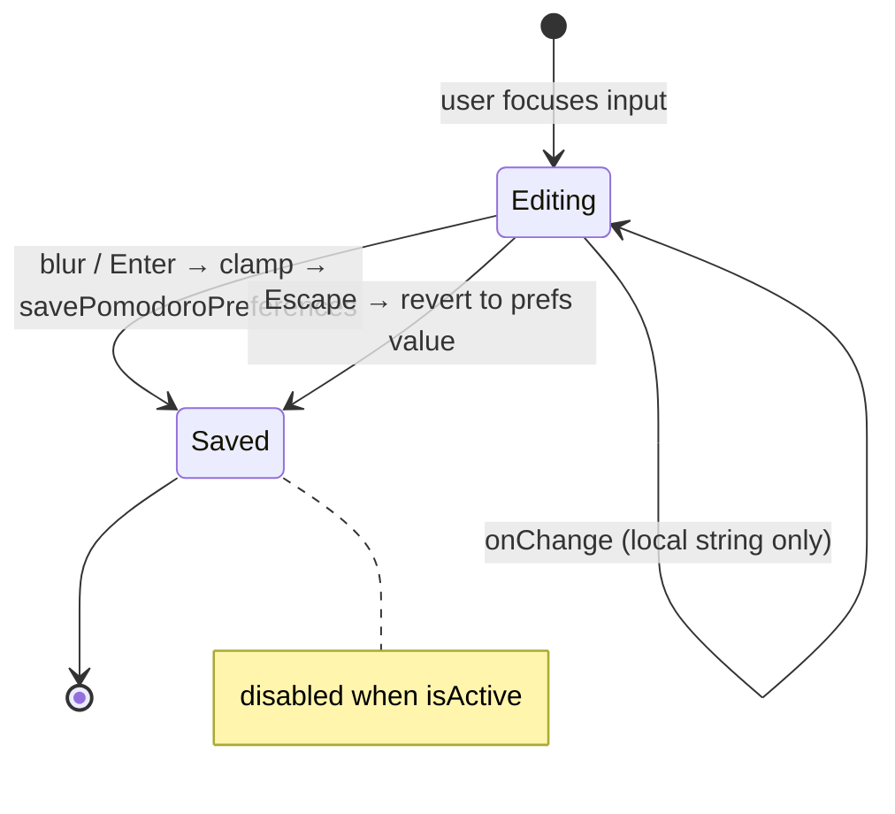

# feat: Editable Pomodoro Focus and Break Durations

## Overview

Users on the course lesson page can only adjust Pomodoro focus and break lengths via `-` / `+` stepper buttons (focus steps by 5 min, break by 1 min). Values like **51** or **57** minutes are unreachable without many clicks — or impossible for focus, which only lands on multiples of 5. This plan adds **direct numeric entry** for both durations in the lesson-player popover and Settings, with shared validation so both surfaces and `localStorage` stay consistent.

## Problem Frame

The Pomodoro popover in `PomodoroTimer.tsx` renders duration as read-only text between stepper buttons. Focus is constrained to **1–60 min in steps of 5**; break to **1–30 min in steps of 1**. The timer hook and preferences layer already accept arbitrary minute values — the limitation is UI-only. Users expect to type a target duration (e.g. 57 min) instead of clicking repeatedly.

## Requirements Trace

- **R1.** Users can type a focus duration in minutes and have it apply when the timer is idle.
- **R2.** Users can type a break duration in minutes and have it apply when the timer is idle.
- **R3.** Typed values are clamped to documented min/max bounds and persisted via existing `pomodoroPreferences` localStorage.
- **R4.** The main countdown display updates to reflect a new focus duration while idle (hook already syncs via `focusDuration` prop).
- **R5.** Duration controls remain disabled while a session is active (same as current stepper behavior).
- **R6.** Settings page (`PomodoroSettings`) exposes the same typed-entry behavior as the lesson popover.

## Scope Boundaries

- No changes to timer state machine, chime audio, or auto-start toggle behavior.
- No new Zustand store — preferences remain in `localStorage` via `pomodoroPreferences.ts`.
- No change to seconds-level precision (minutes only, integer values).

### Deferred to Separate Tasks

- Redesigning the Settings stepper into a fully separate UX (this plan unifies behavior, not visual redesign of Settings cards).
- Sub-minute durations (seconds) or Pomodoro long-break cycles.

## Context & Research

### Relevant Code and Patterns

- `src/app/components/figma/PomodoroTimer.tsx` — popover preferences with `-` / `+` and static `<span>` for minutes (lines 246–329).
- `src/app/components/settings/PomodoroSettings.tsx` — Apple-style `Stepper` with `FOCUS_MIN=5`, `FOCUS_MAX=60`, `FOCUS_STEP=5`; break `1–30`, step 1.
- `src/lib/pomodoroPreferences.ts` — merges JSON from localStorage with defaults; **no validation/clamping** on read or save.
- `src/hooks/usePomodoroTimer.ts` — accepts any positive duration in seconds; syncs `timeRemaining` when `focusDuration` changes while idle.
- `src/app/components/audiobook/SleepTimer.tsx` — reference pattern for custom minutes: `type="number"`, parse on submit/blur, clamp, keyboard handling (`Enter` / `Escape`).
- `src/app/components/course/LessonHeaderTools.tsx` — renders `PomodoroTimer` in the lesson player header.
- E2E: `tests/e2e/regression/e21-s03-pomodoro-timer.spec.ts` — AC4 tests preference persistence via stepper labels.

### Institutional Learnings

- `docs/solutions/ui-bugs/pomodoro-start-break-button-wired-to-skip-2026-05-23.md` — Pomodoro UI actions must map to correct hook primitives; duration edits must not desync refs while a phase is running.
- `docs/solutions/best-practices/audiobook-prefs-hydration-allow-list-pattern-2026-04-25.md` — treat persisted JSON as untrusted; export canonical bounds and validate on read/write in one module.
- `docs/solutions/best-practices/auto-advance-autoplay-gate-session-dialog-removal-2026-05-04.md` — `getPomodoroPreferences()` should strip stale keys when merging defaults.
- `docs/solutions/ui-bugs/reading-goals-modal-layout-2026-05-08.md` — numeric inputs beside steppers need `min-w-*` on the input wrapper to avoid flex collapse.

### External References

- Skipped — codebase has sufficient local patterns (`SleepTimer`, existing Pomodoro stack).

## Key Technical Decisions

- **Centralize bounds and clamping in `pomodoroPreferences.ts`:** Export `FOCUS_DURATION_MIN`, `FOCUS_DURATION_MAX`, `BREAK_DURATION_MIN`, `BREAK_DURATION_MAX`, plus `clampFocusDuration(minutes)` and `clampBreakDuration(minutes)`. Both UI surfaces and `savePomodoroPreferences` call these helpers so popover (currently allows focus ≥1) and Settings (focus ≥5) converge on **one rule set: focus 1–60, break 1–30, any integer**.
- **Inline editable field, not expandable row:** Replace the static `<span>` between `-` / `+` with a compact `type="number"` input (popover space is tight). Keep `-` / `+` for quick nudges (focus step 5, break step 1).
- **Commit on blur and Enter:** While typing, hold local string state; on blur or Enter, parse, clamp, persist, and sync display. On Escape, revert to last saved value. Avoid persisting on every keystroke (partial values like `"5"` while typing `"57"`).
- **Sanitize on read:** `getPomodoroPreferences()` clamps stored values so corrupt or out-of-range localStorage entries (e.g. focus 999) normalize on load.
- **Shared UI component:** Extract `PomodoroDurationControl` (or similar) used by both `PomodoroTimer` and `PomodoroSettings` to prevent a third divergence of bounds/UX.

## Open Questions

### Resolved During Planning

- **Focus minimum: 1 or 5?** Use **1–60** everywhere. Settings' `FOCUS_MIN=5` existed for stepper UX, not a product rule; typed entry should allow any integer in range including 57.
- **Change step on +/- for focus?** Keep step **5** on buttons; typed entry removes the step constraint for direct input.

### Deferred to Implementation

- Exact pixel width of the number input in the popover (`w-12` vs `w-14`) — tune during visual QA in the narrow popover.
- Whether to use shadcn `Input` or raw `<input>` like `SleepTimer` — prefer shadcn `Input` with compact height classes for consistency unless popover layout requires raw input.

## High-Level Technical Design

> *This illustrates the intended approach and is directional guidance for review, not implementation specification. The implementing agent should treat it as context, not code to reproduce.*

```
User types "57" in focus field → blur/Enter
  → clampFocusDuration(57) → 57
  → savePomodoroPreferences({ focusDuration: 57 })
  → PomodoroTimer prefs state updates
  → usePomodoroTimer receives focusDuration: 57 * 60
  → if idle: countdown shows 57:00
```



## Implementation Units

- [ ] **Unit 1: Centralize duration bounds and clamping**

**Goal:** Single source of truth for min/max and sanitization of persisted Pomodoro durations.

**Requirements:** R3

**Dependencies:** None

**Files:**
- Modify: `src/lib/pomodoroPreferences.ts`
- Create: `src/lib/__tests__/pomodoroPreferences.test.ts`

**Approach:**
- Export named constants for focus/break min and max (1–60 focus, 1–30 break).
- Add `clampFocusDuration(n: number)` and `clampBreakDuration(n: number)` using `Math.min` / `Math.max` with integer rounding (`Math.round` or `parseInt` after validation).
- Update `getPomodoroPreferences()` to clamp `focusDuration` and `breakDuration` after merge.
- Update `savePomodoroPreferences()` to clamp any provided duration fields before write.
- Preserve existing stale-key cleanup (e.g. `showQualityScore`).

**Patterns to follow:**
- `docs/solutions/best-practices/audiobook-prefs-hydration-allow-list-pattern-2026-04-25.md` — validate at hydration boundary.

**Test scenarios:**
- Happy path: `clampFocusDuration(57)` returns 57.
- Edge case: `clampFocusDuration(0)` returns 1; `clampFocusDuration(999)` returns 60.
- Edge case: `clampBreakDuration(10)` returns 10; `clampBreakDuration(0)` returns 1; `clampBreakDuration(45)` returns 30.
- Integration: `getPomodoroPreferences()` with localStorage containing `{ focusDuration: 999 }` returns focus 60.
- Integration: `savePomodoroPreferences({ focusDuration: 57 })` persists 57 and returns merged prefs with 57.

**Verification:**
- Vitest passes for `src/lib/__tests__/pomodoroPreferences.test.ts`.

---

- [ ] **Unit 2: Shared `PomodoroDurationControl` component**

**Goal:** Reusable row with label, `-`, editable minutes input, `+`, and `min` suffix — disabled when timer is active.

**Requirements:** R1, R2, R5

**Dependencies:** Unit 1

**Files:**
- Create: `src/app/components/figma/PomodoroDurationControl.tsx`
- Create: `src/app/components/figma/__tests__/PomodoroDurationControl.test.tsx`

**Approach:**
- Props: `label`, `value` (number, minutes), `min`, `max`, `step`, `disabled`, `onChange(minutes: number)`, `id`, optional `data-testid`.
- Local edit state for the input string while focused; sync from `value` prop when not editing.
- `-` / `+` call `onChange` with clamped `value ± step`.
- Input: `type="number"`, `min`/`max` attrs, `aria-label`, compact styling (`h-6`, `tabular-nums`, `min-w-*` on wrapper per reading-goals learning).
- Blur / Enter: parse, clamp via helpers from Unit 1, call `onChange`.
- Escape: reset local string to `value`.

**Patterns to follow:**
- `SleepTimer.tsx` custom minutes submit/clamp behavior.
- `PomodoroSettings.tsx` `Stepper` layout for Settings variant (may pass different className or `variant="compact" | "settings"` if needed).

**Test scenarios:**
- Happy path: render with value 25, change input to 57, blur → `onChange` called with 57.
- Happy path: click `+` with step 5 from 25 → `onChange(30)`.
- Edge case: input empty on blur → reverts to last valid `value` without calling `onChange` with NaN.
- Edge case: input 999 on blur → `onChange(60)` when max is 60.
- Edge case: `disabled={true}` — input and buttons do not fire `onChange`.
- Happy path: Enter key commits same as blur.

**Verification:**
- Component tests pass; control renders accessible label association via `id` / `htmlFor`.

---

- [ ] **Unit 3: Wire editable durations in lesson popover and Settings**

**Goal:** Replace static duration spans / inline stepper-only UX with `PomodoroDurationControl` in both surfaces.

**Requirements:** R1, R2, R4, R5, R6

**Dependencies:** Units 1–2

**Files:**
- Modify: `src/app/components/figma/PomodoroTimer.tsx`
- Modify: `src/app/components/settings/PomodoroSettings.tsx`

**Approach:**
- In `PomodoroTimer.tsx`, replace focus and break rows (lines ~246–329) with two `PomodoroDurationControl` instances wired to `updatePref({ focusDuration })` / `updatePref({ breakDuration })`, `disabled={isActive}`.
- In `PomodoroSettings.tsx`, replace inner `Stepper` numeric display with `PomodoroDurationControl` (or refactor `Stepper` to delegate to it) using exported constants from `pomodoroPreferences` instead of duplicated `FOCUS_MIN` etc.
- Remove duplicated min/max constants from `PomodoroSettings.tsx`.

**Patterns to follow:**
- Existing `updatePref` + `savePomodoroPreferences` flow in both files.
- `usePomodoroTimer` idle sync effect — no hook changes expected; verify countdown shows new focus time after edit while idle.

**Test scenarios:**
- Happy path (manual): open popover on lesson page, type 57 focus, blur → countdown shows `57:00` before Start.
- Happy path (manual): change break to 10 via input → persisted after reload.
- Regression: `-` / `+` still adjust durations when idle.
- Regression: controls disabled while timer running.

**Verification:**
- `npm run build` succeeds.
- Popover and Settings both read/write the same `pomodoro-preferences` localStorage key.

---

- [ ] **Unit 4: Extend E2E and regression coverage**

**Goal:** Automated proof that custom typed durations persist and drive the countdown.

**Requirements:** R3, R4, R6

**Dependencies:** Unit 3

**Files:**
- Modify: `tests/e2e/regression/e21-s03-pomodoro-timer.spec.ts`

**Approach:**
- Add test: open preferences, fill focus duration input with 57 (use `getByLabel` or `data-testid` on control), blur/submit, assert countdown `57:00`.
- Extend AC4-style reload test: set custom focus via input, reload page, assert countdown still `57:00` (or stored value).
- Add break duration input test (e.g. 10 min) if not covered by focus-only case.

**Patterns to follow:**
- Existing AC4 persistence test in same spec file.
- Prefer `data-testid` on `PomodoroDurationControl` for stable selectors.

**Test scenarios:**
- Happy path: typed focus 57 → countdown displays `57:00` when idle.
- Integration: typed focus 57 → reload → countdown still `57:00`.
- Happy path: typed break 10 → visible in preferences after expand toggle.

**Verification:**
- E2E spec passes locally against dev server with seeded lesson route (`/courses/operative-six/op6-introduction`).

## System-Wide Impact

- **Interaction graph:** `PomodoroTimer` → `pomodoroPreferences` → `usePomodoroTimer`; `PomodoroSettings` shares the same storage key. No other consumers of duration fields beyond these two UIs and the hook.
- **Error propagation:** Invalid input stays local to the control until blur; clamping prevents bad values entering localStorage.
- **State lifecycle risks:** Editing while idle is safe. Active timer disables controls — no mid-run duration change (unchanged from today).
- **API surface parity:** Both popover and Settings must use Unit 1 constants and Unit 2 component.
- **Integration coverage:** E2E proves popover path; manual spot-check Settings → open lesson popover shows same values.
- **Unchanged invariants:** Timer phases, pause/resume/skip/reset, chime, auto-start toggles, volume slider.

## Risks & Dependencies

| Risk | Mitigation |
|------|------------|
| Popover layout breaks with wider input | Compact input width + `min-w-*`; visual check at 320px popover width |
| Focus min mismatch (1 vs 5) confuses existing users | Document in plan; clamp on read normalizes stored values |
| Partial input persisted on accidental blur | Commit only on blur/Enter after valid parse; empty reverts |
| E2E flakiness on number inputs | Use stable `data-testid`; blur before assertion |

## Documentation / Operational Notes

- Optional: add one line to `docs/solutions/` after ship if clamp-on-read pattern proves valuable (not required for implementation).

## Sources & References

- Prior exploration: Pomodoro popover stepper limits in `src/app/components/figma/PomodoroTimer.tsx`
- Original feature plan: `docs/plans/e21-s03-pomodoro-focus-timer-plan.md`
- Related fix: `docs/plans/2026-05-23-001-fix-pomodoro-start-break-skips-break-plan.md`
- Learning: `docs/solutions/ui-bugs/pomodoro-start-break-button-wired-to-skip-2026-05-23.md`
- Pattern: `src/app/components/audiobook/SleepTimer.tsx`
