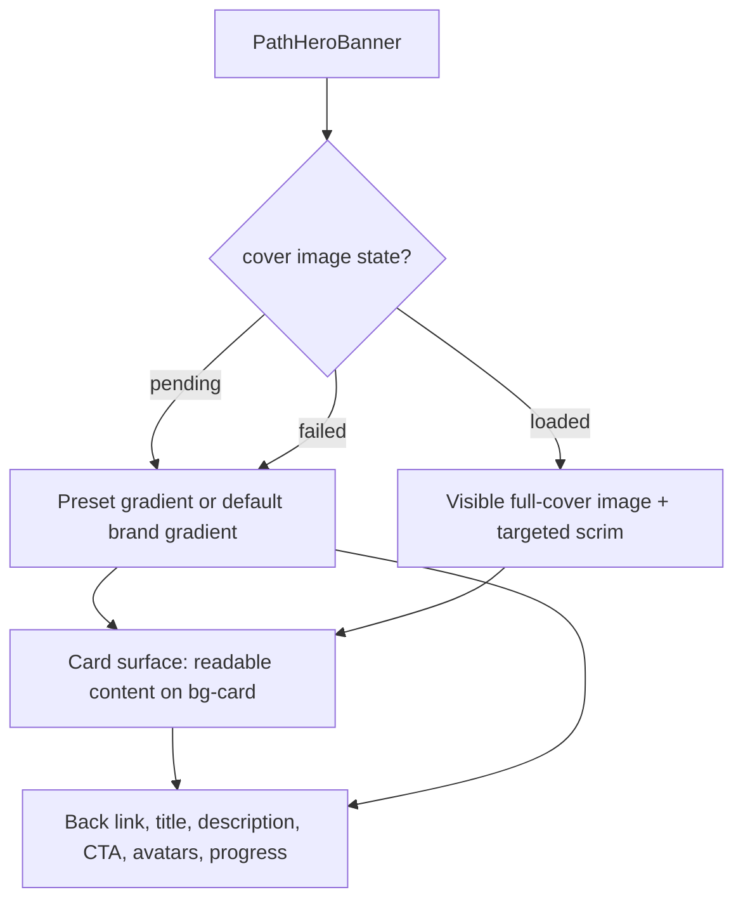

# feat: Improve learning track detail hero UI

## Overview

Improve the `/learning-tracks/:trackId` detail hero now that user-uploaded track cover images display there. Uploaded images should feel like premium cover art without making the track title, description, metadata, back link, CTA, or progress text hard to read. The same work should also lock down the reported navigation bug where **Back to Learning Tracks** can send the user to a course detail page instead of `/learning-tracks`.

The intended design direction is a cinematic uploaded-image hero with the uploaded cover remaining visibly recognizable as the primary full-cover image layer. Readability should come from targeted scrims and tokenized text/control surfaces, with optional blurred ambience only as a secondary layer that never replaces or obscures the recognizable cover.

## Problem Frame

The current hero renders uploaded `coverImageUrl` as a full-bleed `object-cover` background and applies a single vertical black gradient. That works for dark images, but bright or busy user-uploaded covers can make the title, especially examples like "Photography Mastery Roadmap", difficult to read.

The user also reports that clicking **Back to Learning Tracks** on the learning track detail page redirects to a course detail page. Current code already passes `backUrl="/learning-tracks"` into `PathHeroBanner`, and existing tests assert that link. The plan therefore treats navigation as a regression to characterize and guard across real rendered states, including direct URL entry, list-to-detail navigation, mobile hit areas, and CTA/back-link separation.

## Requirements Trace

- R1. Uploaded cover images remain recognizable and well-composed as the track hero background across desktop and mobile, with a visible full-cover image layer rather than an image reduced to decorative blur or hidden behind an opaque overlay.
- R2. Hero title, description, metadata badges, back link, CTA, avatar stack, and progress text stay readable over arbitrary bright, dark, and busy uploaded images.
- R3. No-cover states continue to render correctly with selected cover presets or the default brand gradient.
- R4. If a cover image fails to load, the hero falls back to the selected preset when present, otherwise the default brand gradient, without leaving broken-image UI.
- R5. **Back to Learning Tracks** always navigates to `/learning-tracks` from `/learning-tracks/:trackId`.
- R6. The learning CTA remains separate from the back link and continues to navigate to the intended course or lesson route.
- R7. Mobile and keyboard users can reliably see and activate the back link and CTA with visible focus and usable hit targets.

## Scope Boundaries

- No changes to Supabase Storage upload, RLS, bucket policy, or `pathCoverUpload` behavior.
- No data model changes to `LearningPath`; `coverImageUrl` and `coverPreset` remain the existing display inputs.
- No new npm packages or manifest changes.
- No redesign of the learning tracks listing cards or cover picker dialog.
- No changes to course/lesson CTA target selection beyond preserving its existing behavior.
- No addition of a new `coverImageVersion` data field; image identity stays derivable from the existing `coverImageUrl` field alone. Same-URL file-content replacement is not guaranteed without upstream cache-busting or versioned URL metadata, which is out of scope unless already available.

## Context & Research

### Relevant Code and Patterns

- `src/app/components/learning-path/PathHeroBanner.tsx` is the primary implementation point. It currently chooses image > preset gradient > default brand gradient and renders the back link, title, description, CTA, avatar stack, and progress row.
- `src/app/pages/LearningTrackDetail.tsx` composes the full-width hero and currently passes `backUrl="/learning-tracks"` and `backLabel="Back to Learning Tracks"`.
- `src/app/routes.tsx` defines the canonical routes: `/learning-tracks` and `/learning-tracks/:trackId`. Legacy `/learning-paths/*` redirects to `/learning-tracks`.
- `src/app/components/learning-path/__tests__/PathHeroBanner.test.tsx` already verifies the default back-link href and CTA route behavior.
- `tests/e2e/learning-tracks.spec.ts` already covers listing, detail navigation, the hero back link href, and clicking the back link back to `/learning-tracks`.
- `tests/e2e/learning-path-detail.spec.ts` still exists and should be reconciled with the canonical `/learning-tracks` route or merged into `learning-tracks.spec.ts` so stale legacy coverage does not fail independently.
- `src/app/components/figma/PathCardHeader.tsx` uses the same image > preset gradient pattern for cards, with an image overlay only sized for card headers.
- `src/app/components/library/BookDetailHero.tsx` is a local precedent for premium cover ambience and tokenized readable surfaces, but this plan adapts the pattern so the learning-track uploaded cover remains a visible full-cover image. The `BookDetailHero` blur treatment may be reused only as secondary ambience; readability should primarily come from targeted scrims and `bg-card` / `bg-background` surfaces.
- `src/styles/theme.css` and local Tailwind conventions favor design tokens (`bg-card`, `text-foreground`, `text-muted-foreground`, `border-border`, `bg-brand`) over raw custom color systems.
- `.claude/workflows/design-review/design-principles.md` documents the 8px grid, touch target minimum of 44x44px, border radii (cards `rounded-[24px]`, buttons `rounded-xl`), and WCAG 2.1 AA contrast requirements.

### Institutional Learnings

- `docs/solutions/best-practices/learning-tracks-pages-implementation-patterns-2026-05-09.md` documents the `backUrl` / `backLabel` prop pattern for shared components across URL namespaces. Shared components should not infer namespace from location.
- `docs/solutions/best-practices/learning-track-detail-hero-thumbnails-2026-05-14.md` documents the invariant that hero thumbnails must be path-scoped and ordered by `LearningPathEntry.position`; this plan preserves `orderedCourseThumbnails`.
- `docs/solutions/best-practices/learning-path-detail-hero-redesign-lessons-2026-05-08.md` documents the full-width hero breakout, overlapping content, gradient-token usage, and high-contrast CTA-on-gradient pattern.
- `docs/solutions/best-practices/tailwind-v4-jit-class-literal-resolver-2026-04-25.md` warns not to construct Tailwind classes dynamically with interpolation. New hero variants should use complete literal class branches or token maps.
- `docs/solutions/best-practices/2026-04-25-e2e-tests-need-guest-mode-init-script-post-e92-auth-gate.md` applies to E2E coverage for guarded routes; use the existing fixture and navigation helpers rather than bypassing auth inconsistently.

### External References

None. The repo has strong local patterns for React Router navigation, Tailwind hero surfaces, cover image display, and Playwright coverage.

## Key Technical Decisions

- **Treatment choice: visible uploaded cover with targeted readable surfaces.** Three approaches were evaluated: (1) stronger content-side gradient scrim, (2) subtle text/control backing panels, and (3) `BookDetailHero`-style blurred atmosphere with foreground card surface. The chosen treatment combines (1) and (2), borrowing only the premium surface language from (3): render the uploaded image as a visible full-cover `object-cover` layer, then use localized gradient scrims plus `bg-card` / `bg-background` surfaces behind text and controls. A blurred duplicate may be added as secondary ambience only if the full-cover image remains the primary visible layer. This keeps uploaded artwork recognizable while decoupling text readability from cover luminance.
- **Keep image, preset, and default gradient as one visual state machine.** The hero should still prefer `coverImageUrl`, then `coverPreset`, then the default brand gradient. If the image fails, mark it unavailable and re-enter the preset/default branch.
- **Use a pending -> loaded -> failed image state.** While an uploaded cover is pending, keep the preset/default gradient and readable content surfaces active; promote the cover image only after `onLoad`; on `onError`, fall back to preset/default. The image identity is the `coverImageUrl` string itself — stable across non-image metadata changes (title, description, etc.) because it only changes when the image reference changes. No `path.updatedAt` coupling. Same-URL content replacement is not guaranteed by this component; it requires upstream cache-busting or versioned URL metadata so `coverImageUrl` changes.
- **Make readability measurable, not only visible.** Use deterministic bright, dark, and busy cover fixtures plus the user-reported photography-style image. Pass/fail thresholds: normal text and controls at 4.5:1, large title text at 3:1, and non-text focus/icon/border indicators at 3:1. Check title, description, metadata badges, back link rest/hover/focus, CTA rest/hover/focus, avatar overflow label, progress text, and dropdown/focus states. Prefer automated checks against the composed rendered result: where text is on a solid token surface, compute WCAG contrast from `getComputedStyle` foreground/background colors; where scrims overlap imagery, sample Playwright screenshots behind the element bounding box (or document manual pixel-sampling verification) so the measured background is the rendered composite, not a design-token assumption. Playwright `toBeVisible()` is necessary but not sufficient.
- **Treat the back-link issue as a rendered-flow regression, not just a prop typo.** Because the current code and tests already assert `/learning-tracks`, implementation should check for hit-area overlap, mobile layout, direct-entry router state, and accidental CTA activation.
- **Preserve CTA routing.** The back link must go to `/learning-tracks`; the CTA must continue to go to `/courses/:courseId` or `/courses/:courseId/lessons/:lessonId` when a `targetLessonId` exists.
- **Use literal Tailwind classes.** Any conditional image/preset/default styles should be complete strings that Tailwind v4 can see at build time.

## Open Questions

### Resolved During Planning

- **Should readability be solved with only a stronger overlay or a content panel?** Use a visible full-cover image with targeted scrims and card/pill surfaces. This borrows the readable token-surface language from `BookDetailHero` without reducing the uploaded cover to a decorative blurred backdrop.
- **What should happen when the uploaded cover image fails to load?** Fall back to `coverPreset` if present, otherwise the default brand gradient.
- **Should this touch cover upload/storage?** No. Uploaded-cover availability is a separate storage/RLS concern already covered by the 2026-05-31 cloud storage plan.
- **Should the back-link fix replace the `backUrl` prop pattern?** No. Preserve the explicit prop pattern; strengthen implementation and tests around rendered behavior.
- **Which readability treatment to use?** A visible uploaded-cover hero with targeted readable surfaces and optional secondary blur ambience. See Key Technical Decisions for full rationale.

### Deferred to Implementation

- **Exact E2E fixture image:** choose a stable bright/busy image fixture or data URL that exercises contrast without relying on network.
- **Whether the user-reported back-link bug reproduces on current source:** see Unit 1 for characterization approach and branching guidance.

## Implementation Units

- [ ] **Unit 1: Characterize and lock down the back-link regression**

**Goal:** Prove the back link on `/learning-tracks/:trackId` always points to and activates `/learning-tracks`, while the CTA keeps routing to courses/lessons.

**Requirements:** R5, R6, R7

**Dependencies:** None

**Files:**
- Modify: `src/app/components/learning-path/__tests__/PathHeroBanner.test.tsx`
- Modify: `tests/e2e/learning-tracks.spec.ts`
- Modify or retire/merge: `tests/e2e/learning-path-detail.spec.ts`
- Modify if characterization reveals an issue: `src/app/components/learning-path/PathHeroBanner.tsx`
- Modify if characterization reveals an issue: `src/app/pages/LearningTrackDetail.tsx`

**Approach:**
- Keep `backUrl="/learning-tracks"` and `backLabel="Back to Learning Tracks"` explicit at the `LearningTrackDetail` call site.
- Add or tighten tests that distinguish the back link from the CTA link in the same hero.
- In E2E, cover both navigation paths: list-to-detail and direct `/learning-tracks/:trackId` entry.
- Add a narrow-viewport click regression to catch touch/hit-area overlap, especially after the hero layout changes.
- Click the visible **Back to Learning Tracks** text or its center point, not only the `data-testid` locator, and verify the pointer target is the back link rather than a CTA or overlay.
- Reconcile `tests/e2e/learning-path-detail.spec.ts` with the canonical `/learning-tracks` namespace so an obsolete `/learning-paths/:id` expectation cannot fail outside the new tests.
- **Root cause hypothesis (structured, pre-implementation):**
  - Hypothesis A (most likely — stale deployment): The current source already asserts the correct `/learning-tracks` href, and component/E2E tests pass. The reported bug may be from a deployed build that predates the fix or runs different route logic. **Branch action:** If all tests pass on current source, annotate as "deployment-only: source-correct, deploy-stale" and do NOT block Units 2-4.
  - Hypothesis B (medium — hit-area overlap after layout changes): The `Link` for the back link and the `Link` for the CTA are adjacent elements inside the hero. At mobile viewports, or after future layout changes, pointer events from the back-link region could hit the CTA's clickable area, causing navigation to `/courses/:courseId`. **Branch action:** Add a mobile-viewport E2E test with explicit pointer-target verification. If this reproduces, fix by enforcing separate layout rows with a minimum 8px gap and 44px touch targets.
  - Hypothesis C (medium — accidental CTA activation via pointer event): The back link is a `<Link to={backUrl}>` and the CTA is a `<Link to={...}>`. If the back link's rendered `href` is somehow overridden or intercepted by a parent click handler, the CTA could consume the click. **Branch action:** Add a component test that clicks both and asserts independent href targets.
  - Hypothesis D (low — routing middleware intercept): No middleware or route guards intercept `/learning-tracks` paths in `src/app/routes.tsx`. De-prioritize unless A-C are eliminated.
  - **Branching guidance:** Run characterization coverage (component tests + existing E2E) first. If the bug reproduces: fix per findings, then proceed to Units 2-4 (Unit 1 blocks). If the bug does NOT reproduce: document the most likely hypothesis (A — stale deployment), add regression guards, and proceed to Units 2-4 without blocking. The tests themselves become the permanent guard.

**Execution note:** Start with failing or characterization coverage for the reported wrong destination before changing the hero layout.

**Patterns to follow:**
- `docs/solutions/best-practices/learning-tracks-pages-implementation-patterns-2026-05-09.md`
- Existing `data-testid="hero-back-link"` in `PathHeroBanner`
- Existing `navigateAndWait` and IndexedDB seeding helpers in `tests/e2e/learning-tracks.spec.ts`

**Test scenarios:**
- Happy path: from the list, open a seeded track, click `hero-back-link` -> URL is exactly `/learning-tracks`.
- Happy path: direct-load `/learning-tracks/:trackId`, click `hero-back-link` -> URL is exactly `/learning-tracks`.
- Happy path: click the hero CTA on the same page -> URL is a `/courses/...` route, proving CTA behavior is preserved separately.
- Edge case: at a mobile-width viewport, tap `hero-back-link` -> URL is exactly `/learning-tracks`.
- Edge case: component test with `targetLessonId` still sends the CTA to `/courses/:courseId/lessons/:lessonId`, not the back link.
- Integration: E2E seeds `learningPathEntries` plus `importedVideos` for the CTA course before asserting the CTA reaches `/courses/:courseId/lessons/:lessonId`.

**Verification:**
- The back-link href and click behavior are covered by unit/component tests and Playwright.
- The reported wrong redirect to a course detail page is either reproduced and fixed or explicitly guarded against by the new regression tests.
- A root cause hypothesis is documented in the PR notes.

---

- [ ] **Unit 2: Add a premium readable uploaded-cover hero treatment**

**Goal:** Make uploaded cover images feel cinematic and recognizable while ensuring the hero content remains readable over bright, busy, and dark covers.

**Requirements:** R1, R2, R3, R7

**Dependencies:** Unit 1 preferred first, so navigation behavior is protected before moving hit areas and surfaces. If Unit 1 characterizes the bug as non-reproducible (stale-deployment hypothesis), Unit 2 need not wait — proceed in parallel.

**Files:**
- Modify: `src/app/components/learning-path/PathHeroBanner.tsx`
- Test: `src/app/components/learning-path/__tests__/PathHeroBanner.test.tsx`
- Test: `tests/e2e/learning-tracks.spec.ts`

**Approach:**
- **Chosen treatment: visible uploaded-cover hero with targeted readability surfaces.** The hero keeps the uploaded cover as a full-cover `object-cover` image layer, then adds localized scrims and foreground token surfaces so text and controls remain readable. This adapts the `BookDetailHero` quality bar without copying its low-opacity blurred image as the primary image treatment.
  1. Keep the uploaded image full-bleed, normally sharp, and recognizable: render an `img` inside an `absolute inset-0` image layer with `h-full w-full object-cover`. Do not make this primary image `opacity-20`, fully blurred, or purely decorative atmosphere.
  2. Apply a targeted gradient scrim over the visible image, strongest behind the content column and control row, while leaving enough of the cover unobscured for composition and subject recognition.
  3. Render text-heavy content on tokenized surfaces (`bg-card/95`, `bg-background/90`, `bg-muted`) with `text-foreground` / `text-muted-foreground`. Scrims support composition; surfaces carry the contrast guarantee.
  4. Optionally render a blurred duplicate (`opacity-20 blur-2xl scale-110`) behind or around the visible image as ambient glow, but only if screenshots still show the main cover as the recognizable image layer. If the blur competes with recognizability, omit it.
  5. When no cover image is active (pending, failed, or no `coverImageUrl`), the image layer is absent and the section shows the preset gradient or default brand gradient as its background, with the same readable content surfaces. Text treatment remains consistent across all states.
  6. Preserve the existing full-width breakout (`-mx-4 -mt-4` at `LearningTrackDetail` call site) and the negative margin overlap (`-mt-10`) pattern.
  7. Keep the CTA's `bg-card text-brand` pattern as documented.
- **Concrete design values (locked, not deferred):**
  - Hero container: `relative overflow-hidden rounded-[28px] border border-border/50 shadow-card-ambient`
  - Padding: `p-4 sm:p-8` (mobile 16px, desktop 32px)
  - Primary cover image: `absolute inset-0 h-full w-full object-cover`
  - Scrim gradient: `absolute inset-0 bg-gradient-to-br from-background/15 via-background/45 to-background/80`
  - Content surface: `relative rounded-[28px] border border-border/50 bg-card/95 shadow-card-ambient backdrop-blur-md`
  - Optional ambience only: `absolute inset-0 h-full w-full object-cover opacity-20 blur-2xl scale-110`
  - Title: `text-[28px] sm:text-[36px] lg:text-[44px] font-display font-extrabold tracking-tight text-foreground`
  - Description: `text-base sm:text-lg leading-relaxed text-muted-foreground max-w-2xl`
  - Back link: `inline-flex items-center gap-1.5 text-sm font-medium text-muted-foreground hover:text-foreground transition-colors` (matches BookDetailHero pattern)
  - Metadata badge: `rounded-full bg-muted px-3 py-1 text-xs font-bold uppercase tracking-widest`
  - CTA: `min-h-[44px] rounded-xl px-6 py-3 bg-card text-brand font-bold shadow-lg` (existing pattern, 44px touch target)
  - Avatar stack: `size-10 rounded-full ring-2 ring-border bg-muted` (existing)
  - Avatar overflow: `size-10 rounded-full ring-2 ring-border bg-muted text-xs font-bold`
  - Progress text: `text-sm font-medium text-muted-foreground`
  - Focus indicator: inherit global `2px solid var(--focus-ring)` (already in theme.css base layer)
  - Touch targets: all interactive elements use `min-h-[44px]`
  - Spacing grid: 8px base (`gap-2`, `gap-3`, `gap-6`, `mb-4`, `mb-6`, `mt-6`, `mt-8`)
  - Dropdown action button: `size-11 bg-muted backdrop-blur-md text-muted-foreground rounded-full` (existing)

**Technical design:** Directional guidance, not implementation specification.

**Patterns to follow:**
- `src/app/components/library/BookDetailHero.tsx` for premium readable surfaces and optional ambient cover treatment, adapted so the uploaded cover remains the visible primary image.
- `docs/solutions/best-practices/learning-path-detail-hero-redesign-lessons-2026-05-08.md` for full-width hero and CTA-on-gradient patterns.
- `src/app/components/figma/PathCardHeader.tsx` for existing image/preset/default cover priority.
- `.claude/workflows/design-review/design-principles.md` for 44px touch targets, 8px grid, WCAG AA contrast, and border-radius conventions.

**Test scenarios:**
- Happy path: path with `coverImageUrl` renders a full-cover visible `object-cover` image layer and renders title/description/meta on explicit readable surfaces.
- Happy path: path with a bright/busy cover keeps title, description, metadata, back link, CTA, avatar stack, and progress text visible and readable with measured WCAG 2.1 AA contrast on the composed rendered result.
- Happy path: deterministic bright, dark, and busy cover fixtures show recognizable cover imagery after scrims/surfaces are applied.
- Happy path: path with no cover image and a `coverPreset` still renders the preset gradient branch with card surface.
- Happy path: path with neither image nor preset still renders the default brand gradient branch with card surface.
- Edge case: very long title wraps without overlapping the back link, CTA, or avatar/progress row.
- Edge case: no description still produces balanced vertical spacing in the content surface.
- Edge case: cover image layers are rendered as `alt=""` (decorative) per accessibility best practices.
- Accessibility: keyboard focus is visible on back link and CTA over the new hero surface.
- Accessibility: all interactive elements meet 44x44px minimum touch target.
- Accessibility: contrast checks cover title (>=3:1), normal text/controls (>=4.5:1), and non-text focus/icon states (>=3:1) using computed styles for solid surfaces and screenshot sampling where imagery affects the background.

**Verification:**
- The title is legible over bright, dark, busy, and photography-style uploaded covers.
- The uploaded image remains recognizable and well-composed as the primary visible hero image at desktop and mobile widths.
- Preset/default gradient states are visually preserved.
- Screenshot comparison shows the hero matches the `BookDetailHero` visual quality bar: recognizable cover image, readable text, cohesive surfaces, and no image-only-as-blur treatment.

---

- [ ] **Unit 3: Add cover image load-state and fallback behavior**

**Goal:** Prevent pending or broken cover images from leaving the hero in a half-rendered or unreadable image state.

**Requirements:** R3, R4

**Dependencies:** Unit 2, because fallback should use the same visual state machine and readable content surfaces.

**Files:**
- Modify: `src/app/components/learning-path/PathHeroBanner.tsx`
- Test: `src/app/components/learning-path/__tests__/PathHeroBanner.test.tsx`

**Approach:**
- Track cover image state inside `PathHeroBanner`: `pending`, `loaded`, and `failed`.
- While pending, render the preset/default gradient branch plus the readable content-surface treatment so text is stable before the image arrives.
- Once loaded, reveal the uploaded image as the visible full-cover layer beneath targeted scrims and readable content surfaces, with a subtle reduced-motion-aware fade.
- Once failed, render as though there is no usable image: use `path.coverPreset` if available, otherwise the default brand gradient.
- **Image identity mechanism (stable, non-`updatedAt` coupling):** The identity is derived from `path.coverImageUrl` alone — a string-to-string hash or the URL string itself used as a React `key`. This identity is stable across non-image metadata changes (title, description, difficulty, etc.) because those do not affect `coverImageUrl`. When the URL changes, React remounts the image and re-runs `onLoad` / `onError`. If the same Supabase URL hosts different file contents, this component cannot reliably detect the replacement or bypass browser/CDN cache; same-URL content replacement requires upstream cache-busting or versioned URL metadata and is out of scope unless already present. No `path.updatedAt`, no `coverImageVersion` field.
- Use the image URL as the rendered `` `key` attribute to trigger React unmount/remount when the URL changes, ensuring fresh `onLoad`/`onError` callbacks.
- Keep the image decorative (`alt=""`) and avoid showing a browser broken-image icon.

**Patterns to follow:**
- The existing image > preset gradient > default gradient branch in `PathHeroBanner`.
- The cover priority in `PathCardHeader`.
- Tailwind v4 literal class guidance from `docs/solutions/best-practices/tailwind-v4-jit-class-literal-resolver-2026-04-25.md`.

**Test scenarios:**
- Happy path: valid `coverImageUrl` renders the visible full-cover image branch with targeted scrims and readable surfaces.
- Happy path: pending `coverImageUrl` keeps the fallback gradient/readable content surfaces active until `onLoad`.
- Error path: image `onError` with a `coverPreset` present switches to the preset gradient branch.
- Error path: image `onError` with no `coverPreset` switches to the default brand gradient branch.
- Edge case: changing `coverImageUrl` after an error resets fallback state and attempts to render the new image (verified via `key` attribute remount).
- Edge case: same-URL content replacement is not promised by this component; test only URL-change reset behavior unless upstream cache-busted URLs already exist.
- Edge case: non-image metadata changes (title, description, `updatedAt`) do NOT reset image state — the image identity is stable against these changes.
- Regression: avatar stack images remain unaffected by the hero cover fallback.

**Verification:**
- Broken cover URLs do not show broken-image UI.
- The hero remains readable and polished when image loading fails.
- The hero remains readable while an uploaded image is pending.
- Changing title/description/updatedAt does not cause unnecessary cover image reload.

---

- [ ] **Unit 4: Add responsive, accessibility, and visual-state coverage**

**Goal:** Make the polished hero reliable across desktop, mobile, keyboard navigation, and the main cover states.

**Requirements:** R1, R2, R3, R5, R6, R7

**Dependencies:** Units 1-3

**Files:**
- Modify: `tests/e2e/learning-tracks.spec.ts`
- Modify as needed: `src/app/components/learning-path/__tests__/PathHeroBanner.test.tsx`
- Modify as needed: `src/app/components/learning-path/PathHeroBanner.tsx`

**Approach:**
- Seed at least one detail-page scenario with `coverImageUrl` so E2E exercises the uploaded-image hero, not only gradient fallback.
- Use a local fixture or deterministic data URL for a bright/busy cover image so tests do not depend on remote image availability.
- Cover desktop and one mobile viewport around 375px for the back-link and CTA hit areas.
- Prefer assertions on user-visible outcomes and geometry where useful: visible heading, visible back link, visible CTA, readable content surface, correct URL after click.
- When seeding entries or imported videos, clear `learningPathEntries` and `importedVideos` alongside `learningPaths`; the existing `clearLearningPath` helper only clears the path store.
- Do not assert brittle class names for design internals unless the unit test needs a stable marker for the image/fallback branch.
- **Concrete mobile and accessibility values to validate:**
  - Touch targets: minimum 44x44px for back link, CTA, dropdown action button.
  - Back link and CTA must be in separate layout rows or have a minimum 8px gap.
  - Focus indicators: 2px solid `var(--focus-ring)` with 2px offset, >=3:1 contrast against `bg-card`.
  - Readability thresholds: large title >=3:1, normal text and controls >=4.5:1, non-text focus/icon states >=3:1.
  - Measurement method: computed foreground/background contrast for solid token surfaces; screenshot pixel sampling behind text/control bounding boxes where cover imagery and scrims affect the final background.
  - Mobile (375px): content column should not exceed viewport width; no horizontal scroll.
  - Keyboard tab order: back link -> CTA -> dropdown (if present).

**Patterns to follow:**
- Existing route-guard-compatible fixtures in `tests/support/fixtures`.
- Existing `seedIndexedDBStore`, `clearLearningPath`, and `navigateAndWait` helpers.
- `docs/solutions/ui-bugs/audiobook-cover-letterbox-flex-compression-2026-04-25.md` guidance to test rendered geometry when image layout is the concern.
- `tests/e2e/learning-tracks.spec.ts` for existing back-link and CTA E2E patterns.

**Test scenarios:**
- Happy path: desktop detail page with uploaded cover shows title, description, metadata, back link, CTA, avatar stack, and progress text.
- Happy path: mobile detail page with uploaded cover shows title and back link without overlap and back link navigates to `/learning-tracks`.
- Happy path: preset/default gradient detail pages still show title and CTA after the hero refactor.
- Happy path: visual confirm that the uploaded cover remains recognizable as a visible full-cover image within the hero section.
- Edge case: long title wraps inside the card surface without causing horizontal overflow at 375px viewport.
- Accessibility: tabbing reaches the back link and CTA with visible focus meeting the >=3:1 non-text contrast threshold.
- Accessibility: back link and CTA each meet 44x44px touch target minimum.
- Integration: back link and CTA remain distinct clickable targets; each navigates to the expected route.
- Integration: hero renders inside the full-width breakout (no misalignment with the page grid).

**Verification:**
- Component tests and Playwright cover uploaded image, pending image, image fallback, preset/default gradient, desktop, and mobile states.
- Before/after screenshots and contrast measurements confirm the hero feels premium, the title remains readable over the user-provided photography cover style, and the uploaded image remains recognizable.
- Mobile viewport (375px) shows all hero content without horizontal scroll or clipped text.

## System-Wide Impact

- **Interaction graph:** `LearningTrackDetail` -> `PathHeroBanner` for hero rendering and navigation. `PathHeroBanner` owns both back-link and CTA hit areas, so layout changes must preserve both interactions.
- **Error propagation:** No new application-level error path. Image load failure is handled locally by falling back to a gradient visual state.
- **State lifecycle risks:** Cover fallback state uses the cover image URL string as its identity key — stable across non-image metadata changes. No `updatedAt` coupling. Same-URL file replacement is not covered without cache-busted/versioned URL metadata.
- **API surface parity:** `PathHeroBanner` props should remain backward-compatible. No caller should be forced to provide new required props.
- **Integration coverage:** Unit tests can prove hrefs and branch rendering; Playwright must prove real click behavior, mobile hit areas, and route outcomes.
- **Unchanged invariants:** `orderedCourseThumbnails` stays path-scoped and ordered; `targetLessonId` CTA behavior stays intact; route namespace remains `/learning-tracks`; cover upload/storage behavior is unchanged.

## Risks & Dependencies

| Risk | Mitigation |
|------|------------|
| Strong overlay makes uploaded cover images feel too muted | Keep a sharp, visible full-cover image layer as the primary presentation; use targeted scrims and token surfaces for readability, with optional blur only as secondary ambience. |
| Back-link bug is caused by stale deployed code rather than current source | Add regression tests for the intended behavior anyway; if bug does not reproduce, document as stale-deployment hypothesis and do not block Units 2-4. |
| New readable surfaces feel visually heavy on preset/default gradients | Keep the full-cover/preset/default visual layer visible and use surfaces only where text and controls need contrast. Accept modest visual weight as the trade-off for measurable readability. |
| Mobile hit areas overlap after the hero polish | Add mobile E2E coverage and keep the back link and CTA in separate layout regions with 44px touch targets. |
| Tailwind v4 purges conditional classes | Use complete literal class strings or explicit maps; avoid interpolating utility fragments. |
| Broken image fallback hides a later valid image | Reset state on `coverImageUrl` change via React `key` attribute; do not use `path.updatedAt` which couples to non-image metadata changes. Same-URL replacement needs upstream cache-busting/versioned URLs and is out of scope. |

## Documentation / Operational Notes

- No deployment or database work is required.
- No security scan is required unless implementation unexpectedly changes a package manifest. If a manifest changes, follow the user rule: scan for vulnerabilities, fix only scanner-reported issues at the requested version that relate to the change, then scan again.
- If implementation discovers the back-link bug is deployment-only, record that in the PR notes while keeping the regression coverage.
- The `deepened: 2026-05-31` frontmatter mark indicates this plan was strengthened in response to a deepening review. The latest critic pass further tightened three blockers: (1) uploaded covers must remain visible and recognizable as the primary image layer, (2) readability requires explicit WCAG contrast thresholds and measurement methods, and (3) same-URL file replacement is out of scope unless upstream cache-busted/versioned URLs are available.

## Sources & References

- User request and screenshot: uploaded cover image now displays on the learning track detail page, but the title is hard to read; **Back to Learning Tracks** can route to the wrong location.
- Related requirements: `docs/brainstorms/2026-05-09-learning-track-ux-improvements-requirements.md`
- Related plan: `docs/plans/2026-05-09-003-feat-learning-track-ux-improvements-plan.md`
- Related plan: `docs/plans/2026-05-31-001-fix-learning-track-cover-upload-rls-cloud-plan.md`
- Related learning: `docs/solutions/best-practices/learning-tracks-pages-implementation-patterns-2026-05-09.md`
- Related learning: `docs/solutions/best-practices/learning-track-detail-hero-thumbnails-2026-05-14.md`
- Related learning: `docs/solutions/best-practices/learning-path-detail-hero-redesign-lessons-2026-05-08.md`
- Related code: `src/app/components/learning-path/PathHeroBanner.tsx`
- Related code: `src/app/pages/LearningTrackDetail.tsx`
- Related code: `src/app/routes.tsx`
- Related code: `src/app/components/library/BookDetailHero.tsx`
- Related tests: `src/app/components/learning-path/__tests__/PathHeroBanner.test.tsx`
- Related tests: `tests/e2e/learning-tracks.spec.ts`
- Related design: `.claude/workflows/design-review/design-principles.md`
- Related design: `src/styles/theme.css`
