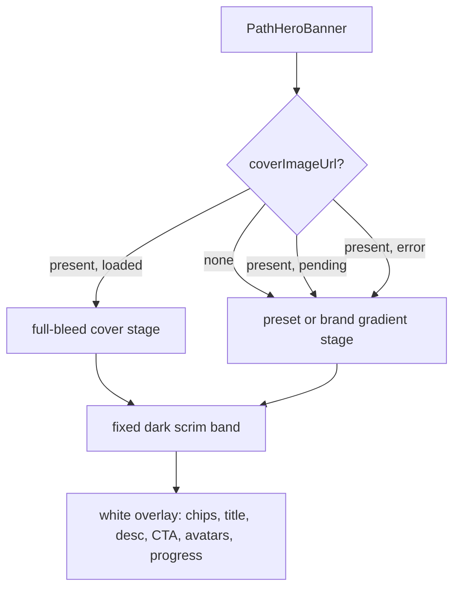

# feat: Cinematic redesign of the learning track detail page

## Overview

Redesign `/learning-tracks/:trackId` (`LearningTrackDetail`) into a cinematic, cover-driven
experience. The user-uploaded track cover (`LearningPath.coverImageUrl`) becomes the emotional
anchor of the page: it fills a tall "now showing" hero stage with a film-poster gradient, the
track title and a single bold CTA are rendered like a movie title card, and the cover's color
bleeds softly down the page as ambient atmosphere behind frosted-glass content surfaces.

This work intentionally **supersedes the mechanism** chosen on 2026-06-01
(`docs/solutions/best-practices/learning-track-hero-cover-readability-contrast-testing-2026-06-01.md`),
which carried text contrast on a solid `bg-card/95` surface and exposed only a thin strip of the
cover. It does **not** abandon that solution's *requirement*: the cover must stay recognizable and
text contrast must be **measurable** (WCAG 2.1 AA). The new design satisfies both more strongly —
the cover is now full-bleed (more recognizable, not less), and contrast is carried by a **fixed,
theme-independent dark scrim** in the text band rather than a card surface.

### Visual thesis (frontend-design Layer 1)

> A cinematic "now showing" stage. The track cover fills a tall, gently drifting hero behind a
> film-poster gradient; the title and one decisive CTA read like a title card. The cover's palette
> glows softly down the page as ambient atmosphere, and the Continue-Learning, Syllabus, and
> Progress panels float like premium frosted glass over that atmosphere. Mood: immersive, premium,
> focused — a dark cinema island within an otherwise light app. Material: glass, soft bloom,
> deep gradients, faint vignette. Energy: calm but dramatic — a slow Ken Burns drift and a staggered
> fade-up entrance, all motion-safe.

### Content plan

Hero (cover stage) → Continue Learning (current course) → Syllabus (timeline) → Progress + Track Info
(sidebar). Order and information are preserved; only staging, surfaces, and hierarchy change.

### Interaction plan

1. **Hero entrance** — cover scales `1.05 → 1.0` with a fade (Ken Burns), title/meta/CTA fade-up staggered.
2. **Ambient cover glow** — a blurred, low-opacity cover backdrop tints the page behind solid content cards.
3. **CTA + ring affordances** — CTA lifts and glows on hover; the progress ring gets a soft brand glow.

All motion is gated by `useReducedMotion()` / `motion-safe:` and collapses to a static composition.

## Problem Frame

The current hero (`PathHeroBanner`) renders the uploaded cover as a sharp full-cover image exposed
only above a `bg-card/95 backdrop-blur-md` content card (a deliberate "card-within-card" mat-frame).
It is readable and safe but visually timid: the cover is reduced to a banner strip, the title sits on
a flat white panel, and nothing about the page feels cinematic or cover-led. The user wants the
uploaded cover to drive a dramatic, immersive presentation while staying readable across the four
color schemes (default warm, clean, apple), dark mode, the vibrant toggle, and arbitrary
bright/dark/busy uploaded covers.

The challenge is reconciling "cinematic overlay" with the hard-won institutional learning that
overlaying text on arbitrary imagery is only acceptable when contrast is **measured and guaranteed**.
The resolution is a fixed dark gradient scrim whose darkest band (where text lives) guarantees white
text ≥ 4.5:1 against *any* cover pixel — independent of the cover and of the app theme.

## Requirements Trace

- R1. The uploaded cover (`coverImageUrl`) drives a tall, full-bleed cinematic hero stage on desktop, tablet, and mobile.
- R2. Hero title, metadata, back link, CTA, avatar stack, and progress remain readable with **measured** WCAG 2.1 AA contrast over arbitrary bright, dark, and busy covers and across all four themes + dark mode + vibrant.
- R3. No-cover states (selected `coverPreset`, or default brand gradient) render the same cinematic stage with the gradient standing in for the cover.
- R4. A failed cover image falls back to the preset (if set) or the default brand gradient with no broken-image UI, preserving the existing pending → loaded → failed state machine keyed by `coverImageUrl`.
- R5. The cover's palette extends down the page as a subtle, decorative cover-derived atmosphere that never reduces the readability of the content cards.
- R6. **Back to Learning Tracks** still navigates to `/learning-tracks`; the CTA still navigates to `/courses/:courseId` (or `/courses/:courseId/lessons/:lessonId` when a `targetLessonId` exists). Back link and CTA remain distinct, separated, 44×44px-minimum targets.
- R7. The Continue-Learning bento, Syllabus card, and Progress sidebar receive cohesive cinematic polish **without behavior changes** (reorder, manual completion, navigation, and progress math are untouched).
- R8. All motion respects `prefers-reduced-motion`; the static composition is fully usable and readable.

## Scope Boundaries

- No changes to Supabase Storage upload, RLS, the cover bucket policy, or the cover picker dialog.
- No data-model changes to `LearningPath`; `coverImageUrl` and `coverPreset` remain the only display inputs. No new `coverImageVersion` field.
- No changes to `PathTimeline` internal behavior (reorder, lesson accordions, manual completion, navigation) — only the surrounding Syllabus card surface is restyled.
- No changes to progress computation (`usePathProgress`, `enhancedProgress`) or navigation-context threading. (See the active correctness plan referenced under Risks.)
- No new npm packages or manifest changes.
- The redesign does not alter the learning-tracks **listing** page or its cards.

### Deferred to Separate Tasks

- **Supporting-component polish (Units 3–4)** may ship as a follow-up PR after the hero + atmosphere (Units 1–2) if a smaller first PR is preferred. The hero is the value centerpiece; the rest is cohesion.
- **A new `docs/solutions/` learning** documenting the "fixed-dark-scrim owns contrast" mechanism that supersedes the 2026-06-01 surface mechanism — to be captured via `ce:compound` after merge, not in this plan.

## Context & Research

### Relevant Code and Patterns

- `src/app/pages/LearningTrackDetail.tsx` — composes the full-width hero (`-mx-4 -mt-4 sm:-mx-6 sm:-mt-6` breakout), the `-mt-10` content overlap, the 2/3 + 1/3 grid, and the motion stagger via `staggerContainer`/`fadeUp` + `useReducedMotion`.
- `src/app/components/learning-path/PathHeroBanner.tsx` — primary change point. Owns the image > preset > default visual state machine, the cached-image `ref` promotion, the back link, title, description, CTA, avatar stack, progress text, and `data-testid` markers (`hero-section`, `hero-content-surface`, `hero-cover-image`, `hero-back-link`).
- `src/app/components/audiobook/AudiobookPlayerAtmosphere.tsx` — **the existing cinematic precedent**: a blurred cover backdrop + `--player-atmosphere-scrim` + `--player-atmosphere-vignette` + faint film grain. Reuse this pattern (scoped, not `fixed inset-0`) for the page atmosphere (R5).
- `src/app/components/library/BookDetailHero.tsx` — precedent for premium cover ambience (`opacity-20 blur-2xl scale-110` backdrop) and a `rounded-[28px] shadow-card-ambient` shell. The cinematic hero keeps the shell language but replaces the blurred-only backdrop with a sharp full-bleed cover + dark scrim.
- `src/app/components/learning-path/ContinueLearningBento.tsx` — current-course card with thumbnail, centered play button, progress bar, and "Continue lesson" CTA. Polish target (Unit 3).
- `src/app/components/learning-path/PathProgressSidebar.tsx` — "Your Progress" ring card (`PathProgressRing`) + "Track Info" card. Polish target (Unit 4).
- `src/app/components/figma/PathProgressRing.tsx` — SVG ring; supports `strokeColor`, sizes, and a center `children` slot. Glow is additive (wrapper), no internal change required.
- `src/styles/theme.css` — token source. Note the `--player-atmosphere-*`, `--player-cover-halo`, `shadow-card-ambient`, `--focus-ring` (per-theme, ≥3:1), and the four schemes (`.clean`, `.apple`, `.dark.*`) + `.vibrant`. The cinematic scrim is intentionally **fixed black-based** (theme-independent) so white overlay text is guaranteed-readable in every scheme.
- `src/lib/motion.ts` — `staggerContainer`, `fadeUp`, `scaleIn` variants to reuse for hero entrance.
- `src/app/routes.tsx` — canonical routes `/learning-tracks` and `/learning-tracks/:trackId`; legacy `/learning-paths/*` redirects to `/learning-tracks`.

### Institutional Learnings

- `docs/solutions/best-practices/learning-track-hero-cover-readability-contrast-testing-2026-06-01.md` — **the most important reference.** Its rules to preserve: (a) keep the cover recognizable (the new full-bleed cover does this better); (b) measure contrast through a 1×1 canvas, not a regex, because engines emit `oklch()`/`color()`; (c) promote cached/`data:` covers via a `ref` because `onLoad` can miss; (d) use stable `data-testid`s and fail-loud measurement helpers (KI-099/KI-100). The only thing this plan changes is **where contrast comes from**: a fixed dark scrim band instead of a `bg-card/95` surface.
- `docs/plans/2026-05-31-002-feat-learning-track-detail-hero-ui-plan.md` — the prior hero plan; its requirement framing (recognizable cover + measured contrast + preserved navigation) carries forward.
- `docs/solutions/best-practices/learning-track-detail-hero-thumbnails-2026-05-14.md` — invariant: hero avatar thumbnails must stay path-scoped and ordered by `LearningPathEntry.position` (`orderedCourseThumbnails` is preserved).
- `docs/solutions/best-practices/learning-path-detail-hero-redesign-lessons-2026-05-08.md` — full-width breakout, overlapping content, gradient-token usage, and high-contrast CTA-on-gradient.
- `docs/solutions/best-practices/tailwind-v4-jit-class-literal-resolver-2026-04-25.md` — never build Tailwind classes by interpolation; use complete literal class strings or static maps (the `GRADIENT_COVER_CLASSES` map already follows this).

### External References

None required. The repo has strong local precedents for cover-driven atmosphere (`AudiobookPlayerAtmosphere`), premium hero shells (`BookDetailHero`), measured-contrast Playwright patterns, and the cover-image state machine. The cinematic overlay's contrast guarantee is a deterministic compositing result, not a library concern.

## Key Technical Decisions

- **Cinematic overlay with a fixed dark scrim owns contrast (supersedes the `bg-card/95` surface).**
  Text lives in the lower band of a tall cover stage, over a fixed black bottom-up gradient. The
  guarantee is a compositing fact, not a token: white text over any cover pixel under a black scrim of
  opacity ≥ ~0.54 yields ≥ 4.5:1 (worst case = a pure-white cover; see the math in Unit 5). The text
  band is designed to sit where the scrim is ≥ 0.70 opacity, leaving comfortable margin. Because the
  scrim is black and the text is white — both theme-independent — readability holds across all four
  themes, dark mode, and the vibrant toggle without per-theme tuning.

- **The hero is an intentionally dark "cinema island."** In light themes the hero reads as a dark
  stage (Netflix-detail-page convention). This is a deliberate, recognized cinematic pattern and the
  only robust way to keep white-on-cover text readable over arbitrary art regardless of theme. The
  rest of the page stays theme-tokenized; only the hero stage and the overlay text are fixed-dark/white.

- **Keep the image > preset > default state machine and the cached-image `ref` promotion.** The cover
  still prefers `coverImageUrl`, then `coverPreset`, then the brand gradient; identity is the
  `coverImageUrl` string used as the `` (stable across title/description/`updatedAt` changes).
  Pending shows the gradient stage; `onError` re-enters preset/default. No `updatedAt` coupling.

- **Cover-derived page atmosphere is decorative and never carries contrast.** A blurred, low-opacity
  cover backdrop (adapting `AudiobookPlayerAtmosphere`) sits behind the content area at `-z-10`, with
  `pointer-events-none` and `aria-hidden`. Content cards stay solid `bg-card` so the syllabus, bento,
  and sidebar keep their existing token contrast. The atmosphere is `motion-safe` and degrades to a
  faint static tint (or nothing) under reduced motion.

- **Supporting components get visual polish only — zero behavior change.** The bento, syllabus card,
  and sidebar restyle their surfaces (glass, glow, consistent `rounded-[24px]` radii) but keep every
  link target, reorder handler, completion toggle, and progress value identical.

- **Use literal Tailwind classes and static maps; the scrim/grain may use inline style only where a
  dynamic cover URL requires it** (matching `AudiobookPlayerAtmosphere`, which carries the
  `eslint-disable react-best-practices/no-inline-styles` exception for dynamic cover URLs).

- **Stable `data-testid`s drive the new contrast tests.** Add `hero-title`, `hero-scrim`, and keep
  `hero-section`, `hero-cover-image`, `hero-cta`, `hero-back-link`. Locate elements by testid, never by
  Tailwind class (KI-099/KI-100).

## Open Questions

### Resolved During Planning

- **How can a cinematic overlay be WCAG-safe over arbitrary covers and across themes?** A fixed black
  bottom-up scrim ≥ 0.70 opacity in the text band guarantees white text ≥ 4.5:1 against any cover
  pixel (worst case = white cover). Theme-independent because both scrim and text are fixed.
- **Does this contradict the 2026-06-01 solution doc?** It supersedes the *mechanism* (surface →
  scrim) while honoring the *requirements* (recognizable cover + measured contrast). Recognizability
  improves (full-bleed vs. thin strip).
- **Direction & scope (user skipped the clarifying questions):** Committed to the **Hybrid** direction
  (overlay + cover atmosphere + frosted-glass chips) and **full-page** scope, with supporting-component
  polish split-able into a follow-up PR (see Deferred to Separate Tasks).
- **Should the page atmosphere reuse `AudiobookPlayerAtmosphere`?** Reuse its *pattern* (blurred
  backdrop + scrim + vignette + grain) in a page-scoped wrapper rather than the `fixed inset-0`
  component, so it sits inside the Layout content column, not over the sidebar/header.

### Deferred to Implementation

- **Exact stage heights and scrim stops** — tune `min-h` and gradient color-stops against real bright
  and dark covers during implementation; the plan locks minimums (text band ≥ 0.70 black) and lets
  fine values settle visually.
- **Whether a continuous Ken Burns drift stays or is entrance-only** — keep entrance Ken Burns always;
  decide on continuous drift after checking CPU/jank on mid-tier hardware. Default: entrance-only if
  continuous drift causes any jank.
- **Whether the page atmosphere is worth its cost on the `apple`/`clean` light themes** — evaluate
  visually; it may be dialed down or omitted per-theme if it muddies those crisp light schemes.

## High-Level Technical Design

> *This illustrates the intended approach and is directional guidance for review, not implementation
> specification. The implementing agent should treat it as context, not code to reproduce.*

Hero layer stack (bottom → top) inside the existing `rounded-[28px]` full-width breakout:

```
┌─ section[data-testid=hero-section]  (relative, overflow-hidden, min-h-[440px] lg:min-h-[560px]) ─┐
│  layer 0  cover   absolute inset-0 object-cover                 │
│           (motion-safe Ken Burns: scale-105 → 100; opacity 0 → 100 on load)                       │
│  layer 1  preset / brand gradient   (shown while pending or on error; same stage geometry)        │
│  layer 2  cinematic scrim[data-testid=hero-scrim]  absolute inset-0                                │
│           bg-gradient-to-t from-black/85 via-black/45 to-black/5  (+ optional side vignette)       │
│  layer 3  content  relative z-10  justify-end  (text anchored to the dark lower band)              │
│             ├─ top row: back link (left)  ·  dropdown (right)                                      │
│             └─ lower band (text-white):                                                            │
│                  frosted-glass meta chips (difficulty · N courses · ~Xh)                           │
│                  h1[data-testid=hero-title]  (white, display, drop-shadow)                         │
│                  description (white/85, clamp)                                                     │
│                  CTA[data-testid=hero-cta] (bg-brand) + avatar stack + slim progress bar           │
└────────────────────────────────────────────────────────────────────────────────────────────────┘
```

Cover state machine (unchanged contract, restated for review):



Page composition (atmosphere is decorative, behind solid cards):

```
LearningTrackDetail
 ├─ hero (full-width breakout)            ← Unit 1
 └─ relative content wrapper
      ├─ PathCinematicAtmosphere  -z-10  aria-hidden  ← Unit 2 (cover-derived glow)
      └─ grid (z-10)
           ├─ ContinueLearningBento  (glass polish)   ← Unit 3
           ├─ Syllabus card          (glass polish, PathTimeline untouched) ← Unit 4
           └─ PathProgressSidebar    (ring glow, glass) ← Unit 4
```

## Implementation Units

- [ ] **Unit 1: Cinematic hero stage with guaranteed-contrast overlay**

**Goal:** Turn `PathHeroBanner` into a tall, full-bleed, cover-led cinematic stage with the title and
CTA overlaid on a fixed dark scrim, while preserving navigation, the cover state machine, and
measurable WCAG contrast.

**Requirements:** R1, R2, R3, R4, R6, R8

**Dependencies:** None (but coordinate with the active correctness plan — see Risks).

**Files:**
- Modify: `src/app/components/learning-path/PathHeroBanner.tsx`
- Modify: `src/app/pages/LearningTrackDetail.tsx` (stage height / overlap tuning; entrance motion props if needed)
- Test: `src/app/components/learning-path/__tests__/PathHeroBanner.test.tsx` (rewritten in Unit 5)

**Approach:**
- Replace the "card-within-card" surface with a layered stage (see High-Level Technical Design). Keep
  the `rounded-[28px] overflow-hidden shadow-card-ambient` shell and the page-level full-width breakout.
- Give the section a cinematic aspect: `min-h-[440px] lg:min-h-[560px]` (tune in impl), content
  anchored to the bottom (`flex flex-col justify-end`).
- **Cover layer:** keep the sharp `absolute inset-0 h-full w-full object-cover` ``, the
  `key={coverUrl}` remount, the `ref` cached-promotion, and `onLoad`/`onError`. Add a `motion-safe`
  Ken Burns: start `scale-105 opacity-0`, settle `scale-100 opacity-100`; reduced-motion renders it
  immediately at rest.
- **Scrim layer (`data-testid="hero-scrim"`):** a fixed black bottom-up gradient,
  `bg-gradient-to-t from-black/85 via-black/45 to-black/5`, plus an optional faint left vignette for
  the title column. This layer is theme-independent and present in every cover state.
- **Overlay content (`text-white`):** frosted-glass meta chips
  (`rounded-full bg-white/10 backdrop-blur-md ring-1 ring-white/20 px-3 py-1`), the title
  (`data-testid="hero-title"`, `font-display font-extrabold text-white drop-shadow`), a clamped
  white/85 description, the CTA (`data-testid="hero-cta"`, keep `bg-brand text-brand-foreground`,
  `min-h-[44px] rounded-xl`), the avatar stack (`ring-white/30`), and a slim progress bar
  (`bg-white/20` track, `bg-white` or `bg-brand` fill) with the "N of M completed" label in white/80.
- **Back link + dropdown:** keep at the top in their own row, separated from the CTA (R6). Back link
  uses `text-white/80 hover:text-white`, `data-testid="hero-back-link"`, `href={backUrl}`. Keep the
  dropdown trigger and items unchanged.
- **Fallback states:** when pending/failed/no-cover, render the preset (`GRADIENT_COVER_CLASSES`) or
  brand gradient as the stage background under the *same* scrim and overlay — white text stays readable
  because the gradients are saturated and the scrim is dark.
- Keep the `coverFailed` `sr-only aria-live="polite"` status region.
- Keep all `PathHeroBanner` props backward-compatible; no caller is forced to pass new props.

**Execution note:** Characterize the existing component tests first (they encode the superseded
`bg-card/95` mechanism); expect to rewrite them in Unit 5 rather than satisfy both.

**Technical design:** see the layer stack in High-Level Technical Design (directional only).

**Patterns to follow:**
- `src/app/components/library/BookDetailHero.tsx` (shell, premium ambience).
- `src/app/components/audiobook/AudiobookPlayerAtmosphere.tsx` (scrim/vignette layering, dynamic-cover inline-style exception).
- Existing cover state machine + `handleCoverRef` in `PathHeroBanner.tsx`.
- `docs/solutions/best-practices/tailwind-v4-jit-class-literal-resolver-2026-04-25.md` (literal classes; reuse `GRADIENT_COVER_CLASSES`).

**Test scenarios:** (assertions specified in Unit 5)
- Happy path: with `coverImageUrl`, a full-bleed `object-cover` cover renders behind a `hero-scrim` and the white `hero-title` sits in the lower band.
- Happy path: title, chips, description, CTA, avatars, and progress are all present and white over the scrim.
- Happy path: no-cover + `coverPreset` renders the preset gradient stage with the same overlay; no cover + no preset renders the brand gradient stage.
- Edge case: very long title wraps in the lower band without colliding with the top back-link/dropdown row.
- Edge case: no description yields balanced spacing in the lower band.
- Error path: `onError` removes the cover img and shows the preset/brand gradient stage with overlay intact.
- Accessibility: cover img is `alt=""`; back link and CTA are distinct 44px targets with visible focus; reduced-motion renders the cover at rest.

**Verification:**
- The cover fills a tall cinematic stage and is more recognizable than the prior thin strip.
- Title/CTA are legible over bright, dark, and busy covers and in all four themes + dark mode (proven in Unit 5/6).
- Back link → `/learning-tracks`; CTA → course/lesson route; both remain distinct.

---

- [ ] **Unit 2: Cover-derived page atmosphere behind the content area**

**Goal:** Extend the cover's palette down the page as a subtle, decorative ambient backdrop that ties
the layout to the hero without reducing content readability (R5).

**Requirements:** R5, R8

**Dependencies:** Unit 1 (shares the cover URL and visual language).

**Files:**
- Create: `src/app/components/learning-path/PathCinematicAtmosphere.tsx`
- Modify: `src/app/pages/LearningTrackDetail.tsx` (wrap the content area in a `relative` container and mount the atmosphere at `-z-10`)
- Test: `src/app/components/learning-path/__tests__/PathCinematicAtmosphere.test.tsx`

**Approach:**
- Adapt `AudiobookPlayerAtmosphere` into a **page-scoped** (not `fixed inset-0`) component: an
  `absolute inset-0 -z-10 overflow-hidden pointer-events-none` layer holding a blurred cover backdrop
  (`blur(72px)`, low opacity ~0.10–0.18) plus a top-down scrim that fades the glow into `bg-background`
  near the content, so cards read cleanly.
- Accept `coverUrl?: string | null` and `coverPreset?: string`. With no usable image, derive the glow
  from the preset gradient (or render nothing for the brand default to avoid muddying light themes).
- `aria-hidden="true"`, decorative only; `motion-reduce:` removes transform/animation; consider
  dialing opacity down further (or omitting) under `.apple`/`.clean` light themes (deferred tuning).
- Carry the same `eslint-disable react-best-practices/no-inline-styles` exception used by
  `AudiobookPlayerAtmosphere` for the dynamic cover-URL background.
- Content cards remain solid `bg-card` so contrast is unaffected.

**Patterns to follow:**
- `src/app/components/audiobook/AudiobookPlayerAtmosphere.tsx` (backdrop + scrim + vignette + grain).
- `theme.css` `--player-atmosphere-*` tokens for scrim/vignette inspiration.

**Test scenarios:**
- Happy path: renders a blurred backdrop layer when given a `coverUrl`.
- Happy path: renders the preset-derived glow when only `coverPreset` is provided.
- Edge case: renders nothing harmful (no backdrop) when neither cover nor preset is present.
- Accessibility: the layer is `aria-hidden`, `pointer-events-none`, and excluded from tab order.
- Integration: mounting it behind the content grid does not change the computed background of the content cards (cards stay `bg-card`).

**Verification:**
- The page picks up the cover's color as a soft ambient glow; the syllabus, bento, and sidebar remain fully readable.
- Reduced-motion shows a static (or absent) tint; no animation.

---

- [ ] **Unit 3: Continue-Learning bento cinematic polish (no behavior change)**

**Goal:** Restyle `ContinueLearningBento` to match the cinematic language — larger cover, gradient,
glassy info panel, glowing play affordance — while keeping every link and value identical.

**Requirements:** R7

**Dependencies:** Unit 1 (visual language).

**Files:**
- Modify: `src/app/components/learning-path/ContinueLearningBento.tsx`
- Test: existing/added cases in a `ContinueLearningBento` test (create `__tests__/ContinueLearningBento.test.tsx` if absent)

**Approach:**
- Keep the two-column layout, the `lessonPath`/`linkState` targets, the `pct` progress bar, the
  "Course N of M" pill, and the "Continue lesson" button **exactly** as-is.
- Polish only: deepen the thumbnail gradient overlay, enlarge/raise the play button with a brand glow
  and `motion-safe` hover scale, upgrade the card to `rounded-[24px]` with `shadow-card-ambient`, and
  make the info panel a subtle glass surface that reads on the cinematic page atmosphere.
- Preserve the `BookOpen` fallback when no thumbnail.

**Patterns to follow:**
- `src/app/components/library/BookDetailHero.tsx` (surface language).
- Existing `ContinueLearningBento` structure and `Button variant="brand"` usage.

**Test scenarios:**
- Happy path: renders course name, author, "Course N of M", `pct`% complete, and the progress bar width = `pct`.
- Happy path: "Continue lesson" and the play button both link to `lessonPath` with `linkState` when `trackId`/`trackName` are present.
- Edge case: no `thumbnailUrl` shows the `BookOpen` fallback.
- Regression: link targets and progress values are unchanged from the current component.

**Verification:**
- The bento visually belongs to the cinematic page; all navigation and progress behavior is byte-for-byte equivalent.

---

- [ ] **Unit 4: Progress sidebar + Syllabus card cinematic polish (no behavior change)**

**Goal:** Give the "Your Progress"/"Track Info" sidebar and the Syllabus card a cohesive premium
treatment (ring glow, glass surfaces, consistent radii) without touching `PathTimeline` behavior or
progress math.

**Requirements:** R7

**Dependencies:** Units 1–2 (visual language + atmosphere).

**Files:**
- Modify: `src/app/components/learning-path/PathProgressSidebar.tsx`
- Modify: `src/app/pages/LearningTrackDetail.tsx` (Syllabus card wrapper surface only)
- Test: existing/added cases in `PathProgressSidebar` test (create if absent)

**Approach:**
- **Sidebar:** wrap `PathProgressRing` in a soft brand glow (additive wrapper, no ring-component
  change); upgrade the Progress and Track Info cards to consistent `rounded-[24px]` glass surfaces that
  read on the atmosphere. Keep `completionPct`, `completedCourses/totalCourses`, `formattedTime`, and
  all Track Info rows identical.
- **Syllabus card:** restyle only the outer card surface (header, radius, optional cover-tinted header
  accent). Do **not** modify the `PathTimeline` props, reorder handler, completion toggle, or the
  Edit/Done button behavior.
- Keep `<aside>`/`<section>` semantics and headings.

**Patterns to follow:**
- `src/app/components/figma/PathProgressRing.tsx` (`strokeColor`, children slot — glow is a wrapper).
- Existing sidebar card structure; `.claude/workflows/design-review/design-principles.md` radii (`rounded-[24px]` cards).

**Test scenarios:**
- Happy path: sidebar renders the ring with `completionPct`, "Modules Completed" `x/y`, and "Estimated Time Left".
- Happy path: Track Info renders difficulty, est. hours, course count, created, and updated rows when provided.
- Regression: Syllabus Edit/Done toggling and `PathTimeline` reorder/complete callbacks fire unchanged (existing reorder E2E still passes).

**Verification:**
- Sidebar and syllabus read as a cohesive cinematic set; `tests/e2e/learning-track-reorder.spec.ts` and existing sidebar/progress tests stay green.

---

- [ ] **Unit 5: Replace the hero component-test contract (measured contrast for the overlay)**

**Goal:** Rewrite `PathHeroBanner.test.tsx` so it asserts the new cinematic overlay and measures
contrast for white-on-fixed-dark-scrim, superseding the obsolete `bg-card/95`-surface assertions.

**Requirements:** R1, R2, R3, R4, R6, R8

**Dependencies:** Unit 1.

**Files:**
- Modify: `src/app/components/learning-path/__tests__/PathHeroBanner.test.tsx`

**Approach:**
- **Remove/replace** the assertions that encode the superseded mechanism:
  - `hero-content-surface` contains `bg-card/95`; title inside the `bg-card/95` surface.
  - cover must be `opacity-100` and not `blur-2xl`/`opacity-20` (keep "cover is sharp full-bleed and not a decorative blur", but drop the surface coupling).
  - section must have `pt-24` and not `p-3`/`p-4`; surface not `inset-0`.
  - CTA must be `bg-card` … actually the existing test already asserts CTA `bg-brand text-brand-foreground` — keep that (still true).
- **Keep** the behavioral assertions that remain valid: back-link href, CTA href (course + lesson),
  back-vs-CTA distinctness, custom backUrl independence, avatar stack order/overflow, completed-count
  text, difficulty/course-count/estimated-hours metadata, dropdown presence, the
  pending→loaded→failed transitions, `key`-based remount on URL change, and stability across non-image
  metadata changes.
- **Add** the new contrast contract using a **deterministic worst-case composite**, mirroring the
  existing hex-based WCAG helper but extended to alpha-composite the fixed scrim over the brightest
  possible cover:
  - Worst case for white text = brightest cover = white (`#ffffff`). Composite black scrim of opacity
    `α` over white → `rgb(255·(1−α))`. The text band must use `α ≥ 0.70`. With `α = 0.70`,
    background = `rgb(76.5)`, `L ≈ 0.074`, contrast(white) ≈ `1.05 / 0.124 ≈ 8.5:1` (≥ 4.5).
  - Assert the `hero-scrim` text band carries a fixed black gradient whose darkest stop ≥ `0.70` (read
    from the literal class string or inline style), and assert the computed worst-case ratio ≥ 4.5 via
    the helper. The helper must **fail loud** (return `null`/throw) on an unparseable value (KI-100).
  - Locate every element by `data-testid` (`hero-section`, `hero-cover-image`, `hero-scrim`,
    `hero-title`, `hero-cta`, `hero-back-link`) — never by Tailwind class (KI-099).
- Add a structural guard: the white `hero-title` is a descendant of the overlay content layer that sits
  over `hero-scrim` (not over a bare cover).

**Patterns to follow:**
- The existing `linearize`/`relativeLuminance`/`wcagContrastRatio` helpers in this test file (extend with an alpha-composite step).
- `docs/solutions/best-practices/learning-track-hero-cover-readability-contrast-testing-2026-06-01.md` (canvas-parse + fail-loud + stable testids).

**Test scenarios:**
- Contrast: white text over the worst-case (white cover + ≥0.70 black scrim) composite ≥ 4.5:1 (computed).
- Contrast: white title over the same composite ≥ 3:1 (large text) — trivially satisfied by the above.
- Structural: `hero-title` is white and renders over `hero-scrim`; `hero-cover-image` is full-bleed `object-cover`, not a decorative blur.
- State machine: pending shows gradient stage; `onLoad` promotes the cover; `onError` removes the img and shows preset/brand fallback; URL change remounts; non-image metadata change does not reset.
- Behavior: back-link and CTA hrefs and distinctness preserved; metadata, avatars, completed-count preserved.
- Fail-loud: the contrast helper throws/returns null on an unparseable color (guard test).

**Verification:**
- The test suite no longer asserts the `bg-card/95` surface; it asserts the cinematic overlay with a measured, deterministic contrast guarantee; the helper cannot silently pass on a parse failure.

---

- [ ] **Unit 6: E2E — responsive, a11y, reduced-motion, theme matrix, and rendered-composite contrast**

**Goal:** Prove the cinematic page is readable and navigable across viewports, themes, dark mode, and
reduced motion, sampling the *rendered* composite behind the title/CTA (not token assumptions).

**Requirements:** R1, R2, R3, R6, R8

**Dependencies:** Units 1–4.

**Files:**
- Modify: `tests/e2e/learning-track-hero.spec.ts`
- Modify: `tests/e2e/learning-tracks.spec.ts` (if a shared seed/helper is added)

**Approach:**
- Keep the existing hero E2E (back-link direct-entry, back-vs-CTA route separation, mobile back-link,
  cover renders without errors) — these remain valid and guard R6.
- Seed a deterministic **bright/busy** cover (a `data:` SVG or local fixture, as the existing
  `lt-cover` test does) plus a dark cover to exercise both extremes; clear
  `learningPaths`/`learningPathEntries` via the existing helpers.
- **Rendered-composite contrast:** sample the page screenshot behind the `hero-title` and `hero-cta`
  bounding boxes and assert white-text contrast ≥ 4.5:1 against the measured composite (the solution
  doc's screenshot-sampling approach), so the guarantee is verified against the real scrim+cover, not
  a token.
- **Theme matrix:** toggle `.dark`, `.clean`, `.apple`, and `.vibrant` (whatever the app's theme
  switch sets on `<html>`) and re-assert the title is visible and readable — the fixed scrim should
  make this theme-independent.
- **Responsive:** desktop (1440), tablet (768), mobile (375) — no horizontal scroll, title/CTA/back
  link visible and not clipped, stage height reasonable on mobile.
- **Reduced motion:** with `prefers-reduced-motion: reduce`, the cover renders at rest and the page is
  fully readable.
- Prefer user-visible outcomes and `data-testid` locators; avoid brittle class selectors.

**Patterns to follow:**
- `tests/e2e/learning-track-hero.spec.ts` (existing seeds, `clearLearningPath`, `navigateAndWait`, fixtures).
- `docs/solutions/best-practices/learning-track-hero-cover-readability-contrast-testing-2026-06-01.md` (screenshot pixel-sampling for imagery-backed text; 1×1 canvas color parsing).
- `tests/e2e/learning-track-reorder.spec.ts` (ensure reorder still works after the syllabus restyle).

**Test scenarios:**
- Happy path: desktop with a bright cover — title/CTA/back link readable; measured composite contrast ≥ 4.5:1.
- Happy path: dark cover — same assertions hold.
- Theme matrix: dark, clean, apple, vibrant — title readable in each.
- Responsive: 375px — no horizontal scroll; hero content visible and unclipped.
- Reduced motion: cover at rest; page readable; no animation.
- Regression: back link → `/learning-tracks`; CTA → `/courses/...`; reorder + manual completion still work.

**Verification:**
- Playwright confirms readability against the real rendered composite across viewports and themes, reduced motion is honored, and all prior navigation/reorder guarantees still pass.

## System-Wide Impact

- **Interaction graph:** `LearningTrackDetail` → `PathHeroBanner` (hero + nav), `PathCinematicAtmosphere` (decorative), `ContinueLearningBento`, `PathTimeline` (unchanged), `PathProgressSidebar`. Hero owns both back-link and CTA hit areas; layout changes must keep them distinct (R6).
- **Error propagation:** no new app-level errors. Cover load failure is handled locally (preset/brand fallback). Atmosphere failure is invisible (decorative).
- **State lifecycle risks:** cover identity stays keyed by `coverImageUrl`; no `updatedAt` coupling; same-URL content replacement remains out of scope (needs upstream cache-busting).
- **API surface parity:** `PathHeroBanner` props stay backward-compatible; the new atmosphere component is additive. No required-prop changes for any caller.
- **Integration coverage:** component tests prove overlay structure + deterministic contrast + state machine + hrefs; Playwright proves rendered-composite contrast, theme matrix, responsive, reduced motion, and reorder regression.
- **Unchanged invariants:** route namespace `/learning-tracks`; `orderedCourseThumbnails` path-scoped + position-ordered; `targetLessonId` CTA behavior; `PathTimeline` reorder/completion; `usePathProgress` math; cover upload/storage.

## Risks & Dependencies

| Risk | Likelihood | Impact | Mitigation |
|------|-----------|--------|------------|
| Overlapping active plan `2026-06-01-001` edits the same hero/bento/sidebar (navigation context + progress-ring correctness). | High | High | **Coordinate / sequence.** Prefer landing the correctness plan first (it fixes bugs), then rebase this visual redesign on top; or implement together. Treat the correctness plan's behavior (track-context threading, corrected `completionPct`, non-negative hours, decluttered bento) as invariants this redesign must preserve. Flag in the PR. |
| Cinematic overlay regresses readability over a bright cover. | Medium | High | Fixed black scrim ≥ 0.70 in the text band guarantees ≥ 4.5:1 over any cover; verified by deterministic component math (Unit 5) and rendered-composite screenshot sampling (Unit 6). |
| Superseding the 2026-06-01 surface mechanism is seen as undoing prior work. | Medium | Medium | Document the supersede explicitly: requirement (recognizable cover + measured contrast) is preserved/strengthened; only the mechanism (surface → scrim) changes. Capture a follow-up `ce:compound` learning. |
| Dark cinema hero clashes with light themes (`apple`/`clean`). | Medium | Medium | Treat the hero as an intentional dark "cinema island" (Netflix convention); keep the rest of the page tokenized; dial/omit the page atmosphere per-theme if it muddies light schemes. |
| Page atmosphere reduces content-card readability. | Low | Medium | Atmosphere is `-z-10`, low-opacity, fades into `bg-background`; cards stay solid `bg-card`; integration test asserts unchanged card background. |
| Motion jank on mid-tier hardware (Ken Burns / drift). | Low | Medium | Animate only `transform`/`opacity`; keep entrance Ken Burns, make continuous drift optional; honor `prefers-reduced-motion`. |
| Tailwind v4 purges conditional/scrim classes. | Low | Medium | Use complete literal class strings and the existing `GRADIENT_COVER_CLASSES` static map; inline style only for dynamic cover URLs (matching `AudiobookPlayerAtmosphere`). |
| Rewriting the hero test contract hides a real regression. | Low | Medium | Keep all still-valid behavioral assertions; replace only mechanism-coupled ones; add fail-loud contrast helper; add E2E rendered-composite checks. |

## Phased Delivery

### Phase 1 — Cinematic core (highest value)
- Unit 1 (hero stage + overlay) + Unit 5 (test contract) + the parts of Unit 6 that guard the hero.

### Phase 2 — Cohesion
- Unit 2 (page atmosphere), Unit 3 (bento), Unit 4 (sidebar + syllabus), remaining Unit 6 coverage.

Phase 2 may ship as a separate PR (see Deferred to Separate Tasks).

## Documentation / Operational Notes

- No deployment or database work. No package-manifest changes expected; if any manifest changes, follow the user rule (scan → fix only scanner-reported issues at the requested version related to the change → scan again).
- After merge, capture a `ce:compound` learning documenting the "fixed dark scrim owns contrast" cinematic-overlay mechanism that supersedes `learning-track-hero-cover-readability-contrast-testing-2026-06-01.md`, and update/annotate KI-099/KI-100 status if relevant.
- Run a `design-review` pass on the live page across the four themes + dark mode before finalizing.

## Sources & References

- User request: redesign `/learning-tracks/:trackId` with a cinematic look using the uploaded track cover image; provided a screenshot of the current "DevOps Track" page.
- Related (active, overlapping) plan: `docs/plans/2026-06-01-001-fix-learning-track-detail-navigation-ux-plan.md`
- Prior hero plan: `docs/plans/2026-05-31-002-feat-learning-track-detail-hero-ui-plan.md`
- Key learning (superseded mechanism): `docs/solutions/best-practices/learning-track-hero-cover-readability-contrast-testing-2026-06-01.md`
- Learning: `docs/solutions/best-practices/learning-track-detail-hero-thumbnails-2026-05-14.md`
- Learning: `docs/solutions/best-practices/learning-path-detail-hero-redesign-lessons-2026-05-08.md`
- Learning: `docs/solutions/best-practices/tailwind-v4-jit-class-literal-resolver-2026-04-25.md`
- Code: `src/app/pages/LearningTrackDetail.tsx`, `src/app/components/learning-path/PathHeroBanner.tsx`, `src/app/components/learning-path/ContinueLearningBento.tsx`, `src/app/components/learning-path/PathProgressSidebar.tsx`, `src/app/components/figma/PathProgressRing.tsx`
- Cinematic precedent: `src/app/components/audiobook/AudiobookPlayerAtmosphere.tsx`, `src/styles/theme.css` (`--player-atmosphere-*`)
- Premium hero precedent: `src/app/components/library/BookDetailHero.tsx`
- Tests: `src/app/components/learning-path/__tests__/PathHeroBanner.test.tsx`, `tests/e2e/learning-track-hero.spec.ts`, `tests/e2e/learning-tracks.spec.ts`, `tests/e2e/learning-track-reorder.spec.ts`
- Design: `.claude/workflows/design-review/design-principles.md`, `src/styles/theme.css`
