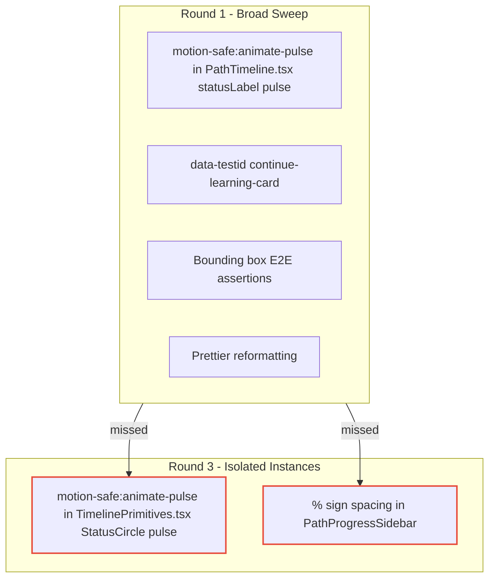

# Learning Track Detail UX Fix: Overlap Invariant, Atmosphere Removal, In-Progress Labeling

## Context

The `/learning-tracks/:trackId` detail page (PR #587, June 1) introduced a cinematic hero with a negative-margin overlap (`-mt-8 sm:-mt-10 lg:-mt-12`) that lifted the content cards (ContinueLearningBento, Syllabus, sidebar) onto the hero's lower edge. This overlap was intentional -- it created a "cards rise over the stage" film-poster effect. However, the overlap distance (32/40/48px) exceeded the hero's bottom padding (16/24/32px), causing the rising cards to land directly on the CTA button, avatar stack, and "X of N completed" text instead of on empty cover area above it.

Three separate UX problems were reported from live screenshots:

1. **CTA overlap** -- "Continue Learning" button partially covered by the ContinueLearningBento card
2. **Unwanted atmosphere** -- brown/orange blurred cover glow behind the content cards
3. **Redundant display** -- current course shown in both the "Continue Learning" card and as "Module 1" in the Syllabus

This run fixed all three across three implementation units plus two review rounds (R1, R3).

## Guidance

### 1. The overlap invariant: content overlap <= hero bottom padding below the CTA row

The critical insight that scoped the fix: the overlap between the rising content cards and the hero's interactive content is governed by a single geometric invariant.

```
hero-content height
  |--- padding-top
  |--- chips/title/description
  |--- CTA row              ← must NOT be overlapped
  |--- extra bottom padding  ← overlap zone (safe)
  |--- hero bottom edge
------------------------------
content cards rise via -mt-*
  |--- overlap distance must be ≤ extra bottom padding
```

The implementation solution:
- **Increase hero bottom padding** (`pb-10 sm:pb-12 lg:pb-14` instead of `pb-8 sm:pb-10 lg:pb-12`) -- raises the CTA row 8px higher at each breakpoint, so the cards overlap only empty cover area below the interactive row
- The negative margin stayed the same (preserving the cinematic effect)
- Total bottom padding was capped at 56px (14 * 4) on desktop to avoid pushing the CTA too high on short hero images

```tsx
// Before (PR #587): pb padding allowed overlap to collide with CTA
<div className="relative z-10 p-4 sm:p-6 lg:p-8 pb-8 sm:pb-10 lg:pb-12">

// After (PR #590): pb padding creates safe overlap zone below CTA
<div className="relative z-10 p-4 sm:p-6 lg:p-8 pb-10 sm:pb-12 lg:pb-14">
```

**E2E verification**: Three bounding-box tests per viewport (1440/768/375px) assert `hero-cta` bottom <= `continue-learning-card` top, plus no horizontal overflow. Each viewport uses its own seeded path ID (`lt-bbox-d`, `lt-bbox-t`, `lt-bbox-m`) to avoid cross-test IndexedDB contamination.

### 2. Component removal needs one clean sweep, not staged deletion

`PathCinematicAtmosphere` was a single-consumer component (only rendered in `LearningTrackDetail.tsx`, verified by repo grep). Deleting it required:
1. Remove the `<PathCinematicAtmosphere ... />` JSX render call
2. Remove the import statement
3. Delete the component file itself
4. Keep the wrapper's `relative z-10` (still needed for cards to stack above the hero's overlapped edge)

The atmosphere was previously adapted from `AudiobookPlayerAtmosphere` with `absolute inset-0 -z-10` positioning (not `fixed inset-0` like the player). No other consumer existed, so there was zero blast radius beyond the page file.

**Non-obvious**: Even though removing atmosphere is a purely decorative change that removes visual content, it still needs the test suite to re-verify -- the E2E tests that previously asserted specific color bands in the backdrop needed to be reviewed (they tested the cover image directly, not the atmosphere, so they remained valid).

### 3. Thread `hasRealProgress` through both render paths simultaneously

The "In Progress" vs "Up Next" labeling change required threading the `hasRealProgress` boolean through two separate render paths in `PathTimeline.tsx`:
- **Read-only path**: `CourseTimelineEntry` (inline, ~line 613)
- **Sortable/editable path**: `SortableCourseTimelineEntry` (separate component, ~line 678)

Both paths compute `hasRealProgress` the same way (`completionPct > 0 && not completed`), but the duplication quickly became a maintenance concern. The fix:

```tsx
// Before: inline computation duplicated twice (not extracted)
const hasRealProgress = (info?.completionPct ?? 0) > 0 && !isCompleted

// After: extracted to shared utility
import { isCourseInProgress } from '@/lib/progressUtils'
const hasRealProgress = isCourseInProgress(info?.completionPct, isCompleted)

// src/lib/progressUtils.ts
export function isCourseInProgress(
  completionPct: number | undefined | null,
  isCompleted: boolean,
): boolean {
  return (completionPct ?? 0) > 0 && !isCompleted
}
```

**Non-obvious**: `RoadmapListView.tsx` independently computed the same `isInProgress` logic (line ~147) but was not part of the original scope. The utility extraction commit (`b412f1b3`) updated it as well, turning a one-use fix into a cross-component refactor. Always grep for duplicate patterns before finalizing a utility extraction.

The `EntryActionButton` in `TimelinePrimitives.tsx` also needed a corresponding change -- the button text reads "Continue Module" when `hasRealProgress` is true, "Start Module" when false. The status label in the timeline entry reads "In Progress" vs "Up Next" via the same flag.

### 4. Review rounds catch different scopes -- plan for R1 + R3 sweep

This run had two review rounds:

**R1 (Round 1) findings** (commit `7cee2620`):
- `motion-safe:animate-pulse` prefix needed on the timeline entry's pulse indicator (`animate-pulse` without the `motion-safe:` prefix animates even for users with `prefers-reduced-motion: reduce`)
- `data-testid="continue-learning-card"` added for E2E locators
- Bounding box E2E assertions
- Prettier reformatting (pre-commit hooks reformatted many files)

**R3 (Round 3) findings** (commit `1713a992`):
- Second `animate-pulse` missed in `TimelinePrimitives.tsx` `StatusCircle` component (the in-progress pulse dot in the status circle, different from the status label pulse)
- `%` sign spacing in sidebar: the `Math.round(completionPct)` was on a separate `<span>` from `%`, creating an unwanted space (`< 1%` was correct but `50 %` read as `50 %` instead of `50%`)

The R3 findings were the two things R1's sweep missed. This is a pattern: review rounds that do broad sweeps can miss isolated instances of the same issue type. The fix: after applying findings, re-grep for ALL instances of the changed pattern, not just the ones the review report cited.

### 5. Sidebar and SummaryPanel rounding consistency

Rounding `estimatedRemainingHours` to a whole number (e.g., `210.3h` -> `~210h`) needed to be applied to both `PathProgressSidebar` and `PathSummaryPanel` because both consume from the same `usePathProgress` hook. Rounding only one would create a display inconsistency.

```tsx
// defensive guard for null/undefined
const displayHours = estimatedRemainingHours > 0
  ? Math.round(estimatedRemainingHours)
  : 0
```

**Non-obvious**: The `usePathProgress` hook returns `estimatedRemainingHours` with one decimal place (e.g., `210.3`). The sidebar and summary panel display it as `~${estimatedRemainingHours}h`. Without rounding, users see `~210.3h` which is harder to scan. The spec originally only called out the sidebar; the summary panel was caught during implementation because both use the same hook.

## Why This Matters

**Geometric invariants beat visual tuning.** The overlap fix didn't rely on eyeballing pixel values until "looks right." It established a clear invariant (`overlap <= padding`) and tuned within those bounds. This makes the fix deterministic, not aesthetic -- the E2E test proves the invariant holds at every viewport.

**Extract on the second consumer, not the first.** The `hasRealProgress` computation started as inline code in `PathTimeline.tsx`, used twice. That's two consumers -- immediately extract. Waiting until the third consumer (`RoadmapListView`) would have meant a second extraction. The `isCourseInProgress` utility was created during a standalone refactor commit (before the main feature commit), keeping the diff clean.

**Review rounds are a sieve, not a filter.** R1 caught broad issues. R3 caught two instances of the same pattern that R1 missed. Always `grep` for the pattern globally after applying review findings, not just in the files the review specifically cited.

## When to Apply

- Any negative-margin overlap between a hero and content area: establish and E2E-verify the geometric invariant
- Any single-consumer component deletion: verify no other consumers (repo grep), delete file + import + usage in one commit
- Any derived boolean prop used in both read-only and editable render paths: extract to a utility module immediately rather than duplicating
- After applying review findings from one round: globally grep for the same pattern in all related files
- When rounding a display value consumed in two components: apply to both simultaneously

## Examples

### Before and after: hero bottom padding

Before (PR #587 -- overlap collided with CTA):
```tsx
<div className="relative z-10 p-4 sm:p-6 lg:p-8 pb-8 sm:pb-10 lg:pb-12 "
     data-testid="hero-content-surface">
```

After (PR #590 -- 8px more bottom padding at each breakpoint):
```tsx
<div className="relative z-10 p-4 sm:p-6 lg:p-8 pb-10 sm:pb-12 lg:pb-14 "
     data-testid="hero-content-surface">
```

### Before and after: in-progress status label

Before (PR #587 -- all in-progress modules show "Up Next" / "Start Module"):
```
"Module 1: Photography Basics" → status "Up Next", button "Start Module"
"Module 2: Composition"       → status "Up Next", button "Start Module"
```

After (PR #590 -- in-progress module shows "In Progress" / "Continue Module"):
```
"Module 1: Photography Basics" → status "In Progress", button "Continue Module"
"Module 2: Composition"        → status "Up Next",    button "Start Module"
```

### E2E bounding box test pattern

```ts
const BBOX_VIEWPORTS = [
  { width: 1440, height: 900, label: 'desktop (1440px)' },
  { width: 768, height: 1024, label: 'tablet (768px)' },
  { width: 375, height: 812, label: 'mobile (375px)' },
]

for (const vp of BBOX_VIEWPORTS) {
  test(`bounding box at ${vp.label}: hero-cta does not overlap continue-learning card`, async ({
    page,
  }) => {
    const pathId = vp.width === 1440 ? 'lt-bbox-d' : /* ...unique per viewport */
    // ...seed with unique pathId to avoid cross-test IndexedDB contamination
    // ...seed progress data to 40% so ContinueLearningBento renders

    await page.setViewportSize({ width: vp.width, height: vp.height })
    await page.goto(`/learning-tracks/${pathId}`, { waitUntil: 'load' })
    await expect(page.getByTestId('hero-cta')).toBeVisible()
    await expect(page.getByTestId('continue-learning-card')).toBeVisible()

    const heroCtaBox = await page.getByTestId('hero-cta').boundingBox()
    const continueCardBox = await page.getByTestId('continue-learning-card').boundingBox()
    const ctaBottom = heroCtaBox!.y + heroCtaBox!.height
    const cardTop = continueCardBox!.y
    expect(ctaBottom).toBeLessThanOrEqual(cardTop)

    // Also assert no horizontal overflow
    const scrollWidth = await page.evaluate(() => document.documentElement.scrollWidth)
    const innerWidth = await page.evaluate(() => window.innerWidth)
    expect(scrollWidth).toBeLessThanOrEqual(innerWidth + 2)
  })
}
```

### Mermaid diagram: review finding propagation



## Related

- `docs/solutions/best-practices/learning-track-detail-cinematic-redesign-implementation-lessons-2026-06-01.md` -- the redesign this fix supersedes parts of. Note: the negative overlap value and `PathCinematicAtmosphere` described there were intentionally reduced/removed by this run.
- `docs/solutions/best-practices/learning-track-hero-cover-readability-contrast-testing-2026-06-01.md` -- WCAG contrast guarantee that was preserved (scrim, `data-testid` locators, cached-image ref promotion).
- `docs/solutions/best-practices/learning-path-detail-hero-redesign-lessons-2026-05-08.md` -- earlier hero redesign with full-width breakout pattern.
- `docs/solutions/best-practices/extract-shared-primitive-on-second-consumer-2026-04-18.md` -- the "extract on second consumer" rule this fix follows.
- `docs/solutions/best-practices/tailwind-v4-jit-class-literal-resolver-2026-04-25.md` -- Tailwind class interpolation rules followed here.
- `docs/plans/2026-06-03-001-fix-learning-track-detail-ux-plan.md` -- the implementation plan for this fix run.
- PR: https://github.com/PedroLages/knowlune/pull/590
